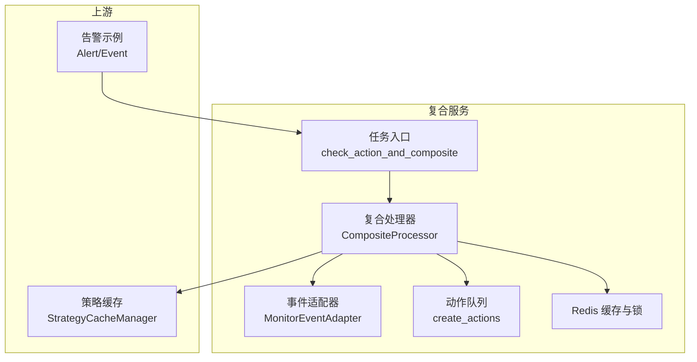
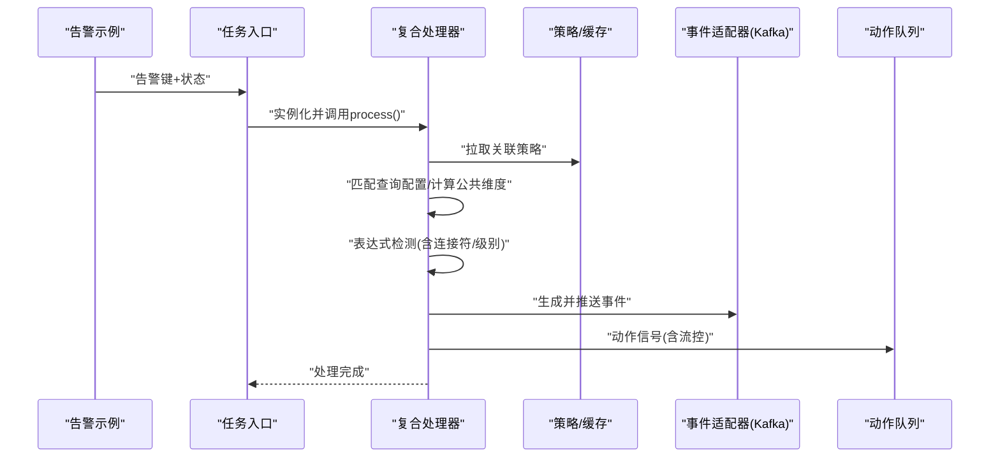
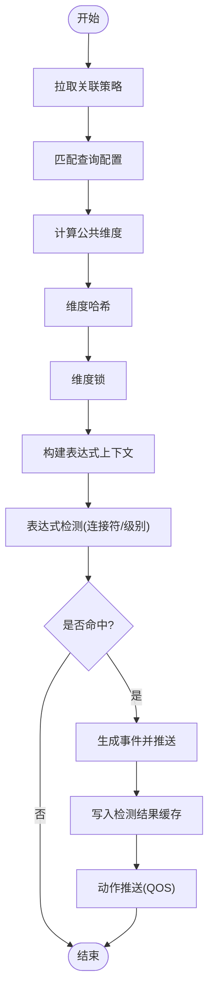
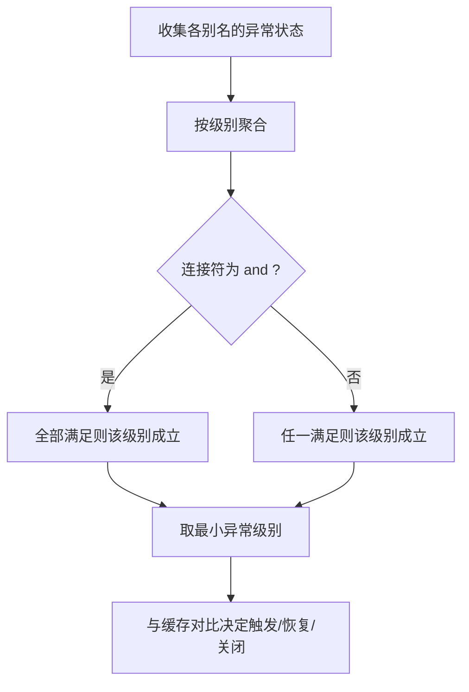
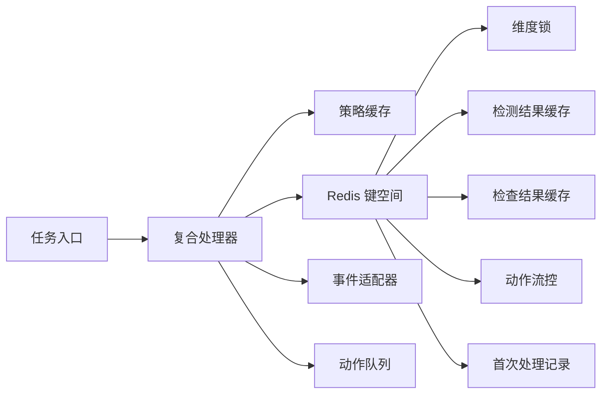

# 告警复合服务

<cite>
**本文引用的文件**
- [README.md](file://bkmonitor/alarm_backends/service/composite/README.md)
- [processor.py](file://bkmonitor/alarm_backends/service/composite/processor.py)
- [tasks.py](file://bkmonitor/alarm_backends/service/composite/tasks.py)
- [test_processor.py](file://bkmonitor/alarm_backends/tests/service/composite/test_processor.py)
- [key.py](file://bkmonitor/alarm_backends/core/cache/key.py)
- [processor.py](file://bkmonitor/alarm_backends/service/alert/processor.py)
- [resources.py](file://bkmonitor/packages/fta_web/alert/resources.py)
</cite>

## 目录
1. [简介](#简介)
2. [项目结构](#项目结构)
3. [核心组件](#核心组件)
4. [架构总览](#架构总览)
5. [详细组件分析](#详细组件分析)
6. [依赖分析](#依赖分析)
7. [性能考虑](#性能考虑)
8. [故障排查指南](#故障排查指南)
9. [结论](#结论)
10. [附录](#附录)

## 简介
本技术文档围绕告警复合服务展开，系统性阐述复合告警的组合逻辑、多条件判断与复杂规则处理机制，深入解析复合处理器的算法实现、权重计算与优先级排序策略，覆盖配置管理、规则引擎与动态更新能力，并提供性能优化、内存管理与故障恢复策略，确保在复杂告警场景下的稳定与高效运行。

## 项目结构
复合服务位于 alarm_backends 子模块中，主要由以下部分组成：
- 任务入口：Celery 任务，接收告警键与状态，调度复合处理器
- 复合处理器：负责策略拉取、维度匹配、表达式检测、事件生成与动作推送
- 缓存与锁：基于 Redis 的维度锁、检测结果缓存、动作流控与首次处理记录
- 单元测试：覆盖策略拉取、公共维度计算、表达式连接符、动作流控等关键路径

图表来源
- [tasks.py:14-81](file://bkmonitor/alarm_backends/service/composite/tasks.py#L14-L81)
- [processor.py:46-767](file://bkmonitor/alarm_backends/service/composite/processor.py#L46-L767)
- [key.py:677-745](file://bkmonitor/alarm_backends/core/cache/key.py#L677-L745)

章节来源
- [README.md:1-319](file://bkmonitor/alarm_backends/service/composite/README.md#L1-L319)
- [tasks.py:14-121](file://bkmonitor/alarm_backends/service/composite/tasks.py#L14-L121)
- [processor.py:46-767](file://bkmonitor/alarm_backends/service/composite/processor.py#L46-L767)
- [key.py:677-745](file://bkmonitor/alarm_backends/core/cache/key.py#L677-L745)

## 核心组件
- 任务入口：接收告警键与状态，加载告警、校验业务域、实例化处理器并执行处理流程
- 复合处理器：负责策略拉取、查询配置匹配、公共维度计算、维度哈希、并发锁、表达式检测、事件生成与动作推送
- 缓存与锁：维度锁避免重复生成、检测结果缓存用于跨周期比较、动作流控与首次处理记录防止重复推送
- 规则引擎：基于表达式解析器对策略表达式进行编译与求值，支持 and/or 连接符与多级别阈值
- 事件与动作：生成 data_type=alert 的事件回灌 Kafka，动作通过 Celery 队列异步执行

章节来源
- [tasks.py:14-81](file://bkmonitor/alarm_backends/service/composite/tasks.py#L14-L81)
- [processor.py:46-767](file://bkmonitor/alarm_backends/service/composite/processor.py#L46-L767)
- [key.py:677-745](file://bkmonitor/alarm_backends/core/cache/key.py#L677-L745)

## 架构总览
复合服务的职责边界明确：输入为已生成的告警，输出为新的关联告警事件，最终由统一告警链路完成落库与收敛。其核心流程如下：

图表来源
- [tasks.py:14-81](file://bkmonitor/alarm_backends/service/composite/tasks.py#L14-L81)
- [processor.py:46-767](file://bkmonitor/alarm_backends/service/composite/processor.py#L46-L767)
- [README.md:56-146](file://bkmonitor/alarm_backends/service/composite/README.md#L56-L146)

## 详细组件分析

### 复合处理器算法实现
- 策略拉取与过滤：根据告警的 strategy_id 或 alert_name 查询关联策略 ID，并加载策略快照
- 查询配置匹配：验证数据源标签与类型，结合聚合条件进行事件匹配
- 公共维度计算：取所有 query_config 的 agg_dimension 交集，决定维度哈希与去重键
- 维度哈希与并发控制：对维度值 MD5 计算，使用维度锁避免同一策略+维度并发重复生成
- 表达式检测：构建表达式上下文，解析并求值，支持 and/or 连接符与多级别判定
- 结果缓存与状态判定：对比缓存中的上次检测结果，确定触发/恢复/关闭
- 事件生成与推送：构造 data_type=alert 的事件，统一投递到 Kafka
- 动作推送与流控：根据 QOS 计数器决定是否推送动作信号，避免重复与过载

图表来源
- [processor.py:68-82](file://bkmonitor/alarm_backends/service/composite/processor.py#L68-L82)
- [processor.py:325-335](file://bkmonitor/alarm_backends/service/composite/processor.py#L325-L335)
- [processor.py:311-323](file://bkmonitor/alarm_backends/service/composite/processor.py#L311-L323)
- [processor.py:504-506](file://bkmonitor/alarm_backends/service/composite/processor.py#L504-L506)
- [processor.py:393-465](file://bkmonitor/alarm_backends/service/composite/processor.py#L393-L465)
- [processor.py:561-578](file://bkmonitor/alarm_backends/service/composite/processor.py#L561-L578)
- [processor.py:181-249](file://bkmonitor/alarm_backends/service/composite/processor.py#L181-L249)

章节来源
- [processor.py:68-82](file://bkmonitor/alarm_backends/service/composite/processor.py#L68-L82)
- [processor.py:311-335](file://bkmonitor/alarm_backends/service/composite/processor.py#L311-L335)
- [processor.py:393-465](file://bkmonitor/alarm_backends/service/composite/processor.py#L393-L465)
- [processor.py:561-578](file://bkmonitor/alarm_backends/service/composite/processor.py#L561-L578)
- [processor.py:181-249](file://bkmonitor/alarm_backends/service/composite/processor.py#L181-L249)

### 多条件判断与复杂规则处理
- 连接符与级别：同级别使用 and/or 连接符，不同级别按严重度升序比较，首个满足即确定异常级别
- 无数据与恢复：通过检测结果缓存判断是否仍有异常告警，从而决定恢复/关闭
- 表达式翻译：将别名映射为策略名称或指标 ID，提升描述可读性

图表来源
- [processor.py:403-435](file://bkmonitor/alarm_backends/service/composite/processor.py#L403-L435)
- [processor.py:441-465](file://bkmonitor/alarm_backends/service/composite/processor.py#L441-L465)

章节来源
- [processor.py:403-435](file://bkmonitor/alarm_backends/service/composite/processor.py#L403-L435)
- [processor.py:441-465](file://bkmonitor/alarm_backends/service/composite/processor.py#L441-L465)

### 权重计算与优先级排序
- 优先级：按严重度级别升序比较，首个满足的级别即为最终异常级别
- 无数据与恢复：若当前级别不满足但缓存中存在异常，则判定为恢复/关闭
- 动作信号：依据当前状态与缓存状态差异生成异常/恢复/关闭/确认/无数据等信号

章节来源
- [processor.py:452-465](file://bkmonitor/alarm_backends/service/composite/processor.py#L452-L465)
- [processor.py:639-722](file://bkmonitor/alarm_backends/service/composite/processor.py#L639-L722)

### 配置管理、规则引擎与动态更新
- 策略来源：通过策略缓存管理器按 strategy_id 或 alert_name 查询关联策略 ID，并加载策略快照
- 表达式引擎：使用表达式解析器编译策略表达式，支持别名翻译与连接符求值
- 动态更新：策略变更通过缓存刷新生效，表达式与连接符即时生效

章节来源
- [processor.py:68-82](file://bkmonitor/alarm_backends/service/composite/processor.py#L68-L82)
- [processor.py:263-279](file://bkmonitor/alarm_backends/service/composite/processor.py#L263-L279)
- [README.md:102-118](file://bkmonitor/alarm_backends/service/composite/README.md#L102-L118)

### 事件与动作处理
- 事件生成：构造 data_type=alert 的事件，包含策略 ID/名称、严重度、标签、去重键、时间戳等
- 事件推送：通过事件适配器统一投递到 Kafka，交由统一告警链路处理
- 动作推送：根据 QOS 计数器与首次处理记录决定是否推送动作信号，避免重复与过载

章节来源
- [processor.py:97-162](file://bkmonitor/alarm_backends/service/composite/processor.py#L97-L162)
- [processor.py:164-179](file://bkmonitor/alarm_backends/service/composite/processor.py#L164-L179)
- [processor.py:181-249](file://bkmonitor/alarm_backends/service/composite/processor.py#L181-L249)
- [README.md:191-277](file://bkmonitor/alarm_backends/service/composite/README.md#L191-L277)

### 任务调度与重试
- 任务入口：接收告警键与状态，若告警缺失则延迟重试，最多重试两次
- 处理耗时与错误统计：使用 Prometheus 指标记录处理耗时与状态

章节来源
- [tasks.py:14-81](file://bkmonitor/alarm_backends/service/composite/tasks.py#L14-L81)
- [tasks.py:83-121](file://bkmonitor/alarm_backends/service/composite/tasks.py#L83-L121)

## 依赖分析
复合服务的关键依赖关系如下：
- 任务入口依赖告警示例加载与策略缓存管理器
- 复合处理器依赖事件适配器、动作队列、缓存与锁
- 缓存键涵盖维度锁、检测结果、检查结果、动作流控与首次处理记录

图表来源
- [tasks.py:14-81](file://bkmonitor/alarm_backends/service/composite/tasks.py#L14-L81)
- [processor.py:46-767](file://bkmonitor/alarm_backends/service/composite/processor.py#L46-L767)
- [key.py:677-745](file://bkmonitor/alarm_backends/core/cache/key.py#L677-L745)

章节来源
- [key.py:677-745](file://bkmonitor/alarm_backends/core/cache/key.py#L677-L745)
- [processor.py:46-767](file://bkmonitor/alarm_backends/service/composite/processor.py#L46-L767)

## 性能考虑
- 并发控制：维度锁避免同一策略+维度并发重复生成，降低重复计算与事件风暴风险
- 缓存策略：检测结果缓存与检查结果缓存减少重复求值与跨周期比较成本
- 流控与去重：动作流控与首次处理记录避免重复推送与 QOS 过载
- 指标监控：处理耗时、事件推送计数、动作推送计数等指标便于容量与性能评估
- 重试与退避：任务入口具备有限重试与延迟重试机制，缓解瞬时不可用

章节来源
- [processor.py:504-506](file://bkmonitor/alarm_backends/service/composite/processor.py#L504-L506)
- [processor.py:181-249](file://bkmonitor/alarm_backends/service/composite/processor.py#L181-L249)
- [tasks.py:25-51](file://bkmonitor/alarm_backends/service/composite/tasks.py#L25-L51)

## 故障排查指南
- 告警未生成事件：检查策略是否存在、查询配置是否匹配、公共维度是否正确、维度锁是否阻塞
- 表达式未命中：核对表达式连接符与级别、检查上下文注入与缓存状态
- 动作未推送：确认 QOS 计数器阈值、首次处理记录键是否已存在
- 任务重试过多：关注告警缺失与业务域为空的跳过逻辑
- 关联告警清理：当告警为复合策略生成时，清理复合检测缓存与检查结果缓存

章节来源
- [processor.py:580-604](file://bkmonitor/alarm_backends/service/composite/processor.py#L580-L604)
- [processor.py:605-629](file://bkmonitor/alarm_backends/service/composite/processor.py#L605-L629)
- [tasks.py:54-60](file://bkmonitor/alarm_backends/service/composite/tasks.py#L54-L60)
- [processor.py:181-249](file://bkmonitor/alarm_backends/service/composite/processor.py#L181-L249)

## 结论
复合告警服务通过严格的策略拉取、维度匹配与表达式检测，实现了对已产生告警的二次关联分析与事件生成。借助维度锁、检测结果缓存与动作流控，系统在复杂场景下保持高可靠与高性能。配合完善的指标与日志，能够快速定位问题并持续优化。

## 附录
- 与其他模块的关系：与 alert 模块协作完成事件回灌与告警落库；与 action 模块协作完成动作信号推送；与 MonitorEventAdapter 协作完成事件投递
- 关联告警触发说明：复合服务不直接创建告警对象，而是生成 data_type=alert 的事件，由统一 alert 链路完成后续处理

章节来源
- [README.md:293-319](file://bkmonitor/alarm_backends/service/composite/README.md#L293-L319)
- [resources.py:904-908](file://bkmonitor/packages/fta_web/alert/resources.py#L904-L908)