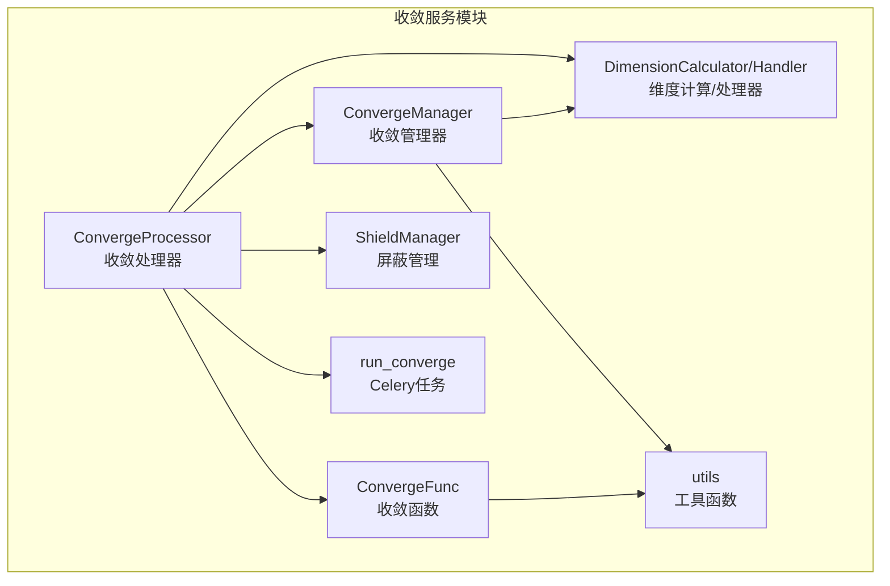
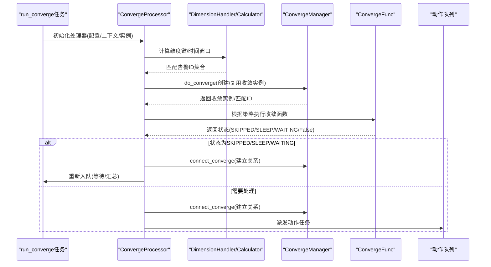
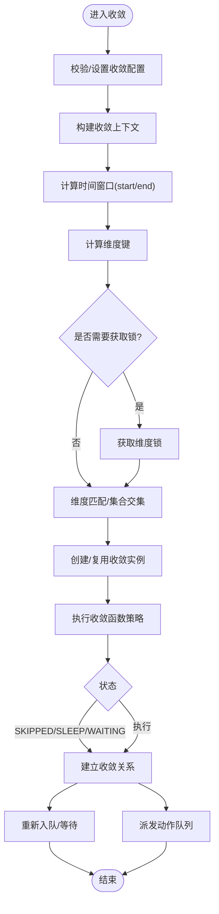
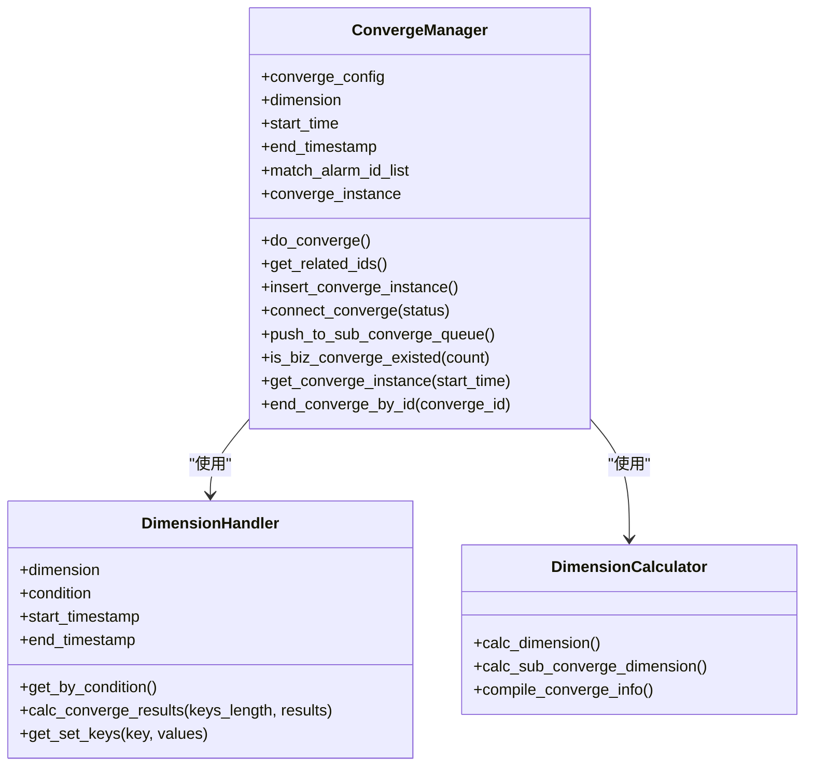
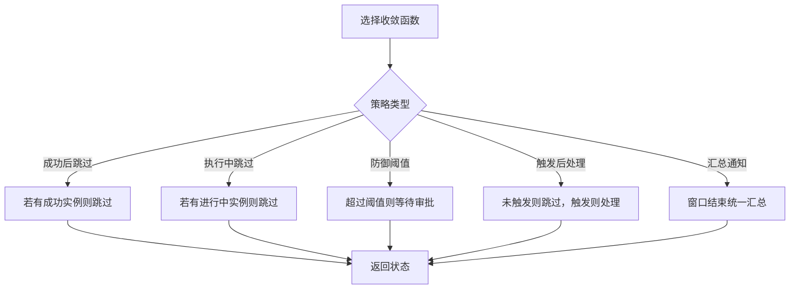
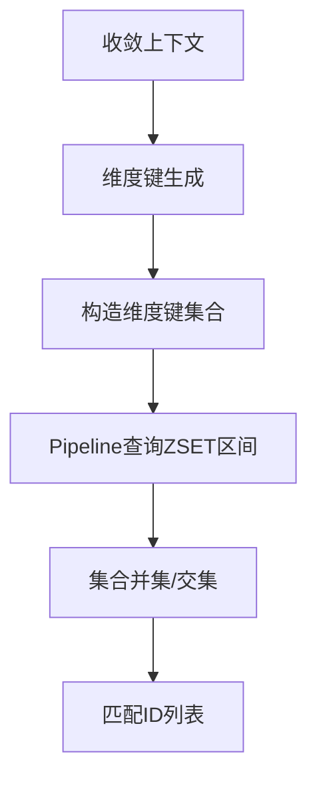
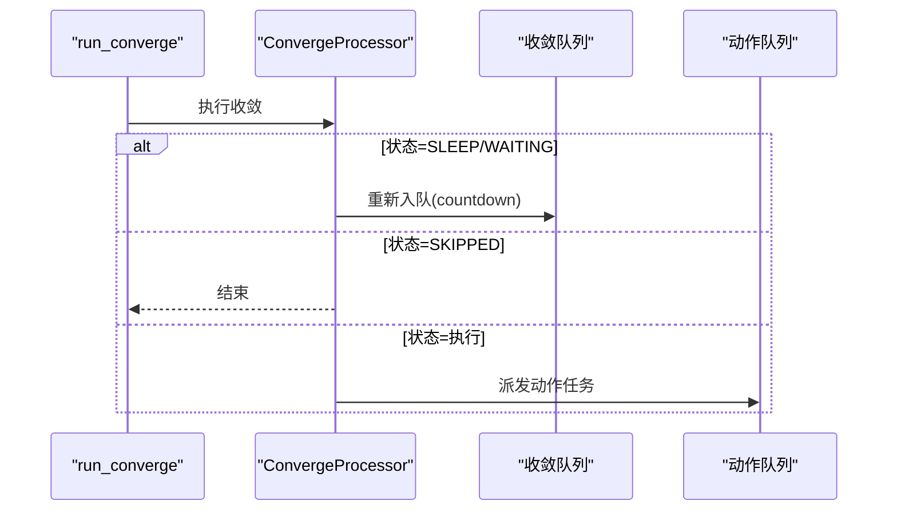
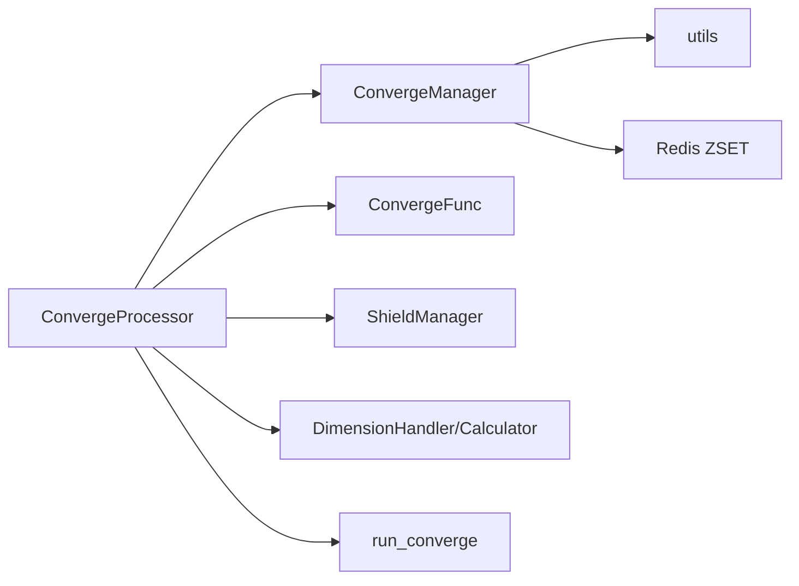

# 告警收敛服务

<cite>
**本文引用的文件**   
- [bkmonitor/alarm_backends/service/converge/processor.py](file://bkmonitor/alarm_backends/service/converge/processor.py)
- [bkmonitor/alarm_backends/service/converge/converge_manger.py](file://bkmonitor/alarm_backends/service/converge/converge_manger.py)
- [bkmonitor/alarm_backends/service/converge/converge_func.py](file://bkmonitor/alarm_backends/service/converge/converge_func.py)
- [bkmonitor/alarm_backends/service/converge/dimension.py](file://bkmonitor/alarm_backends/service/converge/dimension.py)
- [bkmonitor/alarm_backends/service/converge/tasks.py](file://bkmonitor/alarm_backends/service/converge/tasks.py)
- [bkmonitor/alarm_backends/service/converge/utils.py](file://bkmonitor/alarm_backends/service/converge/utils.py)
- [bkmonitor/alarm_backends/service/converge/shield/manager.py](file://bkmonitor/alarm_backends/service/converge/shield/manager.py)
- [bkmonitor/alarm_backends/constants.py](file://bkmonitor/alarm_backends/constants.py)
</cite>

## 目录
1. [简介](#简介)
2. [项目结构](#项目结构)
3. [核心组件](#核心组件)
4. [架构总览](#架构总览)
5. [详细组件分析](#详细组件分析)
6. [依赖分析](#依赖分析)
7. [性能考量](#性能考量)
8. [故障排查指南](#故障排查指南)
9. [结论](#结论)
10. [附录](#附录)

## 简介
本文件面向告警收敛服务，系统化阐述告警收敛的算法实现、重复检测与去重机制、维度分析、时间窗口管理与批量处理策略；并覆盖收敛规则的配置、动态调整与性能优化方法，以及收敛效果的监控指标、统计分析与调优建议，帮助在复杂场景下有效传递关键告警、避免信息过载。

## 项目结构
告警收敛服务位于 alarm_backends 的 converge 子模块，围绕“收敛处理器”“收敛管理器”“收敛函数”“维度计算器/处理器”“任务调度”“屏蔽管理”“工具函数”等模块协同工作，形成从规则解析、维度计算、时间窗口匹配、并发控制到任务派发的完整闭环。

**图表来源**
- [bkmonitor/alarm_backends/service/converge/processor.py:55-503](file://bkmonitor/alarm_backends/service/converge/processor.py#L55-L503)
- [bkmonitor/alarm_backends/service/converge/converge_manger.py:40-399](file://bkmonitor/alarm_backends/service/converge/converge_manger.py#L40-L399)
- [bkmonitor/alarm_backends/service/converge/converge_func.py:29-291](file://bkmonitor/alarm_backends/service/converge/converge_func.py#L29-L291)
- [bkmonitor/alarm_backends/service/converge/dimension.py:34-252](file://bkmonitor/alarm_backends/service/converge/dimension.py#L34-L252)
- [bkmonitor/alarm_backends/service/converge/tasks.py:24-90](file://bkmonitor/alarm_backends/service/converge/tasks.py#L24-L90)
- [bkmonitor/alarm_backends/service/converge/utils.py:16-70](file://bkmonitor/alarm_backends/service/converge/utils.py#L16-L70)
- [bkmonitor/alarm_backends/service/converge/shield/manager.py:18-56](file://bkmonitor/alarm_backends/service/converge/shield/manager.py#L18-L56)

**章节来源**
- [bkmonitor/alarm_backends/service/converge/processor.py:55-503](file://bkmonitor/alarm_backends/service/converge/processor.py#L55-L503)
- [bkmonitor/alarm_backends/service/converge/converge_manger.py:40-399](file://bkmonitor/alarm_backends/service/converge/converge_manger.py#L40-L399)
- [bkmonitor/alarm_backends/service/converge/converge_func.py:29-291](file://bkmonitor/alarm_backends/service/converge/converge_func.py#L29-L291)
- [bkmonitor/alarm_backends/service/converge/dimension.py:34-252](file://bkmonitor/alarm_backends/service/converge/dimension.py#L34-L252)
- [bkmonitor/alarm_backends/service/converge/tasks.py:24-90](file://bkmonitor/alarm_backends/service/converge/tasks.py#L24-L90)
- [bkmonitor/alarm_backends/service/converge/utils.py:16-70](file://bkmonitor/alarm_backends/service/converge/utils.py#L16-L70)
- [bkmonitor/alarm_backends/service/converge/shield/manager.py:18-56](file://bkmonitor/alarm_backends/service/converge/shield/manager.py#L18-L56)

## 核心组件
- 收敛处理器（ConvergeProcessor）
  - 解析收敛配置、构建时间窗口、计算收敛维度、并发锁控制、屏蔽检测、状态更新与队列派发。
- 收敛管理器（ConvergeManager）
  - 查找/创建收敛实例、匹配相关告警、建立收敛关系、二级收敛推送、维度锁定与结束收敛。
- 收敛函数（ConvergeFunc）
  - 提供多种收敛策略：成功后跳过、执行中跳过、失败审批、防御阈值、触发后处理、汇总通知等。
- 维度计算器/处理器（DimensionCalculator/Handler）
  - 将收敛上下文映射为维度键，基于 Redis ZSET 实现时间窗口内的集合交集匹配。
- 任务（run_converge）
  - Celery 任务入口，封装异常重试、耗时与计数指标上报。
- 屏蔽管理（ShieldManager）
  - 全局屏蔽与告警配置/时段屏蔽组合判定，优先级最高。
- 工具函数（utils）
  - 关联收敛关系查询、已执行动作查询、相关动作获取等。

**章节来源**
- [bkmonitor/alarm_backends/service/converge/processor.py:55-503](file://bkmonitor/alarm_backends/service/converge/processor.py#L55-L503)
- [bkmonitor/alarm_backends/service/converge/converge_manger.py:40-399](file://bkmonitor/alarm_backends/service/converge/converge_manger.py#L40-L399)
- [bkmonitor/alarm_backends/service/converge/converge_func.py:29-291](file://bkmonitor/alarm_backends/service/converge/converge_func.py#L29-L291)
- [bkmonitor/alarm_backends/service/converge/dimension.py:34-252](file://bkmonitor/alarm_backends/service/converge/dimension.py#L34-L252)
- [bkmonitor/alarm_backends/service/converge/tasks.py:24-90](file://bkmonitor/alarm_backends/service/converge/tasks.py#L24-L90)
- [bkmonitor/alarm_backends/service/converge/shield/manager.py:18-56](file://bkmonitor/alarm_backends/service/converge/shield/manager.py#L18-L56)
- [bkmonitor/alarm_backends/service/converge/utils.py:16-70](file://bkmonitor/alarm_backends/service/converge/utils.py#L16-L70)

## 架构总览
告警收敛的整体流程如下：收敛处理器解析配置与上下文，计算维度与时间窗口，通过维度处理器在 Redis 中检索匹配的告警集合，结合收敛管理器创建/复用收敛实例并建立关系，随后根据收敛函数策略决定跳过、等待、汇总或继续处理，并最终派发到动作队列或收敛队列。

**图表来源**
- [bkmonitor/alarm_backends/service/converge/tasks.py:24-90](file://bkmonitor/alarm_backends/service/converge/tasks.py#L24-L90)
- [bkmonitor/alarm_backends/service/converge/processor.py:186-328](file://bkmonitor/alarm_backends/service/converge/processor.py#L186-L328)
- [bkmonitor/alarm_backends/service/converge/converge_manger.py:84-128](file://bkmonitor/alarm_backends/service/converge/converge_manger.py#L84-L128)
- [bkmonitor/alarm_backends/service/converge/converge_func.py:178-291](file://bkmonitor/alarm_backends/service/converge/converge_func.py#L178-L291)

## 详细组件分析

### 收敛处理器（ConvergeProcessor）
- 职责
  - 解析收敛配置（含默认值）、构造时间窗口（最小/最大收敛窗口）、计算维度键、并发锁控制、屏蔽检测、状态更新与队列派发。
- 关键点
  - 时间窗口：按 max_timedelta 或 timedelta 构造起止时间戳，支持“首次窗口”与“最大窗口”两阶段匹配。
  - 并发控制：基于维度键的 Redis 计数锁，限制同一维度并发收敛数，避免资源争用。
  - 屏蔽优先：若命中屏蔽规则，直接返回屏蔽状态并记录日志与输出。
  - 状态回写：根据收敛结果更新 ActionInstance 状态、结束时间、轮询标志等字段。
  - 队列派发：根据状态决定派发动作队列或重新入收敛队列（带退避）。
- 算法复杂度
  - 维度计算与锁操作为 O(1)，Redis 查询与集合交集为 O(k·m)（k 为维度键数量，m 为每键匹配项数）。

**图表来源**
- [bkmonitor/alarm_backends/service/converge/processor.py:186-328](file://bkmonitor/alarm_backends/service/converge/processor.py#L186-L328)
- [bkmonitor/alarm_backends/service/converge/dimension.py:81-107](file://bkmonitor/alarm_backends/service/converge/dimension.py#L81-L107)
- [bkmonitor/alarm_backends/service/converge/converge_manger.py:84-128](file://bkmonitor/alarm_backends/service/converge/converge_manger.py#L84-L128)

**章节来源**
- [bkmonitor/alarm_backends/service/converge/processor.py:55-503](file://bkmonitor/alarm_backends/service/converge/processor.py#L55-L503)

### 收敛管理器（ConvergeManager）
- 职责
  - 查找/创建 ConvergeInstance，匹配相关 Action/Converge 实例，建立 ConvergeRelation，处理二级收敛推送与业务维度锁。
- 关键点
  - 匹配算法：对每个维度键构造 Redis ZSET 查询区间，取集合交集得到匹配 ID 列表。
  - 关系建立：区分主/从实例，记录收敛状态与告警列表，必要时抑制其他收敛可见性。
  - 二级收敛：当启用子收敛配置且业务维度计数达标时，推送子收敛任务至队列。
  - 结束收敛：按需关闭收敛实例并固定维度键，防止跨窗口误判。
- 数据结构
  - ConvergeInstance：收敛实例记录（维度、描述、配置、状态等）。
  - ConvergeRelation：收敛关系表（收敛ID-关联ID、类型、状态、告警列表）。

**图表来源**
- [bkmonitor/alarm_backends/service/converge/converge_manger.py:40-399](file://bkmonitor/alarm_backends/service/converge/converge_manger.py#L40-L399)
- [bkmonitor/alarm_backends/service/converge/dimension.py:34-252](file://bkmonitor/alarm_backends/service/converge/dimension.py#L34-L252)

**章节来源**
- [bkmonitor/alarm_backends/service/converge/converge_manger.py:40-399](file://bkmonitor/alarm_backends/service/converge/converge_manger.py#L40-L399)

### 收敛函数（ConvergeFunc）
- 职责
  - 提供多种收敛策略：成功后跳过、执行中跳过、失败审批、防御阈值、触发后处理、汇总通知等。
- 关键点
  - 成功后跳过：若存在其他成功收敛实例则跳过当前。
  - 执行中跳过：若存在进行中收敛实例则跳过当前。
  - 防御阈值：超过设定数量则等待审批。
  - 触发后处理：仅在满足条件后才处理。
  - 汇总通知：在窗口结束时统一发送汇总通知。
- 适用场景
  - 避免重复处理、降低风暴影响、统一对外通知口径。

**图表来源**
- [bkmonitor/alarm_backends/service/converge/converge_func.py:50-291](file://bkmonitor/alarm_backends/service/converge/converge_func.py#L50-L291)

**章节来源**
- [bkmonitor/alarm_backends/service/converge/converge_func.py:29-291](file://bkmonitor/alarm_backends/service/converge/converge_func.py#L29-L291)

### 维度分析与时间窗口管理
- 维度计算
  - 使用收敛上下文中的维度字段，生成稳定维度键；对列表值进行摘要化处理，避免键过长。
  - 二级收敛维度采用标签拼接方式，去除策略ID以避免哈希槽分散。
- 时间窗口
  - 支持“最小收敛窗口”与“最大收敛窗口”，分别用于首次匹配与兜底结束。
  - Redis ZSET 存储每个维度键下的告警时间戳，查询时按区间取并集再求交集。
- 批量处理策略
  - 通过 Redis Pipeline 批量查询多个维度键，减少 RTT。
  - 交集计算在内存中完成，复杂度与维度数量线性相关。

**图表来源**
- [bkmonitor/alarm_backends/service/converge/dimension.py:81-107](file://bkmonitor/alarm_backends/service/converge/dimension.py#L81-L107)
- [bkmonitor/alarm_backends/service/converge/dimension.py:160-252](file://bkmonitor/alarm_backends/service/converge/dimension.py#L160-L252)

**章节来源**
- [bkmonitor/alarm_backends/service/converge/dimension.py:34-252](file://bkmonitor/alarm_backends/service/converge/dimension.py#L34-L252)

### 任务与队列派发
- 任务入口
  - run_converge 作为 Celery 任务，负责异常捕获、重试（最多3次）、耗时与计数指标上报。
- 派发策略
  - 若收敛状态为 SLEEP/WAITING：重新入队，带退避时间。
  - 若为 SKIPPED：仅建立关系，不派发动作。
  - 若为执行：派发动作队列，通知类动作支持汇总合并键。

**图表来源**
- [bkmonitor/alarm_backends/service/converge/tasks.py:24-90](file://bkmonitor/alarm_backends/service/converge/tasks.py#L24-L90)
- [bkmonitor/alarm_backends/service/converge/processor.py:412-476](file://bkmonitor/alarm_backends/service/converge/processor.py#L412-L476)

**章节来源**
- [bkmonitor/alarm_backends/service/converge/tasks.py:24-90](file://bkmonitor/alarm_backends/service/converge/tasks.py#L24-L90)
- [bkmonitor/alarm_backends/service/converge/processor.py:412-503](file://bkmonitor/alarm_backends/service/converge/processor.py#L412-L503)

### 屏蔽与去重
- 屏蔽管理
  - 全局屏蔽优先；随后按告警配置/时段屏蔽逐条评估，任一不满足即整体屏蔽。
- 去重与关联
  - 通过 ConvergeRelation 记录收敛关系，避免重复处理；对二级收敛可抑制一级可见性。
- 工具函数
  - 提供已执行动作查询、相关动作获取、匹配ID过滤等辅助能力。

**章节来源**
- [bkmonitor/alarm_backends/service/converge/shield/manager.py:18-56](file://bkmonitor/alarm_backends/service/converge/shield/manager.py#L18-L56)
- [bkmonitor/alarm_backends/service/converge/utils.py:16-70](file://bkmonitor/alarm_backends/service/converge/utils.py#L16-L70)
- [bkmonitor/alarm_backends/service/converge/converge_manger.py:297-355](file://bkmonitor/alarm_backends/service/converge/converge_manger.py#L297-L355)

## 依赖分析
- 组件耦合
  - ConvergeProcessor 依赖 DimensionHandler/Calculator、ConvergeManager、ConvergeFunc、ShieldManager、utils 与 Celery 任务。
  - ConvergeManager 依赖 Redis 键空间与数据库模型（ConvergeInstance/Relation）。
- 外部依赖
  - Redis：ZSET 存储维度键与时间戳，Pipeline 批量查询。
  - Celery：收敛任务队列与动作派发。
  - Django ORM：收敛实例与关系的持久化。
- 循环依赖
  - 无直接循环依赖；任务入口通过延迟导入避免循环引用。

**图表来源**
- [bkmonitor/alarm_backends/service/converge/processor.py:55-503](file://bkmonitor/alarm_backends/service/converge/processor.py#L55-L503)
- [bkmonitor/alarm_backends/service/converge/converge_manger.py:40-399](file://bkmonitor/alarm_backends/service/converge/converge_manger.py#L40-L399)
- [bkmonitor/alarm_backends/service/converge/tasks.py:24-90](file://bkmonitor/alarm_backends/service/converge/tasks.py#L24-L90)

**章节来源**
- [bkmonitor/alarm_backends/service/converge/processor.py:55-503](file://bkmonitor/alarm_backends/service/converge/processor.py#L55-L503)
- [bkmonitor/alarm_backends/service/converge/converge_manger.py:40-399](file://bkmonitor/alarm_backends/service/converge/converge_manger.py#L40-L399)

## 性能考量
- 维度键长度与哈希
  - 列表值进行摘要化与截断，避免键过长；维度键使用 SHA1 摘要，保证稳定性与长度可控。
- Redis 查询优化
  - 使用 Pipeline 批量查询多个维度键；ZSET 区间查询避免全表扫描；定期清理过期数据。
- 并发控制
  - 维度锁并发上限按收敛阈值的一半设置，避免热点维度拥塞；超时自动过期，防止死锁。
- 队列退避与重试
  - SLEEP/WAITING 场景采用指数/固定退避；异常重试最多 3 次，避免雪崩。
- 指标监控
  - 收敛处理耗时、处理计数、状态分布、队列延迟等指标，便于容量规划与调优。

[本节为通用性能指导，无需具体文件分析]

## 故障排查指南
- 常见问题定位
  - 无法获取收敛锁：检查维度锁计数与 TTL，确认并发阈值设置是否合理。
  - 匹配不到告警：核对收敛条件与维度键生成逻辑，确认时间窗口是否正确。
  - 重复收敛：检查 ConvergeRelation 是否正确建立，是否存在未结束收敛实例。
  - 屏蔽导致不收敛：查看 ShieldManager 判定链路与屏蔽规则。
- 日志与指标
  - 任务执行日志、状态变更日志、Redis 查询日志、队列延迟与耗时指标。
- 重试与回滚
  - 任务异常自动重试；必要时手动终止/重启收敛实例，确保维度固定与关系清理。

**章节来源**
- [bkmonitor/alarm_backends/service/converge/tasks.py:43-89](file://bkmonitor/alarm_backends/service/converge/tasks.py#L43-L89)
- [bkmonitor/alarm_backends/service/converge/processor.py:220-245](file://bkmonitor/alarm_backends/service/converge/processor.py#L220-L245)
- [bkmonitor/alarm_backends/service/converge/converge_manger.py:227-242](file://bkmonitor/alarm_backends/service/converge/converge_manger.py#L227-L242)

## 结论
告警收敛服务通过“维度键+时间窗口+并发锁+策略函数”的组合，实现了高并发、低延迟、可扩展的告警收敛与去重。配合屏蔽管理、关系建模与队列派发，能够在复杂场景下有效抑制风暴、统一对外通知，并提供完善的监控与调优手段。

[本节为总结性内容，无需具体文件分析]

## 附录

### 收敛规则配置要点
- 收敛函数（converge_func）
  - 支持“成功后跳过”“执行中跳过”“失败审批”“防御阈值”“触发后处理”“汇总通知”等策略。
- 条件（condition）
  - 定义参与收敛的维度与取值，支持“self”占位符自动替换为上下文值。
- 阈值与窗口（count/timedelta/max_timedelta）
  - count：触发收敛所需的告警数量；timedelta：最小收敛窗口；max_timedelta：最大收敛窗口。
- 二级收敛（sub_converge_config/need_biz_converge）
  - 启用后按业务维度独立收敛，并通过 Redis 计数锁控制并发。

**章节来源**
- [bkmonitor/alarm_backends/service/converge/processor.py:141-159](file://bkmonitor/alarm_backends/service/converge/processor.py#L141-L159)
- [bkmonitor/alarm_backends/service/converge/converge_func.py:178-291](file://bkmonitor/alarm_backends/service/converge/converge_func.py#L178-L291)
- [bkmonitor/alarm_backends/service/converge/converge_manger.py:130-174](file://bkmonitor/alarm_backends/service/converge/converge_manger.py#L130-L174)

### 动态调整与优化建议
- 动态调整
  - 根据业务峰值动态调整 count 与窗口；针对热点维度提高并发阈值或拆分维度。
- 优化建议
  - 控制维度键数量与长度，避免过多维度导致交集计算开销增大。
  - 合理设置 max_timedelta，避免窗口过大造成资源占用。
  - 对高频动作启用汇总通知，降低外部通知压力。

**章节来源**
- [bkmonitor/alarm_backends/service/converge/dimension.py:160-252](file://bkmonitor/alarm_backends/service/converge/dimension.py#L160-L252)
- [bkmonitor/alarm_backends/service/converge/processor.py:119-138](file://bkmonitor/alarm_backends/service/converge/processor.py#L119-L138)

### 监控指标与统计分析
- 指标
  - 收敛处理耗时（CONVERGE_PROCESS_TIME）、收敛处理计数（CONVERGE_PROCESS_COUNT）、派发动作计数（CONVERGE_PUSH_ACTION_COUNT）、派发收敛计数（CONVERGE_PUSH_CONVERGE_COUNT）。
- 统计
  - 按业务、插件类型、信号、实例类型统计收敛成功率、等待率、跳过率与异常率，指导规则调优。

**章节来源**
- [bkmonitor/alarm_backends/service/converge/tasks.py:78-89](file://bkmonitor/alarm_backends/service/converge/tasks.py#L78-L89)
- [bkmonitor/alarm_backends/service/converge/processor.py:477-482](file://bkmonitor/alarm_backends/service/converge/processor.py#L477-L482)