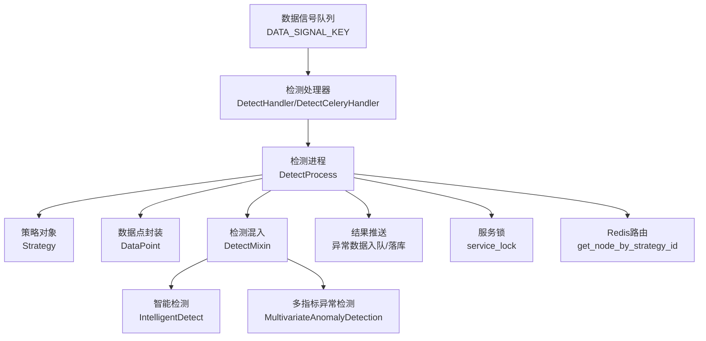
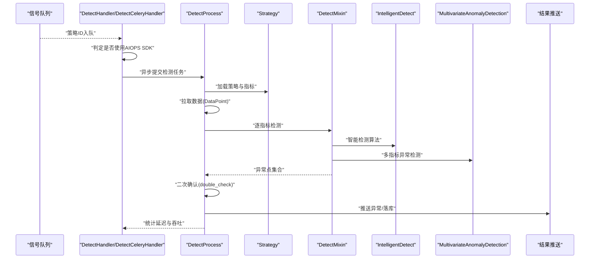
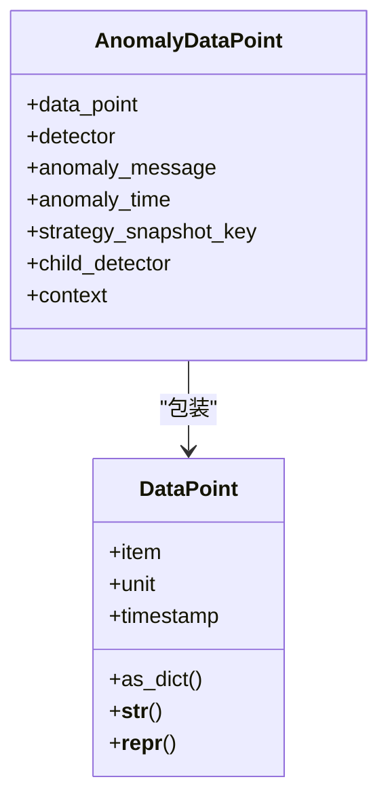
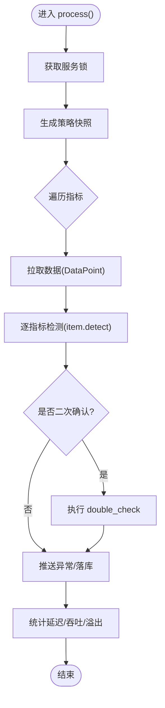
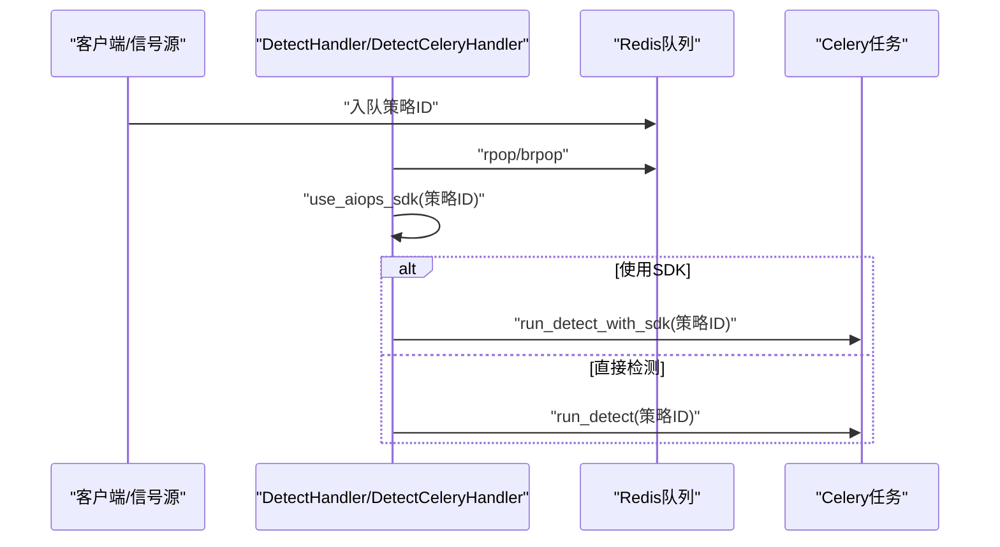
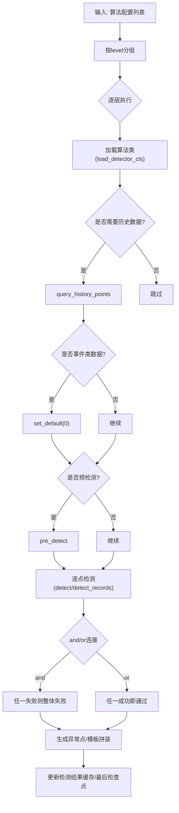
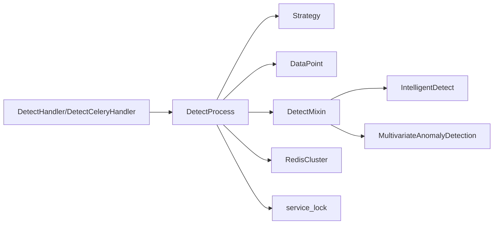

# 告警检测服务

<cite>
**本文引用的文件**
- [bkmonitor/alarm_backends/constants.py](file://bkmonitor/alarm_backends/constants.py)
- [bkmonitor/alarm_backends/service/detect/core.py](file://bkmonitor/alarm_backends/service/detect/core.py)
- [bkmonitor/alarm_backends/service/detect/handler.py](file://bkmonitor/alarm_backends/service/detect/handler.py)
- [bkmonitor/alarm_backends/service/detect/process.py](file://bkmonitor/alarm_backends/service/detect/process.py)
- [bkmonitor/alarm_backends/core/control/mixins/detect.py](file://bkmonitor/alarm_backends/core/control/mixins/detect.py)
- [bkmonitor/alarm_backends/service/detect/strategy/intelligent_detect.py](file://bkmonitor/alarm_backends/service/detect/strategy/intelligent_detect.py)
- [bkmonitor/alarm_backends/service/detect/strategy/multivariate_anomaly_detection.py](file://bkmonitor/alarm_backends/service/detect/strategy/multivariate_anomaly_detection.py)
- [bkmonitor/alarm_backends/core/storage/redis_cluster.py](file://bkmonitor/alarm_backends/core/storage/redis_cluster.py)
- [bkmonitor/alarm_backends/core/lock/service_lock.py](file://bkmonitor/alarm_backends/core/lock/service_lock.py)
</cite>

## 目录
1. [简介](#简介)
2. [项目结构](#项目结构)
3. [核心组件](#核心组件)
4. [架构总览](#架构总览)
5. [详细组件分析](#详细组件分析)
6. [依赖分析](#依赖分析)
7. [性能考量](#性能考量)
8. [故障排查指南](#故障排查指南)
9. [结论](#结论)
10. [附录](#附录)

## 简介
本技术文档面向“告警检测服务”，系统化阐述检测算法实现、数据处理流程与任务调度机制，重点覆盖以下方面：
- 检测处理器的工作原理、并发处理策略与资源管理
- 检测任务的生命周期管理、异常处理与重试机制
- 检测精度优化、性能调优与监控指标
- 数据结构与算法复杂度、依赖链路与潜在风险点

目标是帮助读者在理解现有实现的基础上，安全地扩展与优化检测能力，确保准确性与高可用。

## 项目结构
告警检测服务位于 alarm_backends 子系统内，围绕“策略解析—数据拉取—算法检测—结果落库—异常推送”形成闭环。关键模块包括：
- 核心数据结构：DataPoint、AnomalyDataPoint
- 检测处理器：DetectProcess（负责单策略的完整检测周期）
- 调度器：DetectHandler/DetectCeleryHandler（负责从信号队列取策略并异步派发）
- 策略与算法：DetectMixin（组合/编排多算法）、具体算法实现（如智能检测、多指标异常检测）
- 存储与路由：RedisCluster（按策略ID路由到具体节点）
- 并发与锁：service_lock（单策略串行、跨进程互斥）

图表来源
- [bkmonitor/alarm_backends/service/detect/handler.py:26-89](file://bkmonitor/alarm_backends/service/detect/handler.py#L26-L89)
- [bkmonitor/alarm_backends/service/detect/process.py:29-188](file://bkmonitor/alarm_backends/service/detect/process.py#L29-L188)
- [bkmonitor/alarm_backends/core/control/mixins/detect.py:53-227](file://bkmonitor/alarm_backends/core/control/mixins/detect.py#L53-L227)
- [bkmonitor/alarm_backends/service/detect/strategy/intelligent_detect.py:37-110](file://bkmonitor/alarm_backends/service/detect/strategy/intelligent_detect.py#L37-L110)
- [bkmonitor/alarm_backends/service/detect/strategy/multivariate_anomaly_detection.py:29-49](file://bkmonitor/alarm_backends/service/detect/strategy/multivariate_anomaly_detection.py#L29-L49)
- [bkmonitor/alarm_backends/core/storage/redis_cluster.py:195-226](file://bkmonitor/alarm_backends/core/storage/redis_cluster.py#L195-L226)
- [bkmonitor/alarm_backends/core/lock/service_lock.py:22-38](file://bkmonitor/alarm_backends/core/lock/service_lock.py#L22-L38)

章节来源
- [bkmonitor/alarm_backends/service/detect/core.py:17-68](file://bkmonitor/alarm_backends/service/detect/core.py#L17-L68)
- [bkmonitor/alarm_backends/service/detect/process.py:29-188](file://bkmonitor/alarm_backends/service/detect/process.py#L29-L188)
- [bkmonitor/alarm_backends/service/detect/handler.py:26-89](file://bkmonitor/alarm_backends/service/detect/handler.py#L26-L89)
- [bkmonitor/alarm_backends/core/control/mixins/detect.py:53-227](file://bkmonitor/alarm_backends/core/control/mixins/detect.py#L53-L227)
- [bkmonitor/alarm_backends/service/detect/strategy/intelligent_detect.py:37-110](file://bkmonitor/alarm_backends/service/detect/strategy/intelligent_detect.py#L37-L110)
- [bkmonitor/alarm_backends/service/detect/strategy/multivariate_anomaly_detection.py:29-49](file://bkmonitor/alarm_backends/service/detect/strategy/multivariate_anomaly_detection.py#L29-L49)
- [bkmonitor/alarm_backends/core/storage/redis_cluster.py:195-226](file://bkmonitor/alarm_backends/core/storage/redis_cluster.py#L195-L226)
- [bkmonitor/alarm_backends/core/lock/service_lock.py:22-38](file://bkmonitor/alarm_backends/core/lock/service_lock.py#L22-L38)

## 核心组件
- 数据点封装
  - DataPoint：对上游接入数据进行统一封装，暴露 value、timestamp、unit、item 等字段，并保留原始输入以便回溯。
  - AnomalyDataPoint：检测后产生的异常点，承载异常消息、异常时间、策略快照键、上下文等。
- 检测处理器 DetectProcess
  - 单策略维度的完整检测生命周期：拉取数据、逐指标检测、二次确认、推送异常、统计延迟与吞吐。
  - 支持批量拉取上限控制与“繁忙”标记，避免积压导致的严重延迟。
- 调度器 DetectHandler/DetectCeleryHandler
  - 从信号队列阻塞/非阻塞拉取策略ID，按策略配置选择是否走 AIOPS SDK 路径，异步提交 Celery 任务。
- 策略与算法 DetectMixin
  - 将策略中的多个算法按层级与连接符组合，支持历史数据查询、预检测、模板消息拼装与结果合并。
- Redis 路由与锁
  - 按策略ID路由到具体 Redis 节点，保障数据隔离；通过服务锁确保同一策略在同一时刻仅有一个检测进程运行。

章节来源
- [bkmonitor/alarm_backends/service/detect/core.py:17-68](file://bkmonitor/alarm_backends/service/detect/core.py#L17-L68)
- [bkmonitor/alarm_backends/service/detect/process.py:29-188](file://bkmonitor/alarm_backends/service/detect/process.py#L29-L188)
- [bkmonitor/alarm_backends/service/detect/handler.py:26-89](file://bkmonitor/alarm_backends/service/detect/handler.py#L26-L89)
- [bkmonitor/alarm_backends/core/control/mixins/detect.py:53-227](file://bkmonitor/alarm_backends/core/control/mixins/detect.py#L53-L227)
- [bkmonitor/alarm_backends/core/storage/redis_cluster.py:195-226](file://bkmonitor/alarm_backends/core/storage/redis_cluster.py#L195-L226)
- [bkmonitor/alarm_backends/core/lock/service_lock.py:22-38](file://bkmonitor/alarm_backends/core/lock/service_lock.py#L22-L38)

## 架构总览
下图展示从数据信号到检测完成的关键交互：

图表来源
- [bkmonitor/alarm_backends/service/detect/handler.py:26-89](file://bkmonitor/alarm_backends/service/detect/handler.py#L26-L89)
- [bkmonitor/alarm_backends/service/detect/process.py:171-188](file://bkmonitor/alarm_backends/service/detect/process.py#L171-L188)
- [bkmonitor/alarm_backends/core/control/mixins/detect.py:53-227](file://bkmonitor/alarm_backends/core/control/mixins/detect.py#L53-L227)
- [bkmonitor/alarm_backends/service/detect/strategy/intelligent_detect.py:37-110](file://bkmonitor/alarm_backends/service/detect/strategy/intelligent_detect.py#L37-L110)
- [bkmonitor/alarm_backends/service/detect/strategy/multivariate_anomaly_detection.py:29-49](file://bkmonitor/alarm_backends/service/detect/strategy/multivariate_anomaly_detection.py#L29-L49)

## 详细组件分析

### 数据点与异常点模型
- DataPoint
  - 职责：标准化接入数据，提供 unit、timestamp、record_id 等访问接口。
  - 单指标与多指标单位处理差异：多指标时不进行单位转换。
- AnomalyDataPoint
  - 职责：承载异常上下文、策略快照键、异常时间与消息模板拼装结果。

图表来源
- [bkmonitor/alarm_backends/service/detect/core.py:17-68](file://bkmonitor/alarm_backends/service/detect/core.py#L17-L68)

章节来源
- [bkmonitor/alarm_backends/service/detect/core.py:17-68](file://bkmonitor/alarm_backends/service/detect/core.py#L17-L68)

### 检测处理器 DetectProcess
- 生命周期
  - 加载策略与业务国际化上下文
  - 拉取数据：从 Redis 列表通道按上限批量拉取，倒序保证 FIFO
  - 检测：逐指标调用 item.detect(data_points)
  - 二次确认：根据策略配置决定是否执行 double_check
  - 推送：计算最大延迟并上报 Prometheus 指标，推送异常数据
- 并发与资源
  - 通过服务锁确保同一策略只运行一个检测进程
  - 批量拉取上限受 SQL_MAX_LIMIT 控制，超限标记 is_busy 并记录日志
  - 异常数据量过大时，记录 PROCESS_OVER_FLOW 指标并附带 Redis 节点信息
- 监控指标
  - DETECT_PROCESS_DATA_COUNT（拉取/推送）
  - DETECT_PROCESS_LATENCY（最大延迟）
  - DETECT_PROCESS_TIME（处理耗时）
  - PROCESS_BIG_LATENCY（跨模块延迟）
  - PROCESS_OVER_FLOW（异常量溢出）

图表来源
- [bkmonitor/alarm_backends/service/detect/process.py:171-188](file://bkmonitor/alarm_backends/service/detect/process.py#L171-L188)
- [bkmonitor/alarm_backends/core/lock/service_lock.py:22-38](file://bkmonitor/alarm_backends/core/lock/service_lock.py#L22-L38)

章节来源
- [bkmonitor/alarm_backends/service/detect/process.py:29-188](file://bkmonitor/alarm_backends/service/detect/process.py#L29-L188)
- [bkmonitor/alarm_backends/core/lock/service_lock.py:22-38](file://bkmonitor/alarm_backends/core/lock/service_lock.py#L22-L38)

### 调度器 DetectHandler/DetectCeleryHandler
- 阻塞/非阻塞拉取策略ID，限制最大批量数量
- 根据策略配置判定是否使用 AIOPS SDK 路径，分别投递 run_detect 或 run_detect_with_sdk
- 使用内存缓存策略级开关，降低频繁查询 Redis 的开销

图表来源
- [bkmonitor/alarm_backends/service/detect/handler.py:26-89](file://bkmonitor/alarm_backends/service/detect/handler.py#L26-L89)

章节来源
- [bkmonitor/alarm_backends/service/detect/handler.py:26-89](file://bkmonitor/alarm_backends/service/detect/handler.py#L26-L89)

### 策略与算法编排 DetectMixin
- 算法分层与连接符
  - 按 level 分组，同层通过 connector（and/or）组合
  - 多算法串联：任一失败且为 and 时整体失败；or 时只要一个成功即通过
- 历史数据与预检测
  - 若算法具备 history_point_fetcher，则预先查询历史点并按数据类型补零
  - 若具备 pre_detect，则在检测前进行分组预检测
- 结果合并与去重
  - 按 record_id 聚合，合并多层级异常信息
  - 更新检测结果缓存与最后检查点

图表来源
- [bkmonitor/alarm_backends/core/control/mixins/detect.py:53-227](file://bkmonitor/alarm_backends/core/control/mixins/detect.py#L53-L227)

章节来源
- [bkmonitor/alarm_backends/core/control/mixins/detect.py:53-227](file://bkmonitor/alarm_backends/core/control/mixins/detect.py#L53-L227)

### 具体算法实现
- 智能检测（IntelligentDetect）
  - 基于 AIOPS SDK 的预测接口，构造 serving_config（服务名、灰度开关、周同比开关）
  - 通过表达式 is_anomaly > 0 判定异常，模板中可携带异常类型、异常分值、前一时刻值等上下文
  - 提供 extra_context 以解析额外信息并参与模板渲染
- 多指标异常检测（MultivariateAnomalyDetection）
  - 基于多指标联合异常排序，模板中展示异常指标数量与明细
  - 通过 parse_anomaly 解析 values 中的异常排序信息

章节来源
- [bkmonitor/alarm_backends/service/detect/strategy/intelligent_detect.py:37-110](file://bkmonitor/alarm_backends/service/detect/strategy/intelligent_detect.py#L37-L110)
- [bkmonitor/alarm_backends/service/detect/strategy/multivariate_anomaly_detection.py:29-49](file://bkmonitor/alarm_backends/service/detect/strategy/multivariate_anomaly_detection.py#L29-L49)

### Redis 路由与节点定位
- 按策略ID映射到具体 Redis 节点，支持普通 Redis 与 Sentinel
- 提供 PipelineProxy 与 RedisProxy，自动按 key 路由命令到对应节点，内部重试与管道执行
- 异常时抛出异常，便于上层感知

章节来源
- [bkmonitor/alarm_backends/core/storage/redis_cluster.py:195-226](file://bkmonitor/alarm_backends/core/storage/redis_cluster.py#L195-L226)

### 服务锁与并发控制
- 单策略串行：同一策略ID在同一时刻仅允许一个检测进程运行
- 分布式锁：基于 Redis 实现，支持获取失败快速抛错
- 共享锁装饰器：用于防止重载或重复触发

章节来源
- [bkmonitor/alarm_backends/core/lock/service_lock.py:22-38](file://bkmonitor/alarm_backends/core/lock/service_lock.py#L22-L38)

## 依赖分析
- 组件耦合
  - DetectProcess 依赖 Strategy、DataPoint、DetectMixin、Redis 路由与服务锁
  - DetectMixin 依赖算法类加载、历史点查询、预检测与结果缓存
  - 调度器依赖策略配置与 AIOPS SDK 开关
- 外部依赖
  - Redis：数据通道、检查点缓存、服务锁
  - Celery：异步任务派发
  - Prometheus：检测延迟、吞吐、溢出等指标
- 潜在循环依赖
  - 算法类通过字符串导入，避免直接 import 导致循环
- 风险点
  - Redis 连接异常：通过重试与异常上抛保障稳定性
  - 批量拉取上限：SQL_MAX_LIMIT 过小会导致频繁检测、过大则可能积压
  - 二次确认：默认关闭，仅在配置的策略ID集合中生效

图表来源
- [bkmonitor/alarm_backends/service/detect/handler.py:26-89](file://bkmonitor/alarm_backends/service/detect/handler.py#L26-L89)
- [bkmonitor/alarm_backends/service/detect/process.py:29-188](file://bkmonitor/alarm_backends/service/detect/process.py#L29-L188)
- [bkmonitor/alarm_backends/core/control/mixins/detect.py:53-227](file://bkmonitor/alarm_backends/core/control/mixins/detect.py#L53-L227)
- [bkmonitor/alarm_backends/service/detect/strategy/intelligent_detect.py:37-110](file://bkmonitor/alarm_backends/service/detect/strategy/intelligent_detect.py#L37-L110)
- [bkmonitor/alarm_backends/service/detect/strategy/multivariate_anomaly_detection.py:29-49](file://bkmonitor/alarm_backends/service/detect/strategy/multivariate_anomaly_detection.py#L29-L49)
- [bkmonitor/alarm_backends/core/storage/redis_cluster.py:195-226](file://bkmonitor/alarm_backends/core/storage/redis_cluster.py#L195-L226)
- [bkmonitor/alarm_backends/core/lock/service_lock.py:22-38](file://bkmonitor/alarm_backends/core/lock/service_lock.py#L22-L38)

章节来源
- [bkmonitor/alarm_backends/service/detect/handler.py:26-89](file://bkmonitor/alarm_backends/service/detect/handler.py#L26-L89)
- [bkmonitor/alarm_backends/service/detect/process.py:29-188](file://bkmonitor/alarm_backends/service/detect/process.py#L29-L188)
- [bkmonitor/alarm_backends/core/control/mixins/detect.py:53-227](file://bkmonitor/alarm_backends/core/control/mixins/detect.py#L53-L227)
- [bkmonitor/alarm_backends/service/detect/strategy/intelligent_detect.py:37-110](file://bkmonitor/alarm_backends/service/detect/strategy/intelligent_detect.py#L37-L110)
- [bkmonitor/alarm_backends/service/detect/strategy/multivariate_anomaly_detection.py:29-49](file://bkmonitor/alarm_backends/service/detect/strategy/multivariate_anomaly_detection.py#L29-L49)
- [bkmonitor/alarm_backends/core/storage/redis_cluster.py:195-226](file://bkmonitor/alarm_backends/core/storage/redis_cluster.py#L195-L226)
- [bkmonitor/alarm_backends/core/lock/service_lock.py:22-38](file://bkmonitor/alarm_backends/core/lock/service_lock.py#L22-L38)

## 性能考量
- 批量拉取与上限控制
  - SQL_MAX_LIMIT 控制单次拉取上限，避免一次性拉取过多造成处理压力
  - 超限时标记 is_busy 并记录错误日志，提示可能存在处理延时
- 延迟与吞吐
  - 按策略维度统计最大延迟与处理耗时，及时发现瓶颈
  - 按处理频率上报延迟指标，避免高频上报带来的噪声
- 异常量溢出
  - 当异常数量超过阈值时，记录 PROCESS_OVER_FLOW 指标并附带 Redis 节点信息，便于定位热点策略与节点
- 算法选择
  - 智能检测与多指标异常检测均支持预检测与历史数据查询，合理配置 serving 参数可提升检测精度
- 并发与锁
  - 服务锁确保单策略串行，避免竞争条件；共享锁可用于全局去重

章节来源
- [bkmonitor/alarm_backends/service/detect/process.py:64-75](file://bkmonitor/alarm_backends/service/detect/process.py#L64-L75)
- [bkmonitor/alarm_backends/service/detect/process.py:123-137](file://bkmonitor/alarm_backends/service/detect/process.py#L123-L137)
- [bkmonitor/alarm_backends/service/detect/process.py:146-154](file://bkmonitor/alarm_backends/service/detect/process.py#L146-L154)
- [bkmonitor/alarm_backends/service/detect/strategy/intelligent_detect.py:45-69](file://bkmonitor/alarm_backends/service/detect/strategy/intelligent_detect.py#L45-L69)

## 故障排查指南
- 未拉取到待处理策略项
  - 现象：调度器日志显示“未拉取到待处理的策略项”
  - 排查：确认信号队列是否正确入队、阻塞等待时间是否合理
- Redis 连接异常
  - 现象：命令执行抛出连接异常
  - 排查：检查 Redis 节点状态、密码与网络连通性；查看 PipelineProxy 是否正确路由到目标节点
- 二次确认异常
  - 现象：二次确认流程抛出异常但不影响主流程
  - 排查：关注策略配置中的二次确认开关与灰度策略ID集合
- 异常量溢出
  - 现象：PROCESS_OVER_FLOW 指标升高
  - 排查：结合 Redis 节点信息定位热点策略，评估 SQL_MAX_LIMIT 与算法参数
- 延迟偏高
  - 现象：DETECT_PROCESS_LATENCY 或 PROCESS_BIG_LATENCY 指标升高
  - 排查：检查上游数据接入延迟、算法复杂度与 Redis 路由效率

章节来源
- [bkmonitor/alarm_backends/service/detect/handler.py:32-38](file://bkmonitor/alarm_backends/service/detect/handler.py#L32-L38)
- [bkmonitor/alarm_backends/core/storage/redis_cluster.py:125-143](file://bkmonitor/alarm_backends/core/storage/redis_cluster.py#L125-L143)
- [bkmonitor/alarm_backends/service/detect/process.py:179-183](file://bkmonitor/alarm_backends/service/detect/process.py#L179-L183)
- [bkmonitor/alarm_backends/service/detect/process.py:146-154](file://bkmonitor/alarm_backends/service/detect/process.py#L146-L154)
- [bkmonitor/alarm_backends/service/detect/process.py:123-137](file://bkmonitor/alarm_backends/service/detect/process.py#L123-L137)

## 结论
告警检测服务通过“策略编排 + 算法组合 + 服务锁 + Redis 路由”的架构实现了高可靠、可扩展的检测能力。其关键优势在于：
- 明确的生命周期与可观测性指标，便于性能调优与问题定位
- 严格的单策略串行与节点路由，确保一致性与稳定性
- 灵活的算法组合与上下文扩展，满足多场景检测需求

建议在生产环境中持续关注以下指标与配置：
- SQL_MAX_LIMIT 与批量拉取策略
- 二次确认策略ID集合与灰度开关
- AIOPS SDK 的 serving 参数与历史回填策略
- Redis 节点容量与路由分布

## 附录
- 标准字段与常量
  - 标准数据字段、异常字段、事件字段、告警字段等
  - 时间常量、日志格式、Kafka 缓冲区大小等

章节来源
- [bkmonitor/alarm_backends/constants.py:28-81](file://bkmonitor/alarm_backends/constants.py#L28-L81)