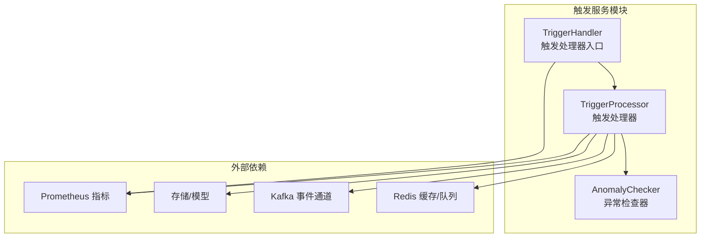
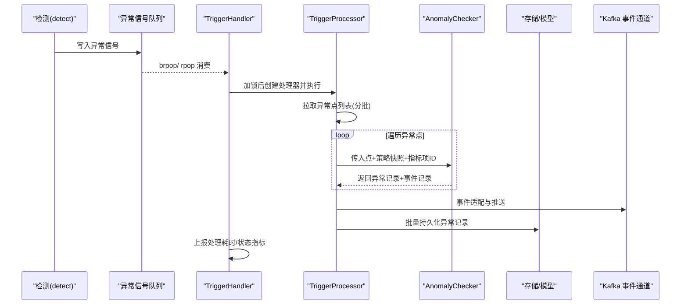
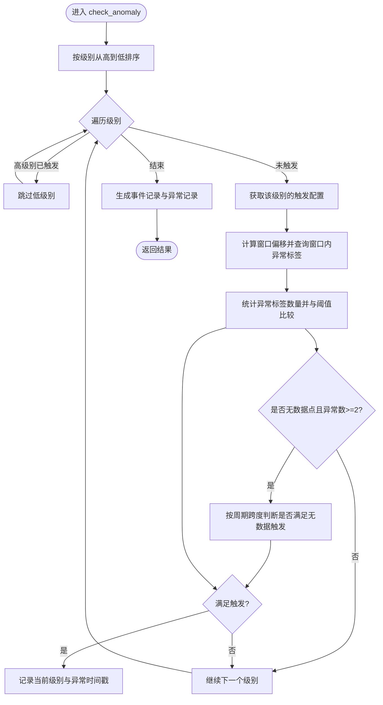
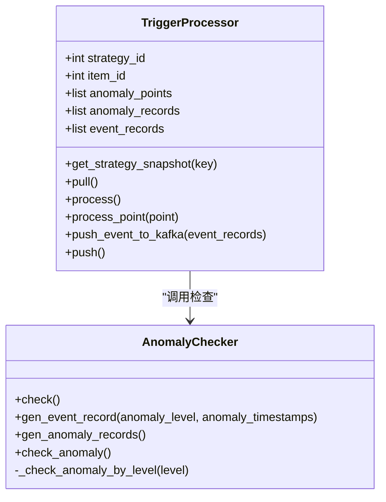
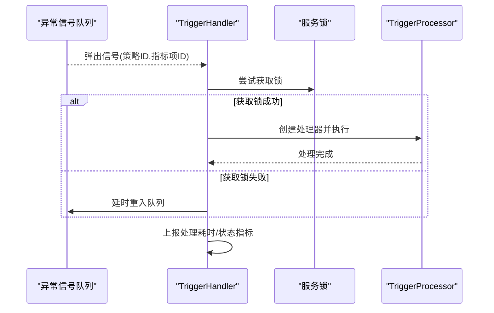
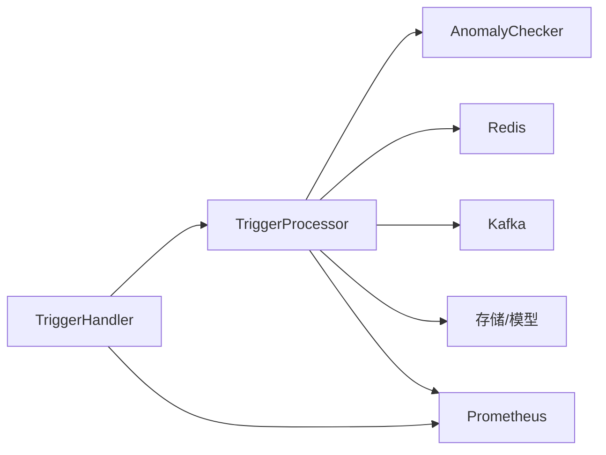

# 告警触发服务

<cite>
**本文引用的文件**
- [bkmonitor/alarm_backends/service/README.md](file://bkmonitor/alarm_backends/service/README.md)
- [bkmonitor/alarm_backends/service/trigger/checker.py](file://bkmonitor/alarm_backends/service/trigger/checker.py)
- [bkmonitor/alarm_backends/service/trigger/handler.py](file://bkmonitor/alarm_backends/service/trigger/handler.py)
- [bkmonitor/alarm_backends/service/trigger/processor.py](file://bkmonitor/alarm_backends/service/trigger/processor.py)
- [bkmonitor/alarm_backends/tests/service/trigger/test_checker.py](file://bkmonitor/alarm_backends/tests/service/trigger/test_checker.py)
- [bkmonitor/alarm_backends/tests/service/trigger/test_handler.py](file://bkmonitor/alarm_backends/tests/service/trigger/test_handler.py)
- [bkmonitor/alarm_backends/tests/service/trigger/test_processor.py](file://bkmonitor/alarm_backends/tests/service/trigger/test_processor.py)
- [bkmonitor/core/errors/alarm_backends/trigger.py](file://bkmonitor/core/errors/alarm_backends/trigger.py)
</cite>

## 目录
1. [简介](#简介)
2. [项目结构](#项目结构)
3. [核心组件](#核心组件)
4. [架构总览](#架构总览)
5. [组件详细分析](#组件详细分析)
6. [依赖关系分析](#依赖关系分析)
7. [性能考量](#性能考量)
8. [故障排除指南](#故障排除指南)
9. [结论](#结论)
10. [附录](#附录)

## 简介
本技术文档围绕“告警触发服务”展开，聚焦于触发器的判断逻辑、触发条件评估与状态转换机制，以及触发处理器的数据流处理、事件生成与通知分发流程。文档还涵盖配置管理、动态更新策略、性能优化手段，并提供触发准确性验证、延迟分析与故障排除方法，确保触发服务的可靠性与时效性。

## 项目结构
告警触发服务位于 alarm_backends 的 service 子模块中，采用“服务层”划分：access（数据接入）、detect（检测）、trigger（触发）、recovery（恢复）、event（事件关联）、action（通知动作）等。触发服务位于 trigger 目录，包含处理器、检查器与处理器入口。

图表来源
- [bkmonitor/alarm_backends/service/README.md:34-41](file://bkmonitor/alarm_backends/service/README.md#L34-L41)
- [bkmonitor/alarm_backends/service/trigger/handler.py:25-75](file://bkmonitor/alarm_backends/service/trigger/handler.py#L25-L75)
- [bkmonitor/alarm_backends/service/trigger/processor.py:29-294](file://bkmonitor/alarm_backends/service/trigger/processor.py#L29-L294)
- [bkmonitor/alarm_backends/service/trigger/checker.py:27-220](file://bkmonitor/alarm_backends/service/trigger/checker.py#L27-L220)

章节来源
- [bkmonitor/alarm_backends/service/README.md:1-120](file://bkmonitor/alarm_backends/service/README.md#L1-L120)

## 核心组件
- 触发处理器入口（TriggerHandler）
  - 从异常信号队列消费消息，解析策略与指标项 ID，加服务级锁后交由处理器执行。
  - 记录处理耗时与状态指标，异常时延时重试。
- 触发处理器（TriggerProcessor）
  - 拉取异常点列表，按时间从旧到新处理；支持分批拉取与二次触发。
  - 生成异常记录与事件记录，进行限流判定与 Kafka 推送，最后批量落库。
  - 通过策略快照键获取策略配置，支持动态更新与失效。
- 异常检查器（AnomalyChecker）
  - 基于策略与指标项配置，判断异常点是否满足触发条件。
  - 支持多算法级别从高到低优先判定，支持无数据场景补充判定。
  - 生成事件记录与异常记录，事件记录包含触发级别与异常标识集合。

章节来源
- [bkmonitor/alarm_backends/service/trigger/handler.py:25-75](file://bkmonitor/alarm_backends/service/trigger/handler.py#L25-L75)
- [bkmonitor/alarm_backends/service/trigger/processor.py:29-294](file://bkmonitor/alarm_backends/service/trigger/processor.py#L29-L294)
- [bkmonitor/alarm_backends/service/trigger/checker.py:27-220](file://bkmonitor/alarm_backends/service/trigger/checker.py#L27-L220)

## 架构总览
触发服务整体工作流如下：detect 产生异常点并写入异常列表队列；trigger 通过信号队列驱动处理；处理器拉取异常点，检查器评估触发条件，生成事件与异常记录；事件经适配后推送至 Kafka，异常记录入库；同时上报 Prometheus 指标并进行限流与延迟观测。

图表来源
- [bkmonitor/alarm_backends/service/trigger/handler.py:28-75](file://bkmonitor/alarm_backends/service/trigger/handler.py#L28-L75)
- [bkmonitor/alarm_backends/service/trigger/processor.py:59-294](file://bkmonitor/alarm_backends/service/trigger/processor.py#L59-L294)
- [bkmonitor/alarm_backends/service/trigger/checker.py:70-92](file://bkmonitor/alarm_backends/service/trigger/checker.py#L70-L92)

## 组件详细分析

### 异常检查器（AnomalyChecker）
- 判定逻辑
  - 若为无数据异常点，使用无数据配置生成触发配置；否则使用策略触发配置。
  - 按算法级别从高到低遍历，一旦高级别已触发则跳过低级别，避免重复触发。
  - 基于滑动窗口与异常标签计数判断是否满足触发阈值；支持无数据场景的时间跨度补充判定。
- 状态转换
  - 输入：异常点（含数据、异常、策略快照键、上下文等）
  - 输出：异常记录列表与事件记录（若满足触发条件）
- 关键行为
  - 生成事件记录：包含数据、异常、策略快照键、触发级别与异常标识集合。
  - 生成异常记录：封装异常ID、源时间、策略ID与原始告警数据。
  - 计算窗口偏移与窗口内异常计数，决定是否触发。

图表来源
- [bkmonitor/alarm_backends/service/trigger/checker.py:144-220](file://bkmonitor/alarm_backends/service/trigger/checker.py#L144-L220)

章节来源
- [bkmonitor/alarm_backends/service/trigger/checker.py:27-220](file://bkmonitor/alarm_backends/service/trigger/checker.py#L27-L220)

### 触发处理器（TriggerProcessor）
- 数据流处理
  - 拉取阶段：从异常列表队列按批次拉取，翻转为从旧到新顺序处理；若未清空则延时推送信号继续处理。
  - 处理阶段：逐点调用检查器，产出事件记录与异常记录；事件记录用于后续推送，异常记录用于入库。
  - 推送阶段：事件经适配后批量推送到 Kafka；异常记录批量持久化。
- 事件生成与通知分发
  - 事件适配：根据策略快照键获取最新策略配置，构建事件对象。
  - Kafka 推送：计算最大延迟并观测；超限时记录警告与指标。
  - 限流策略：按（策略ID、指标项ID、数据时间戳）维度进行限流，避免过载；失败时不消耗额度，成功后再提交计数。
- 动态更新与配置管理
  - 策略快照：通过快照键获取策略配置，支持动态更新；未命中时抛出策略未找到错误。
  - 执行锁：处理器粒度的锁保障同一（策略ID，指标项ID）下并发安全。
- 性能优化
  - 分批处理与二次触发：未清空队列时延时推送信号，避免饥饿。
  - 限流与延迟观测：Redis 计数器与 Prometheus 指标双管齐下，保障吞吐与可观测性。
  - 大批量溢出观测：当单批事件数超过阈值时上报指标，便于容量规划。

图表来源
- [bkmonitor/alarm_backends/service/trigger/processor.py:29-294](file://bkmonitor/alarm_backends/service/trigger/processor.py#L29-L294)
- [bkmonitor/alarm_backends/service/trigger/checker.py:27-220](file://bkmonitor/alarm_backends/service/trigger/checker.py#L27-L220)

章节来源
- [bkmonitor/alarm_backends/service/trigger/processor.py:29-294](file://bkmonitor/alarm_backends/service/trigger/processor.py#L29-L294)

### 触发处理器入口（TriggerHandler）
- 信号消费与路由
  - 从异常信号队列阻塞/非阻塞弹出消息，解析策略ID与指标项ID。
  - 加服务级锁，避免同一（策略ID，指标项ID）并发处理。
- 错误处理与重试
  - 获取锁失败：延时重入队列，稍后重试。
  - 处理异常：记录异常并上报指标，不影响队列消费。
- 指标观测
  - 记录处理耗时与状态，便于监控与告警。

图表来源
- [bkmonitor/alarm_backends/service/trigger/handler.py:28-75](file://bkmonitor/alarm_backends/service/trigger/handler.py#L28-L75)

章节来源
- [bkmonitor/alarm_backends/service/trigger/handler.py:25-75](file://bkmonitor/alarm_backends/service/trigger/handler.py#L25-L75)

## 依赖关系分析
- 组件耦合
  - TriggerHandler 依赖 TriggerProcessor；TriggerProcessor 依赖 AnomalyChecker 与策略快照。
  - 处理器与 Redis/Kafka/存储/指标模块存在跨模块依赖。
- 外部依赖
  - Redis：信号队列、异常列表、检查结果缓存、限流计数器、策略快照键空间。
  - Kafka：事件推送通道。
  - Prometheus：处理耗时、延迟、限流丢弃、溢出等指标。
- 循环依赖
  - 当前实现未见循环导入；模块边界清晰。

图表来源
- [bkmonitor/alarm_backends/service/trigger/handler.py:15-21](file://bkmonitor/alarm_backends/service/trigger/handler.py#L15-L21)
- [bkmonitor/alarm_backends/service/trigger/processor.py:15-21](file://bkmonitor/alarm_backends/service/trigger/processor.py#L15-L21)
- [bkmonitor/alarm_backends/service/trigger/checker.py:17-22](file://bkmonitor/alarm_backends/service/trigger/checker.py#L17-L22)

章节来源
- [bkmonitor/alarm_backends/service/trigger/handler.py:13-21](file://bkmonitor/alarm_backends/service/trigger/handler.py#L13-L21)
- [bkmonitor/alarm_backends/service/trigger/processor.py:11-21](file://bkmonitor/alarm_backends/service/trigger/processor.py#L11-L21)
- [bkmonitor/alarm_backends/service/trigger/checker.py:13-22](file://bkmonitor/alarm_backends/service/trigger/checker.py#L13-L22)

## 性能考量
- 分批与二次触发
  - 未清空队列时延时推送信号，避免饥饿与长尾堆积。
- 限流策略
  - 按（策略ID、指标项ID、数据时间戳）维度进行限流，采用 Redis 计数器与批量 INCRBY 提交，fail-open 保护。
- 延迟观测
  - 计算事件检测到触发的最大延迟并观测，超阈值记录警告与指标。
- 指标与可观测性
  - 处理耗时、推送量、限流丢弃、溢出等指标全面覆盖，便于容量与稳定性治理。

章节来源
- [bkmonitor/alarm_backends/service/trigger/processor.py:83-181](file://bkmonitor/alarm_backends/service/trigger/processor.py#L83-L181)
- [bkmonitor/alarm_backends/service/trigger/processor.py:202-252](file://bkmonitor/alarm_backends/service/trigger/processor.py#L202-L252)
- [bkmonitor/alarm_backends/service/trigger/handler.py:50-75](file://bkmonitor/alarm_backends/service/trigger/handler.py#L50-L75)

## 故障排除指南
- 常见问题定位
  - 无异常事件：确认异常信号队列是否为空、锁是否被占用、策略是否在报警时段内。
  - 触发延迟高：检查 Kafka 推送耗时、事件适配耗时与 Redis 访问延迟。
  - 事件被限流丢弃：关注限流丢弃指标与 Redis 计数器状态。
  - 策略未找到：确认策略快照键是否正确、策略是否已发布。
- 错误类型与处理
  - 获取锁失败：延时重试，避免抖动。
  - 处理异常：记录异常并上报指标，不影响队列继续消费。
  - 策略未找到：抛出策略未找到错误，需检查快照键与策略发布状态。
- 测试辅助
  - 单元测试覆盖检查器的多级别判定、无数据补充判定、事件与异常记录生成等关键路径。

章节来源
- [bkmonitor/alarm_backends/service/trigger/handler.py:54-67](file://bkmonitor/alarm_backends/service/trigger/handler.py#L54-L67)
- [bkmonitor/alarm_backends/service/trigger/processor.py:59-82](file://bkmonitor/alarm_backends/service/trigger/processor.py#L59-L82)
- [bkmonitor/core/errors/alarm_backends/trigger.py](file://bkmonitor/core/errors/alarm_backends/trigger.py)
- [bkmonitor/alarm_backends/tests/service/trigger/test_handler.py:82-89](file://bkmonitor/alarm_backends/tests/service/trigger/test_handler.py#L82-L89)
- [bkmonitor/alarm_backends/tests/service/trigger/test_processor.py:151-159](file://bkmonitor/alarm_backends/tests/service/trigger/test_processor.py#L151-L159)

## 结论
告警触发服务通过“处理器入口—处理器—检查器”的分层设计，实现了从异常点到事件与异常记录的高效处理与可靠分发。其基于 Redis 的限流与 Prometheus 的指标观测，确保了在高吞吐场景下的稳定性与可观测性；策略快照机制支持动态更新，满足业务演进需求。结合测试用例与故障排除建议，可进一步提升触发服务的准确性与时效性。

## 附录
- 触发准确性验证
  - 使用测试用例覆盖多级别异常计数、无数据补充判定与事件/异常记录生成路径。
- 延迟分析
  - 通过事件检测到触发的最大延迟指标与警告日志，定位 Kafka 与适配瓶颈。
- 配置管理与动态更新
  - 通过策略快照键获取最新策略配置，支持策略变更后的即时生效；未命中时抛错以便快速发现。

章节来源
- [bkmonitor/alarm_backends/tests/service/trigger/test_checker.py:197-476](file://bkmonitor/alarm_backends/tests/service/trigger/test_checker.py#L197-L476)
- [bkmonitor/alarm_backends/tests/service/trigger/test_processor.py:121-214](file://bkmonitor/alarm_backends/tests/service/trigger/test_processor.py#L121-L214)
- [bkmonitor/alarm_backends/service/trigger/processor.py:44-57](file://bkmonitor/alarm_backends/service/trigger/processor.py#L44-L57)