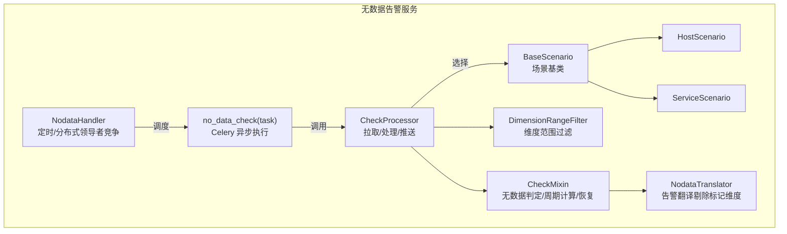
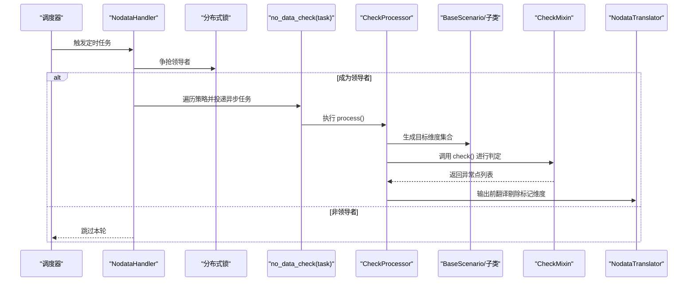
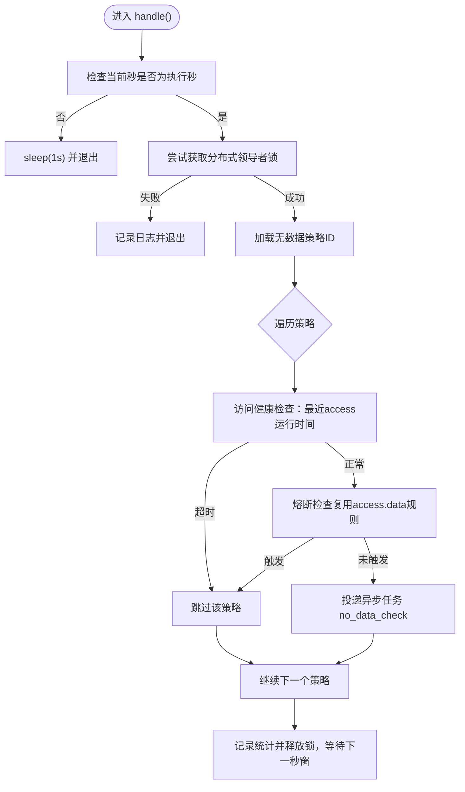
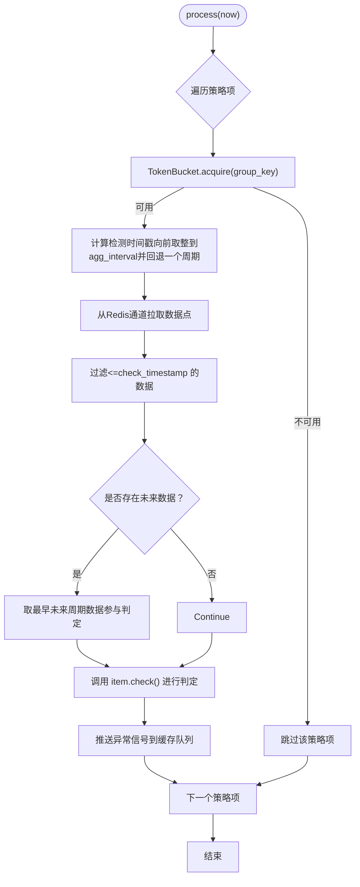
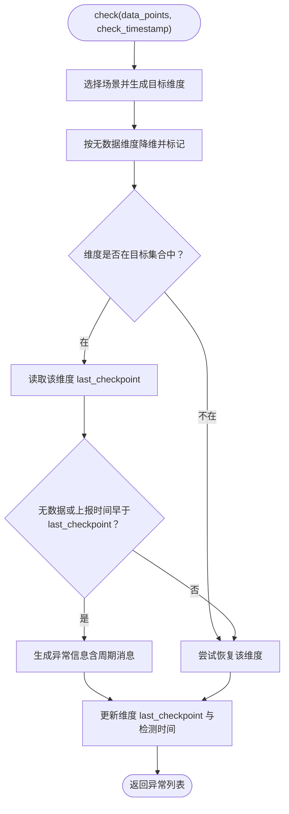
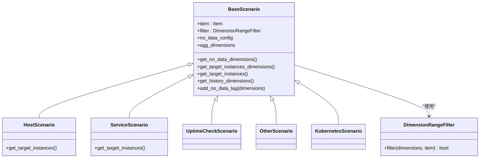
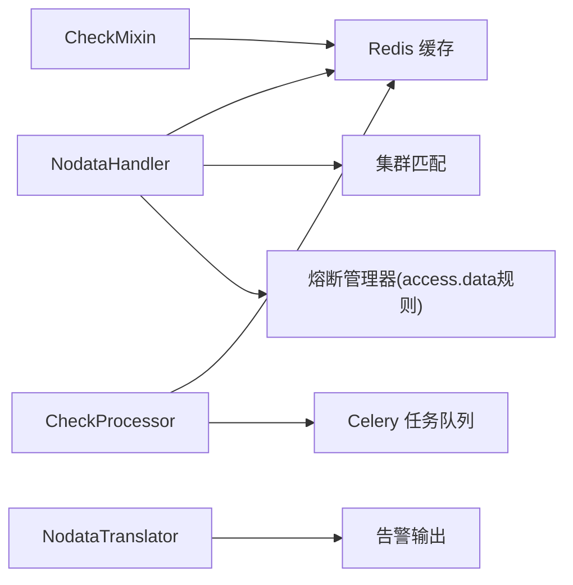

# 无数据告警服务

<cite>
**本文引用的文件**
- [bkmonitor/alarm_backends/service/nodata/handler.py](file://bkmonitor/alarm_backends/service/nodata/handler.py)
- [bkmonitor/alarm_backends/service/nodata/processor.py](file://bkmonitor/alarm_backends/service/nodata/processor.py)
- [bkmonitor/alarm_backends/service/nodata/tasks.py](file://bkmonitor/alarm_backends/service/nodata/tasks.py)
- [bkmonitor/alarm_backends/service/nodata/scenarios/base.py](file://bkmonitor/alarm_backends/service/nodata/scenarios/base.py)
- [bkmonitor/alarm_backends/service/nodata/scenarios/filters.py](file://bkmonitor/alarm_backends/service/nodata/scenarios/filters.py)
- [bkmonitor/alarm_backends/core/control/mixins/nodata.py](file://bkmonitor/alarm_backends/core/control/mixins/nodata.py)
- [bkmonitor/alarm_backends/constants.py](file://bkmonitor/alarm_backends/constants.py)
- [bkmonitor/alarm_backends/service/alert/enricher/translator/nodata.py](file://bkmonitor/alarm_backends/service/alert/enricher/translator/nodata.py)
</cite>

## 目录
1. [简介](#简介)
2. [项目结构](#项目结构)
3. [核心组件](#核心组件)
4. [架构总览](#架构总览)
5. [详细组件分析](#详细组件分析)
6. [依赖分析](#依赖分析)
7. [性能考虑](#性能考虑)
8. [故障排查指南](#故障排查指南)
9. [结论](#结论)
10. [附录](#附录)

## 简介
本技术文档面向“无数据告警服务”，系统性阐述无数据检测的算法实现、心跳监控与数据可用性判断机制，以及触发条件、持续时间计算与告警抑制策略。文档还覆盖数据源健康检查、异常检测与自动恢复机制，并提供配置参数、阈值设置与性能监控方法，确保对数据中断情况的及时响应与稳定运行。

## 项目结构
无数据告警服务位于 alarm_backends 子系统中，围绕“处理器-调度-场景-翻译”等模块协同工作，形成完整的检测、判定、推送与展示链路。

图示来源
- [bkmonitor/alarm_backends/service/nodata/handler.py:30-153](file://bkmonitor/alarm_backends/service/nodata/handler.py#L30-L153)
- [bkmonitor/alarm_backends/service/nodata/processor.py:31-224](file://bkmonitor/alarm_backends/service/nodata/processor.py#L31-L224)
- [bkmonitor/alarm_backends/service/nodata/tasks.py:24-47](file://bkmonitor/alarm_backends/service/nodata/tasks.py#L24-L47)
- [bkmonitor/alarm_backends/service/nodata/scenarios/base.py:35-276](file://bkmonitor/alarm_backends/service/nodata/scenarios/base.py#L35-L276)
- [bkmonitor/alarm_backends/service/nodata/scenarios/filters.py:20-46](file://bkmonitor/alarm_backends/service/nodata/scenarios/filters.py#L20-L46)
- [bkmonitor/alarm_backends/core/control/mixins/nodata.py:33-355](file://bkmonitor/alarm_backends/core/control/mixins/nodata.py#L33-L355)
- [bkmonitor/alarm_backends/service/alert/enricher/translator/nodata.py:17-28](file://bkmonitor/alarm_backends/service/alert/enricher/translator/nodata.py#L17-L28)

章节来源
- [bkmonitor/alarm_backends/service/nodata/handler.py:30-153](file://bkmonitor/alarm_backends/service/nodata/handler.py#L30-L153)
- [bkmonitor/alarm_backends/service/nodata/processor.py:31-224](file://bkmonitor/alarm_backends/service/nodata/processor.py#L31-L224)
- [bkmonitor/alarm_backends/service/nodata/tasks.py:24-47](file://bkmonitor/alarm_backends/service/nodata/tasks.py#L24-L47)
- [bkmonitor/alarm_backends/service/nodata/scenarios/base.py:35-276](file://bkmonitor/alarm_backends/service/nodata/scenarios/base.py#L35-L276)
- [bkmonitor/alarm_backends/service/nodata/scenarios/filters.py:20-46](file://bkmonitor/alarm_backends/service/nodata/scenarios/filters.py#L20-L46)
- [bkmonitor/alarm_backends/core/control/mixins/nodata.py:33-355](file://bkmonitor/alarm_backends/core/control/mixins/nodata.py#L33-L355)
- [bkmonitor/alarm_backends/service/alert/enricher/translator/nodata.py:17-28](file://bkmonitor/alarm_backends/service/alert/enricher/translator/nodata.py#L17-L28)

## 核心组件
- 定时与领导者竞争：NodataHandler 在固定秒窗内竞争分布式领导者，避免重复执行；随后遍历策略并进行无数据检测。
- 异步执行：no_data_check Celery 任务封装 CheckProcessor 的 process 流程，统一埋点与错误处理。
- 数据拉取与处理：CheckProcessor 从 Redis 列表通道拉取数据点，按检测时间窗口过滤，必要时回溯未来最早周期数据，再交由策略项进行判定。
- 场景化维度：BaseScenario 及其子类根据监控场景（主机、服务实例、拨测等）生成目标维度集合，并结合历史维度与过滤器进行范围收敛。
- 判定与周期计算：CheckMixin 实现无数据判定、上报延时周期与异常持续周期计算、维度级 last_checkpoint 维护与自动恢复。
- 告警翻译：NodataTranslator 在告警输出前移除内部标记维度，保证对外展示干净。

章节来源
- [bkmonitor/alarm_backends/service/nodata/handler.py:30-153](file://bkmonitor/alarm_backends/service/nodata/handler.py#L30-L153)
- [bkmonitor/alarm_backends/service/nodata/tasks.py:24-47](file://bkmonitor/alarm_backends/service/nodata/tasks.py#L24-L47)
- [bkmonitor/alarm_backends/service/nodata/processor.py:31-224](file://bkmonitor/alarm_backends/service/nodata/processor.py#L31-L224)
- [bkmonitor/alarm_backends/service/nodata/scenarios/base.py:35-276](file://bkmonitor/alarm_backends/service/nodata/scenarios/base.py#L35-L276)
- [bkmonitor/alarm_backends/core/control/mixins/nodata.py:33-355](file://bkmonitor/alarm_backends/core/control/mixins/nodata.py#L33-L355)
- [bkmonitor/alarm_backends/service/alert/enricher/translator/nodata.py:17-28](file://bkmonitor/alarm_backends/service/alert/enricher/translator/nodata.py#L17-L28)

## 架构总览
无数据检测采用“定时调度-异步执行-处理器-场景判定-判定与恢复”的流水线式架构，配合 Redis 缓存与 Celery 任务队列实现高吞吐与可扩展。

图示来源
- [bkmonitor/alarm_backends/service/nodata/handler.py:30-153](file://bkmonitor/alarm_backends/service/nodata/handler.py#L30-L153)
- [bkmonitor/alarm_backends/service/nodata/tasks.py:24-47](file://bkmonitor/alarm_backends/service/nodata/tasks.py#L24-L47)
- [bkmonitor/alarm_backends/service/nodata/processor.py:31-224](file://bkmonitor/alarm_backends/service/nodata/processor.py#L31-L224)
- [bkmonitor/alarm_backends/core/control/mixins/nodata.py:57-146](file://bkmonitor/alarm_backends/core/control/mixins/nodata.py#L57-L146)
- [bkmonitor/alarm_backends/service/alert/enricher/translator/nodata.py:25-27](file://bkmonitor/alarm_backends/service/alert/enricher/translator/nodata.py#L25-L27)

## 详细组件分析

### 组件一：NodataHandler（定时与领导者竞争）
- 时间窗控制：仅在特定秒窗（如每分钟的第55秒）执行，避免与上游 access 运行时间冲突。
- 分布式领导者：通过 Redis 键值争抢，确保同一时间只有一个节点执行检测。
- 访问健康检查：若最近一次 access 运行时间超过两倍检测周期或两倍执行周期，则跳过该策略，防止误报。
- 熔断复用：复用 access.data 的熔断规则，支持按数据源标签与数据类型维度进行熔断。
- 策略筛选：仅处理当前集群内的策略，避免跨集群误判。

图示来源
- [bkmonitor/alarm_backends/service/nodata/handler.py:30-153](file://bkmonitor/alarm_backends/service/nodata/handler.py#L30-L153)

章节来源
- [bkmonitor/alarm_backends/service/nodata/handler.py:30-153](file://bkmonitor/alarm_backends/service/nodata/handler.py#L30-L153)

### 组件二：CheckProcessor（数据拉取/处理/推送）
- 数据通道：从 Redis 列表通道读取数据点，按检测时间戳过滤，避免未来数据参与当前周期判定。
- 未来数据回溯：若当前周期无数据但存在未来最早周期数据，则取最早未来周期数据参与判定，减少漏报。
- 流控：基于 TokenBucket 对按聚合维度组合的 group_key 进行限流，避免热点策略压垮系统。
- 去重与推进：为每个维度与全局设置 last_checkpoint，避免重复检测；将异常信号推送到异常队列。

图示来源
- [bkmonitor/alarm_backends/service/nodata/processor.py:31-224](file://bkmonitor/alarm_backends/service/nodata/processor.py#L31-L224)

章节来源
- [bkmonitor/alarm_backends/service/nodata/processor.py:31-224](file://bkmonitor/alarm_backends/service/nodata/processor.py#L31-L224)

### 组件三：CheckMixin（无数据判定/周期计算/恢复）
- 维度归并：将上报数据按无数据维度降维，并加入内部标记维度，用于区分“无数据”与“有数据但缺失该维度”。
- 历史维度与目标维度：结合场景生成目标维度集合，并与历史维度进行匹配与过滤，支持缺失目标实例的告警。
- 无数据判定：若某维度在 last_checkpoint 之前无上报，或上报时间早于 last_checkpoint，则产生异常；否则进行恢复。
- 周期计算：
  - 无数据上报丢失周期：基于 last_checkpoint 与检测时间戳计算。
  - 异常持续周期：基于首次出现异常的时间与当前检测时间计算。
- 自动恢复：当维度恢复正常上报或目标实例回归，清除异常起始时间标记，实现自动恢复。

图示来源
- [bkmonitor/alarm_backends/core/control/mixins/nodata.py:57-146](file://bkmonitor/alarm_backends/core/control/mixins/nodata.py#L57-L146)
- [bkmonitor/alarm_backends/core/control/mixins/nodata.py:189-262](file://bkmonitor/alarm_backends/core/control/mixins/nodata.py#L189-L262)
- [bkmonitor/alarm_backends/core/control/mixins/nodata.py:264-347](file://bkmonitor/alarm_backends/core/control/mixins/nodata.py#L264-L347)

章节来源
- [bkmonitor/alarm_backends/core/control/mixins/nodata.py:57-146](file://bkmonitor/alarm_backends/core/control/mixins/nodata.py#L57-L146)
- [bkmonitor/alarm_backends/core/control/mixins/nodata.py:189-262](file://bkmonitor/alarm_backends/core/control/mixins/nodata.py#L189-L262)
- [bkmonitor/alarm_backends/core/control/mixins/nodata.py:264-347](file://bkmonitor/alarm_backends/core/control/mixins/nodata.py#L264-L347)

### 组件四：场景与过滤（BaseScenario/HostScenario/ServiceScenario/DimensionRangeFilter）
- 场景注册：通过装饰器将不同场景类注册到映射表，按策略 scenario 类型动态选择。
- 主机场景：支持静态IP、动态拓扑、动态分组三种配置，生成目标维度集合。
- 服务场景：支持服务实例与实例ID两种维度，生成目标维度集合。
- 维度过滤：结合聚合条件与额外内置条件，过滤历史维度，避免对不满足条件的维度进行无数据告警。

图示来源
- [bkmonitor/alarm_backends/service/nodata/scenarios/base.py:35-276](file://bkmonitor/alarm_backends/service/nodata/scenarios/base.py#L35-L276)
- [bkmonitor/alarm_backends/service/nodata/scenarios/filters.py:20-46](file://bkmonitor/alarm_backends/service/nodata/scenarios/filters.py#L20-L46)

章节来源
- [bkmonitor/alarm_backends/service/nodata/scenarios/base.py:35-276](file://bkmonitor/alarm_backends/service/nodata/scenarios/base.py#L35-L276)
- [bkmonitor/alarm_backends/service/nodata/scenarios/filters.py:20-46](file://bkmonitor/alarm_backends/service/nodata/scenarios/filters.py#L20-L46)

### 组件五：NodataTranslator（告警翻译）
- 功能：在告警输出前移除内部使用的无数据标记维度，保证对外展示干净。

章节来源
- [bkmonitor/alarm_backends/service/alert/enricher/translator/nodata.py:17-28](file://bkmonitor/alarm_backends/service/alert/enricher/translator/nodata.py#L17-L28)

## 依赖分析
- 与缓存与集群：
  - 使用 Redis Hash/Sorted Set 存储 last_checkpoint、维度键映射与检测结果。
  - 通过集群匹配仅处理当前业务域内的策略。
- 与熔断：
  - 复用 access.data 的熔断规则，支持按数据源标签与数据类型维度进行熔断。
- 与任务队列：
  - 通过 Celery 异步执行，隔离 CPU 密集与 IO 密集，提升吞吐。
- 与常量：
  - 使用统一的无数据等级、标记维度与时间常量。

图示来源
- [bkmonitor/alarm_backends/service/nodata/handler.py:50-105](file://bkmonitor/alarm_backends/service/nodata/handler.py#L50-L105)
- [bkmonitor/alarm_backends/service/nodata/processor.py:167-183](file://bkmonitor/alarm_backends/service/nodata/processor.py#L167-L183)
- [bkmonitor/alarm_backends/constants.py:60-71](file://bkmonitor/alarm_backends/constants.py#L60-L71)

章节来源
- [bkmonitor/alarm_backends/service/nodata/handler.py:50-105](file://bkmonitor/alarm_backends/service/nodata/handler.py#L50-L105)
- [bkmonitor/alarm_backends/service/nodata/processor.py:167-183](file://bkmonitor/alarm_backends/service/nodata/processor.py#L167-L183)
- [bkmonitor/alarm_backends/constants.py:60-71](file://bkmonitor/alarm_backends/constants.py#L60-L71)

## 性能考虑
- 执行节律：固定秒窗执行，避免与上游 access 冲突；领导者竞争减少重复计算。
- 异步化：Celery 任务解耦调度与执行，提高并发能力。
- 流控：TokenBucket 按聚合维度组合限流，避免热点策略拖垮系统。
- 缓存命中：Redis 哈希与有序集合高效存储 last_checkpoint 与检测结果，降低 IO。
- 未来数据回溯：在当前周期无数据时回溯未来最早周期数据，提升检测准确性。

## 故障排查指南
- 误跳过策略
  - 现象：策略未检测。
  - 排查：确认最近一次 access 运行时间是否超时；检查熔断规则是否触发；确认是否为当前集群策略。
  - 参考
    - [bkmonitor/alarm_backends/service/nodata/handler.py:110-119](file://bkmonitor/alarm_backends/service/nodata/handler.py#L110-L119)
    - [bkmonitor/alarm_backends/service/nodata/handler.py:84-104](file://bkmonitor/alarm_backends/service/nodata/handler.py#L84-L104)
- 重复检测
  - 现象：同一周期重复告警。
  - 排查：检查维度与全局 last_checkpoint 是否正确更新；确认检测时间戳计算是否一致。
  - 参考
    - [bkmonitor/alarm_backends/core/control/mixins/nodata.py:342-346](file://bkmonitor/alarm_backends/core/control/mixins/nodata.py#L342-L346)
- 无数据判定异常
  - 现象：无数据或有数据但未恢复。
  - 排查：核对场景生成的目标维度集合与历史维度匹配；检查维度过滤条件；确认 TokenBucket 是否阻塞。
  - 参考
    - [bkmonitor/alarm_backends/service/nodata/scenarios/base.py:62-109](file://bkmonitor/alarm_backends/service/nodata/scenarios/base.py#L62-L109)
    - [bkmonitor/alarm_backends/service/nodata/scenarios/filters.py:20-46](file://bkmonitor/alarm_backends/service/nodata/scenarios/filters.py#L20-L46)
    - [bkmonitor/alarm_backends/service/nodata/processor.py:176-183](file://bkmonitor/alarm_backends/service/nodata/processor.py#L176-L183)
- 周期计算异常
  - 现象：周期数显示异常或恢复不生效。
  - 排查：确认首次异常时间与 last_checkpoint 的计算逻辑；检查 agg_interval 是否一致。
  - 参考
    - [bkmonitor/alarm_backends/core/control/mixins/nodata.py:192-233](file://bkmonitor/alarm_backends/core/control/mixins/nodata.py#L192-L233)
    - [bkmonitor/alarm_backends/core/control/mixins/nodata.py:235-262](file://bkmonitor/alarm_backends/core/control/mixins/nodata.py#L235-L262)

章节来源
- [bkmonitor/alarm_backends/service/nodata/handler.py:110-119](file://bkmonitor/alarm_backends/service/nodata/handler.py#L110-L119)
- [bkmonitor/alarm_backends/service/nodata/handler.py:84-104](file://bkmonitor/alarm_backends/service/nodata/handler.py#L84-L104)
- [bkmonitor/alarm_backends/service/nodata/scenarios/base.py:62-109](file://bkmonitor/alarm_backends/service/nodata/scenarios/base.py#L62-L109)
- [bkmonitor/alarm_backends/service/nodata/scenarios/filters.py:20-46](file://bkmonitor/alarm_backends/service/nodata/scenarios/filters.py#L20-L46)
- [bkmonitor/alarm_backends/service/nodata/processor.py:176-183](file://bkmonitor/alarm_backends/service/nodata/processor.py#L176-L183)
- [bkmonitor/alarm_backends/core/control/mixins/nodata.py:192-233](file://bkmonitor/alarm_backends/core/control/mixins/nodata.py#L192-L233)
- [bkmonitor/alarm_backends/core/control/mixins/nodata.py:235-262](file://bkmonitor/alarm_backends/core/control/mixins/nodata.py#L235-L262)

## 结论
无数据告警服务通过“定时领导者竞争 + 异步任务 + 场景化维度 + 判定与周期计算 + 自动恢复”的完整闭环，实现了对数据中断的高可靠检测与快速响应。其设计兼顾了准确性（未来数据回溯、维度过滤）、稳定性（熔断复用、流控、去重）与可观测性（埋点与日志）。建议在生产环境中结合访问健康检查与熔断策略，合理设置检测周期与阈值，确保在复杂场景下的稳定运行。

## 附录

### 触发条件与持续时间计算
- 触发条件
  - 维度在 last_checkpoint 之前无上报，或上报时间早于 last_checkpoint。
  - 目标实例缺失：当监控目标范围变化导致历史维度中不存在的目标实例出现时，触发告警。
- 持续时间计算
  - 无数据上报丢失周期：基于 last_checkpoint 与检测时间戳计算。
  - 异常持续周期：基于首次出现异常的时间与当前检测时间计算。
- 告警抑制策略
  - 同一检测周期内维度级 last_checkpoint 已更新则跳过。
  - 访问健康检查：若最近一次 access 运行时间超时则跳过策略。
  - 熔断：复用 access.data 的熔断规则，按维度/数据源/数据类型抑制。
  - 流控：TokenBucket 限流，避免热点策略重复触发。

章节来源
- [bkmonitor/alarm_backends/core/control/mixins/nodata.py:192-233](file://bkmonitor/alarm_backends/core/control/mixins/nodata.py#L192-L233)
- [bkmonitor/alarm_backends/core/control/mixins/nodata.py:235-262](file://bkmonitor/alarm_backends/core/control/mixins/nodata.py#L235-L262)
- [bkmonitor/alarm_backends/service/nodata/handler.py:110-119](file://bkmonitor/alarm_backends/service/nodata/handler.py#L110-L119)
- [bkmonitor/alarm_backends/service/nodata/handler.py:84-104](file://bkmonitor/alarm_backends/service/nodata/handler.py#L84-L104)
- [bkmonitor/alarm_backends/service/nodata/processor.py:176-183](file://bkmonitor/alarm_backends/service/nodata/processor.py#L176-L183)

### 配置参数与阈值设置
- 无数据等级：默认等级由常量定义，用于区分告警级别。
- 无数据标记维度：用于内部标识“无数据”维度，输出时会被翻译器剔除。
- 最新检测点：用于避免同一周期重复检测。
- 周期与时间：统一使用分钟与秒常量，确保时间计算一致性。
- 场景配置：无数据维度、聚合维度、聚合区间等来自策略项配置。

章节来源
- [bkmonitor/alarm_backends/constants.py:60-71](file://bkmonitor/alarm_backends/constants.py#L60-L71)
- [bkmonitor/alarm_backends/service/nodata/scenarios/base.py:43-48](file://bkmonitor/alarm_backends/service/nodata/scenarios/base.py#L43-L48)

### 性能监控方法
- 任务耗时与计数：通过埋点记录任务执行时长与状态，便于定位慢任务与异常。
- 拉取/推送计数：统计拉取与推送的数据点数量，评估吞吐。
- 日志与指标：关注领导者竞争、熔断、流控、未来数据回溯等关键路径日志。

章节来源
- [bkmonitor/alarm_backends/service/nodata/tasks.py:32-46](file://bkmonitor/alarm_backends/service/nodata/tasks.py#L32-L46)
- [bkmonitor/alarm_backends/service/nodata/processor.py:74-148](file://bkmonitor/alarm_backends/service/nodata/processor.py#L74-L148)