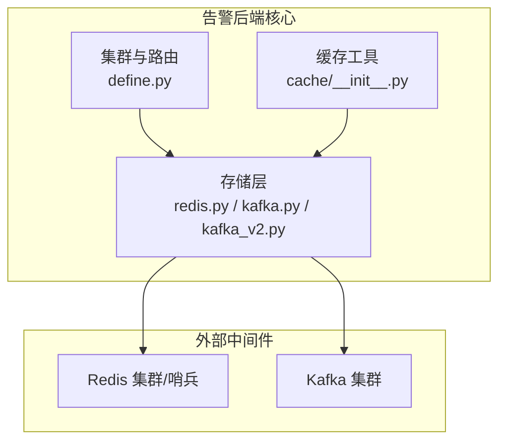
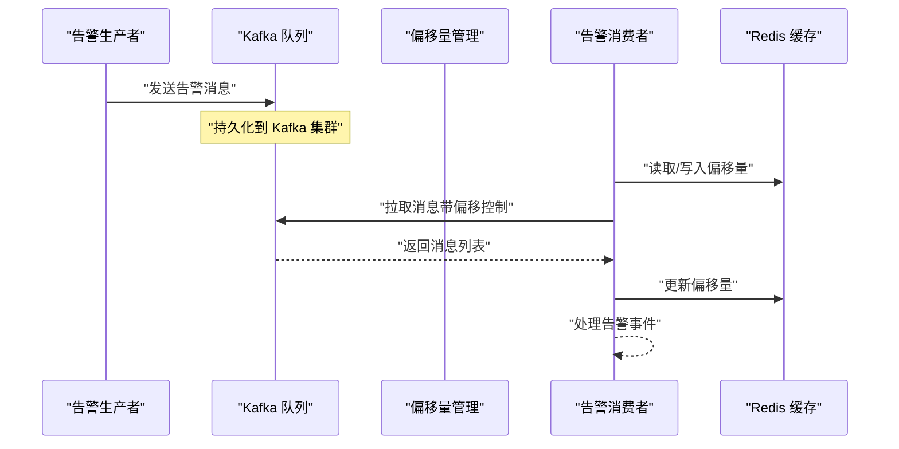
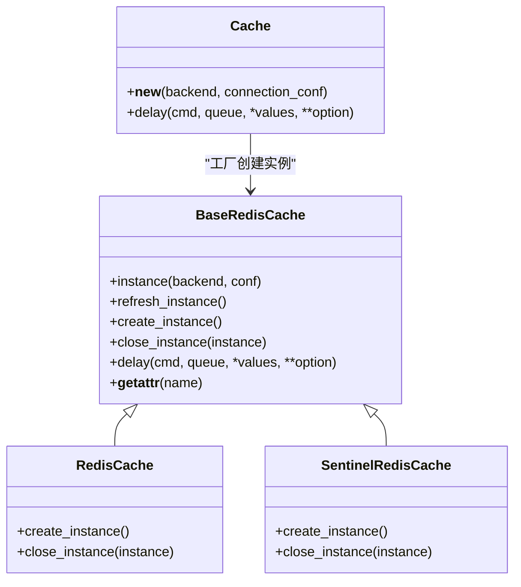
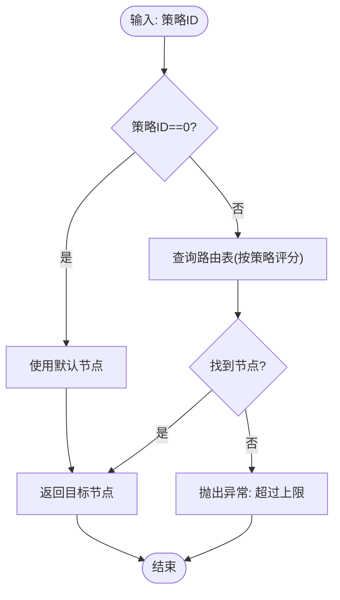
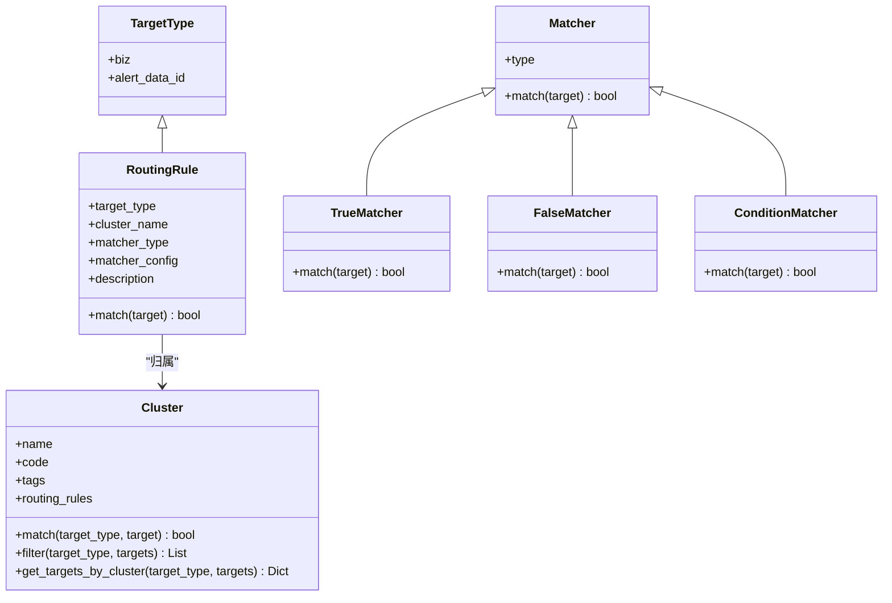
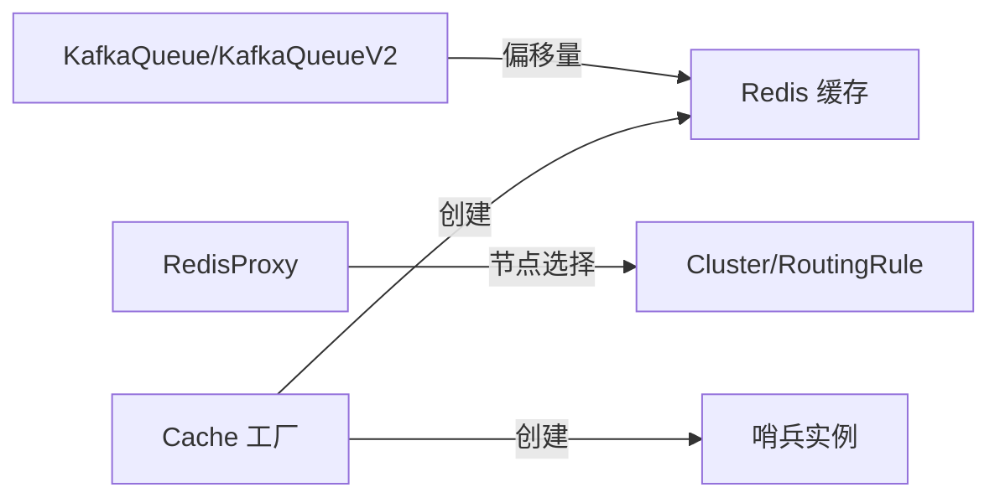

# 告警存储与缓存

<cite>
**本文引用的文件**
- [redis.py](file://bkmonitor/alarm_backends/core/storage/redis.py)
- [redis_cluster.py](file://bkmonitor/alarm_backends/core/storage/redis_cluster.py)
- [kafka.py](file://bkmonitor/alarm_backends/core/storage/kafka.py)
- [kafka_v2.py](file://bkmonitor/alarm_backends/core/storage/kafka_v2.py)
- [define.py](file://bkmonitor/alarm_backends/cluster/define.py)
- [__init__.py（缓存工具）](file://bkmonitor/alarm_backends/core/cache/__init__.py)
- [__init__.py（存储包入口）](file://bkmonitor/alarm_backends/core/storage/__init__.py)
</cite>

## 目录
1. [简介](#简介)
2. [项目结构](#项目结构)
3. [核心组件](#核心组件)
4. [架构总览](#架构总览)
5. [组件详细分析](#组件详细分析)
6. [依赖关系分析](#依赖关系分析)
7. [性能考量](#性能考量)
8. [故障排查指南](#故障排查指南)
9. [结论](#结论)
10. [附录](#附录)

## 简介
本技术文档围绕告警存储与缓存系统，系统化阐述以下主题：
- 告警数据的存储架构与持久化策略
- 缓存策略的设计原理与多级缓存协同
- 数据库连接池与外部中间件（Redis、Kafka）的管理机制
- Redis 集群与哨兵模式的使用方式
- Kafka 消息队列的集成与数据一致性保障
- 缓存失效策略、数据迁移方案与性能优化技巧
- 存储容量规划、备份恢复与监控告警配置建议

## 项目结构
告警存储与缓存相关代码主要集中在 alarm_backends 子系统中，按功能域划分如下：
- 存储层：Redis 与 Kafka 的封装与使用
- 缓存层：本地内存缓存与 API 缓存工具
- 集群与路由：基于策略 ID 的 Redis 节点路由与集群规则



图表来源
- [redis.py:1-326](file://bkmonitor/alarm_backends/core/storage/redis.py#L1-L326)
- [kafka.py:1-262](file://bkmonitor/alarm_backends/core/storage/kafka.py#L1-L262)
- [kafka_v2.py:1-157](file://bkmonitor/alarm_backends/core/storage/kafka_v2.py#L1-L157)
- [define.py:1-267](file://bkmonitor/alarm_backends/cluster/define.py#L1-L267)
- [__init__.py（缓存工具）:1-18](file://bkmonitor/alarm_backends/core/cache/__init__.py#L1-L18)

章节来源
- [__init__.py（存储包入口）:1-11](file://bkmonitor/alarm_backends/core/storage/__init__.py#L1-L11)

## 核心组件
- Redis 缓存与连接管理
  - 支持直连与哨兵两种模式，统一通过 Cache 工厂创建实例
  - 提供延迟队列能力与只读实例支持
- Redis 集群路由与代理
  - 基于策略 ID 的节点选择与管道复用
  - 支持多节点客户端池与命令栈聚合执行
- Kafka 队列封装
  - v1 与 v2 两套实现：SimpleClient/SimpleConsumer 与 KafkaConsumer
  - 偏移量管理与自动提交控制
- 集群与路由规则
  - 目标类型与匹配器注册，支持业务域与告警数据 ID 的路由
- 缓存工具
  - 本地内存缓存清理工具，辅助快速清空进程内缓存

章节来源
- [redis.py:43-326](file://bkmonitor/alarm_backends/core/storage/redis.py#L43-L326)
- [redis_cluster.py:16-226](file://bkmonitor/alarm_backends/core/storage/redis_cluster.py#L16-L226)
- [kafka.py:26-262](file://bkmonitor/alarm_backends/core/storage/kafka.py#L26-L262)
- [kafka_v2.py:24-157](file://bkmonitor/alarm_backends/core/storage/kafka_v2.py#L24-L157)
- [define.py:22-267](file://bkmonitor/alarm_backends/cluster/define.py#L22-L267)
- [__init__.py（缓存工具）:14-18](file://bkmonitor/alarm_backends/core/cache/__init__.py#L14-L18)

## 架构总览
告警数据在系统内的流转路径如下：
- 写入路径：告警事件 → Kafka 生产者 → Kafka 集群
- 读取路径：Kafka 消费者 → 偏移量管理（Redis）→ 业务处理
- 缓存路径：热点数据（如配置、策略）→ Redis 缓存；本地内存缓存作为短期加速



图表来源
- [kafka.py:127-176](file://bkmonitor/alarm_backends/core/storage/kafka.py#L127-L176)
- [kafka_v2.py:147-157](file://bkmonitor/alarm_backends/core/storage/kafka_v2.py#L147-L157)
- [redis.py:197-222](file://bkmonitor/alarm_backends/core/storage/redis.py#L197-L222)

## 组件详细分析

### Redis 缓存与连接管理
- 后端类型与配置映射
  - 通过常量映射不同用途的 Redis 实例（celery、service、queue、cache、log）
  - 支持按模块路由的环境变量覆盖
- 单例与只读实例
  - BaseRedisCache 提供统一的实例刷新与异常重试逻辑
  - 只读实例用于降低写压力与提升读性能
- 延迟队列
  - 通过有序集合与哈希队列实现任务延时与去重
- 哨兵模式
  - 自动主从切换与随机哨兵节点轮询，增强可用性



图表来源
- [redis.py:98-326](file://bkmonitor/alarm_backends/core/storage/redis.py#L98-L326)

章节来源
- [redis.py:43-326](file://bkmonitor/alarm_backends/core/storage/redis.py#L43-L326)

### Redis 集群路由与代理
- 节点抽象与连接配置
  - RedisNode/SentinelRedisNode 统一连接参数与实例生成
- 策略 ID 路由
  - 通过策略评分与路由表选择目标节点，支持默认节点回退
- 管道代理
  - PipelineProxy 将命令按节点聚合，减少跨节点往返
- 客户端池
  - 按节点 ID 缓存客户端，降低重复创建成本



图表来源
- [redis_cluster.py:195-226](file://bkmonitor/alarm_backends/core/storage/redis_cluster.py#L195-L226)

章节来源
- [redis_cluster.py:16-226](file://bkmonitor/alarm_backends/core/storage/redis_cluster.py#L16-L226)

### Kafka 队列封装
- v1 实现（SimpleClient/SimpleConsumer）
  - 客户端定期重建、消费者池化、偏移量持久化到 Redis
  - 批量发送与错误重试机制
- v2 实现（KafkaConsumer）
  - 使用 poll 拉取、手动提交、分区轮询分配策略
  - 主动检测连接状态并重建消费者，保障分区分配稳定性

```mermaid
sequenceDiagram
participant Q as "KafkaQueueV2"
participant C as "KafkaConsumer"
participant Off as "偏移量管理"
participant S as "Kafka 集群"
Q->>Q : "ensure_connected()"
Q->>C : "poll(max_records, timeout)"
C-->>Q : "返回消息集合"
Q->>Off : "commit() 并持久化偏移"
Off-->>Q : "确认"
Q-->>Q : "返回消息体"
Q->>S : "订阅主题"
```

图表来源
- [kafka_v2.py:107-157](file://bkmonitor/alarm_backends/core/storage/kafka_v2.py#L107-L157)

章节来源
- [kafka.py:26-262](file://bkmonitor/alarm_backends/core/storage/kafka.py#L26-L262)
- [kafka_v2.py:24-157](file://bkmonitor/alarm_backends/core/storage/kafka_v2.py#L24-L157)

### 集群与路由规则
- 目标类型与匹配器
  - 支持业务域与告警数据 ID 两类目标
  - 内置匹配器：总是真/假、条件表达式
- 路由规则
  - 按顺序匹配，命中即返回；业务域规则末尾强制追加“总是真”兜底
- 集群匹配
  - 通过规则集合判断目标是否属于当前集群



图表来源
- [define.py:22-267](file://bkmonitor/alarm_backends/cluster/define.py#L22-L267)

章节来源
- [define.py:22-267](file://bkmonitor/alarm_backends/cluster/define.py#L22-L267)

### 缓存工具与失效策略
- 本地内存缓存清理
  - 清空指定命名空间的本地缓存容器，便于灰度与调试
- 缓存失效建议
  - 配置变更时优先清理本地缓存，随后通过广播或版本号机制通知其他实例
  - 对热点键设置合理 TTL，结合 LRU 淘汰策略

章节来源
- [__init__.py（缓存工具）:14-18](file://bkmonitor/alarm_backends/core/cache/__init__.py#L14-L18)

## 依赖关系分析
- 组件耦合
  - Kafka 偏移量管理依赖 Redis 缓存；Redis 路由依赖集群定义与路由表
  - Cache 工厂统一对接不同后端类型，降低上层调用复杂度
- 外部依赖
  - Redis：直连/哨兵模式、DB 分配策略
  - Kafka：消费者组、分区分配、自动提交开关



图表来源
- [kafka.py:178-262](file://bkmonitor/alarm_backends/core/storage/kafka.py#L178-L262)
- [redis.py:293-326](file://bkmonitor/alarm_backends/core/storage/redis.py#L293-L326)
- [redis_cluster.py:108-226](file://bkmonitor/alarm_backends/core/storage/redis_cluster.py#L108-L226)
- [define.py:80-187](file://bkmonitor/alarm_backends/cluster/define.py#L80-L187)

## 性能考量
- Redis
  - DB 分离：日志、配置、队列、Celery、服务数据分别使用不同 DB，降低相互影响
  - 哨兵与只读实例：读写分离与高可用
  - 管道与批量：PipelineProxy 聚合命令，减少网络往返
- Kafka
  - v2 模式：增大分区拉取量、手动提交、轮询分配策略，提升吞吐与稳定性
  - 偏移量持久化：避免重复消费与丢失
- 缓存
  - 本地内存缓存用于热点数据短时加速；Redis 作为长时缓存
  - 合理设置 TTL 与淘汰策略，避免内存膨胀

## 故障排查指南
- Kafka 消费阻塞
  - 检查分区分配状态与重分配；必要时重建消费者连接
  - 确认自动提交与 poll 超时配置
- 偏移量异常
  - 核对 Redis 中的偏移量键值；必要时重置偏移
- Redis 连接失败
  - 触发实例刷新；检查哨兵主从切换与密码配置
  - 管理延迟队列任务，避免堆积

章节来源
- [kafka_v2.py:107-157](file://bkmonitor/alarm_backends/core/storage/kafka_v2.py#L107-L157)
- [kafka.py:178-262](file://bkmonitor/alarm_backends/core/storage/kafka.py#L178-L262)
- [redis.py:154-222](file://bkmonitor/alarm_backends/core/storage/redis.py#L154-L222)

## 结论
本系统通过 Redis 与 Kafka 的协同，实现了高可用、可扩展的告警存储与缓存架构。Redis 提供低延迟缓存与偏移量持久化，Kafka 提供高吞吐消息传递与容错能力。配合集群路由与延迟队列机制，系统在性能与可靠性之间取得平衡。建议在生产环境中持续关注偏移量一致性、连接池健康与缓存命中率，并制定完善的容量规划与备份恢复策略。

## 附录
- 存储容量规划
  - Kafka：按峰值写入速率与保留周期估算磁盘；分区数与副本数满足吞吐与冗余需求
  - Redis：按热数据规模预留内存，启用持久化与快照；DB 分离降低冲突
- 备份与恢复
  - Kafka：定期备份元数据与关键主题；恢复时校验偏移量一致性
  - Redis：定期快照与 AOF；多机房部署与主从同步
- 监控与告警
  - 关键指标：Kafka 延迟、积压、分区分配；Redis 连接数、内存使用、慢查询；偏移落后度