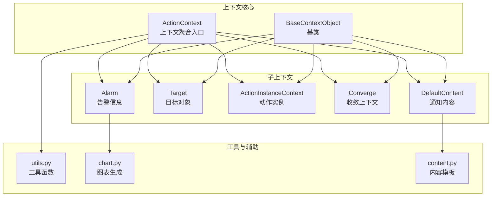
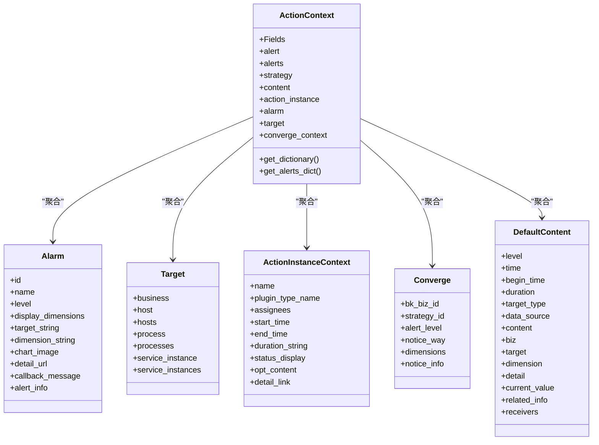
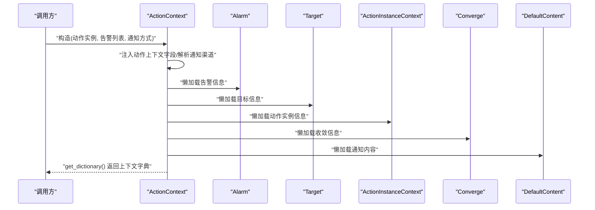
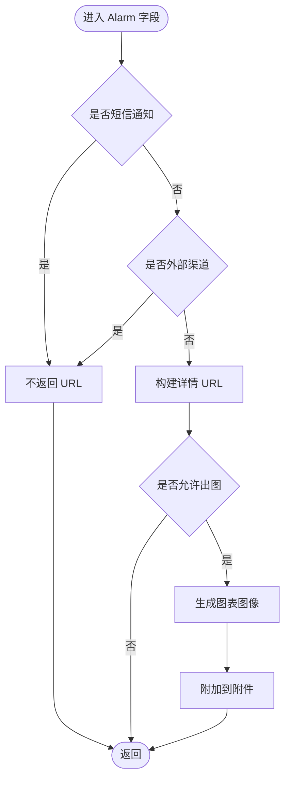
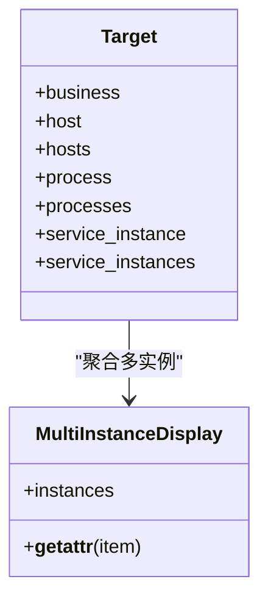
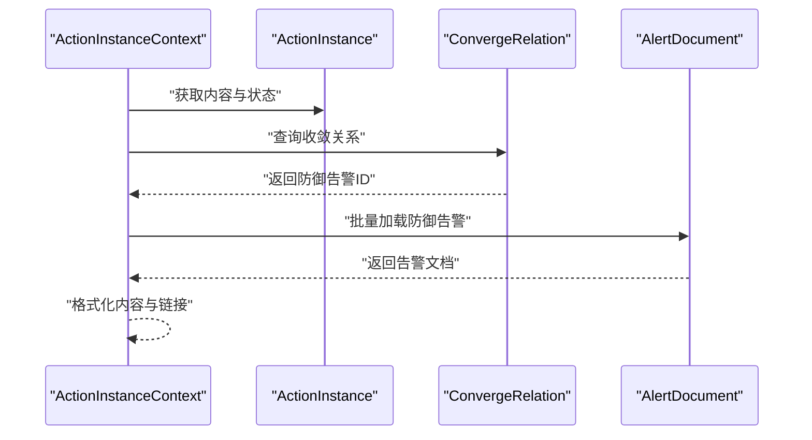
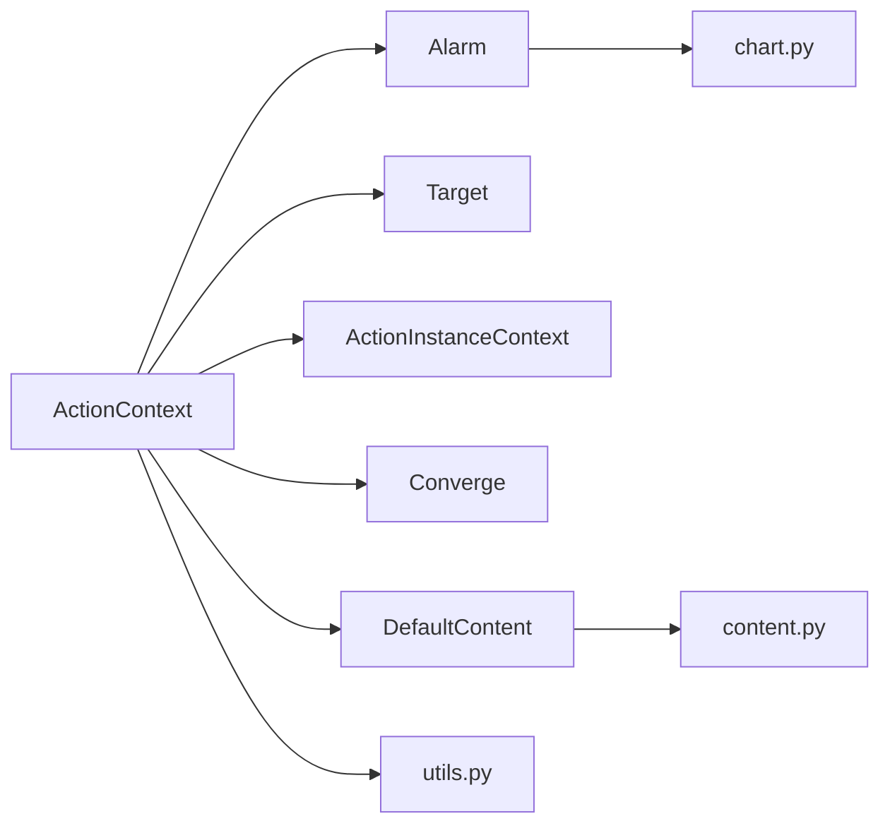

# 告警上下文管理

<cite>
**本文档引用的文件**
- [bkmonitor/alarm_backends/core/context/__init__.py](file://bkmonitor/alarm_backends/core/context/__init__.py)
- [bkmonitor/alarm_backends/core/context/action_instance.py](file://bkmonitor/alarm_backends/core/context/action_instance.py)
- [bkmonitor/alarm_backends/core/context/alarm.py](file://bkmonitor/alarm_backends/core/context/alarm.py)
- [bkmonitor/alarm_backends/core/context/target.py](file://bkmonitor/alarm_backends/core/context/target.py)
- [bkmonitor/alarm_backends/core/context/content.py](file://bkmonitor/alarm_backends/core/context/content.py)
- [bkmonitor/alarm_backends/core/context/converge.py](file://bkmonitor/alarm_backends/core/context/converge.py)
- [bkmonitor/alarm_backends/core/context/utils.py](file://bkmonitor/alarm_backends/core/context/utils.py)
- [bkmonitor/alarm_backends/core/context/chart.py](file://bkmonitor/alarm_backends/core/context/chart.py)
- [bkmonitor/alarm_backends/management/commands/context_preview.py](file://bkmonitor/alarm_backends/management/commands/context_preview.py)
</cite>

## 目录
1. [简介](#简介)
2. [项目结构](#项目结构)
3. [核心组件](#核心组件)
4. [架构总览](#架构总览)
5. [详细组件分析](#详细组件分析)
6. [依赖分析](#依赖分析)
7. [性能考量](#性能考量)
8. [故障排查指南](#故障排查指南)
9. [结论](#结论)
10. [附录](#附录)

## 简介
本技术文档围绕告警上下文管理模块，系统阐述告警上下文的构建机制、数据传递与状态维护策略，详解上下文对象的结构设计、实例化过程与生命周期管理，覆盖目标对象、动作实例与告警信息的上下文封装方式，并提供使用示例与序列化、持久化及跨模块共享机制说明，帮助开发者在告警处理流程中正确使用上下文信息。

## 项目结构
告警上下文管理位于 alarm_backends/core/context 目录，采用“按职责分层”的组织方式：
- 核心上下文入口与聚合：ActionContext
- 子上下文对象：Alarm、Target、ActionInstanceContext、Converge、DefaultContent 等
- 工具与辅助：utils、chart、content
- 命令行预览工具：context_preview

**图表来源**
- [bkmonitor/alarm_backends/core/context/__init__.py:43-576](file://bkmonitor/alarm_backends/core/context/__init__.py#L43-L576)
- [bkmonitor/alarm_backends/core/context/alarm.py:58-800](file://bkmonitor/alarm_backends/core/context/alarm.py#L58-L800)
- [bkmonitor/alarm_backends/core/context/target.py:44-238](file://bkmonitor/alarm_backends/core/context/target.py#L44-L238)
- [bkmonitor/alarm_backends/core/context/action_instance.py:42-342](file://bkmonitor/alarm_backends/core/context/action_instance.py#L42-L342)
- [bkmonitor/alarm_backends/core/context/converge.py:26-222](file://bkmonitor/alarm_backends/core/context/converge.py#L26-L222)
- [bkmonitor/alarm_backends/core/context/content.py:38-712](file://bkmonitor/alarm_backends/core/context/content.py#L38-L712)
- [bkmonitor/alarm_backends/core/context/utils.py:1-161](file://bkmonitor/alarm_backends/core/context/utils.py#L1-L161)
- [bkmonitor/alarm_backends/core/context/chart.py:1-236](file://bkmonitor/alarm_backends/core/context/chart.py#L1-L236)

**章节来源**
- [bkmonitor/alarm_backends/core/context/__init__.py:43-576](file://bkmonitor/alarm_backends/core/context/__init__.py#L43-L576)
- [bkmonitor/alarm_backends/core/context/alarm.py:58-800](file://bkmonitor/alarm_backends/core/context/alarm.py#L58-L800)
- [bkmonitor/alarm_backends/core/context/target.py:44-238](file://bkmonitor/alarm_backends/core/context/target.py#L44-L238)
- [bkmonitor/alarm_backends/core/context/action_instance.py:42-342](file://bkmonitor/alarm_backends/core/context/action_instance.py#L42-L342)
- [bkmonitor/alarm_backends/core/context/converge.py:26-222](file://bkmonitor/alarm_backends/core/context/converge.py#L26-L222)
- [bkmonitor/alarm_backends/core/context/content.py:38-712](file://bkmonitor/alarm_backends/core/context/content.py#L38-L712)
- [bkmonitor/alarm_backends/core/context/utils.py:1-161](file://bkmonitor/alarm_backends/core/context/utils.py#L1-L161)
- [bkmonitor/alarm_backends/core/context/chart.py:1-236](file://bkmonitor/alarm_backends/core/context/chart.py#L1-L236)

## 核心组件
- ActionContext：上下文聚合入口，负责组装告警、目标、动作实例、收敛、通知内容等子上下文，并提供字段序列化与模板渲染能力。
- Alarm：封装告警基本信息、维度、目标、图表、详情链接、关联信息等。
- Target：封装业务、主机、进程、服务实例等目标对象信息。
- ActionInstanceContext：封装动作实例的名称、状态、持续时间、处理链接等。
- Converge：封装收敛上下文，用于去重与收敛标识。
- DefaultContent/DimensionCollectContent/MultiStrategyCollectContent：封装通知内容模板字段，支持多通知方式的差异化输出。
- 工具模块：提供通知显示映射、维度处理、上下文字段计时等辅助能力。

**章节来源**
- [bkmonitor/alarm_backends/core/context/__init__.py:43-576](file://bkmonitor/alarm_backends/core/context/__init__.py#L43-L576)
- [bkmonitor/alarm_backends/core/context/alarm.py:58-800](file://bkmonitor/alarm_backends/core/context/alarm.py#L58-L800)
- [bkmonitor/alarm_backends/core/context/target.py:44-238](file://bkmonitor/alarm_backends/core/context/target.py#L44-L238)
- [bkmonitor/alarm_backends/core/context/action_instance.py:42-342](file://bkmonitor/alarm_backends/core/context/action_instance.py#L42-L342)
- [bkmonitor/alarm_backends/core/context/converge.py:26-222](file://bkmonitor/alarm_backends/core/context/converge.py#L26-L222)
- [bkmonitor/alarm_backends/core/context/content.py:38-712](file://bkmonitor/alarm_backends/core/context/content.py#L38-L712)
- [bkmonitor/alarm_backends/core/context/utils.py:1-161](file://bkmonitor/alarm_backends/core/context/utils.py#L1-L161)

## 架构总览
告警上下文管理采用“聚合-分层-延迟计算”的架构设计：
- 聚合入口：ActionContext 聚合各子上下文，统一对外暴露字段。
- 分层封装：Alarm、Target、ActionInstanceContext、Converge、DefaultContent 各司其职，职责清晰。
- 延迟计算：大量字段采用 cached_property，按需计算，降低初始化成本。
- 模板渲染：支持 Jinja2 渲染与多种通知方式的差异化格式化。

**图表来源**
- [bkmonitor/alarm_backends/core/context/__init__.py:43-576](file://bkmonitor/alarm_backends/core/context/__init__.py#L43-L576)
- [bkmonitor/alarm_backends/core/context/alarm.py:58-800](file://bkmonitor/alarm_backends/core/context/alarm.py#L58-L800)
- [bkmonitor/alarm_backends/core/context/target.py:44-238](file://bkmonitor/alarm_backends/core/context/target.py#L44-L238)
- [bkmonitor/alarm_backends/core/context/action_instance.py:42-342](file://bkmonitor/alarm_backends/core/context/action_instance.py#L42-L342)
- [bkmonitor/alarm_backends/core/context/converge.py:26-222](file://bkmonitor/alarm_backends/core/context/converge.py#L26-L222)
- [bkmonitor/alarm_backends/core/context/content.py:38-712](file://bkmonitor/alarm_backends/core/context/content.py#L38-L712)

## 详细组件分析

### ActionContext：上下文聚合与生命周期
- 实例化：接收 ActionInstance、相关动作、告警列表、通知方式等，动态注入字段，支持强制使用告警快照。
- 生命周期：
  - 初始化阶段：注入动作上下文字段、解析通知渠道、设置默认模板。
  - 计算阶段：按需计算告警、策略、目标、内容等子上下文。
  - 序列化阶段：get_dictionary() 汇总字段，支持模板渲染。
- 关键字段：
  - notice_channel、notice_way：通知渠道与方式。
  - alerts/alert：告警文档与代表告警。
  - strategy：策略对象。
  - content：通知内容对象（按收敛类型选择不同实现）。
  - action_instance/action_instance_content：动作实例上下文。
  - converge_context：收敛上下文。
- 模板与渲染：
  - content_template/default_content_template/title_template：模板选择与拼接。
  - get_dictionary()：统一导出上下文字典，供模板引擎使用。

**图表来源**
- [bkmonitor/alarm_backends/core/context/__init__.py:102-540](file://bkmonitor/alarm_backends/core/context/__init__.py#L102-L540)

**章节来源**
- [bkmonitor/alarm_backends/core/context/__init__.py:102-540](file://bkmonitor/alarm_backends/core/context/__init__.py#L102-L540)

### Alarm：告警信息封装
- 维度与目标：
  - display_dimensions/new_dimensions/origin_dimensions：维度集合与展示形式。
  - target_string/display_targets：目标字符串与展示目标。
- 时间与持续：
  - time/begin_time/duration/duration_string：时间与持续时长。
- 图表与附件：
  - chart_image/attachments：基于原始告警生成图表并作为附件。
- 链接与操作：
  - detail_url/example_detail_url/quick_ack_url/quick_shield_url：详情与快捷操作链接。
- 关联信息与屏蔽：
  - related_info/log_related_info/log_raw_related_info：关联信息。
  - is_shielded：是否被屏蔽。
- 回调与策略：
  - callback_message/alert_info：回调数据与告警信息。
  - strategy_url：策略详情链接。

**图表来源**
- [bkmonitor/alarm_backends/core/context/alarm.py:442-483](file://bkmonitor/alarm_backends/core/context/alarm.py#L442-L483)
- [bkmonitor/alarm_backends/core/context/alarm.py:283-357](file://bkmonitor/alarm_backends/core/context/alarm.py#L283-L357)

**章节来源**
- [bkmonitor/alarm_backends/core/context/alarm.py:77-800](file://bkmonitor/alarm_backends/core/context/alarm.py#L77-L800)

### Target：目标对象封装
- 业务：business，包含业务人员字符串等。
- 主机：host/hosts，支持多实例聚合显示。
- 进程与服务实例：process/processes/service_instance/service_instances。
- 环境与拓扑：通过 CMDB 缓存管理器获取拓扑链路与环境标签。

**图表来源**
- [bkmonitor/alarm_backends/core/context/target.py:25-42](file://bkmonitor/alarm_backends/core/context/target.py#L25-L42)
- [bkmonitor/alarm_backends/core/context/target.py:207-238](file://bkmonitor/alarm_backends/core/context/target.py#L207-L238)

**章节来源**
- [bkmonitor/alarm_backends/core/context/target.py:44-238](file://bkmonitor/alarm_backends/core/context/target.py#L44-L238)

### ActionInstanceContext：动作实例上下文
- 基本信息：name、plugin_type_name、assignees。
- 时间与状态：start_time/end_time/duration/duration_string/status_display/status_reason_display。
- 内容与链接：opt_content/opt_content_markdown/detail_link。
- 防御与收敛：defensed_alerts/defensed_alerts_info/converge_id/converged_description。
- 模板细节：template_detail，支持 Jinja2 渲染。

**图表来源**
- [bkmonitor/alarm_backends/core/context/action_instance.py:154-173](file://bkmonitor/alarm_backends/core/context/action_instance.py#L154-L173)
- [bkmonitor/alarm_backends/core/context/action_instance.py:211-226](file://bkmonitor/alarm_backends/core/context/action_instance.py#L211-L226)

**章节来源**
- [bkmonitor/alarm_backends/core/context/action_instance.py:42-342](file://bkmonitor/alarm_backends/core/context/action_instance.py#L42-L342)

### Converge：收敛上下文
- 业务与目标：bk_biz_id、bk_host_id、bk_set_ids、bk_module_ids、rack_id、net_device_id、idc_unit_name。
- 策略与动作：strategy_id、action_id、signal、notice_way、notice_receiver。
- 维度与标识：dimensions、alert_info、notice_info、action_info。
- 用户与渠道：user_type、group_notice_way。

**章节来源**
- [bkmonitor/alarm_backends/core/context/converge.py:26-222](file://bkmonitor/alarm_backends/core/context/converge.py#L26-L222)

### DefaultContent/DimensionCollectContent/MultiStrategyCollectContent：通知内容模板
- DefaultContent：基础通知内容字段，支持多通知方式的差异化格式化。
- DimensionCollectContent：同维度汇总内容，邮件/短信/微信等差异化字段。
- MultiStrategyCollectContent：多策略多维度汇总内容，邮件/短信/微信等差异化字段。
- 支持：Markdown 格式化、维度下钻、推荐指标、接收人等。

**章节来源**
- [bkmonitor/alarm_backends/core/context/content.py:38-712](file://bkmonitor/alarm_backends/core/context/content.py#L38-L712)

### 工具与辅助：utils 与 chart
- utils：
  - get_business_roles：获取业务角色。
  - collect_info_dumps：汇总信息转字符串。
  - get_target_dimension_keys/get_display_dimensions/get_display_targets：维度与目标处理。
  - get_notice_display_mapping：通知显示映射。
  - context_field_timer：上下文字段计时与指标上报。
- chart：基于浏览器渲染生成告警图表，支持多时段对比与单位转换。

**章节来源**
- [bkmonitor/alarm_backends/core/context/utils.py:1-161](file://bkmonitor/alarm_backends/core/context/utils.py#L1-L161)
- [bkmonitor/alarm_backends/core/context/chart.py:1-236](file://bkmonitor/alarm_backends/core/context/chart.py#L1-L236)

## 依赖分析
- 组件耦合：
  - ActionContext 作为聚合入口，依赖 Alarm、Target、ActionInstanceContext、Converge、DefaultContent。
  - Alarm 依赖策略与告警文档、事件文档、图表生成。
  - Target 依赖 CMDB 缓存管理器与业务模型。
  - Content 依赖通知渲染器与单位转换。
- 外部依赖：
  - Elasticsearch 文档模型（AlertDocument、ActionInstanceDocument）。
  - Django 缓存与 cached_property。
  - Prometheus 指标上报。
- 潜在循环依赖：
  - 子上下文通过 parent 引用 ActionContext，形成单向依赖，避免循环。

**图表来源**
- [bkmonitor/alarm_backends/core/context/__init__.py:378-424](file://bkmonitor/alarm_backends/core/context/__init__.py#L378-L424)
- [bkmonitor/alarm_backends/core/context/alarm.py:283-357](file://bkmonitor/alarm_backends/core/context/alarm.py#L283-L357)
- [bkmonitor/alarm_backends/core/context/content.py:1-712](file://bkmonitor/alarm_backends/core/context/content.py#L1-L712)
- [bkmonitor/alarm_backends/core/context/utils.py:1-161](file://bkmonitor/alarm_backends/core/context/utils.py#L1-L161)
- [bkmonitor/alarm_backends/core/context/chart.py:1-236](file://bkmonitor/alarm_backends/core/context/chart.py#L1-L236)

**章节来源**
- [bkmonitor/alarm_backends/core/context/__init__.py:378-424](file://bkmonitor/alarm_backends/core/context/__init__.py#L378-L424)

## 性能考量
- 延迟计算：大量字段使用 cached_property，按需计算，避免一次性加载全部数据。
- 指标埋点：context_field_timer 包装字段访问，统计耗时并上报 Prometheus 指标，便于性能分析。
- 图表渲染：异步浏览器渲染，避免阻塞主线程；仅在允许出图且满足条件时生成。
- 缓存利用：通过 ActionInstanceDocument、AlertDocument、策略与业务缓存减少数据库访问。

[本节为通用性能建议，无需特定文件引用]

## 故障排查指南
- 上下文字段缺失或为空：
  - 检查 ActionContext.get_dictionary() 是否正确注入字段。
  - 确认 cached_property 是否触发异常导致返回 None。
- 告警/事件文档加载失败：
  - 检查 AlertDocument/ActionInstanceDocument 的可用性与权限。
  - 关注 get_alerts_dict 与 get_alerts_dict 的日志输出。
- 图表生成异常：
  - 检查 GRAPH_RENDER_SERVICE_ENABLED 与策略配置。
  - 关注 chart_image_enabled 与数据源类型限制。
- 命令行预览：
  - 使用 context_preview 命令验证上下文变量与模板渲染一致性。
  - 支持单变量、批量变量与 JSON/模板两种输出格式。

**章节来源**
- [bkmonitor/alarm_backends/core/context/__init__.py:527-570](file://bkmonitor/alarm_backends/core/context/__init__.py#L527-L570)
- [bkmonitor/alarm_backends/core/context/alarm.py:351-357](file://bkmonitor/alarm_backends/core/context/alarm.py#L351-L357)
- [bkmonitor/alarm_backends/management/commands/context_preview.py:204-254](file://bkmonitor/alarm_backends/management/commands/context_preview.py#L204-L254)

## 结论
告警上下文管理模块通过 ActionContext 聚合各子上下文，采用延迟计算与指标埋点提升性能，结合模板渲染与多通知方式差异化输出，实现了告警处理流程中的上下文封装与传递。配合命令行预览工具与完善的日志输出，能够有效支撑告警通知的调试与优化。

[本节为总结性内容，无需特定文件引用]

## 附录

### 使用示例：在告警处理流程中正确使用上下文
- 构造 ActionContext 并获取上下文字典：
  - 输入：动作实例、告警文档列表、通知方式。
  - 输出：上下文字典，供模板渲染使用。
- 模板渲染：
  - 使用 Jinja2Renderer.render 渲染 content_template/title_template。
- 命令行调试：
  - 使用 context_preview 命令预览变量与渲染效果。

**章节来源**
- [bkmonitor/alarm_backends/management/commands/context_preview.py:224-249](file://bkmonitor/alarm_backends/management/commands/context_preview.py#L224-L249)

### 序列化、持久化与跨模块共享
- 序列化：ActionContext.get_dictionary() 返回字典，便于序列化为 JSON。
- 持久化：上下文字典可保存至消息队列或日志系统，用于审计与回放。
- 跨模块共享：通过 ActionContext 统一导出字段，模板渲染与通知发送模块共享同一上下文对象，确保一致性。

**章节来源**
- [bkmonitor/alarm_backends/core/context/__init__.py:527-540](file://bkmonitor/alarm_backends/core/context/__init__.py#L527-L540)