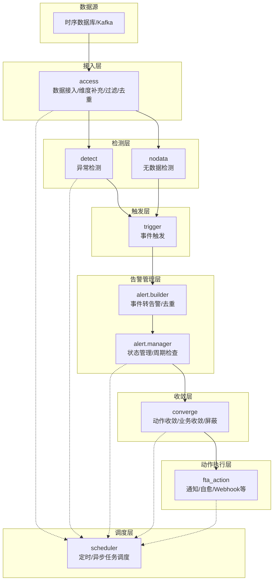
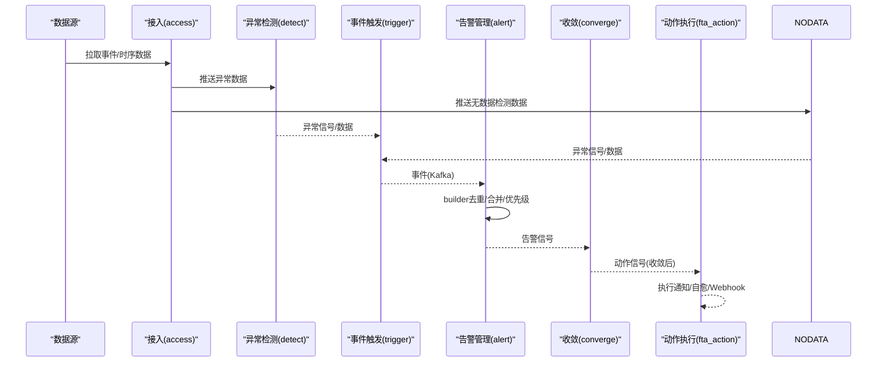
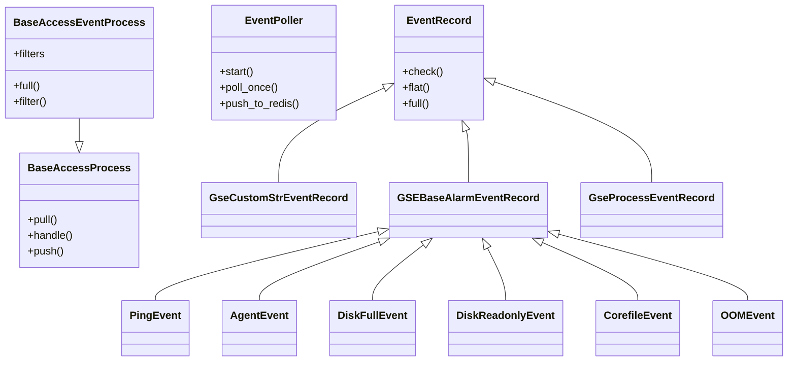
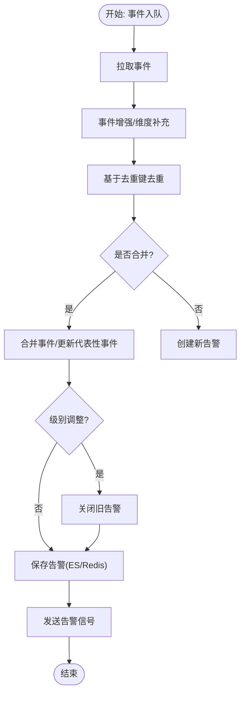
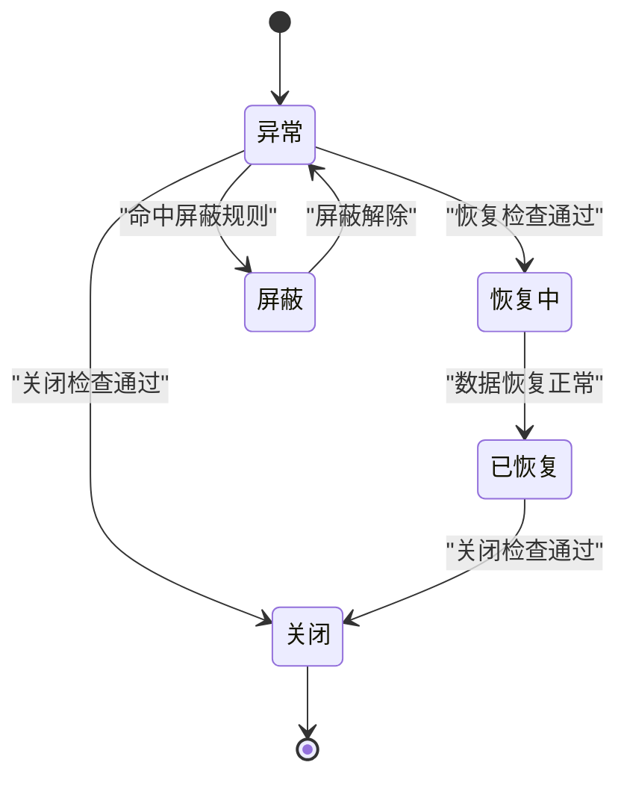
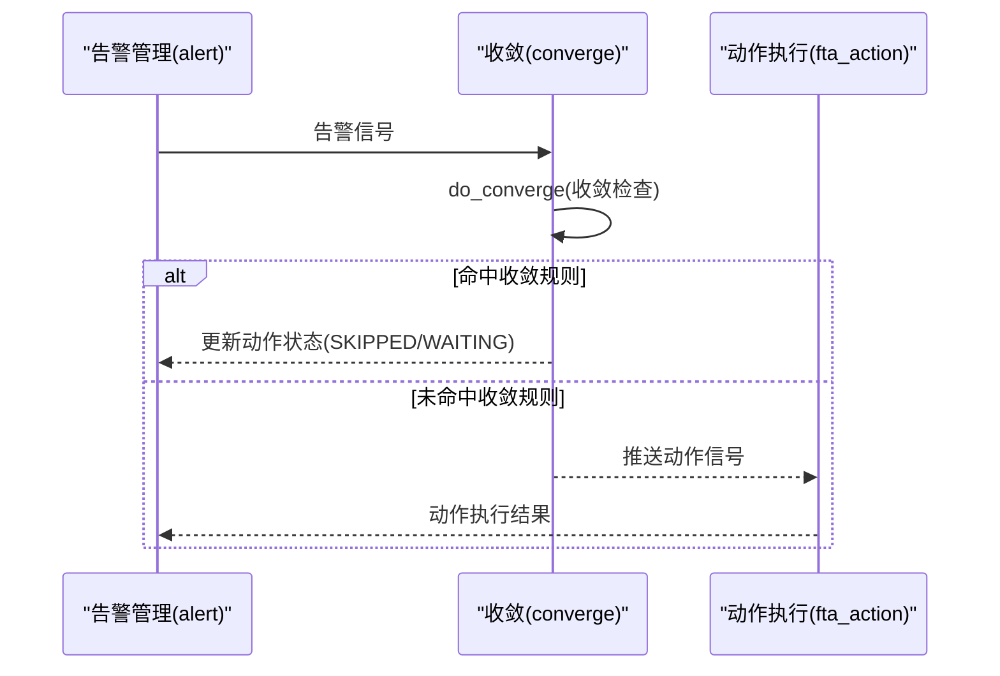
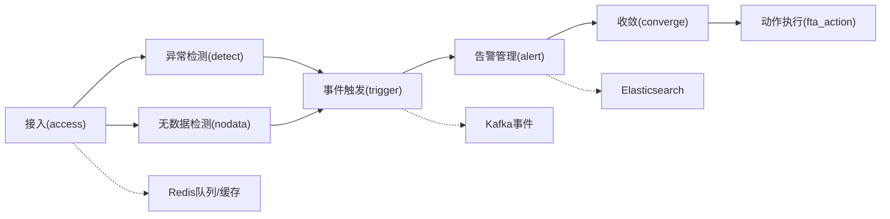

# 告警处理引擎

<cite>
**本文引用的文件**
- [告警数据流.md](file://ai-docs/bk-monitor/docs/告警后台(alarm_backends)/告警数据流.md)
- [access.event事件处理流程详解.md](file://ai-docs/bk-monitor/docs/告警后台(alarm_backends)/modules/access/access.event事件处理流程详解.md)
- [去重机制详解.md](file://ai-docs/bk-monitor/docs/告警后台(alarm_backends)/modules/access/去重机制详解.md)
- [converge业务逻辑与数据处理流程.md](file://ai-docs/bk-monitor/docs/告警后台(alarm_backends)/modules/converge/业务逻辑与数据处理流程.md)
</cite>

## 目录
1. [简介](#简介)
2. [项目结构](#项目结构)
3. [核心组件](#核心组件)
4. [架构总览](#架构总览)
5. [详细组件分析](#详细组件分析)
6. [依赖分析](#依赖分析)
7. [性能考量](#性能考量)
8. [故障排查指南](#故障排查指南)
9. [结论](#结论)
10. [附录](#附录)

## 简介
本文件面向“告警处理引擎”的技术文档，聚焦于告警事件的生成、适配器模式的应用、告警状态转换机制，以及告警对象的数据结构、事件处理器的实现原理、生命周期管理。文档还涵盖告警去重、合并与优先级计算的算法实现，并提供扩展告警处理器与自定义告警行为的实践指导，解释与其他模块的集成方式及性能优化策略。

## 项目结构
告警处理引擎采用模块化与队列化架构，数据在各模块间通过 Redis 队列与 Kafka 流转。核心模块包括：接入(access)、异常检测(detect)、无数据检测(nodata)、事件触发(trigger)、告警管理(alert)、收敛(converge)、动作执行(fta_action)、任务调度(scheduler)。

图表来源
- [告警数据流.md](file://ai-docs/bk-monitor/docs/告警后台(alarm_backends)/告警数据流.md#L53-L800)

章节来源
- [告警数据流.md](file://ai-docs/bk-monitor/docs/告警后台(alarm_backends)/告警数据流.md#L1-L200)

## 核心组件
- 接入模块(access)
  - 事件拉取(Kafka/Redis中转)、事件类型识别、维度补充、过滤、QoS控制、推送至异常检测队列。
  - 关键流程：V1/V2两种事件处理模式，事件轮询器(EventPoller)、事件记录类(EventRecord)、过滤器链(Filter)、QoS混合器(QoSMixin)。
- 异常检测模块(detect)
  - 从接入队列拉取数据，加载检测算法，生成异常记录，推送至触发队列。
- 无数据检测模块(nodata)
  - 周期性检测无数据告警，生成异常记录并推送至触发队列。
- 事件触发模块(trigger)
  - 基于策略快照与触发配置判断是否触发事件，生成事件并推送至Kafka。
- 告警管理模块(alert)
  - builder：事件转告警、去重、合并、优先级调整、保存至ES与Redis缓存。
  - manager：周期检查、状态转换(异常/恢复/关闭)、动作触发信号。
- 收敛模块(converge)
  - 动作收敛与业务收敛，支持等待、防御、跳过、汇集、触发等收敛函数。
- 动作执行模块(fta_action)
  - 通知、Webhook、作业、标准运维等动作执行，支持收敛前置检查与分发。
- 调度模块(scheduler)
  - 统一管理定时与异步任务，设置任务超时与监控。

章节来源
- [告警数据流.md](file://ai-docs/bk-monitor/docs/告警后台(alarm_backends)/告警数据流.md#L1-L800)
- [access.event事件处理流程详解.md](file://ai-docs/bk-monitor/docs/告警后台(alarm_backends)/modules/access/access.event事件处理流程详解.md#L1-L200)
- [去重机制详解.md](file://ai-docs/bk-monitor/docs/告警后台(alarm_backends)/modules/access/去重机制详解.md#L1-L120)
- [converge业务逻辑与数据处理流程.md](file://ai-docs/bk-monitor/docs/告警后台(alarm_backends)/modules/converge/业务逻辑与数据处理流程.md#L1-L120)

## 架构总览
告警处理引擎以“事件驱动+队列化”为核心，通过多层模块协作完成从原始事件到动作执行的全链路处理。数据在模块间以Redis队列与Kafka消息传递，结合分布式锁与缓存实现高吞吐与一致性。

图表来源
- [告警数据流.md](file://ai-docs/bk-monitor/docs/告警后台(alarm_backends)/告警数据流.md#L53-L800)

## 详细组件分析

### 接入模块：事件处理与适配器模式
- 事件拉取与类型识别
  - V1：直接从Kafka消费，Celery任务调度。
  - V2：EventPoller将Kafka事件推送到Redis中转队列，Worker从Redis拉取并处理，降低Kafka压力。
  - 事件类型识别：根据事件类型实例化对应事件记录类(EventRecord子类)，支持GSE基础告警、自定义事件、进程托管事件等。
- 维度补充(full)
  - 补充主机、拓扑、业务等维度；按策略匹配维度，克隆事件记录并绑定策略。
- 过滤(filter)
  - 过期过滤、主机状态过滤、范围过滤、条件过滤；过滤器链按顺序执行。
- QoS控制
  - 流量控制，防止告警风暴；支持高优先级队列与独立信号通道。
- 适配器模式
  - 事件记录类通过统一接口实现不同事件类型的解析与展平，便于扩展新的事件类型。

图表来源
- [access.event事件处理流程详解.md](file://ai-docs/bk-monitor/docs/告警后台(alarm_backends)/modules/access/access.event事件处理流程详解.md#L40-L120)

章节来源
- [access.event事件处理流程详解.md](file://ai-docs/bk-monitor/docs/告警后台(alarm_backends)/modules/access/access.event事件处理流程详解.md#L120-L480)

### 告警构建：去重、合并与优先级
- 去重机制
  - 基于record_id(维度MD5+时间戳)去重；按时间点分组存储于Redis Set，TTL基于最大聚合周期计算。
  - 内存缓存(record_ids_cache)与延迟写入(pending_to_add)优化性能；时间点限制后清理被丢弃时间点的缓存。
- 合并与优先级
  - 相同维度事件合并为同一告警；当新事件级别更高时，关闭旧告警并创建新告警。
- 事件增强与保存
  - 补充CMDB与策略维度；事件去重后批量保存至ES；告警对象保存至ES与Redis缓存。

图表来源
- [告警数据流.md](file://ai-docs/bk-monitor/docs/告警后台(alarm_backends)/告警数据流.md#L431-L550)
- [去重机制详解.md](file://ai-docs/bk-monitor/docs/告警后台(alarm_backends)/modules/access/去重机制详解.md#L97-L330)

章节来源
- [告警数据流.md](file://ai-docs/bk-monitor/docs/告警后台(alarm_backends)/告警数据流.md#L431-L550)
- [去重机制详解.md](file://ai-docs/bk-monitor/docs/告警后台(alarm_backends)/modules/access/去重机制详解.md#L97-L330)

### 告警状态转换机制
- 状态检查器序列
  - 下一阶段检查、关闭检查、恢复检查、屏蔽检查、确认检查、级别升级检查、动作处理检查。
- 周期检查与恢复检测
  - 定期从ES拉取未恢复告警，依据策略周期与数据恢复情况更新状态。
- 分布式锁与重试
  - 使用Redis分布式锁避免并发更新；加锁失败的告警延迟重试，确保一致性。

图表来源
- [告警数据流.md](file://ai-docs/bk-monitor/docs/告警后台(alarm_backends)/告警数据流.md#L503-L550)

章节来源
- [告警数据流.md](file://ai-docs/bk-monitor/docs/告警后台(alarm_backends)/告警数据流.md#L503-L550)

### 收敛模块：动作收敛与业务收敛
- 收敛类型
  - 动作收敛(ACTION)：对告警处理动作进行收敛。
  - 业务收敛(CONVERGE)：对业务维度进行二级收敛。
- 收敛函数
  - 等待后处理、异常防御需审批、超出后忽略、汇集相关事件、收敛后处理。
- 屏蔽管理
  - 支持按策略ID、IP、业务、集群、时间范围等维度屏蔽告警，屏蔽告警不触发动作执行。

图表来源
- [告警数据流.md](file://ai-docs/bk-monitor/docs/告警后台(alarm_backends)/告警数据流.md#L551-L610)
- [converge业务逻辑与数据处理流程.md](file://ai-docs/bk-monitor/docs/告警后台(alarm_backends)/modules/converge/业务逻辑与数据处理流程.md#L49-L120)

章节来源
- [告警数据流.md](file://ai-docs/bk-monitor/docs/告警后台(alarm_backends)/告警数据流.md#L551-L610)
- [converge业务逻辑与数据处理流程.md](file://ai-docs/bk-monitor/docs/告警后台(alarm_backends)/modules/converge/业务逻辑与数据处理流程.md#L49-L120)

### 事件触发：适配器与触发条件
- 适配器
  - MonitorEventAdapter.adapt()将异常记录转换为标准事件格式，统一后续处理。
- 触发条件
  - 基于策略快照与触发配置(检测窗口、触发次数)判断是否触发事件；按级别从高到低检查，避免低级别覆盖高级别。

章节来源
- [告警数据流.md](file://ai-docs/bk-monitor/docs/告警后台(alarm_backends)/告警数据流.md#L359-L430)

### 动作执行：通知与自愈
- 动作类型
  - 通知(邮件/短信/语音/企业微信)、Webhook(HTTP/HTTPS)、作业(蓝鲸作业平台)、标准运维、消息队列。
- 执行前检查
  - 告警是否已恢复、动作是否被屏蔽、熔断检查；执行后记录日志与结果。
- 分发与收敛
  - 先进行收敛处理，再分发至不同Celery队列执行。

章节来源
- [告警数据流.md](file://ai-docs/bk-monitor/docs/告警后台(alarm_backends)/告警数据流.md#L605-L680)

## 依赖分析
- 模块耦合
  - 接入模块与异常检测模块通过Redis队列解耦；异常检测与无数据检测共同输出至触发模块。
  - 触发模块与告警管理模块通过Kafka事件解耦；告警管理模块与收敛模块通过信号解耦。
- 外部依赖
  - Redis：服务间队列(DB9)、临时缓存与锁(DB10)。
  - Elasticsearch：事件与告警的持久化存储。
  - Kafka：事件传输通道。
- 循环依赖
  - 模块间通过队列与信号解耦，避免直接循环依赖。

图表来源
- [告警数据流.md](file://ai-docs/bk-monitor/docs/告警后台(alarm_backends)/告警数据流.md#L53-L200)

章节来源
- [告警数据流.md](file://ai-docs/bk-monitor/docs/告警后台(alarm_backends)/告警数据流.md#L53-L200)

## 性能考量
- 去重与时间点限制
  - 去重基于Redis Set，TTL按最大聚合周期计算；内存缓存与延迟写入减少Redis访问；时间点限制控制下游数据量。
- 批量处理与拆分
  - 大数据量自动拆分为多个批量任务，避免单次处理过多数据。
- QoS与流控
  - 高优先级数据源使用独立队列与扩展周期；TokenBucket流控防止检测过于频繁。
- Redis分片与Pipeline
  - 去重Key按策略ID分片；Pipeline批量写入提升吞吐。
- 延迟监控与溢出检查
  - 记录access→detect、detect→trigger的延迟；异常/事件数量超过阈值时上报指标。

章节来源
- [告警数据流.md](file://ai-docs/bk-monitor/docs/告警后台(alarm_backends)/告警数据流.md#L156-L235)
- [去重机制详解.md](file://ai-docs/bk-monitor/docs/告警后台(alarm_backends)/modules/access/去重机制详解.md#L371-L413)

## 故障排查指南
- 告警风暴与过期事件
  - 检查QoS与过期过滤配置；确认事件时间戳与策略周期设置。
- 去重失效
  - 核对record_id生成规则(维度MD5+时间戳)；检查Redis去重Key与TTL；确认时间点限制后缓存清理逻辑。
- 收敛误判
  - 检查收敛维度与收敛函数配置；确认屏蔽规则是否命中。
- 动作执行失败
  - 查看动作执行前检查(恢复/屏蔽/熔断)；核对动作类型与队列配置；关注执行日志与结果。
- 数据流中断
  - 检查Redis队列与Kafka连接；确认信号队列与任务调度状态。

章节来源
- [告警数据流.md](file://ai-docs/bk-monitor/docs/告警后台(alarm_backends)/告警数据流.md#L53-L200)
- [converge业务逻辑与数据处理流程.md](file://ai-docs/bk-monitor/docs/告警后台(alarm_backends)/modules/converge/业务逻辑与数据处理流程.md#L112-L143)

## 结论
告警处理引擎通过模块化与队列化设计，实现了从事件接入到动作执行的全链路自动化处理。其核心特性包括：事件适配器模式提升扩展性、严格的去重与时间点限制保障幂等与性能、收敛模块避免告警风暴、状态管理与周期检查确保告警生命周期可控。通过Redis与Kafka的合理使用，系统在高并发场景下仍能保持稳定与高效。

## 附录
- 扩展告警处理器与自定义行为
  - 新增事件类型：继承事件记录基类，实现check/flat/full方法；在处理器中注册事件类型映射。
  - 自定义过滤器：实现Filter接口，加入过滤器链；按策略配置动态启用。
  - 自定义收敛函数：实现收敛函数接口，配置到收敛规则中；支持等待、防御、跳过、汇集、触发等。
  - 自定义动作：扩展动作类型与执行器，配置分发队列；在动作执行前检查中增加校验逻辑。
- 集成要点
  - 事件适配：统一事件格式，确保MonitorEventAdapter适配成功。
  - 队列与信号：遵循模块间约定的Key命名与队列结构。
  - 缓存与锁：使用Redis分布式锁与缓存，避免并发冲突。
- 性能优化建议
  - 合理设置聚合周期与TTL；利用Pipeline批量写入；启用时间点限制与QoS控制；监控延迟与溢出指标并及时告警。

章节来源
- [access.event事件处理流程详解.md](file://ai-docs/bk-monitor/docs/告警后台(alarm_backends)/modules/access/access.event事件处理流程详解.md#L430-L585)
- [告警数据流.md](file://ai-docs/bk-monitor/docs/告警后台(alarm_backends)/告警数据流.md#L53-L200)