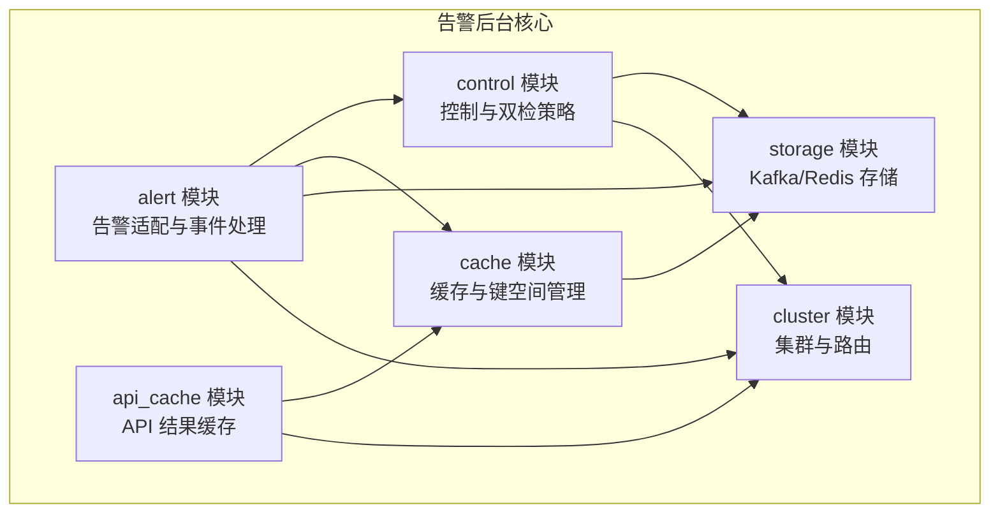
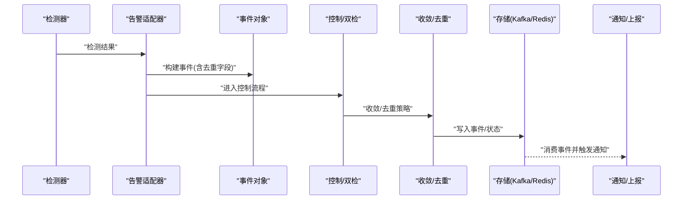
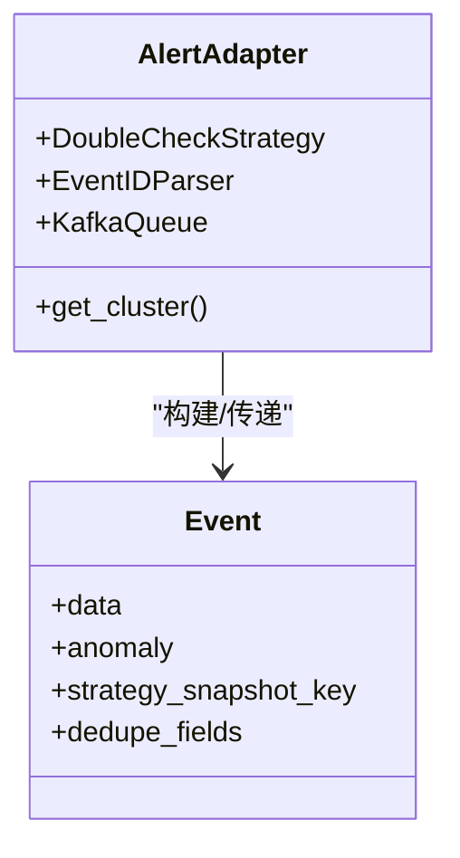
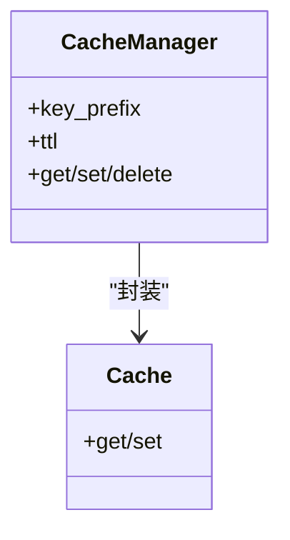
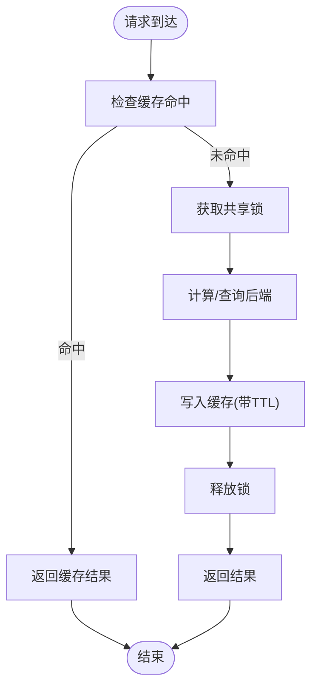
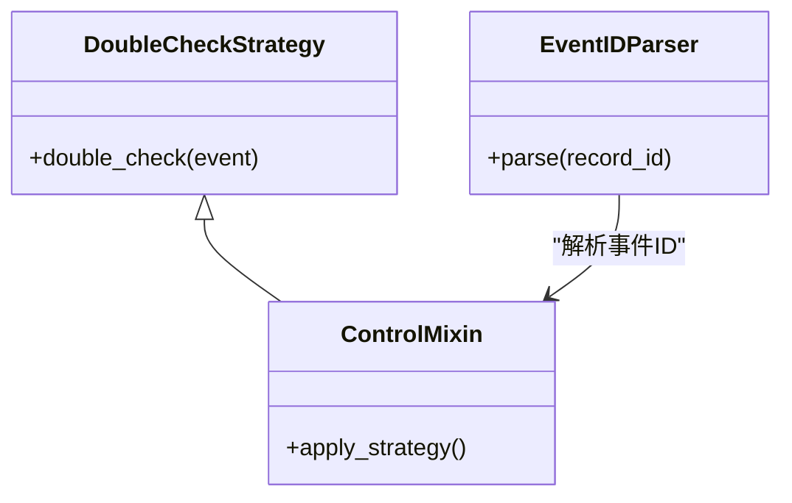
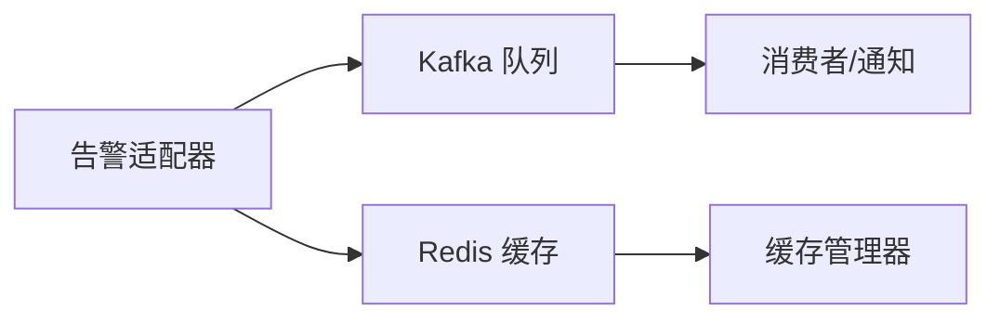
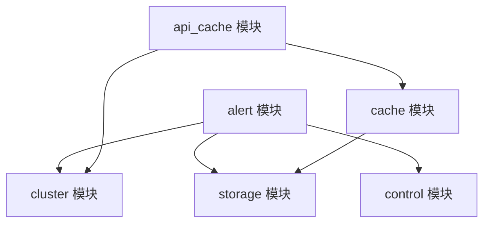

# 告警引擎核心

<cite>
**本文引用的文件**
- [apps.py](file://bkmonitor/alarm_backends/apps.py)
- [constants.py](file://bkmonitor/alarm_backends/constants.py)
- [adapter.py](file://bkmonitor/alarm_backends/core/alert/adapter.py)
- [alert.py](file://bkmonitor/alarm_backends/core/alert/alert.py)
- [event.py](file://bkmonitor/alarm_backends/core/alert/event.py)
- [base.py](file://bkmonitor/alarm_backends/core/cache/base.py)
- [assign.py](file://bkmonitor/alarm_backends/core/cache/assign.py)
- [library.py](file://bkmonitor/alarm_backends/core/api_cache/library.py)
- [hashring.py](file://bkmonitor/alarm_backends/management/hashring.py)
- [cluster.py](file://bkmonitor/alarm_backends/core/cluster.py)
- [control.py](file://bkmonitor/alarm_backends/core/control/__init__.py)
- [double_check.py](file://bkmonitor/alarm_backends/core/control/mixins/double_check.py)
- [record_parser.py](file://bkmonitor/alarm_backends/core/control/record_parser.py)
- [kafka.py](file://bkmonitor/alarm_backends/core/storage/kafka.py)
- [redis.py](file://bkmonitor/alarm_backends/core/storage/redis.py)
- [PROCESS_OVER_FLOW指标说明.md](file://ai-docs/bk-monitor/docs/告警后台(alarm_backends)/PROCESS_OVER_FLOW指标说明.md)
- [backend_alert-db迁移操作手册.md](file://ai-docs/bk-monitor/docs/告警后台(alarm_backends)/backend_alert-db迁移操作手册.md)
- [告警数据流.md](file://ai-docs/bk-monitor/docs/告警后台(alarm_backends)/告警数据流.md)
- [部署架构.md](file://ai-docs/bk-monitor/docs/告警后台(alarm_backends)/部署架构.md)
- [项目配置.md](file://ai-docs/bk-monitor/docs/告警后台(alarm_backends)/项目配置.md)
- [access.event事件处理流程详解.md](file://ai-docs/bk-monitor/docs/告警后台(alarm_backends)/modules/access/access.event事件处理流程详解.md)
- [去重机制详解.md](file://ai-docs/bk-monitor/docs/告警后台(alarm_backends)/modules/access/去重机制详解.md)
- [周期拉取与数据不遗漏保障机制.md](file://ai-docs/bk-monitor/docs/告警后台(alarm_backends)/modules/access/周期拉取与数据不遗漏保障机制.md)
- [业务逻辑与数据处理流程.md](file://ai-docs/bk-monitor/docs/告警后台(alarm_backends)/modules/access/业务逻辑与数据处理流程.md)
- [alert.业务逻辑与数据处理流程.md](file://ai-docs/bk-monitor/docs/告警后台(alarm_backends)/modules/alert/业务逻辑与数据处理流程.md)
- [composite.业务逻辑与数据处理流程.md](file://ai-docs/bk-monitor/docs/告警后台(alarm_backends)/modules/composite/业务逻辑与数据处理流程.md)
- [converge.业务逻辑与数据处理流程.md](file://ai-docs/bk-monitor/docs/告警后台(alarm_backends)/modules/converge/业务逻辑与数据处理流程.md)
</cite>

## 目录
1. [简介](#简介)
2. [项目结构](#项目结构)
3. [核心组件](#核心组件)
4. [架构总览](#架构总览)
5. [详细组件分析](#详细组件分析)
6. [依赖分析](#依赖分析)
7. [性能考虑](#性能考虑)
8. [故障排查指南](#故障排查指南)
9. [结论](#结论)
10. [附录](#附录)

## 简介
本技术文档聚焦于告警引擎核心模块，系统性阐述其整体架构设计、核心组件职责与数据流转机制；深入解析告警上下文管理、检测结果处理、控制流程管理与事件处理器实现原理；并给出告警状态机设计思路、异常处理机制与性能优化策略。文档同时提供可追溯的源码路径与配置说明，帮助开发者快速理解与扩展告警引擎。

## 项目结构
告警引擎核心模块位于 alarm_backends 子系统中，采用“按功能域分层”的组织方式：核心告警处理（alert）、缓存（cache）、API 缓存（api_cache）、集群与存储（storage）、控制与校验（control）等。模块间通过清晰的接口耦合，形成从“检测结果输入”到“告警事件输出”的完整闭环。

图表来源
- [apps.py:16-22](file://bkmonitor/alarm_backends/apps.py#L16-L22)
- [constants.py:11-81](file://bkmonitor/alarm_backends/constants.py#L11-L81)
- [adapter.py:18-21](file://bkmonitor/alarm_backends/core/alert/adapter.py#L18-L21)
- [alert.py:20-29](file://bkmonitor/alarm_backends/core/alert/alert.py#L20-L29)
- [event.py:14](file://bkmonitor/alarm_backends/core/alert/event.py#L14)
- [base.py:14-16](file://bkmonitor/alarm_backends/core/cache/base.py#L14-L16)
- [assign.py:12-14](file://bkmonitor/alarm_backends/core/cache/assign.py#L12-L14)
- [library.py:28-30](file://bkmonitor/alarm_backends/core/api_cache/library.py#L28-L30)
- [kafka.py](file://bkmonitor/alarm_backends/core/storage/kafka.py)
- [redis.py](file://bkmonitor/alarm_backends/core/storage/redis.py)

章节来源
- [apps.py:16-22](file://bkmonitor/alarm_backends/apps.py#L16-L22)
- [constants.py:11-81](file://bkmonitor/alarm_backends/constants.py#L11-L81)

## 核心组件
- 告警适配器与事件处理：负责将检测结果转换为统一事件，并进行去重、收敛与后续处理。
- 缓存与键空间：提供统一的缓存抽象与键前缀管理，支撑告警状态、收敛窗口与分配策略。
- API 缓存：对高频查询结果进行缓存，结合一致性哈希与共享锁，降低后端压力。
- 控制与双检：提供控制流程与双检策略，确保告警触发的准确性与稳定性。
- 存储层：基于 Kafka 的消息队列与 Redis 的键值缓存，支撑高吞吐与低延迟场景。
- 集群与路由：提供节点选择、一致性哈希与路由策略，保证负载均衡与数据定位。

章节来源
- [adapter.py:18-21](file://bkmonitor/alarm_backends/core/alert/adapter.py#L18-L21)
- [alert.py:20-29](file://bkmonitor/alarm_backends/core/alert/alert.py#L20-L29)
- [event.py:14](file://bkmonitor/alarm_backends/core/alert/event.py#L14)
- [base.py:14-16](file://bkmonitor/alarm_backends/core/cache/base.py#L14-L16)
- [assign.py:12-14](file://bkmonitor/alarm_backends/core/cache/assign.py#L12-L14)
- [library.py:28-30](file://bkmonitor/alarm_backends/core/api_cache/library.py#L28-L30)
- [kafka.py](file://bkmonitor/alarm_backends/core/storage/kafka.py)
- [redis.py](file://bkmonitor/alarm_backends/core/storage/redis.py)

## 架构总览
告警引擎以“检测结果 → 适配器 → 事件 → 控制/双检 → 收敛/去重 → 存储/通知”的主干流程为核心，辅以缓存与集群路由提升性能与可靠性。

图表来源
- [adapter.py:18-21](file://bkmonitor/alarm_backends/core/alert/adapter.py#L18-L21)
- [alert.py:20-29](file://bkmonitor/alarm_backends/core/alert/alert.py#L20-L29)
- [event.py:14](file://bkmonitor/alarm_backends/core/alert/event.py#L14)
- [kafka.py](file://bkmonitor/alarm_backends/core/storage/kafka.py)
- [redis.py](file://bkmonitor/alarm_backends/core/storage/redis.py)

## 详细组件分析

### 组件一：告警适配器与事件处理
- 职责
  - 将检测结果标准化为统一事件对象，注入去重字段与维度信息。
  - 调用控制策略（如双检）与记录解析器，确保事件的可追踪与可恢复。
  - 通过 Kafka 队列异步投递事件，解耦上游检测与下游通知。
- 关键点
  - 去重字段默认包含告警名称、策略ID、目标类型、目标与业务ID等，避免重复告警风暴。
  - 事件维度与标签支持“无数据”场景，便于统一处理。
- 数据模型
  - 事件对象包含数据体、异常信息与策略快照键，确保可回溯与可审计。

图表来源
- [adapter.py:18-21](file://bkmonitor/alarm_backends/core/alert/adapter.py#L18-L21)
- [event.py:14](file://bkmonitor/alarm_backends/core/alert/event.py#L14)

章节来源
- [adapter.py:18-21](file://bkmonitor/alarm_backends/core/alert/adapter.py#L18-L21)
- [alert.py:20-29](file://bkmonitor/alarm_backends/core/alert/alert.py#L20-L29)
- [event.py:14](file://bkmonitor/alarm_backends/core/alert/event.py#L14)

### 组件二：缓存与键空间管理
- 职责
  - 提供统一缓存抽象与公共键前缀，屏蔽底层存储差异。
  - 支撑告警收敛窗口、分配策略与业务/动态分组等数据。
- 关键点
  - 键前缀与过期策略统一管理，避免冲突与内存泄漏。
  - 与 Redis 存储配合，实现高并发下的低延迟读写。

图表来源
- [base.py:14-16](file://bkmonitor/alarm_backends/core/cache/base.py#L14-L16)
- [assign.py:12-14](file://bkmonitor/alarm_backends/core/cache/assign.py#L12-L14)

章节来源
- [base.py:14-16](file://bkmonitor/alarm_backends/core/cache/base.py#L14-L16)
- [assign.py:12-14](file://bkmonitor/alarm_backends/core/cache/assign.py#L12-L14)

### 组件三：API 缓存与一致性哈希
- 职责
  - 对高频查询结果进行缓存，减少后端压力。
  - 使用一致性哈希与共享锁，保证多节点一致性与幂等。
- 关键点
  - 缓存生命周期与失效策略与时间常量保持一致。
  - 共享锁用于跨进程/跨节点的资源竞争保护。

图表来源
- [library.py:28-30](file://bkmonitor/alarm_backends/core/api_cache/library.py#L28-L30)
- [hashring.py](file://bkmonitor/alarm_backends/management/hashring.py)

章节来源
- [library.py:28-30](file://bkmonitor/alarm_backends/core/api_cache/library.py#L28-L30)
- [hashring.py](file://bkmonitor/alarm_backends/management/hashring.py)

### 组件四：控制流程与双检策略
- 职责
  - 在告警触发前执行二次确认，降低误报率。
  - 记录事件ID解析与回溯能力，便于问题诊断。
- 关键点
  - 双检策略与事件ID解析器作为 mixin 注入，增强可插拔性。
  - 与集群/路由模块协同，确保在多节点环境下行为一致。

图表来源
- [double_check.py](file://bkmonitor/alarm_backends/core/control/mixins/double_check.py)
- [record_parser.py](file://bkmonitor/alarm_backends/core/control/record_parser.py)
- [control.py](file://bkmonitor/alarm_backends/core/control/__init__.py)

章节来源
- [double_check.py](file://bkmonitor/alarm_backends/core/control/mixins/double_check.py)
- [record_parser.py](file://bkmonitor/alarm_backends/core/control/record_parser.py)
- [control.py](file://bkmonitor/alarm_backends/core/control/__init__.py)

### 组件五：存储层（Kafka/Redis）
- Kafka 队列
  - 作为事件传输通道，支持高吞吐与顺序保证。
  - 缓冲区上限参数用于控制内存占用与背压。
- Redis 缓存
  - 作为键值存储，支撑收敛窗口、分配策略与临时状态。
  - 与缓存管理器配合，提供统一的读写接口。

图表来源
- [kafka.py](file://bkmonitor/alarm_backends/core/storage/kafka.py)
- [redis.py](file://bkmonitor/alarm_backends/core/storage/redis.py)
- [constants.py:79-81](file://bkmonitor/alarm_backends/constants.py#L79-L81)

章节来源
- [kafka.py](file://bkmonitor/alarm_backends/core/storage/kafka.py)
- [redis.py](file://bkmonitor/alarm_backends/core/storage/redis.py)
- [constants.py:79-81](file://bkmonitor/alarm_backends/constants.py#L79-L81)

### 组件六：集群与路由
- 职责
  - 提供节点选择与一致性哈希，确保数据定位与负载均衡。
  - 与 API 缓存、告警适配器协作，实现跨节点的一致行为。
- 关键点
  - 一致性哈希环用于稳定分区与迁移。
  - 集群选择器与路由策略共同决定事件落盘与消费节点。

章节来源
- [cluster.py](file://bkmonitor/alarm_backends/core/cluster.py)
- [hashring.py](file://bkmonitor/alarm_backends/management/hashring.py)

## 依赖分析
- 组件内聚与耦合
  - 告警适配器与事件处理高度内聚，依赖控制、存储与集群模块。
  - 缓存模块与存储模块松耦合，通过统一接口交互。
  - API 缓存模块依赖一致性哈希与共享锁，确保全局一致性。
- 外部依赖
  - Kafka/Redis 作为外部存储，需关注可用性与性能调优。
  - 一致性哈希与共享锁依赖底层分布式协调能力。

图表来源
- [adapter.py:18-21](file://bkmonitor/alarm_backends/core/alert/adapter.py#L18-L21)
- [alert.py:20-29](file://bkmonitor/alarm_backends/core/alert/alert.py#L20-L29)
- [library.py:28-30](file://bkmonitor/alarm_backends/core/api_cache/library.py#L28-L30)
- [base.py:14-16](file://bkmonitor/alarm_backends/core/cache/base.py#L14-L16)

章节来源
- [adapter.py:18-21](file://bkmonitor/alarm_backends/core/alert/adapter.py#L18-L21)
- [alert.py:20-29](file://bkmonitor/alarm_backends/core/alert/alert.py#L20-L29)
- [library.py:28-30](file://bkmonitor/alarm_backends/core/api_cache/library.py#L28-L30)
- [base.py:14-16](file://bkmonitor/alarm_backends/core/cache/base.py#L14-L16)

## 性能考虑
- 去重与收敛
  - 通过默认去重字段与收敛策略，显著降低重复事件数量，减轻下游压力。
- 缓存与锁
  - API 缓存与共享锁减少热点查询与竞争，提升吞吐与一致性。
- 存储参数
  - Kafka 最大缓冲区参数需结合业务峰值与内存预算合理配置。
- 一致性哈希
  - 合理设置哈希环节点数与权重，平衡分区均匀性与迁移成本。

章节来源
- [constants.py:75](file://bkmonitor/alarm_backends/constants.py#L75)
- [constants.py:79-81](file://bkmonitor/alarm_backends/constants.py#L79-L81)
- [去重机制详解.md](file://ai-docs/bk-monitor/docs/告警后台(alarm_backends)/modules/access/去重机制详解.md)
- [PROCESS_OVER_FLOW指标说明.md](file://ai-docs/bk-monitor/docs/告警后台(alarm_backends)/PROCESS_OVER_FLOW指标说明.md)

## 故障排查指南
- 常见问题
  - 事件未去重：检查去重字段是否正确注入与维度是否完整。
  - 双检未生效：确认双检策略是否启用及事件ID解析是否正确。
  - 缓存命中异常：核对键前缀、TTL 与一致性哈希节点配置。
  - 存储阻塞：监控 Kafka 缓冲区与 Redis 内存使用，必要时扩容或限流。
- 排查步骤
  - 从事件构建开始，逐级验证控制、收敛与存储链路。
  - 利用事件ID解析器定位具体记录，结合日志与指标进行根因分析。

章节来源
- [event.py:14](file://bkmonitor/alarm_backends/core/alert/event.py#L14)
- [double_check.py](file://bkmonitor/alarm_backends/core/control/mixins/double_check.py)
- [record_parser.py](file://bkmonitor/alarm_backends/core/control/record_parser.py)
- [library.py:28-30](file://bkmonitor/alarm_backends/core/api_cache/library.py#L28-L30)
- [kafka.py](file://bkmonitor/alarm_backends/core/storage/kafka.py)
- [redis.py](file://bkmonitor/alarm_backends/core/storage/redis.py)

## 结论
告警引擎核心模块通过清晰的分层与职责划分，实现了从检测到通知的高效闭环。依托去重、收敛、双检与缓存等关键机制，系统在高并发场景下仍能保持稳定与可扩展。建议在生产环境中结合业务峰值与SLA，持续优化 Kafka/Redis 参数与一致性哈希配置，确保系统长期稳定运行。

## 附录
- 配置参考
  - 时间常量与标准字段定义：参见 [constants.py:16-50](file://bkmonitor/alarm_backends/constants.py#L16-L50)。
  - 去重字段与无数据标签：参见 [constants.py:66-75](file://bkmonitor/alarm_backends/constants.py#L66-L75)。
  - Kafka 缓冲区上限：参见 [constants.py:79-81](file://bkmonitor/alarm_backends/constants.py#L79-L81)。
- 文档与手册
  - 告警数据流与部署架构：参见 [告警数据流.md](file://ai-docs/bk-monitor/docs/告警后台(alarm_backends)/告警数据流.md)、[部署架构.md](file://ai-docs/bk-monitor/docs/告警后台(alarm_backends)/部署架构.md)。
  - 后端数据库迁移：参见 [backend_alert-db迁移操作手册.md](file://ai-docs/bk-monitor/docs/告警后台(alarm_backends)/backend_alert-db迁移操作手册.md)。
  - 模块化业务流程与优化：参见 [access.event事件处理流程详解.md](file://ai-docs/bk-monitor/docs/告警后台(alarm_backends)/modules/access/access.event事件处理流程详解.md)、[去重机制详解.md](file://ai-docs/bk-monitor/docs/告警后台(alarm_backends)/modules/access/去重机制详解.md)、[周期拉取与数据不遗漏保障机制.md](file://ai-docs/bk-monitor/docs/告警后台(alarm_backends)/modules/access/周期拉取与数据不遗漏保障机制.md)、[alert.业务逻辑与数据处理流程.md](file://ai-docs/bk-monitor/docs/告警后台(alarm_backends)/modules/alert/业务逻辑与数据处理流程.md)、[composite.业务逻辑与数据处理流程.md](file://ai-docs/bk-monitor/docs/告警后台(alarm_backends)/modules/composite/业务逻辑与数据处理流程.md)、[converge.业务逻辑与数据处理流程.md](file://ai-docs/bk-monitor/docs/告警后台(alarm_backends)/modules/converge/业务逻辑与数据处理流程.md)。