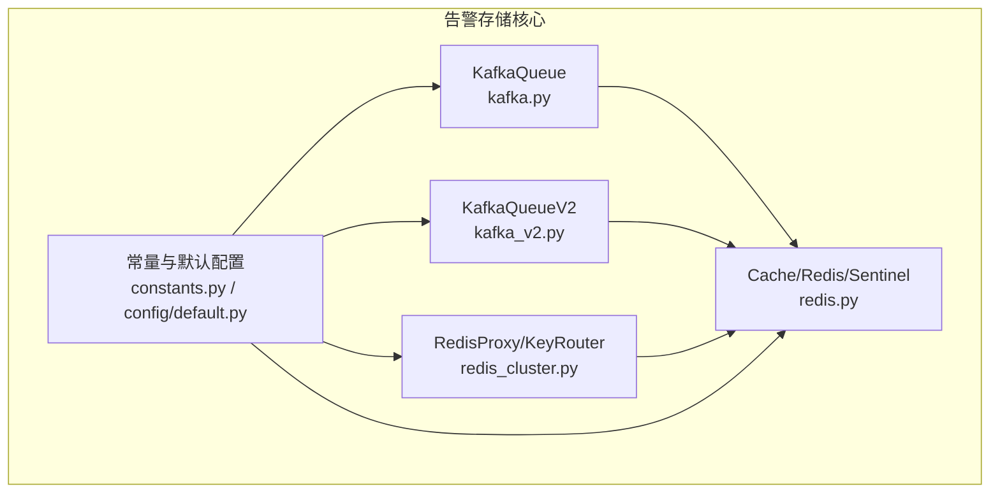
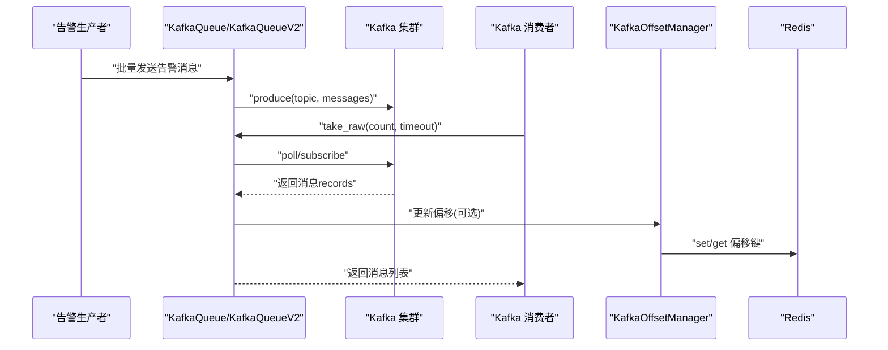
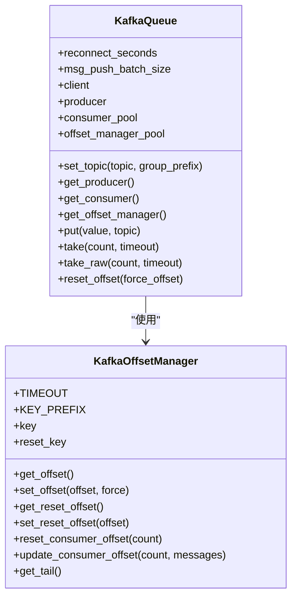
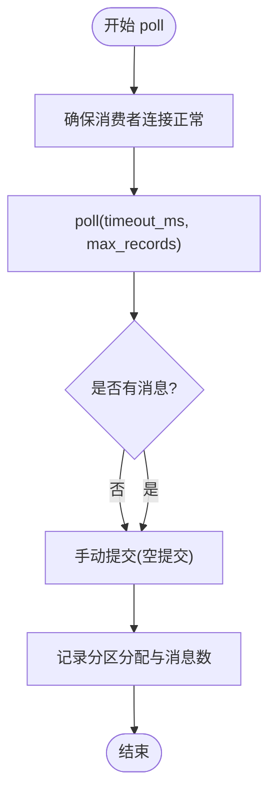
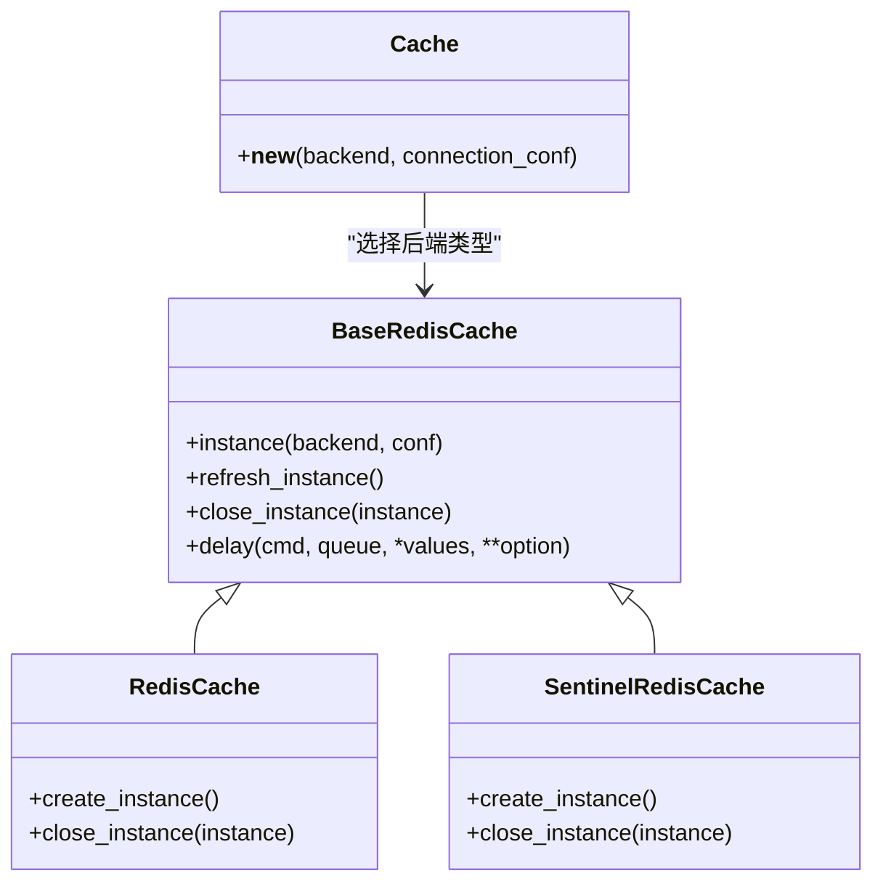
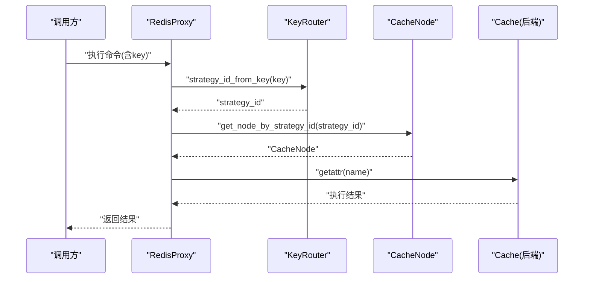
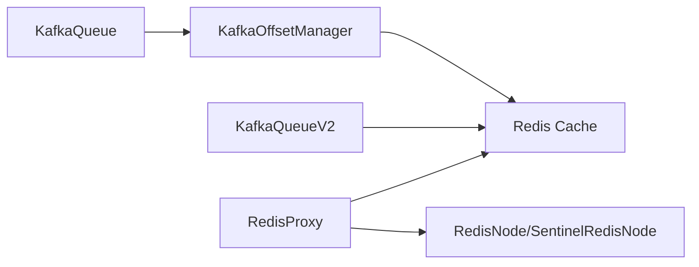

# 存储系统

<cite>
**本文引用的文件**
- [bkmonitor/alarm_backends/core/storage/kafka.py](file://bkmonitor/alarm_backends/core/storage/kafka.py)
- [bkmonitor/alarm_backends/core/storage/kafka_v2.py](file://bkmonitor/alarm_backends/core/storage/kafka_v2.py)
- [bkmonitor/alarm_backends/core/storage/redis.py](file://bkmonitor/alarm_backends/core/storage/redis.py)
- [bkmonitor/alarm_backends/core/storage/redis_cluster.py](file://bkmonitor/alarm_backends/core/storage/redis_cluster.py)
- [bkmonitor/alarm_backends/constants.py](file://bkmonitor/alarm_backends/constants.py)
- [bkmonitor/config/default.py](file://bkmonitor/config/default.py)
</cite>

## 目录
1. [简介](#简介)
2. [项目结构](#项目结构)
3. [核心组件](#核心组件)
4. [架构总览](#架构总览)
5. [组件详细分析](#组件详细分析)
6. [依赖关系分析](#依赖关系分析)
7. [性能考量](#性能考量)
8. [故障排查指南](#故障排查指南)
9. [结论](#结论)
10. [附录](#附录)

## 简介
本技术文档面向告警存储系统，聚焦于存储架构设计、消息队列与缓存系统的集成方案，以及 Kafka、Redis 等存储组件的配置与使用方式。文档涵盖连接池管理、故障转移机制、数据序列化与传输优化、部署配置示例与性能调优建议，并解释高可用性与数据持久性的保障措施。

## 项目结构
告警存储相关代码主要位于 alarm_backends/core/storage 下，围绕 Kafka 与 Redis 的队列与缓存能力展开，同时提供常量与配置入口，支撑告警数据的可靠写入、消费与偏移管理。

图表来源
- [bkmonitor/alarm_backends/core/storage/kafka.py:26-262](file://bkmonitor/alarm_backends/core/storage/kafka.py#L26-L262)
- [bkmonitor/alarm_backends/core/storage/kafka_v2.py:24-157](file://bkmonitor/alarm_backends/core/storage/kafka_v2.py#L24-L157)
- [bkmonitor/alarm_backends/core/storage/redis.py:98-326](file://bkmonitor/alarm_backends/core/storage/redis.py#L98-L326)
- [bkmonitor/alarm_backends/core/storage/redis_cluster.py:108-226](file://bkmonitor/alarm_backends/core/storage/redis_cluster.py#L108-L226)
- [bkmonitor/alarm_backends/constants.py:79-81](file://bkmonitor/alarm_backends/constants.py#L79-L81)
- [bkmonitor/config/default.py:770-772](file://bkmonitor/config/default.py#L770-L772)

章节来源
- [bkmonitor/alarm_backends/core/storage/kafka.py:1-262](file://bkmonitor/alarm_backends/core/storage/kafka.py#L1-L262)
- [bkmonitor/alarm_backends/core/storage/kafka_v2.py:1-157](file://bkmonitor/alarm_backends/core/storage/kafka_v2.py#L1-L157)
- [bkmonitor/alarm_backends/core/storage/redis.py:1-326](file://bkmonitor/alarm_backends/core/storage/redis.py#L1-L326)
- [bkmonitor/alarm_backends/core/storage/redis_cluster.py:1-226](file://bkmonitor/alarm_backends/core/storage/redis_cluster.py#L1-L226)
- [bkmonitor/alarm_backends/constants.py:1-81](file://bkmonitor/alarm_backends/constants.py#L1-L81)
- [bkmonitor/config/default.py:770-772](file://bkmonitor/config/default.py#L770-L772)

## 核心组件
- Kafka 队列封装：提供生产者、消费者、偏移管理与重连机制，兼容旧版 SimpleClient 与新版 Kafka 库。
- Redis 缓存封装：统一 Cache 抽象，支持直连与哨兵模式，具备连接刷新与只读实例能力。
- Redis 集群路由：按策略 ID 路由到具体节点，提供管道执行与跨节点结果合并。
- 常量与默认配置：提供 Kafka 最大缓冲区、Kafka 自动提交等关键配置项。

章节来源
- [bkmonitor/alarm_backends/core/storage/kafka.py:26-176](file://bkmonitor/alarm_backends/core/storage/kafka.py#L26-L176)
- [bkmonitor/alarm_backends/core/storage/kafka_v2.py:24-157](file://bkmonitor/alarm_backends/core/storage/kafka_v2.py#L24-L157)
- [bkmonitor/alarm_backends/core/storage/redis.py:98-326](file://bkmonitor/alarm_backends/core/storage/redis.py#L98-L326)
- [bkmonitor/alarm_backends/core/storage/redis_cluster.py:108-226](file://bkmonitor/alarm_backends/core/storage/redis_cluster.py#L108-L226)
- [bkmonitor/alarm_backends/constants.py:79-81](file://bkmonitor/alarm_backends/constants.py#L79-L81)
- [bkmonitor/config/default.py:770-772](file://bkmonitor/config/default.py#L770-L772)

## 架构总览
告警存储系统采用“Kafka 作为消息总线 + Redis 作为偏移与临时状态”的双引擎架构。生产者将告警事件写入 Kafka；消费者从 Kafka 拉取并维护偏移到 Redis；Redis 提供高吞吐的键值存取与哨兵高可用；Redis 集群路由按策略 ID 将请求定向到不同节点，提升横向扩展能力。

图表来源
- [bkmonitor/alarm_backends/core/storage/kafka.py:127-176](file://bkmonitor/alarm_backends/core/storage/kafka.py#L127-L176)
- [bkmonitor/alarm_backends/core/storage/kafka_v2.py:147-157](file://bkmonitor/alarm_backends/core/storage/kafka_v2.py#L147-L157)
- [bkmonitor/alarm_backends/core/storage/redis.py:177-221](file://bkmonitor/alarm_backends/core/storage/redis.py#L177-L221)

## 组件详细分析

### Kafka 队列组件（KafkaQueue）
- 功能要点
  - 生产者：支持批量发送，按批次大小切分，自动重试。
  - 消费者：按主题与消费者组创建 SimpleConsumer，带元数据加载重试与偏移回溯处理。
  - 偏移管理：通过 Redis 持久化偏移，支持重置点与尾部偏移校准。
  - 连接复用：客户端按时间阈值重建，降低连接抖动。
- 关键配置
  - 自动提交开关、最大缓冲区大小、重连周期等来自配置与常量。
- 错误处理
  - 失败负载与偏移越界错误均有重试与回退策略。

图表来源
- [bkmonitor/alarm_backends/core/storage/kafka.py:26-176](file://bkmonitor/alarm_backends/core/storage/kafka.py#L26-L176)
- [bkmonitor/alarm_backends/core/storage/kafka.py:178-262](file://bkmonitor/alarm_backends/core/storage/kafka.py#L178-L262)

章节来源
- [bkmonitor/alarm_backends/core/storage/kafka.py:26-176](file://bkmonitor/alarm_backends/core/storage/kafka.py#L26-L176)
- [bkmonitor/alarm_backends/core/storage/kafka.py:178-262](file://bkmonitor/alarm_backends/core/storage/kafka.py#L178-L262)
- [bkmonitor/alarm_backends/constants.py:79-81](file://bkmonitor/alarm_backends/constants.py#L79-L81)
- [bkmonitor/config/default.py:770-772](file://bkmonitor/config/default.py#L770-L772)

### Kafka 队列组件（KafkaQueueV2）
- 功能要点
  - 基于新版 KafkaConsumer，支持轮询拉取、手动提交、分区分配检测与重连。
  - 为每个 Pod/实例生成唯一 client_id，避免消费者冲突。
  - 提供重置偏移到首/尾的能力。
- 错误处理
  - 连接断开时主动重建消费者，确保消费连续性。

图表来源
- [bkmonitor/alarm_backends/core/storage/kafka_v2.py:107-157](file://bkmonitor/alarm_backends/core/storage/kafka_v2.py#L107-L157)

章节来源
- [bkmonitor/alarm_backends/core/storage/kafka_v2.py:24-157](file://bkmonitor/alarm_backends/core/storage/kafka_v2.py#L24-L157)

### Redis 缓存组件（Cache/Redis/Sentinel）
- 功能要点
  - 统一 Cache 抽象，支持直连与哨兵两种后端。
  - 连接刷新：出现连接错误自动重建主从实例，降低单点风险。
  - 只读实例：哨兵模式下区分主/从实例，便于读写分离。
  - 路由配置：支持按模块路由到不同 Redis 实例，增强隔离性。
- 错误处理
  - 连接异常重试与实例刷新，保障可用性。

图表来源
- [bkmonitor/alarm_backends/core/storage/redis.py:98-326](file://bkmonitor/alarm_backends/core/storage/redis.py#L98-L326)

章节来源
- [bkmonitor/alarm_backends/core/storage/redis.py:98-326](file://bkmonitor/alarm_backends/core/storage/redis.py#L98-L326)

### Redis 集群路由组件（RedisProxy/KeyRouter）
- 功能要点
  - 按策略 ID 将命令路由到具体节点，支持管道执行与跨节点结果合并。
  - 通过缓存路由表与默认节点，减少重复查询。
- 错误处理
  - 单节点连接异常时刷新实例，保证整体可用。

图表来源
- [bkmonitor/alarm_backends/core/storage/redis_cluster.py:108-226](file://bkmonitor/alarm_backends/core/storage/redis_cluster.py#L108-L226)

章节来源
- [bkmonitor/alarm_backends/core/storage/redis_cluster.py:108-226](file://bkmonitor/alarm_backends/core/storage/redis_cluster.py#L108-L226)

## 依赖关系分析
- Kafka 与 Redis 的耦合点在于偏移管理：KafkaOffsetManager 使用 Cache 将偏移持久化到 Redis，实现跨实例共享与重启恢复。
- KafkaQueueV2 与 KafkaQueue 的差异体现在消费者库与偏移提交策略，前者更强调分区分配与手动提交。
- RedisCluster 通过策略 ID 路由到具体节点，避免热点集中在单一实例。

图表来源
- [bkmonitor/alarm_backends/core/storage/kafka.py:178-262](file://bkmonitor/alarm_backends/core/storage/kafka.py#L178-L262)
- [bkmonitor/alarm_backends/core/storage/kafka_v2.py:24-157](file://bkmonitor/alarm_backends/core/storage/kafka_v2.py#L24-L157)
- [bkmonitor/alarm_backends/core/storage/redis.py:98-326](file://bkmonitor/alarm_backends/core/storage/redis.py#L98-L326)
- [bkmonitor/alarm_backends/core/storage/redis_cluster.py:108-226](file://bkmonitor/alarm_backends/core/storage/redis_cluster.py#L108-L226)

章节来源
- [bkmonitor/alarm_backends/core/storage/kafka.py:178-262](file://bkmonitor/alarm_backends/core/storage/kafka.py#L178-L262)
- [bkmonitor/alarm_backends/core/storage/kafka_v2.py:24-157](file://bkmonitor/alarm_backends/core/storage/kafka_v2.py#L24-L157)
- [bkmonitor/alarm_backends/core/storage/redis.py:98-326](file://bkmonitor/alarm_backends/core/storage/redis.py#L98-L326)
- [bkmonitor/alarm_backends/core/storage/redis_cluster.py:108-226](file://bkmonitor/alarm_backends/core/storage/redis_cluster.py#L108-L226)

## 性能考量
- 批量写入与拉取
  - Kafka 生产者按批次大小切分发送，减少网络往返与序列化开销。
  - KafkaV2 拉取时设置最大分区拉取字节数，提升吞吐。
- 偏移管理
  - 使用 Redis 持久化偏移，避免重复消费与丢失，提高可靠性。
- 连接与实例管理
  - Redis 后端在连接异常时自动刷新实例，降低抖动。
  - Kafka 客户端按时间阈值重建，平衡稳定性与资源消耗。
- 路由与扩展
  - RedisProxy 按策略 ID 路由，分散热点；结合哨兵实现高可用。

章节来源
- [bkmonitor/alarm_backends/core/storage/kafka.py:127-145](file://bkmonitor/alarm_backends/core/storage/kafka.py#L127-L145)
- [bkmonitor/alarm_backends/core/storage/kafka_v2.py:76-81](file://bkmonitor/alarm_backends/core/storage/kafka_v2.py#L76-L81)
- [bkmonitor/alarm_backends/core/storage/redis.py:154-196](file://bkmonitor/alarm_backends/core/storage/redis.py#L154-L196)
- [bkmonitor/alarm_backends/core/storage/redis_cluster.py:119-142](file://bkmonitor/alarm_backends/core/storage/redis_cluster.py#L119-L142)

## 故障排查指南
- Kafka 偏移问题
  - 现象：消费者从头或尾部回溯。
  - 处理：检查 KafkaOffsetManager 的偏移键与重置点，必要时调用重置偏移接口。
- Kafka 连接断开
  - 现象：poll 无消息或报错。
  - 处理：KafkaQueueV2 会主动重建消费者；确认消费者组与分区分配状态。
- Redis 连接异常
  - 现象：命令执行失败。
  - 处理：触发实例刷新；检查哨兵主从切换与密码配置。
- 分区重分配
  - 现象：消费组重新分配导致重复或漏消费。
  - 处理：启用手动提交并配合偏移管理，确保幂等消费。

章节来源
- [bkmonitor/alarm_backends/core/storage/kafka.py:155-176](file://bkmonitor/alarm_backends/core/storage/kafka.py#L155-L176)
- [bkmonitor/alarm_backends/core/storage/kafka_v2.py:107-157](file://bkmonitor/alarm_backends/core/storage/kafka_v2.py#L107-L157)
- [bkmonitor/alarm_backends/core/storage/redis.py:177-196](file://bkmonitor/alarm_backends/core/storage/redis.py#L177-L196)
- [bkmonitor/alarm_backends/core/storage/redis_cluster.py:128-142](file://bkmonitor/alarm_backends/core/storage/redis_cluster.py#L128-L142)

## 结论
告警存储系统通过 Kafka 与 Redis 的协同，实现了高吞吐、可扩展、高可用的告警数据流转与持久化。Kafka 负责消息总线，Redis 负责偏移与临时状态；通过连接刷新、分区分配检测与路由策略，系统在复杂环境下保持稳定与高效。

## 附录

### 配置与部署要点
- Kafka
  - 自动提交开关：参考配置项。
  - 最大缓冲区大小：参考常量。
  - 重连周期：通过客户端时间阈值控制。
- Redis
  - 后端类型：直连或哨兵。
  - 路由配置：按模块路由到不同实例。
  - 只读实例：哨兵模式下启用读写分离。
- Redis 集群
  - 按策略 ID 路由，支持管道执行与结果合并。

章节来源
- [bkmonitor/config/default.py:770-772](file://bkmonitor/config/default.py#L770-L772)
- [bkmonitor/alarm_backends/constants.py:79-81](file://bkmonitor/alarm_backends/constants.py#L79-L81)
- [bkmonitor/alarm_backends/core/storage/redis.py:302-326](file://bkmonitor/alarm_backends/core/storage/redis.py#L302-L326)
- [bkmonitor/alarm_backends/core/storage/redis_cluster.py:108-226](file://bkmonitor/alarm_backends/core/storage/redis_cluster.py#L108-L226)