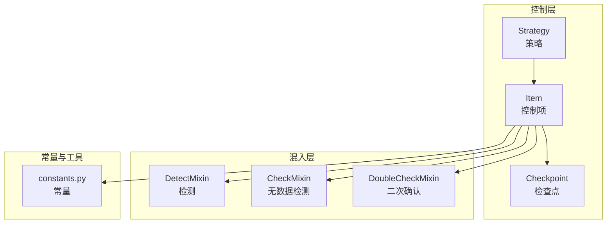
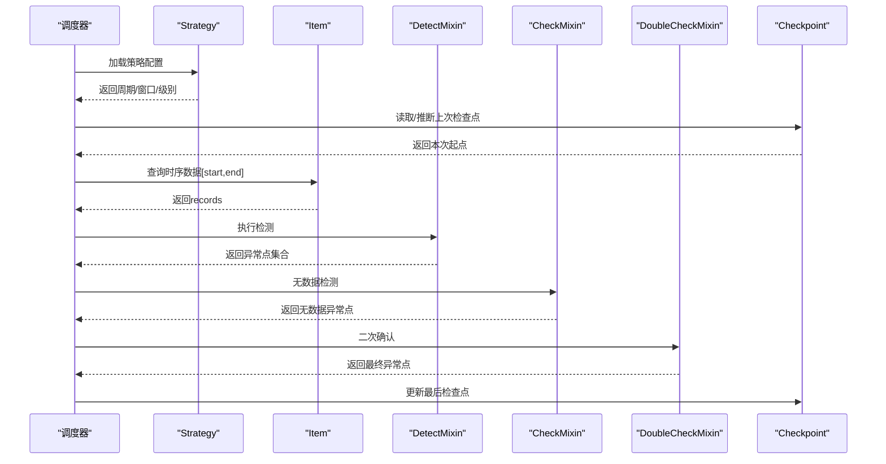
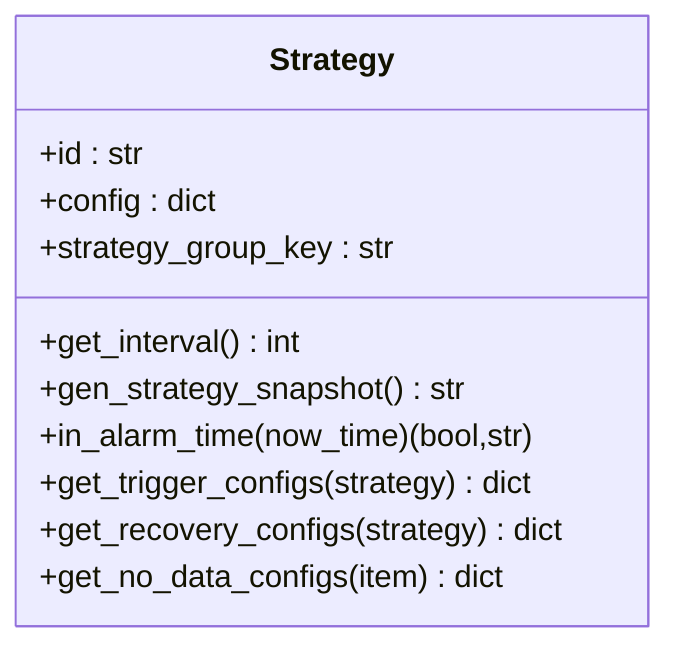
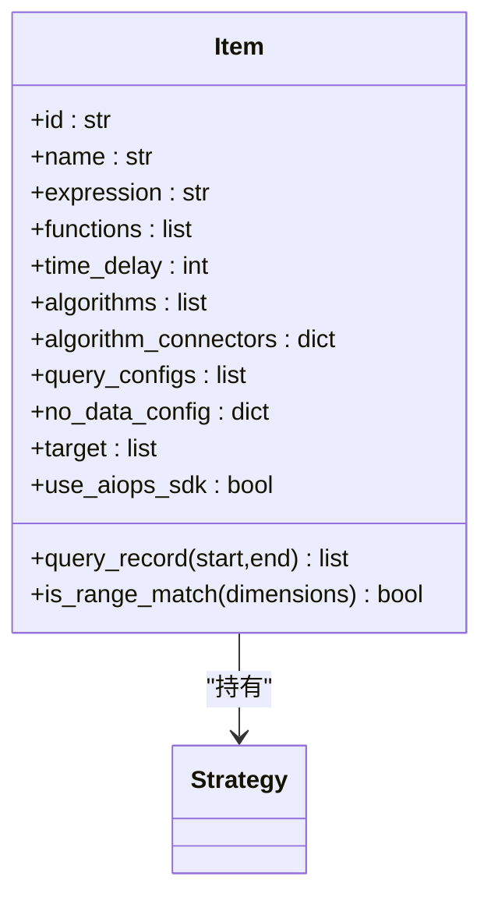
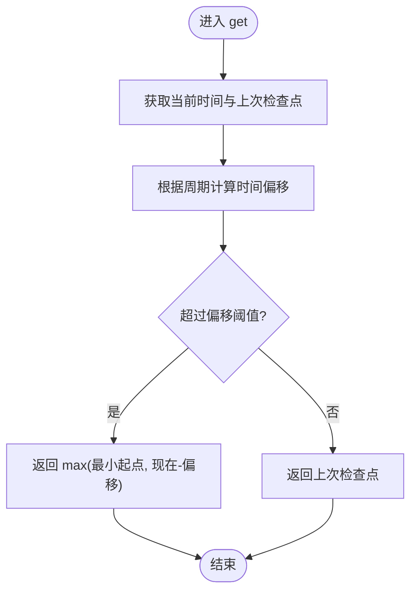
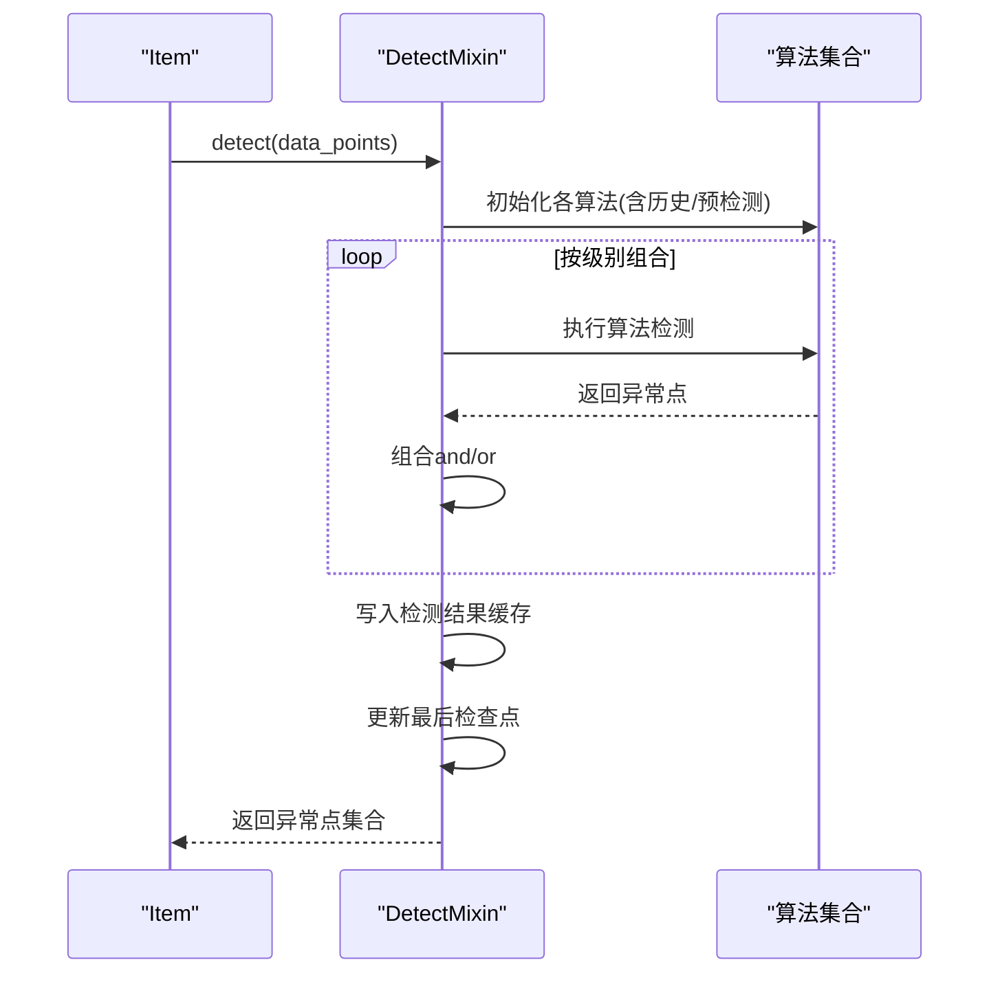
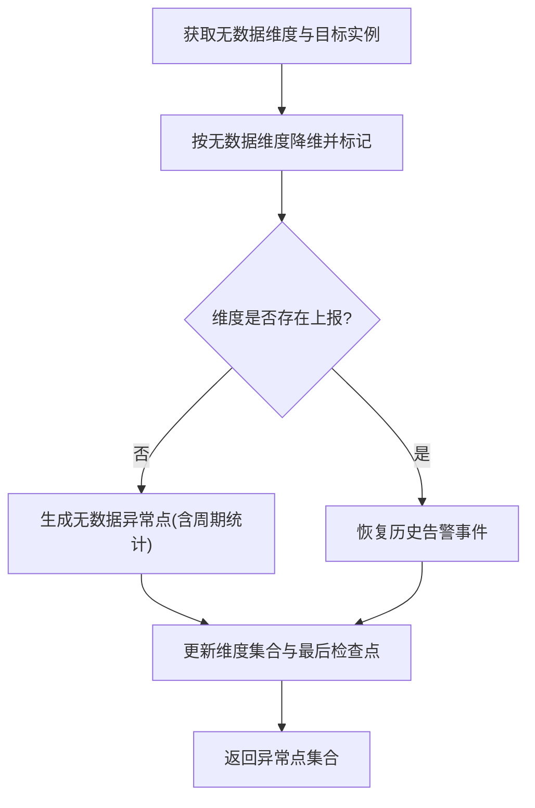
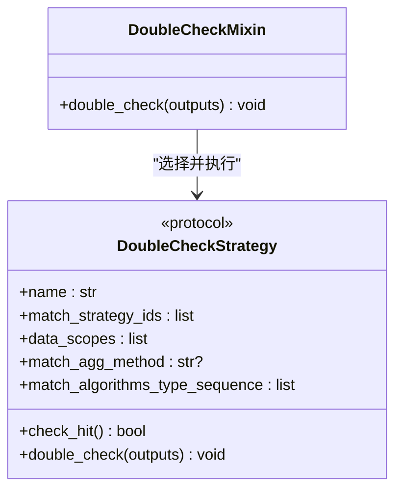
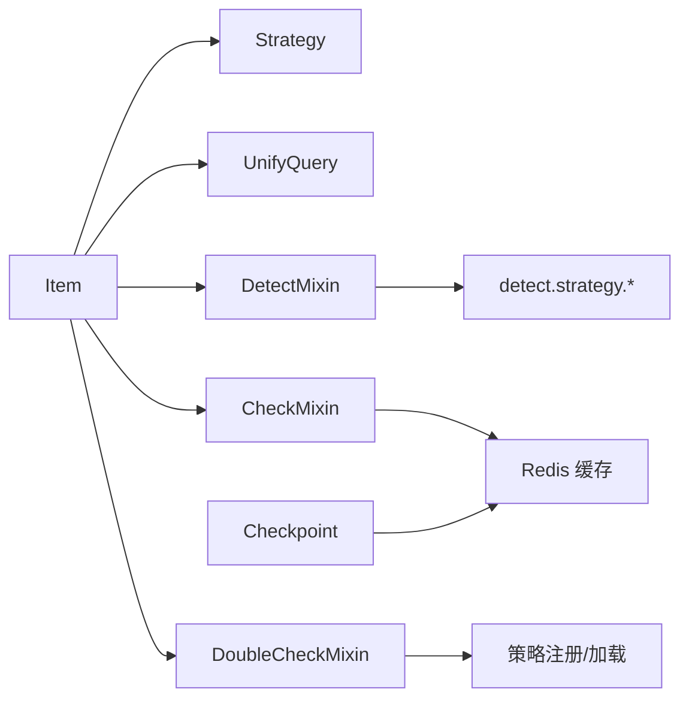

# 控制流程管理

<cite>
**本文引用的文件**
- [bkmonitor/alarm_backends/core/control/__init__.py](file://bkmonitor/alarm_backends/core/control/__init__.py)
- [bkmonitor/alarm_backends/core/control/checkpoint.py](file://bkmonitor/alarm_backends/core/control/checkpoint.py)
- [bkmonitor/alarm_backends/core/control/item.py](file://bkmonitor/alarm_backends/core/control/item.py)
- [bkmonitor/alarm_backends/core/control/strategy.py](file://bkmonitor/alarm_backends/core/control/strategy.py)
- [bkmonitor/alarm_backends/core/control/mixins/__init__.py](file://bkmonitor/alarm_backends/core/control/mixins/__init__.py)
- [bkmonitor/alarm_backends/core/control/mixins/detect.py](file://bkmonitor/alarm_backends/core/control/mixins/detect.py)
- [bkmonitor/alarm_backends/core/control/mixins/double_check.py](file://bkmonitor/alarm_backends/core/control/mixins/double_check.py)
- [bkmonitor/alarm_backends/core/control/mixins/nodata.py](file://bkmonitor/alarm_backends/core/control/mixins/nodata.py)
- [bkmonitor/alarm_backends/constants.py](file://bkmonitor/alarm_backends/constants.py)
</cite>

## 目录
1. [简介](#简介)
2. [项目结构](#项目结构)
3. [核心组件](#核心组件)
4. [架构总览](#架构总览)
5. [详细组件分析](#详细组件分析)
6. [依赖分析](#依赖分析)
7. [性能考量](#性能考量)
8. [故障排查指南](#故障排查指南)
9. [结论](#结论)
10. [附录](#附录)

## 简介
本技术文档围绕“控制流程管理”模块，系统阐述告警控制流程的设计理念、检查点机制与策略执行框架；详细说明控制项的定义、检查点的设置与策略的动态加载机制；涵盖状态管理、异常恢复与并发控制策略；并提供配置示例与与检测引擎的协作方式及性能监控机制，帮助读者快速理解并扩展控制流程。

## 项目结构
控制流程管理位于 alarm_backends/core/control 下，采用“策略-控制项-混入类”的分层组织方式：
- 策略层：封装策略配置、周期、生效时间、触发/恢复/无数据配置等
- 控制项层：封装单个监控项的查询、匹配、检测、二次确认、无数据检测
- 混入类层：将检测、二次确认、无数据检测以 Mixin 形式注入到 Item，实现职责分离与复用

图表来源
- [bkmonitor/alarm_backends/core/control/strategy.py:33-137](file://bkmonitor/alarm_backends/core/control/strategy.py#L33-L137)
- [bkmonitor/alarm_backends/core/control/item.py:51-104](file://bkmonitor/alarm_backends/core/control/item.py#L51-L104)
- [bkmonitor/alarm_backends/core/control/checkpoint.py:21-59](file://bkmonitor/alarm_backends/core/control/checkpoint.py#L21-L59)
- [bkmonitor/alarm_backends/core/control/mixins/detect.py:53-149](file://bkmonitor/alarm_backends/core/control/mixins/detect.py#L53-L149)
- [bkmonitor/alarm_backends/core/control/mixins/nodata.py:33-146](file://bkmonitor/alarm_backends/core/control/mixins/nodata.py#L33-L146)
- [bkmonitor/alarm_backends/core/control/mixins/double_check.py:186-195](file://bkmonitor/alarm_backends/core/control/mixins/double_check.py#L186-L195)
- [bkmonitor/alarm_backends/constants.py:11-81](file://bkmonitor/alarm_backends/constants.py#L11-L81)

章节来源
- [bkmonitor/alarm_backends/core/control/__init__.py:1-11](file://bkmonitor/alarm_backends/core/control/__init__.py#L1-11)
- [bkmonitor/alarm_backends/core/control/strategy.py:33-137](file://bkmonitor/alarm_backends/core/control/strategy.py#L33-L137)
- [bkmonitor/alarm_backends/core/control/item.py:51-104](file://bkmonitor/alarm_backends/core/control/item.py#L51-L104)
- [bkmonitor/alarm_backends/core/control/checkpoint.py:21-59](file://bkmonitor/alarm_backends/core/control/checkpoint.py#L21-L59)
- [bkmonitor/alarm_backends/core/control/mixins/__init__.py:11-13](file://bkmonitor/alarm_backends/core/control/mixins/__init__.py#L11-L13)
- [bkmonitor/alarm_backends/constants.py:11-81](file://bkmonitor/alarm_backends/constants.py#L11-L81)

## 核心组件
- 策略 Strategy：负责加载策略配置、计算周期、解析触发/恢复/无数据配置、生成策略快照、判断生效时间等
- 控制项 Item：负责构建统一查询、解析目标与聚合条件、匹配维度、选择算法、调用混入执行检测/二次确认/无数据检测
- 检查点 Checkpoint：负责记录与推断上次处理时间，保障数据拉取起点与节流
- 检测混入 DetectMixin：负责将原始时序点送入算法集合，组合多算法结果，写入检测结果缓存与最后检查点
- 无数据检测混入 CheckMixin：负责无数据维度枚举、缺失实例识别、异常周期统计、恢复清理
- 二次确认混入 DoubleCheckMixin：负责按策略/聚合/算法/灰度等条件挑选二次确认策略并执行
- 常量 constants：提供时间单位、标准字段、无数据常量、默认去重字段等

章节来源
- [bkmonitor/alarm_backends/core/control/strategy.py:33-384](file://bkmonitor/alarm_backends/core/control/strategy.py#L33-L384)
- [bkmonitor/alarm_backends/core/control/item.py:51-277](file://bkmonitor/alarm_backends/core/control/item.py#L51-L277)
- [bkmonitor/alarm_backends/core/control/checkpoint.py:21-59](file://bkmonitor/alarm_backends/core/control/checkpoint.py#L21-L59)
- [bkmonitor/alarm_backends/core/control/mixins/detect.py:53-227](file://bkmonitor/alarm_backends/core/control/mixins/detect.py#L53-L227)
- [bkmonitor/alarm_backends/core/control/mixins/nodata.py:33-355](file://bkmonitor/alarm_backends/core/control/mixins/nodata.py#L33-L355)
- [bkmonitor/alarm_backends/core/control/mixins/double_check.py:186-195](file://bkmonitor/alarm_backends/core/control/mixins/double_check.py#L186-L195)
- [bkmonitor/alarm_backends/constants.py:11-81](file://bkmonitor/alarm_backends/constants.py#L11-L81)

## 架构总览
控制流程管理以“策略-控制项-混入”为核心，配合检查点与缓存键空间，形成闭环的控制流：
- 策略驱动：Strategy 解析配置并暴露周期、窗口、级别等元信息
- 控制项编排：Item 组装查询、匹配维度、选择算法
- 检测执行：DetectMixin 调用算法集合，产出异常点并写入缓存
- 无数据检测：CheckMixin 在无数据场景下生成异常并维护维度集合
- 二次确认：DoubleCheckMixin 基于规则挑选策略进行二次校验
- 检查点推进：Checkpoint 推断下次拉取起点，避免重复处理

图表来源
- [bkmonitor/alarm_backends/core/control/strategy.py:59-80](file://bkmonitor/alarm_backends/core/control/strategy.py#L59-L80)
- [bkmonitor/alarm_backends/core/control/item.py:111-115](file://bkmonitor/alarm_backends/core/control/item.py#L111-L115)
- [bkmonitor/alarm_backends/core/control/mixins/detect.py:54-149](file://bkmonitor/alarm_backends/core/control/mixins/detect.py#L54-L149)
- [bkmonitor/alarm_backends/core/control/mixins/nodata.py:57-146](file://bkmonitor/alarm_backends/core/control/mixins/nodata.py#L57-L146)
- [bkmonitor/alarm_backends/core/control/mixins/double_check.py:187-195](file://bkmonitor/alarm_backends/core/control/mixins/double_check.py#L187-L195)
- [bkmonitor/alarm_backends/core/control/checkpoint.py:37-59](file://bkmonitor/alarm_backends/core/control/checkpoint.py#L37-L59)

## 详细组件分析

### 策略 Strategy
- 职责
  - 加载策略配置并缓存
  - 计算最小聚合周期
  - 解析触发/恢复/无数据配置
  - 生成策略快照键并缓存
  - 判断策略生效时间（日历/时间段）
- 关键点
  - 触发/恢复配置按级别映射，支持 AIOPS 算法特化
  - 无数据配置提取连续窗口与级别
  - 快照键基于更新时间生成，便于策略变更追踪

图表来源
- [bkmonitor/alarm_backends/core/control/strategy.py:33-384](file://bkmonitor/alarm_backends/core/control/strategy.py#L33-L384)

章节来源
- [bkmonitor/alarm_backends/core/control/strategy.py:33-384](file://bkmonitor/alarm_backends/core/control/strategy.py#L33-L384)

### 控制项 Item
- 职责
  - 解析查询配置，构建统一查询对象
  - 解析目标条件与聚合条件，生成匹配器
  - 生成算法连接符（and/or），支持多算法组合
  - 提供检测结果保留窗口 TTL 计算
- 关键点
  - 支持多数据源、多聚合方法、多算法类型
  - 条件匹配包括目标条件、聚合条件、内置额外条件
  - 通过缓存属性延迟计算，减少重复开销

图表来源
- [bkmonitor/alarm_backends/core/control/item.py:51-277](file://bkmonitor/alarm_backends/core/control/item.py#L51-L277)

章节来源
- [bkmonitor/alarm_backends/core/control/item.py:51-277](file://bkmonitor/alarm_backends/core/control/item.py#L51-L277)

### 检查点 Checkpoint
- 职责
  - 记录策略组的最后处理时间
  - 推断本次拉取起点，避免长时间无数据导致的起点漂移
  - 提供是否需要检测的判断
- 关键点
  - 长周期场景下扩大最小起点偏移，确保数据覆盖
  - 与 MIN_DATA_ACCESS_CHECKPOINT 配置联动

图表来源
- [bkmonitor/alarm_backends/core/control/checkpoint.py:37-53](file://bkmonitor/alarm_backends/core/control/checkpoint.py#L37-L53)

章节来源
- [bkmonitor/alarm_backends/core/control/checkpoint.py:21-59](file://bkmonitor/alarm_backends/core/control/checkpoint.py#L21-L59)

### 检测混入 DetectMixin
- 职责
  - 将原始时序点按算法级别分组
  - 动态加载算法类，支持历史数据查询与预检测
  - 组合多算法结果（and/or），生成异常点集合
  - 写入检测结果缓存与最后检查点
- 关键点
  - 白名单 EXTRA_CONFIG_KEYS 提取算法控制参数
  - 按策略周期与窗口计算 TTL，保障缓存生命周期
  - 使用 Redis Pipeline 批量写入，提升吞吐

图表来源
- [bkmonitor/alarm_backends/core/control/mixins/detect.py:54-149](file://bkmonitor/alarm_backends/core/control/mixins/detect.py#L54-L149)

章节来源
- [bkmonitor/alarm_backends/core/control/mixins/detect.py:53-227](file://bkmonitor/alarm_backends/core/control/mixins/detect.py#L53-L227)

### 无数据检测混入 CheckMixin
- 职责
  - 枚举无数据维度与目标实例，对比上报数据
  - 生成无数据异常点，统计异常周期与上报延时
  - 维护维度集合与最后检查点，支持恢复清理
- 关键点
  - 支持场景化无数据维度（如主机维度有效性校验）
  - 无数据异常周期与上报延时周期分别统计
  - 通过缓存键空间区分维度与整体维度告警

图表来源
- [bkmonitor/alarm_backends/core/control/mixins/nodata.py:57-146](file://bkmonitor/alarm_backends/core/control/mixins/nodata.py#L57-L146)

章节来源
- [bkmonitor/alarm_backends/core/control/mixins/nodata.py:33-355](file://bkmonitor/alarm_backends/core/control/mixins/nodata.py#L33-L355)

### 二次确认混入 DoubleCheckMixin
- 职责
  - 注册并加载二次确认策略
  - 基于数据范围、聚合方法、算法类型、策略 ID 等条件筛选策略
  - 执行二次确认逻辑，过滤误报
- 关键点
  - 通过匹配序列确定优先级最高的算法类型
  - 支持灰度策略 ID 白名单
  - 默认无匹配时跳过二次确认

图表来源
- [bkmonitor/alarm_backends/core/control/mixins/double_check.py:24-195](file://bkmonitor/alarm_backends/core/control/mixins/double_check.py#L24-L195)

章节来源
- [bkmonitor/alarm_backends/core/control/mixins/double_check.py:155-195](file://bkmonitor/alarm_backends/core/control/mixins/double_check.py#L155-L195)

## 依赖分析
- 组件耦合
  - Item 依赖 Strategy、UnifyQuery、条件匹配器、算法加载
  - DetectMixin/CheckMixin/DoubleCheckMixin 通过继承注入到 Item
  - Checkpoint 与缓存键空间交互，影响数据拉取与结果持久化
- 外部依赖
  - 算法包：alarm_backends.service.detect.strategy.*，按算法类型动态导入
  - 数据源：bkmonitor.data_source.unify_query.UnifyQuery
  - 缓存：Redis SortedSet/Hash，Pipeline 批量写入
- 循环依赖
  - 通过延迟导入避免循环引用（如 Item.__init__ 中导入 Strategy）

图表来源
- [bkmonitor/alarm_backends/core/control/item.py:88-104](file://bkmonitor/alarm_backends/core/control/item.py#L88-L104)
- [bkmonitor/alarm_backends/core/control/mixins/detect.py:41-50](file://bkmonitor/alarm_backends/core/control/mixins/detect.py#L41-L50)
- [bkmonitor/alarm_backends/core/control/mixins/double_check.py:167-183](file://bkmonitor/alarm_backends/core/control/mixins/double_check.py#L167-L183)
- [bkmonitor/alarm_backends/core/control/checkpoint.py:25-35](file://bkmonitor/alarm_backends/core/control/checkpoint.py#L25-L35)

章节来源
- [bkmonitor/alarm_backends/core/control/item.py:88-104](file://bkmonitor/alarm_backends/core/control/item.py#L88-L104)
- [bkmonitor/alarm_backends/core/control/mixins/detect.py:41-50](file://bkmonitor/alarm_backends/core/control/mixins/detect.py#L41-L50)
- [bkmonitor/alarm_backends/core/control/mixins/double_check.py:167-183](file://bkmonitor/alarm_backends/core/control/mixins/double_check.py#L167-L183)
- [bkmonitor/alarm_backends/core/control/checkpoint.py:25-35](file://bkmonitor/alarm_backends/core/control/checkpoint.py#L25-L35)

## 性能考量
- 批量写入与 TTL
  - 检测结果与无数据结果均使用 Redis Pipeline 批量写入，降低 RTT 开销
  - TTL 基于策略周期与窗口计算，避免无限增长
- 缓存键设计
  - 按维度 MD5 与级别拆分键，支持维度粒度的过期与清理
  - 最后检查点采用 Hash 字段映射，批量更新
- 算法与历史数据
  - 历史数据查询与预检测按算法能力动态启用，避免不必要的 IO
  - 白名单参数控制算法行为，减少无效分支
- 并发控制
  - 通过最后检查点与无数据检测时间戳避免重复检测
  - 无数据维度集合与最后检查点的原子更新，减少竞争

章节来源
- [bkmonitor/alarm_backends/core/control/mixins/detect.py:169-226](file://bkmonitor/alarm_backends/core/control/mixins/detect.py#L169-L226)
- [bkmonitor/alarm_backends/core/control/mixins/nodata.py:283-346](file://bkmonitor/alarm_backends/core/control/mixins/nodata.py#L283-L346)
- [bkmonitor/alarm_backends/constants.py:16-22](file://bkmonitor/alarm_backends/constants.py#L16-L22)

## 故障排查指南
- 策略未生效
  - 检查策略生效时间与日历配置，确认当前时刻处于生效区间
  - 查看日志中关于生效/休息日历的消息提示
- 无数据误报
  - 核对主机维度是否属于业务，必要时在场景化无数据检测中过滤
  - 检查最后检查点与上报时间戳，确认是否存在上报延时
- 异常点缺失
  - 检查算法连接符（and/or）与级别映射，确认组合逻辑
  - 核对检测结果缓存键与 TTL，确认是否被提前清理
- 二次确认未生效
  - 确认二次确认策略是否已注册并命中匹配条件（数据范围/聚合方法/算法类型/策略 ID）
- 检查点异常
  - 检查 MIN_DATA_ACCESS_CHECKPOINT 配置与周期的关系
  - 确认上次检查点是否正确推进

章节来源
- [bkmonitor/alarm_backends/core/control/strategy.py:156-237](file://bkmonitor/alarm_backends/core/control/strategy.py#L156-L237)
- [bkmonitor/alarm_backends/core/control/mixins/nodata.py:39-55](file://bkmonitor/alarm_backends/core/control/mixins/nodata.py#L39-L55)
- [bkmonitor/alarm_backends/core/control/mixins/detect.py:169-226](file://bkmonitor/alarm_backends/core/control/mixins/detect.py#L169-L226)
- [bkmonitor/alarm_backends/core/control/mixins/double_check.py:174-183](file://bkmonitor/alarm_backends/core/control/mixins/double_check.py#L174-L183)
- [bkmonitor/alarm_backends/core/control/checkpoint.py:48-52](file://bkmonitor/alarm_backends/core/control/checkpoint.py#L48-L52)

## 结论
控制流程管理通过“策略-控制项-混入”的清晰分层，实现了对检测、无数据检测与二次确认的解耦与复用；借助检查点与缓存键空间，保障了状态一致与性能稳定；通过动态算法加载与白名单参数控制，提供了灵活的扩展能力。建议在实际部署中结合业务场景优化周期、窗口与缓存 TTL，并完善日志与监控以便快速定位问题。

## 附录

### 配置示例与扩展要点
- 策略周期与窗口
  - 通过策略配置中的最小聚合周期与触发/恢复窗口决定检测频率与结果保留
- 算法连接符
  - 在同一级别内使用 and/or 组合多个算法，影响异常点生成
- 无数据配置
  - 设置连续窗口与告警级别，启用维度缓存以支持维度级恢复
- 二次确认策略
  - 定义数据范围、聚合方法、算法类型序列与策略 ID 白名单，按优先级匹配
- 检查点策略
  - 结合 MIN_DATA_ACCESS_CHECKPOINT 与周期，合理设置最小起点偏移

章节来源
- [bkmonitor/alarm_backends/core/control/strategy.py:59-80](file://bkmonitor/alarm_backends/core/control/strategy.py#L59-L80)
- [bkmonitor/alarm_backends/core/control/item.py:68-71](file://bkmonitor/alarm_backends/core/control/item.py#L68-L71)
- [bkmonitor/alarm_backends/core/control/mixins/nodata.py:317-320](file://bkmonitor/alarm_backends/core/control/mixins/nodata.py#L317-L320)
- [bkmonitor/alarm_backends/core/control/mixins/double_check.py:158-183](file://bkmonitor/alarm_backends/core/control/mixins/double_check.py#L158-L183)
- [bkmonitor/alarm_backends/core/control/checkpoint.py:48-52](file://bkmonitor/alarm_backends/core/control/checkpoint.py#L48-L52)