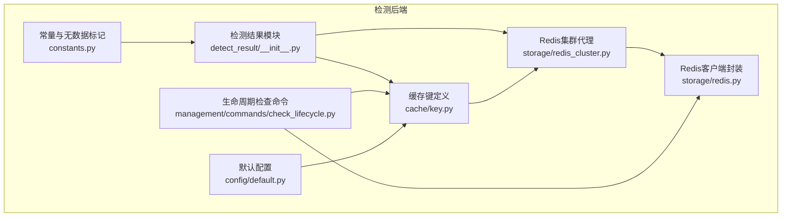
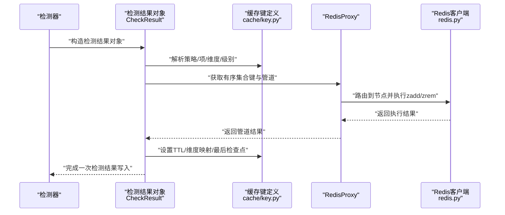
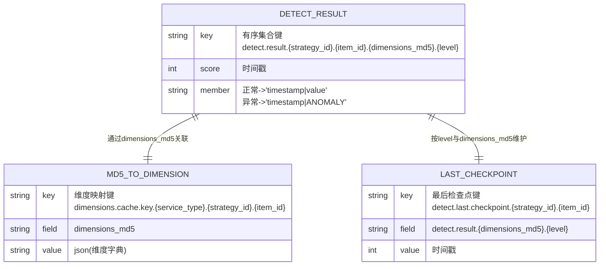
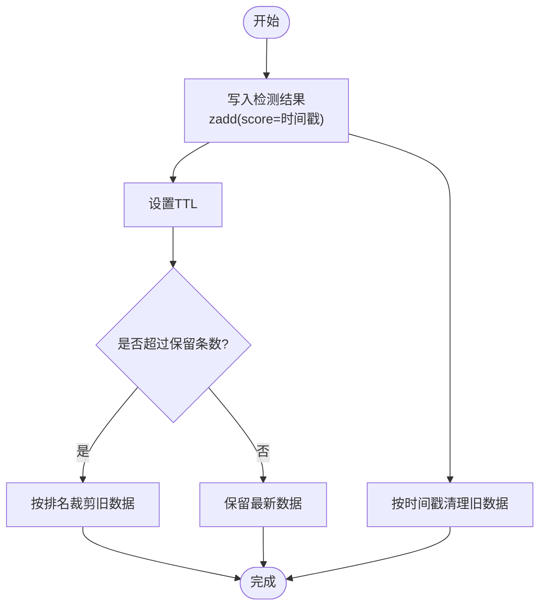
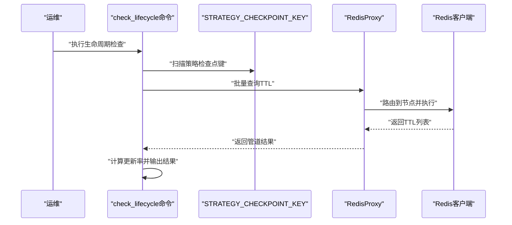
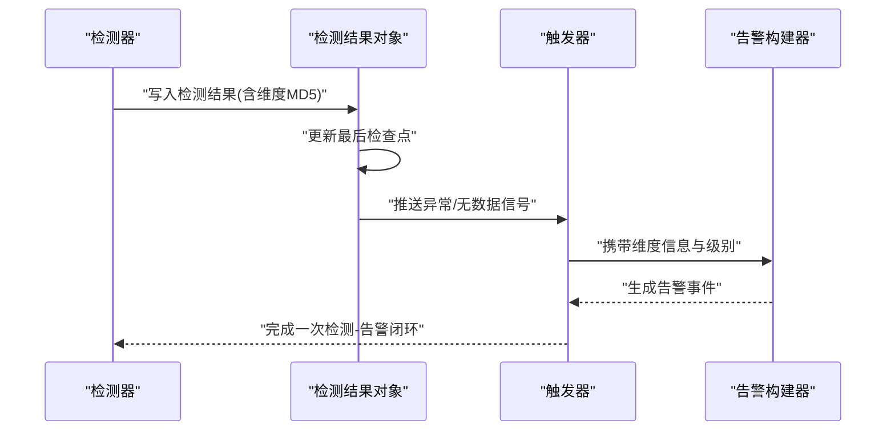
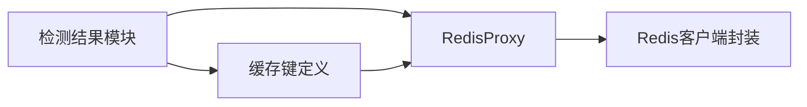

# 检测结果管理

<cite>
**本文引用的文件**
- [detect_result/__init__.py](file://bkmonitor/alarm_backends/core/detect_result/__init__.py)
- [cache/key.py](file://bkmonitor/alarm_backends/core/cache/key.py)
- [storage/redis_cluster.py](file://bkmonitor/alarm_backends/core/storage/redis_cluster.py)
- [storage/redis.py](file://bkmonitor/alarm_backends/core/storage/redis.py)
- [management/commands/check_lifecycle.py](file://bkmonitor/alarm_backends/management/commands/check_lifecycle.py)
- [constants.py](file://bkmonitor/alarm_backends/constants.py)
- [config/default.py](file://bkmonitor/config/default.py)
</cite>

## 目录
1. [简介](#简介)
2. [项目结构](#项目结构)
3. [核心组件](#核心组件)
4. [架构总览](#架构总览)
5. [详细组件分析](#详细组件分析)
6. [依赖分析](#依赖分析)
7. [性能考量](#性能考量)
8. [故障排查指南](#故障排查指南)
9. [结论](#结论)
10. [附录](#附录)

## 简介
本章节面向检测结果管理模块，系统性阐述检测结果的存储机制、清理策略与任务调度体系，覆盖数据结构、索引设计、查询优化、定时清理与过期处理、存储空间管理、配置示例与性能调优建议，以及检测结果与告警流程的关联与一致性保障。

## 项目结构
检测结果管理位于 alarm_backends 子系统中，围绕 Redis 缓存构建，采用键空间分层与 TTL 策略实现高吞吐、低延迟的检测结果缓存与清理。关键目录与文件如下：
- 检测结果模型与缓存操作：bkmonitor/alarm_backends/core/detect_result/__init__.py
- 缓存键定义与 TTL：bkmonitor/alarm_backends/core/cache/key.py
- Redis 集群路由与管道：bkmonitor/alarm_backends/core/storage/redis_cluster.py
- Redis 客户端封装与连接池：bkmonitor/alarm_backends/core/storage/redis.py
- 生命周期检查命令：bkmonitor/alarm_backends/management/commands/check_lifecycle.py
- 常量与无数据标记：bkmonitor/alarm_backends/constants.py
- 默认配置与环境变量：bkmonitor/config/default.py

**图表来源**
- [detect_result/__init__.py:1-170](file://bkmonitor/alarm_backends/core/detect_result/__init__.py#L1-L170)
- [cache/key.py:1-1031](file://bkmonitor/alarm_backends/core/cache/key.py#L1-L1031)
- [storage/redis_cluster.py:1-226](file://bkmonitor/alarm_backends/core/storage/redis_cluster.py#L1-L226)
- [storage/redis.py:1-326](file://bkmonitor/alarm_backends/core/storage/redis.py#L1-L326)
- [management/commands/check_lifecycle.py:1-68](file://bkmonitor/alarm_backends/management/commands/check_lifecycle.py#L1-L68)
- [constants.py:1-81](file://bkmonitor/alarm_backends/constants.py#L1-L81)
- [config/default.py:1-800](file://bkmonitor/config/default.py#L1-L800)

**章节来源**
- [detect_result/__init__.py:1-170](file://bkmonitor/alarm_backends/core/detect_result/__init__.py#L1-L170)
- [cache/key.py:1-1031](file://bkmonitor/alarm_backends/core/cache/key.py#L1-L1031)
- [storage/redis_cluster.py:1-226](file://bkmonitor/alarm_backends/core/storage/redis_cluster.py#L1-L226)
- [storage/redis.py:1-326](file://bkmonitor/alarm_backends/core/storage/redis.py#L1-L326)
- [management/commands/check_lifecycle.py:1-68](file://bkmonitor/alarm_backends/management/commands/check_lifecycle.py#L1-L68)
- [constants.py:1-81](file://bkmonitor/alarm_backends/constants.py#L1-L81)
- [config/default.py:1-800](file://bkmonitor/config/default.py#L1-L800)

## 核心组件
- 检测结果对象与缓存操作：提供检测结果的有序集合存储、过期控制、维度映射与最后检查点维护。
- 缓存键与 TTL：统一管理 Redis 键命名、字段模板与过期时间，确保跨模块一致性。
- Redis 集群路由与管道：按策略ID路由到具体节点，批量命令通过管道减少往返开销。
- 生命周期检查命令：扫描并评估关键键的 TTL 更新率，辅助运维验证检测链路健康度。
- 常量与无数据标记：定义无数据等级、特殊维度标签与时间常量，支撑检测与告警流程。
- 默认配置：提供 Redis 后端配置、TTL 参数与环境变量入口，便于按环境定制。

**章节来源**
- [detect_result/__init__.py:26-170](file://bkmonitor/alarm_backends/core/detect_result/__init__.py#L26-L170)
- [cache/key.py:393-403](file://bkmonitor/alarm_backends/core/cache/key.py#L393-L403)
- [storage/redis_cluster.py:108-143](file://bkmonitor/alarm_backends/core/storage/redis_cluster.py#L108-L143)
- [management/commands/check_lifecycle.py:17-68](file://bkmonitor/alarm_backends/management/commands/check_lifecycle.py#L17-L68)
- [constants.py:55-81](file://bkmonitor/alarm_backends/constants.py#L55-L81)
- [config/default.py:50-800](file://bkmonitor/config/default.py#L50-L800)

## 架构总览
检测结果管理以 Redis 有序集合为核心存储，结合键空间分层与 TTL 策略，形成“检测结果缓存 + 维度映射 + 最后检查点”的闭环。通过 RedisProxy 实现跨节点的命令路由与管道执行，确保高并发下的稳定性与性能。

**图表来源**
- [detect_result/__init__.py:56-122](file://bkmonitor/alarm_backends/core/detect_result/__init__.py#L56-L122)
- [cache/key.py:393-403](file://bkmonitor/alarm_backends/core/cache/key.py#L393-L403)
- [storage/redis_cluster.py:108-143](file://bkmonitor/alarm_backends/core/storage/redis_cluster.py#L108-L143)
- [storage/redis.py:293-326](file://bkmonitor/alarm_backends/core/storage/redis.py#L293-L326)

## 详细组件分析

### 检测结果数据结构与索引设计
- 有序集合（Sorted Set）：以时间戳为分数，存储检测结果；支持按时间范围查询与裁剪。
- 哈希（Hash）：维护维度 MD5 到维度字典的映射，支持快速维度查询与清理。
- 字段模板：通过统一的字段模板生成最后检查点键，确保多级别与多维度场景的一致性。
- TTL 设计：检测结果缓存与维度映射分别设置 TTL，实现过期自动清理与空间回收。

**图表来源**
- [cache/key.py:393-403](file://bkmonitor/alarm_backends/core/cache/key.py#L393-L403)
- [cache/key.py:358-367](file://bkmonitor/alarm_backends/core/cache/key.py#L358-L367)
- [cache/key.py:369-380](file://bkmonitor/alarm_backends/core/cache/key.py#L369-L380)
- [detect_result/__init__.py:102-170](file://bkmonitor/alarm_backends/core/detect_result/__init__.py#L102-L170)

**章节来源**
- [cache/key.py:393-403](file://bkmonitor/alarm_backends/core/cache/key.py#L393-L403)
- [cache/key.py:358-367](file://bkmonitor/alarm_backends/core/cache/key.py#L358-L367)
- [cache/key.py:369-380](file://bkmonitor/alarm_backends/core/cache/key.py#L369-L380)
- [detect_result/__init__.py:102-170](file://bkmonitor/alarm_backends/core/detect_result/__init__.py#L102-L170)

### 清理策略与过期处理
- 按时间裁剪：保留最近 N 条检测结果，超出部分按排名移除，防止无限增长。
- 按时间戳清理：移除早于阈值的时间戳，释放空间。
- TTL 自动过期：检测结果与维度映射键设置 TTL，到期自动失效。
- 最后检查点清理：按策略/项维度设置过期，避免长期占用内存。

**图表来源**
- [detect_result/__init__.py:103-122](file://bkmonitor/alarm_backends/core/detect_result/__init__.py#L103-L122)
- [cache/key.py:393-403](file://bkmonitor/alarm_backends/core/cache/key.py#L393-L403)

**章节来源**
- [detect_result/__init__.py:103-122](file://bkmonitor/alarm_backends/core/detect_result/__init__.py#L103-L122)
- [cache/key.py:393-403](file://bkmonitor/alarm_backends/core/cache/key.py#L393-L403)

### 任务调度与生命周期检查
- 命令行检查：扫描策略检查点键，统计 TTL 更新率，评估检测链路健康度。
- 环境参数：通过配置文件与环境变量控制 Redis 连接、TTL 与并发参数。
- 调度建议：结合 Celery/RedBeat 等调度器，按策略粒度执行清理与校验任务。

**图表来源**
- [management/commands/check_lifecycle.py:23-55](file://bkmonitor/alarm_backends/management/commands/check_lifecycle.py#L23-L55)
- [cache/key.py:283-291](file://bkmonitor/alarm_backends/core/cache/key.py#L283-L291)

**章节来源**
- [management/commands/check_lifecycle.py:17-68](file://bkmonitor/alarm_backends/management/commands/check_lifecycle.py#L17-L68)
- [cache/key.py:283-291](file://bkmonitor/alarm_backends/core/cache/key.py#L283-L291)
- [config/default.py:113-115](file://bkmonitor/config/default.py#L113-L115)

### 与告警流程的关联与一致性
- 无数据检测：通过特殊字段与等级标识，区分正常与无数据状态，确保告警构建一致性。
- 维度映射：通过维度 MD5 到维度字典的映射，保证告警事件与上下文维度一致。
- 最后检查点：维护每个维度与级别的最后检测时间，避免重复处理与数据漂移。

**图表来源**
- [detect_result/__init__.py:124-170](file://bkmonitor/alarm_backends/core/detect_result/__init__.py#L124-L170)
- [constants.py:58-71](file://bkmonitor/alarm_backends/constants.py#L58-L71)

**章节来源**
- [detect_result/__init__.py:124-170](file://bkmonitor/alarm_backends/core/detect_result/__init__.py#L124-L170)
- [constants.py:58-71](file://bkmonitor/alarm_backends/constants.py#L58-L71)

## 依赖分析
- 组件耦合：检测结果模块依赖缓存键定义与 Redis 代理，后者进一步依赖 Redis 客户端封装。
- 外部依赖：Redis 集群路由依赖策略ID到节点的映射表，连接失败具备重试与刷新机制。
- 循环依赖：模块间通过接口与键定义解耦，未见循环导入。

**图表来源**
- [detect_result/__init__.py:56-122](file://bkmonitor/alarm_backends/core/detect_result/__init__.py#L56-L122)
- [cache/key.py:393-403](file://bkmonitor/alarm_backends/core/cache/key.py#L393-L403)
- [storage/redis_cluster.py:108-143](file://bkmonitor/alarm_backends/core/storage/redis_cluster.py#L108-L143)
- [storage/redis.py:293-326](file://bkmonitor/alarm_backends/core/storage/redis.py#L293-L326)

**章节来源**
- [detect_result/__init__.py:56-122](file://bkmonitor/alarm_backends/core/detect_result/__init__.py#L56-L122)
- [cache/key.py:393-403](file://bkmonitor/alarm_backends/core/cache/key.py#L393-L403)
- [storage/redis_cluster.py:108-143](file://bkmonitor/alarm_backends/core/storage/redis_cluster.py#L108-L143)
- [storage/redis.py:293-326](file://bkmonitor/alarm_backends/core/storage/redis.py#L293-L326)

## 性能考量
- 管道执行：通过 RedisProxy 的 PipelineProxy 将多命令打包，降低网络往返与提升吞吐。
- 路由策略：按策略ID路由到节点，避免热点集中在单一实例，提高扩展性。
- TTL 与裁剪：合理设置 TTL 与保留条数，平衡数据完整性与内存占用。
- 连接池与重试：客户端封装具备连接刷新与重试机制，增强稳定性。
- 配置调优：通过环境变量调整并发与连接参数，结合实际负载压测优化。

**章节来源**
- [storage/redis_cluster.py:145-188](file://bkmonitor/alarm_backends/core/storage/redis_cluster.py#L145-L188)
- [storage/redis.py:177-196](file://bkmonitor/alarm_backends/core/storage/redis.py#L177-L196)
- [config/default.py:113-115](file://bkmonitor/config/default.py#L113-L115)

## 故障排查指南
- TTL 更新率异常：使用生命周期检查命令扫描策略检查点键，评估 TTL 更新率是否达标。
- 连接失败：关注 Redis 客户端封装的重试与刷新逻辑，必要时检查集群路由与节点状态。
- 数据积压：检查检测结果有序集合长度与裁剪策略，必要时缩短 TTL 或减少保留条数。
- 维度映射缺失：确认维度 MD5 到字典的映射是否正确写入与过期，避免告警上下文丢失。

**章节来源**
- [management/commands/check_lifecycle.py:23-55](file://bkmonitor/alarm_backends/management/commands/check_lifecycle.py#L23-L55)
- [storage/redis.py:177-196](file://bkmonitor/alarm_backends/core/storage/redis.py#L177-L196)
- [detect_result/__init__.py:103-122](file://bkmonitor/alarm_backends/core/detect_result/__init__.py#L103-L122)

## 结论
检测结果管理模块通过 Redis 有序集合与键空间分层，实现了高吞吐、可扩展的检测结果缓存与清理。配合 TTL、裁剪与维度映射，确保数据一致性与告警流程的稳定衔接。通过生命周期检查与配置调优，可在不同环境中获得可靠的性能表现。

## 附录
- 配置示例（要点）
  - Redis 后端配置：参考 REDIS_*_CONF 与 CACHE_BACKEND_TYPE。
  - 检测结果 TTL：通过 CHECK_RESULT_TTL_HOURS 控制。
  - 并发与连接：CELERYD_CONCURRENCY、REDIS_*_CONF 等。
- 性能调优建议
  - 合理设置保留条数与 TTL，避免内存压力。
  - 使用管道批量写入，减少网络开销。
  - 根据策略规模调整路由与节点分布。
  - 定期运行生命周期检查命令，监控链路健康。

**章节来源**
- [config/default.py:50-800](file://bkmonitor/config/default.py#L50-L800)
- [cache/key.py:393-403](file://bkmonitor/alarm_backends/core/cache/key.py#L393-L403)
- [storage/redis.py:113-115](file://bkmonitor/alarm_backends/core/storage/redis.py#L113-L115)