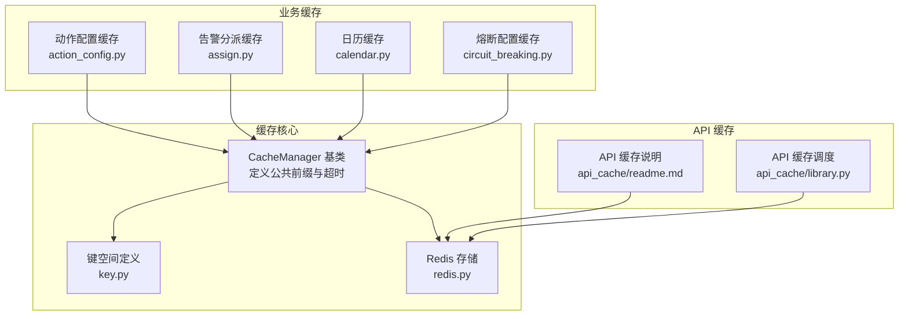
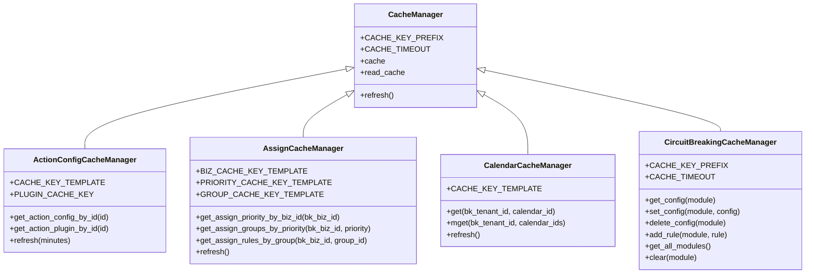
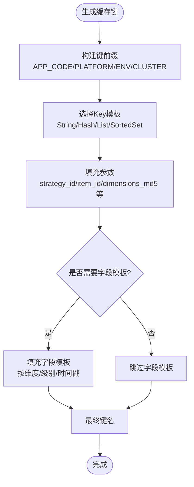
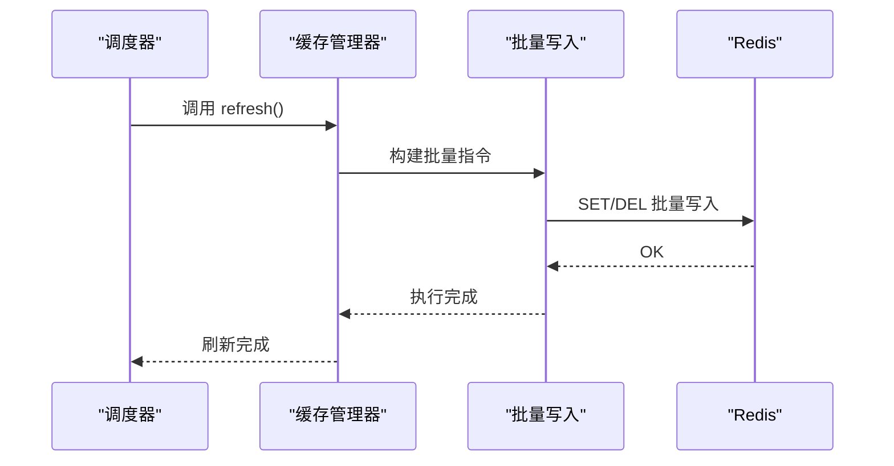
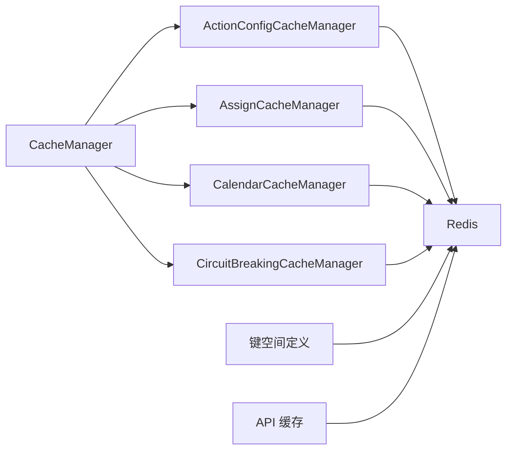

# 缓存系统

<cite>
**本文引用的文件**
- [bkmonitor/alarm_backends/core/cache/__init__.py](file://bkmonitor/alarm_backends/core/cache/__init__.py)
- [bkmonitor/alarm_backends/core/cache/base.py](file://bkmonitor/alarm_backends/core/cache/base.py)
- [bkmonitor/alarm_backends/core/cache/key.py](file://bkmonitor/alarm_backends/core/cache/key.py)
- [bkmonitor/alarm_backends/core/cache/action_config.py](file://bkmonitor/alarm_backends/core/cache/action_config.py)
- [bkmonitor/alarm_backends/core/cache/assign.py](file://bkmonitor/alarm_backends/core/cache/assign.py)
- [bkmonitor/alarm_backends/core/cache/calendar.py](file://bkmonitor/alarm_backends/core/cache/calendar.py)
- [bkmonitor/alarm_backends/core/cache/circuit_breaking.py](file://bkmonitor/alarm_backends/core/cache/circuit_breaking.py)
- [bkmonitor/alarm_backends/constants.py](file://bkmonitor/alarm_backends/constants.py)
- [bkmonitor/alarm_backends/core/storage/redis.py](file://bkmonitor/alarm_backends/core/storage/redis.py)
- [bkmonitor/alarm_backends/core/api_cache/readme.md](file://bkmonitor/alarm_backends/core/api_cache/readme.md)
- [bkmonitor/alarm_backends/core/api_cache/library.py](file://bkmonitor/alarm_backends/core/api_cache/library.py)
</cite>

## 目录
1. [简介](#简介)
2. [项目结构](#项目结构)
3. [核心组件](#核心组件)
4. [架构总览](#架构总览)
5. [详细组件分析](#详细组件分析)
6. [依赖分析](#依赖分析)
7. [性能考量](#性能考量)
8. [故障排查指南](#故障排查指南)
9. [结论](#结论)
10. [附录](#附录)

## 简介
本技术文档围绕告警缓存系统展开，系统以 Redis 为核心存储后端，结合多级缓存策略（API 缓存、业务配置缓存、熔断配置缓存、日历缓存等），在高并发场景下保障数据一致性与性能。文档重点覆盖：
- 缓存架构设计原则与键空间组织
- 缓存键生成策略与命名规范
- 缓存失效与刷新机制
- 不同类型缓存的用途、粒度与命中率优化
- 缓存预热、批量操作与内存管理
- 高并发下的数据一致性与性能保障
- 配置示例与最佳实践

## 项目结构
告警缓存系统主要分布在 alarm_backends/core/cache 与 alarm_backends/core/api_cache 两个子模块中，配合 Redis 存储与键空间定义，形成完整的缓存体系。

图表来源
- [bkmonitor/alarm_backends/core/cache/base.py:20-46](file://bkmonitor/alarm_backends/core/cache/base.py#L20-L46)
- [bkmonitor/alarm_backends/core/cache/key.py:32-48](file://bkmonitor/alarm_backends/core/cache/key.py#L32-L48)
- [bkmonitor/alarm_backends/core/storage/redis.py:293-326](file://bkmonitor/alarm_backends/core/storage/redis.py#L293-L326)
- [bkmonitor/alarm_backends/core/cache/action_config.py:23-36](file://bkmonitor/alarm_backends/core/cache/action_config.py#L23-L36)
- [bkmonitor/alarm_backends/core/cache/assign.py:25-34](file://bkmonitor/alarm_backends/core/cache/assign.py#L25-L34)
- [bkmonitor/alarm_backends/core/cache/calendar.py:10-12](file://bkmonitor/alarm_backends/core/cache/calendar.py#L10-L12)
- [bkmonitor/alarm_backends/core/cache/circuit_breaking.py:46-52](file://bkmonitor/alarm_backends/core/cache/circuit_breaking.py#L46-L52)
- [bkmonitor/alarm_backends/core/api_cache/readme.md:118-153](file://bkmonitor/alarm_backends/core/api_cache/readme.md#L118-L153)
- [bkmonitor/alarm_backends/core/api_cache/library.py:177-181](file://bkmonitor/alarm_backends/core/api_cache/library.py#L177-L181)

章节来源
- [bkmonitor/alarm_backends/core/cache/base.py:20-46](file://bkmonitor/alarm_backends/core/cache/base.py#L20-L46)
- [bkmonitor/alarm_backends/core/cache/key.py:32-48](file://bkmonitor/alarm_backends/core/cache/key.py#L32-L48)
- [bkmonitor/alarm_backends/core/storage/redis.py:293-326](file://bkmonitor/alarm_backends/core/storage/redis.py#L293-L326)

## 核心组件
- 缓存管理基类：统一缓存前缀、超时、读写实例与抽象刷新接口，确保各缓存模块的一致性与可维护性。
- 键空间定义：集中管理 Redis Key 的模板、TTL、后端分类与字段模板，形成清晰的键命名规范与生命周期管理。
- Redis 存储：封装 Redis/哨兵连接、实例路由、只读实例、延迟队列与自动重连，支撑高可用与高性能。
- 业务缓存模块：动作配置、告警分派、日历、熔断配置等，均基于 CacheManager 实现批量刷新与本地内存缓存加速。
- API 缓存：面向外部接口的后端缓存，支持定时刷新、用户相关/后端缓存区分、缓存后端可切换。

章节来源
- [bkmonitor/alarm_backends/core/cache/base.py:20-46](file://bkmonitor/alarm_backends/core/cache/base.py#L20-L46)
- [bkmonitor/alarm_backends/core/cache/key.py:151-162](file://bkmonitor/alarm_backends/core/cache/key.py#L151-L162)
- [bkmonitor/alarm_backends/core/storage/redis.py:98-196](file://bkmonitor/alarm_backends/core/storage/redis.py#L98-L196)
- [bkmonitor/alarm_backends/core/cache/action_config.py:23-36](file://bkmonitor/alarm_backends/core/cache/action_config.py#L23-L36)
- [bkmonitor/alarm_backends/core/cache/assign.py:25-34](file://bkmonitor/alarm_backends/core/cache/assign.py#L25-L34)
- [bkmonitor/alarm_backends/core/cache/calendar.py:10-12](file://bkmonitor/alarm_backends/core/cache/calendar.py#L10-L12)
- [bkmonitor/alarm_backends/core/cache/circuit_breaking.py:46-52](file://bkmonitor/alarm_backends/core/cache/circuit_breaking.py#L46-L52)
- [bkmonitor/alarm_backends/core/api_cache/readme.md:118-153](file://bkmonitor/alarm_backends/core/api_cache/readme.md#L118-L153)

## 架构总览
系统采用“键空间 + 管理器 + 存储”的三层架构：
- 键空间层：定义 Key 模板、TTL、后端分类（queue/service/cache/log 等），并提供统一前缀与集群隔离。
- 管理器层：各业务缓存模块继承 CacheManager，负责刷新策略、批量写入与本地内存加速。
- 存储层：统一通过 Cache 类访问 Redis，支持直连与哨兵模式，具备自动重连与只读实例能力。

图表来源
- [bkmonitor/alarm_backends/core/cache/base.py:20-46](file://bkmonitor/alarm_backends/core/cache/base.py#L20-L46)
- [bkmonitor/alarm_backends/core/cache/action_config.py:23-36](file://bkmonitor/alarm_backends/core/cache/action_config.py#L23-L36)
- [bkmonitor/alarm_backends/core/cache/assign.py:25-34](file://bkmonitor/alarm_backends/core/cache/assign.py#L25-L34)
- [bkmonitor/alarm_backends/core/cache/calendar.py:10-12](file://bkmonitor/alarm_backends/core/cache/calendar.py#L10-L12)
- [bkmonitor/alarm_backends/core/cache/circuit_breaking.py:46-52](file://bkmonitor/alarm_backends/core/cache/circuit_breaking.py#L46-L52)

## 详细组件分析

### 缓存键生成策略与键空间组织
- 前缀与集群隔离：公共前缀由应用代码、平台标识、环境拼接而成；若启用集群，键前缀附加集群名，实现跨集群隔离。
- Key 类型与后端分类：支持 String/Hash/Set/List/SortedSet 等结构，按业务语义划分到 queue/service/cache/log 等后端，便于资源隔离与容量规划。
- 字段模板：Hash/SortedSet 等结构提供字段模板，统一维度/级别/时间戳等字段命名，提升查询效率与可维护性。
- TTL 设计：不同业务场景采用不同 TTL，如策略快照、维度缓存、检测结果等，兼顾时效性与资源占用。

图表来源
- [bkmonitor/alarm_backends/core/cache/key.py:50-93](file://bkmonitor/alarm_backends/core/cache/key.py#L50-L93)
- [bkmonitor/alarm_backends/core/cache/key.py:117-131](file://bkmonitor/alarm_backends/core/cache/key.py#L117-L131)
- [bkmonitor/alarm_backends/core/cache/key.py:145-149](file://bkmonitor/alarm_backends/core/cache/key.py#L145-L149)

章节来源
- [bkmonitor/alarm_backends/core/cache/key.py:32-48](file://bkmonitor/alarm_backends/core/cache/key.py#L32-L48)
- [bkmonitor/alarm_backends/core/cache/key.py:151-162](file://bkmonitor/alarm_backends/core/cache/key.py#L151-L162)

### 缓存失效与刷新机制
- 管理器刷新：各业务缓存模块实现 refresh()，通常采用管道批量写入，减少网络往返；同时清理已删除/过期项。
- API 缓存刷新：通过 Celery 定时任务统一调度，按业务域与分钟线程进行分片，避免热点与抖动。
- 本地内存加速：部分模块在本地内存维护二级缓存，降低 Redis 压力与延迟。
- 锁与并发：使用共享锁避免重复刷新，结合哈希环分片，确保任务均匀分布。

图表来源
- [bkmonitor/alarm_backends/core/cache/action_config.py:78-122](file://bkmonitor/alarm_backends/core/cache/action_config.py#L78-L122)
- [bkmonitor/alarm_backends/core/cache/assign.py:124-205](file://bkmonitor/alarm_backends/core/cache/assign.py#L124-L205)
- [bkmonitor/alarm_backends/core/api_cache/library.py:67-77](file://bkmonitor/alarm_backends/core/api_cache/library.py#L67-L77)

章节来源
- [bkmonitor/alarm_backends/core/cache/action_config.py:78-122](file://bkmonitor/alarm_backends/core/cache/action_config.py#L78-L122)
- [bkmonitor/alarm_backends/core/cache/assign.py:124-205](file://bkmonitor/alarm_backends/core/cache/assign.py#L124-L205)
- [bkmonitor/alarm_backends/core/api_cache/library.py:67-77](file://bkmonitor/alarm_backends/core/api_cache/library.py#L67-L77)

### 不同类型缓存的用途、粒度与命中率优化
- 动作配置缓存：按配置ID与插件ID缓存，支持默认配置回退，批量刷新，命中率高。
- 告警分派缓存：按业务/优先级/分组三级缓存，本地内存加速，动态分组解析后降维为主机列表，减少查询复杂度。
- 日历缓存：按日历ID缓存，支持多租户过滤，批量读取，命中率高。
- 熔断配置缓存：按模块缓存，支持规则增删改查与一键清空，避免频繁扫描 Redis keys。
- API 缓存：区分用户相关与后端缓存，定时刷新，缓存后端可切换，降低上游接口压力。

章节来源
- [bkmonitor/alarm_backends/core/cache/action_config.py:23-36](file://bkmonitor/alarm_backends/core/cache/action_config.py#L23-L36)
- [bkmonitor/alarm_backends/core/cache/assign.py:25-34](file://bkmonitor/alarm_backends/core/cache/assign.py#L25-L34)
- [bkmonitor/alarm_backends/core/cache/calendar.py:10-12](file://bkmonitor/alarm_backends/core/cache/calendar.py#L10-L12)
- [bkmonitor/alarm_backends/core/cache/circuit_breaking.py:46-52](file://bkmonitor/alarm_backends/core/cache/circuit_breaking.py#L46-L52)
- [bkmonitor/alarm_backends/core/api_cache/readme.md:39-71](file://bkmonitor/alarm_backends/core/api_cache/readme.md#L39-L71)

### 缓存预热、批量操作与内存管理
- 预热：业务启动或定时任务中批量写入常用键，降低冷启动延迟。
- 批量操作：使用管道一次性写入/删除，减少 RTT；支持批量读取（如 mget）。
- 内存管理：本地内存缓存定期清理；API 缓存调度中清理临时内存缓存并触发 GC，防止内存泄漏。

章节来源
- [bkmonitor/alarm_backends/core/cache/assign.py:36-54](file://bkmonitor/alarm_backends/core/cache/assign.py#L36-L54)
- [bkmonitor/alarm_backends/core/api_cache/library.py:191-214](file://bkmonitor/alarm_backends/core/api_cache/library.py#L191-L214)

### 高并发场景下的数据一致性与性能保障
- 连接与实例：支持 Redis 与哨兵模式，自动重连与只读实例，提升可用性与读扩展能力。
- 分片与锁：通过共享锁与哈希环分片，避免并发刷新竞争与热点。
- 延迟队列：支持延时入队，平滑突发流量。
- 超时与 TTL：合理设置 TTL，避免缓存雪崩与击穿。

章节来源
- [bkmonitor/alarm_backends/core/storage/redis.py:245-291](file://bkmonitor/alarm_backends/core/storage/redis.py#L245-L291)
- [bkmonitor/alarm_backends/core/storage/redis.py:197-221](file://bkmonitor/alarm_backends/core/storage/redis.py#L197-L221)
- [bkmonitor/alarm_backends/core/api_cache/library.py:60-64](file://bkmonitor/alarm_backends/core/api_cache/library.py#L60-L64)

## 依赖分析
- CacheManager 为所有业务缓存模块提供统一抽象，降低耦合度。
- 键空间定义集中化，避免分散硬编码，便于维护与演进。
- Redis 存储通过路由与环境变量实现灵活配置，支持多后端切换。
- API 缓存依赖 Django 缓存后端配置，支持 DB/LocMem/Dummy 等后端，便于测试与迁移。

图表来源
- [bkmonitor/alarm_backends/core/cache/base.py:20-46](file://bkmonitor/alarm_backends/core/cache/base.py#L20-L46)
- [bkmonitor/alarm_backends/core/cache/key.py:151-162](file://bkmonitor/alarm_backends/core/cache/key.py#L151-L162)
- [bkmonitor/alarm_backends/core/storage/redis.py:293-326](file://bkmonitor/alarm_backends/core/storage/redis.py#L293-L326)
- [bkmonitor/alarm_backends/core/api_cache/readme.md:118-153](file://bkmonitor/alarm_backends/core/api_cache/readme.md#L118-L153)

章节来源
- [bkmonitor/alarm_backends/core/cache/base.py:20-46](file://bkmonitor/alarm_backends/core/cache/base.py#L20-L46)
- [bkmonitor/alarm_backends/core/cache/key.py:151-162](file://bkmonitor/alarm_backends/core/cache/key.py#L151-L162)
- [bkmonitor/alarm_backends/core/storage/redis.py:293-326](file://bkmonitor/alarm_backends/core/storage/redis.py#L293-L326)
- [bkmonitor/alarm_backends/core/api_cache/readme.md:118-153](file://bkmonitor/alarm_backends/core/api_cache/readme.md#L118-L153)

## 性能考量
- 键设计：尽量短小、语义明确，避免过长前缀；Hash/SortedSet 场景使用字段模板统一维度。
- TTL 策略：热点数据短 TTL，静态数据长 TTL；避免同一时间大量过期导致抖动。
- 批量写入：优先使用管道；批量读取使用 mget。
- 本地缓存：对高频读取的配置类数据启用本地内存缓存，减少 Redis 压力。
- 并发控制：使用共享锁与分片，避免重复计算与写放大。
- 连接池：合理配置连接池大小与超时，避免阻塞与资源耗尽。

## 故障排查指南
- 连接失败：检查 Redis/Sentinel 配置与网络；确认自动重连与只读实例可用。
- 缓存未命中：确认键前缀与模板是否正确；检查 TTL 是否过期；核对本地内存缓存是否命中。
- 刷新异常：查看刷新任务日志与共享锁状态；确认分片是否均衡。
- 内存泄漏：关注 API 缓存调度中的内存清理与 GC 触发。

章节来源
- [bkmonitor/alarm_backends/core/storage/redis.py:154-176](file://bkmonitor/alarm_backends/core/storage/redis.py#L154-L176)
- [bkmonitor/alarm_backends/core/api_cache/library.py:191-214](file://bkmonitor/alarm_backends/core/api_cache/library.py#L191-L214)

## 结论
告警缓存系统通过清晰的键空间设计、统一的管理器抽象与灵活的 Redis 存储，实现了高并发场景下的高效与稳定。合理的 TTL、批量操作与本地内存缓存进一步提升了命中率与吞吐。建议在生产环境中结合业务特征持续优化键设计与刷新策略，并完善监控与告警以保障稳定性。

## 附录
- 配置示例（来自 API 缓存说明文档）
  - 缓存后端配置：支持 DB、LocMem、Dummy 等后端，可通过环境变量切换默认后端。
  - API 缓存装饰器与资源类：区分用户相关与后端缓存，支持压缩与触发写入。
  - 定时刷新任务：通过 Celery 定时任务统一调度，按分钟线程分片执行。

章节来源
- [bkmonitor/alarm_backends/core/api_cache/readme.md:118-153](file://bkmonitor/alarm_backends/core/api_cache/readme.md#L118-L153)
- [bkmonitor/alarm_backends/core/api_cache/readme.md:39-71](file://bkmonitor/alarm_backends/core/api_cache/readme.md#L39-L71)
- [bkmonitor/alarm_backends/core/api_cache/library.py:177-181](file://bkmonitor/alarm_backends/core/api_cache/library.py#L177-L181)