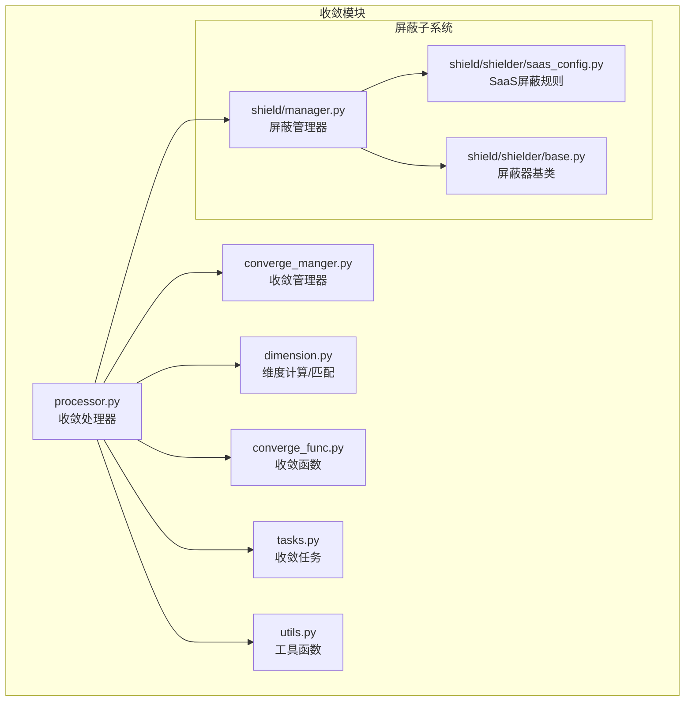
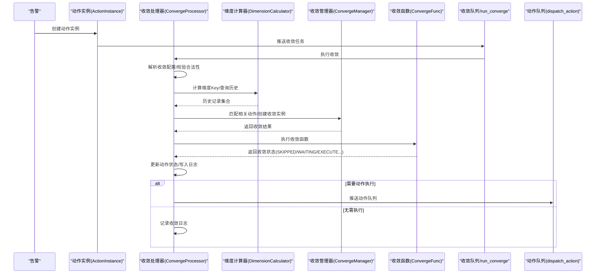
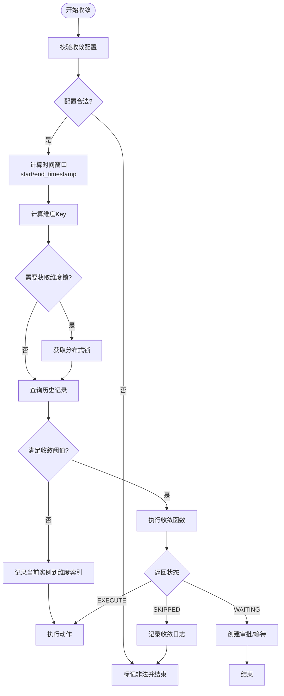
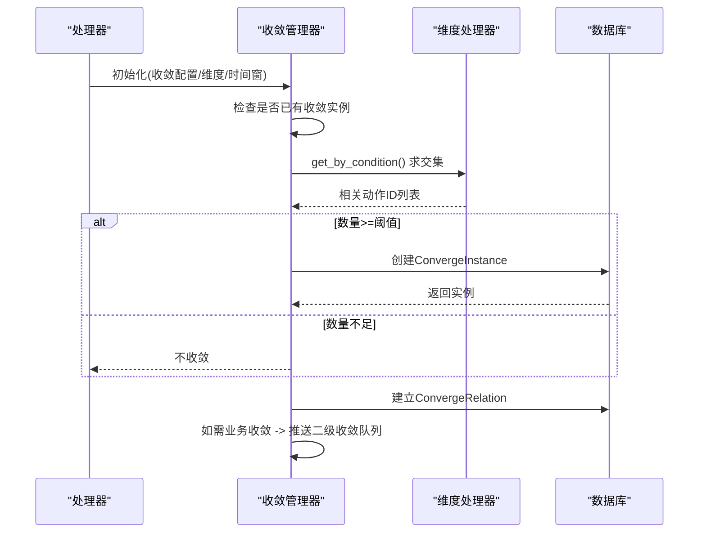
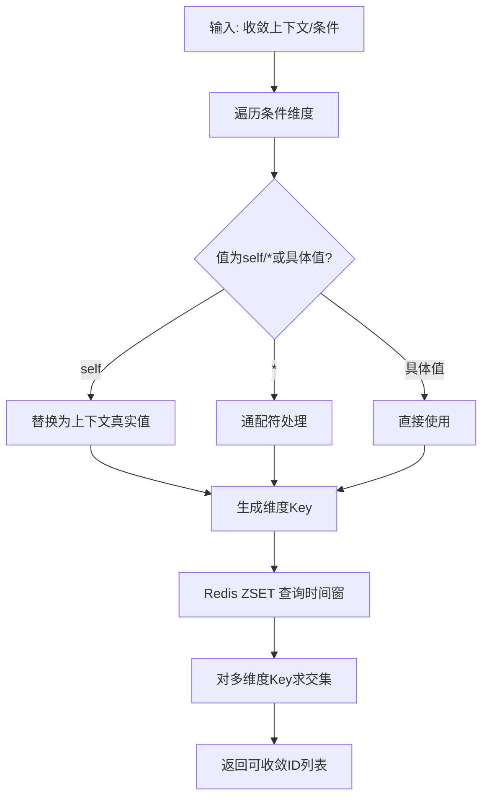
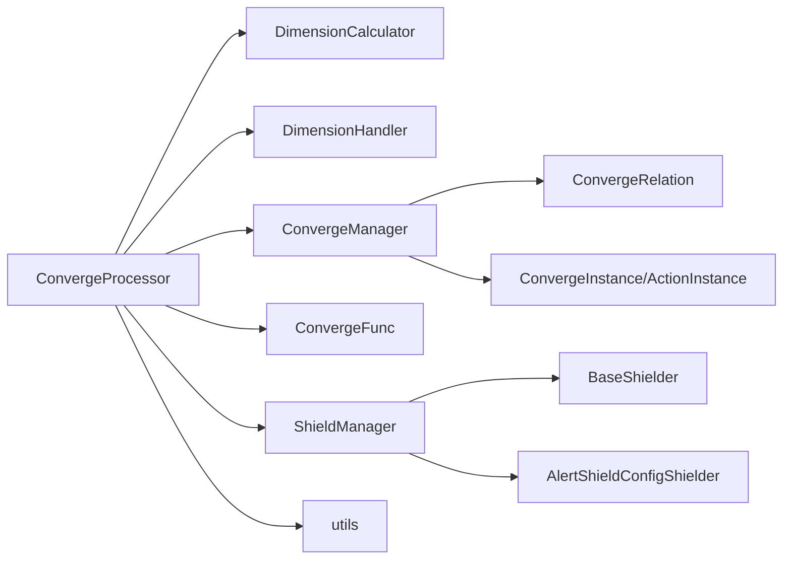

# 告警收敛机制

<cite>
**本文引用的文件**
- [converge_manger.py](file://bkmonitor/alarm_backends/service/converge/converge_manger.py)
- [dimension.py](file://bkmonitor/alarm_backends/service/converge/dimension.py)
- [converge_func.py](file://bkmonitor/alarm_backends/service/converge/converge_func.py)
- [tasks.py](file://bkmonitor/alarm_backends/service/converge/tasks.py)
- [processor.py](file://bkmonitor/alarm_backends/service/converge/processor.py)
- [manager.py](file://bkmonitor/alarm_backends/service/converge/shield/manager.py)
- [base.py](file://bkmonitor/alarm_backends/service/converge/shield/shielder/base.py)
- [saas_config.py](file://bkmonitor/alarm_backends/service/converge/shield/shielder/saas_config.py)
- [utils.py](file://bkmonitor/alarm_backends/service/converge/utils.py)
- [业务逻辑与数据处理流程.md](file://ai-docs/bk-monitor/docs/告警后台(alarm_backends)/modules/converge/业务逻辑与数据处理流程.md)
- [converge_config套餐执行机制文档.md](file://ai-docs/bk-monitor/docs/告警后台(alarm_backends)/modules/fta_action/converge_config套餐执行机制文档.md)
</cite>

## 目录
1. [简介](#简介)
2. [项目结构](#项目结构)
3. [核心组件](#核心组件)
4. [架构总览](#架构总览)
5. [详细组件分析](#详细组件分析)
6. [依赖关系分析](#依赖关系分析)
7. [性能考量](#性能考量)
8. [故障排查指南](#故障排查指南)
9. [结论](#结论)
10. [附录](#附录)

## 简介
本文件系统化阐述告警收敛机制的设计与实现，覆盖算法原理、维度组合策略、时间窗口设置、去重与聚合、抑制规则、告警屏蔽与静默、升级策略以及配置优化与性能调优建议。目标是帮助读者快速理解并高效配置收敛策略，以应对告警风暴、降低噪声、提升处理效率。

## 项目结构
告警收敛模块位于 alarm_backends/service/converge 目录，围绕“收敛处理器”“收敛管理器”“维度计算/匹配”“收敛函数”“屏蔽管理”“任务调度”等核心组件协同工作，形成从动作实例到收敛决策再到处理队列的完整闭环。

图表来源
- [processor.py:55-503](file://bkmonitor/alarm_backends/service/converge/processor.py#L55-L503)
- [converge_manger.py:40-399](file://bkmonitor/alarm_backends/service/converge/converge_manger.py#L40-L399)
- [dimension.py:34-252](file://bkmonitor/alarm_backends/service/converge/dimension.py#L34-L252)
- [converge_func.py:29-291](file://bkmonitor/alarm_backends/service/converge/converge_func.py#L29-L291)
- [tasks.py:24-90](file://bkmonitor/alarm_backends/service/converge/tasks.py#L24-L90)
- [utils.py:16-70](file://bkmonitor/alarm_backends/service/converge/utils.py#L16-L70)
- [manager.py:18-56](file://bkmonitor/alarm_backends/service/converge/shield/manager.py#L18-L56)
- [base.py:13-30](file://bkmonitor/alarm_backends/service/converge/shield/shielder/base.py#L13-L30)
- [saas_config.py:37-299](file://bkmonitor/alarm_backends/service/converge/shield/shielder/saas_config.py#L37-L299)

章节来源
- [业务逻辑与数据处理流程.md](file://ai-docs/bk-monitor/docs/告警后台(alarm_backends)/modules/converge/业务逻辑与数据处理流程.md#L1-L214)

## 核心组件
- 收敛处理器：解析收敛配置、计算维度、查询历史、执行收敛函数、推进状态与队列。
- 收敛管理器：匹配相关动作、创建收敛实例、建立收敛关系、二级收敛推送。
- 维度计算与匹配：基于 Redis 集合运算，按时间窗口与维度条件求交集，确定可收敛集合。
- 收敛函数：提供多种收敛策略（等待、防御、跳过、汇总、触发等）。
- 屏蔽管理：全局/策略/维度/主机/时间等多维屏蔽规则，优先级最高。
- 任务调度：收敛任务异步执行，带重试与指标上报。

章节来源
- [processor.py:55-503](file://bkmonitor/alarm_backends/service/converge/processor.py#L55-L503)
- [converge_manger.py:40-399](file://bkmonitor/alarm_backends/service/converge/converge_manger.py#L40-L399)
- [dimension.py:34-252](file://bkmonitor/alarm_backends/service/converge/dimension.py#L34-L252)
- [converge_func.py:29-291](file://bkmonitor/alarm_backends/service/converge/converge_func.py#L29-L291)
- [manager.py:18-56](file://bkmonitor/alarm_backends/service/converge/shield/manager.py#L18-L56)

## 架构总览
收敛处理的关键流程如下：动作实例创建后进入收敛队列；处理器解析配置、计算维度、查询历史、执行收敛函数；根据结果更新状态并推进到动作队列或二次收敛队列；屏蔽规则在最前优先判断。

图表来源
- [processor.py:186-328](file://bkmonitor/alarm_backends/service/converge/processor.py#L186-L328)
- [converge_manger.py:84-128](file://bkmonitor/alarm_backends/service/converge/converge_manger.py#L84-L128)
- [converge_func.py:29-291](file://bkmonitor/alarm_backends/service/converge/converge_func.py#L29-L291)
- [tasks.py:24-90](file://bkmonitor/alarm_backends/service/converge/tasks.py#L24-L90)

## 详细组件分析

### 收敛处理器（ConvergeProcessor）
职责与要点
- 配置校验：非法配置直接标记为不收敛。
- 时间窗口：支持最大收敛窗口与基础收敛窗口，分别决定搜索起止与容忍上限。
- 维度计算：将收敛条件中的“self”替换为上下文真实值，生成稳定维度Key。
- 锁控制：通过分布式锁限制同一维度并发，避免竞态。
- 屏蔽优先：若被屏蔽，直接返回屏蔽状态并记录日志。
- 结果推进：根据收敛函数返回状态，更新动作实例状态并推进队列。

图表来源
- [processor.py:100-328](file://bkmonitor/alarm_backends/service/converge/processor.py#L100-L328)

章节来源
- [processor.py:55-503](file://bkmonitor/alarm_backends/service/converge/processor.py#L55-L503)

### 收敛管理器（ConvergeManager）
职责与要点
- 维度匹配：基于条件与时间窗口，通过 Redis 集合运算求交集，得到可收敛的动作集合。
- 收敛实例：当满足阈值时创建收敛实例，记录维度、描述与上下文。
- 关联关系：建立收敛关系，支持主/从实例状态与抑制逻辑。
- 二级收敛：当启用业务收敛时，计算业务维度并推送至二级收敛队列。

图表来源
- [converge_manger.py:84-174](file://bkmonitor/alarm_backends/service/converge/converge_manger.py#L84-L174)
- [dimension.py:61-107](file://bkmonitor/alarm_backends/service/converge/dimension.py#L61-L107)

章节来源
- [converge_manger.py:40-399](file://bkmonitor/alarm_backends/service/converge/converge_manger.py#L40-L399)
- [dimension.py:34-252](file://bkmonitor/alarm_backends/service/converge/dimension.py#L34-L252)

### 维度计算与匹配（DimensionCalculator/DimensionHandler）
职责与要点
- 维度Key：将收敛条件映射为稳定的Key，支持“self”“*”与具体值。
- 时间窗口：按起止时间戳查询 Redis，过滤时间窗内记录。
- 集合运算：对多个维度Key求交集，得到最终可收敛集合。
- 二级收敛：业务维度标签拼接为Key，用于跨策略汇总。

图表来源
- [dimension.py:176-236](file://bkmonitor/alarm_backends/service/converge/dimension.py#L176-L236)
- [dimension.py:61-107](file://bkmonitor/alarm_backends/service/converge/dimension.py#L61-L107)

章节来源
- [dimension.py:34-252](file://bkmonitor/alarm_backends/service/converge/dimension.py#L34-L252)

### 收敛函数（ConvergeFunc）
职责与要点
- 提供多种收敛策略：
  - 成功后跳过/执行中跳过：避免重复执行。
  - 异常防御需审批：大规模告警时人工介入。
  - 超出后跳过/汇总：限流与汇总通知。
  - 收敛后处理：仅在满足阈值后才处理。
- 通知汇总：创建内置“汇总通知”动作，延时发送。

章节来源
- [converge_func.py:29-291](file://bkmonitor/alarm_backends/service/converge/converge_func.py#L29-L291)

### 屏蔽管理（ShieldManager 与屏蔽器）
职责与要点
- 屏蔽优先级最高：全局屏蔽、策略级屏蔽、维度屏蔽、主机屏蔽、时间屏蔽依次判定。
- 多屏蔽器组合：对动作与告警快照分别进行匹配。
- 屏蔽详情：记录屏蔽类型与原因，便于审计与排障。

章节来源
- [manager.py:18-56](file://bkmonitor/alarm_backends/service/converge/shield/manager.py#L18-L56)
- [saas_config.py:37-299](file://bkmonitor/alarm_backends/service/converge/shield/shielder/saas_config.py#L37-L299)
- [base.py:13-30](file://bkmonitor/alarm_backends/service/converge/shield/shielder/base.py#L13-L30)

### 任务调度（run_converge）
职责与要点
- 异步执行收敛：Celery 队列“celery_converge”，支持最多3次重试。
- 指标上报：记录处理耗时与计数，便于性能观测。

章节来源
- [tasks.py:24-90](file://bkmonitor/alarm_backends/service/converge/tasks.py#L24-L90)

## 依赖关系分析
- 组件耦合
  - ConvergeProcessor 依赖 DimensionCalculator、ConvergeManager、ConvergeFunc、ShieldManager、utils。
  - ConvergeManager 依赖 DimensionHandler、ConvergeRelation、ConvergeInstance/ActionInstance。
  - 屏蔽管理贯穿动作生命周期，优先于收敛。
- 外部依赖
  - Redis：维度索引、锁、通知汇总键。
  - MySQL：收敛实例与动作实例持久化。
  - Celery：收敛与动作任务队列。

图表来源
- [processor.py:55-503](file://bkmonitor/alarm_backends/service/converge/processor.py#L55-L503)
- [converge_manger.py:40-399](file://bkmonitor/alarm_backends/service/converge/converge_manger.py#L40-L399)
- [manager.py:18-56](file://bkmonitor/alarm_backends/service/converge/shield/manager.py#L18-L56)

## 性能考量
- Redis 集中查询与集合运算：建议合理设置维度数量与时间窗，避免过大交集导致慢查询。
- 分布式锁竞争：通过并发阈值与锁TTL控制，避免热点维度锁争用。
- 任务重试与退避：收敛任务最多重试3次，间隔固定秒级，降低瞬时压力。
- 指标观测：处理耗时与计数指标可用于定位瓶颈与容量规划。

章节来源
- [processor.py:220-245](file://bkmonitor/alarm_backends/service/converge/processor.py#L220-L245)
- [tasks.py:62-89](file://bkmonitor/alarm_backends/service/converge/tasks.py#L62-L89)

## 故障排查指南
常见问题与定位思路
- 收敛未生效
  - 检查收敛配置是否启用、阈值与时间窗是否合理。
  - 核对维度条件是否正确，确认“self”值是否可替换。
  - 查看历史记录是否落入时间窗。
- 并发冲突
  - 关注维度锁获取失败日志，适当提高阈值或拆分维度。
- 屏蔽导致动作不执行
  - 检查全局/策略/主机/时间屏蔽规则，确认屏蔽原因。
- 二级收敛未触发
  - 确认业务收敛开关与阈值，检查业务维度标签生成是否正确。

章节来源
- [processor.py:246-328](file://bkmonitor/alarm_backends/service/converge/processor.py#L246-L328)
- [manager.py:25-55](file://bkmonitor/alarm_backends/service/converge/shield/manager.py#L25-L55)

## 结论
告警收敛机制通过“维度+时间窗+阈值”的组合，结合多种收敛函数与屏蔽规则，有效抑制告警风暴、降低重复执行与噪声。合理的收敛配置与参数调优是保障系统稳定性的关键。建议在生产环境逐步验证不同维度与阈值组合，配合指标监控与日志审计，持续优化收敛策略。

## 附录

### 收敛算法与维度组合策略
- 算法原理
  - 维度Key生成：将收敛条件映射为稳定Key，支持“self”“*”与具体值。
  - 时间窗过滤：按起止时间戳查询 Redis，过滤时间窗内记录。
  - 集合交集：对多维度Key求交集，得到可收敛集合。
- 维度组合策略
  - 策略级：按策略ID收敛。
  - 维度级：按IP/业务/集群/告警级别/信号等收敛。
  - 通知级：按接收人/通知方式收敛。
  - 业务级：跨策略按业务维度汇总。

章节来源
- [converge_config套餐执行机制文档.md](file://ai-docs/bk-monitor/docs/告警后台(alarm_backends)/modules/fta_action/converge_config套餐执行机制文档.md#L36-L125)
- [dimension.py:176-236](file://bkmonitor/alarm_backends/service/converge/dimension.py#L176-L236)

### 时间窗口设置方法
- 基础窗口：timedelta（秒），决定历史记录检索范围。
- 最大容忍：max_timedelta（分钟），决定最长收敛容忍时间。
- 二级收敛：settings.MULTI_STRATEGY_COLLECT_WINDOW/THRESHOLD 控制业务级汇总窗口与阈值。

章节来源
- [processor.py:119-126](file://bkmonitor/alarm_backends/service/converge/processor.py#L119-L126)
- [processor.py:156-158](file://bkmonitor/alarm_backends/service/converge/processor.py#L156-L158)

### 去重、聚合与抑制规则
- 去重：同一维度Key在时间窗内仅保留一次记录。
- 聚合：超过阈值后创建汇总通知，延时统一发送。
- 抑制：收敛实例建立后，同类动作按收敛函数决定是否抑制。

章节来源
- [converge_func.py:192-234](file://bkmonitor/alarm_backends/service/converge/converge_func.py#L192-L234)
- [converge_manger.py:297-348](file://bkmonitor/alarm_backends/service/converge/converge_manger.py#L297-L348)

### 告警屏蔽、静默与升级策略
- 屏蔽：全局/策略/维度/主机/时间多维屏蔽，优先级最高。
- 静默：通过时间范围与主机状态静默处理。
- 升级：异常大规模告警时转为审批流程，人工确认后执行。

章节来源
- [manager.py:25-55](file://bkmonitor/alarm_backends/service/converge/shield/manager.py#L25-L55)
- [saas_config.py:162-207](file://bkmonitor/alarm_backends/service/converge/shield/shielder/saas_config.py#L162-L207)
- [converge_func.py:132-147](file://bkmonitor/alarm_backends/service/converge/converge_func.py#L132-L147)

### 收敛配置优化建议与性能调优
- 维度选择
  - 通知类：按策略+维度+级别+信号+接收人+方式收敛，避免过度聚合。
  - 自愈类：按套餐维度收敛，避免重复执行。
- 阈值与窗口
  - 通知：小阈值（1）+短窗口（1分钟）提升响应速度。
  - 自愈：适度阈值（1~2）+较长窗口（5~10分钟）避免抖动。
- 二级收敛
  - 启用业务维度汇总，跨策略统一处理。
- 性能调优
  - 控制维度数量，避免过多Key求交集。
  - 合理设置并发阈值，避免锁争用。
  - 监控收敛处理耗时与重试次数，及时扩容或降载。

章节来源
- [converge_config套餐执行机制文档.md](file://ai-docs/bk-monitor/docs/告警后台(alarm_backends)/modules/fta_action/converge_config套餐执行机制文档.md#L772-L800)
- [processor.py:220-245](file://bkmonitor/alarm_backends/service/converge/processor.py#L220-L245)