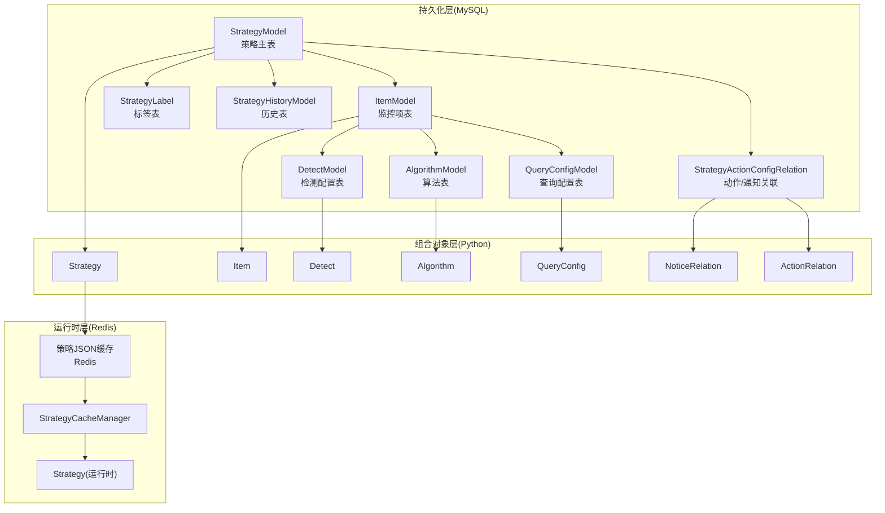
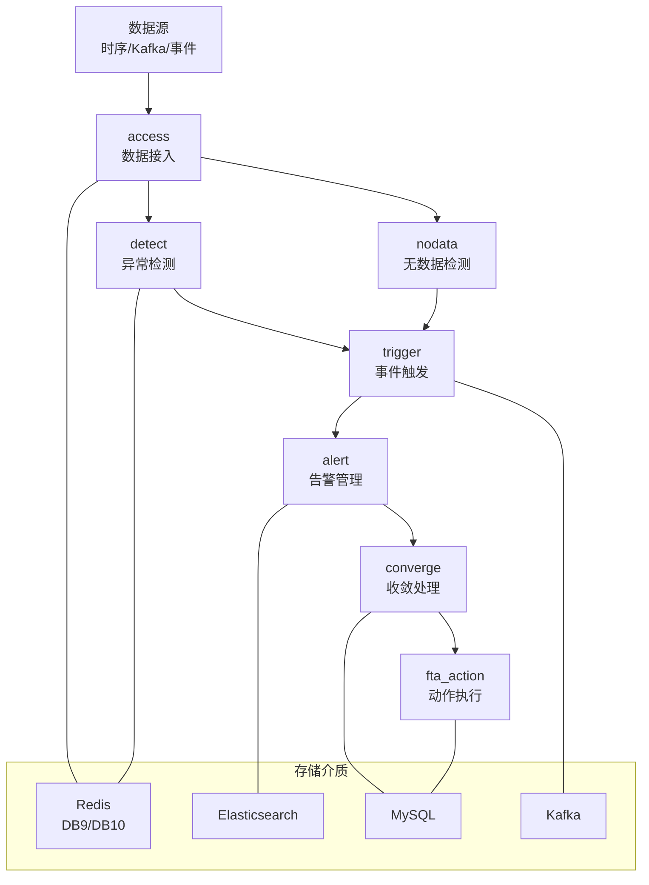
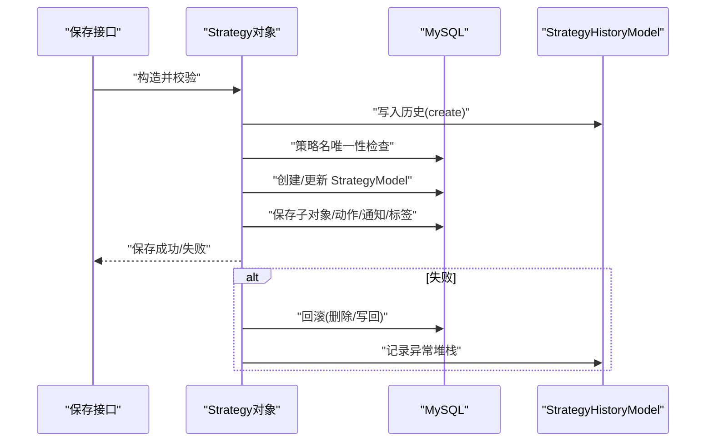
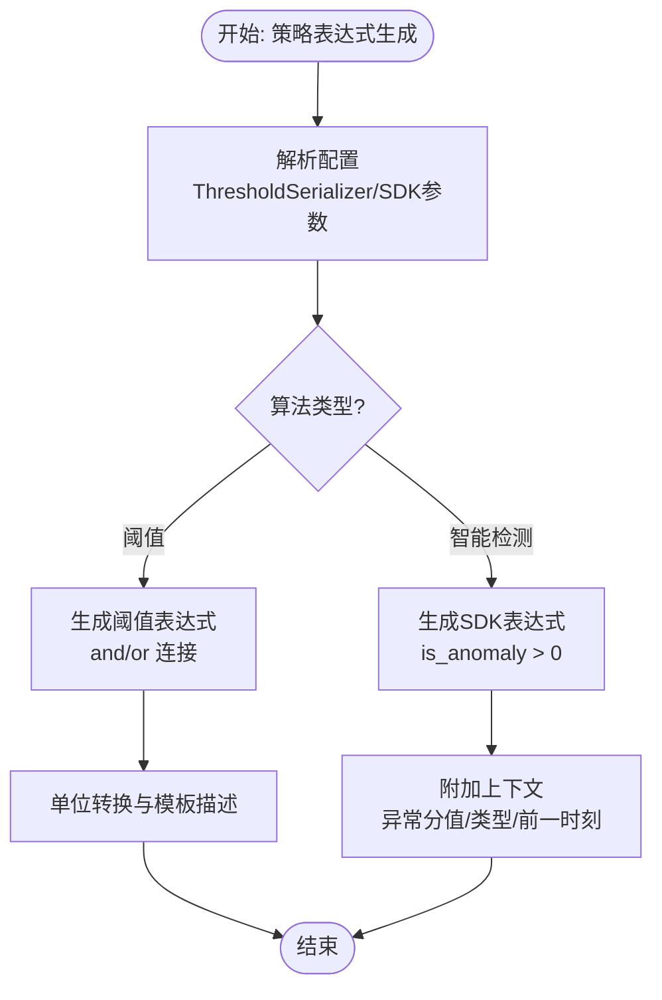
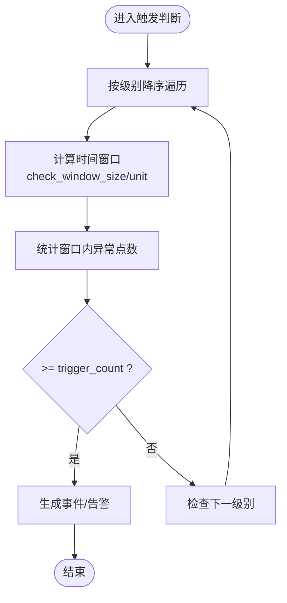
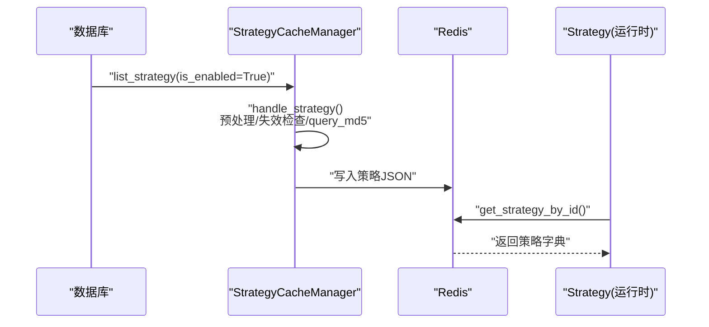
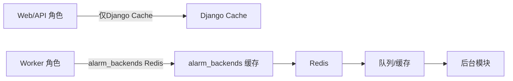

# 告警策略管理

<cite>
**本文引用的文件**
- [告警策略模型设计.md](file://ai-docs/bk-monitor/docs/告警后台(alarm_backends)/models/告警策略模型设计.md)
- [告警数据流.md](file://ai-docs/bk-monitor/docs/告警后台(alarm_backends)/告警数据流.md)
- [部署架构.md](file://ai-docs/bk-monitor/docs/告警后台(alarm_backends)/部署架构.md)
- [constants.py](file://bkmonitor/alarm_backends/constants.py)
- [strategy.py](file://bkmonitor/alarm_backends/core/control/strategy.py)
- [strategy.py](file://bkmonitor/alarm_backends/core/cache/strategy.py)
- [threshold.py](file://bkmonitor/alarm_backends/service/detect/strategy/threshold.py)
- [intelligent_detect.py](file://bkmonitor/alarm_backends/service/detect/strategy/intelligent_detect.py)
</cite>

## 目录
1. [简介](#简介)
2. [项目结构](#项目结构)
3. [核心组件](#核心组件)
4. [架构总览](#架构总览)
5. [详细组件分析](#详细组件分析)
6. [依赖分析](#依赖分析)
7. [性能考虑](#性能考虑)
8. [故障排查指南](#故障排查指南)
9. [结论](#结论)
10. [附录](#附录)

## 简介
本文件面向告警策略管理系统，系统性阐述策略的生命周期管理、配置语法与验证机制、策略表达式的解析与执行、条件判断与优先级处理、策略模板与批量导入导出、版本控制与最佳实践。文档以代码为依据，结合后台数据流与部署架构，帮助读者从“如何配置”到“如何运行”全面理解策略体系。

## 项目结构
告警策略管理涉及三层模型与后台流水线：
- 持久化层：MySQL 策略主表、监控项表、检测配置表、算法表、查询配置表、动作关联表、标签表、历史表
- 组合对象层：Python 对象 Strategy/Item/Detect/Algorithm/QueryConfig/NoticeRelation/ActionRelation
- 运行时层：Redis 缓存策略 JSON，后台模块以只读对象消费

图表来源
- [告警策略模型设计.md](file://ai-docs/bk-monitor/docs/告警后台(alarm_backends)/models/告警策略模型设计.md#L25-L34)
- [告警策略模型设计.md](file://ai-docs/bk-monitor/docs/告警后台(alarm_backends)/models/告警策略模型设计.md#L168-L177)
- [告警策略模型设计.md](file://ai-docs/bk-monitor/docs/告警后台(alarm_backends)/models/告警策略模型设计.md#L304-L311)

章节来源
- [告警策略模型设计.md](file://ai-docs/bk-monitor/docs/告警后台(alarm_backends)/models/告警策略模型设计.md#L9-L392)

## 核心组件
- 持久化模型与职责
  - StrategyModel：策略主字段、启停状态、失效状态、来源、场景、优先级、审计字段
  - ItemModel：监控项本体（名称、表达式、目标、无数据配置、函数、原始 SQL、time_delay）
  - DetectModel：按告警级别拆分的触发/恢复配置与检测表达式
  - AlgorithmModel：监控项下的算法列表
  - QueryConfigModel：监控项下的查询配置列表
  - StrategyActionConfigRelation：策略与动作/通知套餐的关联
  - StrategyLabel/StrategyHistoryModel：标签与历史记录
- 组合对象层
  - Strategy.Serializer 输入校验：items/detects/notice/actions/labels 约束
  - 子对象校验：Algorithm/Detect/QueryConfig/SaveStrategyV2Resource
- 运行时层
  - StrategyCacheManager：从数据库加载策略，预处理并写入 Redis
  - alarm_backends.core.control.Strategy：运行时只读对象，消费 Redis 策略 JSON

章节来源
- [告警策略模型设计.md](file://ai-docs/bk-monitor/docs/告警后台(alarm_backends)/models/告警策略模型设计.md#L36-L159)
- [告警策略模型设计.md](file://ai-docs/bk-monitor/docs/告警后台(alarm_backends)/models/告警策略模型设计.md#L179-L202)
- [告警策略模型设计.md](file://ai-docs/bk-monitor/docs/告警后台(alarm_backends)/models/告警策略模型设计.md#L297-L339)

## 架构总览
告警后台采用模块化、队列化架构，数据在模块间通过 Redis 队列与 Kafka 流转。策略从缓存读取后，经 access → detect → trigger → alert → converge → fta_action 完整闭环。

图表来源
- [告警数据流.md](file://ai-docs/bk-monitor/docs/告警后台(alarm_backends)/告警数据流.md#L53-L800)
- [部署架构.md](file://ai-docs/bk-monitor/docs/告警后台(alarm_backends)/部署架构.md#L1-L153)

章节来源
- [告警数据流.md](file://ai-docs/bk-monitor/docs/告警后台(alarm_backends)/告警数据流.md#L1-L955)
- [部署架构.md](file://ai-docs/bk-monitor/docs/告警后台(alarm_backends)/部署架构.md#L1-L153)

## 详细组件分析

### 策略生命周期管理
- 保存链路
  - 入口：packages/monitor_web/strategies/resources/v2.py
  - 步骤：Strategy(**params) → strategy.convert() → 校验（实时Kafka、CMDB级别、升级用户组冲突）→ strategy.save()
  - 行为：创建/更新 StrategyModel，复用旧 ID 保存子对象，保存动作/通知关联与标签，历史记录与回滚
- 读取链路
  - GetStrategyV2Resource：StrategyModel → Strategy.from_models → restore → to_dict → fill_user_groups
- 局部更新
  - UpdatePartialStrategyV2Resource：StrategyModel 列表转 Strategy 对象 → update_xxx → bulk_update/bulk_create → 批量写历史与清空 hash/snippet

图表来源
- [告警策略模型设计.md](file://ai-docs/bk-monitor/docs/告警后台(alarm_backends)/models/告警策略模型设计.md#L209-L253)

章节来源
- [告警策略模型设计.md](file://ai-docs/bk-monitor/docs/告警后台(alarm_backends)/models/告警策略模型设计.md#L205-L253)

### 策略配置语法与验证机制
- 输入结构
  - items 必填、detects 必填、notice 必填、actions/labels 可空
- 校验分布
  - Strategy.Serializer：禁止特定来源使用特定名称前缀
  - Algorithm.Serializer：按 type 选择具体 serializer 再校验 config
  - Detect.Serializer：expression 非空时调用 parse_expression()
  - QueryConfig：按 (data_source_label, data_type_label) 选择 serializer 再校验
  - SaveStrategyV2Resource：CMDB 级别、实时 Kafka、升级通知用户组冲突校验

章节来源
- [告警策略模型设计.md](file://ai-docs/bk-monitor/docs/告警后台(alarm_backends)/models/告警策略模型设计.md#L179-L202)

### 策略表达式解析与执行
- 阈值表达式
  - AST 转换器占位，表达式生成器将阈值方法与比较符映射为可执行表达式
  - 支持 and/or 连接符，单位转换与模板描述
- 智能检测表达式
  - 基于 AIOPS SDK 预测，使用 is_anomaly > 0 判断异常
  - 提供额外上下文（异常分值、异常类型、前一时刻值）

图表来源
- [threshold.py:28-69](file://bkmonitor/alarm_backends/service/detect/strategy/threshold.py#L28-L69)
- [intelligent_detect.py:45-110](file://bkmonitor/alarm_backends/service/detect/strategy/intelligent_detect.py#L45-L110)

章节来源
- [threshold.py:1-69](file://bkmonitor/alarm_backends/service/detect/strategy/threshold.py#L1-L69)
- [intelligent_detect.py:1-110](file://bkmonitor/alarm_backends/service/detect/strategy/intelligent_detect.py#L1-L110)

### 条件判断与优先级处理
- 触发条件
  - 按级别从高到低检查，时间窗口与次数阈值由 Detect 配置决定
  - 无数据告警使用连续周期阈值
- 恢复与关闭
  - 恢复判断：检测到数据上报即恢复
  - 关闭判断：复用 alert.manager.close 逻辑
- 告警时间窗
  - in_alarm_time：支持生效/不生效日历，跨天时间范围匹配

图表来源
- [告警数据流.md](file://ai-docs/bk-monitor/docs/告警后台(alarm_backends)/告警数据流.md#L377-L409)
- [strategy.py:156-237](file://bkmonitor/alarm_backends/core/control/strategy.py#L156-L237)

章节来源
- [告警数据流.md](file://ai-docs/bk-monitor/docs/告警后台(alarm_backends)/告警数据流.md#L359-L429)
- [strategy.py:310-362](file://bkmonitor/alarm_backends/core/control/strategy.py#L310-L362)

### 运行时策略消费与缓存预处理
- 缓存形态
  - Redis 策略 JSON，alarm_backends.core.control.Strategy 以只读对象消费
- 预处理要点
  - 时间戳标准化、目标字段转换、业务/指标/目标有效性检查、伪事件指标重写、静态 IP 维度补全、AIOPS 非 SDK 展开、query_md5 计算
- 运行时依赖
  - 多处属性/方法依赖 items[0]/query_configs[0]，缓存预处理也仅处理第一个 item

图表来源
- [告警策略模型设计.md](file://ai-docs/bk-monitor/docs/告警后台(alarm_backends)/models/告警策略模型设计.md#L304-L339)
- [strategy.py:517-581](file://bkmonitor/alarm_backends/core/cache/strategy.py#L517-L581)
- [strategy.py:38-49](file://bkmonitor/alarm_backends/core/control/strategy.py#L38-L49)

章节来源
- [告警策略模型设计.md](file://ai-docs/bk-monitor/docs/告警后台(alarm_backends)/models/告警策略模型设计.md#L297-L339)
- [strategy.py:517-581](file://bkmonitor/alarm_backends/core/cache/strategy.py#L517-L581)
- [strategy.py:33-137](file://bkmonitor/alarm_backends/core/control/strategy.py#L33-L137)

### 策略模板、批量导入导出与版本控制
- 策略模板
  - 通过组合对象层的 Serializer 与子对象校验实现模板化配置
- 批量导入导出
  - UpdatePartialStrategyV2Resource 使用 bulk_update/bulk_create 回写，支持批量历史记录与 hash/snippet 清空
- 版本控制
  - StrategyHistoryModel 记录 create/update/delete 操作、状态与错误信息，支持回滚与审计

章节来源
- [告警策略模型设计.md](file://ai-docs/bk-monitor/docs/告警后台(alarm_backends)/models/告警策略模型设计.md#L179-L202)
- [告警策略模型设计.md](file://ai-docs/bk-monitor/docs/告警后台(alarm_backends)/models/告警策略模型设计.md#L246-L253)
- [告警策略模型设计.md](file://ai-docs/bk-monitor/docs/告警后台(alarm_backends)/models/告警策略模型设计.md#L153-L159)

### 策略优先级与分组
- 优先级字段
  - StrategyModel.priority 与 priority_group_key
- 分组 key 计算
  - 基于业务 ID、表达式、函数、查询配置的数据源/类型/聚合方法/周期/维度/条件/指标字段等序列化后 xxhash
  - 若调用方传入 PGK: 前缀则直接保留

章节来源
- [告警策略模型设计.md](file://ai-docs/bk-monitor/docs/告警后台(alarm_backends)/models/告警策略模型设计.md#L370-L378)

### 告警类型与策略示例
- 阈值告警
  - 静态阈值：基于比较符与阈值表达式
  - 动态阈值：基于历史上下限
- 趋势告警
  - 基于时间序列预测与偏差检测
- 机器学习告警
  - 基于 AIOPS SDK 的智能异常检测
- 无数据告警
  - 基于连续周期无上报的检测与恢复

章节来源
- [告警数据流.md](file://ai-docs/bk-monitor/docs/告警后台(alarm_backends)/告警数据流.md#L223-L229)
- [intelligent_detect.py:37-82](file://bkmonitor/alarm_backends/service/detect/strategy/intelligent_detect.py#L37-L82)
- [告警数据流.md](file://ai-docs/bk-monitor/docs/告警后台(alarm_backends)/告警数据流.md#L296-L321)

## 依赖分析
- 组件耦合
  - 运行时不直接依赖 ORM，而是消费 Redis 策略 JSON
  - 缓存层对“首个 item/首个 query_config”存在强依赖
- 外部依赖
  - Redis（队列与缓存）、Kafka（事件）、Elasticsearch（告警/事件存储）、MySQL（配置与历史）
- 角色与缓存能力
  - web/api/worker 角色对 alarm_backends 缓存工具可用性不同，需按配置启用

图表来源
- [部署架构.md](file://ai-docs/bk-monitor/docs/告警后台(alarm_backends)/部署架构.md#L133-L148)

章节来源
- [部署架构.md](file://ai-docs/bk-monitor/docs/告警后台(alarm_backends)/部署架构.md#L1-L153)

## 性能考虑
- 批量处理
  - access 模块对大数据量拆分处理，detect 模块限制单次拉取上限
- 延迟监控
  - 各模块记录处理延迟并上报指标，超过阈值记录警告
- 溢出监控
  - 异常/事件数量超过阈值时上报 PROCESS_OVER_FLOW 指标
- 缓存与预处理
  - Redis 缓存策略 JSON，预处理减少运行时 IO

章节来源
- [告警数据流.md](file://ai-docs/bk-monitor/docs/告警后台(alarm_backends)/告警数据流.md#L156-L160)
- [告警数据流.md](file://ai-docs/bk-monitor/docs/告警后台(alarm_backends)/告警数据流.md#L230-L235)
- [告警数据流.md](file://ai-docs/bk-monitor/docs/告警后台(alarm_backends)/告警数据流.md#L407-L409)

## 故障排查指南
- 常见问题定位
  - 策略未生效：检查 in_alarm_time（告警时间窗/日历）、业务/指标/目标有效性
  - 误报/漏报：检查阈值表达式、单位匹配、AIOPS 配置
  - 无数据告警：核对连续周期配置、维度补全、历史上报情况
- 回滚与审计
  - 保存失败自动回滚，历史记录包含异常堆栈
- 运行时依赖
  - items[0]/query_configs[0] 依赖导致的异常，优先检查首个监控项配置

章节来源
- [告警策略模型设计.md](file://ai-docs/bk-monitor/docs/告警后台(alarm_backends)/models/告警策略模型设计.md#L236-L243)
- [告警策略模型设计.md](file://ai-docs/bk-monitor/docs/告警后台(alarm_backends)/models/告警策略模型设计.md#L327-L339)
- [strategy.py:156-237](file://bkmonitor/alarm_backends/core/control/strategy.py#L156-L237)

## 结论
本系统通过三层模型与后台流水线实现策略的全生命周期管理：从配置校验、持久化、缓存预处理到运行时消费与告警闭环。策略表达式解析与执行、条件判断与优先级处理、以及缓存与队列化架构共同保障了系统的稳定性与性能。建议在实践中遵循模板化配置、严格的校验与回滚机制、以及按级别与时间窗的优先级设计，以获得更可靠的告警效果。

## 附录
- 关键常量与字段
  - 标准数据字段、异常字段、事件字段、无数据级别与标签、Kafka 缓冲区大小等

章节来源
- [constants.py:24-81](file://bkmonitor/alarm_backends/constants.py#L24-L81)