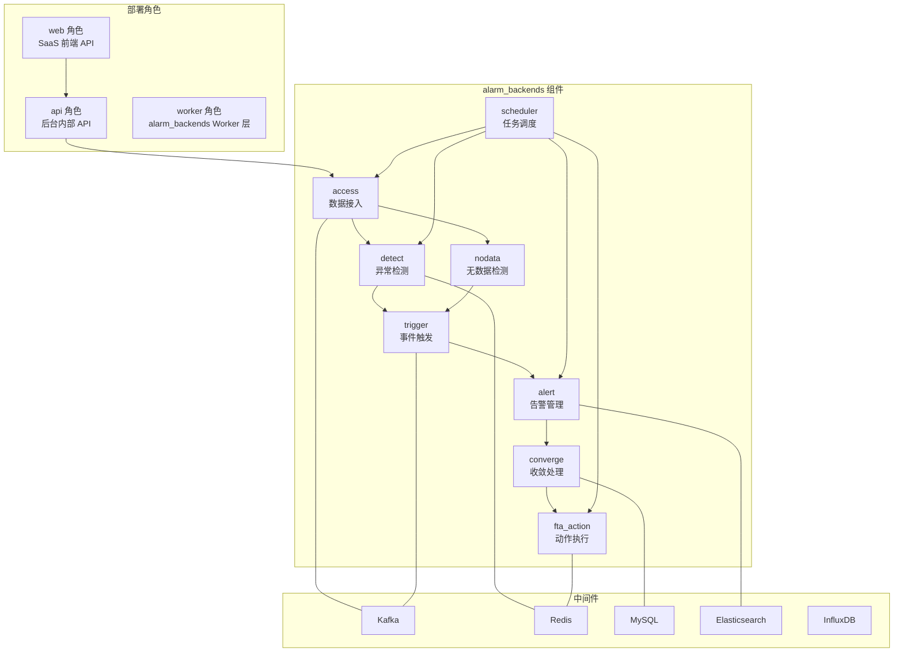
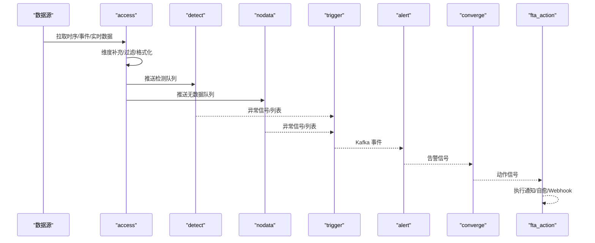
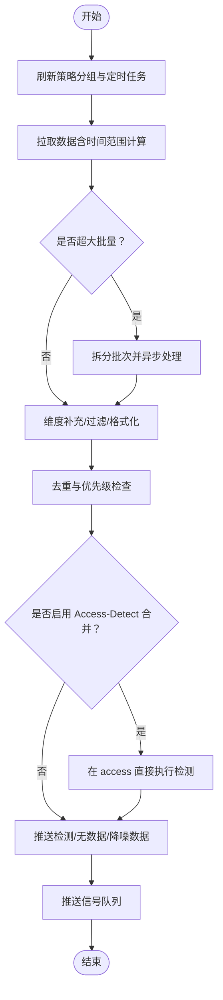
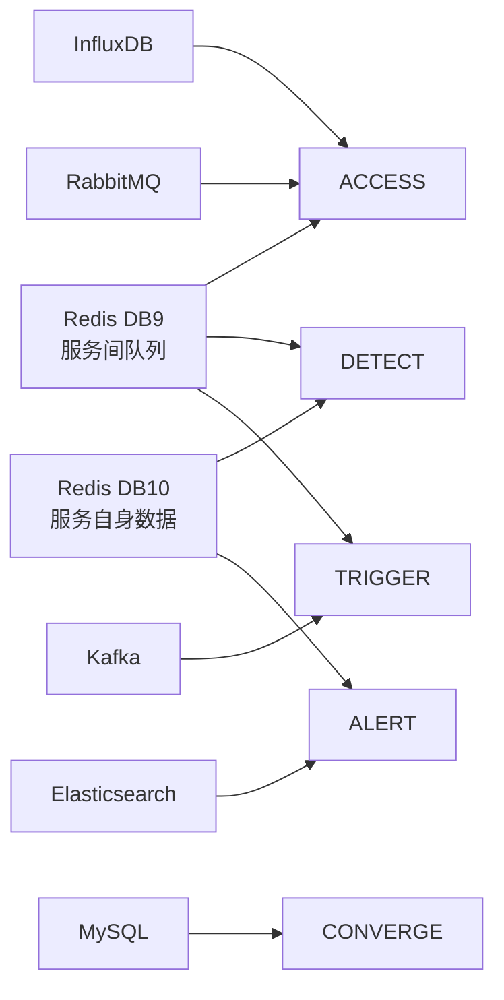

# 告警系统设计

<cite>
**本文引用的文件**
- [告警数据流.md](file://ai-docs/bk-monitor/docs/告警后台(alarm_backends)/告警数据流.md)
- [部署架构.md](file://ai-docs/bk-monitor/docs/告警后台(alarm_backends)/部署架构.md)
- [业务逻辑与数据处理流程.md](file://ai-docs/bk-monitor/docs/告警后台(alarm_backends)/modules/access/业务逻辑与数据处理流程.md)
- [业务逻辑与数据处理流程.md](file://ai-docs/bk-monitor/docs/告警后台(alarm_backends)/modules/converge/业务逻辑与数据处理流程.md)
- [README.md](file://bkmonitor/alarm_backends/README.md)
- [alarm_backends 核心包入口](file://bkmonitor/alarm_backends/core/__init__.py)
- [策略模块入口](file://bkmonitor/bkmonitor/strategy/__init__.py)
</cite>

## 目录
1. [简介](#简介)
2. [项目结构](#项目结构)
3. [核心组件](#核心组件)
4. [架构总览](#架构总览)
5. [详细组件分析](#详细组件分析)
6. [依赖分析](#依赖分析)
7. [性能考量](#性能考量)
8. [故障排查指南](#故障排查指南)
9. [结论](#结论)
10. [附录](#附录)

## 简介
本文件面向告警系统的设计与实现，围绕“告警引擎架构、策略配置、通知渠道管理、告警收敛机制”展开，结合后台数据流文档，系统阐述从数据接入、异常检测、无数据检测、事件触发、告警构建与管理、收敛处理到动作执行的整体链路，并补充升级策略、静默与屏蔽、故障转移等高级能力的实现要点与最佳实践。

## 项目结构
告警后台（alarm_backends）采用模块化与队列化架构，数据在各模块间通过 Redis 队列与 Kafka 流转，配合 Celery 异步任务完成分布式处理。部署层面区分 web/api/worker 三种角色，其中 worker 角色具备完整的 alarm_backends 缓存与队列能力，承担告警检测与动作执行的核心职责。

图示来源
- [部署架构.md](file://ai-docs/bk-monitor/docs/告警后台(alarm_backends)/部署架构.md)
- [告警数据流.md](file://ai-docs/bk-monitor/docs/告警后台(alarm_backends)/告警数据流.md)

章节来源
- [部署架构.md](file://ai-docs/bk-monitor/docs/告警后台(alarm_backends)/部署架构.md)
- [告警数据流.md](file://ai-docs/bk-monitor/docs/告警后台(alarm_backends)/告警数据流.md)

## 核心组件
- 数据接入（access）：从时序数据库、Kafka、实时流等多源拉取数据，进行维度补充、过滤与格式化，推送至下游队列；支持批量处理、去重、熔断与 QoS。
- 异常检测（detect）：加载策略快照，执行各类检测算法（静态/动态阈值、AI 模型、多指标关联等），产出异常记录并推送至触发队列。
- 无数据检测（nodata）：按固定时间点检测策略监控项是否持续无数据上报，生成标准异常记录并复用 detect 输出队列。
- 事件触发（trigger）：根据策略触发条件（窗口大小、触发次数）聚合异常，生成事件并投递到 Kafka，供告警模块消费。
- 告警管理（alert）：事件转告警，进行去重、状态管理与周期检查；支持 QoS、熔断、级别调整与流水日志。
- 收敛处理（converge）：对动作与业务维度进行收敛，避免告警风暴；内置屏蔽管理，支持策略级与维度级屏蔽。
- 动作执行（fta_action）：创建并分发动作（通知、Webhook、作业、标准运维等），执行前检查（恢复、屏蔽、熔断），记录执行结果。
- 任务调度（scheduler）：统一管理定时与周期任务，控制任务超时、队列与监控指标。

章节来源
- [告警数据流.md](file://ai-docs/bk-monitor/docs/告警后台(alarm_backends)/告警数据流.md)
- [业务逻辑与数据处理流程.md](file://ai-docs/bk-monitor/docs/告警后台(alarm_backends)/modules/access/业务逻辑与数据处理流程.md)
- [业务逻辑与数据处理流程.md](file://ai-docs/bk-monitor/docs/告警后台(alarm_backends)/modules/converge/业务逻辑与数据处理流程.md)

## 架构总览
告警后台采用“模块化 + 队列化 + 异步任务”的分布式架构，核心链路如下：

图示来源
- [告警数据流.md](file://ai-docs/bk-monitor/docs/告警后台(alarm_backends)/告警数据流.md)

章节来源
- [告警数据流.md](file://ai-docs/bk-monitor/docs/告警后台(alarm_backends)/告警数据流.md)

## 详细组件分析

### 数据接入模块（access）
- 职责：多源数据接入、维度补充、过滤、格式化、批量处理、去重、熔断与 QoS、Access-Detect 合并优化。
- 关键流程：
  - 策略分组刷新与定时任务调度（基于聚合周期）
  - 数据拉取与时间范围计算（考虑延迟与平台特殊字段）
  - 批量处理（阈值触发、时间点完整性保障、异步子任务）
  - 去重与优先级检查
  - 降噪维度数据推送（SortedSet）
  - Access-Detect 合并（静态阈值策略直接在 access 执行检测）
- 关键 Redis Key
  - access.data.{strategy_id}.{item_id}
  - access.event.{data_id}
  - access.nodata.{strategy_id}.{item_id}
  - access.data.signal
  - access.noise_reduce.total.{strategy_id}.{noise_dimension_hash}
- 关键设计点
  - TokenBucket 限流，防止雪崩
  - 服务锁（Redis 分布式锁）避免并发冲突
  - 熔断机制（业务/数据源/策略三级）
  - QoS 队列（高优先级数据源独立队列，周期扩展）

图示来源
- [业务逻辑与数据处理流程.md](file://ai-docs/bk-monitor/docs/告警后台(alarm_backends)/modules/access/业务逻辑与数据处理流程.md)

章节来源
- [业务逻辑与数据处理流程.md](file://ai-docs/bk-monitor/docs/告警后台(alarm_backends)/modules/access/业务逻辑与数据处理流程.md)

### 异常检测模块（detect）
- 职责：加载策略快照，执行检测算法，生成异常记录并推送至触发队列。
- 关键流程：
  - 从信号队列拉取策略ID，按策略类型分发任务
  - 生成策略快照（缓存）
  - 拉取标准化数据，限制最大条数
  - 执行检测算法（静态/动态阈值、AI 模型、多指标关联、AIOps SDK）
  - 二次确认（灰度策略）
  - 推送异常信号与列表，延迟与溢出监控
- 关键 Redis Key
  - detect.anomaly.list.{strategy_id}.{item_id}
  - detect.anomaly.signal
  - detect.check_result.{strategy_id}.{item_id}
  - cache.strategy.snapshot.{strategy_id}.{update_time}

章节来源
- [告警数据流.md](file://ai-docs/bk-monitor/docs/告警后台(alarm_backends)/告警数据流.md)

### 无数据检测模块（nodata）
- 职责：按固定时间点检测策略监控项是否持续无数据上报，生成标准异常记录。
- 关键流程：
  - 每分钟第55秒触发
  - 获取配置了无数据告警的策略，生成 Celery 任务
  - 生成策略快照与流控检查（TokenBucket）
  - 检测时间点计算与重复检测保护
  - 无数据维度降维、缺失维度识别与异常生成
  - 复用 detect 输出队列推送
- 关键设计点
  - 与 trigger 模块复用触发判断逻辑
  - 未来数据处理（若当前无数据但未来有数据，取最早周期用于恢复检测）

章节来源
- [告警数据流.md](file://ai-docs/bk-monitor/docs/告警后台(alarm_backends)/告警数据流.md)

### 事件触发模块（trigger）
- 职责：根据策略触发条件（窗口大小、触发次数）聚合异常，生成事件并投递到 Kafka。
- 关键流程：
  - 从异常信号队列拉取策略监控项
  - 从异常列表拉取对应数据
  - 告警时间检查（避免非告警时间产生告警）
  - 按级别从高到低检查，时间窗口内异常统计
  - 生成事件记录并适配为标准格式
  - 推送至 Kafka（event topic），延迟与溢出监控

章节来源
- [告警数据流.md](file://ai-docs/bk-monitor/docs/告警后台(alarm_backends)/告警数据流.md)

### 告警管理模块（alert）
- 职责：事件转告警，去重、状态管理与周期检查。
- 组成：
  - alert.builder：事件增强、去重、构建告警、保存事件与告警、发送信号
  - alert.manager：周期检查、状态变更、流水日志、发送信号
- 关键流程：
  - 事件消费与增强（CMDB/维度/策略）
  - 过期事件检查与保存（ES）
  - 告警去重（基于 dedupe_keys）与级别调整
  - 保存告警（ES + Redis 缓存），发送信号触发动作
  - 周期检查（Next/Close/Recover/Shield/Ack/Upgrade/ActionHandle）
- 关键设计点
  - QoS 流控检查、熔断检查、过期事件过滤、分布式锁（multi_service_lock）

章节来源
- [告警数据流.md](file://ai-docs/bk-monitor/docs/告警后台(alarm_backends)/告警数据流.md)

### 收敛处理模块（converge）
- 职责：对动作与业务维度进行收敛，避免告警风暴；内置屏蔽管理。
- 关键流程：
  - 收敛检查（是否存在同维度收敛实例、关联告警数量）
  - 收敛函数执行（等待、防御、跳过、汇集、触发）
  - 创建收敛实例（MySQL）、更新动作状态（SKIPPED/WAITING）
  - 二级收敛推送（业务维度）
- 关键设计点
  - 收敛维度（策略ID、维度、时间窗口）
  - 屏蔽管理（策略级/维度级/时间范围）
  - 存储（MySQL 主要存储，Redis 临时缓存）

章节来源
- [业务逻辑与数据处理流程.md](file://ai-docs/bk-monitor/docs/告警后台(alarm_backends)/modules/converge/业务逻辑与数据处理流程.md)

### 动作执行模块（fta_action）
- 职责：创建动作实例、告警分派、收敛检查、分发到执行队列并执行。
- 关键流程：
  - 创建动作实例（通知/回调/作业/标准运维/消息队列）
  - 告警分派与收敛检查
  - 分发到不同 Celery 队列（通知/回调/自愈）
  - 执行前检查（恢复、屏蔽、熔断）
  - 执行动作并记录结果（ES 同步）
- 关键设计点
  - 通知汇总、通知间隔（间隔/递增）
  - 动作收敛与执行后处理

章节来源
- [告警数据流.md](file://ai-docs/bk-monitor/docs/告警后台(alarm_backends)/告警数据流.md)

### 任务调度模块（scheduler）
- 职责：统一管理定时与周期任务，控制任务超时、队列与监控指标。
- 关键任务：
  - access 数据拉取、detect 异常检测、alert 周期检查、action 同步、缓存刷新
- 关键设计点
  - 三类队列：默认/动作/耗时任务
  - 任务超时范围（5 分钟 - 1 小时）
  - 监控指标上报（执行时间/次数）

章节来源
- [告警数据流.md](file://ai-docs/bk-monitor/docs/告警后台(alarm_backends)/告警数据流.md)

## 依赖分析
- 存储介质
  - Redis：DB 9（服务间队列，重要）、DB 10（服务自身数据，重要）
  - ES：告警与事件文档存储
  - MySQL：收敛实例与动作实例持久化
  - InfluxDB：时序历史数据查询
- 中间件
  - Kafka：事件管道
  - RabbitMQ：故障分析同步
- 角色与缓存能力
  - web 角色不具备 alarm_backends 缓存配置
  - api/worker 角色具备完整 Redis 缓存能力（db 7–10）

图示来源
- [部署架构.md](file://ai-docs/bk-monitor/docs/告警后台(alarm_backends)/部署架构.md)
- [告警数据流.md](file://ai-docs/bk-monitor/docs/告警后台(alarm_backends)/告警数据流.md)

章节来源
- [部署架构.md](file://ai-docs/bk-monitor/docs/告警后台(alarm_backends)/部署架构.md)
- [告警数据流.md](file://ai-docs/bk-monitor/docs/告警后台(alarm_backends)/告警数据流.md)

## 性能考量
- 批量处理与时间点限制：大数据量自动拆分，控制下游推送规模；对 TIME_SERIES 类型限制时间点数量，避免恢复后一次性处理过多数据。
- Access-Detect 合并：静态阈值策略直接在 access 执行检测，减少延迟。
- TokenBucket 限流：对耗时超预期的数据源降级，防止雪崩。
- 服务锁：避免并发任务冲突，保障幂等。
- 缓存与队列：Redis 缓存策略快照与临时数据，Kafka/Redis 队列解耦上下游。
- 监控指标：PROCESS_OVER_FLOW、PROCESS_BIG_LATENCY、CRON_TASK_EXECUTE_TIME 等，用于定位瓶颈。

章节来源
- [业务逻辑与数据处理流程.md](file://ai-docs/bk-monitor/docs/告警后台(alarm_backends)/modules/access/业务逻辑与数据处理流程.md)
- [告警数据流.md](file://ai-docs/bk-monitor/docs/告警后台(alarm_backends)/告警数据流.md)

## 故障排查指南
- 数据不遗漏与周期保障：检查 access 的定时任务与 checkpoint 更新，确认时间范围计算与延迟参数。
- 溢出与延迟：关注 PROCESS_OVER_FLOW 与延迟指标，必要时提升阈值或优化上游处理。
- 并发冲突：确认服务锁使用与 TTL 设置，避免重复消费或竞态。
- 熔断与 QoS：核对业务/数据源/策略级熔断配置，以及 QoS 队列启用状态。
- 收敛与屏蔽：检查收敛维度与阈值、屏蔽规则（策略/维度/时间范围）。
- 存储一致性：核对 ES/MySQL/Redis 的写入与缓存更新，确保告警状态正确。

章节来源
- [告警数据流.md](file://ai-docs/bk-monitor/docs/告警后台(alarm_backends)/告警数据流.md)
- [业务逻辑与数据处理流程.md](file://ai-docs/bk-monitor/docs/告警后台(alarm_backends)/modules/access/业务逻辑与数据处理流程.md)
- [业务逻辑与数据处理流程.md](file://ai-docs/bk-monitor/docs/告警后台(alarm_backends)/modules/converge/业务逻辑与数据处理流程.md)

## 结论
告警系统通过模块化与队列化架构实现了高吞吐、可扩展的告警处理链路。从数据接入到动作执行的全链路均具备完善的熔断、限流、收敛与监控机制，能够有效应对大规模场景下的告警风暴与性能挑战。建议在生产环境中结合业务特征合理配置收敛维度、屏蔽规则与 QoS，持续监控关键指标，确保系统稳定与高效。

## 附录
- 启动与调试
  - 本地启动：通过 manage.py 指定 worker 配置与模块启动（access/detect 等）
  - Supervisor：生成配置文件并启动
  - 单元测试：设置环境变量与依赖后运行
- 文档与配置
  - 模块文档总览与各模块详细流程见告警后台文档目录
  - 配置参数与 Redis Key 命名规则详见各模块文档

章节来源
- [README.md](file://bkmonitor/alarm_backends/README.md)
- [告警数据流.md](file://ai-docs/bk-monitor/docs/告警后台(alarm_backends)/告警数据流.md)
- [alarm_backends 核心包入口](file://bkmonitor/alarm_backends/core/__init__.py)
- [策略模块入口](file://bkmonitor/bkmonitor/strategy/__init__.py)