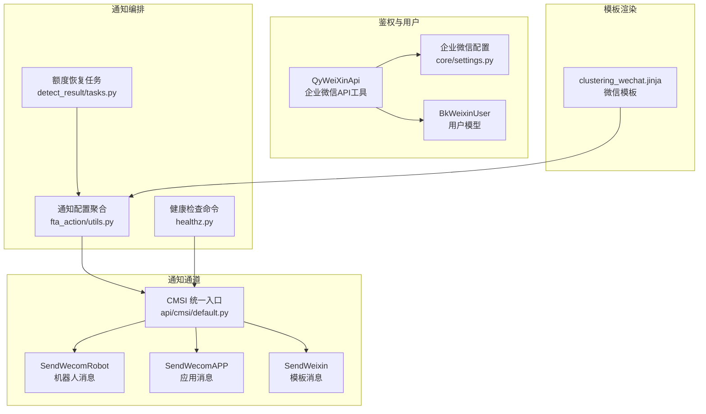
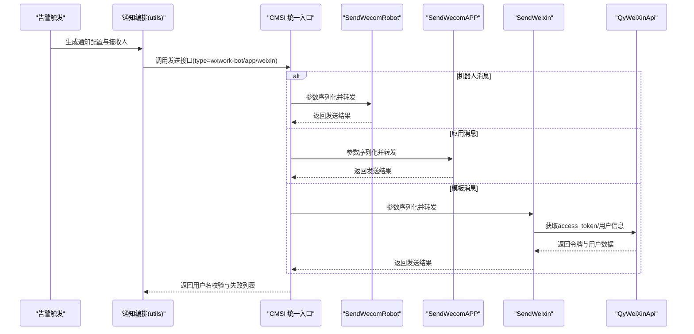
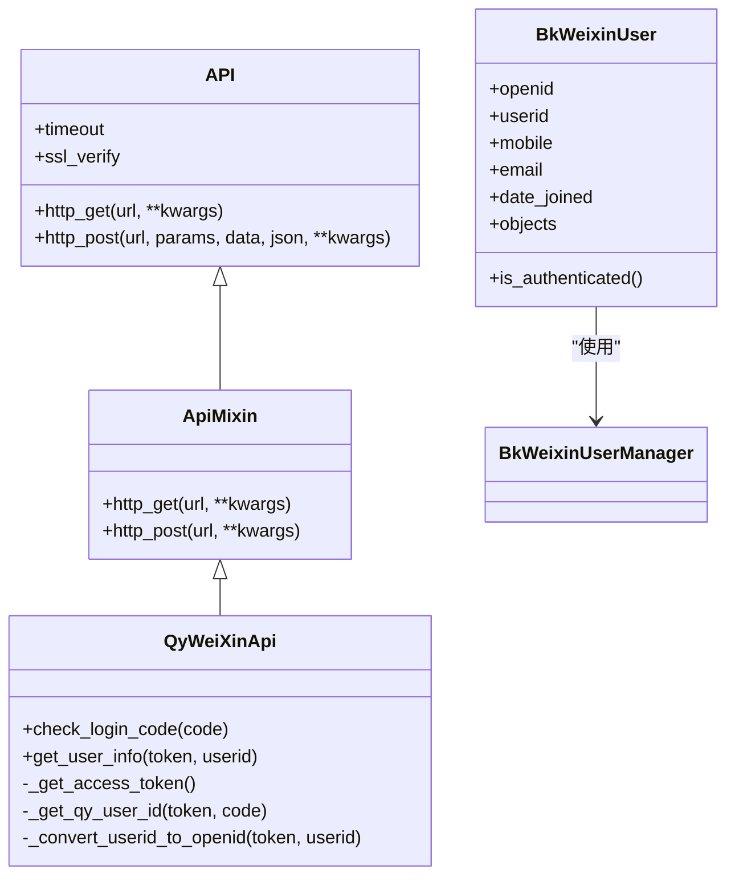
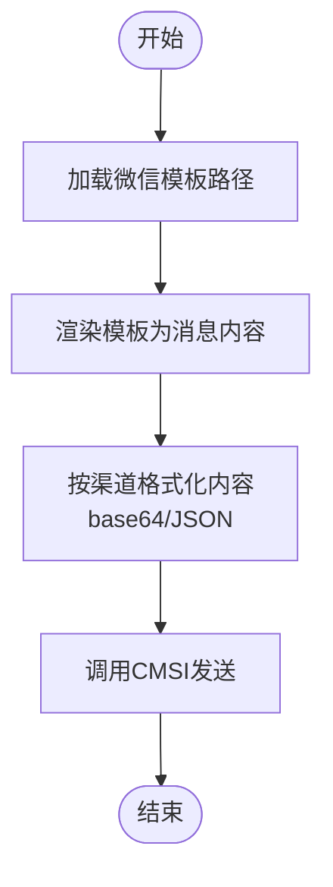
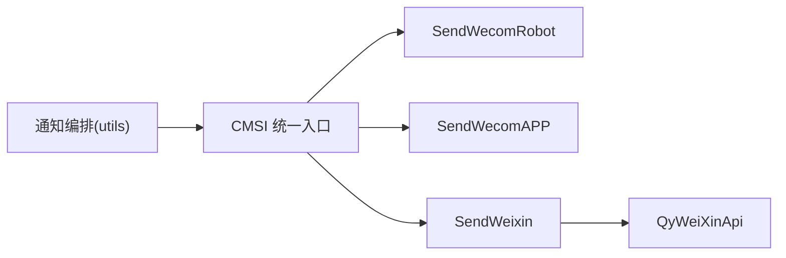

# 企业微信集成

<cite>
**本文引用的文件**
- [api/cmsi/default.py](file://bkmonitor/api/cmsi/default.py)
- [packages/weixin/core/api.py](file://bkmonitor/packages/weixin/core/api.py)
- [packages/weixin/core/settings.py](file://bkmonitor/packages/weixin/core/settings.py)
- [packages/weixin/core/models.py](file://bkmonitor/packages/weixin/core/models.py)
- [packages/weixin/README.md](file://bkmonitor/packages/weixin/README.md)
- [alarm_backends/service/fta_action/utils.py](file://bkmonitor/alarm_backends/service/fta_action/utils.py)
- [alarm_backends/core/detect_result/tasks.py](file://bkmonitor/alarm_backends/core/detect_result/tasks.py)
- [alarm_backends/management/commands/healthz.py](file://bkmonitor/alarm_backends/management/commands/healthz.py)
- [templates/new_report/clustering/clustering_wechat.jinja](file://bkmonitor/templates/new_report/clustering/clustering_wechat.jinja)
</cite>

## 目录
1. [简介](#简介)
2. [项目结构](#项目结构)
3. [核心组件](#核心组件)
4. [架构总览](#架构总览)
5. [详细组件分析](#详细组件分析)
6. [依赖分析](#依赖分析)
7. [性能考量](#性能考量)
8. [故障排查指南](#故障排查指南)
9. [结论](#结论)
10. [附录](#附录)

## 简介
本文件面向企业微信通知渠道的集成与运维，覆盖以下关键主题：
- 企业微信 API 的调用流程与鉴权链路
- 三种发送方式：企业微信机器人、应用消息（企业号）、模板消息（微信公众号）的差异与适用场景
- 消息模板配置与渲染、消息内容格式化、用户授权验证、部门/成员信息获取
- 发送限制与额度恢复机制（含机器人额度）
- API 密钥配置、回调地址设置、错误码处理与告警通道对接
- 通过蓝鲸通知中心 CMSI 统一出口的发送流程与参数映射

## 项目结构
企业微信相关能力主要分布在如下模块：
- 通知通道与发送：CMSI 统一入口，封装多种渠道发送资源
- 企业微信鉴权与用户信息：微信/企业微信 API 工具与模型
- 通知编排与路由：告警后端对通知方式的解析与聚合
- 模板渲染：报告与告警模板的微信消息渲染
- 运维与限流：定时任务恢复机器人额度、健康检查命令

**图示来源**
- [api/cmsi/default.py:518-556](file://bkmonitor/api/cmsi/default.py#L518-L556)
- [packages/weixin/core/api.py:113-207](file://bkmonitor/packages/weixin/core/api.py#L113-L207)
- [packages/weixin/core/settings.py:16-50](file://bkmonitor/packages/weixin/core/settings.py#L16-L50)
- [packages/weixin/core/models.py:17-86](file://bkmonitor/packages/weixin/core/models.py#L17-L86)
- [alarm_backends/service/fta_action/utils.py:550-588](file://bkmonitor/alarm_backends/service/fta_action/utils.py#L550-L588)
- [alarm_backends/core/detect_result/tasks.py:25-31](file://bkmonitor/alarm_backends/core/detect_result/tasks.py#L25-L31)
- [alarm_backends/management/commands/healthz.py:209-222](file://bkmonitor/alarm_backends/management/commands/healthz.py#L209-L222)
- [templates/new_report/clustering/clustering_wechat.jinja](file://bkmonitor/templates/new_report/clustering/clustering_wechat.jinja)

**章节来源**
- [api/cmsi/default.py:1-579](file://bkmonitor/api/cmsi/default.py#L1-L579)
- [packages/weixin/core/api.py:1-207](file://bkmonitor/packages/weixin/core/api.py#L1-L207)
- [packages/weixin/core/settings.py:1-50](file://bkmonitor/packages/weixin/core/settings.py#L1-L50)
- [packages/weixin/core/models.py:1-86](file://bkmonitor/packages/weixin/core/models.py#L1-L86)
- [packages/weixin/README.md:1-47](file://bkmonitor/packages/weixin/README.md#L1-L47)
- [alarm_backends/service/fta_action/utils.py:550-588](file://bkmonitor/alarm_backends/service/fta_action/utils.py#L550-L588)
- [alarm_backends/core/detect_result/tasks.py:25-31](file://bkmonitor/alarm_backends/core/detect_result/tasks.py#L25-L31)
- [alarm_backends/management/commands/healthz.py:209-222](file://bkmonitor/alarm_backends/management/commands/healthz.py#L209-L222)
- [templates/new_report/clustering/clustering_wechat.jinja](file://bkmonitor/templates/new_report/clustering/clustering_wechat.jinja)

## 核心组件
- 企业微信 API 工具
  - 提供微信与企业微信的通用 HTTP 访问封装，统一错误处理与返回格式兼容
  - 企业微信工具类负责 access_token 获取、用户身份获取、成员信息读取、userid/openid 转换
- 企业微信配置
  - 通过环境变量启用/切换企业微信，配置 app_id/corp_id、secret、agent_id、API/Open 域名
  - 提供站点 URL、静态资源 URL、外网 Host/Scheme 等代理相关配置
- 用户模型
  - 统一存储 openid 与企业微信 userid，并提供按 openid 或 userid 去重的用户管理器
- CMSI 统一发送
  - 封装多种通知渠道资源：通用消息、微信模板消息、企业微信机器人、企业微信应用消息、邮件、短信、语音等
  - 自动根据网关模式选择 apigw 或 ESB 接口，自动处理字段序列化与列表化
- 通知编排与模板
  - 将通知方式（如 wxwork-bot、weixin）与接收人聚合，支持 @ 提醒用户的聚合
  - 报告与告警模板渲染为微信消息内容
- 额度与健康检查
  - 定时任务每日重置企业微信机器人额度白名单
  - 健康检查命令通过 CMSI 发送测试消息

**章节来源**
- [packages/weixin/core/api.py:23-207](file://bkmonitor/packages/weixin/core/api.py#L23-L207)
- [packages/weixin/core/settings.py:16-50](file://bkmonitor/packages/weixin/core/settings.py#L16-L50)
- [packages/weixin/core/models.py:17-86](file://bkmonitor/packages/weixin/core/models.py#L17-L86)
- [api/cmsi/default.py:291-556](file://bkmonitor/api/cmsi/default.py#L291-L556)
- [alarm_backends/service/fta_action/utils.py:550-588](file://bkmonitor/alarm_backends/service/fta_action/utils.py#L550-L588)
- [alarm_backends/core/detect_result/tasks.py:25-31](file://bkmonitor/alarm_backends/core/detect_result/tasks.py#L25-L31)
- [alarm_backends/management/commands/healthz.py:209-222](file://bkmonitor/alarm_backends/management/commands/healthz.py#L209-L222)

## 架构总览
企业微信通知从“告警触发”到“消息送达”的整体流程如下：

**图示来源**
- [alarm_backends/service/fta_action/utils.py:550-588](file://bkmonitor/alarm_backends/service/fta_action/utils.py#L550-L588)
- [api/cmsi/default.py:518-556](file://bkmonitor/api/cmsi/default.py#L518-L556)
- [packages/weixin/core/api.py:113-207](file://bkmonitor/packages/weixin/core/api.py#L113-L207)

## 详细组件分析

### 企业微信 API 工具与鉴权
- 通用 API 封装
  - 提供 http_get/http_post，统一编码与异常日志
  - ApiMixin 对返回值 errcode 做兼容处理，非 0 时记录错误并返回空字典
- 企业微信工具
  - 获取 access_token、用户身份、成员信息、userid 与 openid 转换
  - 登录 code 校验流程：先获取 access_token，再获取用户信息，必要时转换 openid
- 用户模型
  - 支持 openid 与 userid 组合唯一约束，提供创建/更新/查询逻辑

**图示来源**
- [packages/weixin/core/api.py:23-207](file://bkmonitor/packages/weixin/core/api.py#L23-L207)
- [packages/weixin/core/models.py:17-86](file://bkmonitor/packages/weixin/core/models.py#L17-L86)

**章节来源**
- [packages/weixin/core/api.py:23-207](file://bkmonitor/packages/weixin/core/api.py#L23-L207)
- [packages/weixin/core/models.py:17-86](file://bkmonitor/packages/weixin/core/models.py#L17-L86)

### 企业微信配置与回调设置
- 环境变量
  - 开启开关：BKAPP_USE_WEIXIN、BKAPP_IS_QY_WEIXIN
  - 基础凭据：BKAPP_WEIXIN_APP_ID、BKAPP_WEIXIN_APP_SECRET、BKAPP_WEIXIN_AGENT_ID
  - 外网访问：BKAPP_WEIXIN_SITE_URL、BKAPP_WEIXIN_STATIC_URL、BKAPP_WEIXIN_APP_EXTERNAL_HOST、BKAPP_WEIXIN_APP_EXTERNAL_SCHEME
  - 企业微信私有化：BKAPP_WEIXIN_QY_API_DOMAIN、BKAPP_WEIXIN_QY_OPEN_DOMAIN
- 回调与代理
  - 移动端服务路径与静态资源路径需暴露至外网
  - 多级代理需透传 X-Forwarded-WeiXin-Host 等头部，确保回调域名正确

**章节来源**
- [packages/weixin/core/settings.py:16-50](file://bkmonitor/packages/weixin/core/settings.py#L16-L50)
- [packages/weixin/README.md:1-47](file://bkmonitor/packages/weixin/README.md#L1-L47)

### 三种发送方式对比与适用场景
- 企业微信机器人（wxwork-bot）
  - 适用：无需用户授权、面向群聊或机器人 webhook 的快速通知
  - 参数：type/content（JSON）、receiver/group_receiver
  - 限制：存在额度与白名单机制；每日 0 点重置
- 企业微信应用消息（wecom_app）
  - 适用：面向企业内部用户，具备更强权限与更丰富消息类型
  - 参数：type/content（JSON）、receiver/tag_receiver
  - 限制：需具备应用权限与用户授权
- 模板消息（weixin）
  - 适用：微信公众号风格的消息模板，适合对外展示或跨平台统一
  - 参数：heading/message/date/remark，支持 base64 编码
  - 限制：需通过微信/企业微信 API 获取 access_token 与用户信息

**章节来源**
- [api/cmsi/default.py:518-556](file://bkmonitor/api/cmsi/default.py#L518-L556)
- [api/cmsi/default.py:317-364](file://bkmonitor/api/cmsi/default.py#L317-L364)
- [alarm_backends/core/detect_result/tasks.py:25-31](file://bkmonitor/alarm_backends/core/detect_result/tasks.py#L25-L31)

### 消息模板配置与内容格式化
- 模板渲染
  - 报告与告警场景通过 jinja 模板渲染为微信消息内容
  - clustering_wechat.jinja 作为微信模板路径被注入到渲染参数
- 内容格式化
  - CMSI 资源在序列化时支持 content base64 编码
  - 机器人/应用消息通过 JSON 字段传递具体消息体

**图示来源**
- [alarm_backends/service/new_report/handler/clustering.py:42-42](file://bkmonitor/alarm_backends/service/new_report/handler/clustering.py#L42-L42)
- [templates/new_report/clustering/clustering_wechat.jinja](file://bkmonitor/templates/new_report/clustering/clustering_wechat.jinja)
- [api/cmsi/default.py:299-314](file://bkmonitor/api/cmsi/default.py#L299-L314)

**章节来源**
- [alarm_backends/service/new_report/handler/clustering.py:42-42](file://bkmonitor/alarm_backends/service/new_report/handler/clustering.py#L42-L42)
- [templates/new_report/clustering/clustering_wechat.jinja](file://bkmonitor/templates/new_report/clustering/clustering_wechat.jinja)
- [api/cmsi/default.py:299-314](file://bkmonitor/api/cmsi/default.py#L299-L314)

### 用户授权验证与部门/成员信息获取
- 登录 code 校验
  - 企业微信：先获取 access_token，再获取用户身份（UserId/OpenId），必要时将 UserId 转换为 OpenId
- 成员信息读取
  - 通过 access_token 与 userid 获取成员详情
- 用户模型
  - 统一 openid 与 userid 存储，支持按 openid 或 userid 去重更新

**章节来源**
- [packages/weixin/core/api.py:176-207](file://bkmonitor/packages/weixin/core/api.py#L176-L207)
- [packages/weixin/core/models.py:17-86](file://bkmonitor/packages/weixin/core/models.py#L17-L86)

### 发送限制与额度恢复机制
- 机器人额度
  - 每日 0 点定时任务清空业务灰度白名单，恢复通知额度
- 通知编排
  - 通知配置聚合时对 wxwork-bot 接收人去重并支持 @ 提醒用户

**章节来源**
- [alarm_backends/core/detect_result/tasks.py:25-31](file://bkmonitor/alarm_backends/core/detect_result/tasks.py#L25-L31)
- [alarm_backends/service/fta_action/utils.py:550-588](file://bkmonitor/alarm_backends/service/fta_action/utils.py#L550-L588)

### API 密钥配置、回调地址与错误码处理
- 密钥配置
  - 企业微信 app_id/corp_id、secret、agent_id 通过环境变量配置
- 回调地址
  - 外网域名与路径需与 Nginx 代理透传头部一致，确保回调可用
- 错误码处理
  - API 层统一捕获异常并记录日志
  - 返回值 errcode 非 0 时视为失败，CMSI 层将失败用户名汇总返回

**章节来源**
- [packages/weixin/core/settings.py:16-50](file://bkmonitor/packages/weixin/core/settings.py#L16-L50)
- [packages/weixin/README.md:1-47](file://bkmonitor/packages/weixin/README.md#L1-L47)
- [packages/weixin/core/api.py:58-75](file://bkmonitor/packages/weixin/core/api.py#L58-L75)
- [api/cmsi/default.py:140-167](file://bkmonitor/api/cmsi/default.py#L140-L167)

## 依赖分析
- 组件耦合
  - 通知编排依赖 CMSI 统一入口，CMSI 再路由到具体渠道资源
  - 企业微信鉴权工具被模板消息发送流程复用
- 外部依赖
  - 企业微信 API 域名（私有化可配置）
  - 蓝鲸通知中心 CMSI（apigw/ESB 双栈）

**图示来源**
- [alarm_backends/service/fta_action/utils.py:550-588](file://bkmonitor/alarm_backends/service/fta_action/utils.py#L550-L588)
- [api/cmsi/default.py:518-556](file://bkmonitor/api/cmsi/default.py#L518-L556)
- [packages/weixin/core/api.py:113-207](file://bkmonitor/packages/weixin/core/api.py#L113-L207)

**章节来源**
- [alarm_backends/service/fta_action/utils.py:550-588](file://bkmonitor/alarm_backends/service/fta_action/utils.py#L550-L588)
- [api/cmsi/default.py:518-556](file://bkmonitor/api/cmsi/default.py#L518-L556)
- [packages/weixin/core/api.py:113-207](file://bkmonitor/packages/weixin/core/api.py#L113-L207)

## 性能考量
- 接口超时与 SSL 校验
  - 统一设置超时与 SSL 校验开关，避免阻塞与证书问题导致的失败
- 批量发送与去重
  - 通知编排阶段对 wxwork-bot 接收人去重，减少重复发送
- 日常维护
  - 定时任务在每日零点恢复机器人额度，避免长期额度耗尽影响稳定性

**章节来源**
- [packages/weixin/core/api.py:26-27](file://bkmonitor/packages/weixin/core/api.py#L26-L27)
- [alarm_backends/service/fta_action/utils.py:564-579](file://bkmonitor/alarm_backends/service/fta_action/utils.py#L564-L579)
- [alarm_backends/core/detect_result/tasks.py:25-31](file://bkmonitor/alarm_backends/core/detect_result/tasks.py#L25-L31)

## 故障排查指南
- 常见问题定位
  - 企业微信回调域名不正确：检查 Nginx 透传头部与外网域名配置
  - access_token 获取失败：确认 app_id/secret 与企业微信域配置
  - 机器人发送失败：检查额度与白名单，等待每日 0 点恢复
- 日志与诊断
  - API 层统一记录请求与异常
  - CMSI 层返回失败用户名列表，便于定位具体接收人
  - 健康检查命令可快速验证通知通道连通性

**章节来源**
- [packages/weixin/README.md:1-47](file://bkmonitor/packages/weixin/README.md#L1-L47)
- [packages/weixin/core/api.py:39-55](file://bkmonitor/packages/weixin/core/api.py#L39-L55)
- [api/cmsi/default.py:140-167](file://bkmonitor/api/cmsi/default.py#L140-L167)
- [alarm_backends/management/commands/healthz.py:209-222](file://bkmonitor/alarm_backends/management/commands/healthz.py#L209-L222)

## 结论
本集成方案通过 CMSI 统一出口屏蔽渠道差异，结合企业微信鉴权工具与模板渲染，实现了从告警到消息送达的闭环。建议在生产环境中：
- 明确三类发送方式的适用边界，优先使用机器人消息进行快速通知
- 严格配置企业微信密钥与回调域名，确保鉴权链路稳定
- 关注机器人额度与白名单机制，合理规划发送节奏
- 通过健康检查与日志回溯持续优化发送质量

## 附录
- 环境变量清单（节选）
  - BKAPP_USE_WEIXIN、BKAPP_IS_QY_WEIXIN、BKAPP_WEIXIN_APP_ID、BKAPP_WEIXIN_APP_SECRET、BKAPP_WEIXIN_AGENT_ID
  - BKAPP_WEIXIN_SITE_URL、BKAPP_WEIXIN_STATIC_URL、BKAPP_WEIXIN_APP_EXTERNAL_HOST、BKAPP_WEIXIN_APP_EXTERNAL_SCHEME
  - BKAPP_WEIXIN_QY_API_DOMAIN、BKAPP_WEIXIN_QY_OPEN_DOMAIN

**章节来源**
- [packages/weixin/core/settings.py:16-50](file://bkmonitor/packages/weixin/core/settings.py#L16-L50)