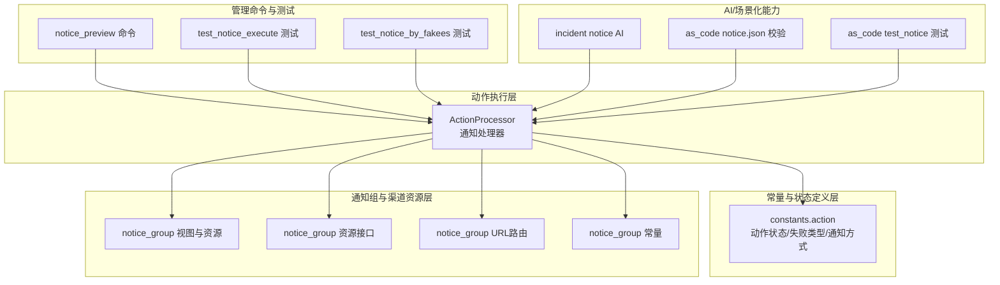
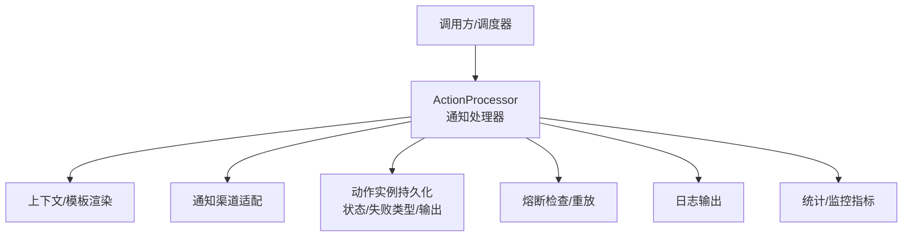
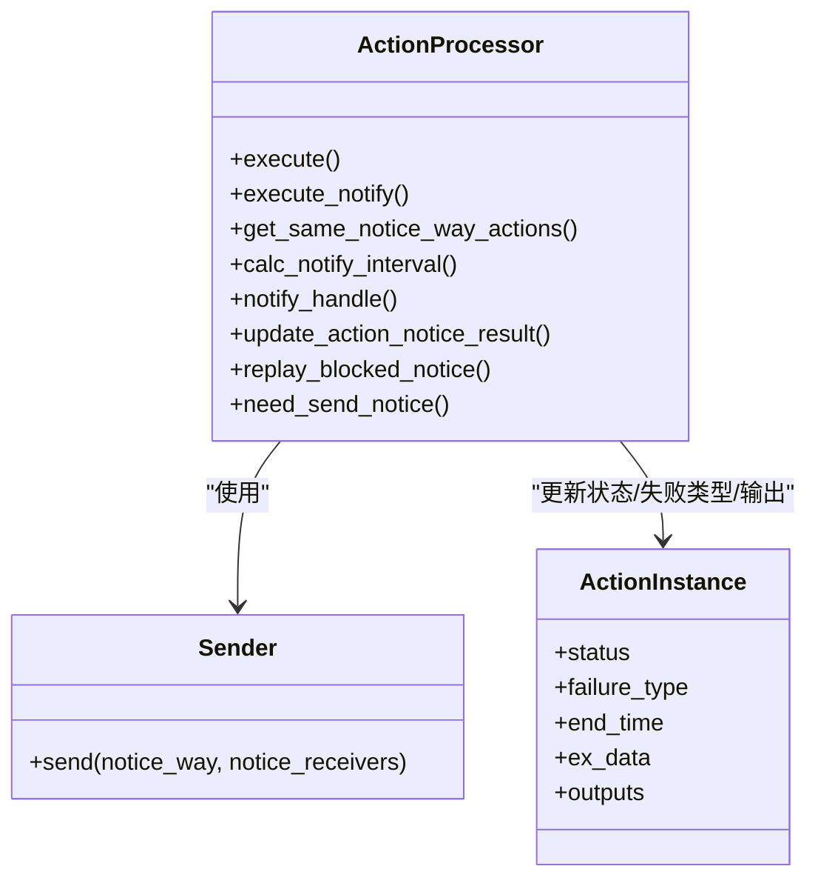
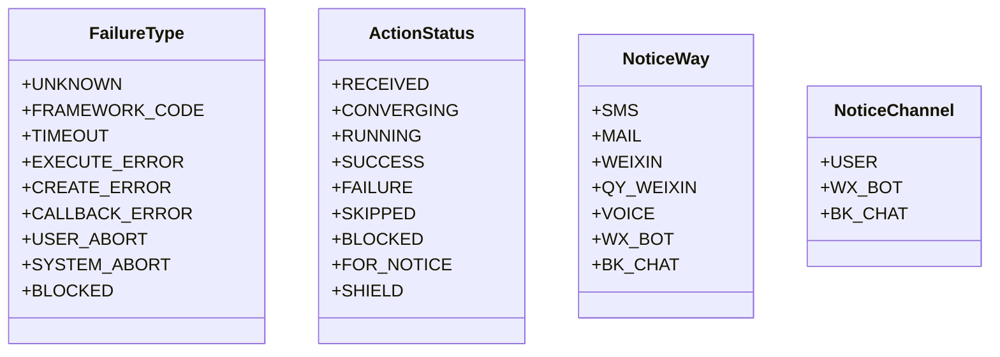
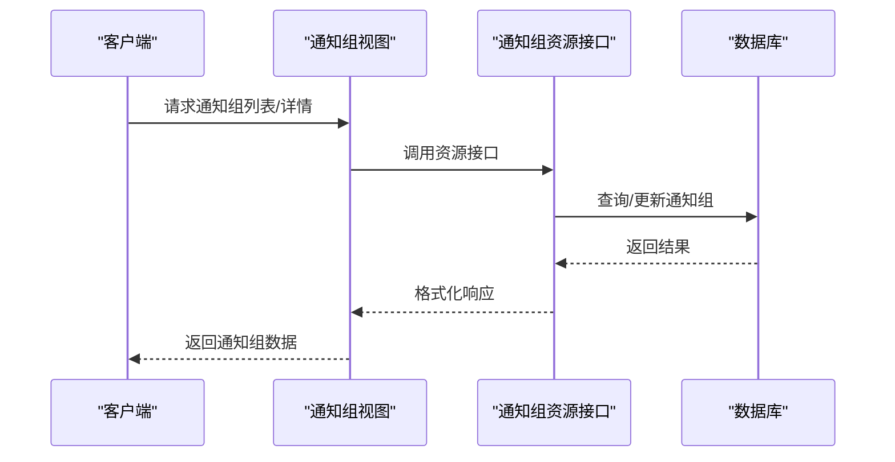
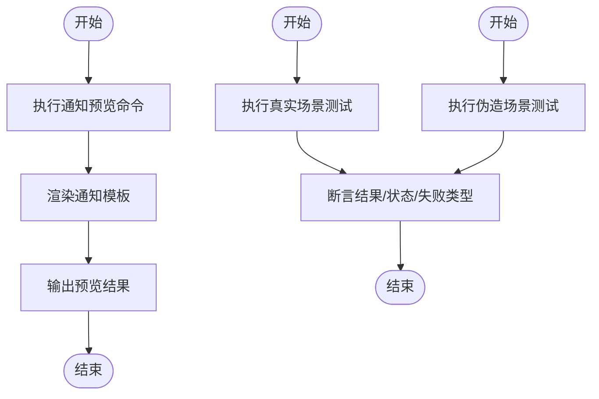
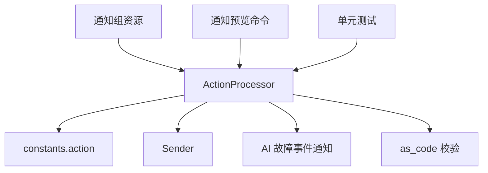

# 通知投递追踪

<cite>
**本文引用的文件**
- [processor.py](file://bkmonitor/alarm_backends/service/fta_action/notice/processor.py)
- [action.py](file://bkmonitor/constants/action.py)
- [notice_group.py](file://bkmonitor/kernel_api/views/v4/notice_group.py)
- [notice_group.py](file://bkmonitor/packages/monitor_web/notice_group/views.py)
- [notice_group.py](file://bkmonitor/packages/monitor_web/notice_group/resources/backend.py)
- [notice_group.py](file://bkmonitor/packages/monitor_web/notice_group/resources/front.py)
- [notice_group.py](file://bkmonitor/packages/monitor_web/notice_group/urls.py)
- [notice_group.py](file://bkmonitor/packages/monitor_web/notice_group/constant.py)
- [notice_group.py](file://bkmonitor/packages/monitor_web/notice_group/__init__.py)
- [notice_group.py](file://bkmonitor/packages/monitor_web/notice_group/resources/__init__.py)
- [notice_group.py](file://bkmonitor/core/errors/notice_group.py)
- [notice_preview.py](file://bkmonitor/alarm_backends/management/commands/notice_preview.py)
- [notice_execute.py](file://bkmonitor/alarm_backends/tests/service/fta_action/test_notice_execute.py)
- [notice_by_fakees.py](file://bkmonitor/alarm_backends/tests/service/fta_action/test_notice_by_fakees.py)
- [notice.py](file://bkmonitor/bkmonitor/aiops/incident/notice.py)
- [notice.json](file://bkmonitor/bkmonitor/as_code/json_schema/notice.json)
- [notice.py](file://bkmonitor/bkmonitor/as_code/tests/test_notice.py)
- [notice_group.py](file://bkmonitor/migrations/0004_noticegroup_webhook_url.py)
- [notice_group.py](file://bkmonitor/migrations/0015_noticegroup_wechat_work_group.py)
</cite>

## 目录
1. [简介](#简介)
2. [项目结构](#项目结构)
3. [核心组件](#核心组件)
4. [架构概览](#架构概览)
5. [详细组件分析](#详细组件分析)
6. [依赖分析](#依赖分析)
7. [性能考量](#性能考量)
8. [故障排查指南](#故障排查指南)
9. [结论](#结论)
10. [附录](#附录)

## 简介
本技术文档围绕通知投递追踪系统，系统性阐述以下主题：
- 投递状态记录机制：如何在动作实例中记录成功、失败、熔断、跳过等状态，以及失败原因的分类与持久化。
- 失败原因分类统计：基于失败类型枚举，统计不同失败类型的分布与趋势。
- 重试策略执行逻辑：熔断后的重放、间隔通知模式（固定/递增）、全局屏蔽时间抖动等。
- 投递日志格式化与状态字段定义：统一的日志输出规范、关键字段含义与来源。
- 异常情况处理流程：熔断拦截、系统终止、用户终止、框架异常等的处理与回退。
- 成功率统计、响应时间监控与渠道质量评估：通过动作实例输出与失败类型进行量化。
- 诊断工具与性能瓶颈识别：命令行预览、单元测试用例、熔断参数回放等。
- 可观察性与可维护性：日志、状态机、模板渲染、渠道适配与可观测指标。

## 项目结构
通知投递追踪涉及多个层次：
- 动作执行层：通知处理器负责汇总、发送、更新状态与失败类型。
- 常量与状态定义层：统一的动作状态、失败类型、通知方式、信号等。
- 通知组与渠道资源层：通知组视图、资源接口、URL路由与常量。
- 管理命令与测试：通知预览命令、单元测试用例。
- AI/场景化能力：AI 故障事件通知与 as_code 配置校验。

**图表来源**
- [processor.py:42-402](file://bkmonitor/alarm_backends/service/fta_action/notice/processor.py#L42-L402)
- [action.py:94-686](file://bkmonitor/constants/action.py#L94-L686)
- [notice_group.py](file://bkmonitor/kernel_api/views/v4/notice_group.py)
- [notice_group.py](file://bkmonitor/packages/monitor_web/notice_group/views.py)
- [notice_group.py](file://bkmonitor/packages/monitor_web/notice_group/resources/backend.py)
- [notice_group.py](file://bkmonitor/packages/monitor_web/notice_group/resources/front.py)
- [notice_group.py](file://bkmonitor/packages/monitor_web/notice_group/urls.py)
- [notice_group.py](file://bkmonitor/packages/monitor_web/notice_group/constant.py)
- [notice_group.py](file://bkmonitor/packages/monitor_web/notice_group/__init__.py)
- [notice_preview.py](file://bkmonitor/alarm_backends/management/commands/notice_preview.py)
- [notice_execute.py](file://bkmonitor/alarm_backends/tests/service/fta_action/test_notice_execute.py)
- [notice_by_fakees.py](file://bkmonitor/alarm_backends/tests/service/fta_action/test_notice_by_fakees.py)
- [notice.py](file://bkmonitor/bkmonitor/aiops/incident/notice.py)
- [notice.json](file://bkmonitor/bkmonitor/as_code/json_schema/notice.json)
- [notice.py](file://bkmonitor/bkmonitor/as_code/tests/test_notice.py)

**章节来源**
- [processor.py:42-402](file://bkmonitor/alarm_backends/service/fta_action/notice/processor.py#L42-L402)
- [action.py:94-686](file://bkmonitor/constants/action.py#L94-L686)

## 核心组件
- 通知处理器 ActionProcessor：负责通知汇总、发送、状态更新与失败类型归档；支持熔断拦截、语音告警收敛、间隔通知模式计算与重放。
- 常量与状态定义：统一的动作状态、失败类型、通知方式、通知渠道、动作信号等，保证跨模块一致性。
- 通知组与渠道资源：提供通知组的前后端资源接口、URL 路由与常量，支撑通知渠道的统一管理。
- 管理命令与测试：通知预览命令用于调试与验证通知模板与上下文；单元测试覆盖真实与伪造场景。
- AI/场景化能力：AI 故障事件通知与 as_code 配置校验，保障通知配置的正确性与一致性。

**章节来源**
- [processor.py:42-402](file://bkmonitor/alarm_backends/service/fta_action/notice/processor.py#L42-L402)
- [action.py:94-686](file://bkmonitor/constants/action.py#L94-L686)

## 架构概览
通知投递追踪系统采用“动作执行 + 统一常量 + 渠道资源 + 管理与测试”的分层架构。动作执行层通过通知处理器协调模板渲染、渠道适配与状态持久化；常量层提供统一语义；渠道资源层提供通知组与渠道的统一入口；管理与测试层提供可观测性与质量保障。

**图表来源**
- [processor.py:133-277](file://bkmonitor/alarm_backends/service/fta_action/notice/processor.py#L133-L277)
- [action.py:94-686](file://bkmonitor/constants/action.py#L94-L686)

## 详细组件分析

### 通知处理器 ActionProcessor
- 职责
  - 汇总同一通知方式的多个动作，避免重复发送。
  - 根据通知方式与渠道选择发送器，渲染标题与内容模板。
  - 执行通知发送，处理熔断拦截与异常，更新动作实例状态与失败类型。
  - 支持语音告警收敛与间隔通知模式（固定/递增）。
  - 提供熔断重放能力，收集并回放熔断参数。
- 关键流程
  - 执行入口：校验可执行状态，进入通知执行。
  - 通知汇总：通过 Redis 键空间聚合接收人与动作 ID，避免重复发送。
  - 渠道适配：根据通知渠道选择发送器，渲染 markdown 或普通模板。
  - 熔断拦截：若处于熔断期，标记 blocked 并记录 retry_params。
  - 结果更新：按成功/失败/熔断三类分别更新动作实例，写入输出与失败类型。
  - 语音告警收敛：基于维度与接收人设置 TTL 键，限制同维度同接收人短时间内的语音告警。
- 失败类型与状态
  - 成功：状态 SUCCESS，结束时间与输出写入。
  - 失败：状态 FAILURE，失败类型与消息写入。
  - 熔断：状态 BLOCKED，失败类型 BLOCKED，记录 retry_params 以便重放。
  - 跳过：父动作或结束状态且无通知内容时，可能标记为 SKIPPED 或 SUCCESS（依据是否为空通知）。

**图表来源**
- [processor.py:133-359](file://bkmonitor/alarm_backends/service/fta_action/notice/processor.py#L133-L359)

**章节来源**
- [processor.py:42-402](file://bkmonitor/alarm_backends/service/fta_action/notice/processor.py#L42-L402)

### 失败类型与状态定义
- 失败类型枚举：包括未知、框架异常、超时、执行错误、创建失败、回调失败、用户终止、系统终止、被熔断等。
- 动作状态：涵盖收到、收敛中、处理中、成功、部分成功、失败、部分失败、跳过、屏蔽、重试中、授权、检查、熔断等。
- 通知方式与渠道：短信、邮件、微信、企业微信、语音、群机器人、蓝鲸信息流等，以及对应的渠道映射。

**图表来源**
- [action.py:94-686](file://bkmonitor/constants/action.py#L94-L686)

**章节来源**
- [action.py:94-686](file://bkmonitor/constants/action.py#L94-L686)

### 通知组与渠道资源
- 视图与资源：提供通知组的前后端资源接口，支持统一的 CRUD 与查询。
- URL 路由：定义通知组相关接口的路由规则。
- 常量：定义通知组相关的常量与默认值。
- 错误处理：针对通知组的特定错误进行封装与抛出。

**图表来源**
- [notice_group.py](file://bkmonitor/packages/monitor_web/notice_group/views.py)
- [notice_group.py](file://bkmonitor/packages/monitor_web/notice_group/resources/backend.py)
- [notice_group.py](file://bkmonitor/packages/monitor_web/notice_group/resources/front.py)
- [notice_group.py](file://bkmonitor/packages/monitor_web/notice_group/urls.py)
- [notice_group.py](file://bkmonitor/packages/monitor_web/notice_group/constant.py)

**章节来源**
- [notice_group.py](file://bkmonitor/kernel_api/views/v4/notice_group.py)
- [notice_group.py](file://bkmonitor/packages/monitor_web/notice_group/views.py)
- [notice_group.py](file://bkmonitor/packages/monitor_web/notice_group/resources/backend.py)
- [notice_group.py](file://bkmonitor/packages/monitor_web/notice_group/resources/front.py)
- [notice_group.py](file://bkmonitor/packages/monitor_web/notice_group/urls.py)
- [notice_group.py](file://bkmonitor/packages/monitor_web/notice_group/constant.py)
- [notice_group.py](file://bkmonitor/packages/monitor_web/notice_group/__init__.py)
- [notice_group.py](file://bkmonitor/core/errors/notice_group.py)

### 管理命令与测试
- 通知预览命令：用于在本地或测试环境预览通知模板渲染效果与上下文变量。
- 单元测试：覆盖真实场景与伪造场景，验证通知发送、熔断拦截、失败类型与状态更新等行为。

**图表来源**
- [notice_preview.py](file://bkmonitor/alarm_backends/management/commands/notice_preview.py)
- [notice_execute.py](file://bkmonitor/alarm_backends/tests/service/fta_action/test_notice_execute.py)
- [notice_by_fakees.py](file://bkmonitor/alarm_backends/tests/service/fta_action/test_notice_by_fakees.py)

**章节来源**
- [notice_preview.py](file://bkmonitor/alarm_backends/management/commands/notice_preview.py)
- [notice_execute.py](file://bkmonitor/alarm_backends/tests/service/fta_action/test_notice_execute.py)
- [notice_by_fakees.py](file://bkmonitor/alarm_backends/tests/service/fta_action/test_notice_by_fakees.py)

### AI/场景化能力
- AI 故障事件通知：结合 AI 场景，自动触发通知，提升故障处置效率。
- as_code 配置校验：通过 JSON Schema 与测试用例，确保通知配置的正确性与一致性。

**章节来源**
- [notice.py](file://bkmonitor/bkmonitor/aiops/incident/notice.py)
- [notice.json](file://bkmonitor/bkmonitor/as_code/json_schema/notice.json)
- [notice.py](file://bkmonitor/bkmonitor/as_code/tests/test_notice.py)

## 依赖分析
- 动作执行层依赖常量层提供的状态、失败类型、通知方式与渠道映射。
- 通知处理器依赖发送器 Sender 与渠道适配器，通过模板路径选择渲染类型。
- 通知组资源层提供统一的接口，便于前端与外部系统对接。
- 管理命令与测试为系统提供可观测性与质量保障。

**图表来源**
- [processor.py:133-359](file://bkmonitor/alarm_backends/service/fta_action/notice/processor.py#L133-L359)
- [action.py:94-686](file://bkmonitor/constants/action.py#L94-L686)
- [notice.py](file://bkmonitor/bkmonitor/aiops/incident/notice.py)
- [notice.json](file://bkmonitor/bkmonitor/as_code/json_schema/notice.json)
- [notice_preview.py](file://bkmonitor/alarm_backends/management/commands/notice_preview.py)
- [notice_execute.py](file://bkmonitor/alarm_backends/tests/service/fta_action/test_notice_execute.py)
- [notice_by_fakees.py](file://bkmonitor/alarm_backends/tests/service/fta_action/test_notice_by_fakees.py)

**章节来源**
- [processor.py:42-402](file://bkmonitor/alarm_backends/service/fta_action/notice/processor.py#L42-L402)
- [action.py:94-686](file://bkmonitor/constants/action.py#L94-L686)

## 性能考量
- 汇总发送与去重：通过 Redis 键空间聚合接收人与动作 ID，减少重复发送，降低渠道压力。
- 间隔通知模式：支持固定与递增两种模式，递增模式随执行次数增加通知间隔，缓解渠道拥塞。
- 全局屏蔽时间抖动：在全局屏蔽启用时，对结束时间进行随机抖动，分散峰值。
- 语音告警收敛：基于维度与接收人设置 TTL 键，限制短时间内的重复语音告警。
- 熔断拦截与重放：当渠道熔断时，记录 retry_params 并延迟重放，避免雪崩效应。
- 日志与指标：统一的日志输出与状态字段，便于性能监控与问题定位。

[本节为通用性能讨论，无需具体文件来源]

## 故障排查指南
- 熔断拦截
  - 现象：通知被熔断，状态为 BLOCKED，记录 retry_params。
  - 排查：检查熔断阈值、渠道负载与重放策略。
  - 处理：调用重放接口，按 retry_params 进行重放。
- 通知配置为空
  - 现象：通知配置缺失，状态为 FAILURE，失败类型为 EXECUTE_ERROR。
  - 排查：核对通知模板、上下文变量与通知方式。
- 语音告警收敛
  - 现象：语音告警被跳过，提示相同通知人在两分钟内同维度只能接收一次。
  - 排查：检查维度哈希与 TTL 键。
- 通知预览
  - 使用通知预览命令，验证模板渲染与上下文变量。
- 单元测试
  - 运行真实与伪造场景测试，验证通知发送、熔断拦截与状态更新。

**章节来源**
- [processor.py:247-271](file://bkmonitor/alarm_backends/service/fta_action/notice/processor.py#L247-L271)
- [processor.py:166-179](file://bkmonitor/alarm_backends/service/fta_action/notice/processor.py#L166-L179)
- [processor.py:388-401](file://bkmonitor/alarm_backends/service/fta_action/notice/processor.py#L388-L401)
- [notice_preview.py](file://bkmonitor/alarm_backends/management/commands/notice_preview.py)
- [notice_execute.py](file://bkmonitor/alarm_backends/tests/service/fta_action/test_notice_execute.py)
- [notice_by_fakees.py](file://bkmonitor/alarm_backends/tests/service/fta_action/test_notice_by_fakees.py)

## 结论
通知投递追踪系统通过统一的状态与失败类型定义、渠道适配与模板渲染、熔断拦截与重放、汇总发送与收敛策略，实现了高可靠、可观察与可维护的通知投递链路。配合管理命令与测试用例，能够快速定位问题并优化性能，满足大规模告警通知场景的需求。

[本节为总结性内容，无需具体文件来源]

## 附录
- 通知组迁移：提供通知组相关迁移脚本，支持 webhook 与企业微信群组的迁移。
- 通知配置校验：通过 as_code 的 JSON Schema 与测试用例，确保配置正确性。

**章节来源**
- [notice_group.py](file://bkmonitor/migrations/0004_noticegroup_webhook_url.py)
- [notice_group.py](file://bkmonitor/migrations/0015_noticegroup_wechat_work_group.py)
- [notice.json](file://bkmonitor/bkmonitor/as_code/json_schema/notice.json)
- [notice.py](file://bkmonitor/bkmonitor/as_code/tests/test_notice.py)