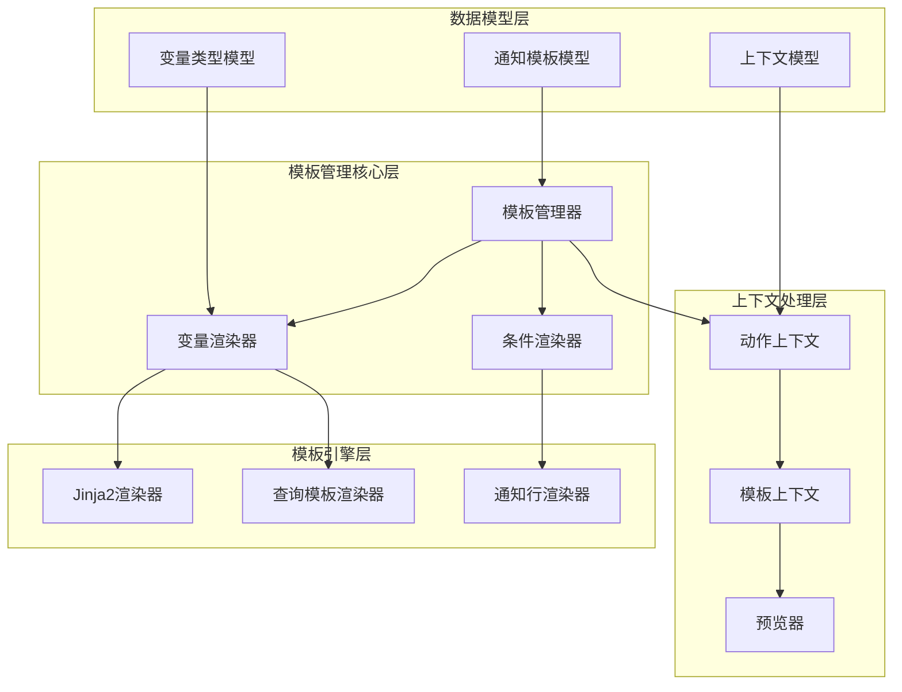
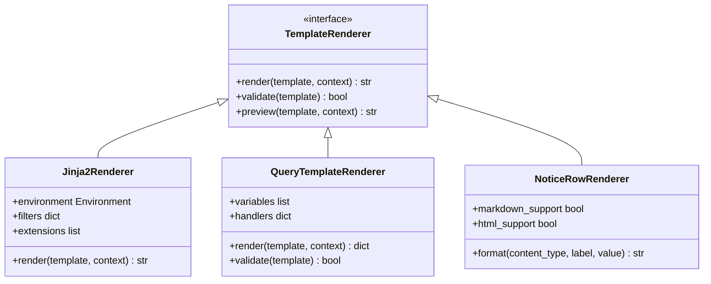
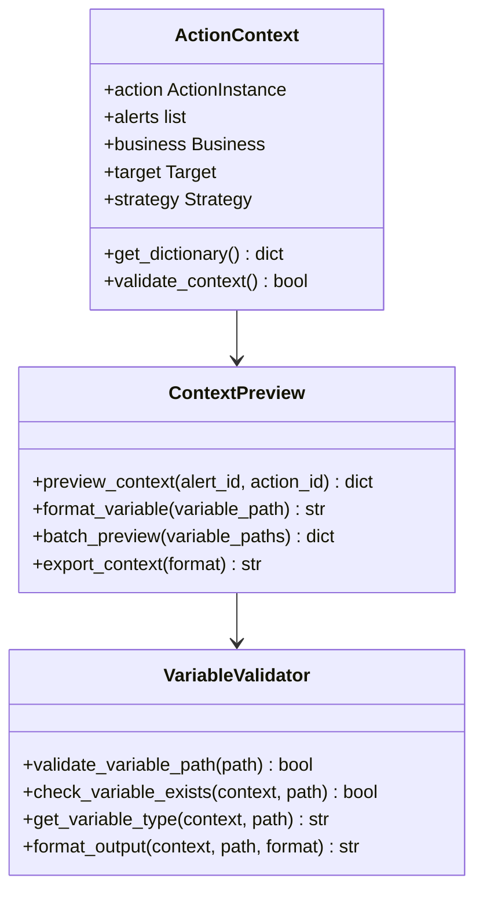
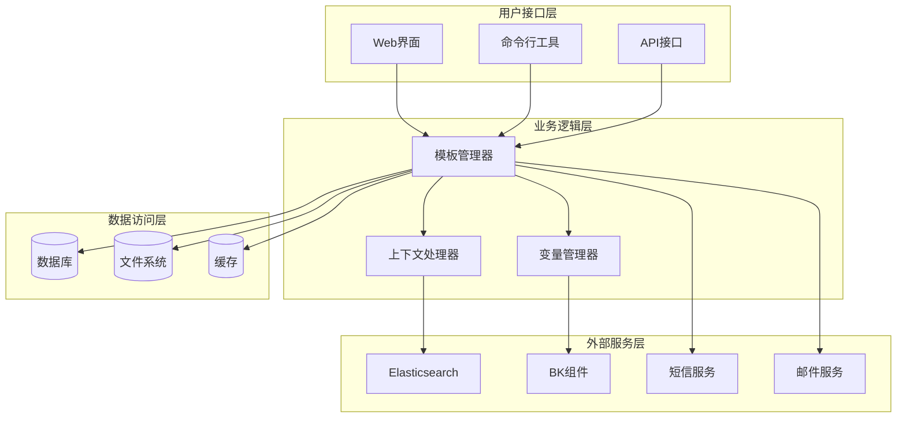
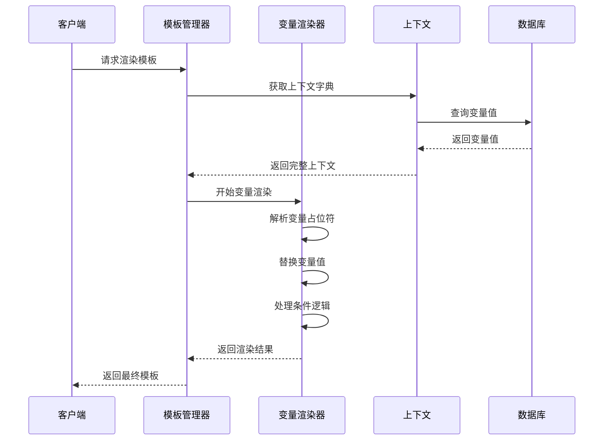
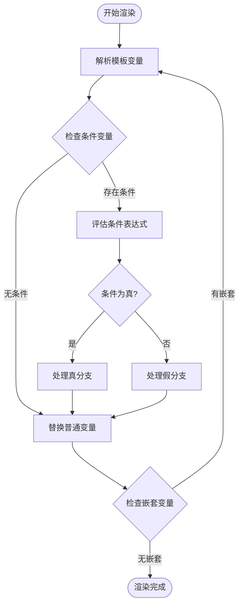
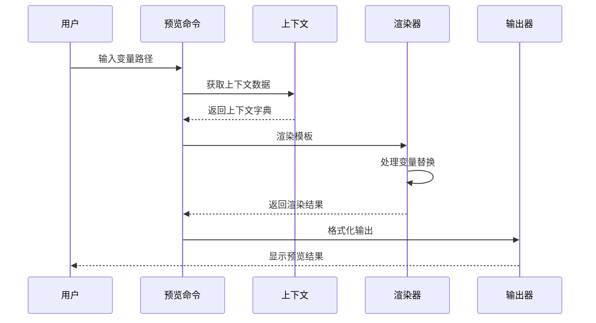
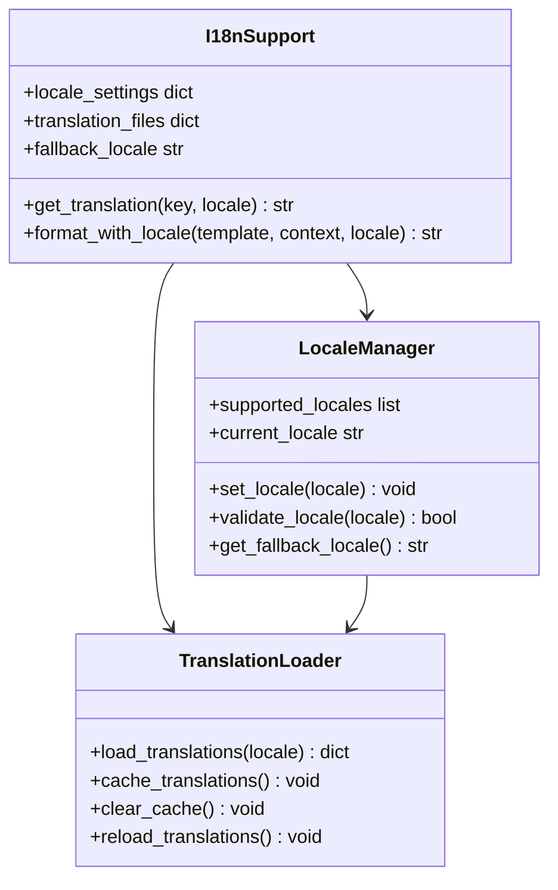
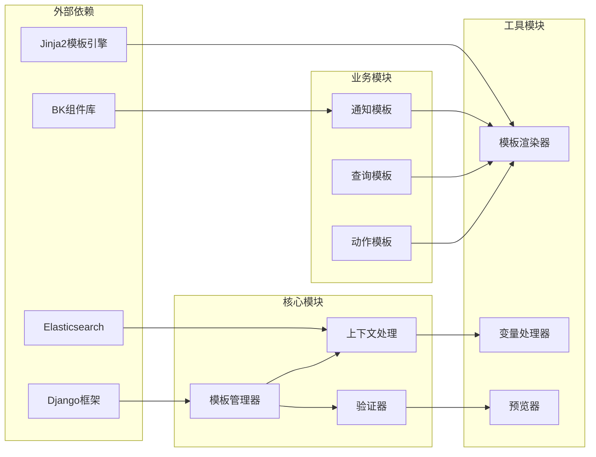

# 通知模板管理系统

<cite>
**本文档引用的文件**
- [action_instance.py](file://bkmonitor/alarm_backends/core/context/action_instance.py)
- [context_preview.py](file://bkmonitor/alarm_backends/management/commands/context_preview.py)
- [local_command_handlers.py](file://bkmonitor/ai_whale/local_command_handlers.py)
- [core.py](file://bkmonitor/bkmonitor/query_template/core.py)
- [template.py](file://bkmonitor/bkmonitor/utils/template.py)
- [notice_template_model.py](file://bkmonitor/bkmonitor/models/base.py)
- [notice_template_admin.py](file://bkmonitor/bkmonitor/admin.py)
</cite>

## 目录
1. [简介](#简介)
2. [项目结构](#项目结构)
3. [核心组件](#核心组件)
4. [架构概览](#架构概览)
5. [详细组件分析](#详细组件分析)
6. [依赖关系分析](#依赖关系分析)
7. [性能考虑](#性能考虑)
8. [故障排除指南](#故障排除指南)
9. [结论](#结论)

## 简介

通知模板管理系统是蓝鲸监控平台的重要组成部分，负责管理和渲染各类通知模板。该系统支持多种模板引擎、复杂的变量替换机制、条件渲染逻辑和动态内容生成。

系统主要功能包括：
- 模板变量定义和替换机制
- 条件渲染逻辑和动态内容生成
- 模板语法和占位符使用
- 国际化支持配置
- 模板预览功能
- 变量验证机制
- 版本管理策略

## 项目结构

通知模板管理系统分布在多个模块中，形成了清晰的分层架构：

**图表来源**
- [action_instance.py:1-342](file://bkmonitor/alarm_backends/core/context/action_instance.py#L1-L342)
- [context_preview.py:1-800](file://bkmonitor/alarm_backends/management/commands/context_preview.py#L1-L800)
- [core.py:1-420](file://bkmonitor/bkmonitor/query_template/core.py#L1-L420)

**章节来源**
- [action_instance.py:1-342](file://bkmonitor/alarm_backends/core/context/action_instance.py#L1-L342)
- [context_preview.py:1-800](file://bkmonitor/alarm_backends/management/commands/context_preview.py#L1-L800)
- [core.py:1-420](file://bkmonitor/bkmonitor/query_template/core.py#L1-L420)

## 核心组件

### 模板渲染引擎

系统采用多引擎混合架构，支持Jinja2和自定义模板渲染：

**图表来源**
- [action_instance.py:211-226](file://bkmonitor/alarm_backends/core/context/action_instance.py#L211-L226)
- [core.py:67-104](file://bkmonitor/bkmonitor/query_template/core.py#L67-L104)

### 上下文管理器

系统实现了完整的上下文管理机制，支持复杂的变量访问和预览功能：

**图表来源**
- [context_preview.py:224-229](file://bkmonitor/alarm_backends/management/commands/context_preview.py#L224-L229)
- [action_instance.py:199-226](file://bkmonitor/alarm_backends/core/context/action_instance.py#L199-L226)

**章节来源**
- [action_instance.py:199-226](file://bkmonitor/alarm_backends/core/context/action_instance.py#L199-L226)
- [context_preview.py:204-254](file://bkmonitor/alarm_backends/management/commands/context_preview.py#L204-L254)

## 架构概览

通知模板管理系统采用分层架构设计，确保了系统的可扩展性和维护性：

**图表来源**
- [action_instance.py:1-342](file://bkmonitor/alarm_backends/core/context/action_instance.py#L1-L342)
- [context_preview.py:1-800](file://bkmonitor/alarm_backends/management/commands/context_preview.py#L1-L800)

## 详细组件分析

### 模板变量渲染系统

系统实现了强大的变量渲染机制，支持多种变量类型和复杂的替换逻辑：

**图表来源**
- [action_instance.py:211-226](file://bkmonitor/alarm_backends/core/context/action_instance.py#L211-L226)
- [core.py:313-318](file://bkmonitor/bkmonitor/query_template/core.py#L313-L318)

#### 变量类型处理

系统支持多种变量类型，每种类型都有专门的处理逻辑：

| 变量类型 | 占位符格式 | 处理逻辑 | 默认值 |
|---------|-----------|----------|--------|
| 常量变量 | `${CONSTANT}` | 直接替换 | 配置的默认值 |
| 分组变量 | `${GROUP_BY}` | 添加到group_by | 空数组 |
| 标签变量 | `${TAG_VALUES}` | 替换标签值 | 空数组 |
| 条件变量 | `${CONDITIONS}` | 替换为条件列表 | 空数组 |
| 函数变量 | `${FUNCTIONS}` | 替换函数列表 | 空数组 |
| 方法变量 | `${METHOD}` | 替换聚合方法 | 无默认值 |

**章节来源**
- [core.py:112-255](file://bkmonitor/bkmonitor/query_template/core.py#L112-L255)

### 条件渲染逻辑

系统实现了灵活的条件渲染机制，支持复杂的条件判断和分支逻辑：

**图表来源**
- [core.py:185-207](file://bkmonitor/bkmonitor/query_template/core.py#L185-L207)

### 模板预览功能

系统提供了强大的模板预览功能，支持实时预览和批量查询：

**图表来源**
- [context_preview.py:232-241](file://bkmonitor/alarm_backends/management/commands/context_preview.py#L232-L241)

**章节来源**
- [context_preview.py:167-254](file://bkmonitor/alarm_backends/management/commands/context_preview.py#L167-L254)

### 国际化支持

系统实现了完整的国际化支持，包括模板翻译和本地化渲染：

**图表来源**
- [action_instance.py:18-20](file://bkmonitor/alarm_backends/core/context/action_instance.py#L18-L20)

## 依赖关系分析

通知模板管理系统具有清晰的依赖关系，遵循了依赖倒置原则：

**图表来源**
- [action_instance.py:17-25](file://bkmonitor/alarm_backends/core/context/action_instance.py#L17-L25)
- [core.py:17-20](file://bkmonitor/bkmonitor/query_template/core.py#L17-L20)

**章节来源**
- [action_instance.py:17-25](file://bkmonitor/alarm_backends/core/context/action_instance.py#L17-L25)
- [core.py:17-20](file://bkmonitor/bkmonitor/query_template/core.py#L17-L20)

## 性能考虑

系统在设计时充分考虑了性能优化，采用了多种优化策略：

### 缓存策略
- **模板缓存**: 缓存已编译的模板，避免重复编译
- **上下文缓存**: 缓存上下文数据，减少数据库查询
- **渲染结果缓存**: 缓存常用渲染结果

### 渲染优化
- **延迟渲染**: 按需渲染，避免不必要的计算
- **批量处理**: 支持批量变量处理，提高效率
- **内存优化**: 控制变量深度，防止内存溢出

### 并发处理
- **异步渲染**: 支持异步模板渲染
- **线程安全**: 确保多线程环境下的安全性
- **资源池**: 管理模板引擎资源

## 故障排除指南

### 常见问题及解决方案

#### 模板变量未找到
**问题**: 模板中的变量无法解析
**解决方案**:
1. 使用预览功能检查变量是否存在
2. 验证变量路径的正确性
3. 检查上下文数据的完整性

#### 渲染错误
**问题**: 模板渲染过程中出现异常
**解决方案**:
1. 检查模板语法的正确性
2. 验证变量类型的匹配性
3. 查看错误日志获取详细信息

#### 性能问题
**问题**: 模板渲染速度慢
**解决方案**:
1. 启用模板缓存
2. 优化变量访问路径
3. 减少嵌套层级

**章节来源**
- [context_preview.py:251-254](file://bkmonitor/alarm_backends/management/commands/context_preview.py#L251-L254)

## 结论

通知模板管理系统是一个功能完善、架构清晰的模板管理解决方案。系统通过多引擎混合架构、完善的上下文管理、灵活的变量渲染机制和强大的预览功能，为用户提供了一个高效、可靠的模板管理平台。

系统的主要优势包括：
- **灵活性**: 支持多种模板引擎和变量类型
- **可扩展性**: 模块化设计，易于扩展新功能
- **易用性**: 提供丰富的预览和调试工具
- **性能**: 优化的渲染机制和缓存策略
- **可靠性**: 完善的错误处理和故障恢复机制

通过持续的优化和改进，该系统能够满足蓝鲸监控平台的各种通知需求，为用户提供稳定可靠的服务。