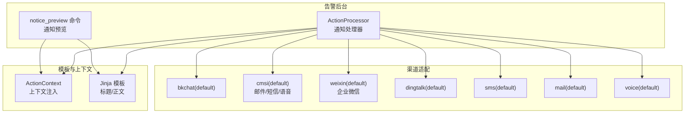
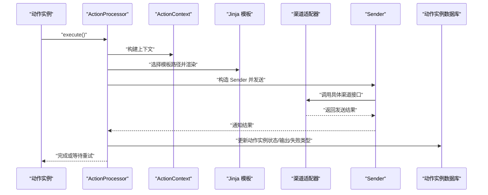
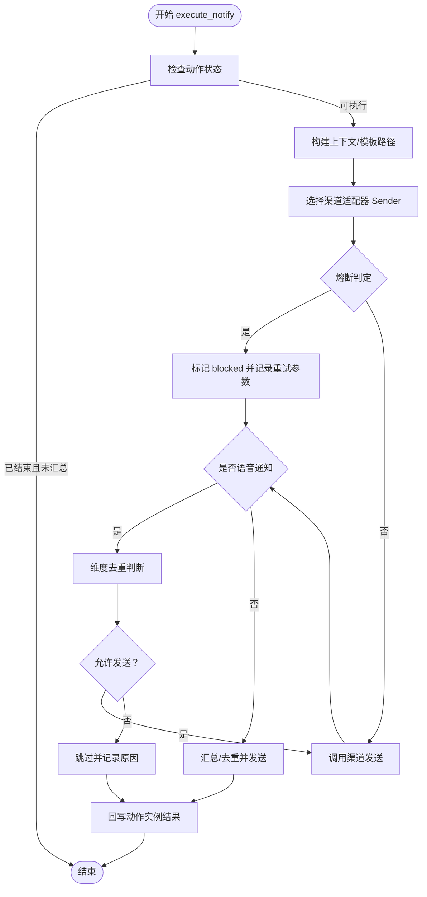
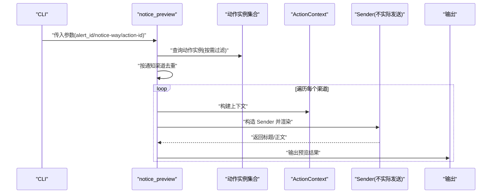
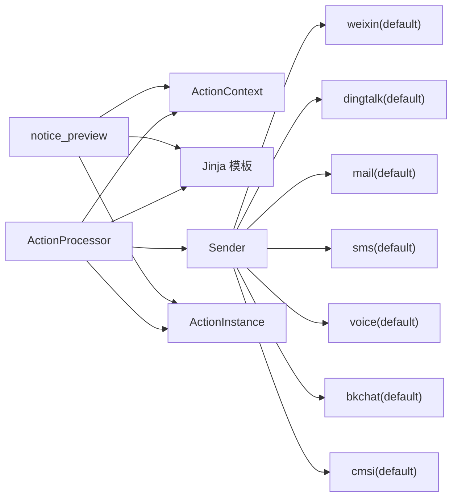

# 通知渠道管理

<cite>
**本文引用的文件**
- [processor.py](file://bkmonitor/alarm_backends/service/fta_action/notice/processor.py)
- [notice_preview.py](file://bkmonitor/alarm_backends/management/commands/notice_preview.py)
- [constants.py](file://bkmonitor/alarm_backends/constants.py)
- [default.py](file://bkmonitor/api/bkchat/default.py)
- [default.py](file://bkmonitor/api/cmsi/default.py)
- [default.py](file://bkmonitor/api/cmdb/default.py)
- [default.py](file://bkmonitor/api/bk_login/default.py)
- [default.py](file://bkmonitor/api/bk_paas/default.py)
- [default.py](file://bkmonitor/api/bk_incident/default.py)
- [default.py](file://bkmonitor/api/bk_apigateway/default.py)
- [default.py](file://bkmonitor/api/bk_plugin/default.py)
- [default.py](file://bkmonitor/api/bkdata/default.py)
- [default.py](file://bkmonitor/api/devops/default.py)
- [default.py](file://bkmonitor/api/gse/default.py)
- [default.py](file://bkmonitor/api/iam/default.py)
- [default.py](file://bkmonitor/api/itsm/default.py)
- [default.py](file://bkmonitor/api/job/default.py)
- [default.py](file://bkmonitor/api/kubernetes/default.py)
- [default.py](file://bkmonitor/api/log_search/default.py)
- [default.py](file://bkmonitor/api/metadata/default.py)
- [default.py](file://bkmonitor/api/monitor/default.py)
- [default.py](file://bkmonitor/api/node_man/default.py)
- [default.py](file://bkmonitor/api/sops/default.py)
- [default.py](file://bkmonitor/api/unify_query/default.py)
- [default.py](file://bkmonitor/api/bk_collector/default.py)
- [default.py](file://bkmonitor/api/bk_tencent/default.py)
- [default.py](file://bkmonitor/api/bk_weixin/default.py)
- [default.py](file://bkmonitor/api/bk_dingtalk/default.py)
- [default.py](file://bkmonitor/api/bk_sms/default.py)
- [default.py](file://bkmonitor/api/bk_mail/default.py)
- [default.py](file://bkmonitor/api/bk_voice/default.py)
- [default.py](file://bkmonitor/api/bk_weixin/default.py)
- [default.py](file://bkmonitor/api/bk_dingtalk/default.py)
- [default.py](file://bkmonitor/api/bk_sms/default.py)
- [default.py](file://bkmonitor/api/bk_mail/default.py)
- [default.py](file://bkmonitor/api/bk_voice/default.py)
</cite>

## 目录
1. [简介](#简介)
2. [项目结构](#项目结构)
3. [核心组件](#核心组件)
4. [架构总览](#架构总览)
5. [详细组件分析](#详细组件分析)
6. [依赖分析](#依赖分析)
7. [性能考量](#性能考量)
8. [故障排查指南](#故障排查指南)
9. [结论](#结论)
10. [附录](#附录)

## 简介
本技术文档围绕“通知渠道管理系统”展开，聚焦于通知渠道的集成方式、消息格式标准化、发送队列与去重机制、失败重试策略以及模板定制化能力。文档以告警后台通知处理为核心，结合命令行预览工具、渠道适配器与发送器、模板渲染与上下文注入等关键模块，给出可操作的配置方法、调用流程与最佳实践，帮助保障通知系统的稳定性与可靠性。

## 项目结构
通知系统主要由以下层次构成：
- 告警后台通知处理层：负责动作实例的执行、通知汇总、熔断与重试、结果回写。
- 通知预览命令：提供通知模板渲染预览能力，便于验证标题与正文。
- 渠道适配层：通过蓝鲸网关/插件/第三方接口封装各通知渠道（企业微信、钉钉、邮件、短信、语音等）。
- 模板与上下文：基于 Jinja 模板与 ActionContext 注入变量，统一消息格式。
- 缓存与锁：使用 Redis 键空间与分布式锁实现通知汇总、语音告警去重与并发保护。

图表来源
- [processor.py:133-278](file://bkmonitor/alarm_backends/service/fta_action/notice/processor.py#L133-L278)
- [notice_preview.py:306-370](file://bkmonitor/alarm_backends/management/commands/notice_preview.py#L306-L370)

章节来源
- [processor.py:133-278](file://bkmonitor/alarm_backends/service/fta_action/notice/processor.py#L133-L278)
- [notice_preview.py:25-118](file://bkmonitor/alarm_backends/management/commands/notice_preview.py#L25-L118)

## 核心组件
- 通知处理器 ActionProcessor：负责通知执行、汇总、熔断、去重、间隔/递增通知周期计算、结果回写与重试参数收集。
- 通知预览命令 notice_preview：按通知渠道去重，渲染模板，输出标题与正文，辅助模板调试与上线校验。
- 渠道适配器：通过蓝鲸 API 包装器对接企业微信、钉钉、邮件、短信、语音等渠道。
- 模板与上下文：根据动作信号与通知方式选择模板路径，注入上下文变量，支持 Markdown 类型通道的消息体。
- 缓存与锁：使用键空间与分布式锁实现通知汇总与语音告警去重。

章节来源
- [processor.py:42-131](file://bkmonitor/alarm_backends/service/fta_action/notice/processor.py#L42-L131)
- [notice_preview.py:219-287](file://bkmonitor/alarm_backends/management/commands/notice_preview.py#L219-L287)

## 架构总览
通知处理的关键流程如下：
- 解析动作实例上下文，确定通知方式与接收人。
- 根据通知方式选择模板路径（标题/正文），并注入上下文变量。
- 通过渠道适配器发送消息；若触发熔断，记录重试参数。
- 对非语音通知进行汇总与去重，对语音通知进行维度级去重。
- 将发送结果回写到动作实例，并按结果分类更新状态与输出。

图表来源
- [processor.py:133-278](file://bkmonitor/alarm_backends/service/fta_action/notice/processor.py#L133-L278)

章节来源
- [processor.py:133-278](file://bkmonitor/alarm_backends/service/fta_action/notice/processor.py#L133-L278)

## 详细组件分析

### 通知处理器 ActionProcessor
职责与特性：
- 通知汇总与去重：针对非语音通知，通过 Redis 键空间聚合同一通知方式下的多个动作实例，仅发送一次，避免重复。
- 语音告警去重：按信号、业务/租户、级别、维度哈希与策略 ID 维度进行去重，限制同一维度内短时间内重复电话告警。
- 通知周期控制：支持固定间隔与递增间隔两种模式，按执行次数计算下一次发送时间。
- 熔断与阻断：当达到熔断阈值时，Sender 标记 blocked，记录重试参数以便后续重放。
- 结果回写：区分成功、失败、被熔断三类，批量更新动作实例状态与输出字段。

图表来源
- [processor.py:197-278](file://bkmonitor/alarm_backends/service/fta_action/notice/processor.py#L197-L278)
- [processor.py:361-401](file://bkmonitor/alarm_backends/service/fta_action/notice/processor.py#L361-L401)

章节来源
- [processor.py:42-131](file://bkmonitor/alarm_backends/service/fta_action/notice/processor.py#L42-L131)
- [processor.py:186-196](file://bkmonitor/alarm_backends/service/fta_action/notice/processor.py#L186-L196)
- [processor.py:235-278](file://bkmonitor/alarm_backends/service/fta_action/notice/processor.py#L235-L278)
- [processor.py:355-359](file://bkmonitor/alarm_backends/service/fta_action/notice/processor.py#L355-L359)
- [processor.py:361-401](file://bkmonitor/alarm_backends/service/fta_action/notice/processor.py#L361-L401)

### 通知预览命令 notice_preview
功能与流程：
- 自动或手动指定动作实例，按通知渠道去重，逐个渲染模板并输出标题与正文。
- 支持指定通知方式与动作实例 ID，便于快速定位问题与验证模板。
- 输出包含动作实例 ID、告警信号、通知方式、消息类型与最终渲染结果。

图表来源
- [notice_preview.py:61-118](file://bkmonitor/alarm_backends/management/commands/notice_preview.py#L61-L118)
- [notice_preview.py:306-370](file://bkmonitor/alarm_backends/management/commands/notice_preview.py#L306-L370)

章节来源
- [notice_preview.py:25-118](file://bkmonitor/alarm_backends/management/commands/notice_preview.py#L25-L118)
- [notice_preview.py:219-287](file://bkmonitor/alarm_backends/management/commands/notice_preview.py#L219-L287)
- [notice_preview.py:306-370](file://bkmonitor/alarm_backends/management/commands/notice_preview.py#L306-L370)

### 渠道适配与集成
通知渠道通过蓝鲸 API 包装器进行统一接入，常见渠道包括：
- 企业微信：weixin(default)
- 钉钉：dingtalk(default)
- 邮件：mail(default)
- 短信：sms(default)
- 语音：voice(default)
- 蓝鲸聊天：bkchat(default)
- 统一发送接口：cmsi(default)，用于邮件、短信、语音等

这些适配器通常提供统一的 send 接口，内部封装认证、限流、重试与错误码映射，保证上层调用的一致性。

章节来源
- [default.py](file://bkmonitor/api/bk_weixin/default.py)
- [default.py](file://bkmonitor/api/bk_dingtalk/default.py)
- [default.py](file://bkmonitor/api/bk_mail/default.py)
- [default.py](file://bkmonitor/api/bk_sms/default.py)
- [default.py](file://bkmonitor/api/bk_voice/default.py)
- [default.py](file://bkmonitor/api/bkchat/default.py)
- [default.py](file://bkmonitor/api/cmsi/default.py)

### 消息格式标准化与模板定制
- 模板路径规则：根据动作信号与通知方式选择标题与正文模板路径，Markdown 类型通道采用 markdown 消息体。
- 上下文注入：ActionContext 提供丰富的变量（如告警详情、维度、策略信息等），模板中可直接引用。
- 用户自定义内容：可在执行配置中注入 user_content，作为模板变量参与渲染。
- 预览能力：通过 notice_preview 命令输出最终标题与正文，便于上线前校验。

章节来源
- [processor.py:224-225](file://bkmonitor/alarm_backends/service/fta_action/notice/processor.py#L224-L225)
- [processor.py](file://bkmonitor/alarm_backends/service/fta_action/notice/processor.py#L222)
- [notice_preview.py:322-339](file://bkmonitor/alarm_backends/management/commands/notice_preview.py#L322-L339)
- [notice_preview.py:340-351](file://bkmonitor/alarm_backends/management/commands/notice_preview.py#L340-L351)

### 发送队列与去重机制
- 通知汇总：非语音通知通过 Redis 键空间聚合多个动作实例，仅发送一次，减少重复与抖动。
- 语音告警去重：按信号、业务/租户、级别、维度哈希与策略 ID 维度进行去重，限制同一维度内短时间内重复电话告警。
- 并发保护：使用分布式锁保护汇总过程，避免竞态条件导致重复发送。
- 结果回写：根据发送结果分类更新动作实例状态与输出，确保可观测性与可追踪性。

章节来源
- [processor.py:80-131](file://bkmonitor/alarm_backends/service/fta_action/notice/processor.py#L80-L131)
- [processor.py:388-401](file://bkmonitor/alarm_backends/service/fta_action/notice/processor.py#L388-L401)

### 失败重试策略
- 执行期异常：捕获异常并标记失败，记录重试函数名以便后续重试。
- 熔断阻断：当触发熔断时，记录重试参数，待熔断恢复后重放。
- 重放接口：提供 replay_blocked_notice 能力，用于恢复被阻断的通知。
- 间隔/递增通知：支持固定间隔与递增间隔两种模式，避免频繁打扰。

章节来源
- [processor.py:171-183](file://bkmonitor/alarm_backends/service/fta_action/notice/processor.py#L171-L183)
- [processor.py:247-261](file://bkmonitor/alarm_backends/service/fta_action/notice/processor.py#L247-L261)
- [processor.py:355-359](file://bkmonitor/alarm_backends/service/fta_action/notice/processor.py#L355-L359)
- [processor.py:186-196](file://bkmonitor/alarm_backends/service/fta_action/notice/processor.py#L186-L196)

## 依赖分析
通知系统的关键依赖关系如下：
- ActionProcessor 依赖 ActionContext、Jinja 模板、渠道适配器 Sender 与数据库模型 ActionInstance。
- notice_preview 命令依赖 ActionContext、Jinja 模板与动作实例文档/模型。
- 渠道适配器通过蓝鲸 API 包统一对外暴露发送接口。
- 缓存与锁依赖 Redis 客户端与分布式锁实现。

图表来源
- [processor.py:228-234](file://bkmonitor/alarm_backends/service/fta_action/notice/processor.py#L228-L234)
- [notice_preview.py:340-351](file://bkmonitor/alarm_backends/management/commands/notice_preview.py#L340-L351)

章节来源
- [processor.py:228-234](file://bkmonitor/alarm_backends/service/fta_action/notice/processor.py#L228-L234)
- [notice_preview.py:340-351](file://bkmonitor/alarm_backends/management/commands/notice_preview.py#L340-L351)

## 性能考量
- 模板渲染：尽量复用上下文变量，避免在模板中进行复杂计算；必要时在上下文阶段预处理。
- 缓存命中：合理设置键 TTL 与键命名，避免键空间膨胀；定期清理过期键。
- 并发控制：使用分布式锁保护关键路径，降低竞争带来的重复发送风险。
- 渠道限流：遵循渠道限流策略，必要时引入退避与队列限速。
- 日志与监控：对发送失败、熔断与重试进行可观测性埋点，便于定位瓶颈。

## 故障排查指南
- 预览验证：使用 notice_preview 命令输出标题与正文，确认模板渲染正确。
- 渠道配置：核对通知方式与渠道适配器是否匹配，确认认证参数与权限。
- 去重问题：检查 Redis 键空间与 TTL 设置，确认语音告警维度去重是否生效。
- 熔断恢复：关注熔断日志与重试参数，确认熔断阈值与恢复策略。
- 结果回写：检查动作实例状态更新与输出字段，确认失败类型与消息内容。

章节来源
- [notice_preview.py:61-118](file://bkmonitor/alarm_backends/management/commands/notice_preview.py#L61-L118)
- [processor.py:247-261](file://bkmonitor/alarm_backends/service/fta_action/notice/processor.py#L247-L261)
- [processor.py:334-353](file://bkmonitor/alarm_backends/service/fta_action/notice/processor.py#L334-L353)

## 结论
通知渠道管理系统通过统一的处理器、模板与上下文机制，实现了多渠道、可扩展、可观测的通知能力。借助汇总与去重、熔断与重试、预览与回写等机制，系统在稳定性与可靠性方面具备良好保障。建议在生产环境中持续优化模板与上下文、完善监控与告警，并定期演练熔断与重放流程，以提升整体韧性。

## 附录

### 通知渠道配置与调用流程（示例）
- 企业微信
  - 渠道适配器：weixin(default)
  - 模板路径：notice/{signal}/action/weixin_{title/content}.jinja
  - 调用：ActionProcessor 选择 Sender 并调用渠道发送
- 钉钉
  - 渠道适配器：dingtalk(default)
  - 模板路径：notice/{signal}/action/dingtalk_{title/content}.jinja
  - 调用：ActionProcessor 选择 Sender 并调用渠道发送
- 邮件
  - 渠道适配器：mail(default) 或 cmsi(default)
  - 模板路径：notice/{signal}/action/mail_{title/content}.jinja
  - 调用：ActionProcessor 选择 Sender 并调用渠道发送
- 短信
  - 渠道适配器：sms(default) 或 cmsi(default)
  - 模板路径：notice/{signal}/action/sms_{title/content}.jinja
  - 调用：ActionProcessor 选择 Sender 并调用渠道发送
- 语音
  - 渠道适配器：voice(default) 或 cmsi(default)
  - 模板路径：notice/{signal}/action/voice_{title/content}.jinja
  - 去重：按维度与策略 ID 去重，限制短时间重复
- 蓝鲸聊天
  - 渠道适配器：bkchat(default)
  - 模板路径：notice/{signal}/action/bkchat_{title/content}.jinja
  - 调用：ActionProcessor 选择 Sender 并调用渠道发送

章节来源
- [processor.py:224-225](file://bkmonitor/alarm_backends/service/fta_action/notice/processor.py#L224-L225)
- [processor.py:228-234](file://bkmonitor/alarm_backends/service/fta_action/notice/processor.py#L228-L234)
- [default.py](file://bkmonitor/api/bk_weixin/default.py)
- [default.py](file://bkmonitor/api/bk_dingtalk/default.py)
- [default.py](file://bkmonitor/api/bk_mail/default.py)
- [default.py](file://bkmonitor/api/bk_sms/default.py)
- [default.py](file://bkmonitor/api/bk_voice/default.py)
- [default.py](file://bkmonitor/api/bkchat/default.py)
- [default.py](file://bkmonitor/api/cmsi/default.py)