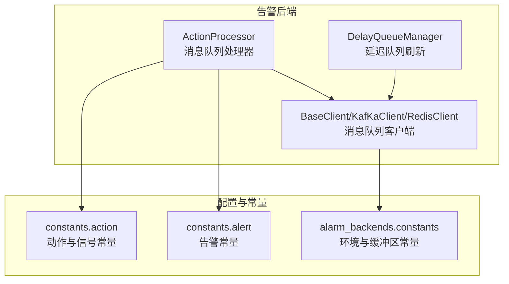
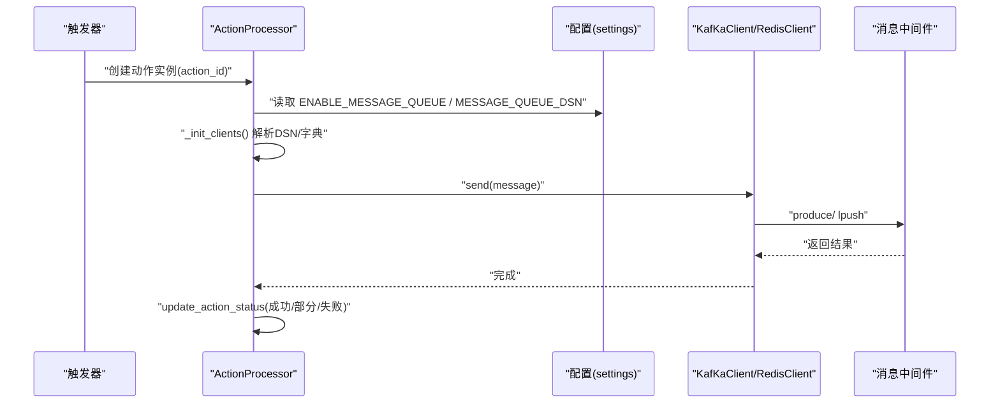
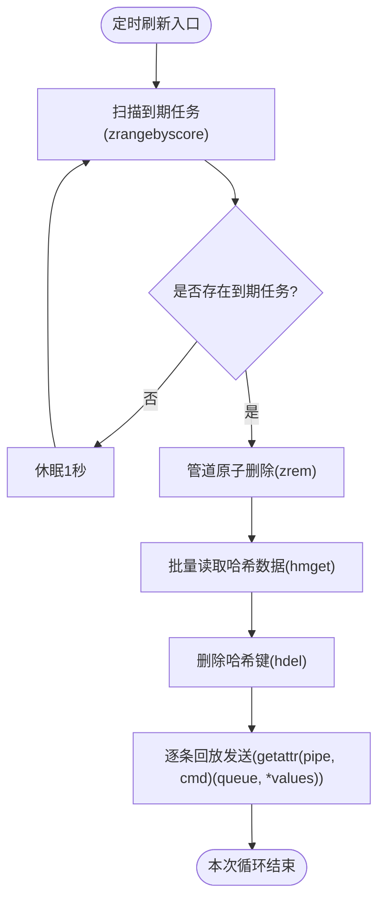
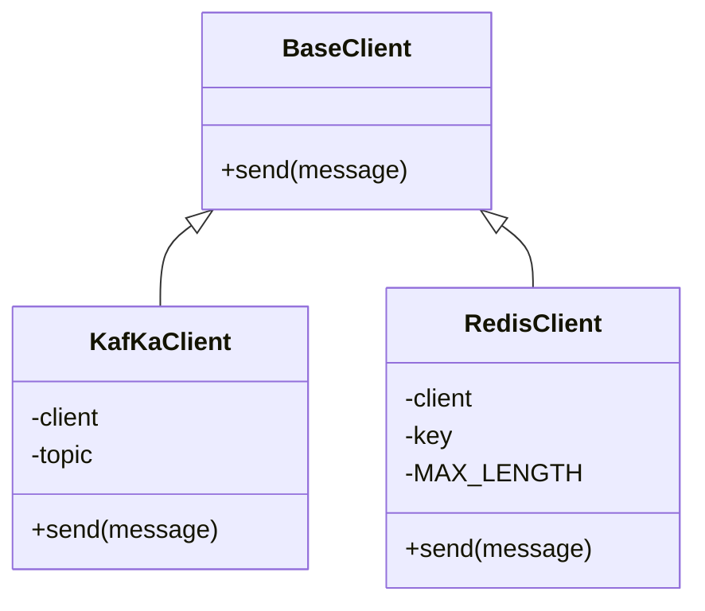
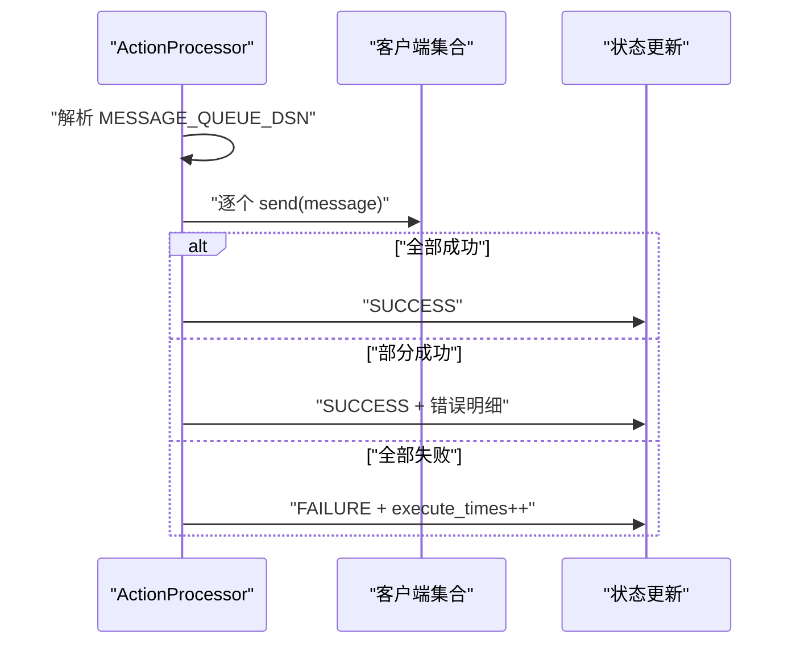
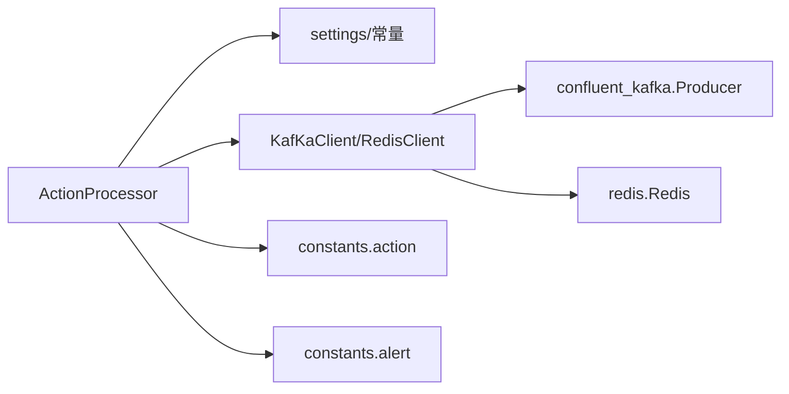

# 通知队列管理

<cite>
**本文引用的文件**
- [delay_queue.py](file://bkmonitor/alarm_backends/core/cache/delay_queue.py)
- [client.py](file://bkmonitor/alarm_backends/service/fta_action/message_queue/client.py)
- [processor.py](file://bkmonitor/alarm_backends/service/fta_action/message_queue/processor.py)
- [action.py](file://bkmonitor/constants/action.py)
- [alert.py](file://bkmonitor/constants/alert.py)
- [constants.py](file://bkmonitor/alarm_backends/constants.py)
</cite>

## 目录
1. [简介](#简介)
2. [项目结构](#项目结构)
3. [核心组件](#核心组件)
4. [架构总览](#架构总览)
5. [详细组件分析](#详细组件分析)
6. [依赖分析](#依赖分析)
7. [性能考虑](#性能考虑)
8. [故障排查指南](#故障排查指南)
9. [结论](#结论)
10. [附录](#附录)

## 简介
本技术文档围绕通知队列管理系统展开，聚焦以下主题：
- 消息队列架构设计与实现要点
- 优先级调度与批量发送机制
- Redis 队列、RabbitMQ、Kafka 的配置与使用
- 消息去重策略、失败重试与死信队列处理
- 队列监控指标、性能调优参数与容量规划
- 高并发处理能力与稳定性保障

该系统通过统一的消息队列客户端抽象，支持多种后端（Kafka、Redis），并结合延迟队列与收敛策略，实现稳定高效的告警通知投递。

## 项目结构
通知队列相关代码主要分布在 alarm_backends 子模块中，核心文件包括：
- 延迟队列管理器：负责将到期的任务从延迟集合转移到实际队列
- 消息队列客户端：封装 Kafka 与 Redis 的发送接口
- 消息队列处理器：根据策略配置选择目标队列并执行发送

**图表来源**
- [delay_queue.py:22-79](file://bkmonitor/alarm_backends/core/cache/delay_queue.py#L22-L79)
- [client.py:22-133](file://bkmonitor/alarm_backends/service/fta_action/message_queue/client.py#L22-L133)
- [processor.py:28-128](file://bkmonitor/alarm_backends/service/fta_action/message_queue/processor.py#L28-L128)
- [action.py:740-795](file://bkmonitor/constants/action.py#L740-L795)
- [alert.py:74-88](file://bkmonitor/constants/alert.py#L74-L88)
- [constants.py:79-81](file://bkmonitor/alarm_backends/constants.py#L79-L81)

**章节来源**
- [delay_queue.py:1-79](file://bkmonitor/alarm_backends/core/cache/delay_queue.py#L1-L79)
- [client.py:1-133](file://bkmonitor/alarm_backends/service/fta_action/message_queue/client.py#L1-L133)
- [processor.py:1-128](file://bkmonitor/alarm_backends/service/fta_action/message_queue/processor.py#L1-L128)
- [action.py:740-795](file://bkmonitor/constants/action.py#L740-L795)
- [alert.py:74-88](file://bkmonitor/constants/alert.py#L74-L88)
- [constants.py:79-81](file://bkmonitor/alarm_backends/constants.py#L79-L81)

## 核心组件
- DelayQueueManager：基于 Redis 的有序集合实现延迟队列，定时扫描到期任务并原子性转移至目标队列，保证并发安全与幂等。
- ActionProcessor：根据策略配置初始化多客户端，按顺序尝试发送，记录最终执行状态与统计信息。
- 客户端适配层：KafKaClient 与 RedisClient 提供统一 send 接口，支持 DSN 与结构化配置两种输入形式。
- 常量与信号映射：定义消息队列信号类型、动作信号与消息队列操作类型之间的映射关系，用于统一处理不同信号下的推送行为。

**章节来源**
- [delay_queue.py:22-79](file://bkmonitor/alarm_backends/core/cache/delay_queue.py#L22-L79)
- [client.py:22-133](file://bkmonitor/alarm_backends/service/fta_action/message_queue/client.py#L22-L133)
- [processor.py:28-128](file://bkmonitor/alarm_backends/service/fta_action/message_queue/processor.py#L28-L128)
- [action.py:740-795](file://bkmonitor/constants/action.py#L740-L795)

## 架构总览
通知队列的整体流程如下：
- 触发条件满足后，ActionProcessor 依据策略配置选择目标队列（支持全局与业务特定队列）
- 将告警消息序列化后通过对应客户端发送
- 对于延迟推送场景，消息先写入延迟队列，由 DelayQueueManager 定时刷新到目标队列
- 成功/部分成功/失败均更新动作状态，便于后续重试与审计

**图表来源**
- [processor.py:33-128](file://bkmonitor/alarm_backends/service/fta_action/message_queue/processor.py#L33-L128)
- [client.py:27-133](file://bkmonitor/alarm_backends/service/fta_action/message_queue/client.py#L27-L133)

## 详细组件分析

### 延迟队列管理器（DelayQueueManager）
- 设计要点
  - 使用 Redis 有序集合存储待推送任务，键名为任务标识，分数为到期时间戳
  - 使用哈希表存储任务原始数据，避免重复序列化
  - 原子性删除延迟条目并批量回放，减少并发冲突
- 并发与一致性
  - 利用管道命令保证“移除延迟条目”与“回放发送”的原子性
  - 多数据库实例轮询刷新，避免重复工作
- 时间窗口与频率
  - 定时任务每分钟运行一次，每次最多执行一分钟，确保及时性与资源占用平衡

**图表来源**
- [delay_queue.py:26-55](file://bkmonitor/alarm_backends/core/cache/delay_queue.py#L26-L55)

**章节来源**
- [delay_queue.py:22-79](file://bkmonitor/alarm_backends/core/cache/delay_queue.py#L22-L79)

### 消息队列客户端（KafKaClient / RedisClient）
- Kafka 客户端
  - 支持 DSN 与结构化配置两种输入
  - 自动解析 topic 与 bootstrap.servers，支持 SASL/SSL 等认证参数
  - 发送后 flush 确保可靠交付，必要时二次 flush 与对象释放
- Redis 客户端
  - 支持 DSN 形式：redis://host:port/db/key
  - 可选最大长度限制，超过阈值自动修剪列表两端
  - 使用 lpush 入队，ltrim 截断，保证队列长度可控

**图表来源**
- [client.py:22-133](file://bkmonitor/alarm_backends/service/fta_action/message_queue/client.py#L22-L133)

**章节来源**
- [client.py:27-133](file://bkmonitor/alarm_backends/service/fta_action/message_queue/client.py#L27-L133)

### 消息队列处理器（ActionProcessor）
- 功能职责
  - 读取配置，初始化一个或多个客户端（支持全局与业务特定队列）
  - 根据兼容开关选择新旧告警格式
  - 对每个客户端尝试发送，统计成功/失败并更新动作状态
- 屏蔽告警处理
  - 若告警被屏蔽且未开启推送屏蔽告警，则直接标记失败并结束
- 状态更新
  - 成功：SUCCESS
  - 部分成功：SUCCESS 并附带错误明细
  - 全部失败：FAILURE 并增加重试次数

**图表来源**
- [processor.py:68-128](file://bkmonitor/alarm_backends/service/fta_action/message_queue/processor.py#L68-L128)

**章节来源**
- [processor.py:28-128](file://bkmonitor/alarm_backends/service/fta_action/message_queue/processor.py#L28-L128)

### 信号与动作映射
- 消息队列信号
  - 异常推送、恢复推送、关闭推送
- 动作信号
  - 告警异常、恢复、关闭、无数据、手动等
- 映射关系
  - 将动作信号映射到消息队列操作类型，确保不同信号触发一致的推送语义

**章节来源**
- [action.py:740-795](file://bkmonitor/constants/action.py#L740-L795)

## 依赖分析
- 组件耦合
  - ActionProcessor 依赖客户端抽象与配置常量，低耦合便于扩展新队列类型
  - 客户端依赖第三方库（confluent_kafka、redis），通过统一接口解耦上层逻辑
- 外部依赖
  - Kafka：Producer 配置项、flush 超时
  - Redis：有序集合与哈希操作、列表截断
- 循环依赖
  - 未见循环导入；各模块职责清晰

**图表来源**
- [processor.py:28-66](file://bkmonitor/alarm_backends/service/fta_action/message_queue/processor.py#L28-L66)
- [client.py:27-133](file://bkmonitor/alarm_backends/service/fta_action/message_queue/client.py#L27-L133)
- [action.py:740-795](file://bkmonitor/constants/action.py#L740-L795)
- [alert.py:74-88](file://bkmonitor/constants/alert.py#L74-L88)

**章节来源**
- [processor.py:28-66](file://bkmonitor/alarm_backends/service/fta_action/message_queue/processor.py#L28-L66)
- [client.py:27-133](file://bkmonitor/alarm_backends/service/fta_action/message_queue/client.py#L27-L133)
- [action.py:740-795](file://bkmonitor/constants/action.py#L740-L795)
- [alert.py:74-88](file://bkmonitor/constants/alert.py#L74-L88)

## 性能考虑
- Kafka 缓冲区上限
  - 提供最大缓冲区大小常量，用于限制内存占用与背压
- Redis 队列长度控制
  - 通过 MAX_LENGTH 与 ltrim 控制队列长度，避免无限增长
- 发送可靠性
  - Kafka 发送后 flush，确保在网络异常时仍可重试
- 并发与原子性
  - 延迟队列刷新使用管道原子操作，降低竞争条件
- 调优建议
  - Kafka：合理设置 acks、batch.size、linger.ms、max.in.flight.requests.per.connection
  - Redis：根据峰值流量调整 MAX_LENGTH，定期清理过期任务
  - 定时刷新频率：根据延迟任务量与 SLA 调整刷新周期

**章节来源**
- [constants.py:79-81](file://bkmonitor/alarm_backends/constants.py#L79-L81)
- [client.py:100-110](file://bkmonitor/alarm_backends/service/fta_action/message_queue/client.py#L100-L110)
- [client.py:67-74](file://bkmonitor/alarm_backends/service/fta_action/message_queue/client.py#L67-L74)
- [delay_queue.py:33-38](file://bkmonitor/alarm_backends/core/cache/delay_queue.py#L33-L38)

## 故障排查指南
- 常见问题定位
  - Kafka 连接失败：检查 DSN 中的 bootstrap.servers 与 topic，确认网络连通与认证参数
  - Redis 写入失败：检查 DSN 格式、DB 选择与密码，确认目标 key 可写
  - 延迟队列未生效：确认定时任务是否运行、KEY 前缀是否一致、时间同步
- 日志与状态
  - ActionProcessor 在发送过程中捕获异常并记录错误明细，最终状态包含成功/部分/失败与执行次数
  - 延迟队列刷新异常会被记录，便于快速定位
- 重试与死信
  - 失败时增加 execute_times，可在上层策略中配置重试次数与退避策略
  - 建议为 Kafka 设置死信主题，将无法消费的消息路由至死信队列以便离线分析

**章节来源**
- [processor.py:96-128](file://bkmonitor/alarm_backends/service/fta_action/message_queue/processor.py#L96-L128)
- [delay_queue.py:70-74](file://bkmonitor/alarm_backends/core/cache/delay_queue.py#L70-L74)

## 结论
通知队列管理系统通过统一的客户端抽象与灵活的配置机制，实现了对多种消息中间件的支持。结合延迟队列与收敛策略，系统在高并发场景下具备良好的稳定性与可维护性。建议在生产环境中配合完善的监控与告警策略，持续优化 Kafka 与 Redis 的参数，确保系统在峰值流量下的可靠运行。

## 附录

### 配置与使用要点
- Kafka
  - DSN 形式：kafka://host:port/topic
  - 结构化配置：包含 bootstrap.servers 与认证参数
  - 发送后 flush，确保交付
- Redis
  - DSN 形式：redis://host:port/db/key
  - 可选 MESSAGE_QUEUE_MAX_LENGTH 控制队列长度
- 业务特定队列
  - 支持在配置字典中为业务 ID 指定独立队列，实现隔离与差异化处理

**章节来源**
- [client.py:45-74](file://bkmonitor/alarm_backends/service/fta_action/message_queue/client.py#L45-L74)
- [client.py:81-110](file://bkmonitor/alarm_backends/service/fta_action/message_queue/client.py#L81-L110)
- [processor.py:46-66](file://bkmonitor/alarm_backends/service/fta_action/message_queue/processor.py#L46-L66)

### 消息去重策略
- 告警层面默认去重字段包含告警名称、策略 ID、目标类型、目标与业务 ID
- 建议在消费者侧结合业务 ID 与告警指纹进行二次去重，避免跨队列重复处理

**章节来源**
- [alert.py:162-162](file://bkmonitor/constants/alert.py#L162-L162)