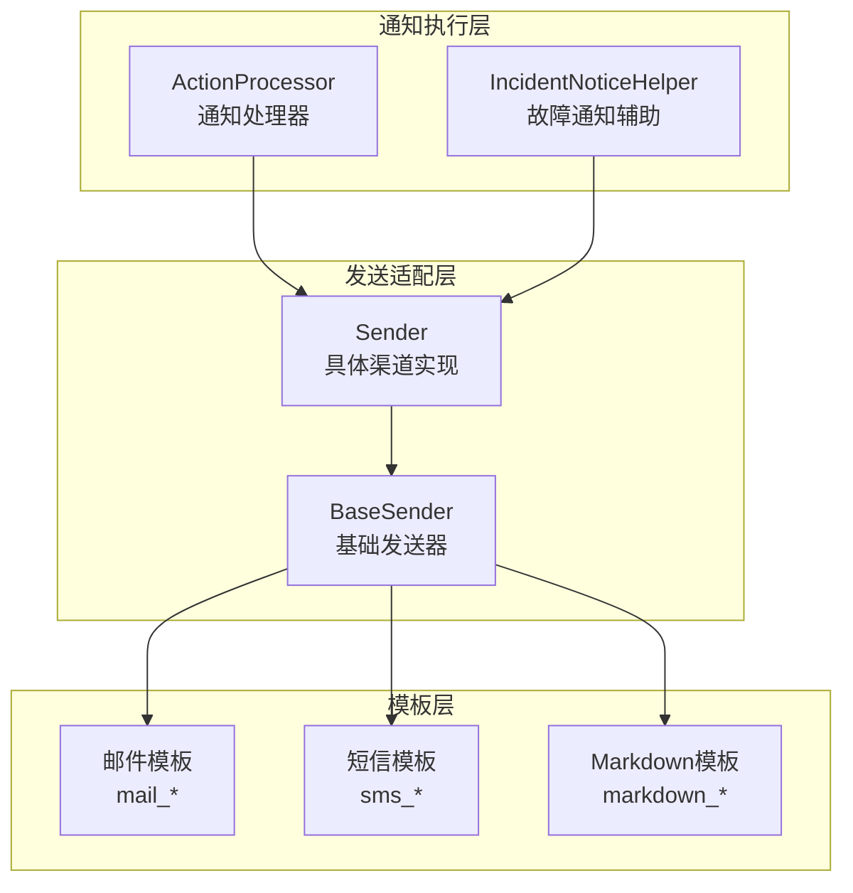
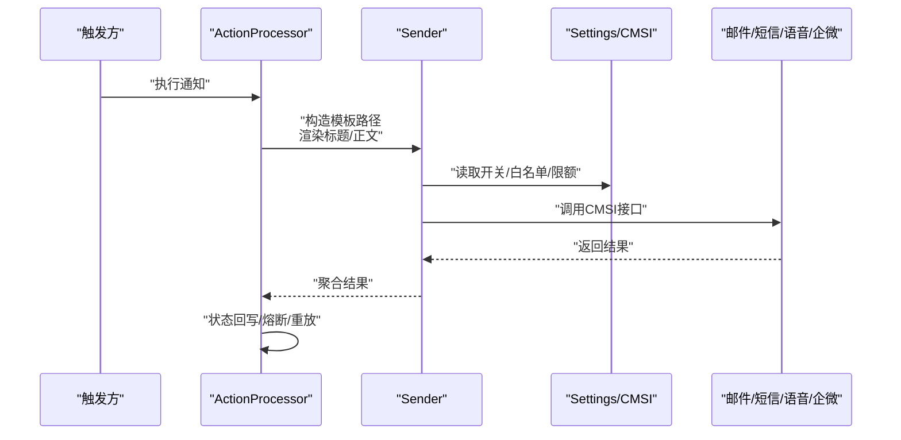
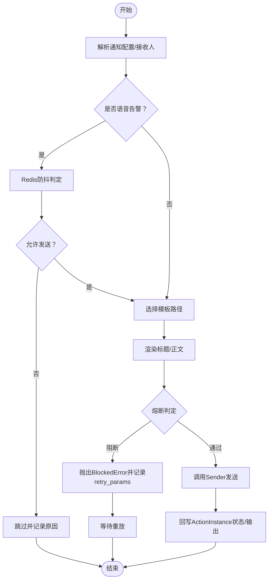
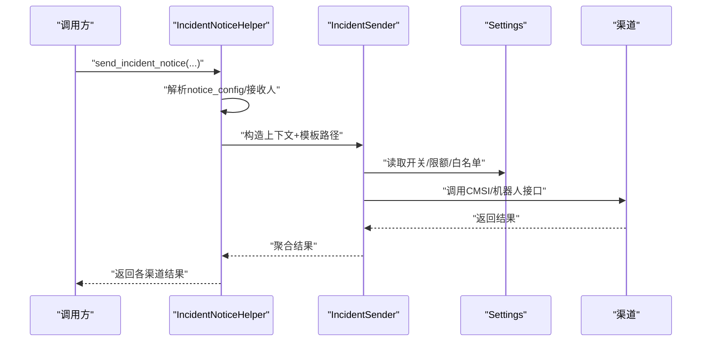
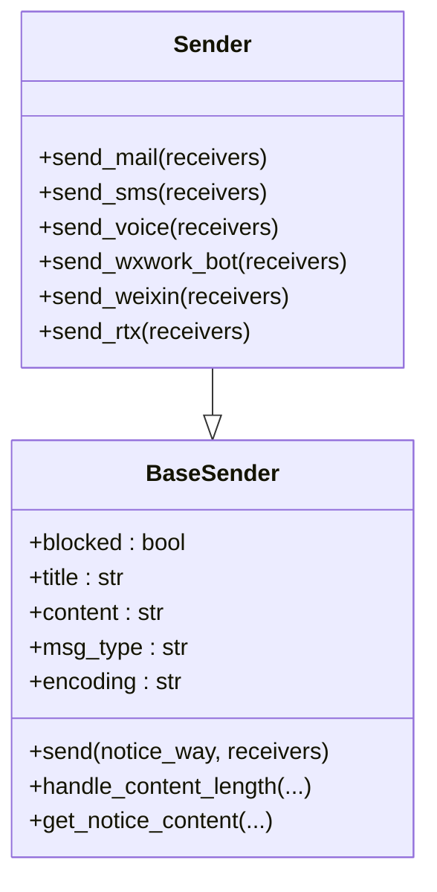
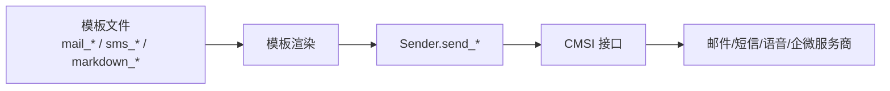

# 邮件短信集成

<cite>
**本文引用的文件**
- [bkmonitor\alarm_backends\service\fta_action\notice\processor.py](file://bkmonitor/alarm_backends/service/fta_action/notice/processor.py)
- [bkmonitor\bkmonitor\aiops\incident\notice.py](file://bkmonitor/bkmonitor/aiops/incident/notice.py)
- [bkmonitor\bkmonitor\utils\send.py](file://bkmonitor/bkmonitor/utils/send.py)
- [bkmonitor\templates\notice\abnormal\action\mail_content.jinja](file://bkmonitor/templates/notice/abnormal/action/mail_content.jinja)
- [bkmonitor\templates\notice\abnormal\action\mail_title.jinja](file://bkmonitor/templates/notice/abnormal/action/mail_title.jinja)
- [bkmonitor\templates\notice\abnormal\action\sms_content.jinja](file://bkmonitor/templates/notice/abnormal/action/sms_content.jinja)
- [bkmonitor\templates\notice\abnormal\action\sms_title.jinja](file://bkmonitor/templates/notice/abnormal/action/sms_title.jinja)
- [bkmonitor\templates\notice\abnormal\action\markdown_content.jinja](file://bkmonitor/templates/notice/abnormal/action/markdown_content.jinja)
- [bkmonitor\templates\notice\abnormal\action\default_content.jinja](file://bkmonitor/templates/notice/abnormal/action/default_content.jinja)
</cite>

## 目录
1. [简介](#简介)
2. [项目结构](#项目结构)
3. [核心组件](#核心组件)
4. [架构总览](#架构总览)
5. [详细组件分析](#详细组件分析)
6. [依赖分析](#依赖分析)
7. [性能考虑](#性能考虑)
8. [故障排查指南](#故障排查指南)
9. [结论](#结论)
10. [附录](#附录)

## 简介
本文件面向邮件与短信通知渠道的集成与运维，覆盖以下主题：
- 邮件服务器配置与 SMTP 参数设置
- 短信网关对接与调用流程
- 邮件模板与短信模板的定制化
- 通知内容格式化、附件处理与签名管理
- 发送状态跟踪与熔断控制
- 邮件域名验证、短信白名单与发送限额控制

通过源码级分析，帮助开发者快速理解通知链路、模板渲染、API 调用与状态回写机制，并提供可落地的配置建议与排障指引。

## 项目结构
通知相关能力主要分布在以下模块：
- 告警动作执行与通知汇总：alarm_backends.service.fta_action.notice.processor
- 故障场景通知封装：bkmonitor.aiops.incident.notice
- 通用发送器与渠道适配：bkmonitor.utils.send
- 通知模板：templates/notice/...（邮件、短信、Markdown 等）

**图表来源**
- [bkmonitor\alarm_backends\service\fta_action\notice\processor.py:133-278](file://bkmonitor/alarm_backends/service/fta_action/notice/processor.py#L133-L278)
- [bkmonitor\bkmonitor\aiops\incident\notice.py:451-636](file://bkmonitor/bkmonitor/aiops/incident/notice.py#L451-L636)
- [bkmonitor\bkmonitor\utils\send.py:386-800](file://bkmonitor/bkmonitor/utils/send.py#L386-L800)

**章节来源**
- [bkmonitor\alarm_backends\service\fta_action\notice\processor.py:133-278](file://bkmonitor/alarm_backends/service/fta_action/notice/processor.py#L133-L278)
- [bkmonitor\bkmonitor\aiops\incident\notice.py:451-636](file://bkmonitor/bkmonitor/aiops/incident/notice.py#L451-L636)
- [bkmonitor\bkmonitor\utils\send.py:386-800](file://bkmonitor/bkmonitor/utils/send.py#L386-L800)

## 核心组件
- 通知处理器 ActionProcessor：负责根据通知方式选择发送器、执行熔断判定、汇总发送、状态回写与重放。
- 故障通知辅助 IncidentNoticeHelper：封装故障场景的上下文构建、模板选择与发送流程。
- 通用发送器 BaseSender/Sender：统一封装模板渲染、长度截断、渠道 API 调用与结果处理。

关键职责与交互：
- 通过 notice_way 决定模板路径与发送渠道
- 通过 settings 中的开关与白名单控制渠道可用性
- 通过 cmsi 网关统一调用各渠道接口（邮件、短信、语音、企业微信等）
- 通过 Redis 键空间实现“语音告警防抖”和“通知汇总收集”

**章节来源**
- [bkmonitor\alarm_backends\service\fta_action\notice\processor.py:197-278](file://bkmonitor/alarm_backends/service/fta_action/notice/processor.py#L197-L278)
- [bkmonitor\bkmonitor\aiops\incident\notice.py:423-636](file://bkmonitor/bkmonitor/aiops/incident/notice.py#L423-L636)
- [bkmonitor\bkmonitor\utils\send.py:386-800](file://bkmonitor/bkmonitor/utils/send.py#L386-L800)

## 架构总览
通知链路由“动作执行/故障通知”触发，进入“模板渲染+渠道适配”，最终通过“CMSI 网关”调用各服务商接口，并回写发送结果。

**图表来源**
- [bkmonitor\alarm_backends\service\fta_action\notice\processor.py:197-278](file://bkmonitor/alarm_backends/service/fta_action/notice/processor.py#L197-L278)
- [bkmonitor\bkmonitor\utils\send.py:460-535](file://bkmonitor/bkmonitor/utils/send.py#L460-L535)

## 详细组件分析

### 通知处理器 ActionProcessor
职责：
- 解析通知配置与接收人
- 语音告警防抖与通知汇总
- 选择发送器并执行发送
- 熔断判定与阻断重放
- 将发送结果回写到 ActionInstance

要点：
- 通过 notice_way 与模板路径映射决定渲染模板
- 语音告警通过 Redis 键空间实现“两分钟内同一维度仅一次”
- 熔断时将 retry_params 写入输出，支持后续重放
- 成功/失败/阻断三类结果分别更新 ActionInstance 的状态与输出

**图表来源**
- [bkmonitor\alarm_backends\service\fta_action\notice\processor.py:361-401](file://bkmonitor/alarm_backends/service/fta_action/notice/processor.py#L361-L401)
- [bkmonitor\alarm_backends\service\fta_action\notice\processor.py:235-278](file://bkmonitor/alarm_backends/service/fta_action/notice/processor.py#L235-L278)

**章节来源**
- [bkmonitor\alarm_backends\service\fta_action\notice\processor.py:133-401](file://bkmonitor/alarm_backends/service/fta_action/notice/processor.py#L133-L401)

### 故障通知辅助 IncidentNoticeHelper
职责：
- 构建故障通知上下文（持续时间、告警统计、负责人、URL 等）
- 根据通知方式选择模板（邮件/短信/Markdown）
- 调用 IncidentSender 执行发送
- 支持企业微信群机器人与个人渠道

要点：
- 通过 notice_config 解析目标渠道与接收人
- 邮件/短信使用各自模板路径，Markdown 用于企业微信等
- 未配置 webhook 或接收人时进行安全短路

**图表来源**
- [bkmonitor\bkmonitor\aiops\incident\notice.py:451-636](file://bkmonitor/bkmonitor/aiops/incident/notice.py#L451-L636)

**章节来源**
- [bkmonitor\bkmonitor\aiops\incident\notice.py:32-636](file://bkmonitor/bkmonitor/aiops/incident/notice.py#L32-L636)

### 通用发送器 BaseSender/Sender
职责：
- 模板渲染：根据 notice_way 选择模板路径，支持多语言模板
- 内容长度控制：按渠道限制截断内容，保证合规
- 渠道适配：统一 send_* 方法，内部调用 CMSI 接口
- 结果处理：将接口返回标准化为 per-receiver 的结果字典

邮件/短信关键点：
- 邮件：支持附件 attachments，支持外部邮箱直发（通过 receiver 字段）
- 短信：自动按长度截断，支持自定义长度配置
- 语音：聚合多个接收人后一次性发送
- 企业微信：支持 Markdown/布局卡片两种模式

**图表来源**
- [bkmonitor\bkmonitor\utils\send.py:54-384](file://bkmonitor/bkmonitor/utils/send.py#L54-L384)
- [bkmonitor\bkmonitor\utils\send.py:386-800](file://bkmonitor/bkmonitor/utils/send.py#L386-L800)

**章节来源**
- [bkmonitor\bkmonitor\utils\send.py:54-800](file://bkmonitor/bkmonitor/utils/send.py#L54-L800)

## 依赖分析
- 通知模板依赖 Django 模板引擎，路径约定如下：
  - 邮件：notice/.../mail_content.jinja、mail_title.jinja
  - 短信：notice/.../sms_content.jinja、sms_title.jinja
  - Markdown：notice/.../markdown_content.jinja
  - 默认：notice/.../default_content.jinja
- 渠道调用统一通过 api.cmsi.* 接口，底层由 CMSI 网关对接各服务商
- Redis 键空间用于：
  - 通知汇总收集（FTA_NOTICE_COLLECT_KEY）
  - 语音告警防抖（NOTICE_VOICE_COLLECT_KEY）

**图表来源**
- [bkmonitor\templates\notice\abnormal\action\mail_content.jinja](file://bkmonitor/templates/notice/abnormal/action/mail_content.jinja)
- [bkmonitor\templates\notice\abnormal\action\sms_content.jinja](file://bkmonitor/templates/notice/abnormal/action/sms_content.jinja)
- [bkmonitor\templates\notice\abnormal\action\markdown_content.jinja](file://bkmonitor/templates/notice/abnormal/action/markdown_content.jinja)
- [bkmonitor\bkmonitor\utils\send.py:460-535](file://bkmonitor/bkmonitor/utils/send.py#L460-L535)

**章节来源**
- [bkmonitor\templates\notice\abnormal\action\mail_content.jinja](file://bkmonitor/templates/notice/abnormal/action/mail_content.jinja)
- [bkmonitor\templates\notice\abnormal\action\sms_content.jinja](file://bkmonitor/templates/notice/abnormal/action/sms_content.jinja)
- [bkmonitor\templates\notice\abnormal\action\markdown_content.jinja](file://bkmonitor/templates/notice/abnormal/action/markdown_content.jinja)
- [bkmonitor\bkmonitor\utils\send.py:460-535](file://bkmonitor/bkmonitor/utils/send.py#L460-L535)

## 性能考虑
- 模板渲染与长度截断：在渲染后统一进行长度评估与截断，避免超限导致的调用失败与资源浪费
- 语音告警防抖：通过 Redis 键空间限制同一维度短时间内重复拨号，降低运营商成本与风控风险
- 通知汇总：在多告警同时触发时，通过汇总键减少重复发送，提升吞吐
- 指标埋点：对各渠道发送成功/失败次数进行统计，便于容量规划与问题定位

[本节为通用指导，无需列出具体文件来源]

## 故障排查指南
常见问题与定位思路：
- 邮件未送达
  - 检查是否启用外部邮箱直发（通过 receiver 字段），或使用用户名字段
  - 确认 CMSI 邮件接口可用与账号权限
  - 查看附件是否过大导致截断或丢弃
- 短信发送失败
  - 检查短信长度限制配置与内容截断
  - 核对手机号白名单与运营商限制
- 通知被熔断
  - 查看 ActionInstance 输出中的 retry_params，确认熔断原因与重放时机
  - 检查熔断阈值与冷却时间
- 语音告警未拨通
  - 检查 Redis 防抖键是否生效（两分钟内仅一次）
  - 确认语音接口参数与权限

**章节来源**
- [bkmonitor\alarm_backends\service\fta_action\notice\processor.py:247-277](file://bkmonitor/alarm_backends/service/fta_action/notice/processor.py#L247-L277)
- [bkmonitor\bkmonitor\utils\send.py:460-535](file://bkmonitor/bkmonitor/utils/send.py#L460-L535)

## 结论
本通知体系通过“模板渲染 + 渠道适配 + CMSI 网关”的分层设计，实现了邮件、短信、语音与企业微信等多渠道的统一接入。结合 Redis 防抖、汇总与熔断控制，既保障了可靠性，也兼顾了性能与成本。建议在生产环境中：
- 明确各渠道的开关、白名单与限额配置
- 定期校验模板与附件大小，避免超限
- 建立熔断与重放机制，确保异常可恢复
- 通过指标监控渠道成功率与延迟，持续优化

[本节为总结性内容，无需列出具体文件来源]

## 附录

### 邮件服务器配置与 SMTP 参数设置
- 邮件发送通过 CMSI 网关统一调用，无需直接配置 SMTP 参数
- 若需外部邮箱直发，可通过模板上下文启用直发字段（使用 receiver 而非 receiver__username）
- 附件支持通过上下文 attachments 注入，Sender 将自动传递给 CMSI 接口

**章节来源**
- [bkmonitor\bkmonitor\utils\send.py:486-501](file://bkmonitor/bkmonitor/utils/send.py#L486-L501)

### 短信网关对接与调用
- 短信发送统一走 api.cmsi.send_sms，内容会按渠道长度限制进行截断
- 支持自定义短信长度配置，优先使用页面配置
- 语音发送统一走 api.cmsi.send_voice，聚合多个接收人后一次性发送

**章节来源**
- [bkmonitor\bkmonitor\utils\send.py:503-582](file://bkmonitor/bkmonitor/utils/send.py#L503-L582)

### 邮件模板与短信模板定制
- 邮件模板路径：notice/.../mail_content.jinja、mail_title.jinja
- 短信模板路径：notice/.../sms_content.jinja、sms_title.jinja
- Markdown 模板路径：notice/.../markdown_content.jinja
- 默认模板路径：notice/.../default_content.jinja

**章节来源**
- [bkmonitor\templates\notice\abnormal\action\mail_content.jinja](file://bkmonitor/templates/notice/abnormal/action/mail_content.jinja)
- [bkmonitor\templates\notice\abnormal\action\mail_title.jinja](file://bkmonitor/templates/notice/abnormal/action/mail_title.jinja)
- [bkmonitor\templates\notice\abnormal\action\sms_content.jinja](file://bkmonitor/templates/notice/abnormal/action/sms_content.jinja)
- [bkmonitor\templates\notice\abnormal\action\sms_title.jinja](file://bkmonitor/templates/notice/abnormal/action/sms_title.jinja)
- [bkmonitor\templates\notice\abnormal\action\markdown_content.jinja](file://bkmonitor/templates/notice/abnormal/action/markdown_content.jinja)
- [bkmonitor\templates\notice\abnormal\action\default_content.jinja](file://bkmonitor/templates/notice/abnormal/action/default_content.jinja)

### 通知内容格式化与附件处理
- 内容长度控制：按渠道限制进行截断，并在模板上下文中注入 limit 标记
- 附件处理：通过上下文 attachments 注入，邮件发送器自动附加
- 语音内容：自动聚合多个接收人，统一发送

**章节来源**
- [bkmonitor\bkmonitor\utils\send.py:151-170](file://bkmonitor/bkmonitor/utils/send.py#L151-L170)
- [bkmonitor\bkmonitor\utils\send.py:486-501](file://bkmonitor/bkmonitor/utils/send.py#L486-L501)
- [bkmonitor\bkmonitor\utils\send.py:537-582](file://bkmonitor/bkmonitor/utils/send.py#L537-L582)

### 发送状态跟踪与熔断控制
- 熔断判定：当 blocked 为真时抛出 BlockedError，并记录 retry_params
- 结果回写：成功/失败/阻断三类结果分别更新 ActionInstance 的状态、失败类型与输出
- 语音防抖：通过 NOTICE_VOICE_COLLECT_KEY 实现两分钟内同一维度仅一次

**章节来源**
- [bkmonitor\alarm_backends\service\fta_action\notice\processor.py:235-278](file://bkmonitor/alarm_backends/service/fta_action/notice/processor.py#L235-L278)
- [bkmonitor\alarm_backends\service\fta_action\notice\processor.py:355-401](file://bkmonitor/alarm_backends/service/fta_action/notice/processor.py#L355-L401)

### 邮件域名验证与短信白名单配置
- 邮件域名验证：通过 CMSI 网关侧的域名白名单与权限控制
- 短信白名单：通过 settings 中的白名单与限额配置，结合 Sender 的长度限制共同保障合规

**章节来源**
- [bkmonitor\bkmonitor\utils\send.py:272-299](file://bkmonitor/bkmonitor/utils/send.py#L272-L299)