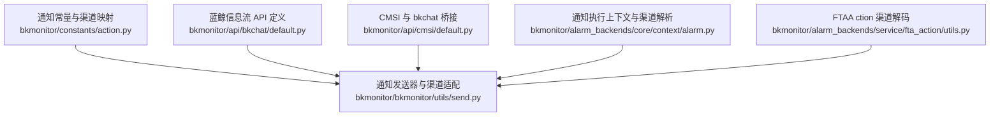
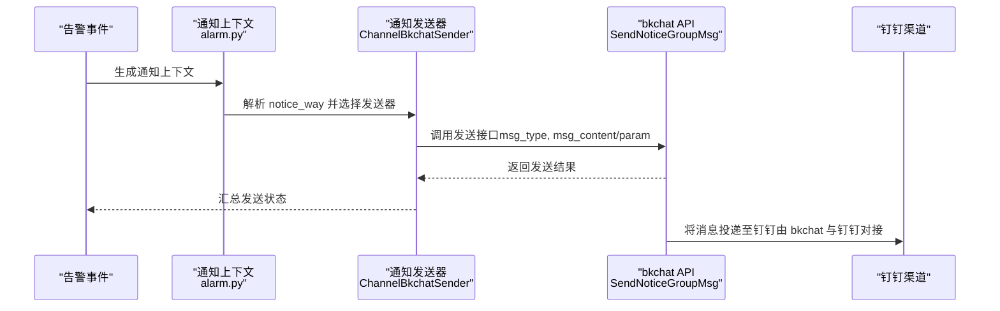
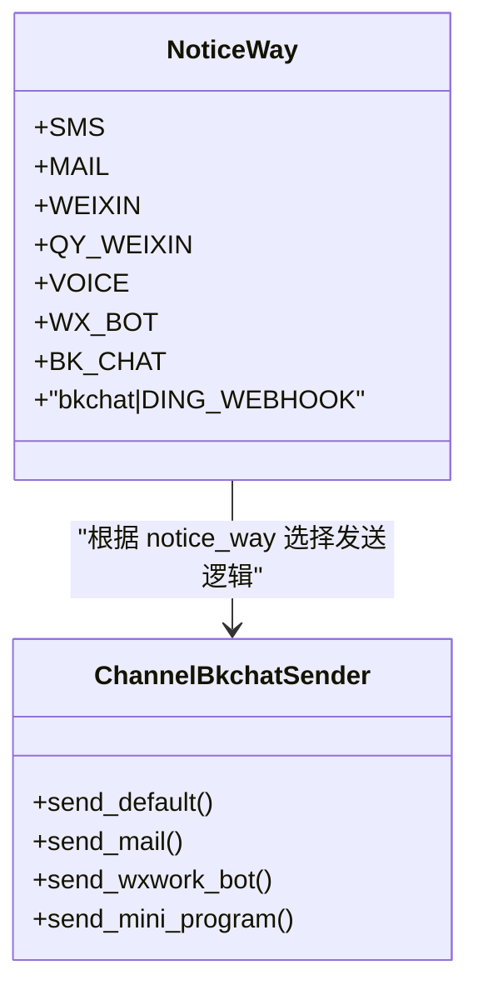
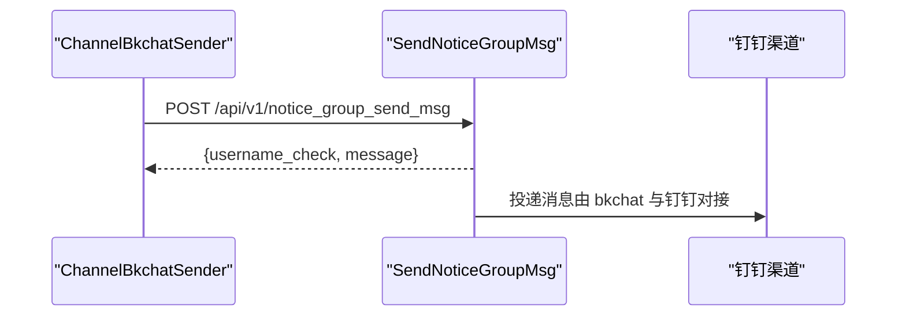
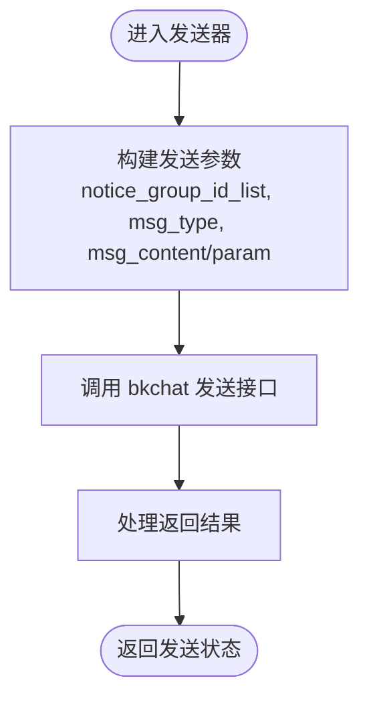
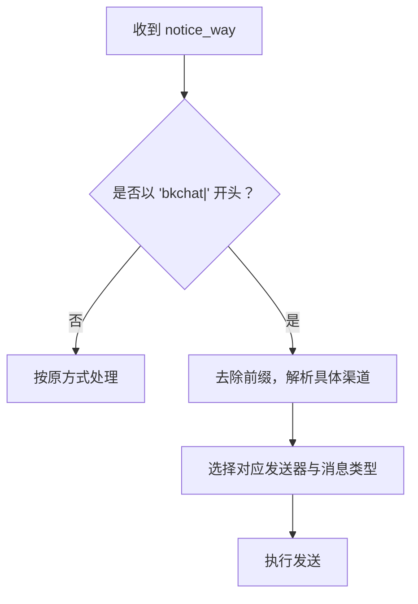
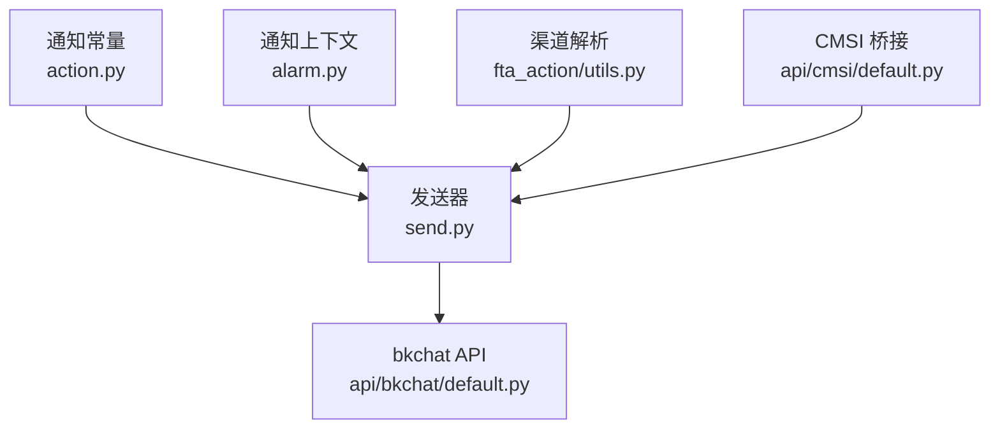

# 钉钉集成

<cite>
**本文引用的文件**
- [action.py](file://bkmonitor/constants/action.py)
- [default.py](file://bkmonitor/api/bkchat/default.py)
- [send.py](file://bkmonitor/bkmonitor/utils/send.py)
- [default.py](file://bkmonitor/api/cmsi/default.py)
- [alarm.py](file://bkmonitor/alarm_backends/core/context/alarm.py)
- [utils.py](file://bkmonitor/alarm_backends/service/fta_action/utils.py)
- [context_experience.md](file://bkmonitor/ai-learning-docs/context_experience.md)
</cite>

## 目录
1. [简介](#简介)
2. [项目结构](#项目结构)
3. [核心组件](#核心组件)
4. [架构概览](#架构概览)
5. [详细组件分析](#详细组件分析)
6. [依赖分析](#依赖分析)
7. [性能考虑](#性能考虑)
8. [故障排查指南](#故障排查指南)
9. [结论](#结论)
10. [附录](#附录)

## 简介
本文件面向“钉钉通知渠道”的集成与使用，基于仓库现有能力，重点说明以下内容：
- 蓝鲸信息流（bkchat）对接钉钉的接入方式与配置要点
- 通知发送流程、消息类型与@人员实现思路
- 工作通知、机器人消息、模板消息三类发送方式在系统中的映射与适用场景
- 应用ID、密钥与回调处理的配置指南，确保通知准确送达

说明：
- 仓库中未发现直接对接“钉钉开放平台”或“钉钉机器人 Webhook”的代码实现；现有能力通过“蓝鲸信息流（bkchat）”统一承载多渠道通知，其中包含“钉钉”作为可选渠道之一。
- 因此，本文档围绕“bkchat + 钉钉”的组合方案进行说明，帮助读者理解如何在现有架构下完成钉钉通知的配置与使用。

## 项目结构
与钉钉集成相关的核心位置如下：
- 通知常量与渠道映射：bkmonitor/constants/action.py
- 蓝鲸信息流 API 定义：bkmonitor/api/bkchat/default.py
- 通知发送器与渠道适配：bkmonitor/bkmonitor/utils/send.py
- CMSI 与 bkchat 的桥接：bkmonitor/api/cmsi/default.py
- 通知执行上下文与渠道解析：bkmonitor/alarm_backends/core/context/alarm.py、bkmonitor/alarm_backends/service/fta_action/utils.py
- 多渠道内容适配参考：bkmonitor/ai-learning-docs/context_experience.md

**图表来源**
- [action.py](file://bkmonitor/constants/action.py)
- [default.py](file://bkmonitor/api/bkchat/default.py)
- [send.py](file://bkmonitor/bkmonitor/utils/send.py)
- [default.py](file://bkmonitor/api/cmsi/default.py)
- [alarm.py](file://bkmonitor/alarm_backends/core/context/alarm.py)
- [utils.py](file://bkmonitor/alarm_backends/service/fta_action/utils.py)

**章节来源**
- [action.py](file://bkmonitor/constants/action.py)
- [default.py](file://bkmonitor/api/bkchat/default.py)
- [send.py](file://bkmonitor/bkmonitor/utils/send.py)
- [default.py](file://bkmonitor/api/cmsi/default.py)
- [alarm.py](file://bkmonitor/alarm_backends/core/context/alarm.py)
- [utils.py](file://bkmonitor/alarm_backends/service/fta_action/utils.py)

## 核心组件
- 通知渠道与消息类型映射
  - 在通知常量中，定义了多种通知方式与渠道映射，其中包含“bkchat|DING_WEBHOOK”标识，表明系统支持通过蓝鲸信息流对接“钉钉 Webhook”能力。
  - 通知发送器中，针对不同通知方式（如邮件、企业微信机器人、微信公众号等）提供了专门的发送逻辑，便于扩展到钉钉渠道。
- 蓝鲸信息流（bkchat）API
  - 提供获取通知组、查询通知组详情、向通知组发送消息等接口，发送消息接口支持多种消息类型（如 text、image、mini 等）。
- 通知发送器（ChannelBkchatSender）
  - 负责将告警内容转换为 bkchat 接口所需的参数并调用发送接口，返回发送结果。
- 通知执行上下文与渠道解析
  - 在通知执行过程中，会解析通知方式（notice_way），并对“bkchat|”前缀进行拆分，以确定具体渠道（如钉钉 Webhook）。

**章节来源**
- [action.py](file://bkmonitor/constants/action.py)
- [default.py](file://bkmonitor/api/bkchat/default.py)
- [send.py](file://bkmonitor/bkmonitor/utils/send.py)
- [alarm.py](file://bkmonitor/alarm_backends/core/context/alarm.py)
- [utils.py](file://bkmonitor/alarm_backends/service/fta_action/utils.py)

## 架构概览
下图展示了从告警触发到通过蓝鲸信息流发送至钉钉的整体流程：

**图表来源**
- [alarm.py](file://bkmonitor/alarm_backends/core/context/alarm.py)
- [send.py](file://bkmonitor/bkmonitor/utils/send.py)
- [default.py](file://bkmonitor/api/bkchat/default.py)

## 详细组件分析

### 通知渠道与消息类型映射
- 渠道标识
  - 系统通过“notice_way”标识通知方式，例如“bkchat|DING_WEBHOOK”表示通过蓝鲸信息流对接钉钉 Webhook。
- 消息类型
  - 发送接口支持多种消息类型（如 text、image、mini 等），具体类型由发送器根据内容与场景选择。

**图表来源**
- [action.py](file://bkmonitor/constants/action.py)
- [send.py](file://bkmonitor/bkmonitor/utils/send.py)

**章节来源**
- [action.py](file://bkmonitor/constants/action.py)
- [send.py](file://bkmonitor/bkmonitor/utils/send.py)

### 蓝鲸信息流（bkchat）API
- 接口能力
  - 获取通知组、查询通知组详情、向通知组发送消息。
  - 发送消息接口支持多种消息类型与参数校验。
- 参数要点
  - notice_group_id_list：通知组 ID 列表
  - msg_type：消息类型（如 text、image、mini 等）
  - msg_content 或 msg_param：消息内容或结构化参数

**图表来源**
- [default.py](file://bkmonitor/api/bkchat/default.py)
- [send.py](file://bkmonitor/bkmonitor/utils/send.py)

**章节来源**
- [default.py](file://bkmonitor/api/bkchat/default.py)
- [send.py](file://bkmonitor/bkmonitor/utils/send.py)

### 通知发送器（ChannelBkchatSender）
- 功能职责
  - 将告警内容封装为 bkchat 接口所需参数并调用发送接口
  - 支持邮件、企业微信机器人、微信公众号等多种渠道的差异化处理
  - 对发送结果进行统一处理与返回
- 关键点
  - 针对不同渠道（如 wxwork-bot、mini_program）采用不同的消息参数结构
  - 对图片等富媒体内容进行特殊处理（如 base64 编码与 md5 校验）

**图表来源**
- [send.py](file://bkmonitor/bkmonitor/utils/send.py)

**章节来源**
- [send.py](file://bkmonitor/bkmonitor/utils/send.py)

### 通知执行上下文与渠道解析
- 渠道前缀处理
  - 在通知执行上下文中，会对“bkchat|”前缀进行拆分，以区分具体渠道（如 DING_WEBHOOK）。
- 通知方式解析
  - 通过 notice_way 与渠道映射，确定使用哪种发送器与消息类型。

**图表来源**
- [alarm.py](file://bkmonitor/alarm_backends/core/context/alarm.py)
- [utils.py](file://bkmonitor/alarm_backends/service/fta_action/utils.py)
- [action.py](file://bkmonitor/constants/action.py)

**章节来源**
- [alarm.py](file://bkmonitor/alarm_backends/core/context/alarm.py)
- [utils.py](file://bkmonitor/alarm_backends/service/fta_action/utils.py)
- [action.py](file://bkmonitor/constants/action.py)

### 多渠道内容适配参考
- 文档指出系统需对邮件、微信、短信、钉钉等多渠道进行内容适配，以满足不同渠道的消息格式要求。
- 这为在现有架构下扩展钉钉消息格式提供了方向性指导。

**章节来源**
- [context_experience.md](file://bkmonitor/ai-learning-docs/context_experience.md)

## 依赖分析
- 组件耦合关系
  - 通知常量（action.py）为渠道与消息类型提供统一映射
  - 通知发送器（send.py）依赖 bkchat API（default.py）进行消息投递
  - 通知执行上下文（alarm.py）与渠道解析（utils.py）负责将 notice_way 映射到具体发送器
  - CMSI（default.py）与 bkchat 的桥接为邮件等渠道提供统一入口

**图表来源**
- [action.py](file://bkmonitor/constants/action.py)
- [alarm.py](file://bkmonitor/alarm_backends/core/context/alarm.py)
- [utils.py](file://bkmonitor/alarm_backends/service/fta_action/utils.py)
- [send.py](file://bkmonitor/bkmonitor/utils/send.py)
- [default.py](file://bkmonitor/api/bkchat/default.py)
- [default.py](file://bkmonitor/api/cmsi/default.py)

**章节来源**
- [action.py](file://bkmonitor/constants/action.py)
- [alarm.py](file://bkmonitor/alarm_backends/core/context/alarm.py)
- [utils.py](file://bkmonitor/alarm_backends/service/fta_action/utils.py)
- [send.py](file://bkmonitor/bkmonitor/utils/send.py)
- [default.py](file://bkmonitor/api/bkchat/default.py)
- [default.py](file://bkmonitor/api/cmsi/default.py)

## 性能考虑
- 消息类型选择
  - 对于富媒体内容（如图表），优先采用 image 类型并携带 base64 与 md5，减少二次请求开销
- 批量发送
  - 使用通知组 ID 列表一次性投递，降低网络往返次数
- 结果处理
  - 统一处理返回结果，避免重复发送与资源浪费

[本节为通用建议，无需特定文件引用]

## 故障排查指南
- 常见问题定位
  - 通知未送达：检查 notice_way 是否正确、通知组 ID 是否有效、消息类型与参数是否符合接口要求
  - 图片发送失败：确认 base64 内容与 md5 校验一致，且消息类型为 image
  - 渠道解析异常：确认 notice_way 前缀为“bkchat|”，并正确映射到具体渠道
- 日志与返回
  - 发送器会记录发送日志与返回信息，便于定位失败原因
  - 接口层对异常进行捕获并返回失败通知组列表，可用于重试或告警

**章节来源**
- [send.py](file://bkmonitor/bkmonitor/utils/send.py)
- [default.py](file://bkmonitor/api/bkchat/default.py)

## 结论
- 仓库未提供“钉钉开放平台直连”或“钉钉机器人 Webhook”的直接实现
- 现有能力通过“蓝鲸信息流（bkchat）+ 钉钉 Webhook”组合实现通知投递
- 通过通知常量、发送器与 API 的协同，系统实现了对多渠道（含钉钉）的统一接入与管理

[本节为总结，无需特定文件引用]

## 附录

### 配置清单与说明
- 应用 ID 与密钥
  - 通过“bkchat|DING_WEBHOOK”标识对接钉钉 Webhook，具体应用 ID 与密钥由蓝鲸信息流侧进行管理与下发
- 回调处理
  - 系统通过 bkchat API 统一调用钉钉 Webhook，无需在业务侧直接处理回调
- 消息类型与@人员
  - 系统支持多种消息类型（text、image、mini 等），@人员等富媒体能力由钉钉侧处理
- 使用场景
  - 工作通知：通过通知组 ID 列表批量投递
  - 机器人消息：通过企业微信机器人等渠道投递（钉钉 Webhook 亦可复用相同模式）
  - 模板消息：通过结构化参数（msg_param）传递模板占位符

[本节为通用说明，无需特定文件引用]