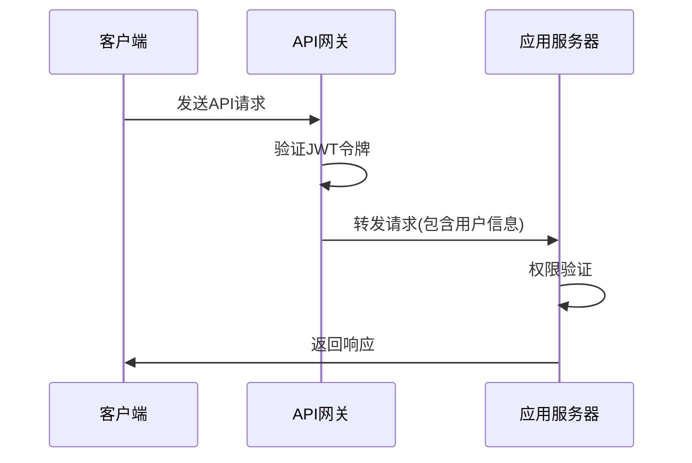
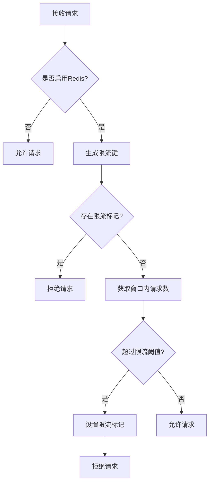
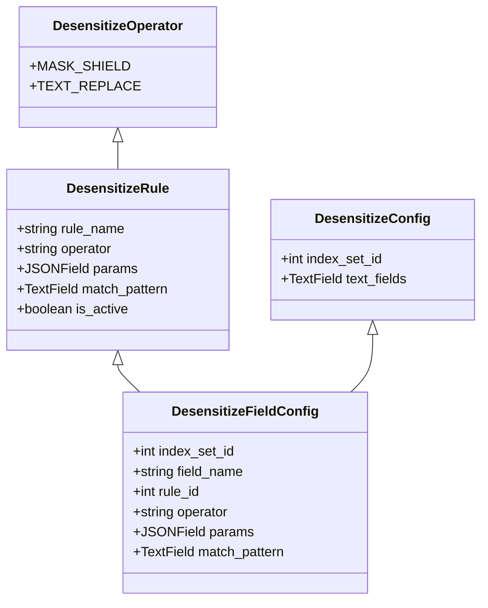
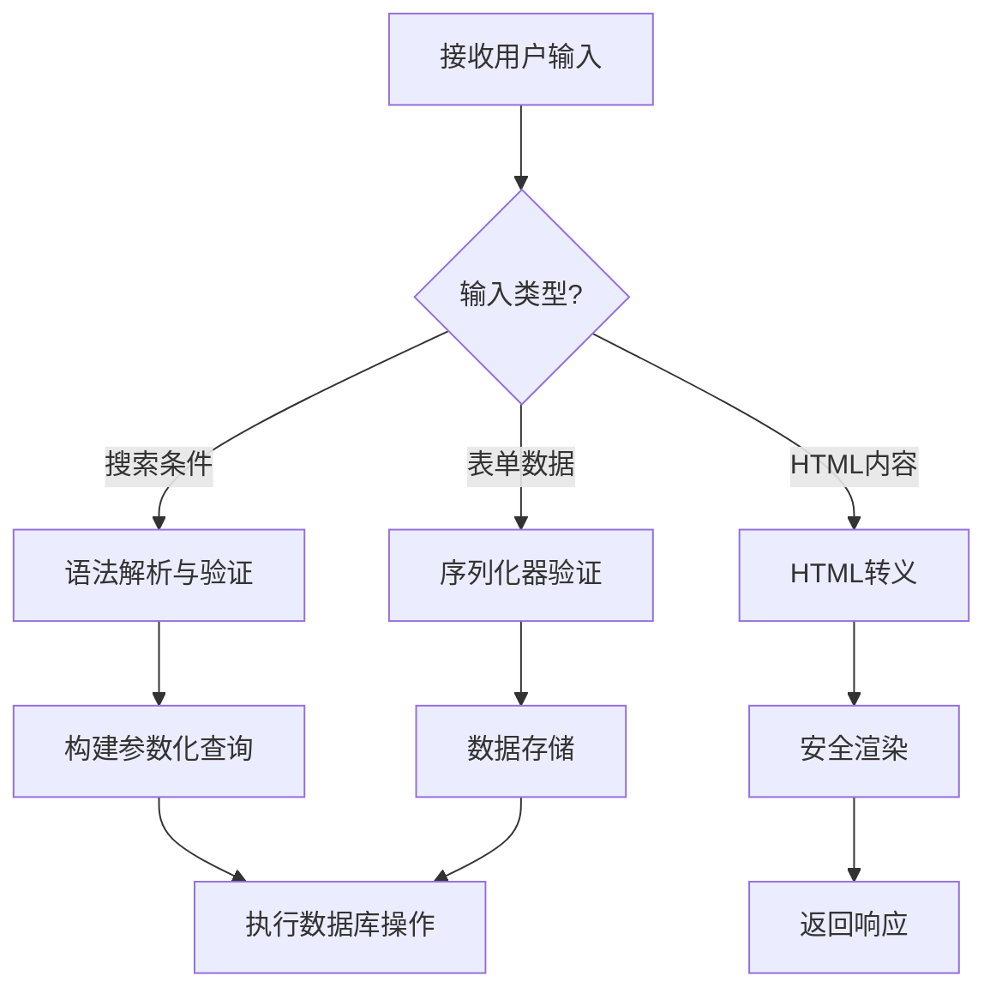
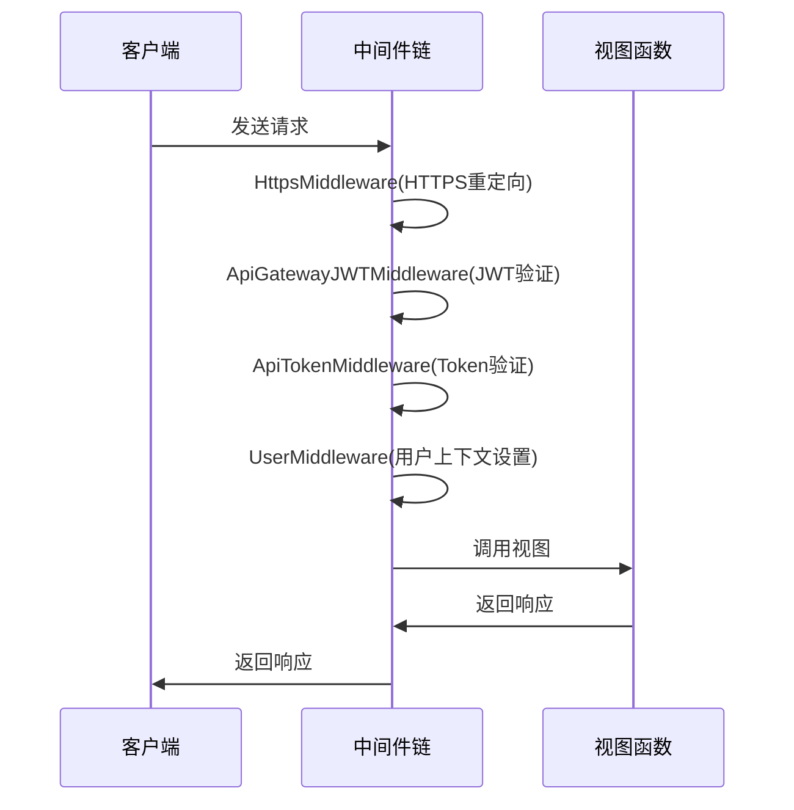

# API安全

<cite>
**本文档引用的文件**
- [apigw.py](file://bklog/apps/middleware/apigw.py)
- [api_token_middleware.py](file://bklog/apps/middleware/api_token_middleware.py)
- [user_middleware.py](file://bklog/apps/middleware/user_middleware.py)
- [middlewares.py](file://bklog/apps/middlewares.py)
- [aes.py](file://bklog/apps/utils/aes.py)
- [base_crypt.py](file://bklog/apps/utils/base_crypt.py)
- [log_desensitize/models.py](file://bklog/apps/log_desensitize/models.py)
- [log_desensitize/handlers/desensitize_operator/__init__.py](file://bklog/apps/log_desensitize/handlers/desensitize_operator/__init__.py)
- [log_desensitize/handlers/desensitize_operator/mask_shield.py](file://bklog/apps/log_desensitize/handlers/desensitize_operator/mask_shield.py)
- [log_desensitize/handlers/desensitize_operator/text_replace.py](file://bklog/apps/log_desensitize/handlers/desensitize_operator/text_replace.py)
- [log_desensitize/urls.py](file://bklog/apps/log_desensitize/urls.py)
- [log_desensitize/admin.py](file://bklog/apps/log_desensitize/admin.py)
- [log_esquery/qos.py](file://bklog/apps/log_esquery/qos.py)
- [log_search/handlers/search_handler.py](file://bklog/apps/log_search/handlers/search_handler.py)
- [log_search/views/search_views.py](file://bklog/apps/log_search/views/search_views.py)
</cite>

## 目录
1. [API网关集成与认证机制](#api网关集成与认证机制)
2. [速率限制与防暴力破解](#速率限制与防暴力破解)
3. [敏感数据保护](#敏感数据保护)
4. [安全漏洞防范](#安全漏洞防范)
5. [安全中间件工作原理](#安全中间件工作原理)

## API网关集成与认证机制

本系统通过API网关实现统一的请求认证和权限控制。系统支持多种认证方式，包括JWT令牌和API Token，确保接口调用的安全性。

在API网关集成方面，系统实现了`ApiGatewayJWTMiddleware`中间件，该中间件负责处理JWT令牌的验证。通过`CustomCachePublicKeyProvider`类，系统能够根据不同的网关名称和请求来源选择合适的公钥进行JWT令牌验证。对于内部API网关请求，系统使用`NEW_INTERNAL_APIGW_PUBLIC_KEY`；对于外部API网关请求，则使用`EXTERNAL_APIGW_PUBLIC_KEY`。

系统还实现了调用来源校验机制，通过检查请求头中的`Is-External`字段来判断请求来源。当该字段值为"true"时，系统认定为外部API网关请求，并采用相应的安全策略。

权限透传机制通过JWT令牌的payload实现，其中包含了用户身份信息和权限数据。`UserModelBackend`类负责从JWT令牌中提取用户信息，并在系统内部进行权限验证。

**图示来源**
- [apigw.py](file://bklog/apps/middleware/apigw.py#L22-L124)
- [middlewares.py](file://bklog/apps/middlewares.py#L213-L232)

**本节来源**
- [apigw.py](file://bklog/apps/middleware/apigw.py#L22-L124)
- [middlewares.py](file://bklog/apps/middlewares.py#L213-L232)

## 速率限制与防暴力破解

系统实现了基于Redis的QoS（服务质量）限流机制，有效防止API接口被滥用或遭受暴力破解攻击。

在`log_esquery/qos.py`文件中，`QosThrottle`类实现了基础的限流功能。系统通过`build_qos_key`函数为每个请求生成唯一的限流键，该键通常包含用户标识、IP地址和请求路径等信息。限流策略基于滑动窗口算法，通过Redis的有序集合（ZSET）记录请求时间戳。

当请求频率超过预设阈值时，系统会设置一个限流标记，持续时间为`BKLOG_QOS_LIMIT_TIME`分钟。在此期间，所有来自该来源的请求都将被拒绝。系统还实现了`qos_recover`函数，在请求成功处理后清理相关的限流计数，确保正常用户的使用体验。

限流阈值和时间窗口可通过配置文件灵活调整，适应不同接口的性能要求和安全需求。

**图示来源**
- [qos.py](file://bklog/apps/log_esquery/qos.py#L104-L144)

**本节来源**
- [qos.py](file://bklog/apps/log_esquery/qos.py#L104-L144)

## 敏感数据保护

系统提供了完善的敏感数据保护机制，包括数据加密和脱敏处理，确保敏感信息在传输和展示过程中的安全性。

在数据加密方面，系统提供了两种加密实现：`AESCipher`和`BaseCrypt`。`AESCipher`类实现了AES-256加密算法，使用CBC模式和随机IV向量，确保加密的安全性。密钥优先使用环境变量`BKPAAS_BK_CRYPTO_KEY`，若不存在则使用`SECRET_KEY`。`BaseCrypt`类则实现了AES-CFB模式的加密，适用于不同的加密场景。

敏感数据脱敏功能由`log_desensitize`模块提供。系统支持两种脱敏算子：掩码屏蔽和文本替换。`DesensitizeRule`模型定义了脱敏规则，包括规则名称、操作类型和参数。`DesensitizeConfig`和`DesensitizeFieldConfig`模型则用于配置具体的脱敏应用。

脱敏规则通过`OPERATOR_MAPPING`映射到具体的处理类：`DesensitizeMaskShield`负责掩码屏蔽，`DesensitizeTextReplace`负责文本替换。系统通过正则表达式匹配敏感信息，并根据配置的规则进行脱敏处理。

**图示来源**
- [models.py](file://bklog/apps/log_desensitize/models.py)
- [__init__.py](file://bklog/apps/log_desensitize/handlers/desensitize_operator/__init__.py)

**本节来源**
- [aes.py](file://bklog/apps/utils/aes.py#L24-L131)
- [base_crypt.py](file://bklog/apps/utils/base_crypt.py#L25-L65)
- [models.py](file://bklog/apps/log_desensitize/models.py)
- [mask_shield.py](file://bklog/apps/log_desensitize/handlers/desensitize_operator/mask_shield.py)
- [text_replace.py](file://bklog/apps/log_desensitize/handlers/desensitize_operator/text_replace.py)

## 安全漏洞防范

系统实施了多层次的安全防护措施，有效防范常见的安全漏洞，包括输入验证、SQL注入防护和XSS过滤。

在输入验证方面，系统通过Django的序列化器（Serializer）对所有API请求参数进行严格验证。`log_search`模块中的`search_handler.py`文件实现了复杂的查询语法解析，对用户输入的搜索条件进行规范化处理，防止恶意输入。

SQL注入防护通过参数化查询实现。系统在构建数据库查询时，使用Django ORM的安全方法，避免直接拼接SQL语句。例如，在日志搜索功能中，系统将用户输入的过滤条件转换为安全的查询表达式，如`log LIKE '%suc{1,2}ess%'`，而不是直接拼接字符串。

XSS过滤通过Django的模板系统自动实现。所有用户生成的内容在渲染到页面前都会经过HTML转义处理。对于需要显示原始HTML的场景，系统使用`mark_safe`函数并配合严格的白名单策略。

系统还实现了安全的错误处理机制，避免向客户端暴露敏感的系统信息。所有异常都被捕获并转换为标准化的错误响应，只包含必要的错误代码和用户友好的错误消息。

**本节来源**
- [search_handler.py](file://bklog/apps/log_search/handlers/search_handler.py)
- [search_views.py](file://bklog/apps/log_search/views/search_views.py)
- [grep_logic.py](file://bklog/apps/tests/log_search/test_grep_logic.py)

## 安全中间件工作原理

安全中间件是系统安全架构的核心组件，负责在请求处理流程中实施各种安全策略。

`api_token_middleware.py`实现了API Token认证机制。该中间件在请求到达视图函数前，检查请求头中的API Token，并验证其有效性。有效的Token必须包含在预定义的Token列表中，并且未过期。

`user_middleware.py`负责用户身份的识别和上下文设置。该中间件从JWT令牌或会话中提取用户信息，并将其设置到请求对象中，供后续的业务逻辑使用。同时，该中间件还处理用户权限的初始化。

`HttpsMiddleware`强制使用HTTPS协议，确保数据传输的安全性。当系统配置了`DEFAULT_HTTPS_HOST`时，该中间件会将所有HTTP请求重定向到HTTPS，防止敏感信息在传输过程中被窃取。

所有安全中间件都遵循Django的中间件协议，通过`__call__`方法拦截请求和响应。它们按照预定义的顺序执行，形成一个安全过滤链。每个中间件负责特定的安全功能，共同构建了系统的纵深防御体系。

**图示来源**
- [api_token_middleware.py](file://bklog/apps/middleware/api_token_middleware.py)
- [user_middleware.py](file://bklog/apps/middleware/user_middleware.py)
- [middlewares.py](file://bklog/apps/middlewares.py)

**本节来源**
- [api_token_middleware.py](file://bklog/apps/middleware/api_token_middleware.py)
- [user_middleware.py](file://bklog/apps/middleware/user_middleware.py)
- [middlewares.py](file://bklog/apps/middlewares.py)