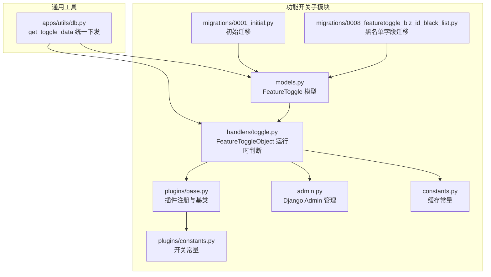
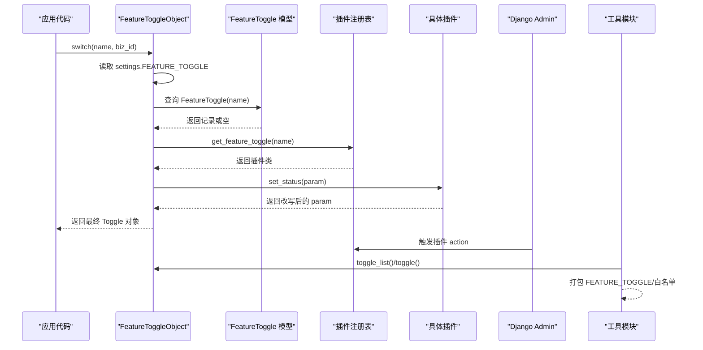
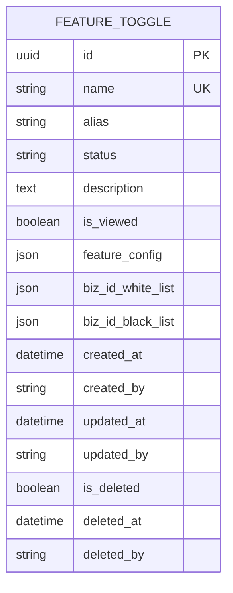
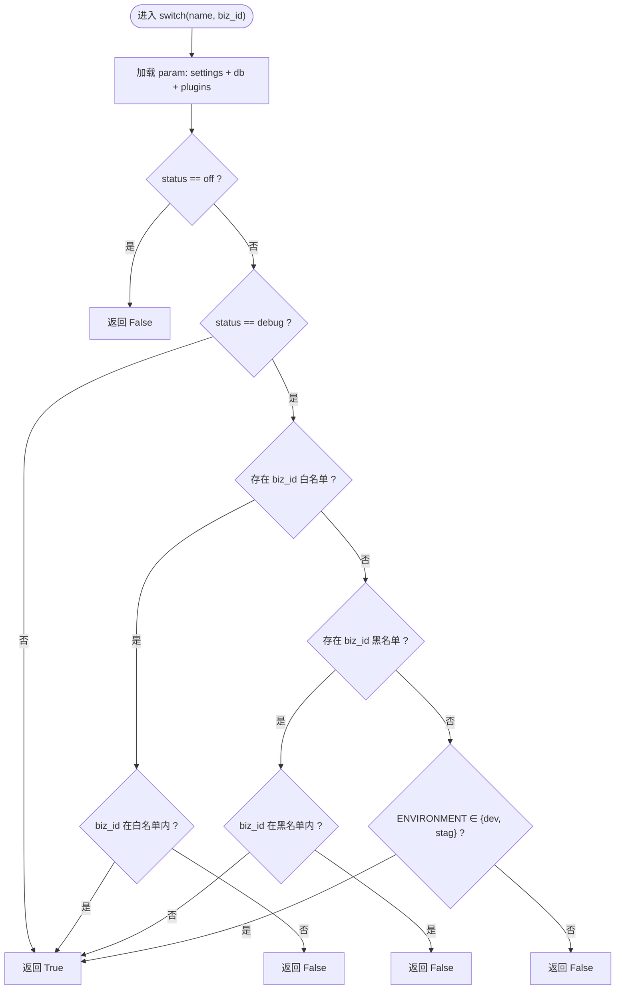
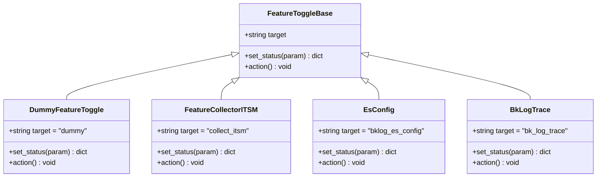
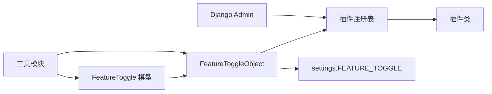

# 功能开关

<cite>
**本文引用的文件**
- [apps/feature_toggle/models.py](file://bklog/apps/feature_toggle/models.py)
- [apps/feature_toggle/handlers/toggle.py](file://bklog/apps/feature_toggle/handlers/toggle.py)
- [apps/feature_toggle/plugins/base.py](file://bklog/apps/feature_toggle/plugins/base.py)
- [apps/feature_toggle/plugins/constants.py](file://bklog/apps/feature_toggle/plugins/constants.py)
- [apps/feature_toggle/constants.py](file://bklog/apps/feature_toggle/constants.py)
- [apps/feature_toggle/admin.py](file://bklog/apps/feature_toggle/admin.py)
- [apps/feature_toggle/migrations/0001_initial.py](file://bklog/apps/feature_toggle/migrations/0001_initial.py)
- [apps/feature_toggle/migrations/0008_featuretoggle_biz_id_black_list.py](file://bklog/apps/feature_toggle/migrations/0008_featuretoggle_biz_id_black_list.py)
- [apps/utils/db.py](file://bklog/apps/utils/db.py)
</cite>

## 目录
1. [简介](#简介)
2. [项目结构](#项目结构)
3. [核心组件](#核心组件)
4. [架构总览](#架构总览)
5. [详细组件分析](#详细组件分析)
6. [依赖关系分析](#依赖关系分析)
7. [性能考量](#性能考量)
8. [故障排查指南](#故障排查指南)
9. [结论](#结论)
10. [附录](#附录)

## 简介
本文件系统性阐述蓝鲸日志平台中的“功能开关”机制，覆盖其在系统安全与灰度发布中的作用、数据模型设计（开关标识、业务范围限制、默认值配置）、运行时判断逻辑、API 动态调整能力、安全使用最佳实践，以及典型应用场景（如敏感功能逐步上线、租户级功能隔离）。

功能开关通过统一的状态来源与插件扩展机制，支持：
- 多环境灰度控制（仅在测试/预发布环境可见）
- 租户级白名单/黑名单控制（按业务 ID 或空间 UID）
- 用户级白名单控制（按用户名）
- 插件化动态注入配置（如 ITSM 服务 ID、ES 配置等）

## 项目结构
功能开关相关代码主要集中在 feature_toggle 子模块，并与通用工具模块协同工作：
- 数据模型与迁移：FeatureToggle 模型及黑白名单字段迁移
- 运行时判断与聚合：FeatureToggleObject 提供统一查询与状态判定
- 插件体系：基于注册表的插件扩展，用于动态改写状态或注入配置
- 管理后台：Django Admin 界面管理开关与触发插件动作
- 前端配置下发：工具模块将开关状态与白名单打包下发至前端

图表来源
- [apps/feature_toggle/models.py](file://bklog/apps/feature_toggle/models.py#L29-L46)
- [apps/feature_toggle/handlers/toggle.py](file://bklog/apps/feature_toggle/handlers/toggle.py#L62-L158)
- [apps/feature_toggle/plugins/base.py](file://bklog/apps/feature_toggle/plugins/base.py#L32-L72)
- [apps/feature_toggle/plugins/constants.py](file://bklog/apps/feature_toggle/plugins/constants.py#L21-L72)
- [apps/feature_toggle/constants.py](file://bklog/apps/feature_toggle/constants.py#L22-L25)
- [apps/feature_toggle/admin.py](file://bklog/apps/feature_toggle/admin.py#L38-L43)
- [apps/feature_toggle/migrations/0001_initial.py](file://bklog/apps/feature_toggle/migrations/0001_initial.py#L35-L65)
- [apps/feature_toggle/migrations/0008_featuretoggle_biz_id_black_list.py](file://bklog/apps/feature_toggle/migrations/0008_featuretoggle_biz_id_black_list.py#L13-L17)
- [apps/utils/db.py](file://bklog/apps/utils/db.py#L99-L154)

章节来源
- [apps/feature_toggle/models.py](file://bklog/apps/feature_toggle/models.py#L29-L46)
- [apps/feature_toggle/handlers/toggle.py](file://bklog/apps/feature_toggle/handlers/toggle.py#L62-L158)
- [apps/feature_toggle/plugins/base.py](file://bklog/apps/feature_toggle/plugins/base.py#L32-L72)
- [apps/feature_toggle/plugins/constants.py](file://bklog/apps/feature_toggle/plugins/constants.py#L21-L72)
- [apps/feature_toggle/constants.py](file://bklog/apps/feature_toggle/constants.py#L22-L25)
- [apps/feature_toggle/admin.py](file://bklog/apps/feature_toggle/admin.py#L38-L43)
- [apps/feature_toggle/migrations/0001_initial.py](file://bklog/apps/feature_toggle/migrations/0001_initial.py#L35-L65)
- [apps/feature_toggle/migrations/0008_featuretoggle_biz_id_black_list.py](file://bklog/apps/feature_toggle/migrations/0008_featuretoggle_biz_id_black_list.py#L13-L17)
- [apps/utils/db.py](file://bklog/apps/utils/db.py#L99-L154)

## 核心组件
- 数据模型 FeatureToggle
  - 字段：名称、别名、状态、描述、是否前端展示、特性配置 JSON、业务白名单、业务黑名单
  - 默认值：状态默认 off；白名单/黑名单默认空
- 运行时判断 FeatureToggleObject
  - 优先级：settings 中 FEATURE_TOGGLE > 数据库 FeatureToggle > 插件扩展
  - 判定规则：off 直接禁用；debug 仅在 dev/stag 生效；支持业务白名单/黑名单；支持用户白名单
- 插件体系 FeatureToggleBase
  - 注册表 FEATURE_TOGGLE，按 target 分发执行 set_status/action
  - 示例插件：ITSM 服务 ID 注入、ES 配置补全、trace 仪器化等
- 管理后台
  - Admin 展示字段与批量动作，可触发插件 action
- 前端配置下发
  - 工具模块将开关状态与各类白名单打包下发，前端据此渲染

章节来源
- [apps/feature_toggle/models.py](file://bklog/apps/feature_toggle/models.py#L29-L46)
- [apps/feature_toggle/handlers/toggle.py](file://bklog/apps/feature_toggle/handlers/toggle.py#L62-L158)
- [apps/feature_toggle/plugins/base.py](file://bklog/apps/feature_toggle/plugins/base.py#L32-L72)
- [apps/feature_toggle/admin.py](file://bklog/apps/feature_toggle/admin.py#L38-L43)
- [apps/utils/db.py](file://bklog/apps/utils/db.py#L99-L154)

## 架构总览
功能开关的整体调用链如下：
- 应用侧通过 FeatureToggleObject.switch(name, biz_id) 获取开关状态
- 若数据库中无记录，则回退到 settings.FEATURE_TOGGLE 的静态配置
- 插件根据目标开关名称从注册表获取并执行 set_status，可能改写状态或注入 feature_config
- 管理后台可触发插件 action，用于初始化或变更外部资源
- 工具模块将最终开关状态与白名单打包下发至前端

图表来源
- [apps/feature_toggle/handlers/toggle.py](file://bklog/apps/feature_toggle/handlers/toggle.py#L62-L158)
- [apps/feature_toggle/plugins/base.py](file://bklog/apps/feature_toggle/plugins/base.py#L32-L72)
- [apps/feature_toggle/admin.py](file://bklog/apps/feature_toggle/admin.py#L38-L43)
- [apps/utils/db.py](file://bklog/apps/utils/db.py#L99-L154)

## 详细组件分析

### 数据模型设计
- 字段与约束
  - 名称唯一，便于精确匹配
  - 状态字段支持 off/debug/on 等枚举值（由插件与业务约定）
  - feature_config 支持任意 JSON 结构，用于注入外部配置
  - 白名单/黑名单为 JSON 字段，支持业务 ID 列表与空间 UID 列表
- 默认值与迁移
  - 初始迁移包含基础字段
  - 黑名单字段迁移于后续版本增加，以支持更细粒度的租户隔离

图表来源
- [apps/feature_toggle/migrations/0001_initial.py](file://bklog/apps/feature_toggle/migrations/0001_initial.py#L35-L65)
- [apps/feature_toggle/migrations/0008_featuretoggle_biz_id_black_list.py](file://bklog/apps/feature_toggle/migrations/0008_featuretoggle_biz_id_black_list.py#L13-L17)
- [apps/feature_toggle/models.py](file://bklog/apps/feature_toggle/models.py#L29-L46)

章节来源
- [apps/feature_toggle/models.py](file://bklog/apps/feature_toggle/models.py#L29-L46)
- [apps/feature_toggle/migrations/0001_initial.py](file://bklog/apps/feature_toggle/migrations/0001_initial.py#L35-L65)
- [apps/feature_toggle/migrations/0008_featuretoggle_biz_id_black_list.py](file://bklog/apps/feature_toggle/migrations/0008_featuretoggle_biz_id_black_list.py#L13-L17)

### 运行时判断逻辑
- 优先级与回退
  - settings.FEATURE_TOGGLE 优先
  - 数据库 FeatureToggle 记录次之
  - 插件 set_status 可改写状态或注入配置
- 环境与灰度
  - debug 状态仅在 dev/stag 环境生效
- 租户与用户白名单
  - debug+白名单：业务 ID 在白名单内才生效
  - debug+黑名单：业务 ID 在黑名单内则禁用
  - 用户白名单：用户名在 feature_config.user_white_list 内时强制启用
- 返回类型
  - Toggle 对象封装 name/status/alias/description/is_viewed/feature_config/biz_id_white_list/biz_id_black_list

图表来源
- [apps/feature_toggle/handlers/toggle.py](file://bklog/apps/feature_toggle/handlers/toggle.py#L69-L106)

章节来源
- [apps/feature_toggle/handlers/toggle.py](file://bklog/apps/feature_toggle/handlers/toggle.py#L69-L106)
- [apps/utils/db.py](file://bklog/apps/utils/db.py#L99-L154)

### 插件体系与扩展点
- 注册表与分发
  - get_feature_toggle(name) 从 FEATURE_TOGGLE 映射中查找插件类
  - register 装饰器将插件类注册到映射表
- 基类接口
  - set_status(param): 修改 param（如改写 status、注入 feature_config）
  - action(): 触发副作用（如初始化外部资源）
- 典型插件
  - ITSM 插件：当 status 非 off 时尝试获取 ITSM 服务 ID，失败则降级为 off
  - ES 配置插件：补齐全局与业务维度的 ES 配置字段
  - Trace 插件：启用链路追踪仪器化
  - Dummy 插件：占位，不做任何改动

图表来源
- [apps/feature_toggle/plugins/base.py](file://bklog/apps/feature_toggle/plugins/base.py#L32-L189)
- [apps/feature_toggle/plugins/constants.py](file://bklog/apps/feature_toggle/plugins/constants.py#L21-L72)

章节来源
- [apps/feature_toggle/plugins/base.py](file://bklog/apps/feature_toggle/plugins/base.py#L32-L189)
- [apps/feature_toggle/plugins/constants.py](file://bklog/apps/feature_toggle/plugins/constants.py#L21-L72)

### 管理后台与 API 动态调整
- 管理界面
  - FeatureToggleAdmin 展示 name/alias/status/description/is_viewed/feature_config/biz_id_white_list/biz_id_black_list
  - 支持批量触发插件 action
- 动态调整路径
  - 在 Admin 中修改 FeatureToggle 记录，即可影响运行时状态
  - 插件 action 可用于初始化外部资源（如 ITSM 服务 ID），无需重启服务
- 前端配置下发
  - 工具模块 get_toggle_data 将 FEATURE_TOGGLE、白名单等打包下发，前端据此渲染

章节来源
- [apps/feature_toggle/admin.py](file://bklog/apps/feature_toggle/admin.py#L38-L43)
- [apps/utils/db.py](file://bklog/apps/utils/db.py#L99-L154)

### 安全使用最佳实践
- 配置安全
  - 默认状态 off，避免新功能未经显式开启即暴露
  - debug 仅限 dev/stag 环境生效，生产环境必须显式开启
  - 使用业务白名单/黑名单精准放行特定租户，避免越权访问
  - 用户白名单用于内部测试或特权用户，谨慎维护
- 插件安全
  - 插件 set_status 中的异常需捕获并降级（如 ITSM 获取失败降级 off）
  - 插件 action 必须幂等，避免重复初始化造成副作用
- 前端安全
  - 前端仅依据后端下发的 FEATURE_TOGGLE 渲染，不得自行覆盖
  - 白名单字段仅用于前端展示控制，后端仍需在业务逻辑处校验权限
- 审计与回滚
  - Admin 记录变更历史，便于审计
  - 发生问题时可快速将状态切回 off 或移除白名单

章节来源
- [apps/feature_toggle/handlers/toggle.py](file://bklog/apps/feature_toggle/handlers/toggle.py#L69-L106)
- [apps/feature_toggle/plugins/base.py](file://bklog/apps/feature_toggle/plugins/base.py#L93-L107)
- [apps/feature_toggle/admin.py](file://bklog/apps/feature_toggle/admin.py#L38-L43)

### 典型应用场景
- 敏感功能的逐步上线
  - 将功能开关设为 debug，默认 off；在 dev/stag 环境通过业务白名单灰度放行
  - 逐步扩大白名单范围，最终在生产环境改为 on
- 租户级功能隔离
  - 通过 biz_id_black_list 对特定租户屏蔽功能
  - 通过 biz_id_white_list 对关键租户开放
- 用户级特权
  - 在 feature_config.user_white_list 中加入特定用户名，使其不受业务白名单限制
- 外部依赖注入
  - ITSM 插件在开启时自动注入服务 ID，失败则降级关闭
  - ES 配置插件补齐全局与业务维度的 ES 参数，避免遗漏

章节来源
- [apps/feature_toggle/handlers/toggle.py](file://bklog/apps/feature_toggle/handlers/toggle.py#L69-L106)
- [apps/feature_toggle/plugins/base.py](file://bklog/apps/feature_toggle/plugins/base.py#L93-L107)
- [apps/utils/db.py](file://bklog/apps/utils/db.py#L99-L154)

## 依赖关系分析
- 组件耦合
  - FeatureToggleObject 依赖 FeatureToggle 模型、插件注册表、settings 与忽略异常工具
  - 插件通过 get_feature_toggle 动态分发，降低硬编码耦合
  - 管理后台依赖插件 action，用于初始化外部资源
- 外部依赖
  - ITSM 插件依赖外部 ItsmHandler 获取服务 ID
  - Trace 插件依赖链路追踪仪器化组件
- 潜在循环依赖
  - 插件与 FeatureToggleObject 之间通过字符串 target 解耦，避免循环导入

图表来源
- [apps/feature_toggle/handlers/toggle.py](file://bklog/apps/feature_toggle/handlers/toggle.py#L62-L158)
- [apps/feature_toggle/plugins/base.py](file://bklog/apps/feature_toggle/plugins/base.py#L32-L72)
- [apps/feature_toggle/admin.py](file://bklog/apps/feature_toggle/admin.py#L38-L43)
- [apps/utils/db.py](file://bklog/apps/utils/db.py#L99-L154)

章节来源
- [apps/feature_toggle/handlers/toggle.py](file://bklog/apps/feature_toggle/handlers/toggle.py#L62-L158)
- [apps/feature_toggle/plugins/base.py](file://bklog/apps/feature_toggle/plugins/base.py#L32-L72)
- [apps/feature_toggle/admin.py](file://bklog/apps/feature_toggle/admin.py#L38-L43)
- [apps/utils/db.py](file://bklog/apps/utils/db.py#L99-L154)

## 性能考量
- 缓存策略
  - 缓存键与过期时间常量定义于 constants.py，建议结合缓存中间件减少数据库与插件调用开销
- 查询优化
  - toggle_list 会遍历 settings 与数据库，建议在高并发场景下对结果进行缓存
- 插件执行
  - 插件 set_status 可能涉及外部调用（如 ITSM），应设置超时与熔断，失败时降级
- 前端下发
  - get_toggle_data 将 FEATURE_TOGGLE 与多类白名单打包，建议按需裁剪，避免传输冗余

章节来源
- [apps/feature_toggle/constants.py](file://bklog/apps/feature_toggle/constants.py#L22-L25)
- [apps/feature_toggle/handlers/toggle.py](file://bklog/apps/feature_toggle/handlers/toggle.py#L148-L158)
- [apps/utils/db.py](file://bklog/apps/utils/db.py#L99-L154)

## 故障排查指南
- 开关未生效
  - 检查 settings.FEATURE_TOGGLE 是否存在该开关项
  - 确认数据库 FeatureToggle 记录是否存在，状态是否为 off
  - debug 状态仅在 dev/stag 环境生效
- 白名单/黑名单不生效
  - 确认 biz_id_white_list/biz_id_black_list 类型为列表
  - 确认传入的 biz_id 与列表元素类型一致
- 用户白名单无效
  - 确认 feature_config.user_white_list 是否包含当前用户名
- 插件异常
  - ITSM 插件获取失败会降级为 off，检查外部服务可用性
  - 插件 action 幂等性，避免重复初始化
- 管理后台操作无效
  - 确认 Admin 中已选择对应记录并触发 action
  - 查看日志输出定位异常

章节来源
- [apps/feature_toggle/handlers/toggle.py](file://bklog/apps/feature_toggle/handlers/toggle.py#L69-L106)
- [apps/feature_toggle/plugins/base.py](file://bklog/apps/feature_toggle/plugins/base.py#L93-L107)
- [apps/feature_toggle/admin.py](file://bklog/apps/feature_toggle/admin.py#L38-L43)
- [apps/utils/db.py](file://bklog/apps/utils/db.py#L99-L154)

## 结论
功能开关机制通过“settings > 数据库 > 插件”的三层优先级与灵活的白名单/黑名单控制，实现了对敏感功能的渐进式发布与租户级隔离。配合管理后台与插件 action，可在不重启服务的情况下完成动态调整。遵循默认 off、debug 仅限测试环境、白名单最小化与插件降级等最佳实践，可有效降低配置错误带来的安全风险。

## 附录
- 关键流程参考路径
  - 运行时判断：[apps/feature_toggle/handlers/toggle.py](file://bklog/apps/feature_toggle/handlers/toggle.py#L69-L106)
  - 插件注册与分发：[apps/feature_toggle/plugins/base.py](file://bklog/apps/feature_toggle/plugins/base.py#L32-L72)
  - 数据模型与迁移：[apps/feature_toggle/models.py](file://bklog/apps/feature_toggle/models.py#L29-L46)、[apps/feature_toggle/migrations/0001_initial.py](file://bklog/apps/feature_toggle/migrations/0001_initial.py#L35-L65)、[apps/feature_toggle/migrations/0008_featuretoggle_biz_id_black_list.py](file://bklog/apps/feature_toggle/migrations/0008_featuretoggle_biz_id_black_list.py#L13-L17)
  - 前端配置下发：[apps/utils/db.py](file://bklog/apps/utils/db.py#L99-L154)
  - 管理后台：[apps/feature_toggle/admin.py](file://bklog/apps/feature_toggle/admin.py#L38-L43)