# 安全与权限

<cite>
**本文档引用的文件**  
- [permission.py](file://bklog/apps/iam/handlers/permission.py)
- [actions.py](file://bklog/apps/iam/handlers/actions.py)
- [resources.py](file://bklog/apps/iam/handlers/resources.py)
- [models.py](file://bklog/apps/feature_toggle/models.py)
- [audit.py](file://bklog/apps/bk_log_admin/handlers/audit_record.py)
- [log_audit/models.py](file://bklog/apps/log_audit/models.py)
- [desensitize_rule_views.py](file://bklog/apps/log_desensitize/views/desensitize_rule_views.py)
- [desensitize_field_config.py](file://bklog/apps/log_desensitize/models.py)
- [apigw.py](file://bklog/apps/middleware/apigw.py)
- [aes.py](file://bklog/apps/utils/aes.py)
- [token.py](file://bklog/apps/log_commons/token.py)
- [qos.py](file://bklog/apps/log_esquery/qos.py)
</cite>

## 目录
1. [引言](#引言)
2. [IAM集成方案](#iam集成方案)
3. [功能开关机制](#功能开关机制)
4. [审计日志功能](#审计日志功能)
5. [API安全措施](#api安全措施)
6. [数据安全考虑](#数据安全考虑)
7. [安全最佳实践](#安全最佳实践)

## 引言

本文档全面介绍了蓝鲸日志平台的安全与权限机制。系统通过集成蓝鲸权限中心(IAM)实现细粒度的访问控制，采用功能开关(Feature Toggle)机制进行安全功能的灰度发布，提供完整的审计日志记录关键操作，并实施多层次的API安全措施保护系统免受攻击。同时，系统还实现了敏感信息保护、数据加密和脱敏处理等数据安全机制。

## IAM集成方案

蓝鲸日志平台通过与蓝鲸权限中心(IAM)深度集成，实现了基于角色的访问控制(RBAC)和基于属性的访问控制(ABAC)相结合的权限模型。系统定义了清晰的权限模型、角色定义和访问控制策略，确保用户只能访问其被授权的资源和操作。

### 权限模型

系统实现了基于动作(Action)、资源(Resource)和用户(Subject)三要素的权限模型。每个权限请求都包含用户身份、请求的动作和目标资源，通过权限中心进行策略评估和决策。

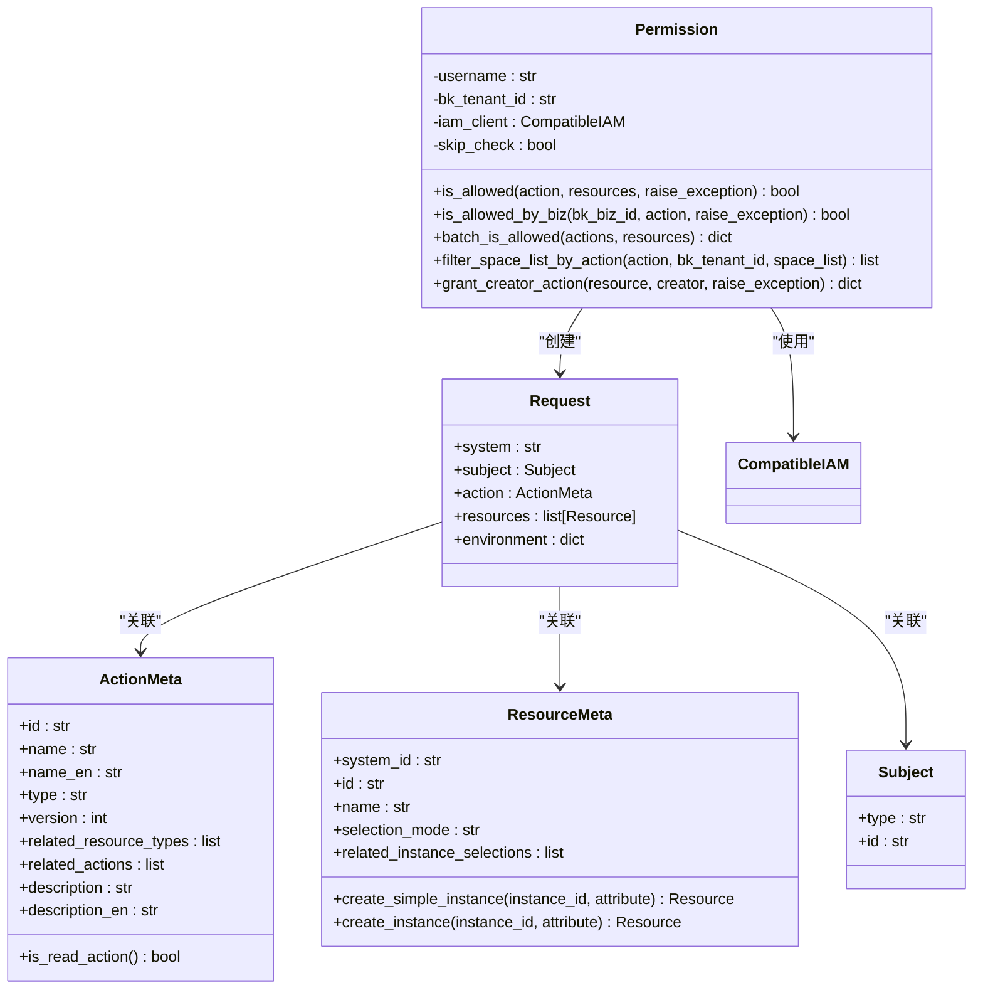

**图源**  
- [actions.py](file://bklog/apps/iam/handlers/actions.py#L29-L75)
- [resources.py](file://bklog/apps/iam/handlers/resources.py#L34-L79)
- [permission.py](file://bklog/apps/iam/handlers/permission.py#L57-L444)

**本节源码**  
- [actions.py](file://bklog/apps/iam/handlers/actions.py)
- [resources.py](file://bklog/apps/iam/handlers/resources.py)
- [permission.py](file://bklog/apps/iam/handlers/permission.py)

### 角色定义

系统定义了多种预设角色，每个角色对应一组权限集合。角色定义基于业务场景和职责分离原则，确保权限分配的合理性和安全性。

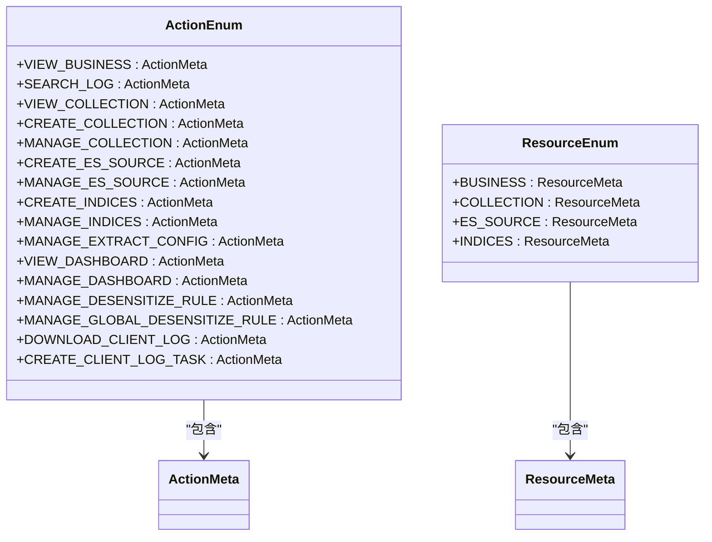

**图源**  
- [actions.py](file://bklog/apps/iam/handlers/actions.py#L76-L237)
- [resources.py](file://bklog/apps/iam/handlers/resources.py#L218-L227)

**本节源码**  
- [actions.py](file://bklog/apps/iam/handlers/actions.py)
- [resources.py](file://bklog/apps/iam/handlers/resources.py)

### 访问控制策略

系统实现了多层次的访问控制策略，包括基于业务的访问控制、批量权限检查和资源创建者权限自动授予等机制。

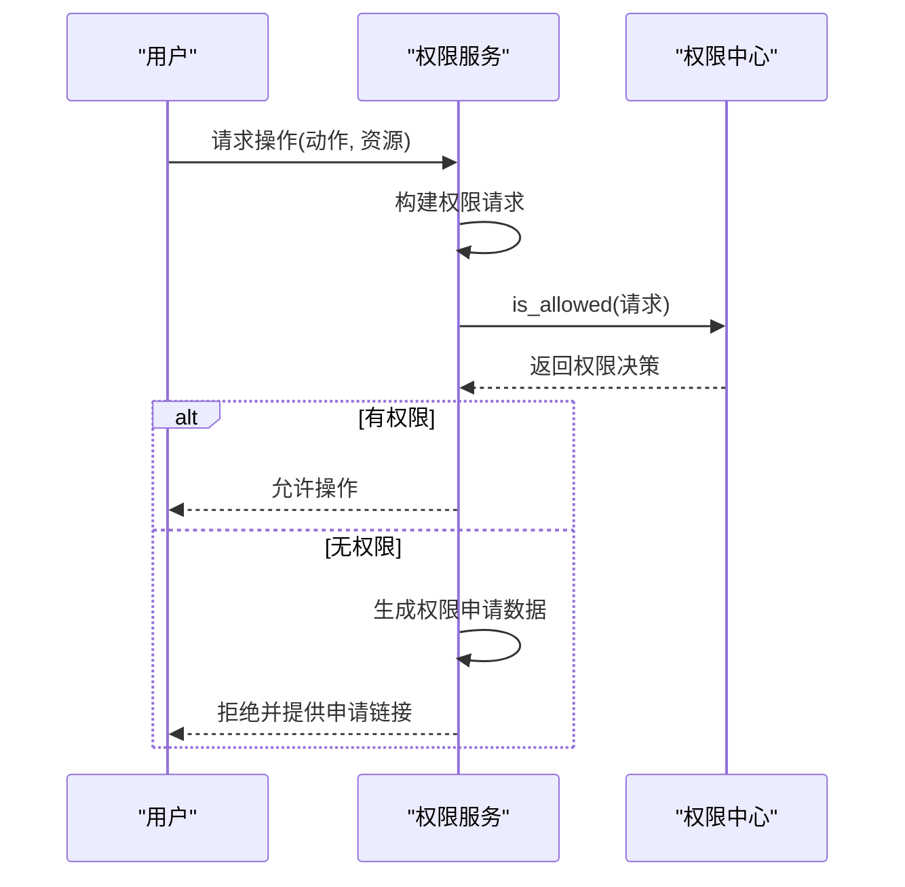

**图源**  
- [permission.py](file://bklog/apps/iam/handlers/permission.py#L249-L283)

**本节源码**  
- [permission.py](file://bklog/apps/iam/handlers/permission.py)

## 功能开关机制

系统采用功能开关(Feature Toggle)机制来管理功能的启用状态，特别适用于安全功能的灰度发布和风险控制。

### 功能开关模型

功能开关模型定义了开关的名称、状态、配置和业务范围限制等属性，支持白名单和黑名单机制。

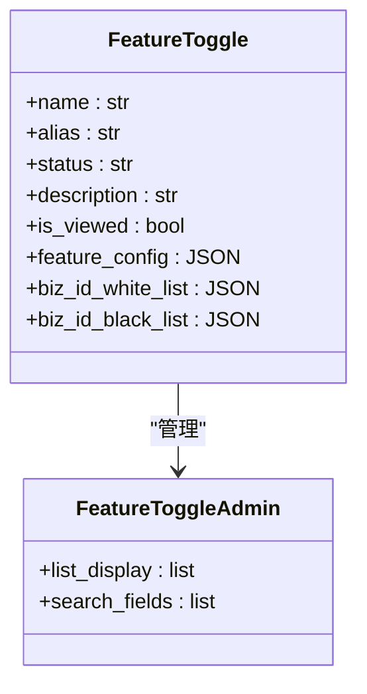

**图源**  
- [models.py](file://bklog/apps/feature_toggle/models.py#L29-L46)

**本节源码**  
- [models.py](file://bklog/apps/feature_toggle/models.py)

### 灰度发布流程

功能开关机制支持安全功能的灰度发布，通过业务白名单逐步扩大功能范围，降低新功能带来的安全风险。

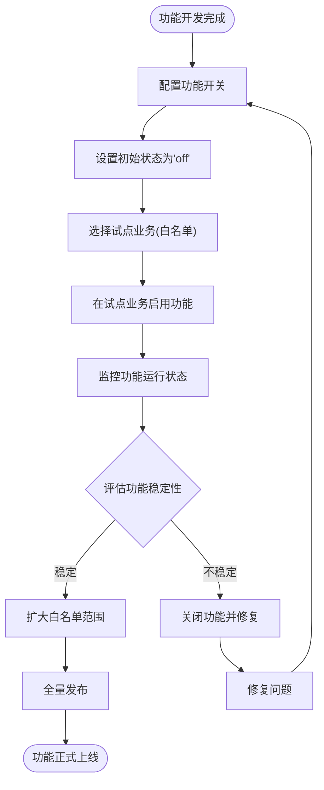

**本节源码**  
- [models.py](file://bklog/apps/feature_toggle/models.py)

## 审计日志功能

系统提供了完整的审计日志功能，记录所有关键操作，支持安全审计和问题追溯。

### 审计日志模型

审计日志模型记录了操作时间、操作者、业务ID、操作类型、操作对象和请求参数等关键信息。

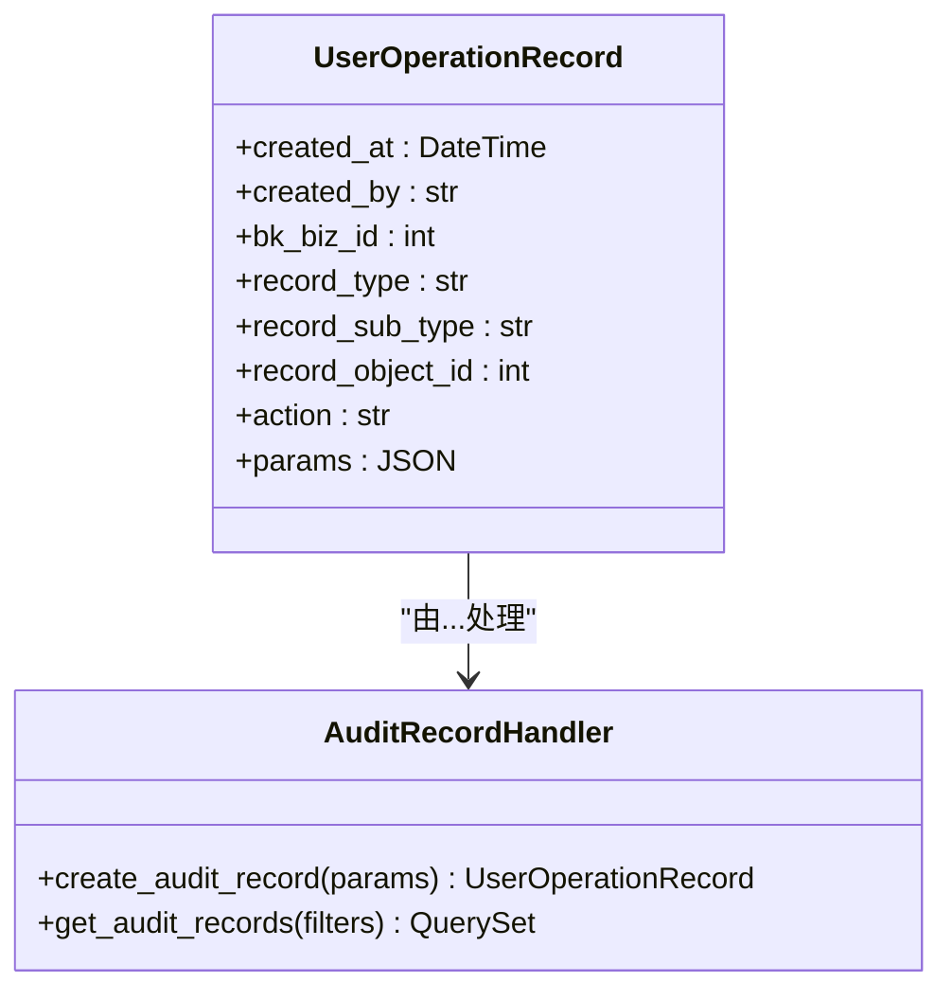

**图源**  
- [models.py](file://bklog/apps/log_audit/models.py#L29-L42)
- [audit_record.py](file://bklog/apps/bk_log_admin/handlers/audit_record.py)

**本节源码**  
- [models.py](file://bklog/apps/log_audit/models.py)
- [audit_record.py](file://bklog/apps/bk_log_admin/handlers/audit_record.py)

### 审计流程

系统在关键操作执行前后记录审计日志，确保所有操作都有迹可循。

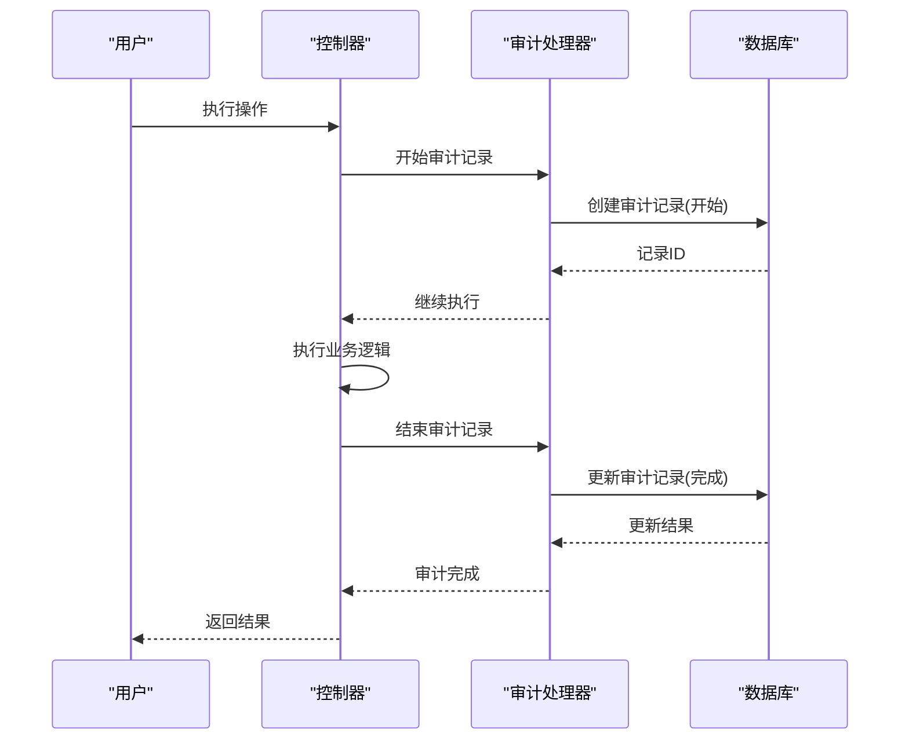

**本节源码**  
- [audit_record.py](file://bklog/apps/bk_log_admin/handlers/audit_record.py)

## API安全措施

系统实施了多层次的API安全措施，包括认证、授权、速率限制和防攻击策略，确保API接口的安全性。

### 认证机制

系统采用JWT(JSON Web Token)认证机制，通过API网关进行令牌验证和用户身份识别。

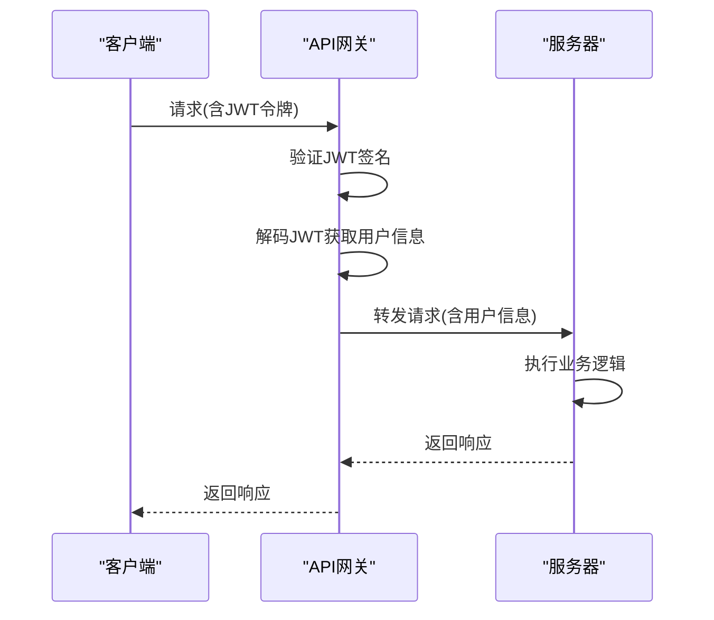

**图源**  
- [apigw.py](file://bklog/apps/middleware/apigw.py#L95-L124)

**本节源码**  
- [apigw.py](file://bklog/apps/middleware/apigw.py)

### 速率限制

系统实现了基于Redis的速率限制机制，防止API被滥用和拒绝服务攻击。

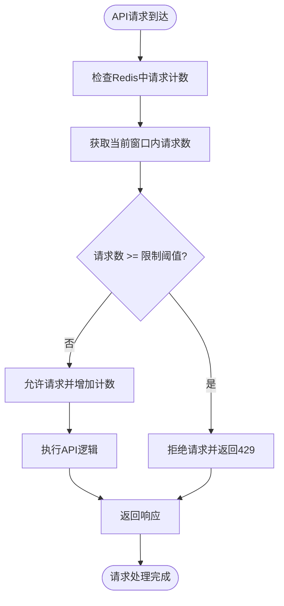

**图源**  
- [qos.py](file://bklog/apps/log_esquery/qos.py#L118-L144)

**本节源码**  
- [qos.py](file://bklog/apps/log_esquery/qos.py)

## 数据安全考虑

系统在数据安全方面采取了多项措施，包括敏感信息保护、数据加密和脱敏处理，确保数据的机密性和完整性。

### 敏感信息保护

系统对敏感信息进行特殊处理，防止敏感数据泄露。

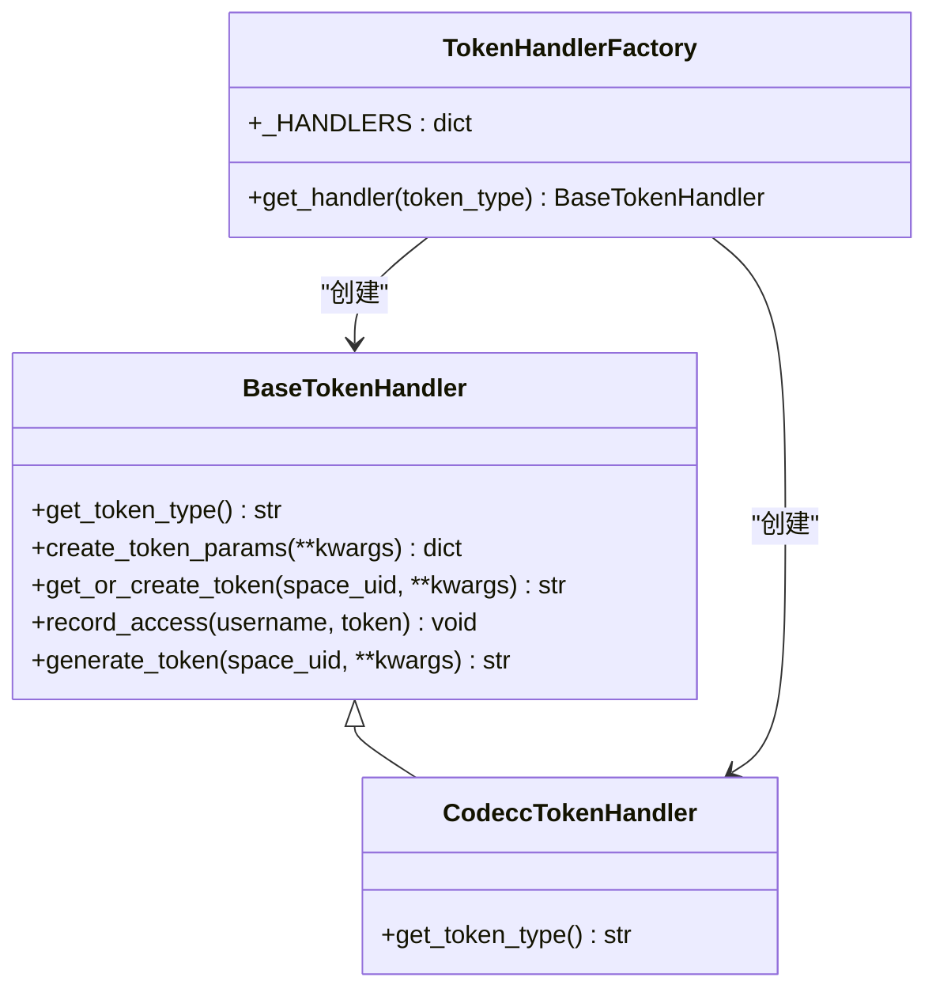

**图源**  
- [token.py](file://bklog/apps/log_commons/token.py#L11-L90)

**本节源码**  
- [token.py](file://bklog/apps/log_commons/token.py)

### 数据加密

系统使用AES-256加密算法对敏感数据进行加密存储，确保数据在静态状态下的安全性。

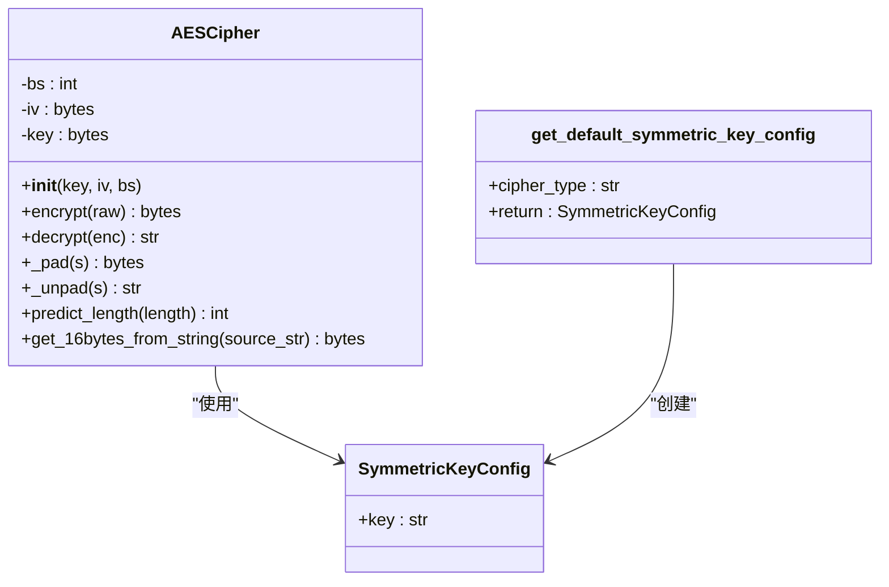

**图源**  
- [aes.py](file://bklog/apps/utils/aes.py#L35-L132)

**本节源码**  
- [aes.py](file://bklog/apps/utils/aes.py)

### 数据脱敏

系统提供了灵活的数据脱敏机制，支持多种脱敏规则和字段配置，保护敏感信息。

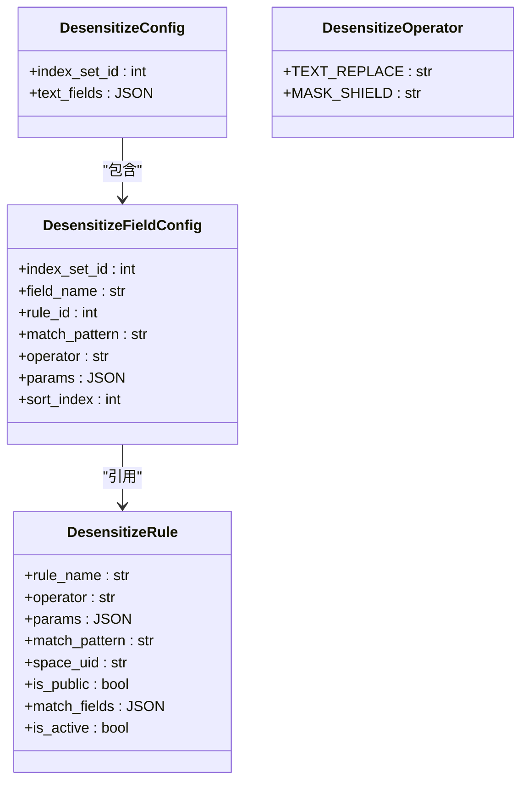

**图源**  
- [desensitize_field_config.py](file://bklog/apps/log_desensitize/models.py#L29-L80)

**本节源码**  
- [desensitize_field_config.py](file://bklog/apps/log_desensitize/models.py)
- [desensitize_rule_views.py](file://bklog/apps/log_desensitize/views/desensitize_rule_views.py)

## 安全最佳实践

为确保系统安全运行，建议遵循以下最佳实践：

### 部署安全

- 使用HTTPS加密所有通信
- 定期更新系统和依赖组件
- 最小化服务运行权限
- 配置防火墙规则限制访问

### 使用安全

- 遵循最小权限原则分配用户权限
- 定期审查和清理过期权限
- 启用审计日志并定期审查
- 对敏感操作实施多因素认证
- 使用功能开关机制进行新功能灰度发布
- 定期备份关键数据

### 监控与响应

- 建立安全事件监控和告警机制
- 制定安全事件响应预案
- 定期进行安全审计和渗透测试
- 及时响应和修复安全漏洞