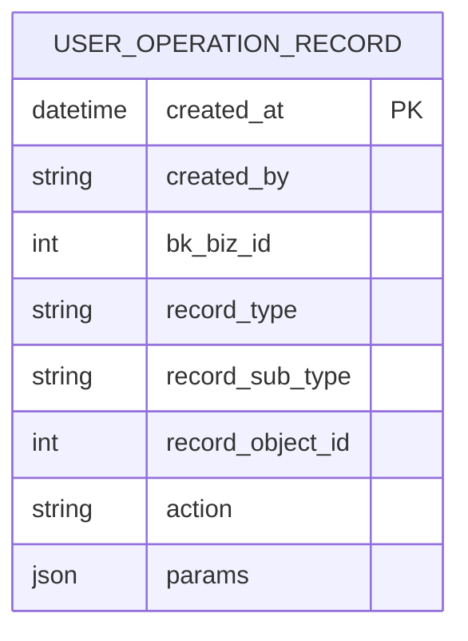
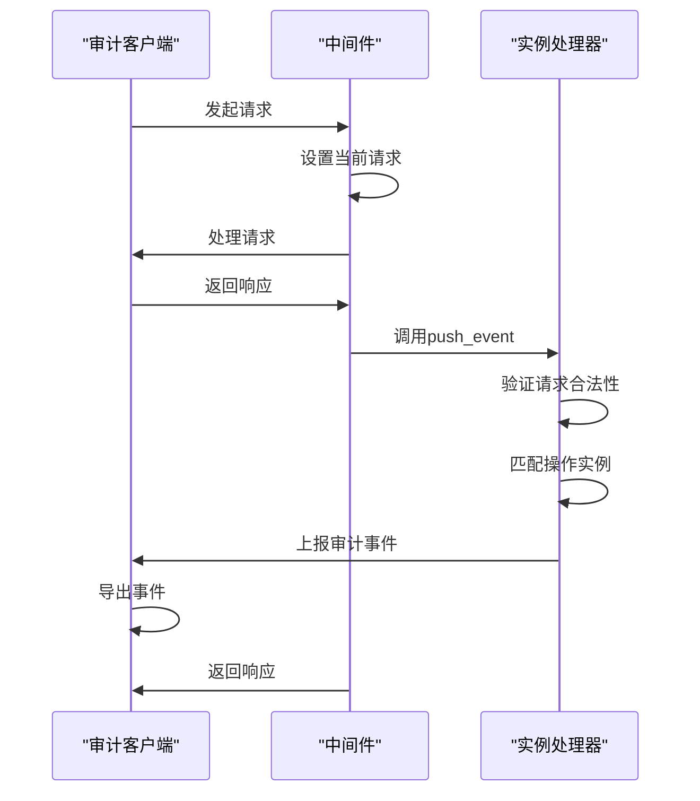
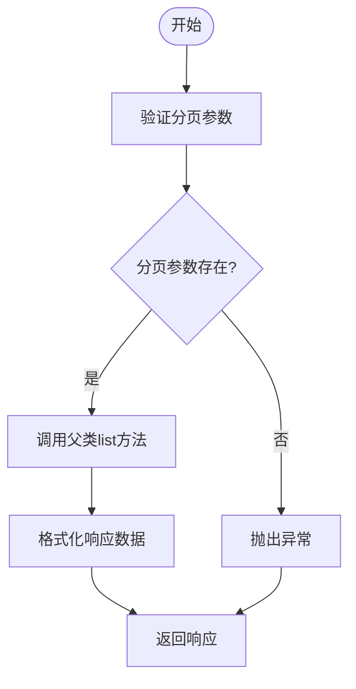
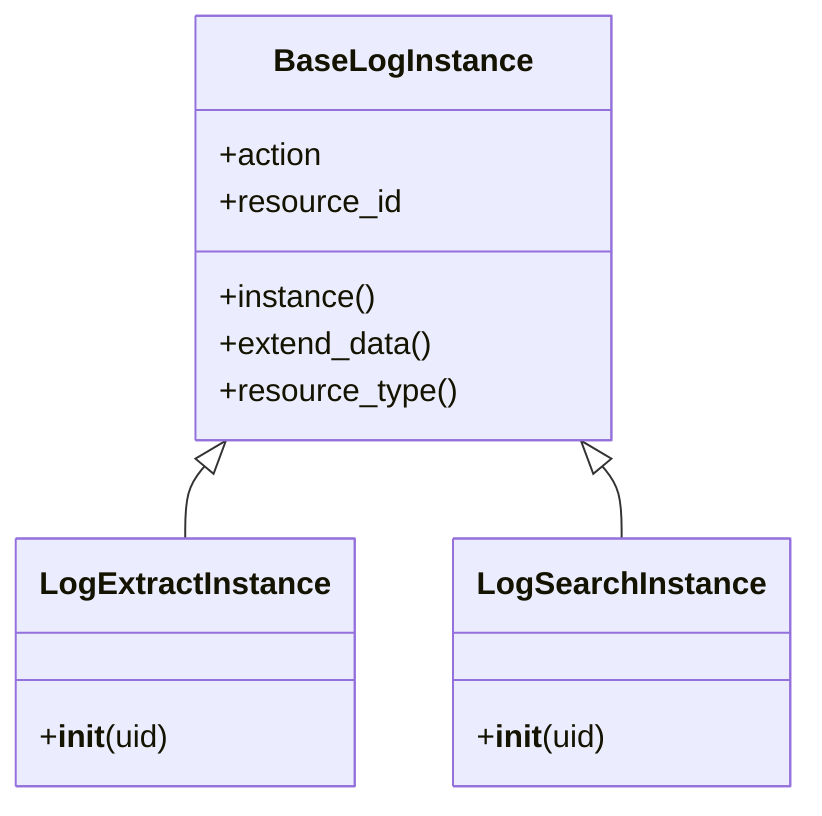
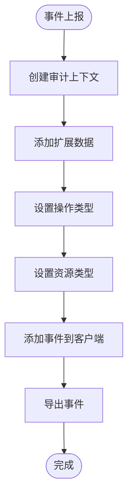

# 审计日志

<cite>
**本文档引用的文件**
- [models.py](file://bklog/apps/log_audit/models.py)
- [middleware.py](file://bklog/apps/log_audit/middleware.py)
- [client.py](file://bklog/apps/log_audit/client.py)
- [instance.py](file://bklog/apps/log_audit/instance.py)
- [admin.py](file://bklog/apps/log_audit/admin.py)
- [audit_record_views.py](file://bklog/apps/bk_log_admin/views/audit_record_views.py)
- [audit_record.py](file://bklog/apps/bk_log_admin/handlers/audit_record.py)
- [serializers.py](file://bklog/apps/bk_log_admin/serializers.py)
</cite>

## 目录
1. [简介](#简介)
2. [数据模型](#数据模型)
3. [日志采集流程](#日志采集流程)
4. [存储策略与查询接口](#存储策略与查询接口)
5. [扩展方法](#扩展方法)
6. [完整性保护措施](#完整性保护措施)
7. [结论](#结论)

## 简介
审计日志系统是蓝鲸日志平台的关键安全组件，用于记录系统中所有关键操作的详细信息。该系统通过中间件自动捕获用户行为，确保所有操作都有据可查，满足安全合规性审查的要求。审计日志记录了操作类型、操作人、目标对象和时间戳等关键字段，为系统安全提供了坚实的基础。

## 数据模型
审计日志的数据模型定义了记录操作日志所需的所有字段。核心模型是`UserOperationRecord`，它包含了操作时间、操作者、业务ID、操作对象类型、操作对象子类型、操作对象ID、操作方法和请求参数等字段。

**图示来源**
- [models.py](file://bklog/apps/log_audit/models.py#L29-L42)

**本节来源**
- [models.py](file://bklog/apps/log_audit/models.py#L29-L42)

## 日志采集流程
审计日志的采集通过中间件实现，系统在请求处理过程中自动捕获用户行为。`RequestProvider`中间件在请求开始时设置当前请求，在请求结束时调用`push_event`函数上报审计日志。

**图示来源**
- [middleware.py](file://bklog/apps/log_audit/middleware.py#L12-L26)
- [instance.py](file://bklog/apps/log_audit/instance.py#L88-L128)

**本节来源**
- [middleware.py](file://bklog/apps/log_audit/middleware.py#L12-L26)
- [instance.py](file://bklog/apps/log_audit/instance.py#L88-L128)

## 存储策略与查询接口
审计日志的存储基于Django模型，使用数据库持久化存储。系统提供了RESTful API接口用于查询审计记录，支持分页、按操作类型、操作对象ID和业务ID等条件过滤。

**图示来源**
- [audit_record_views.py](file://bklog/apps/bk_log_admin/views/audit_record_views.py#L41-L85)

**本节来源**
- [admin.py](file://bklog/apps/log_audit/admin.py#L29-L48)
- [audit_record_views.py](file://bklog/apps/bk_log_admin/views/audit_record_views.py#L32-L85)
- [serializers.py](file://bklog/apps/bk_log_admin/serializers.py#L52-L60)

## 扩展方法
审计日志系统设计了灵活的扩展机制，允许新模块接入审计体系。通过定义新的实例类和在`InstanceFilter`中添加URL模式匹配规则，可以轻松扩展审计功能。

**图示来源**
- [instance.py](file://bklog/apps/log_audit/instance.py#L48-L87)

**本节来源**
- [instance.py](file://bklog/apps/log_audit/instance.py#L48-L221)
- [client.py](file://bklog/apps/log_audit/client.py#L23-L34)

## 完整性保护措施
审计日志系统通过多种措施确保日志的完整性，防止篡改。系统使用`bk_audit`客户端库，该库提供了安全的事件上报机制。审计事件在创建时包含完整的上下文信息，并通过安全的导出机制确保日志不被修改。

**图示来源**
- [instance.py](file://bklog/apps/log_audit/instance.py#L112-L128)

**本节来源**
- [client.py](file://bklog/apps/log_audit/client.py#L30-L34)
- [instance.py](file://bklog/apps/log_audit/instance.py#L112-L128)

## 结论
蓝鲸日志平台的审计日志系统提供了一套完整的操作记录机制，通过自动化的中间件采集、结构化的数据模型、灵活的查询接口和安全的完整性保护措施，确保了系统操作的可追溯性和安全性。该系统不仅满足了基本的审计需求，还提供了良好的扩展性，便于新模块的接入和功能的扩展。