# 权限管理 (IAM集成)

<cite>
**本文档引用文件**   
- [permission.py](file://bklog/apps/iam/handlers/permission.py)
- [actions.py](file://bklog/apps/iam/handlers/actions.py)
- [resources.py](file://bklog/apps/iam/handlers/resources.py)
- [drf.py](file://bklog/apps/iam/handlers/drf.py)
- [compatible.py](file://bklog/apps/iam/handlers/compatible.py)
- [meta.py](file://bklog/apps/iam/views/meta.py)
- [resources.py](file://bklog/apps/iam/views/resources.py)
- [iam_upgrade_action_v2.py](file://bklog/apps/iam/management/commands/iam_upgrade_action_v2.py)
- [exceptions.py](file://bklog/apps/iam/exceptions.py)
- [generic.py](file://bklog/apps/generic.py)
</cite>

## 目录
1. [简介](#简介)
2. [权限模型设计](#权限模型设计)
3. [权限校验流程](#权限校验流程)
4. [DRF权限类实现](#drf权限类实现)
5. [权限缓存与性能优化](#权限缓存与性能优化)
6. [自定义权限策略](#自定义权限策略)
7. [兼容性迁移](#兼容性迁移)
8. [最佳实践](#最佳实践)

## 简介

本系统通过蓝鲸IAM（Identity and Access Management）实现细粒度的访问控制，为日志平台提供安全可靠的权限管理机制。系统采用基于操作（Action）与资源（Resource）的权限模型，将用户权限与具体操作和资源实例进行关联，实现精确到具体功能和数据的访问控制。

权限系统的核心组件包括权限定义、权限校验、权限申请和权限数据管理。通过与蓝鲸IAM的深度集成，系统能够实现统一的权限管理和跨平台的权限互通。权限校验贯穿于API请求处理的整个生命周期，从请求进入系统开始，到最终返回响应结束，确保每个操作都经过严格的权限验证。

系统支持多种权限校验模式，包括单实例权限校验、批量实例权限校验和业务级权限校验，满足不同场景下的权限控制需求。同时，系统还提供了权限数据注入功能，能够在返回数据中自动添加权限信息，方便前端进行权限相关的UI展示。

**Section sources**
- [permission.py](file://bklog/apps/iam/handlers/permission.py#L1-L444)
- [actions.py](file://bklog/apps/iam/handlers/actions.py#L1-L291)
- [resources.py](file://bklog/apps/iam/handlers/resources.py#L1-L240)

## 权限模型设计

### 操作（Action）定义

系统中的操作（Action）代表用户可以执行的具体功能，每个操作都有唯一的ID、名称和类型。操作类型包括"view"（查看）、"create"（创建）、"manage"（管理）等，用于区分不同级别的权限需求。

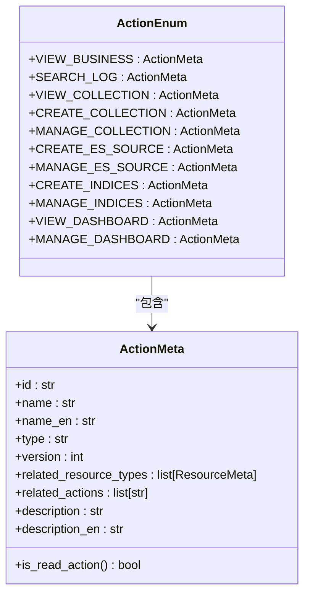

**Diagram sources**
- [actions.py](file://bklog/apps/iam/handlers/actions.py#L29-L291)

系统定义了多种操作类型，主要包括：

- **业务访问类**：如`VIEW_BUSINESS`（业务访问），允许用户访问特定业务空间
- **日志检索类**：如`SEARCH_LOG`（日志检索），允许用户在特定索引集中检索日志
- **采集管理类**：如`CREATE_COLLECTION`（采集新建）、`MANAGE_COLLECTION`（采集管理），分别控制采集项的创建和管理权限
- **ES源管理类**：如`CREATE_ES_SOURCE`（ES源配置新建）、`MANAGE_ES_SOURCE`（ES源配置管理），控制ES源的创建和管理权限
- **索引集管理类**：如`CREATE_INDICES`（索引集配置新建）、`MANAGE_INDICES`（索引集配置管理），控制索引集的创建和管理权限
- **仪表盘管理类**：如`VIEW_DASHBOARD`（仪表盘查看）、`MANAGE_DASHBOARD`（仪表盘管理），控制仪表盘的查看和管理权限

所有操作定义都继承自`ActionMeta`基类，该类提供了操作的基本属性和方法。通过`ActionEnum`枚举类统一管理所有操作定义，便于在系统中引用和使用。

### 资源（Resource）定义

资源（Resource）代表系统中的可被操作的对象，如业务、采集项、ES源、索引集等。每个资源类型都有唯一的ID、系统ID和名称，用于在权限系统中标识和区分不同类型的资源。

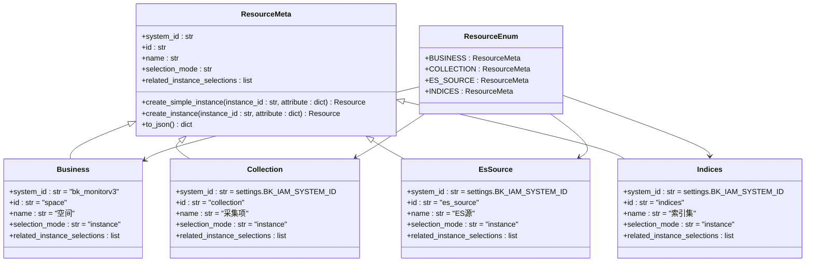

**Diagram sources**
- [resources.py](file://bklog/apps/iam/handlers/resources.py#L34-L240)

系统定义了以下主要资源类型：

- **业务（Business）**：代表一个业务空间，是其他资源的容器。业务资源的ID为"space"，系统ID为"bk_monitorv3"
- **采集项（Collection）**：代表一个日志采集配置，包含采集规则、目标等信息。采集项资源的ID为"collection"
- **ES源（EsSource）**：代表一个Elasticsearch集群连接配置。ES源资源的ID为"es_source"
- **索引集（Indices）**：代表一组Elasticsearch索引的集合，用于日志检索。索引集资源的ID为"indices"

每个资源类型都继承自`ResourceMeta`基类，该类定义了资源的基本属性和创建实例的方法。`ResourceEnum`枚举类统一管理所有资源类型定义，便于在系统中引用和使用。

### 操作与资源关系

操作与资源之间存在明确的关联关系，每个操作可以关联一个或多个资源类型。这种关联关系在操作定义中通过`related_resource_types`属性指定，用于确定执行该操作需要哪些资源的权限。

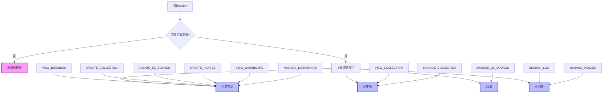

**Diagram sources**
- [actions.py](file://bklog/apps/iam/handlers/actions.py#L77-L237)
- [resources.py](file://bklog/apps/iam/handlers/resources.py#L80-L227)

操作与资源的关联关系具有以下特点：

1. **一对一关系**：大多数操作只关联一个资源类型，如`VIEW_COLLECTION`只关联`COLLECTION`资源
2. **一对多关系**：少数操作可能关联多个资源类型，但当前系统中所有操作都只关联一个资源类型
3. **层级关系**：某些操作关联的资源是其他资源的容器，如`CREATE_COLLECTION`关联`BUSINESS`资源，因为采集项必须在业务空间内创建
4. **读写分离**：读操作和写操作通常定义为不同的操作，即使它们作用于同一资源类型，如`VIEW_COLLECTION`和`MANAGE_COLLECTION`

这种设计使得权限控制更加精细，可以根据用户的具体需求授予不同级别的权限，避免权限过度分配。

**Section sources**
- [actions.py](file://bklog/apps/iam/handlers/actions.py#L77-L237)
- [resources.py](file://bklog/apps/iam/handlers/resources.py#L80-L227)

## 权限校验流程

### 校验链路概述

权限校验流程从API请求进入系统开始，经过多个中间件和权限类的处理，最终决定是否允许该请求继续执行。整个流程形成了一个完整的权限校验链路，确保每个请求都经过严格的权限验证。

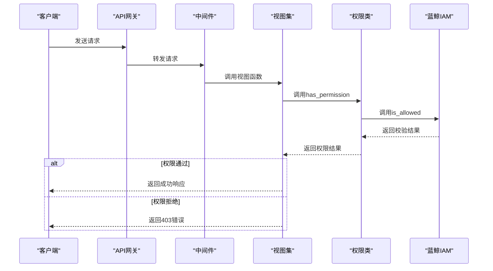

**Diagram sources**
- [drf.py](file://bklog/apps/iam/handlers/drf.py#L41-L269)
- [permission.py](file://bklog/apps/iam/handlers/permission.py#L249-L283)

### 请求初始化

权限校验的第一步是初始化权限对象，获取当前请求的用户信息和租户信息。系统通过`Permission`类的构造函数完成这一过程，该函数会尝试从多种来源获取用户信息。

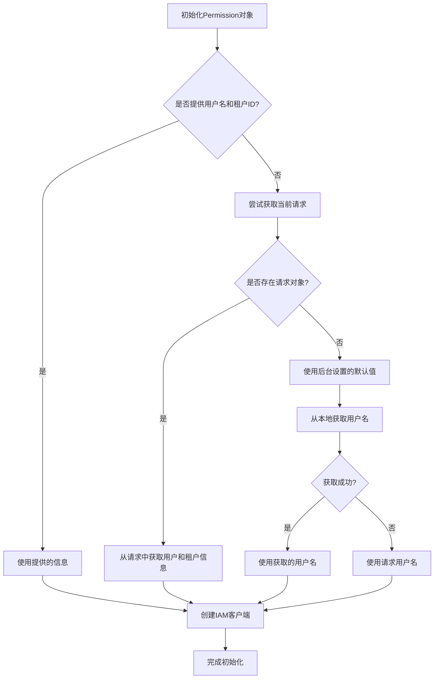

**Diagram sources**
- [permission.py](file://bklog/apps/iam/handlers/permission.py#L62-L85)

初始化过程中，系统会优先使用显式提供的用户名和租户ID。如果没有提供，则尝试从当前请求对象中获取用户信息。如果请求对象不存在，则使用后台设置的默认租户ID，并尝试从本地环境获取用户名。这种多级回退机制确保了在各种执行环境下都能正确初始化权限对象。

### 单操作权限校验

单操作权限校验是最基本的权限校验方式，用于检查用户是否具有执行某个特定操作的权限。该过程由`IAMPermission`类的`has_permission`方法实现。

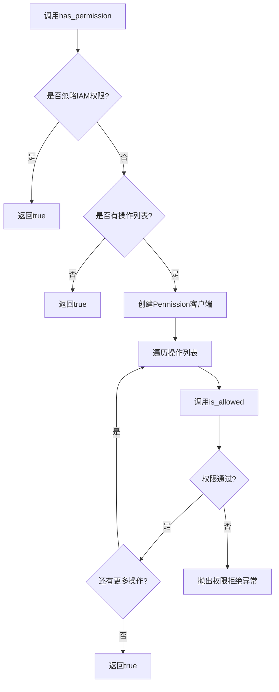

**Diagram sources**
- [drf.py](file://bklog/apps/iam/handlers/drf.py#L46-L64)

校验过程中，系统首先检查是否配置了忽略IAM权限，如果配置了则直接通过校验。然后检查是否有需要校验的操作列表，如果没有则认为不需要权限校验。对于每个需要校验的操作，系统会调用`is_allowed`方法进行实际的权限检查。如果所有操作都通过校验，则返回true；如果任何一个操作未通过校验，则抛出权限拒绝异常。

### 批量操作权限校验

批量操作权限校验用于同时检查多个操作的权限，适用于需要同时执行多个相关操作的场景。该过程由`batch_is_allowed`方法实现，能够一次性完成多个操作的权限校验。

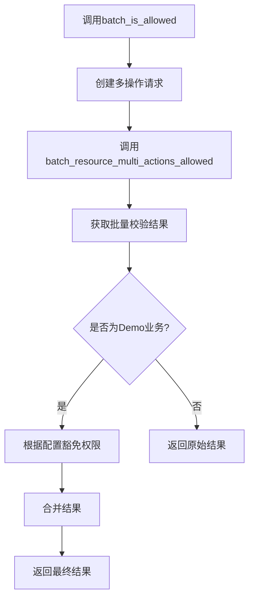

**Diagram sources**
- [permission.py](file://bklog/apps/iam/handlers/permission.py#L295-L313)

批量校验通过创建多操作请求对象，一次性向IAM系统查询多个操作的权限状态。这种方式比逐个查询操作权限更加高效，减少了与IAM系统的通信次数。对于Demo业务，系统还提供了特殊的权限豁免机制，可以根据配置决定是否豁免读写权限。

### 资源实例权限校验

资源实例权限校验用于检查用户是否具有对特定资源实例执行操作的权限。该过程由`InstanceActionPermission`类实现，能够根据URL参数或请求数据中的实例ID进行精确的权限校验。

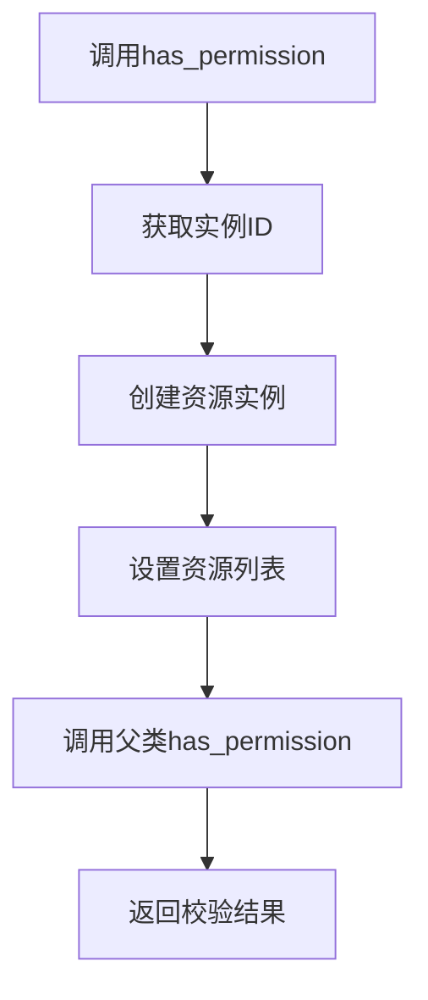

**Diagram sources**
- [drf.py](file://bklog/apps/iam/handlers/drf.py#L132-L139)

资源实例权限校验的关键是正确获取实例ID。系统通过`get_look_url_kwarg`方法确定URL参数中用于标识实例的键名，然后从`view.kwargs`中获取对应的值作为实例ID。获取实例ID后，系统会创建对应的资源实例对象，并将其设置为权限校验的资源列表，最后调用父类的`has_permission`方法完成实际的权限校验。

**Section sources**
- [permission.py](file://bklog/apps/iam/handlers/permission.py#L249-L313)
- [drf.py](file://bklog/apps/iam/handlers/drf.py#L41-L151)

## DRF权限类实现

### 基础权限类

系统基于Django REST framework的权限机制，实现了自定义的权限类体系。所有权限类都继承自`IAMPermission`基类，该类实现了与蓝鲸IAM的集成。

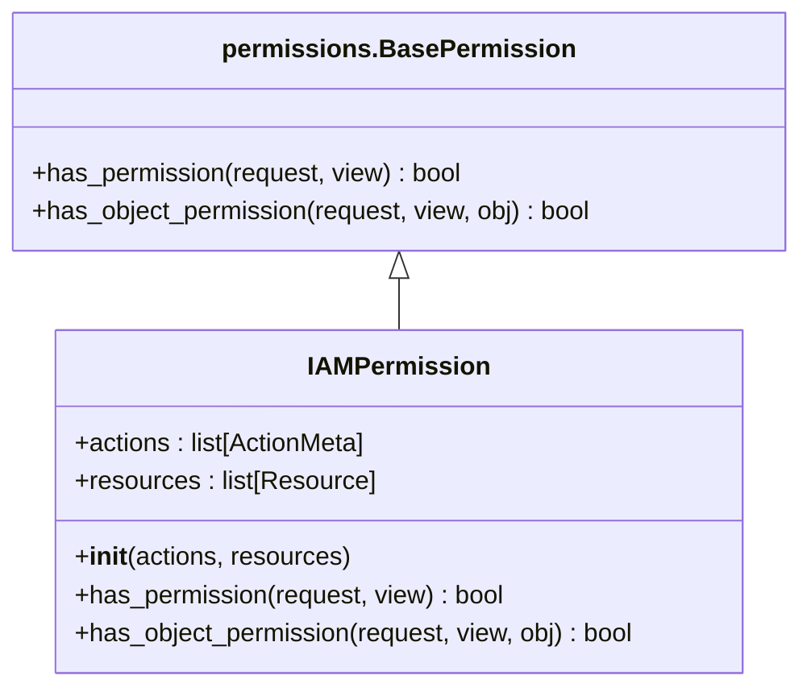

**Diagram sources**
- [drf.py](file://bklog/apps/iam/handlers/drf.py#L41-L74)

`IAMPermission`类是所有自定义权限类的基类，它接收操作列表和资源列表作为参数，并在`has_permission`方法中调用蓝鲸IAM进行权限校验。该类还重写了`has_object_permission`方法，使其与`has_permission`方法保持一致的行为。

### 业务级权限类

业务级权限类用于处理与业务空间相关的权限校验，是最常用的权限类之一。`BusinessActionPermission`类实现了根据业务ID进行权限校验的功能。

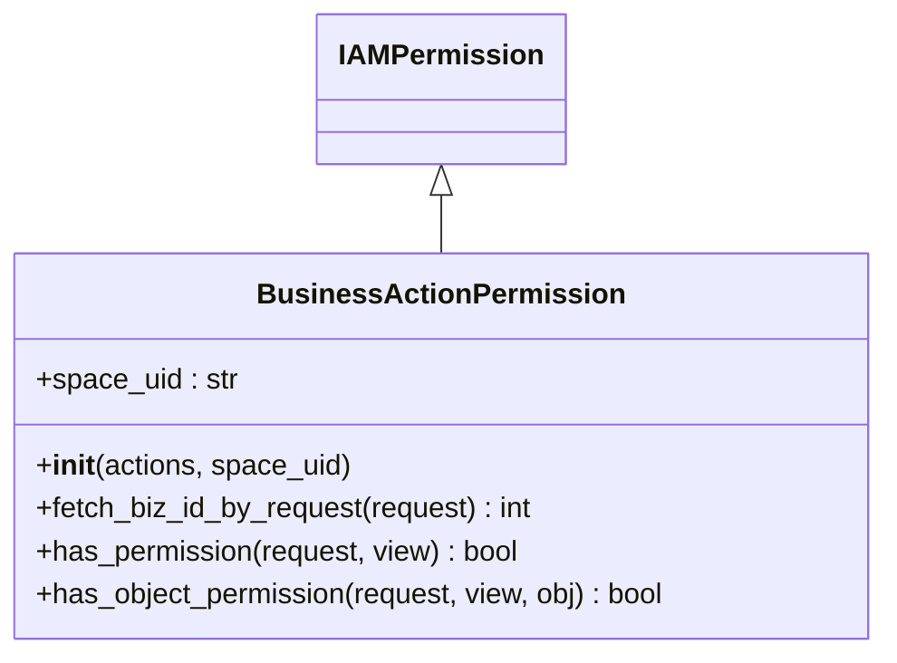

**Diagram sources**
- [drf.py](file://bklog/apps/iam/handlers/drf.py#L76-L112)

`BusinessActionPermission`类的主要特点是能够从多种来源获取业务ID：
1. 如果构造时提供了`space_uid`，则直接使用该值转换为业务ID
2. 否则从请求的`data`或`query_params`中获取`bk_biz_id`参数
3. 如果对象中包含`space_uid`或`bk_biz_id`属性，则使用该属性值

这种灵活的设计使得业务级权限类能够适应各种不同的使用场景。

### 实例级权限类

实例级权限类用于处理与具体资源实例相关的权限校验。`InstanceActionPermission`类实现了根据实例ID进行权限校验的功能。

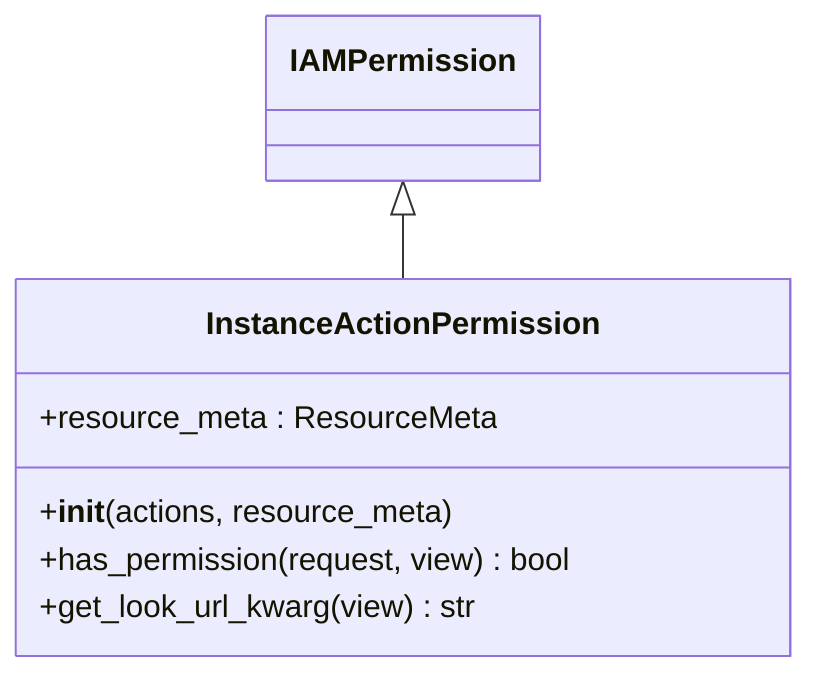

**Diagram sources**
- [drf.py](file://bklog/apps/iam/handlers/drf.py#L123-L151)

`InstanceActionPermission`类的关键是`get_look_url_kwarg`方法，该方法确定了从URL参数中获取实例ID的键名。系统首先尝试使用`lookup_url_kwarg`，如果不存在则使用`lookup_field`。这种方法确保了与Django REST framework的默认行为保持一致。

### 批量权限类

批量权限类用于处理批量操作的权限校验。`BatchIAMPermission`类实现了对多个实例进行批量权限校验的功能。

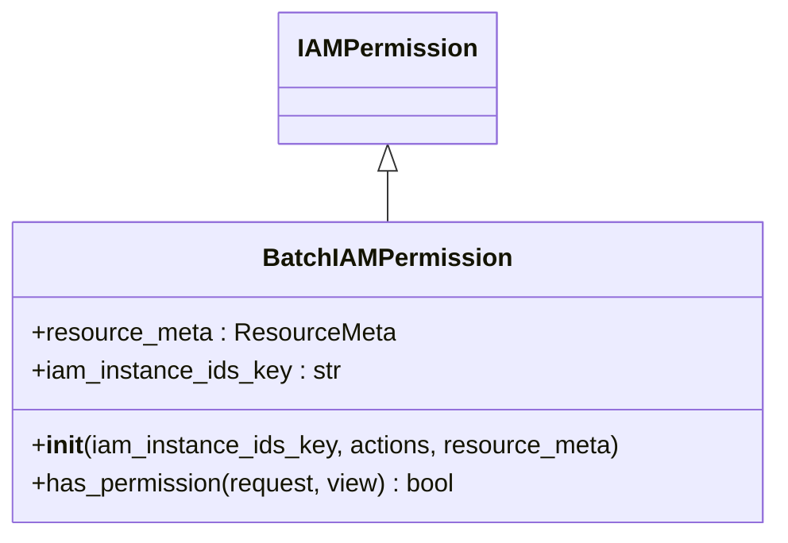

**Diagram sources**
- [drf.py](file://bklog/apps/iam/handlers/drf.py#L172-L196)

`BatchIAMPermission`类通过`iam_instance_ids_key`参数指定请求数据中包含实例ID列表的键名。在`has_permission`方法中，系统会从请求的`data`或`query_params`中获取该键对应的值作为实例ID列表，然后为每个实例ID创建资源实例对象，最后进行批量权限校验。

### 权限数据注入

系统提供了权限数据注入功能，能够在API响应中自动添加权限相关信息，方便前端进行权限相关的UI展示。`insert_permission_field`装饰器实现了这一功能。

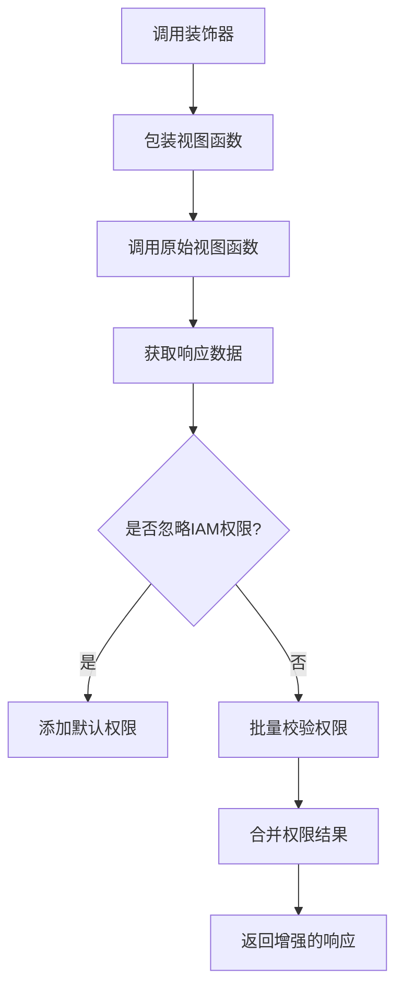

**Diagram sources**
- [drf.py](file://bklog/apps/iam/handlers/drf.py#L198-L268)

权限数据注入的工作流程如下：
1. 调用被装饰的视图函数，获取原始响应
2. 从响应数据中提取结果列表
3. 为每个结果项创建对应的资源实例
4. 调用`batch_is_allowed`方法批量校验权限
5. 将权限结果注入到每个结果项的`permission`字段中
6. 返回增强后的响应

这种设计使得前端可以直接使用响应数据中的权限信息，无需额外的权限查询请求，提高了系统性能和用户体验。

**Section sources**
- [drf.py](file://bklog/apps/iam/handlers/drf.py#L41-L269)

## 权限缓存与性能优化

### 权限缓存机制

系统通过多种方式优化权限校验性能，减少与蓝鲸IAM系统的通信次数。其中最重要的是权限缓存机制，通过在应用层缓存权限结果来提高性能。

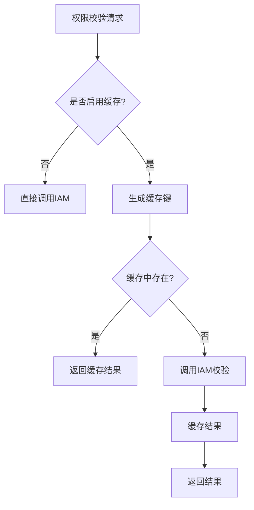

**Diagram sources**
- [permission.py](file://bklog/apps/iam/handlers/permission.py#L269-L274)

虽然代码中没有显式的缓存实现，但系统通过以下方式实现了类似缓存的效果：
1. **批量校验**：通过`batch_is_allowed`方法一次性校验多个操作的权限，减少通信次数
2. **策略预取**：在某些场景下，系统会预先获取用户的权限策略，然后在内存中进行计算
3. **表达式计算**：使用`make_expression`和`_eval_expr`方法在本地计算权限表达式，避免频繁调用IAM API

### 性能优化策略

系统采用了多种性能优化策略，确保在高并发场景下仍能保持良好的响应性能。

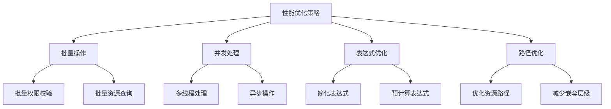

**Diagram sources**
- [iam_upgrade_action_v2.py](file://bklog/apps/iam/management/commands/iam_upgrade_action_v2.py#L185-L191)

具体优化策略包括：

1. **批量操作优化**：在权限迁移和升级命令中，系统使用`ThreadPool`实现多线程并发处理，显著提高了处理速度。通过设置合理的并发数（默认50），平衡了性能和系统负载。

2. **分页查询优化**：在查询大量权限策略时，系统采用分页查询方式，每次查询500条记录，避免单次查询数据量过大导致性能问题。

3. **表达式优化**：系统使用`make_expression`方法将权限策略转换为表达式树，然后使用`_eval_expr`方法在本地计算表达式，减少了与IAM系统的交互次数。

4. **路径优化**：在资源路径处理中，系统使用`_bk_iam_path_`字段存储资源的层级路径，便于快速计算权限关系。

5. **内存计算**：对于Demo业务等特殊场景，系统在内存中直接计算权限结果，避免调用IAM API。

这些优化策略共同作用，确保了系统在处理大量权限校验请求时仍能保持良好的性能表现。

**Section sources**
- [iam_upgrade_action_v2.py](file://bklog/apps/iam/management/commands/iam_upgrade_action_v2.py#L185-L191)
- [permission.py](file://bklog/apps/iam/handlers/permission.py#L372-L381)

## 自定义权限策略

### 注册新权限

系统提供了完整的机制来注册新的权限操作和资源类型。通过定义新的`ActionMeta`和`ResourceMeta`实例，并将其添加到相应的枚举类中，即可完成新权限的注册。

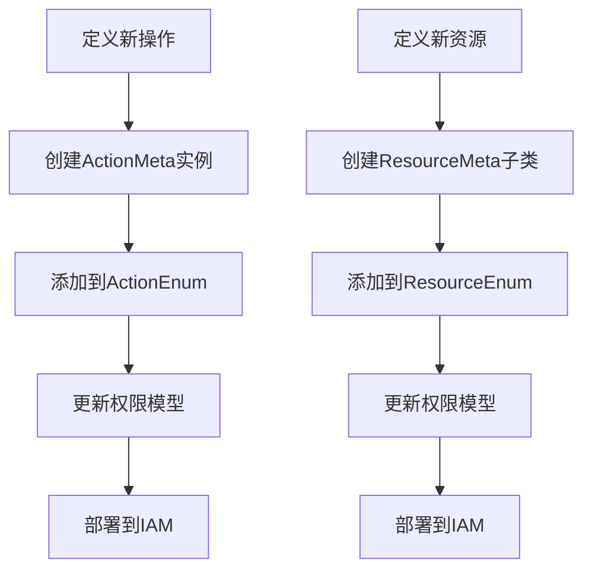

**Diagram sources**
- [actions.py](file://bklog/apps/iam/handlers/actions.py#L77-L237)
- [resources.py](file://bklog/apps/iam/handlers/resources.py#L80-L227)

注册新权限的具体步骤如下：

1. 在`actions.py`文件中定义新的`ActionMeta`实例，指定操作的ID、名称、类型、关联资源类型等属性
2. 将新操作添加到`ActionEnum`枚举类中
3. 在`resources.py`文件中定义新的`ResourceMeta`子类，指定资源的系统ID、ID、名称等属性
4. 将新能源添加到`ResourceEnum`枚举类中
5. 更新权限模型文件（如`initial.json`），将新权限添加到模型定义中
6. 部署更新后的权限模型到蓝鲸IAM系统

### 处理权限申请

当用户权限不足时，系统会生成权限申请数据，引导用户前往权限中心申请所需权限。`get_apply_data`方法负责生成这些数据。

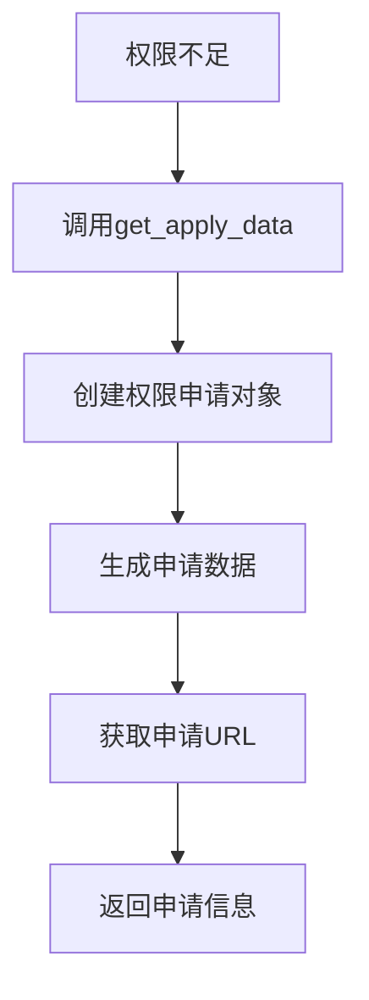

**Diagram sources**
- [permission.py](file://bklog/apps/iam/handlers/permission.py#L187-L222)

权限申请处理流程如下：
1. 创建`Application`对象，包含需要申请的操作和资源信息
2. 调用IAM客户端的`get_apply_url`方法获取权限申请URL
3. 如果获取URL失败，返回默认的权限中心URL
4. 返回包含申请数据和URL的元组

前端可以使用这些信息在页面上显示权限申请按钮，用户点击后即可跳转到权限申请页面。

### 权限策略配置

系统提供了灵活的权限策略配置机制，支持通过配置文件和数据库配置来管理权限策略。

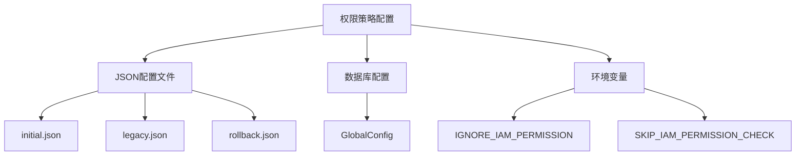

**Diagram sources**
- [iam_upgrade_action_v2.py](file://bklog/apps/iam/management/commands/iam_upgrade_action_v2.py#L155-L156)
- [permission.py](file://bklog/apps/iam/handlers/permission.py#L89-L91)

主要的配置选项包括：

1. **权限模型文件**：`initial.json`、`legacy.json`和`rollback.json`文件定义了系统的权限模型，包括操作、资源和实例视图等
2. **数据库配置**：`GlobalConfig`表中的`IAM_V1_COMPATIBLE`配置项控制是否启用V1兼容模式
3. **环境变量**：
   - `IGNORE_IAM_PERMISSION`：是否忽略IAM权限校验
   - `SKIP_IAM_PERMISSION_CHECK`：是否跳过权限中心校验

这些配置项使得系统能够在不同环境下灵活调整权限行为，满足开发、测试和生产等不同场景的需求。

**Section sources**
- [permission.py](file://bklog/apps/iam/handlers/permission.py#L187-L222)
- [iam_upgrade_action_v2.py](file://bklog/apps/iam/management/commands/iam_upgrade_action_v2.py#L155-L156)

## 兼容性迁移

### V2版本升级

系统支持从V1版本权限模型升级到V2版本，通过`iam_upgrade_action_v2`命令实现平滑迁移。该命令能够将V1版本的权限策略转换为V2版本，并确保用户权限的连续性。

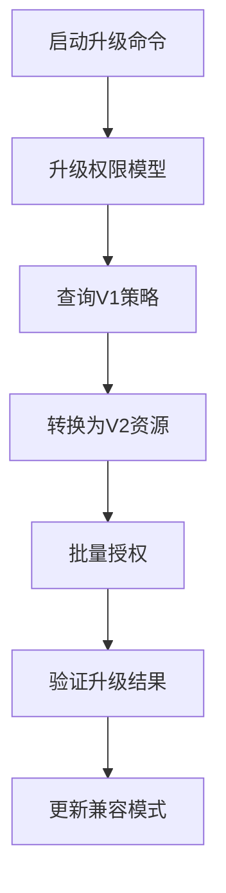

**Diagram sources**
- [iam_upgrade_action_v2.py](file://bklog/apps/iam/management/commands/iam_upgrade_action_v2.py#L109-L137)

升级流程的主要步骤包括：

1. **模型升级**：调用`upgrade_iam_model`方法，使用`IAMMigrator`将权限模型从`legacy.json`迁移到`initial.json`
2. **策略查询**：对于每个需要升级的操作，查询其V1版本的权限策略
3. **资源转换**：将V1版本的资源表达式转换为V2版本的资源路径
4. **批量授权**：使用多线程并发方式，将转换后的权限策略批量授权给V2版本的操作
5. **结果验证**：检查升级后的策略数量，确保升级成功
6. **模式切换**：如果升级成功，关闭V1兼容模式

### 兼容模式实现

为了确保升级过程中的平滑过渡，系统实现了兼容模式，能够在V1和V2版本之间进行无缝切换。`CompatibleIAM`类是兼容模式的核心实现。

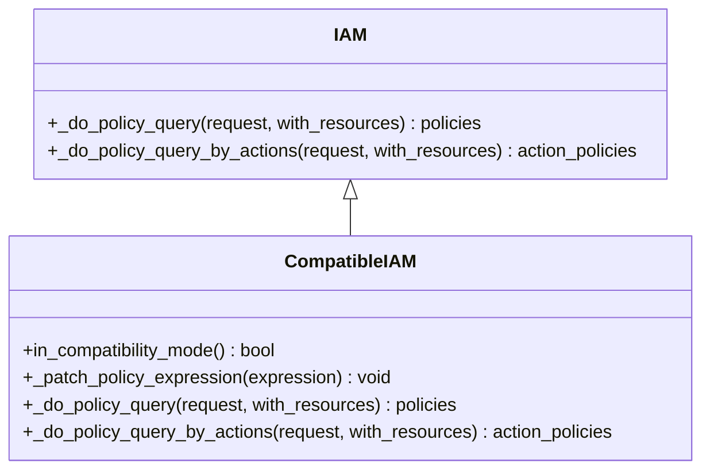

**Diagram sources**
- [compatible.py](file://bklog/apps/iam/handlers/compatible.py#L9-L140)

`CompatibleIAM`类通过重写`_do_policy_query`和`_do_policy_query_by_actions`方法实现兼容模式：

1. **模式判断**：`in_compatibility_mode`方法检查`GlobalConfig`表中的`IAM_V1_COMPATIBLE`配置项，决定是否启用兼容模式
2. **表达式转换**：`_patch_policy_expression`方法将V1版本的资源表达式（如`biz.id`）转换为V2版本的表达式（如`space.id`）
3. **策略合并**：在兼容模式下，系统会同时查询V1和V2版本的策略，并将结果合并，确保用户在升级过程中不会丢失权限

这种设计使得系统能够在升级过程中保持权限的连续性，避免因权限丢失导致的业务中断。

### 迁移最佳实践

在进行权限系统迁移时，应遵循以下最佳实践，确保迁移过程安全可靠：

1. **分阶段迁移**：先在测试环境进行完整迁移测试，验证所有功能正常后再在生产环境执行
2. **备份数据**：在执行迁移前，备份所有权限相关数据，包括权限策略、用户权限等
3. **监控验证**：迁移过程中实时监控系统状态，验证权限校验结果是否符合预期
4. **灰度发布**：采用灰度发布方式，先对部分用户或业务启用新权限模型，逐步扩大范围
5. **回滚准备**：准备好回滚方案，如果迁移出现问题能够快速恢复到之前状态
6. **用户通知**：提前通知相关用户和管理员迁移计划，避免因权限变化影响正常工作

通过遵循这些最佳实践，可以确保权限系统的迁移过程平稳顺利，最大限度地减少对业务的影响。

**Section sources**
- [iam_upgrade_action_v2.py](file://bklog/apps/iam/management/commands/iam_upgrade_action_v2.py#L109-L137)
- [compatible.py](file://bklog/apps/iam/handlers/compatible.py#L9-L140)

## 最佳实践

### 权限设计原则

在设计和实现权限系统时，应遵循以下原则，确保权限系统的安全性和可用性：

1. **最小权限原则**：只授予用户完成工作所需的最小权限，避免权限过度分配
2. **职责分离原则**：将不同职责的权限分配给不同用户或角色，防止单一用户拥有过多权限
3. **明确性原则**：权限定义应清晰明确，避免模糊或歧义的权限描述
4. **可审计原则**：所有权限操作都应有完整的审计日志，便于追踪和审查
5. **可管理原则**：权限系统应易于管理和维护，支持批量操作和自动化管理

### 性能优化建议

为了确保权限系统的高性能，建议采取以下优化措施：

1. **批量校验**：尽量使用批量权限校验方法，减少与IAM系统的通信次数
2. **合理分页**：在查询大量权限数据时，使用合理的分页大小，避免单次查询数据量过大
3. **缓存策略**：在应用层实现适当的缓存策略，减少重复的权限查询
4. **并发处理**：对于大量数据的权限操作，使用多线程或异步方式处理，提高处理效率
5. **表达式优化**：优化权限表达式的结构，减少复杂的嵌套和计算

### 安全性建议

权限系统是系统安全的关键组成部分，应特别注意以下安全事项：

1. **输入验证**：严格验证所有权限相关的输入数据，防止注入攻击
2. **权限继承**：谨慎使用权限继承机制，避免意外的权限提升
3. **定期审查**：定期审查用户权限，及时清理不再需要的权限
4. **异常处理**：妥善处理权限相关的异常，避免泄露敏感信息
5. **日志记录**：详细记录权限操作日志，便于安全审计和问题排查

通过遵循这些最佳实践，可以构建一个安全、高效、易用的权限管理系统，为系统的稳定运行提供有力保障。

**Section sources**
- [permission.py](file://bklog/apps/iam/handlers/permission.py#L249-L283)
- [drf.py](file://bklog/apps/iam/handlers/drf.py#L41-L269)
- [compatible.py](file://bklog/apps/iam/handlers/compatible.py#L9-L140)