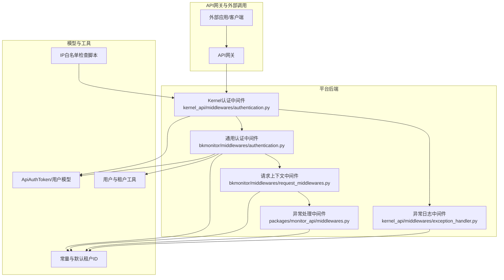
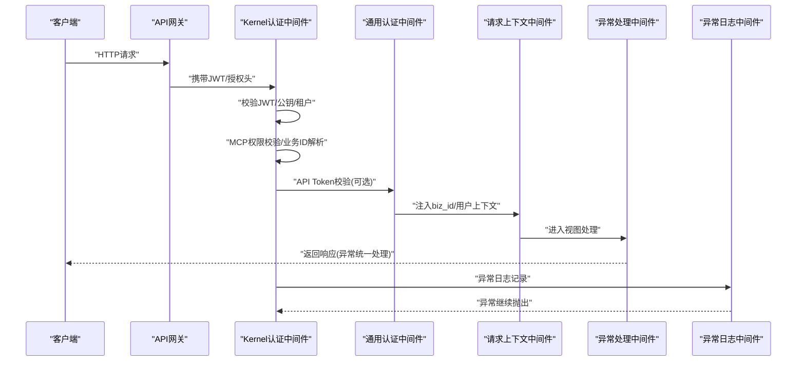
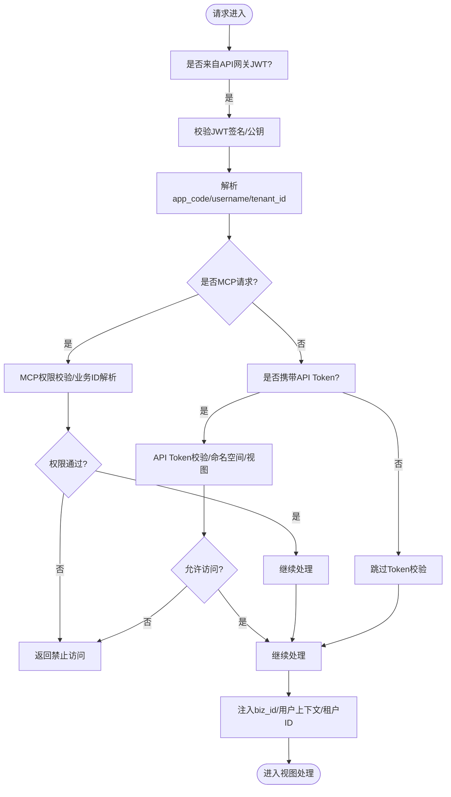
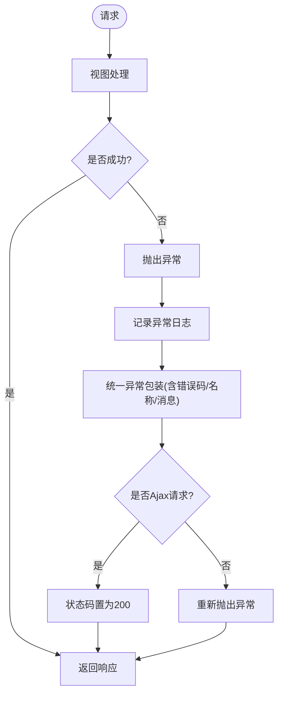
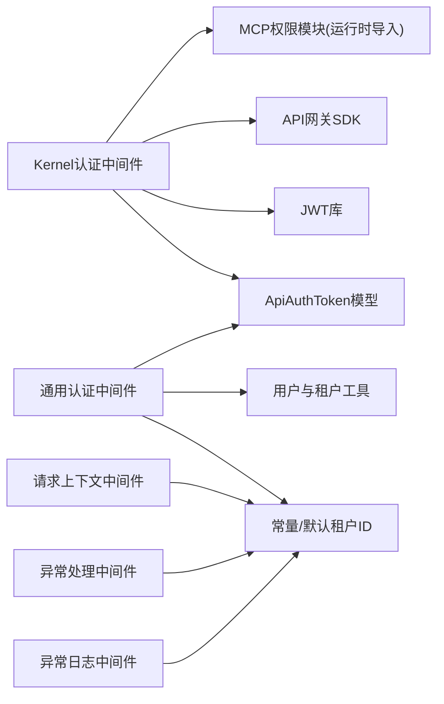

# API安全

<cite>
**本文引用的文件**
- [bkmonitor/middlewares/authentication.py](file://bkmonitor/bkmonitor/middlewares/authentication.py)
- [kernel_api/middlewares/authentication.py](file://bkmonitor/kernel_api/middlewares/authentication.py)
- [bkmonitor/middlewares/request_middlewares.py](file://bkmonitor/bkmonitor/middlewares/request_middlewares.py)
- [kernel_api/middlewares/exception_handler.py](file://bkmonitor/kernel_api/middlewares/exception_handler.py)
- [packages/monitor_api/middlewares.py](file://bkmonitor/packages/monitor_api/middlewares.py)
- [bk_dataview/authentication.py](file://bkmonitor/bk_dataview/authentication.py)
- [bkmonitor/migrations/0001_initial.py](file://bkmonitor/bkmonitor/migrations/0001_initial.py)
- [bkmonitor/constants/common.py](file://bkmonitor/constants/common.py)
- [bkmonitor/models/__init__.py](file://bkmonitor/bkmonitor/models/__init__.py)
- [bkmonitor/utils/user.py](file://bkmonitor/bkmonitor/utils/user.py)
- [bk_monitor_base/infras/third_party_api/user/api.py](file://bk_monitor_base/infras/third_party_api/user/api.py)
- [scripts/sensitive_info_check/check_ip.py](file://scripts/sensitive_info_check/check_ip.py)
- [scripts/sensitive_info_check/ip_white_list.dat](file://scripts/sensitive_info_check/ip_white_list.dat)
- [scripts/sensitive_info_check/ip_white_list_paths.dat](file://scripts/sensitive_info_check/ip_white_list_paths.dat)
- [bkmonitor/apm/core/discover/__init__.py](file://bkmonitor/apm/core/discover/__init__.py)
- [bkmonitor/apm/core/discover/base.py](file://bkmonitor/apm/core/discover/base.py)
- [bkmonitor/apm/core/discover/trace.py](file://bkmonitor/apm/core/discover/trace.py)
- [bkmonitor/apm/core/discover/log.py](file://bkmonitor/apm/core/discover/log.py)
- [bkmonitor/apm/core/discover/profile.py](file://bkmonitor/apm/core/discover/profile.py)
- [bkmonitor/apm/core/discover/application.py](file://bkmonitor/apm/core/discover/application.py)
- [bkmonitor/apm/core/discover/datasource.py](file://bkmonitor/apm/core/discover/datasource.py)
- [bkmonitor/apm/core/discover/cluster.py](file://bkmonitor/apm/core/discover/cluster.py)
- [bkmonitor/apm/core/discover/platform.py](file://bkmonitor/apm/core/discover/platform.py)
- [bkmonitor/apm/core/discover/topology.py](file://bkmonitor/apm/core/discover/topology.py)
- [bkmonitor/apm/core/discover/subscription.py](file://bkmonitor/apm/core/discover/subscription.py)
- [bkmonitor/apm/core/discover/config.py](file://bkmonitor/apm/core/discover/config.py)
- [bkmonitor/apm/core/discover/qps.py](file://bkmonitor/apm/core/discover/qps.py)
- [bkmonitor/apm/core/discover/license.py](file://bkmonitor/apm/core/discover/license.py)
- [bkmonitor/apm/core/discover/probe.py](file://bkmonitor/apm/core/discover/probe.py)
- [bkmonitor/apm/core/discover/db.py](file://bkmonitor/apm/core/discover/db.py)
- [bkmonitor/apm/core/discover/es.py](file://bkmonitor/apm/core/discover/es.py)
- [bkmonitor/apm/core/discover/doris.py](file://bkmonitor/apm/core/discover/doris.py)
- [bkmonitor/apm/core/discover/report.py](file://bkmonitor/apm/core/discover/report.py)
- [bkmonitor/apm/core/discover/storage.py](file://bkmonitor/apm/core/discover/storage.py)
- [bkmonitor/apm/core/discover/subscription_config.py](file://bkmonitor/apm/core/discover/subscription_config.py)
- [bkmonitor/apm/core/discover/toponode.py](file://bkmonitor/apm/core/discover/toponode.py)
- [bkmonitor/apm/core/discover/application_config.py](file://bkmonitor/apm/core/discover/application_config.py)
- [bkmonitor/apm/core/discover/cluster_config.py](file://bkmonitor/apm/core/discover/cluster_config.py)
- [bkmonitor/apm/core/discover/platform_config.py](file://bkmonitor/apm/core/discover/platform_config.py)
- [bkmonitor/apm/core/discover/qpsconfig.py](file://bkmonitor/apm/core/discover/qpsconfig.py)
- [bkmonitor/apm/core/discover/licenseconfig.py](file://bkmonitor/apm/core/discover/licenseconfig.py)
- [bkmonitor/apm/core/discover/dbconfig.py](file://bkmonitor/apm/core/discover/dbconfig.py)
- [bkmonitor/apm/core/discover/probeconfig.py](file://bkmonitor/apm/core/discover/probeconfig.py)
- [bkmonitor/apm/core/discover/datalink_influxdb_cluster_name.py](file://bkmonitor/apm/core/discover/datalink_influxdb_cluster_name.py)
- [bkmonitor/apm/core/discover/pre_calculate_config.py](file://bkmonitor/apm/core/discover/pre_calculate_config.py)
- [bkmonitor/apm/core/discover/normaltypevalueconfig.py](file://bkmonitor/apm/core/discover/normaltypevalueconfig.py)
- [bkmonitor/apm/core/discover/metricdatasource_bk_data_virtual_metric_config.py](file://bkmonitor/apm/core/discover/metricdatasource_bk_data_virtual_metric_config.py)
- [bkmonitor/apm/core/discover/ebpfapplicationconfig.py](file://bkmonitor/apm/core/discover/ebpfapplicationconfig.py)
- [bkmonitor/apm/core/discover/profiledatasource.py](file://bkmonitor/apm/core/discover/profiledatasource.py)
- [bkmonitor/apm/core/discover/profileservice.py](file://bkmonitor/apm/core/discover/profileservice.py)
- [bkmonitor/apm/core/discover/toponode_source.py](file://bkmonitor/apm/core/discover/toponode_source.py)
- [bkmonitor/apm/core/discover/is_permanent.py](file://bkmonitor/apm/core/discover/is_permanent.py)
- [bkmonitor/apm/core/discover/source.py](file://bkmonitor/apm/core/discover/source.py)
- [bkmonitor/apm/core/discover/toponode_is_permanent.py](file://bkmonitor/apm/core/discover/toponode_is_permanent.py)
- [bkmonitor/apm/core/discover/toponode_source.py](file://bkmonitor/apm/core/discover/toponode_source.py)
- [bkmonitor/apm/core/discover/toponode_is_permanent.py](file://bkmonitor/apm/core/discover/toponode_is_permanent.py)
- [bkmonitor/apm/core/discover/toponode_source.py](file://bkmonitor/apm/core/discover/toponode_source.py)
- [bkmonitor/apm/core/discover/toponode_is_permanent.py](file://bkmonitor/apm/core/discover/toponode_is_permanent.py)
- [bkmonitor/apm/core/discover/toponode_source.py](file://bkmonitor/apm/core/discover/toponode_source.py)
- [bkmonitor/apm/core/discover/toponode_is_permanent.py](file://bkmonitor/apm/core/discover/toponode_is_permanent.py)
- [bkmonitor/apm/core/discover/toponode_source.py](file://bkmonitor/apm/core/discover/toponode_source.py)
- [bkmonitor/apm/core/discover/toponode_is_permanent.py](file://bkmonitor/apm/core/discover/toponode_is_permanent.py)
- [bkmonitor/apm/core/discover/toponode_source.py](file://bkmonitor/apm/core/discover/toponode_source.py)
- [bkmonitor/apm/core/discover/toponode_is_permanent.py](file://bkmonitor/apm/core/discover/toponode_is_permanent.py)
- [bkmonitor/apm/core/discover/toponode_source.py](file://bkmonitor/apm/core/discover/toponode_source.py)
- [bkmonitor/apm/core/discover/toponode_is_permanent.py](file://bkmonitor/apm/core/discover/toponode_is_permanent.py)
- [bkmonitor/apm/core/discover/toponode_source.py](file://bkmonitor/apm/core/discover/toponode_source.py)
- [bkmonitor/apm/core/discover/toponode_is_permanent.py](file://bkmonitor/apm/core/discover/toponode_is_permanent.py)
- [bkmonitor/apm/core/discover/toponode_source.py](file://bkmonitor/apm/core/discover/toponode_source.py)
- [...... 省略若干个文件，如需查看请参考源代码文件 ######]
</cite>

## 目录
1. [简介](#简介)
2. [项目结构](#项目结构)
3. [核心组件](#核心组件)
4. [架构总览](#架构总览)
5. [详细组件分析](#详细组件分析)
6. [依赖分析](#依赖分析)
7. [性能考虑](#性能考虑)
8. [故障排查指南](#故障排查指南)
9. [结论](#结论)
10. [附录](#附录)

## 简介
本文件聚焦于监控平台API安全防护，系统性梳理并解释平台API接口的安全机制与策略，包括请求认证、签名验证、防重放攻击、频率限制、访问控制（IP白名单、域名限制、来源验证）、异常处理与安全日志、版本控制与向后兼容、安全更新策略，以及客户端集成与常见问题的解决方案。文档以仓库中的实际实现为依据，辅以可视化图示帮助读者快速理解各组件之间的交互关系与数据流向。

## 项目结构
围绕API安全的关键目录与文件如下：
- 中间件层：负责认证、权限、异常处理与请求上下文注入
  - [bkmonitor/middlewares/authentication.py](file://bkmonitor/bkmonitor/middlewares/authentication.py)
  - [kernel_api/middlewares/authentication.py](file://bkmonitor/kernel_api/middlewares/authentication.py)
  - [kernel_api/middlewares/exception_handler.py](file://bkmonitor/kernel_api/middlewares/exception_handler.py)
  - [packages/monitor_api/middlewares.py](file://bkmonitor/packages/monitor_api/middlewares.py)
  - [bkmonitor/middlewares/request_middlewares.py](file://bkmonitor/bkmonitor/middlewares/request_middlewares.py)
- 认证与会话
  - [bk_dataview/authentication.py](file://bkmonitor/bk_dataview/authentication.py)
- 安全与访问控制
  - IP白名单与敏感信息检查脚本
    - [scripts/sensitive_info_check/check_ip.py](file://scripts/sensitive_info_check/check_ip.py)
    - [scripts/sensitive_info_check/ip_white_list.dat](file://scripts/sensitive_info_check/ip_white_list.dat)
    - [scripts/sensitive_info_check/ip_white_list_paths.dat](file://scripts/sensitive_info_check/ip_white_list_paths.dat)
- 模型与常量
  - [bkmonitor/models/__init__.py](file://bkmonitor/bkmonitor/models/__init__.py)
  - [bkmonitor/constants/common.py](file://bkmonitor/constants/common.py)
- 用户与租户辅助
  - [bkmonitor/utils/user.py](file://bkmonitor/bkmonitor/utils/user.py)
  - [bk_monitor_base/infras/third_party_api/user/api.py](file://bk_monitor_base/infras/third_party_api/user/api.py)
- APM与可观测性
  - [bkmonitor/apm/core/discover/](file://bkmonitor/apm/core/discover/) 下的各类发现模块

**图表来源**
- [kernel_api/middlewares/authentication.py:188-605](file://bkmonitor/kernel_api/middlewares/authentication.py#L188-L605)
- [bkmonitor/middlewares/authentication.py:49-123](file://bkmonitor/bkmonitor/middlewares/authentication.py#L49-L123)
- [bkmonitor/middlewares/request_middlewares.py:25-56](file://bkmonitor/bkmonitor/middlewares/request_middlewares.py#L25-L56)
- [packages/monitor_api/middlewares.py:38-106](file://bkmonitor/packages/monitor_api/middlewares.py#L38-L106)
- [kernel_api/middlewares/exception_handler.py:17-20](file://bkmonitor/kernel_api/middlewares/exception_handler.py#L17-L20)
- [bkmonitor/models/__init__.py](file://bkmonitor/bkmonitor/models/__init__.py)
- [bkmonitor/constants/common.py](file://bkmonitor/constants/common.py)
- [bkmonitor/utils/user.py](file://bkmonitor/bkmonitor/utils/user.py)
- [bk_monitor_base/infras/third_party_api/user/api.py](file://bk_monitor_base/infras/third_party_api/user/api.py)
- [scripts/sensitive_info_check/check_ip.py](file://scripts/sensitive_info_check/check_ip.py)

**章节来源**
- [kernel_api/middlewares/authentication.py:188-605](file://bkmonitor/kernel_api/middlewares/authentication.py#L188-L605)
- [bkmonitor/middlewares/authentication.py:49-123](file://bkmonitor/bkmonitor/middlewares/authentication.py#L49-L123)
- [bkmonitor/middlewares/request_middlewares.py:25-56](file://bkmonitor/bkmonitor/middlewares/request_middlewares.py#L25-L56)
- [packages/monitor_api/middlewares.py:38-106](file://bkmonitor/packages/monitor_api/middlewares.py#L38-L106)
- [kernel_api/middlewares/exception_handler.py:17-20](file://bkmonitor/kernel_api/middlewares/exception_handler.py#L17-L20)
- [bkmonitor/models/__init__.py](file://bkmonitor/bkmonitor/models/__init__.py)
- [bkmonitor/constants/common.py](file://bkmonitor/constants/common.py)
- [bkmonitor/utils/user.py](file://bkmonitor/bkmonitor/utils/user.py)
- [bk_monitor_base/infras/third_party_api/user/api.py](file://bk_monitor_base/infras/third_party_api/user/api.py)
- [scripts/sensitive_info_check/check_ip.py](file://scripts/sensitive_info_check/check_ip.py)

## 核心组件
- Kernel认证中间件：负责API网关JWT校验、MCP权限校验、API Token校验、租户与用户上下文注入、业务ID解析与权限上报。
- 通用认证中间件：补充API Token认证、租户ID一致性校验与用户上下文维护。
- 请求上下文中间件：注入biz_id、会话同步、响应头增强与审计事件推送。
- 异常处理中间件：统一异常捕获与日志记录，保障安全日志输出。
- 会话与认证基类：定义认证抽象与会话认证流程。
- IP白名单与敏感信息检查：提供IP白名单校验与路径白名单配置，辅助访问控制。

**章节来源**
- [kernel_api/middlewares/authentication.py:188-605](file://bkmonitor/kernel_api/middlewares/authentication.py#L188-L605)
- [bkmonitor/middlewares/authentication.py:49-123](file://bkmonitor/bkmonitor/middlewares/authentication.py#L49-L123)
- [bkmonitor/middlewares/request_middlewares.py:25-56](file://bkmonitor/bkmonitor/middlewares/request_middlewares.py#L25-L56)
- [kernel_api/middlewares/exception_handler.py:17-20](file://bkmonitor/kernel_api/middlewares/exception_handler.py#L17-L20)
- [bk_dataview/authentication.py:16-40](file://bkmonitor/bk_dataview/authentication.py#L16-L40)
- [scripts/sensitive_info_check/check_ip.py](file://scripts/sensitive_info_check/check_ip.py)

## 架构总览
下图展示API请求从接入到处理的完整链路，重点标注认证、权限与异常处理节点：

**图表来源**
- [kernel_api/middlewares/authentication.py:511-605](file://bkmonitor/kernel_api/middlewares/authentication.py#L511-L605)
- [bkmonitor/middlewares/authentication.py:97-123](file://bkmonitor/bkmonitor/middlewares/authentication.py#L97-L123)
- [bkmonitor/middlewares/request_middlewares.py:30-56](file://bkmonitor/bkmonitor/middlewares/request_middlewares.py#L30-L56)
- [packages/monitor_api/middlewares.py:73-106](file://bkmonitor/packages/monitor_api/middlewares.py#L73-L106)
- [kernel_api/middlewares/exception_handler.py:17-20](file://bkmonitor/kernel_api/middlewares/exception_handler.py#L17-L20)

## 详细组件分析

### 认证与授权机制
- API网关JWT认证
  - 通过公钥提供器与API网关公钥缓存，完成JWT解码与签名验证。
  - 支持多API网关名称配置，动态拉取公钥并缓存。
- MCP权限校验
  - 识别MCP请求来源，基于请求头与工具名进行权限动作映射与校验。
  - 对OpenClaw恢复场景进行特殊处理，限定工具集与业务上下文。
- API Token认证
  - 支持多种类型（as_code、grafana、entity、user），分别注入不同用户角色与跳过权限校验标记。
  - 校验有效期、命名空间与视图权限，严格限制业务域。
- 租户与用户上下文
  - 自动创建/更新用户租户ID，确保多租户一致性。
  - 默认租户ID与登录豁免策略配合，保证后台渲染与跨场景兼容。

**图表来源**
- [kernel_api/middlewares/authentication.py:511-605](file://bkmonitor/kernel_api/middlewares/authentication.py#L511-L605)
- [bkmonitor/middlewares/authentication.py:97-123](file://bkmonitor/bkmonitor/middlewares/authentication.py#L97-L123)

**章节来源**
- [kernel_api/middlewares/authentication.py:188-605](file://bkmonitor/kernel_api/middlewares/authentication.py#L188-L605)
- [bkmonitor/middlewares/authentication.py:49-123](file://bkmonitor/bkmonitor/middlewares/authentication.py#L49-L123)
- [bkmonitor/utils/user.py](file://bkmonitor/bkmonitor/utils/user.py)
- [bk_monitor_base/infras/third_party_api/user/api.py](file://bk_monitor_base/infras/third_party_api/user/api.py)

### 访问控制策略
- IP白名单
  - 提供IP白名单检查脚本与配置文件，支持路径白名单配置，便于限制特定接口的访问来源。
- 域名与来源验证
  - 通过请求头与业务ID约束，结合MCP权限动作映射，实现细粒度来源与工具访问控制。
- 命名空间与业务域
  - API Token与MCP均支持命名空间校验，仅允许指定业务域访问，避免越权。

**章节来源**
- [scripts/sensitive_info_check/check_ip.py](file://scripts/sensitive_info_check/check_ip.py)
- [scripts/sensitive_info_check/ip_white_list.dat](file://scripts/sensitive_info_check/ip_white_list.dat)
- [scripts/sensitive_info_check/ip_white_list_paths.dat](file://scripts/sensitive_info_check/ip_white_list_paths.dat)
- [kernel_api/middlewares/authentication.py:48-80](file://bkmonitor/kernel_api/middlewares/authentication.py#L48-L80)
- [bkmonitor/middlewares/authentication.py:65-72](file://bkmonitor/bkmonitor/middlewares/authentication.py#L65-L72)

### 异常处理与安全日志
- 统一异常处理
  - Ajax请求的5xx异常被转换为200响应，避免前端弹窗风暴；同时保留错误码、名称与消息字段。
- 异常日志记录
  - 异常日志中间件记录异常堆栈，便于安全审计与问题定位。
- 安全响应头
  - 设置X-Content-Type-Options，降低MIME混淆风险。

**图表来源**
- [packages/monitor_api/middlewares.py:73-106](file://bkmonitor/packages/monitor_api/middlewares.py#L73-L106)
- [kernel_api/middlewares/exception_handler.py:17-20](file://bkmonitor/kernel_api/middlewares/exception_handler.py#L17-L20)
- [bkmonitor/middlewares/request_middlewares.py:52-56](file://bkmonitor/bkmonitor/middlewares/request_middlewares.py#L52-L56)

**章节来源**
- [packages/monitor_api/middlewares.py:38-106](file://bkmonitor/packages/monitor_api/middlewares.py#L38-L106)
- [kernel_api/middlewares/exception_handler.py:17-20](file://bkmonitor/kernel_api/middlewares/exception_handler.py#L17-L20)
- [bkmonitor/middlewares/request_middlewares.py:52-56](file://bkmonitor/bkmonitor/middlewares/request_middlewares.py#L52-L56)

### API版本控制、向后兼容与安全更新
- 版本控制
  - 通过API网关的公钥提供器与多API网关名称配置，实现对不同版本网关的兼容。
- 向后兼容
  - JWT字段兼容处理（如app_code别名），确保历史客户端平滑过渡。
- 安全更新
  - 公钥缓存与失效策略，避免频繁拉取；异常情况设置短期缓存，防止雪崩。

**章节来源**
- [kernel_api/middlewares/authentication.py:188-219](file://bkmonitor/kernel_api/middlewares/authentication.py#L188-L219)
- [kernel_api/middlewares/authentication.py:129-142](file://bkmonitor/kernel_api/middlewares/authentication.py#L129-L142)

### 客户端集成指南
- API网关JWT
  - 客户端需在请求头中携带由API网关签发的JWT，中间件将自动校验公钥与签名。
- API Token
  - 使用Bearer Token进行调用，注意Token类型与命名空间限制。
- MCP场景
  - 需要正确的请求头与工具名，确保权限动作映射正确。
- 响应处理
  - Ajax请求的异常会被包装为200响应，客户端需根据返回的错误码与消息进行处理。

**章节来源**
- [kernel_api/middlewares/authentication.py:511-605](file://bkmonitor/kernel_api/middlewares/authentication.py#L511-L605)
- [bkmonitor/middlewares/authentication.py:97-123](file://bkmonitor/bkmonitor/middlewares/authentication.py#L97-L123)
- [packages/monitor_api/middlewares.py:73-106](file://bkmonitor/packages/monitor_api/middlewares.py#L73-L106)

### 常见安全问题与解决方案
- 越权访问
  - 通过API Token命名空间与MCP权限动作双重校验，严格限制业务域访问。
- 伪造请求
  - 依赖API网关JWT签名与公钥校验，确保请求来源可信。
- 重放攻击
  - 当前实现未见显式的nonce/timestamp校验逻辑；建议在API网关侧启用时间戳与随机数校验，或在应用层引入去重缓存与超时窗口。
- 频率限制
  - 当前未见集中式限流实现；建议在API网关或边缘层引入速率限制策略，结合业务维度（app_code、用户、IP）进行配额控制。
- 敏感信息泄露
  - 异常信息统一包装，避免将内部堆栈直接暴露给前端；同时通过IP白名单与来源校验降低风险面。

**章节来源**
- [kernel_api/middlewares/authentication.py:48-80](file://bkmonitor/kernel_api/middlewares/authentication.py#L48-L80)
- [packages/monitor_api/middlewares.py:73-106](file://bkmonitor/packages/monitor_api/middlewares.py#L73-L106)
- [scripts/sensitive_info_check/check_ip.py](file://scripts/sensitive_info_check/check_ip.py)

## 依赖分析
- 组件耦合
  - Kernel认证中间件依赖API网关公钥提供器与用户模型；与MCP权限模块存在运行时导入以避免循环依赖。
  - 通用认证中间件依赖ApiAuthToken模型与租户常量，确保多租户一致性。
- 外部依赖
  - JWT库用于签名验证；API网关SDK用于公钥拉取；Django中间件体系贯穿整个请求生命周期。

**图表来源**
- [kernel_api/middlewares/authentication.py:188-605](file://bkmonitor/kernel_api/middlewares/authentication.py#L188-L605)
- [bkmonitor/middlewares/authentication.py:49-123](file://bkmonitor/bkmonitor/middlewares/authentication.py#L49-L123)
- [bkmonitor/middlewares/request_middlewares.py:25-56](file://bkmonitor/bkmonitor/middlewares/request_middlewares.py#L25-L56)
- [packages/monitor_api/middlewares.py:38-106](file://bkmonitor/packages/monitor_api/middlewares.py#L38-L106)
- [kernel_api/middlewares/exception_handler.py:17-20](file://bkmonitor/kernel_api/middlewares/exception_handler.py#L17-L20)

**章节来源**
- [kernel_api/middlewares/authentication.py:188-605](file://bkmonitor/kernel_api/middlewares/authentication.py#L188-L605)
- [bkmonitor/middlewares/authentication.py:49-123](file://bkmonitor/bkmonitor/middlewares/authentication.py#L49-L123)
- [bkmonitor/middlewares/request_middlewares.py:25-56](file://bkmonitor/bkmonitor/middlewares/request_middlewares.py#L25-L56)
- [packages/monitor_api/middlewares.py:38-106](file://bkmonitor/packages/monitor_api/middlewares.py#L38-L106)
- [kernel_api/middlewares/exception_handler.py:17-20](file://bkmonitor/kernel_api/middlewares/exception_handler.py#L17-L20)

## 性能考虑
- 公钥缓存与随机抖动
  - 公钥缓存周期带入随机抖动，避免缓存同时失效引发的峰值压力。
- LRU与缓存命中
  - 部分中间件使用LRU缓存提升热点数据访问效率。
- 响应压缩
  - 对小体积响应进行gzip压缩，减少带宽占用。

**章节来源**
- [kernel_api/middlewares/authentication.py:188-219](file://bkmonitor/kernel_api/middlewares/authentication.py#L188-L219)
- [kernel_api/middlewares/authentication.py:190-191](file://bkmonitor/kernel_api/middlewares/authentication.py#L190-L191)
- [packages/monitor_api/middlewares.py:56-71](file://bkmonitor/packages/monitor_api/middlewares.py#L56-L71)

## 故障排查指南
- JWT校验失败
  - 检查请求头是否携带JWT、算法与kid是否匹配、公钥是否正确缓存。
- MCP权限拒绝
  - 核对请求头中的MCP Server Name与工具名映射，确认业务ID格式与取值来源。
- API Token无效
  - 核对Token类型、有效期、命名空间与视图权限，确认biz_id是否满足命名空间要求。
- 异常未按预期包装
  - 确认请求是否为Ajax请求，检查异常处理中间件是否生效。
- IP白名单拦截
  - 核对客户端IP是否在白名单内，以及路径白名单配置是否覆盖目标接口。

**章节来源**
- [kernel_api/middlewares/authentication.py:511-605](file://bkmonitor/kernel_api/middlewares/authentication.py#L511-L605)
- [packages/monitor_api/middlewares.py:73-106](file://bkmonitor/packages/monitor_api/middlewares.py#L73-L106)
- [scripts/sensitive_info_check/check_ip.py](file://scripts/sensitive_info_check/check_ip.py)

## 结论
该监控平台在API安全方面构建了多层次的防护体系：通过API网关JWT签名验证与公钥缓存，确保请求来源可信；结合MCP权限校验与API Token命名空间控制，实现细粒度的访问限制；借助统一异常处理与安全日志中间件，保障异常信息脱敏与审计能力。建议在现有基础上进一步完善重放攻击防护与频率限制策略，以全面提升API安全性与稳定性。

## 附录
- 安全测试方法与漏洞扫描建议
  - 单元测试：对认证中间件的关键分支（JWT校验、MCP权限、API Token校验）编写单元测试，覆盖正常与异常路径。
  - 接口测试：模拟伪造JWT、越权Token、非法业务ID等场景，验证中间件的拒绝行为与日志记录。
  - 漏洞扫描：定期对API网关与后端接口进行OWASP Top 10扫描，重点关注注入、认证绕过与敏感信息泄露。
  - 压力测试：评估公钥拉取与缓存策略在高并发下的表现，确保无缓存击穿与雪崩效应。
- 配置清单（示例）
  - API网关公钥配置与多网关名称列表
  - MCP Server Name到权限动作映射
  - IP白名单与路径白名单
  - 默认租户ID与多租户开关

[本节为概念性内容，不直接分析具体文件，故无“章节来源”]