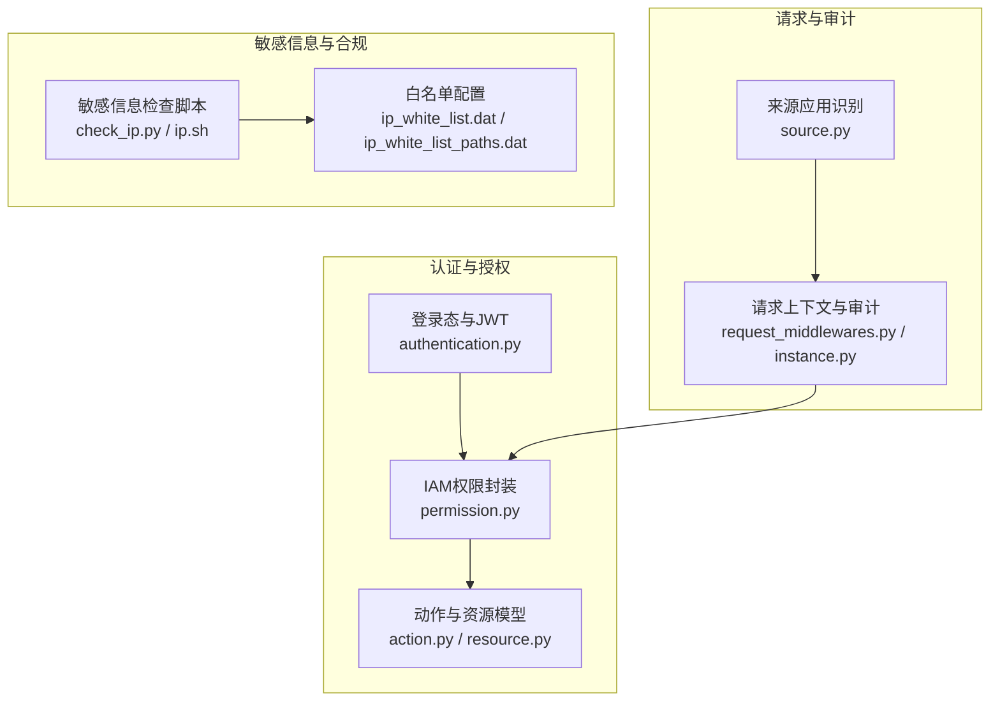
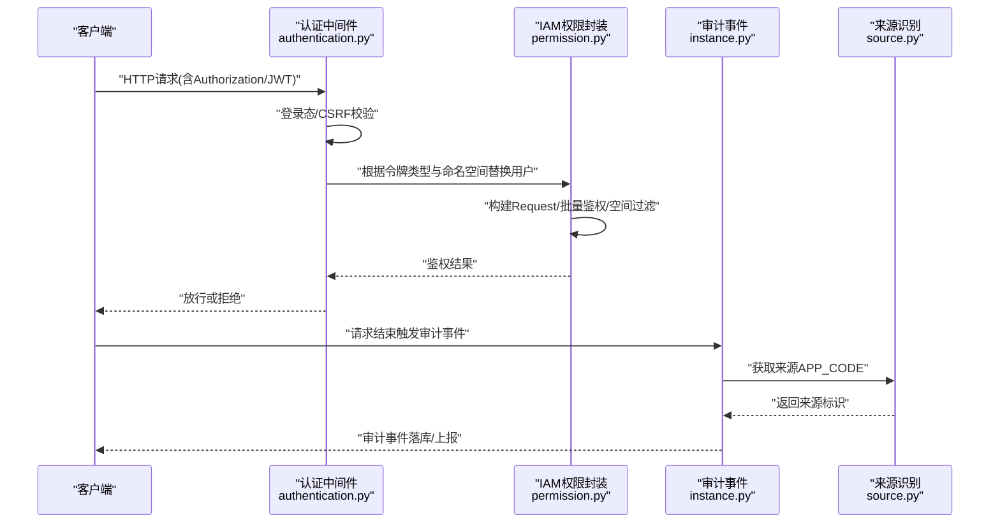
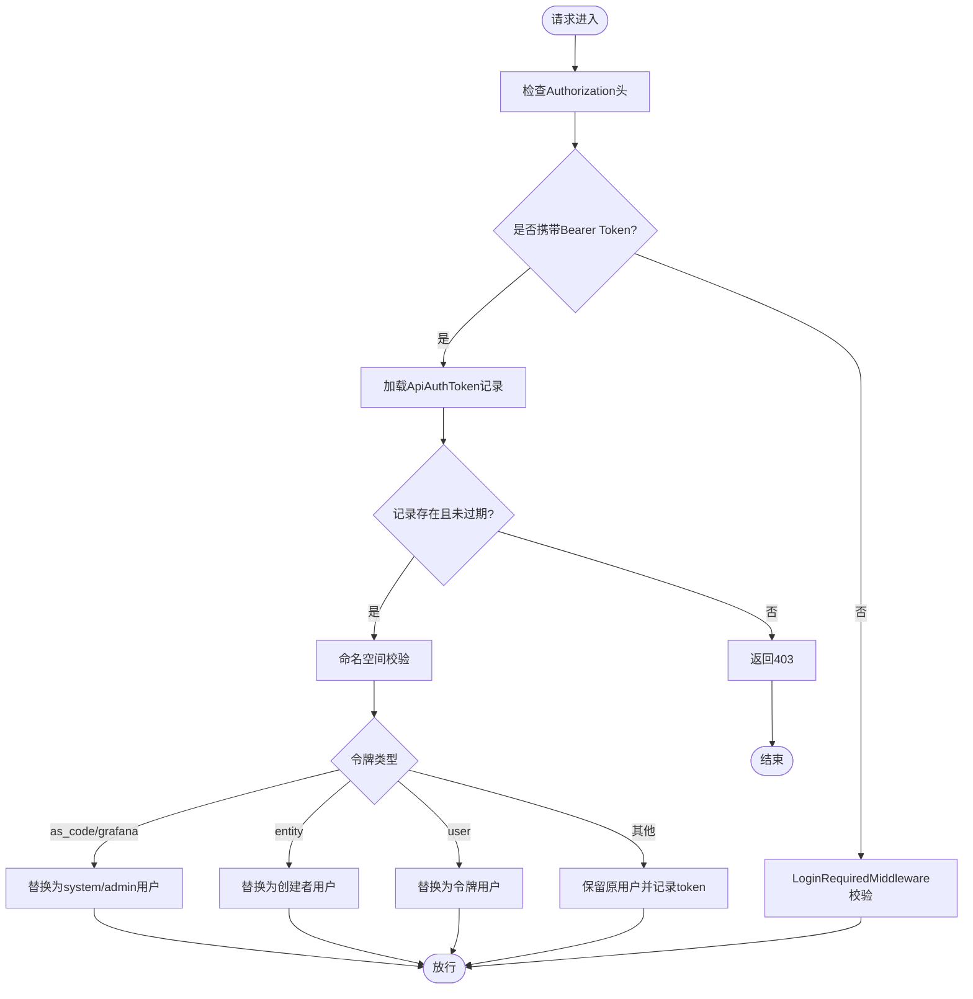
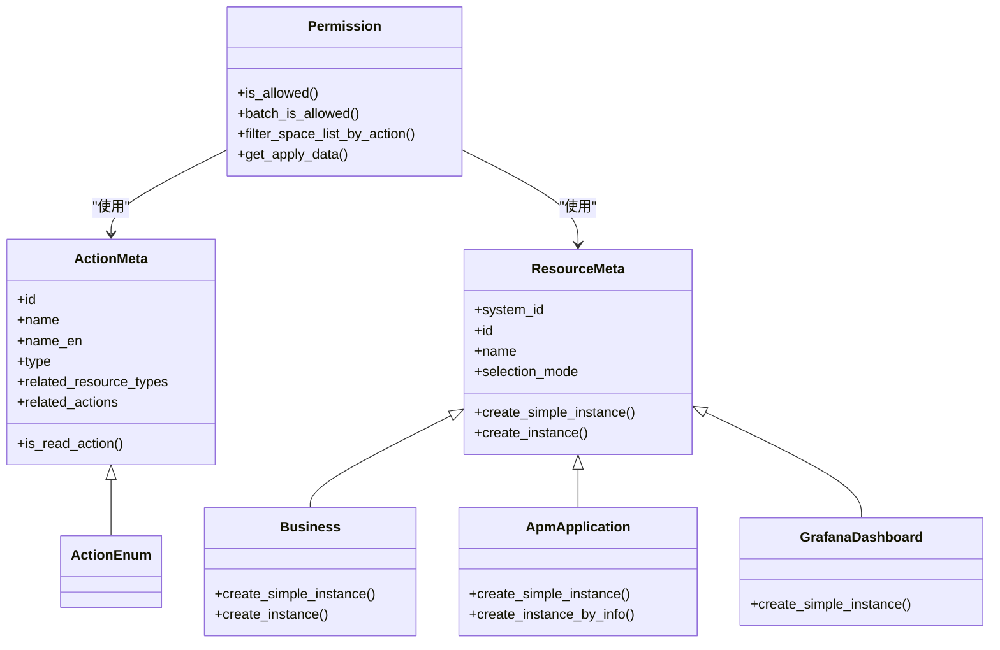
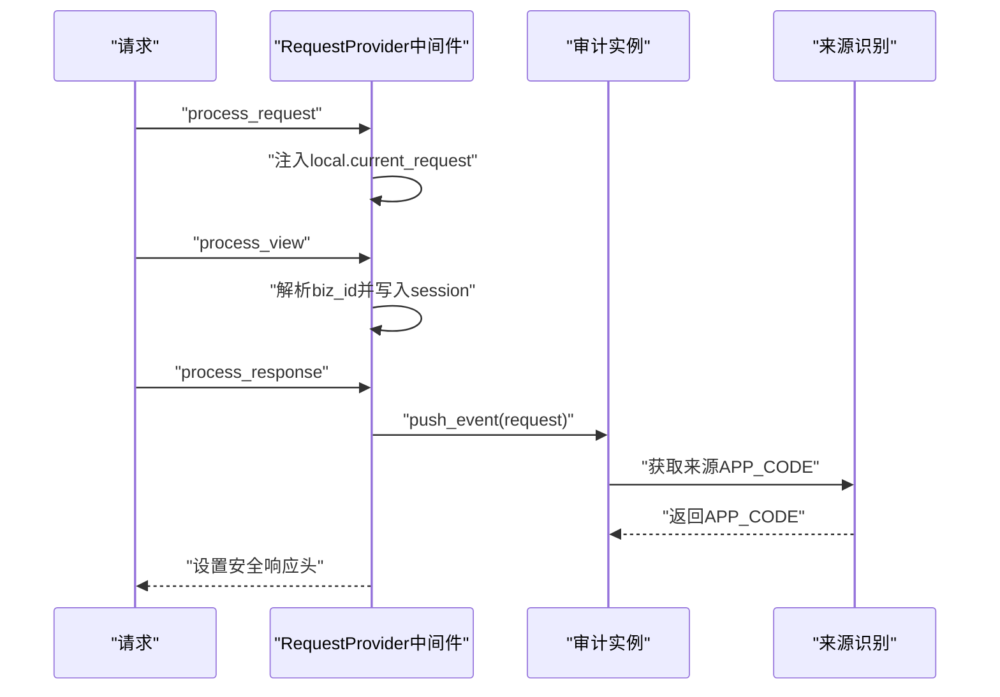
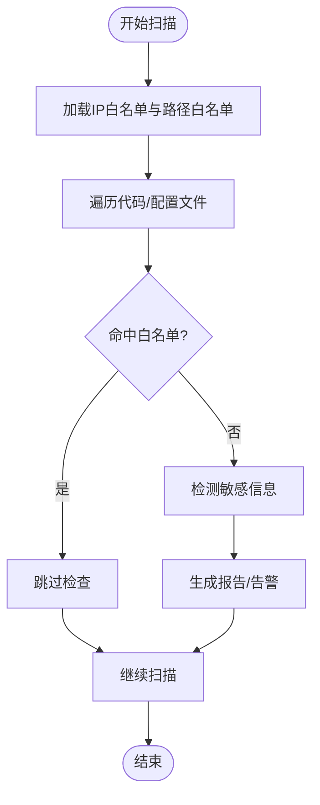
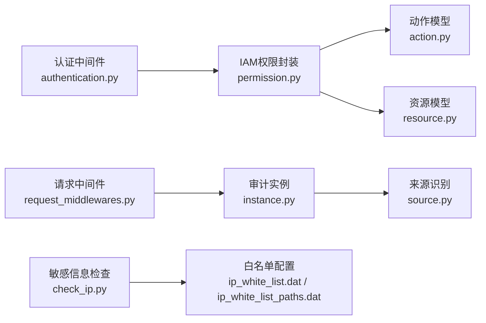

# 安全考虑

<cite>
**本文引用的文件**
- [authentication.py](file://bkmonitor/bkmonitor/middlewares/authentication.py)
- [request_middlewares.py](file://bkmonitor/bkmonitor/middlewares/request_middlewares.py)
- [source.py](file://bkmonitor/bkmonitor/middlewares/source.py)
- [permission.py](file://bkmonitor/bkmonitor/iam/permission.py)
- [action.py](file://bkmonitor/bkmonitor/iam/action.py)
- [resource.py](file://bkmonitor/bkmonitor/iam/resource.py)
- [__init__.py](file://bkmonitor/bkmonitor/iam/__init__.py)
- [client.py](file://bkmonitor/bkmonitor/packages/audit/client.py)
- [instance.py](file://bkmonitor/bkmonitor/packages/audit/instance.py)
- [__init__.py](file://bkmonitor/bkmonitor/packages/audit/__init__.py)
- [apps.py](file://bkmonitor/bkmonitor/packages/audit/apps.py)
- [check_ip.py](file://scripts/sensitive_info_check/check_ip.py)
- [ip.sh](file://scripts/sensitive_info_check/ip.sh)
- [ip_white_list.dat](file://scripts/sensitive_info_check/ip_white_list.dat)
- [ip_white_list_paths.dat](file://scripts/sensitive_info_check/ip_white_list_paths.dat)
</cite>

## 目录
1. [简介](#简介)
2. [项目结构](#项目结构)
3. [核心组件](#核心组件)
4. [架构总览](#架构总览)
5. [详细组件分析](#详细组件分析)
6. [依赖分析](#依赖分析)
7. [性能考虑](#性能考虑)
8. [故障排查指南](#故障排查指南)
9. [结论](#结论)
10. [附录](#附录)

## 简介
本文件聚焦于监控系统的安全设计与实现，围绕认证授权机制、数据安全保护、API 安全防护、审计日志设计展开，系统性阐述权限模型、访问控制策略、加密传输与数据脱敏、安全漏洞防护、入侵检测、安全审计与合规要求，并提供安全配置指南、风险评估方法与应急响应流程建议。内容基于代码库中实际实现进行归纳与可视化，帮助读者快速理解并落地安全实践。

## 项目结构
安全相关能力主要分布在以下模块：
- 认证与会话：登录态校验、API 网关 JWT 校验、无 CSRF 会话认证、API Token 中间件
- 授权与权限：IAM 权限中心封装、动作与资源模型、批量鉴权、空间过滤
- 请求与审计：请求上下文注入、审计事件推送、来源应用识别
- 数据与敏感信息：敏感信息检查脚本与白名单

**图表来源**
- [authentication.py:1-140](file://bkmonitor/bkmonitor/middlewares/authentication.py#L1-L140)
- [permission.py:1-519](file://bkmonitor/bkmonitor/iam/permission.py#L1-L519)
- [action.py:1-681](file://bkmonitor/bkmonitor/iam/action.py#L1-L681)
- [resource.py:1-214](file://bkmonitor/bkmonitor/iam/resource.py#L1-L214)
- [request_middlewares.py:1-57](file://bkmonitor/bkmonitor/middlewares/request_middlewares.py#L1-L57)
- [instance.py](file://bkmonitor/bkmonitor/packages/audit/instance.py)
- [source.py:1-31](file://bkmonitor/bkmonitor/middlewares/source.py#L1-L31)
- [check_ip.py](file://scripts/sensitive_info_check/check_ip.py)
- [ip.sh](file://scripts/sensitive_info_check/ip.sh)
- [ip_white_list.dat](file://scripts/sensitive_info_check/ip_white_list.dat)
- [ip_white_list_paths.dat](file://scripts/sensitive_info_check/ip_white_list_paths.dat)

**章节来源**
- [authentication.py:1-140](file://bkmonitor/bkmonitor/middlewares/authentication.py#L1-L140)
- [permission.py:1-519](file://bkmonitor/bkmonitor/iam/permission.py#L1-L519)
- [action.py:1-681](file://bkmonitor/bkmonitor/iam/action.py#L1-L681)
- [resource.py:1-214](file://bkmonitor/bkmonitor/iam/resource.py#L1-L214)
- [request_middlewares.py:1-57](file://bkmonitor/bkmonitor/middlewares/request_middlewares.py#L1-L57)
- [instance.py](file://bkmonitor/bkmonitor/packages/audit/instance.py)
- [source.py:1-31](file://bkmonitor/bkmonitor/middlewares/source.py#L1-L31)
- [check_ip.py](file://scripts/sensitive_info_check/check_ip.py)
- [ip.sh](file://scripts/sensitive_info_check/ip.sh)
- [ip_white_list.dat](file://scripts/sensitive_info_check/ip_white_list.dat)
- [ip_white_list_paths.dat](file://scripts/sensitive_info_check/ip_white_list_paths.dat)

## 核心组件
- 登录态与API网关JWT中间件：统一处理登录态、CSRF放行、外部网关JWT公钥提供与校验。
- API Token 中间件：支持多类型令牌（as_code/grafana/entity/user/观测场景），按令牌类型与命名空间进行权限替换与放行。
- IAM 权限封装：封装权限中心客户端、动作与资源模型、批量鉴权、空间过滤、权限申请数据生成。
- 请求与审计：注入业务ID、记录审计事件、设置安全响应头。
- 来源应用识别：从请求中提取来源APP_CODE，用于审计与追踪。
- 敏感信息检查：脚本化扫描与白名单机制，辅助安全合规。

**章节来源**
- [authentication.py:25-140](file://bkmonitor/bkmonitor/middlewares/authentication.py#L25-L140)
- [permission.py:83-519](file://bkmonitor/bkmonitor/iam/permission.py#L83-L519)
- [action.py:88-681](file://bkmonitor/bkmonitor/iam/action.py#L88-L681)
- [resource.py:66-214](file://bkmonitor/bkmonitor/iam/resource.py#L66-L214)
- [request_middlewares.py:25-57](file://bkmonitor/bkmonitor/middlewares/request_middlewares.py#L25-L57)
- [source.py:17-31](file://bkmonitor/bkmonitor/middlewares/source.py#L17-L31)
- [check_ip.py](file://scripts/sensitive_info_check/check_ip.py)

## 架构总览
下图展示从请求进入系统到鉴权与审计的关键交互路径，体现认证、授权与审计三者的协同关系。

**图表来源**
- [authentication.py:49-123](file://bkmonitor/bkmonitor/middlewares/authentication.py#L49-L123)
- [permission.py:293-421](file://bkmonitor/bkmonitor/iam/permission.py#L293-L421)
- [request_middlewares.py:52-56](file://bkmonitor/bkmonitor/middlewares/request_middlewares.py#L52-L56)
- [instance.py](file://bkmonitor/bkmonitor/packages/audit/instance.py)
- [source.py:17-31](file://bkmonitor/bkmonitor/middlewares/source.py#L17-L31)

## 详细组件分析

### 认证与API网关JWT
- 无CSRF会话认证：在特定场景下绕过CSRF校验，提升API兼容性。
- API Token 认证后端：支持多种令牌类型，按类型替换请求用户并执行命名空间校验；对as_code/grafana等场景直接登录系统用户并标记跳过后续鉴权。
- 外部API网关JWT中间件：通过Settings提供的公钥进行JWT校验，缺失公钥时输出警告提示。

**图表来源**
- [authentication.py:49-123](file://bkmonitor/bkmonitor/middlewares/authentication.py#L49-L123)

**章节来源**
- [authentication.py:25-140](file://bkmonitor/bkmonitor/middlewares/authentication.py#L25-L140)

### IAM权限模型与访问控制
- 动作模型：定义各类动作（查看/管理）及其依赖资源与关联动作，支持读权限缓存优化。
- 资源模型：业务空间、APM应用、Grafana仪表盘等资源实例构造，支持路径与属性填充。
- 权限封装：统一构建Request/MultiActionRequest，支持批量鉴权、空间过滤、权限申请URL生成与数据准备。
- 令牌场景豁免：当请求携带token时，依据令牌类型与API路径对部分动作进行豁免，避免重复鉴权。

**图表来源**
- [action.py:18-681](file://bkmonitor/bkmonitor/iam/action.py#L18-L681)
- [resource.py:27-214](file://bkmonitor/bkmonitor/iam/resource.py#L27-L214)
- [permission.py:83-519](file://bkmonitor/bkmonitor/iam/permission.py#L83-L519)

**章节来源**
- [action.py:88-681](file://bkmonitor/bkmonitor/iam/action.py#L88-L681)
- [resource.py:66-214](file://bkmonitor/bkmonitor/iam/resource.py#L66-L214)
- [permission.py:83-519](file://bkmonitor/bkmonitor/iam/permission.py#L83-L519)
- [__init__.py:12-20](file://bkmonitor/bkmonitor/iam/__init__.py#L12-L20)

### 请求上下文与审计日志
- 请求上下文注入：在请求生命周期内注入biz_id与session，便于后续鉴权与审计。
- 审计事件推送：请求结束后推送审计事件，结合来源应用识别，形成完整的审计链路。
- 安全响应头：统一设置X-Content-Type-Options防止MIME嗅探。

**图表来源**
- [request_middlewares.py:30-56](file://bkmonitor/bkmonitor/middlewares/request_middlewares.py#L30-L56)
- [instance.py](file://bkmonitor/bkmonitor/packages/audit/instance.py)
- [source.py:17-31](file://bkmonitor/bkmonitor/middlewares/source.py#L17-L31)

**章节来源**
- [request_middlewares.py:25-57](file://bkmonitor/bkmonitor/middlewares/request_middlewares.py#L25-L57)
- [source.py:17-31](file://bkmonitor/bkmonitor/middlewares/source.py#L17-L31)
- [instance.py](file://bkmonitor/bkmonitor/packages/audit/instance.py)

### 敏感信息检查与合规
- 脚本化检查：提供IP等敏感信息检查脚本与白名单配置，支持路径级白名单，降低误报。
- 白名单机制：通过白名单文件与路径白名单文件控制扫描范围，提升合规效率。

**图表来源**
- [check_ip.py](file://scripts/sensitive_info_check/check_ip.py)
- [ip.sh](file://scripts/sensitive_info_check/ip.sh)
- [ip_white_list.dat](file://scripts/sensitive_info_check/ip_white_list.dat)
- [ip_white_list_paths.dat](file://scripts/sensitive_info_check/ip_white_list_paths.dat)

**章节来源**
- [check_ip.py](file://scripts/sensitive_info_check/check_ip.py)
- [ip.sh](file://scripts/sensitive_info_check/ip.sh)
- [ip_white_list.dat](file://scripts/sensitive_info_check/ip_white_list.dat)
- [ip_white_list_paths.dat](file://scripts/sensitive_info_check/ip_white_list_paths.dat)

## 依赖分析
- 认证中间件依赖API网关JWT与登录态中间件，同时与权限封装协作完成令牌类型与命名空间校验。
- 权限封装依赖IAM客户端、动作与资源模型、空间API与请求上下文，支持批量鉴权与空间过滤。
- 审计模块依赖请求中间件推送事件，并通过来源识别获取APP_CODE。
- 敏感信息检查作为独立脚本与白名单文件配合，服务于安全合规。

**图表来源**
- [authentication.py:11-22](file://bkmonitor/bkmonitor/middlewares/authentication.py#L11-L22)
- [permission.py:15-54](file://bkmonitor/bkmonitor/iam/permission.py#L15-L54)
- [action.py:11-18](file://bkmonitor/bkmonitor/iam/action.py#L11-L18)
- [resource.py:15-24](file://bkmonitor/bkmonitor/iam/resource.py#L15-L24)
- [request_middlewares.py:17-22](file://bkmonitor/bkmonitor/middlewares/request_middlewares.py#L17-L22)
- [instance.py](file://bkmonitor/bkmonitor/packages/audit/instance.py)
- [source.py:13-14](file://bkmonitor/bkmonitor/middlewares/source.py#L13-L14)
- [check_ip.py](file://scripts/sensitive_info_check/check_ip.py)
- [ip_white_list.dat](file://scripts/sensitive_info_check/ip_white_list.dat)
- [ip_white_list_paths.dat](file://scripts/sensitive_info_check/ip_white_list_paths.dat)

**章节来源**
- [authentication.py:11-22](file://bkmonitor/bkmonitor/middlewares/authentication.py#L11-L22)
- [permission.py:15-54](file://bkmonitor/bkmonitor/iam/permission.py#L15-L54)
- [action.py:11-18](file://bkmonitor/bkmonitor/iam/action.py#L11-L18)
- [resource.py:15-24](file://bkmonitor/bkmonitor/iam/resource.py#L15-L24)
- [request_middlewares.py:17-22](file://bkmonitor/bkmonitor/middlewares/request_middlewares.py#L17-L22)
- [instance.py](file://bkmonitor/bkmonitor/packages/audit/instance.py)
- [source.py:13-14](file://bkmonitor/bkmonitor/middlewares/source.py#L13-L14)
- [check_ip.py](file://scripts/sensitive_info_check/check_ip.py)
- [ip_white_list.dat](file://scripts/sensitive_info_check/ip_white_list.dat)
- [ip_white_list_paths.dat](file://scripts/sensitive_info_check/ip_white_list_paths.dat)

## 性能考虑
- 读权限缓存：对只读动作采用缓存策略，减少IAM调用频率，提升响应性能。
- LRU缓存：资源实例信息（如APM应用）采用带TTL的LRU缓存，降低数据库查询压力。
- 批量鉴权：支持批量资源与动作的鉴权查询，减少多次往返调用。

**章节来源**
- [permission.py:330-339](file://bkmonitor/bkmonitor/iam/permission.py#L330-L339)
- [resource.py:135-148](file://bkmonitor/bkmonitor/iam/resource.py#L135-L148)

## 故障排查指南
- 认证失败（403）：检查Authorization头格式、令牌有效性、命名空间匹配与令牌类型限制。
- JWT校验失败：确认Settings中EXTERNAL_APIGW_PUBLIC_KEY配置，或移除外部JWT中间件。
- 权限不足：通过get_apply_data生成权限申请数据与URL，引导用户在权限中心完成授权。
- 审计事件缺失：确认请求中间件process_response阶段是否触发push_event，以及来源识别是否成功。
- 敏感信息误报：核查白名单与路径白名单配置，调整扫描范围与规则。

**章节来源**
- [authentication.py:49-123](file://bkmonitor/bkmonitor/middlewares/authentication.py#L49-L123)
- [permission.py:231-291](file://bkmonitor/bkmonitor/iam/permission.py#L231-L291)
- [request_middlewares.py:52-56](file://bkmonitor/bkmonitor/middlewares/request_middlewares.py#L52-L56)
- [source.py:17-31](file://bkmonitor/bkmonitor/middlewares/source.py#L17-L31)
- [check_ip.py](file://scripts/sensitive_info_check/check_ip.py)

## 结论
本项目通过“登录态+API网关JWT+API Token”的多层认证与“IAM权限中心+动作/资源模型+批量鉴权”的细粒度授权，构建了覆盖业务空间与应用维度的访问控制体系；配合请求上下文注入与审计事件推送，形成可追溯的审计闭环；并通过敏感信息检查与白名单机制支撑合规要求。建议在生产环境中强化密钥轮换、令牌生命周期管理与审计事件的集中化存储与告警联动，持续完善安全运营能力。

## 附录
- 安全配置清单
  - 设置EXTERNAL_APIGW_PUBLIC_KEY以启用外部JWT校验。
  - 在API模式下使用SAAS_APP_CODE与SAAS_SECRET_KEY以适配后台任务鉴权。
  - 启用多租户模式时，确保用户tenant_id与请求一致，避免鉴权偏差。
  - 在开发/测试环境谨慎开启SKIP_IAM_PERMISSION_CHECK，避免权限豁免带来的风险。
- 风险评估方法
  - 动作与资源映射核对：定期比对动作依赖与资源路径，确保最小权限原则。
  - 命名空间与令牌类型审查：对as_code/grafana/entity令牌的使用范围进行审计。
  - 审计覆盖率评估：统计未命中白名单的敏感信息扫描结果，形成整改闭环。
- 应急响应流程
  - 发现异常令牌或越权访问：立即冻结相关令牌与用户，回溯审计事件定位时间线。
  - JWT公钥失效：紧急更新公钥配置并通知相关系统重建信任链。
  - 权限中心接口异常：启用降级策略（如本地缓存动作/资源元数据）并报警。