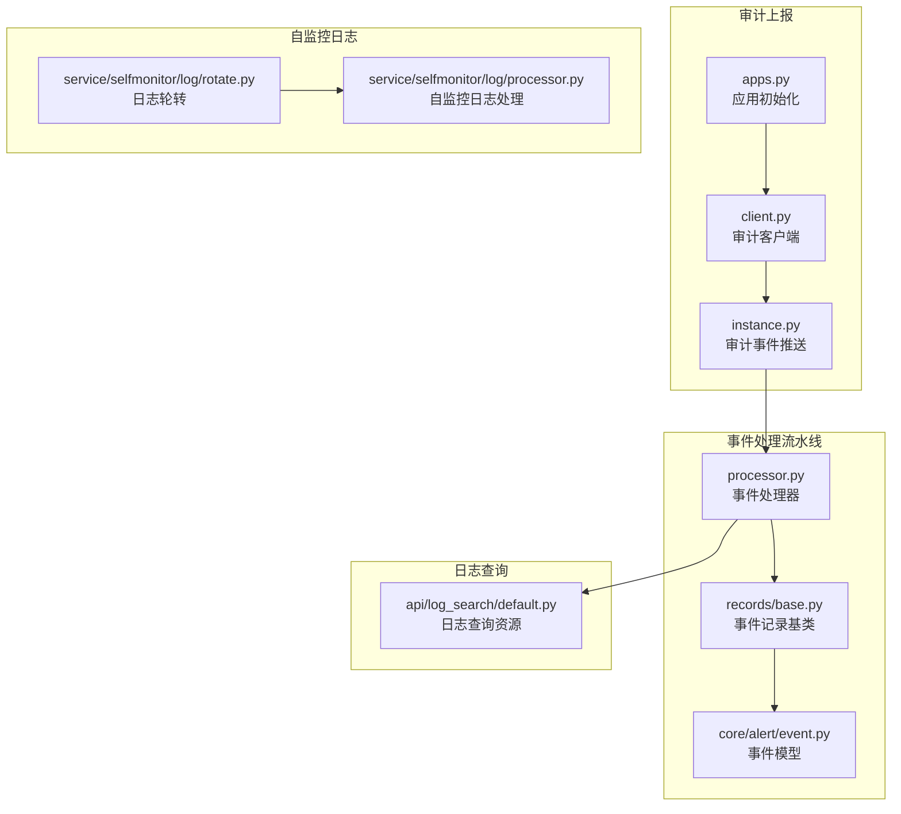
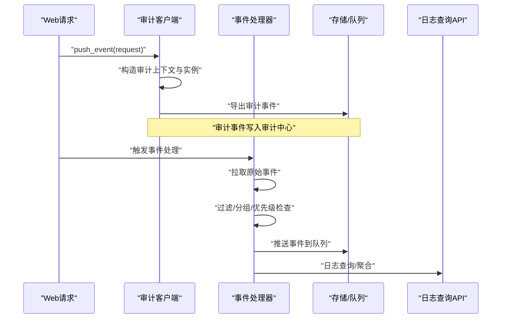
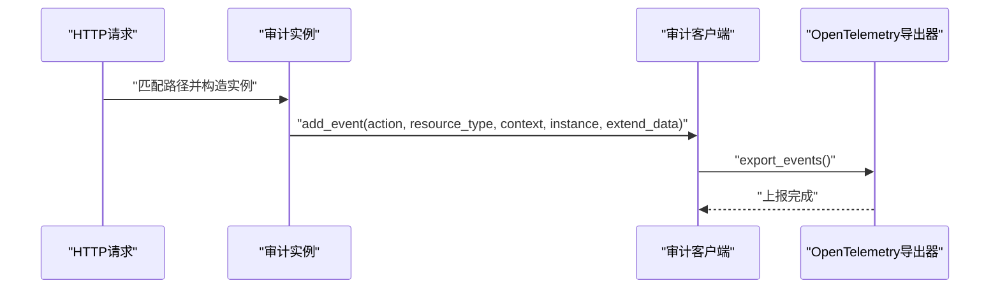
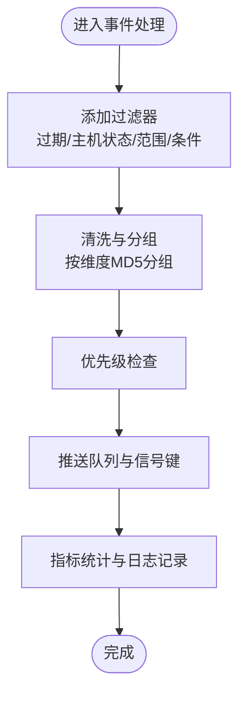
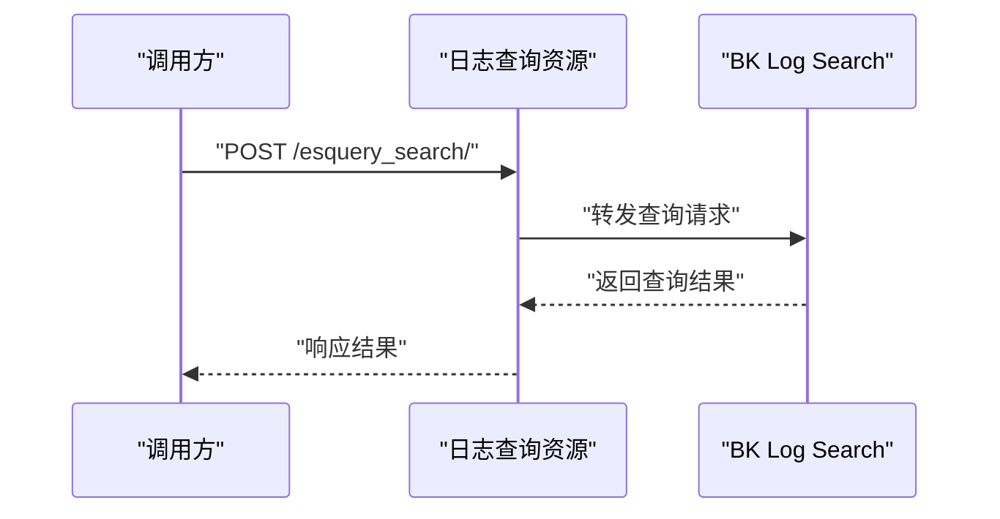
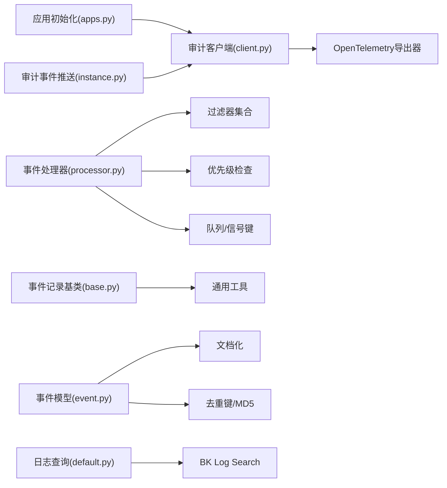

# 审计与日志

<cite>
**本文引用的文件**
- [apps.py](file://bkmonitor/packages/audit/apps.py)
- [client.py](file://bkmonitor/packages/audit/client.py)
- [instance.py](file://bkmonitor/packages/audit/instance.py)
- [processor.py](file://bkmonitor/alarm_backends/service/access/event/processor.py)
- [base.py](file://bkmonitor/alarm_backends/service/access/event/records/base.py)
- [event.py](file://bkmonitor/alarm_backends/core/alert/event.py)
- [default.py](file://bkmonitor/api/log_search/default.py)
- [log/rotate.py](file://bkmonitor/alarm_backends/service/selfmonitor/log/rotate.py)
- [log/processor.py](file://bkmonitor/alarm_backends/service/selfmonitor/log/processor.py)
</cite>

## 目录
1. [简介](#简介)
2. [项目结构](#项目结构)
3. [核心组件](#核心组件)
4. [架构总览](#架构总览)
5. [组件详细分析](#组件详细分析)
6. [依赖关系分析](#依赖关系分析)
7. [性能考量](#性能考量)
8. [故障排查指南](#故障排查指南)
9. [结论](#结论)
10. [附录](#附录)

## 简介
本文件面向监控平台的审计与日志系统，围绕以下目标展开：
- 审计日志设计：覆盖用户操作日志、系统事件日志、安全事件日志的记录策略与上报路径
- 日志格式标准化：统一事件字段、去重键、序列化与导出规范
- 日志聚合与分析：基于事件处理流水线、维度分组与优先级检查的处理链路
- 异常事件检测、安全告警与违规识别：通过策略与过滤器实现事件筛选与抑制
- 存储策略、保留与归档：结合索引生命周期管理与滚动策略
- 审计报告与合规：事件清洗、去重与文档化能力
- 日志安全与完整性：审计上报与导出的可追溯性与防篡改思路

## 项目结构
围绕审计与日志的关键模块分布如下：
- 审计上报与导出：审计客户端、OpenTelemetry 导出器、应用初始化
- 事件处理流水线：原始事件拉取、清洗、过滤、分组、推送与队列
- 日志查询与索引：日志检索 API 资源、索引集与 DSL 查询
- 自监控日志：自监控日志轮转与处理
- 事件模型：事件清洗、去重、严重度与状态标准化

**图表来源**
- [apps.py:18-28](file://bkmonitor/packages/audit/apps.py#L18-L28)
- [client.py:18-22](file://bkmonitor/packages/audit/client.py#L18-L22)
- [instance.py:70-102](file://bkmonitor/packages/audit/instance.py#L70-L102)
- [processor.py:51-364](file://bkmonitor/alarm_backends/service/access/event/processor.py#L51-L364)
- [base.py:25-157](file://bkmonitor/alarm_backends/service/access/event/records/base.py#L25-L157)
- [event.py:23-445](file://bkmonitor/alarm_backends/core/alert/event.py#L23-L445)
- [default.py:21-517](file://bkmonitor/api/log_search/default.py#L21-L517)
- [log/rotate.py](file://bkmonitor/alarm_backends/service/selfmonitor/log/rotate.py)
- [log/processor.py](file://bkmonitor/alarm_backends/service/selfmonitor/log/processor.py)

**章节来源**
- [apps.py:18-28](file://bkmonitor/packages/audit/apps.py#L18-L28)
- [client.py:18-22](file://bkmonitor/packages/audit/client.py#L18-L22)
- [instance.py:70-102](file://bkmonitor/packages/audit/instance.py#L70-L102)
- [processor.py:51-364](file://bkmonitor/alarm_backends/service/access/event/processor.py#L51-L364)
- [base.py:25-157](file://bkmonitor/alarm_backends/service/access/event/records/base.py#L25-L157)
- [event.py:23-445](file://bkmonitor/alarm_backends/core/alert/event.py#L23-L445)
- [default.py:21-517](file://bkmonitor/api/log_search/default.py#L21-L517)
- [log/rotate.py](file://bkmonitor/alarm_backends/service/selfmonitor/log/rotate.py)
- [log/processor.py](file://bkmonitor/alarm_backends/service/selfmonitor/log/processor.py)

## 核心组件
- 审计客户端与导出
  - 审计客户端封装应用标识与密钥，并配置 Django 格式化器与 OpenTelemetry 导出器
  - 应用启动时根据环境变量决定是否启用审计导出
  - 提供 push_event 接口，基于请求路径与正则匹配选择资源类型并上报审计事件
- 事件处理流水线
  - 事件处理器负责拉取原始事件、添加过滤器、按维度分组、优先级检查、推送到队列与信号
  - 事件记录基类提供标准字段清洗、维度 MD5 计算、时间戳解析等通用能力
  - 事件模型负责事件清洗、去重键生成、严重度与状态标准化、文档化输出
- 日志查询与索引
  - 日志查询资源封装 BK Log Search 的 API 基础地址、索引集与 DSL 查询接口
  - 支持索引集字段查询、聚类配置、采集器管理、变量与指标查询等
- 自监控日志
  - 提供日志轮转与处理流程，保障系统内部日志的持续可用与容量控制

**章节来源**
- [client.py:18-22](file://bkmonitor/packages/audit/client.py#L18-L22)
- [apps.py:23-27](file://bkmonitor/packages/audit/apps.py#L23-L27)
- [instance.py:70-102](file://bkmonitor/packages/audit/instance.py#L70-L102)
- [processor.py:51-364](file://bkmonitor/alarm_backends/service/access/event/processor.py#L51-L364)
- [base.py:25-157](file://bkmonitor/alarm_backends/service/access/event/records/base.py#L25-L157)
- [event.py:77-281](file://bkmonitor/alarm_backends/core/alert/event.py#L77-L281)
- [default.py:21-517](file://bkmonitor/api/log_search/default.py#L21-L517)
- [log/rotate.py](file://bkmonitor/alarm_backends/service/selfmonitor/log/rotate.py)
- [log/processor.py](file://bkmonitor/alarm_backends/service/selfmonitor/log/processor.py)

## 架构总览
审计与日志系统通过“审计上报 → 事件处理 → 日志查询/存储”的闭环实现：
- 审计上报：基于请求上下文与资源类型，构造审计事件并通过 OpenTelemetry 导出
- 事件处理：从 Kafka 拉取原始事件，执行过滤、分组、优先级与推送，形成告警信号
- 日志查询：对外提供日志检索 API，支撑日志聚合与分析
- 自监控：对系统内部日志进行轮转与处理，确保可观测性

**图表来源**
- [instance.py:70-102](file://bkmonitor/packages/audit/instance.py#L70-L102)
- [processor.py:295-364](file://bkmonitor/alarm_backends/service/access/event/processor.py#L295-L364)
- [default.py:53-106](file://bkmonitor/api/log_search/default.py#L53-L106)

## 组件详细分析

### 审计上报与导出
- 审计客户端
  - 初始化时注入应用编码、密钥与导出器配置，支持 Django 格式化器与 OTel 导出
- 应用初始化
  - 通过环境变量判断是否启用审计导出，避免在无审计中心时的无效开销
- 审计事件推送
  - 基于请求路径正则匹配资源类型，构造审计上下文与扩展数据，调用客户端导出

**图表来源**
- [client.py:18-22](file://bkmonitor/packages/audit/client.py#L18-L22)
- [apps.py:23-27](file://bkmonitor/packages/audit/apps.py#L23-L27)
- [instance.py:70-102](file://bkmonitor/packages/audit/instance.py#L70-L102)

**章节来源**
- [client.py:18-22](file://bkmonitor/packages/audit/client.py#L18-L22)
- [apps.py:23-27](file://bkmonitor/packages/audit/apps.py#L23-L27)
- [instance.py:70-102](file://bkmonitor/packages/audit/instance.py#L70-L102)

### 事件处理流水线
- 处理器职责
  - 添加过滤器（过期、主机状态、范围、条件）
  - 清洗与分组：按维度 MD5 分组，合并重复事件
  - 优先级检查：对多条事件进行优先级判定
  - 推送：写入 Redis 队列与信号键，统计推送量
- 事件记录基类
  - 提供标准字段清洗、维度字段提取、MD5 维度计算、时间戳解析
- 事件模型
  - 清洗：移除空字段、标准化目标类型、数据类型、标签、时间、严重度、状态
  - 去重：根据去重键生成 MD5，支持策略 ID 与告警名称的差异化
  - 文档化：转换为文档模型，便于后续存储与检索

**图表来源**
- [processor.py:51-176](file://bkmonitor/alarm_backends/service/access/event/processor.py#L51-L176)
- [base.py:120-157](file://bkmonitor/alarm_backends/service/access/event/records/base.py#L120-L157)
- [event.py:77-281](file://bkmonitor/alarm_backends/core/alert/event.py#L77-L281)

**章节来源**
- [processor.py:51-364](file://bkmonitor/alarm_backends/service/access/event/processor.py#L51-L364)
- [base.py:25-157](file://bkmonitor/alarm_backends/service/access/event/records/base.py#L25-L157)
- [event.py:77-445](file://bkmonitor/alarm_backends/core/alert/event.py#L77-L445)

### 日志查询与索引
- 日志查询资源
  - 统一封装 BK Log Search 的 API 基础地址，支持多租户模式与组件网关
  - 提供索引集查询、DSL 查询、字段检索、聚类配置、采集器管理等接口
- 查询参数
  - 支持索引集 ID 或索引列表+场景+存储集群+时间字段
  - 支持关键字、过滤条件、聚合、高亮、排序、滚动查询等
- 返回策略
  - 默认不包含结束时间点，避免窗口数据不准确

**图表来源**
- [default.py:53-106](file://bkmonitor/api/log_search/default.py#L53-L106)
- [default.py:149-176](file://bkmonitor/api/log_search/default.py#L149-L176)

**章节来源**
- [default.py:21-517](file://bkmonitor/api/log_search/default.py#L21-L517)

### 自监控日志
- 日志轮转
  - 提供自监控日志的轮转策略，保障日志文件大小与历史留存可控
- 日志处理
  - 对自监控日志进行统一处理，确保系统内部可观测性与稳定性

**章节来源**
- [log/rotate.py](file://bkmonitor/alarm_backends/service/selfmonitor/log/rotate.py)
- [log/processor.py](file://bkmonitor/alarm_backends/service/selfmonitor/log/processor.py)

## 依赖关系分析
- 审计模块依赖
  - 审计客户端依赖 Django 格式化器与 OpenTelemetry 导出器
  - 应用初始化依赖环境变量以启用导出
- 事件处理依赖
  - 事件处理器依赖过滤器、优先级检查、Redis/Kafka 队列与指标监控
  - 事件记录基类依赖通用工具函数与标准字段常量
  - 事件模型依赖文档化与去重工具
- 日志查询依赖
  - 日志查询资源依赖 BK Log Search 的 API 地址与组件网关配置

**图表来源**
- [client.py:18-22](file://bkmonitor/packages/audit/client.py#L18-L22)
- [apps.py:23-27](file://bkmonitor/packages/audit/apps.py#L23-L27)
- [instance.py:70-102](file://bkmonitor/packages/audit/instance.py#L70-L102)
- [processor.py:51-176](file://bkmonitor/alarm_backends/service/access/event/processor.py#L51-L176)
- [base.py:25-157](file://bkmonitor/alarm_backends/service/access/event/records/base.py#L25-L157)
- [event.py:77-281](file://bkmonitor/alarm_backends/core/alert/event.py#L77-L281)
- [default.py:21-517](file://bkmonitor/api/log_search/default.py#L21-L517)

**章节来源**
- [client.py:18-22](file://bkmonitor/packages/audit/client.py#L18-L22)
- [apps.py:23-27](file://bkmonitor/packages/audit/apps.py#L23-L27)
- [instance.py:70-102](file://bkmonitor/packages/audit/instance.py#L70-L102)
- [processor.py:51-176](file://bkmonitor/alarm_backends/service/access/event/processor.py#L51-L176)
- [base.py:25-157](file://bkmonitor/alarm_backends/service/access/event/records/base.py#L25-L157)
- [event.py:77-281](file://bkmonitor/alarm_backends/core/alert/event.py#L77-L281)
- [default.py:21-517](file://bkmonitor/api/log_search/default.py#L21-L517)

## 性能考量
- 事件处理
  - 按维度 MD5 分组减少重复事件写入，降低下游压力
  - 优先级检查避免低价值事件占用资源
  - Redis 批量管道写入与 TTL 控制提升吞吐与回收效率
- 日志查询
  - 默认不包含结束时间点，避免边界误差导致的重复或遗漏
  - 支持滚动查询与高亮/聚合参数，平衡查询性能与结果质量
- 审计导出
  - 仅在配置环境变量时启用，避免不必要的网络开销
  - 导出器异步化，不影响主业务路径

[本节为通用性能建议，无需特定文件引用]

## 故障排查指南
- 审计导出未生效
  - 检查环境变量是否配置，确认应用初始化逻辑是否启用导出
  - 核对审计客户端配置与导出器可用性
- 事件处理异常
  - 查看事件处理器日志，定位拉取、过滤、分组、推送阶段的问题
  - 检查锁竞争与队列写入异常，关注指标与异常计数
- 日志查询失败
  - 校验 BK Log Search API 基础地址与组件网关配置
  - 检查索引集参数、时间范围与过滤条件是否正确
- 自监控日志问题
  - 检查轮转策略与处理流程，确认日志文件大小与保留策略符合预期

**章节来源**
- [apps.py:23-27](file://bkmonitor/packages/audit/apps.py#L23-L27)
- [client.py:18-22](file://bkmonitor/packages/audit/client.py#L18-L22)
- [processor.py:315-348](file://bkmonitor/alarm_backends/service/access/event/processor.py#L315-L348)
- [default.py:21-517](file://bkmonitor/api/log_search/default.py#L21-L517)
- [log/rotate.py](file://bkmonitor/alarm_backends/service/selfmonitor/log/rotate.py)
- [log/processor.py](file://bkmonitor/alarm_backends/service/selfmonitor/log/processor.py)

## 结论
该审计与日志系统通过“审计上报 + 事件处理 + 日志查询 + 自监控”的协同，实现了：
- 审计事件的标准化上报与可追溯
- 事件处理的过滤、分组、优先级与队列推送
- 日志查询的统一接口与灵活参数
- 自监控日志的轮转与处理保障系统可观测性

建议在生产环境中：
- 明确审计导出开关与目标，确保合规与性能平衡
- 优化事件处理的过滤策略与优先级规则，降低无效事件成本
- 规范日志查询参数与索引生命周期，提升检索效率与成本控制
- 完善审计报告与合规检查流程，强化安全态势分析能力

[本节为总结性内容，无需特定文件引用]

## 附录
- 审计日志记录策略
  - 用户操作日志：基于请求上下文与资源类型匹配，构造审计事件并上报
  - 系统事件日志：通过事件处理流水线捕获系统异常与告警事件
  - 安全事件日志：结合事件模型的严重度与状态，识别高风险事件并纳入审计
- 日志格式标准化
  - 事件清洗：统一字段、标签、时间、目标类型与数据类型
  - 去重键：支持策略 ID 与告警名称差异化，生成 MD5 保证唯一性
  - 文档化：转换为文档模型，便于后续存储与检索
- 日志聚合与分析
  - 事件处理流水线提供维度分组与优先级检查，支撑聚合与分析
  - 日志查询资源提供 DSL 与字段检索，满足复杂分析需求
- 存储策略、保留与归档
  - 建议结合索引生命周期管理与滚动策略，控制存储成本与查询性能
- 审计报告与合规
  - 事件模型与文档化能力支撑审计报告生成与合规检查
- 日志安全与完整性
  - 审计上报采用 OpenTelemetry 导出器，具备可追溯性；建议配合校验与审计中心的完整性保护机制

[本节为概念性内容，无需特定文件引用]