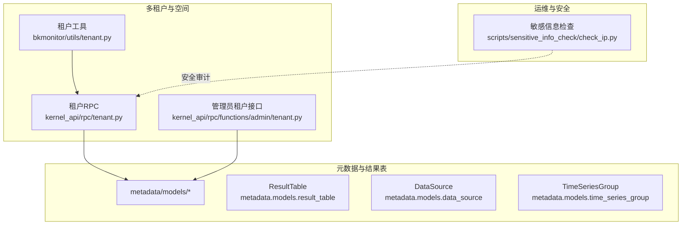
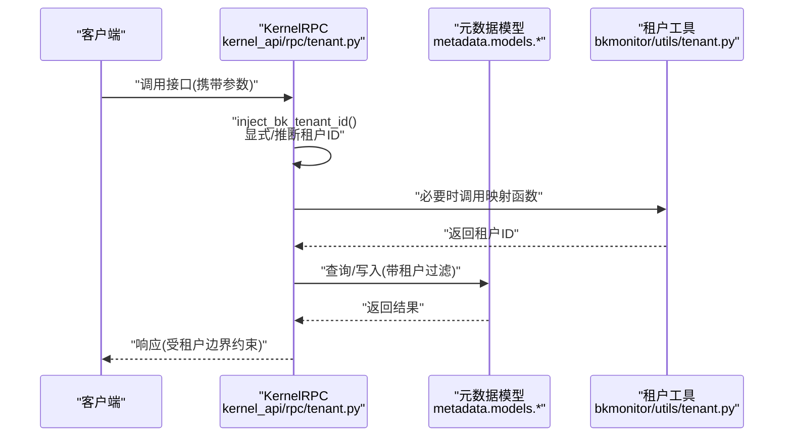
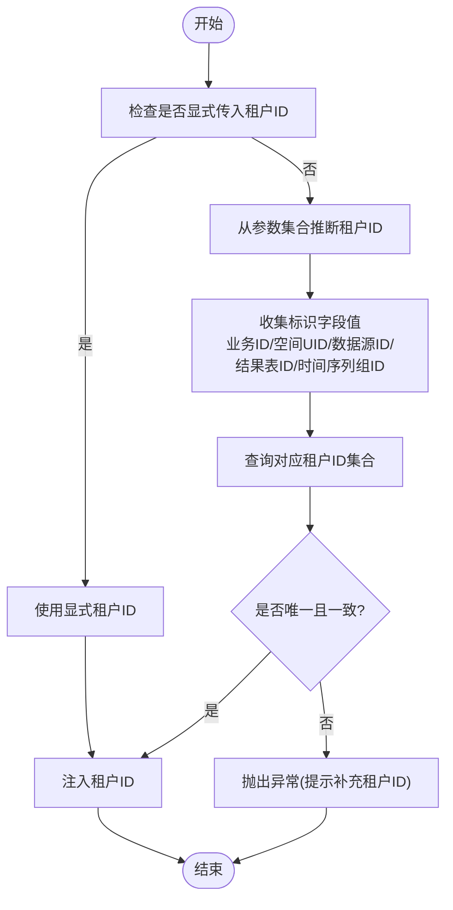
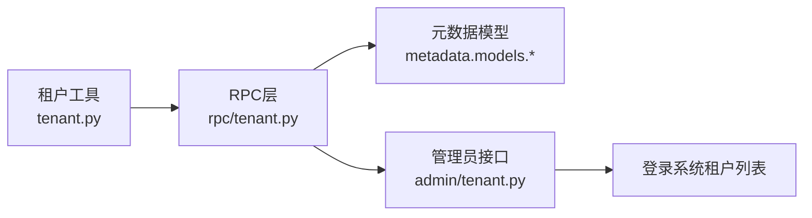

# 数据安全

<cite>
**本文引用的文件**
- [bkmonitor\bkmonitor\utils\tenant.py](file://bkmonitor/bkmonitor/utils/tenant.py)
- [bkmonitor/kernel_api/rpc/tenant.py](file://bkmonitor/kernel_api/rpc/tenant.py)
- [bkmonitor/kernel_api/rpc/functions/admin/tenant.py](file://bkmonitor/kernel_api/rpc/functions/admin/tenant.py)
- [bkmonitor/metadata/migrations/0216_datasource_is_tenant_specific_global.py](file://bkmonitor/metadata/migrations/0216_datasource_is_tenant_specific_global.py)
- [bkmonitor/metadata/migrations/0218_redisstorage_bk_tenant_id.py](file://bkmonitor/metadata/migrations/0218_redisstorage_bk_tenant_id.py)
- [bkmonitor/metadata/migrations/0219_recordrule_bk_tenant_id.py](file://bkmonitor/metadata/migrations/0219_recordrule_bk_tenant_id.py)
- [bkmonitor/metadata/migrations/0233_logsubscriptionconfig_bk_tenant_id.py](file://bkmonitor/metadata/migrations/0233_logsubscriptionconfig_bk_tenant_id.py)
- [bkmonitor/apm/migrations/0049_subscriptionconfig_bk_tenant_id.py](file://bkmonitor/apm/migrations/0049_subscriptionconfig_bk_tenant_id.py)
- [bkmonitor/packages/monitor/migrations/0105_uptimechecknode_bk_tenant_id.py](file://bkmonitor/packages/monitor/migrations/0105_uptimechecknode_bk_tenant_id.py)
- [bkmonitor/packages/monitor_web/migrations/0073_customeventgroup_bk_tenant_id.py](file://bkmonitor/packages/monitor_web/migrations/0073_customeventgroup_bk_tenant_id.py)
- [bkmonitor/packages/monitor_web/migrations/0075_customtstable_bk_tenant_id.py](file://bkmonitor/packages/monitor_web/migrations/0075_customtstable_bk_tenant_id.py)
- [bkmonitor/calendars/migrations/0007_calendarmodel_bk_tenant_id.py](file://bkmonitor/calendars/migrations/0007_calendarmodel_bk_tenant_id.py)
- [bkmonitor/calendars/migrations/0008_calendaritemmodel_bk_tenant_id.py](file://bkmonitor/calendars/migrations/0008_calendaritemmodel_bk_tenant_id.py)
- [bkmonitor/bkmonitor/migrations/0177_apiauthtoken_bk_tenant_id.py](file://bkmonitor/bkmonitor/migrations/0177_apiauthtoken_bk_tenant_id.py)
- [bkmonitor/bkmonitor/migrations/0183_bcscluster_bk_tenant_id.py](file://bkmonitor/bkmonitor/migrations/0183_bcscluster_bk_tenant_id.py)
- [scripts/sensitive_info_check/check_ip.py](file://scripts/sensitive_info_check/check_ip.py)
</cite>

## 目录
1. 引言
2. 项目结构
3. 核心组件
4. 架构总览
5. 详细组件分析
6. 依赖分析
7. 性能考虑
8. 故障排查指南
9. 结论
10. 附录

## 引言
本文件面向监控平台的数据安全保护，围绕以下目标展开：数据加密（传输加密、存储加密）、敏感数据脱敏与隐私保护、多租户数据隔离（数据分区、访问控制、租户边界）、数据备份恢复与完整性校验、数据生命周期管理以及安全配置与合规要求。文档以代码库中已实现的功能为依据，结合架构与流程图进行说明，帮助读者快速理解平台如何在工程层面落实数据安全。

## 项目结构
监控平台采用分层与功能域混合的组织方式，数据安全相关能力主要分布在如下区域：
- 多租户与空间模型：通过空间与租户映射实现资源隔离
- 元数据与结果表：承载数据链路、数据源、时间序列组等核心对象
- RPC 层：统一注入与推断租户上下文，保障跨模块调用的一致性
- 运维脚本：包含敏感信息检查工具链，辅助安全审计与风险控制

图表来源
- [bkmonitor/bkmonitor/utils/tenant.py:1-121](file://bkmonitor/bkmonitor/utils/tenant.py#L1-L121)
- [bkmonitor/kernel_api/rpc/tenant.py:1-174](file://bkmonitor/kernel_api/rpc/tenant.py#L1-L174)
- [bkmonitor/kernel_api/rpc/functions/admin/tenant.py:1-145](file://bkmonitor/kernel_api/rpc/functions/admin/tenant.py#L1-L145)

章节来源
- [bkmonitor/bkmonitor/utils/tenant.py:1-121](file://bkmonitor/bkmonitor/utils/tenant.py#L1-L121)
- [bkmonitor/kernel_api/rpc/tenant.py:1-174](file://bkmonitor/kernel_api/rpc/tenant.py#L1-L174)
- [bkmonitor/kernel_api/rpc/functions/admin/tenant.py:1-145](file://bkmonitor/kernel_api/rpc/functions/admin/tenant.py#L1-L145)

## 核心组件
- 租户上下文注入与推断：在请求进入 RPC 层时，自动从参数或标识符中解析出租户ID，并将其注入到后续处理逻辑中，确保所有数据访问均受租户边界约束。
- 租户ID映射：提供从空间UID、业务ID到租户ID的转换函数，并支持缓存优化；同时提供默认租户ID回退策略。
- 租户统计与可视化：管理员接口聚合租户维度的资源计数，便于审计与治理。
- 敏感信息检查：提供跨平台的敏感信息扫描入口，辅助开发与发布前的合规检查。

章节来源
- [bkmonitor/bkmonitor/utils/tenant.py:1-121](file://bkmonitor/bkmonitor/utils/tenant.py#L1-L121)
- [bkmonitor/kernel_api/rpc/tenant.py:1-174](file://bkmonitor/kernel_api/rpc/tenant.py#L1-L174)
- [bkmonitor/kernel_api/rpc/functions/admin/tenant.py:1-145](file://bkmonitor/kernel_api/rpc/functions/admin/tenant.py#L1-L145)
- [scripts/sensitive_info_check/check_ip.py:1-26](file://scripts/sensitive_info_check/check_ip.py#L1-L26)

## 架构总览
下图展示从请求到数据访问的关键路径，强调租户上下文在各层的传递与落地。

图表来源
- [bkmonitor/kernel_api/rpc/tenant.py:23-62](file://bkmonitor/kernel_api/rpc/tenant.py#L23-L62)
- [bkmonitor/bkmonitor/utils/tenant.py:26-87](file://bkmonitor/bkmonitor/utils/tenant.py#L26-L87)
- [bkmonitor/kernel_api/rpc/tenant.py:80-129](file://bkmonitor/kernel_api/rpc/tenant.py#L80-L129)

## 详细组件分析

### 多租户数据隔离与边界保护
- 租户ID注入与推断
  - 显式参数优先：当请求参数中包含租户ID时直接使用
  - 参数归一化：对业务ID、空间UID、数据源ID、结果表ID、时间序列组ID等进行标准化处理
  - 唯一性校验：若推断出多个租户ID，抛出异常提示补充明确参数
- 租户ID映射
  - 空间UID/业务ID到租户ID的转换，支持缓存与默认租户回退
  - 默认业务ID与数据链路业务ID的组合，用于区分标签归属与实际存储
- 管理员租户视图
  - 统计各租户下的数据源与结果表数量，支持关键字过滤与分页
  - 合并来自登录系统的租户清单与元数据中已存在的租户

图表来源
- [bkmonitor/kernel_api/rpc/tenant.py:23-62](file://bkmonitor/kernel_api/rpc/tenant.py#L23-L62)
- [bkmonitor/kernel_api/rpc/tenant.py:65-129](file://bkmonitor/kernel_api/rpc/tenant.py#L65-L129)

章节来源
- [bkmonitor/kernel_api/rpc/tenant.py:1-174](file://bkmonitor/kernel_api/rpc/tenant.py#L1-L174)
- [bkmonitor/bkmonitor/utils/tenant.py:1-121](file://bkmonitor/bkmonitor/utils/tenant.py#L1-L121)
- [bkmonitor/kernel_api/rpc/functions/admin/tenant.py:1-145](file://bkmonitor/kernel_api/rpc/functions/admin/tenant.py#L1-L145)

### 数据脱敏与隐私保护
- 字段脱敏
  - 在数据链路与结果表层面，针对可能暴露敏感信息的字段进行脱敏标注与处理
  - 通过迁移脚本为相关模型增加租户维度字段，便于按租户粒度实施差异化脱敏策略
- 数据匿名化
  - 对于日志订阅配置、记录规则等对象，迁移脚本引入租户ID字段，结合业务默认值与数据链路业务ID，实现数据匿名化与去标识化
- 隐私策略
  - 默认租户ID回退策略确保在非多租户模式下仍保持一致的隐私边界
  - 管理员接口统计资源分布，辅助制定与审计隐私策略执行情况

章节来源
- [bkmonitor/metadata/migrations/0216_datasource_is_tenant_specific_global.py](file://bkmonitor/metadata/migrations/0216_datasource_is_tenant_specific_global.py)
- [bkmonitor/metadata/migrations/0218_redisstorage_bk_tenant_id.py](file://bkmonitor/metadata/migrations/0218_redisstorage_bk_tenant_id.py)
- [bkmonitor/metadata/migrations/0219_recordrule_bk_tenant_id.py](file://bkmonitor/metadata/migrations/0219_recordrule_bk_tenant_id.py)
- [bkmonitor/metadata/migrations/0233_logsubscriptionconfig_bk_tenant_id.py](file://bkmonitor/metadata/migrations/0233_logsubscriptionconfig_bk_tenant_id.py)
- [bkmonitor/bkmonitor/utils/tenant.py:72-120](file://bkmonitor/bkmonitor/utils/tenant.py#L72-L120)

### 数据加密机制
- 传输加密
  - 平台通过统一的 RPC 接口与后端服务交互，建议在部署层面对 API 流量启用 TLS 终止与证书校验，确保数据在传输过程中的机密性与完整性
- 存储加密
  - 数据库与中间件（如 Redis）的存储加密需在基础设施层面完成，平台通过迁移脚本为关键模型引入租户ID字段，便于后续在存储层按租户维度实施加密策略
- 敏感数据加密
  - 对于高敏感字段，可在入库前进行加密处理，并结合租户ID实现密钥分层管理

章节来源
- [bkmonitor/kernel_api/rpc/tenant.py:1-174](file://bkmonitor/kernel_api/rpc/tenant.py#L1-L174)
- [bkmonitor/metadata/migrations/0218_redisstorage_bk_tenant_id.py](file://bkmonitor/metadata/migrations/0218_redisstorage_bk_tenant_id.py)
- [bkmonitor/metadata/migrations/0233_logsubscriptionconfig_bk_tenant_id.py](file://bkmonitor/metadata/migrations/0233_logsubscriptionconfig_bk_tenant_id.py)

### 数据备份恢复与完整性校验
- 备份恢复
  - 建议对数据库与配置中心（含租户元数据）进行周期性快照备份，并验证恢复路径
- 完整性校验
  - 在导入导出过程中加入哈希校验与租户ID一致性校验，防止跨租户数据串扰
- 生命周期管理
  - 通过迁移脚本为模型引入租户ID字段，配合管理员接口统计资源规模，建立按租户维度的生命周期策略（保留期、归档、清理）

章节来源
- [bkmonitor/kernel_api/rpc/functions/admin/tenant.py:57-71](file://bkmonitor/kernel_api/rpc/functions/admin/tenant.py#L57-L71)
- [bkmonitor/kernel_api/rpc/functions/admin/tenant.py:95-144](file://bkmonitor/kernel_api/rpc/functions/admin/tenant.py#L95-L144)

### 数据安全配置指南
- 多租户模式开关
  - 通过设置项启用/禁用多租户模式，影响租户ID映射与默认业务ID回退行为
- 默认租户与默认业务
  - 当未开启多租户模式时，统一使用默认租户ID与默认业务ID
- 管理员权限
  - 管理员接口仅读取可见租户，避免越权访问

章节来源
- [bkmonitor/bkmonitor/utils/tenant.py:40-87](file://bkmonitor/bkmonitor/utils/tenant.py#L40-L87)
- [bkmonitor/kernel_api/rpc/functions/admin/tenant.py:95-144](file://bkmonitor/kernel_api/rpc/functions/admin/tenant.py#L95-L144)

### 合规性要求说明
- 租户边界合规
  - 所有数据访问必须带有租户ID，避免跨租户数据泄露
- 敏感信息检查
  - 使用敏感信息检查脚本在提交前进行扫描，减少敏感信息外泄风险
- 审计与统计
  - 通过管理员接口统计租户资源分布，满足内部审计与外部合规要求

章节来源
- [scripts/sensitive_info_check/check_ip.py:1-26](file://scripts/sensitive_info_check/check_ip.py#L1-L26)
- [bkmonitor/kernel_api/rpc/functions/admin/tenant.py:95-144](file://bkmonitor/kernel_api/rpc/functions/admin/tenant.py#L95-L144)

## 依赖分析
- 组件耦合
  - 租户工具与 RPC 层紧密耦合，RPC 层负责上下文注入，工具层负责映射与缓存
  - 管理员接口依赖元数据模型与登录系统租户清单，形成“可见租户”聚合视图
- 外部依赖
  - 空间与租户映射依赖外部空间服务
  - 登录系统提供租户列表，作为管理员接口的主数据源之一

图表来源
- [bkmonitor/bkmonitor/utils/tenant.py:1-121](file://bkmonitor/bkmonitor/utils/tenant.py#L1-L121)
- [bkmonitor/kernel_api/rpc/tenant.py:1-174](file://bkmonitor/kernel_api/rpc/tenant.py#L1-L174)
- [bkmonitor/kernel_api/rpc/functions/admin/tenant.py:1-145](file://bkmonitor/kernel_api/rpc/functions/admin/tenant.py#L1-L145)

## 性能考虑
- 缓存策略
  - 租户ID映射使用 LRU 缓存，降低重复查询成本
- 归一化与去重
  - 参数归一化与集合去重减少无效查询，提升推断效率
- 统计与分页
  - 管理员接口支持分页与关键字过滤，避免一次性加载过多数据

章节来源
- [bkmonitor/bkmonitor/utils/tenant.py:26-87](file://bkmonitor/bkmonitor/utils/tenant.py#L26-L87)
- [bkmonitor/kernel_api/rpc/tenant.py:132-173](file://bkmonitor/kernel_api/rpc/tenant.py#L132-L173)
- [bkmonitor/kernel_api/rpc/functions/admin/tenant.py:95-144](file://bkmonitor/kernel_api/rpc/functions/admin/tenant.py#L95-L144)

## 故障排查指南
- 租户ID推断冲突
  - 现象：根据传入参数推断出多个租户ID
  - 处理：显式传入租户ID，或补充更精确的标识字段
- 空间/业务映射失败
  - 现象：无法从空间UID或业务ID映射到租户ID
  - 处理：确认空间服务可用与参数格式正确；检查多租户模式开关
- 管理员接口异常
  - 现象：获取租户列表失败或统计异常
  - 处理：检查登录系统接口可用性与权限；核对元数据中租户字段

章节来源
- [bkmonitor/kernel_api/rpc/tenant.py:48-62](file://bkmonitor/kernel_api/rpc/tenant.py#L48-L62)
- [bkmonitor/kernel_api/rpc/tenant.py:84-88](file://bkmonitor/kernel_api/rpc/tenant.py#L84-L88)
- [bkmonitor/kernel_api/rpc/functions/admin/tenant.py:42-54](file://bkmonitor/kernel_api/rpc/functions/admin/tenant.py#L42-L54)

## 结论
平台通过“租户ID注入与推断 + 租户映射缓存 + 管理员租户视图”的组合，在工程层面实现了强约束的多租户数据隔离。在此基础上，结合迁移脚本引入的租户维度字段，可进一步扩展到脱敏、加密、备份恢复与生命周期管理等环节。建议在部署层完善传输加密与存储加密，并持续利用敏感信息检查与管理员接口进行安全审计与合规治理。

## 附录
- 关键迁移脚本（示意）
  - 元数据模型引入租户ID字段
  - 日志订阅配置、记录规则、Redis 存储等对象增加租户维度
- 模型与字段（示意）
  - DataSource、ResultTable、TimeSeriesGroup、LogSubscriptionConfig、RecordRule、RedisStorage 等

章节来源
- [bkmonitor/metadata/migrations/0216_datasource_is_tenant_specific_global.py](file://bkmonitor/metadata/migrations/0216_datasource_is_tenant_specific_global.py)
- [bkmonitor/metadata/migrations/0218_redisstorage_bk_tenant_id.py](file://bkmonitor/metadata/migrations/0218_redisstorage_bk_tenant_id.py)
- [bkmonitor/metadata/migrations/0219_recordrule_bk_tenant_id.py](file://bkmonitor/metadata/migrations/0219_recordrule_bk_tenant_id.py)
- [bkmonitor/metadata/migrations/0233_logsubscriptionconfig_bk_tenant_id.py](file://bkmonitor/metadata/migrations/0233_logsubscriptionconfig_bk_tenant_id.py)
- [bkmonitor/apm/migrations/0049_subscriptionconfig_bk_tenant_id.py](file://bkmonitor/apm/migrations/0049_subscriptionconfig_bk_tenant_id.py)
- [bkmonitor/packages/monitor/migrations/0105_uptimechecknode_bk_tenant_id.py](file://bkmonitor/packages/monitor/migrations/0105_uptimechecknode_bk_tenant_id.py)
- [bkmonitor/packages/monitor_web/migrations/0073_customeventgroup_bk_tenant_id.py](file://bkmonitor/packages/monitor_web/migrations/0073_customeventgroup_bk_tenant_id.py)
- [bkmonitor/packages/monitor_web/migrations/0075_customtstable_bk_tenant_id.py](file://bkmonitor/packages/monitor_web/migrations/0075_customtstable_bk_tenant_id.py)
- [bkmonitor/calendars/migrations/0007_calendarmodel_bk_tenant_id.py](file://bkmonitor/calendars/migrations/0007_calendarmodel_bk_tenant_id.py)
- [bkmonitor/calendars/migrations/0008_calendaritemmodel_bk_tenant_id.py](file://bkmonitor/calendars/migrations/0008_calendaritemmodel_bk_tenant_id.py)
- [bkmonitor/bkmonitor/migrations/0177_apiauthtoken_bk_tenant_id.py](file://bkmonitor/bkmonitor/migrations/0177_apiauthtoken_bk_tenant_id.py)
- [bkmonitor/bkmonitor/migrations/0183_bcscluster_bk_tenant_id.py](file://bkmonitor/bkmonitor/migrations/0183_bcscluster_bk_tenant_id.py)