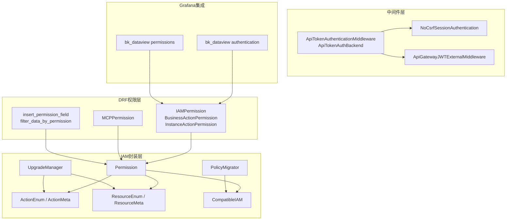
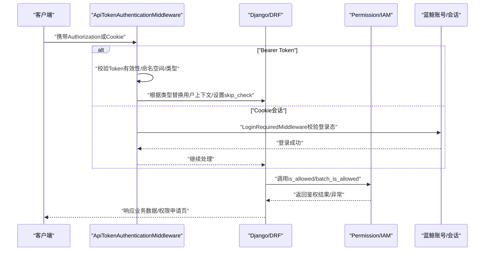
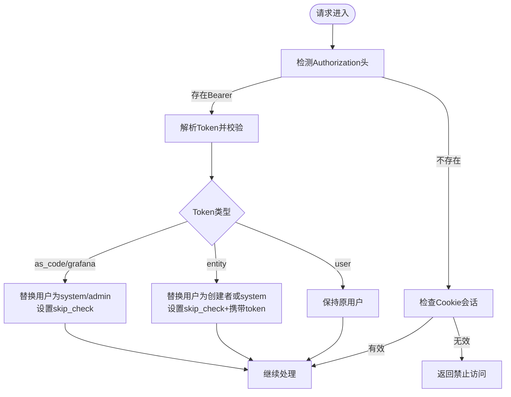
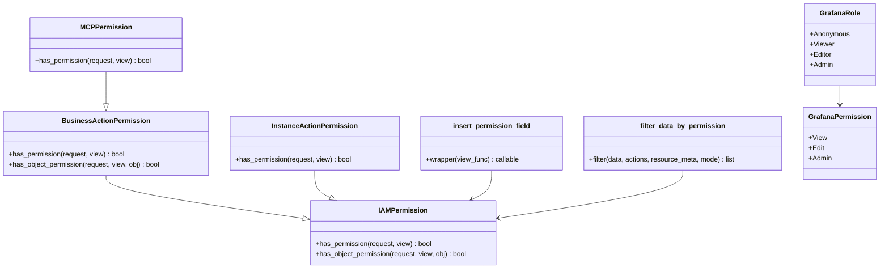
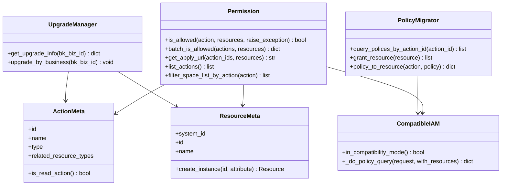
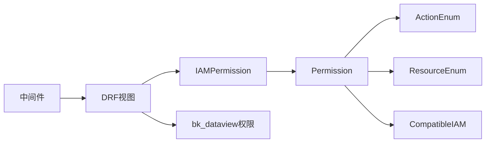

# 认证与授权

<cite>
**本文引用的文件**
- [bkmonitor\bkmonitor\middlewares\authentication.py](file://bkmonitor/bkmonitor/middlewares/authentication.py)
- [bkmonitor\bk_dataview\authentication.py](file://bkmonitor/bk_dataview/authentication.py)
- [bkmonitor\bk_dataview\permissions.py](file://bkmonitor/bk_dataview/permissions.py)
- [bkmonitor\bkmonitor\iam\permission.py](file://bkmonitor/bkmonitor/iam/permission.py)
- [bkmonitor\bkmonitor\iam\action.py](file://bkmonitor/bkmonitor/iam/action.py)
- [bkmonitor\bkmonitor\iam\resource.py](file://bkmonitor/bkmonitor/iam/resource.py)
- [bkmonitor\bkmonitor\iam\drf.py](file://bkmonitor/bkmonitor/iam/drf.py)
- [bkmonitor\bkmonitor\iam\compatible.py](file://bkmonitor/bkmonitor/iam/compatible.py)
- [bkmonitor\bkmonitor\iam\migrate.py](file://bkmonitor/bkmonitor/iam/migrate.py)
- [bkmonitor\bkmonitor\iam\upgrade.py](file://bkmonitor/bkmonitor/iam/upgrade.py)
- [bkmonitor\bkmonitor\iam\__init__.py](file://bkmonitor/bkmonitor/iam/__init__.py)
</cite>

## 目录
1. [简介](#简介)
2. [项目结构](#项目结构)
3. [核心组件](#核心组件)
4. [架构总览](#架构总览)
5. [详细组件分析](#详细组件分析)
6. [依赖分析](#依赖分析)
7. [性能考虑](#性能考虑)
8. [故障排查指南](#故障排查指南)
9. [结论](#结论)
10. [附录](#附录)

## 简介
本文件面向蓝鲸智云监控平台的认证与授权体系，系统化梳理用户身份验证、会话管理、Token机制与OAuth集成，以及IAM权限系统的资源定义、权限模型、角色管理与访问控制策略。文档覆盖多租户环境下的权限隔离、动态权限分配与权限继承机制，并提供配置要点、API调用路径、常见问题与安全最佳实践。

## 项目结构
围绕认证与授权的关键模块分布如下：
- 中间件层：统一处理登录态、会话、API网关JWT与自定义Token鉴权
- DRF权限层：基于IAM的权限检查与批量权限注入
- IAM封装层：动作与资源定义、兼容模式、策略迁移与升级
- Grafana集成：组织/角色/权限映射与访问控制

**图表来源**
- [bkmonitor\bkmonitor\middlewares\authentication.py:1-140](file://bkmonitor/bkmonitor/middlewares/authentication.py#L1-L140)
- [bkmonitor\bkmonitor\iam\drf.py:1-363](file://bkmonitor/bkmonitor/iam/drf.py#L1-L363)
- [bkmonitor\bkmonitor\iam\permission.py:1-519](file://bkmonitor/bkmonitor/iam/permission.py#L1-L519)
- [bkmonitor\bkmonitor\iam\action.py:1-681](file://bkmonitor/bkmonitor/iam/action.py#L1-L681)
- [bkmonitor\bkmonitor\iam\resource.py:1-214](file://bkmonitor/bkmonitor/iam/resource.py#L1-L214)
- [bkmonitor\bkmonitor\iam\compatible.py:1-158](file://bkmonitor/bkmonitor/iam/compatible.py#L1-L158)
- [bkmonitor\bk_dataview\authentication.py:1-41](file://bkmonitor/bk_dataview/authentication.py#L1-L41)
- [bkmonitor\bk_dataview\permissions.py:1-96](file://bkmonitor/bk_dataview/permissions.py#L1-L96)

**章节来源**
- [bkmonitor\bkmonitor\middlewares\authentication.py:1-140](file://bkmonitor/bkmonitor/middlewares/authentication.py#L1-L140)
- [bkmonitor\bkmonitor\iam\drf.py:1-363](file://bkmonitor/bkmonitor/iam/drf.py#L1-L363)
- [bkmonitor\bkmonitor\iam\permission.py:1-519](file://bkmonitor/bkmonitor/iam/permission.py#L1-L519)
- [bkmonitor\bkmonitor\iam\action.py:1-681](file://bkmonitor/bkmonitor/iam/action.py#L1-L681)
- [bkmonitor\bkmonitor\iam\resource.py:1-214](file://bkmonitor/bkmonitor/iam/resource.py#L1-L214)
- [bkmonitor\bkmonitor\iam\compatible.py:1-158](file://bkmonitor/bkmonitor/iam/compatible.py#L1-L158)
- [bkmonitor\bk_dataview\authentication.py:1-41](file://bkmonitor/bk_dataview/authentication.py#L1-L41)
- [bkmonitor\bk_dataview\permissions.py:1-96](file://bkmonitor/bk_dataview/permissions.py#L1-L96)

## 核心组件
- 登录与会话
  - 会话认证：基于Django Session的认证类，支持CSRF豁免
  - 登录中间件：集成蓝鲸账号登录态校验
- Token与API网关
  - 自定义Token认证：支持按类型切换用户上下文、命名空间与租户隔离
  - API网关JWT外部中间件：使用配置的公钥解析JWT
- DRF权限控制
  - IAMPermission：统一调用Permission进行鉴权
  - BusinessActionPermission/InstanceActionPermission：按业务或实例维度鉴权
  - MCPPermission：动态权限动作选择
  - 权限字段注入与数据过滤：批量鉴权后回填权限或按权限过滤数据
- IAM封装
  - Permission：封装IAM客户端、动作/资源构建、批量鉴权、策略查询、申请链接生成
  - ActionEnum/ResourceEnum：权限动作与资源类型的集中定义
  - CompatibleIAM：兼容V1/V2策略表达式与查询
  - PolicyMigrator/UpgradeManager：策略迁移与批量升级

**章节来源**
- [bkmonitor\bkmonitor\middlewares\authentication.py:25-140](file://bkmonitor/bkmonitor/middlewares/authentication.py#L25-L140)
- [bkmonitor\bkmonitor\iam\drf.py:34-363](file://bkmonitor/bkmonitor/iam/drf.py#L34-L363)
- [bkmonitor\bkmonitor\iam\permission.py:83-519](file://bkmonitor/bkmonitor/iam/permission.py#L83-L519)
- [bkmonitor\bkmonitor\iam\action.py:18-681](file://bkmonitor/bkmonitor/iam/action.py#L18-L681)
- [bkmonitor\bkmonitor\iam\resource.py:27-214](file://bkmonitor/bkmonitor/iam/resource.py#L27-L214)
- [bkmonitor\bkmonitor\iam\compatible.py:20-158](file://bkmonitor/bkmonitor/iam/compatible.py#L20-L158)
- [bkmonitor\bkmonitor\iam\migrate.py:35-218](file://bkmonitor/bkmonitor/iam/migrate.py#L35-L218)
- [bkmonitor\bkmonitor\iam\upgrade.py:28-129](file://bkmonitor/bkmonitor/iam/upgrade.py#L28-L129)

## 架构总览
认证与授权的整体流程如下：
- Web请求进入中间件链，优先尝试Token认证；若未携带Token则回落到会话认证
- DRF视图在执行业务逻辑前，通过IAMPermission等策略进行权限校验
- Permission封装调用IAM客户端，必要时走CompatibleIAM兼容模式
- Grafana侧通过bk_dataview的认证与权限模型对接

**图表来源**
- [bkmonitor\bkmonitor\middlewares\authentication.py:49-123](file://bkmonitor/bkmonitor/middlewares/authentication.py#L49-L123)
- [bkmonitor\bkmonitor\iam\drf.py:34-68](file://bkmonitor/bkmonitor/iam/drf.py#L34-L68)
- [bkmonitor\bkmonitor\iam\permission.py:293-360](file://bkmonitor/bkmonitor/iam/permission.py#L293-L360)

**章节来源**
- [bkmonitor\bkmonitor\middlewares\authentication.py:49-123](file://bkmonitor/bkmonitor/middlewares/authentication.py#L49-L123)
- [bkmonitor\bkmonitor\iam\drf.py:34-68](file://bkmonitor/bkmonitor/iam/drf.py#L34-L68)
- [bkmonitor\bkmonitor\iam\permission.py:293-360](file://bkmonitor/bkmonitor/iam/permission.py#L293-L360)

## 详细组件分析

### 组件A：Token与API网关认证
- 自定义Token认证
  - 解析请求头中的Bearer Token，校验有效期与命名空间
  - 根据Token类型切换用户上下文（as_code/grafana/entity/user），并设置skip_check或携带token供后续鉴权
- API网关JWT外部中间件
  - 使用配置的公钥解析JWT，缺失公钥时记录警告
- 会话认证
  - 基于Django Session，支持CSRF豁免，适配前后端分离

**图表来源**
- [bkmonitor\bkmonitor\middlewares\authentication.py:49-123](file://bkmonitor/bkmonitor/middlewares/authentication.py#L49-L123)

**章节来源**
- [bkmonitor\bkmonitor\middlewares\authentication.py:25-140](file://bkmonitor/bkmonitor/middlewares/authentication.py#L25-L140)

### 组件B：DRF权限控制与Grafana集成
- IAMPermission
  - 将请求转换为IAM Request，逐个动作尝试鉴权，最后一个异常才抛出
- BusinessActionPermission/InstanceActionPermission
  - 自动绑定业务或实例资源，支持对象级权限
- MCPPermission
  - 从请求头动态选择动作，结合业务ID进行权限校验
- 权限字段注入与数据过滤
  - 批量鉴权后在响应中注入permission字段，或按权限过滤数据
- Grafana权限模型
  - 定义Viewer/Editor/Admin角色与View/Edit/Admin权限等级，支持默认角色与权限比较

**图表来源**
- [bkmonitor\bkmonitor\iam\drf.py:34-363](file://bkmonitor/bkmonitor/iam/drf.py#L34-L363)
- [bkmonitor\bk_dataview\permissions.py:16-96](file://bkmonitor/bk_dataview/permissions.py#L16-L96)

**章节来源**
- [bkmonitor\bkmonitor\iam\drf.py:34-363](file://bkmonitor/bkmonitor/iam/drf.py#L34-L363)
- [bkmonitor\bk_dataview\permissions.py:16-96](file://bkmonitor/bk_dataview/permissions.py#L16-L96)

### 组件C：IAM权限封装与兼容模式
- Permission
  - 构造IAM Request/多动作请求，支持缓存读权限、批量鉴权、策略查询、生成申请URL
  - 针对Token场景与开发环境提供豁免逻辑
- ActionEnum/ResourceEnum
  - 集中定义动作与资源类型，含业务、APM应用、Grafana仪表盘等
- CompatibleIAM
  - 兼容V1/V2动作ID与资源表达式，自动合并策略
- PolicyMigrator/UpgradeManager
  - 将策略表达式转换为资源路径并批量授权，支持按业务升级

**图表来源**
- [bkmonitor\bkmonitor\iam\permission.py:83-519](file://bkmonitor/bkmonitor/iam/permission.py#L83-L519)
- [bkmonitor\bkmonitor\iam\action.py:18-681](file://bkmonitor/bkmonitor/iam/action.py#L18-L681)
- [bkmonitor\bkmonitor\iam\resource.py:27-214](file://bkmonitor/bkmonitor/iam/resource.py#L27-L214)
- [bkmonitor\bkmonitor\iam\compatible.py:20-158](file://bkmonitor/bkmonitor/iam/compatible.py#L20-L158)
- [bkmonitor\bkmonitor\iam\migrate.py:35-218](file://bkmonitor/bkmonitor/iam/migrate.py#L35-L218)
- [bkmonitor\bkmonitor\iam\upgrade.py:28-129](file://bkmonitor/bkmonitor/iam/upgrade.py#L28-L129)

**章节来源**
- [bkmonitor\bkmonitor\iam\permission.py:83-519](file://bkmonitor/bkmonitor/iam/permission.py#L83-L519)
- [bkmonitor\bkmonitor\iam\action.py:18-681](file://bkmonitor/bkmonitor/iam/action.py#L18-L681)
- [bkmonitor\bkmonitor\iam\resource.py:27-214](file://bkmonitor/bkmonitor/iam/resource.py#L27-L214)
- [bkmonitor\bkmonitor\iam\compatible.py:20-158](file://bkmonitor/bkmonitor/iam/compatible.py#L20-L158)
- [bkmonitor\bkmonitor\iam\migrate.py:35-218](file://bkmonitor/bkmonitor/iam/migrate.py#L35-L218)
- [bkmonitor\bkmonitor\iam\upgrade.py:28-129](file://bkmonitor/bkmonitor/iam/upgrade.py#L28-L129)

### 组件D：Grafana集成与权限模型
- Grafana角色与权限
  - 角色：Anonymous/Viewer/Editor/Admin
  - 权限：View/Edit/Admin，支持比较运算
- 默认角色与权限注入
  - 未登录返回匿名角色，登录后返回默认角色
- 与IAM联动
  - 通过bk_dataview的认证与权限类，将平台权限映射到Grafana组织/角色

**章节来源**
- [bkmonitor\bk_dataview\permissions.py:16-96](file://bkmonitor/bk_dataview/permissions.py#L16-L96)
- [bkmonitor\bk_dataview\authentication.py:16-41](file://bkmonitor/bk_dataview/authentication.py#L16-L41)

## 依赖分析
- 组件耦合
  - DRF权限层依赖Permission与Action/Resource定义
  - Middleware负责用户上下文切换，影响后续IAM鉴权
  - CompatibleIAM作为IAM客户端的兼容层，降低版本升级成本
- 外部依赖
  - 蓝鲸账号与登录态
  - API网关JWT公钥
  - IAM系统接口

**图表来源**
- [bkmonitor\bkmonitor\middlewares\authentication.py:49-123](file://bkmonitor/bkmonitor/middlewares/authentication.py#L49-L123)
- [bkmonitor\bkmonitor\iam\drf.py:34-68](file://bkmonitor/bkmonitor/iam/drf.py#L34-L68)
- [bkmonitor\bkmonitor\iam\permission.py:83-127](file://bkmonitor/bkmonitor/iam/permission.py#L83-L127)
- [bkmonitor\bkmonitor\iam\action.py:88-575](file://bkmonitor/bkmonitor/iam/action.py#L88-L575)
- [bkmonitor\bkmonitor\iam\resource.py:193-214](file://bkmonitor/bkmonitor/iam/resource.py#L193-L214)
- [bkmonitor\bkmonitor\iam\compatible.py:20-48](file://bkmonitor/bkmonitor/iam/compatible.py#L20-L48)

**章节来源**
- [bkmonitor\bkmonitor\middlewares\authentication.py:49-123](file://bkmonitor/bkmonitor/middlewares/authentication.py#L49-L123)
- [bkmonitor\bkmonitor\iam\drf.py:34-68](file://bkmonitor/bkmonitor/iam/drf.py#L34-L68)
- [bkmonitor\bkmonitor\iam\permission.py:83-127](file://bkmonitor/bkmonitor/iam/permission.py#L83-L127)
- [bkmonitor\bkmonitor\iam\action.py:88-575](file://bkmonitor/bkmonitor/iam/action.py#L88-L575)
- [bkmonitor\bkmonitor\iam\resource.py:193-214](file://bkmonitor/bkmonitor/iam/resource.py#L193-L214)
- [bkmonitor\bkmonitor\iam\compatible.py:20-48](file://bkmonitor/bkmonitor/iam/compatible.py#L20-L48)

## 性能考虑
- 读权限缓存
  - 对只读动作采用带缓存的鉴权查询，减少IAM调用开销
- 批量鉴权
  - 提供批量动作与资源的鉴权接口，降低多次往返
- 异步与线程池
  - 批量创建实例时使用线程池异步处理，提升响应速度
- 兼容模式策略合并
  - 合并V1/V2策略，避免重复查询

**章节来源**
- [bkmonitor\bkmonitor\iam\permission.py:330-340](file://bkmonitor/bkmonitor/iam/permission.py#L330-L340)
- [bkmonitor\bkmonitor\iam\drf.py:270-289](file://bkmonitor/bkmonitor/iam/drf.py#L270-L289)

## 故障排查指南
- Token相关
  - 未携带Token：检查Authorization头是否为Bearer前缀
  - Token无效/过期：确认ApiAuthToken记录状态与有效期
  - 命名空间不匹配：核对Token允许的命名空间与请求biz_id
- 会话相关
  - 登录态失效：确认Cookie与Session状态
- IAM相关
  - 鉴权失败：检查动作ID是否存在、资源实例是否正确
  - 兼容模式异常：确认IAM V1/V2动作ID与资源表达式映射
  - 申请链接生成失败：检查IAM系统可用性与SAAS地址配置
- Grafana集成
  - 角色/权限不生效：确认默认角色配置与权限比较逻辑

**章节来源**
- [bkmonitor\bkmonitor\middlewares\authentication.py:49-123](file://bkmonitor/bkmonitor/middlewares/authentication.py#L49-L123)
- [bkmonitor\bkmonitor\iam\permission.py:330-360](file://bkmonitor/bkmonitor/iam/permission.py#L330-L360)
- [bkmonitor\bkmonitor\iam\compatible.py:34-48](file://bkmonitor/bkmonitor/iam/compatible.py#L34-L48)

## 结论
本认证与授权体系以中间件统一入口、DRF权限层细粒度控制、IAM封装与兼容模式为核心，实现了多租户隔离、Token与会话双轨认证、动态权限分配与批量权限注入，并提供了策略迁移与升级能力。结合Grafana权限模型，满足监控平台复杂场景下的权限需求。

## 附录

### 配置要点
- 外部API网关公钥
  - EXTERNAL_APIGW_PUBLIC_KEY：用于JWT外部中间件
- IAM接入
  - APP_CODE/SECRET_KEY/BK_IAM_APIGATEWAY_URL/BK_IAM_SYSTEM_ID：IAM客户端初始化参数
- 租户与多租户
  - ENABLE_MULTI_TENANT_MODE：是否启用多租户模式
  - DEFAULT_TENANT_ID：默认租户ID
- 权限豁免
  - SKIP_IAM_PERMISSION_CHECK：开发环境可临时跳过IAM校验

**章节来源**
- [bkmonitor\bkmonitor\middlewares\authentication.py:126-135](file://bkmonitor/bkmonitor/middlewares/authentication.py#L126-L135)
- [bkmonitor\bkmonitor\iam\permission.py:119-127](file://bkmonitor/bkmonitor/iam/permission.py#L119-L127)

### API调用方法（路径）
- 生成权限申请链接
  - [get_apply_url:231-254](file://bkmonitor/bkmonitor/iam/permission.py#L231-L254)
- 批量鉴权
  - [batch_is_allowed:386-421](file://bkmonitor/bkmonitor/iam/permission.py#L386-L421)
- 动态MCP权限
  - [MCPPermission.has_permission:120-129](file://bkmonitor/bkmonitor/iam/drf.py#L120-L129)
- 权限字段注入
  - [insert_permission_field:183-253](file://bkmonitor/bkmonitor/iam/drf.py#L183-L253)
- 策略迁移
  - [PolicyMigrator.policy_to_resource:176-217](file://bkmonitor/bkmonitor/iam/migrate.py#L176-L217)

**章节来源**
- [bkmonitor\bkmonitor\iam\permission.py:231-254](file://bkmonitor/bkmonitor/iam/permission.py#L231-L254)
- [bkmonitor\bkmonitor\iam\permission.py:386-421](file://bkmonitor/bkmonitor/iam/permission.py#L386-L421)
- [bkmonitor\bkmonitor\iam\drf.py:183-253](file://bkmonitor/bkmonitor/iam/drf.py#L183-L253)
- [bkmonitor\bkmonitor\iam\migrate.py:176-217](file://bkmonitor/bkmonitor/iam/migrate.py#L176-L217)

### 安全最佳实践
- 强制使用HTTPS传输Token与Cookie
- 定期轮换API网关公钥与应用密钥
- 严格控制Token类型与命名空间范围
- 对敏感动作启用强制鉴权，避免跳过策略
- 定期审计IAM策略与权限申请记录