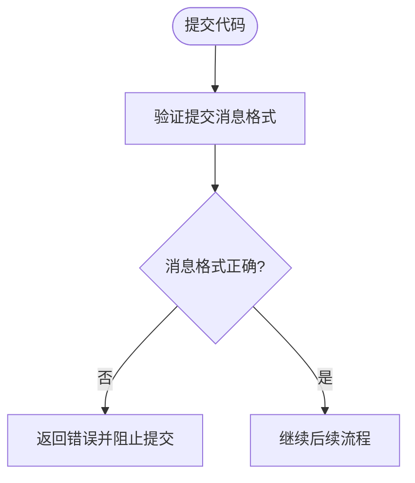
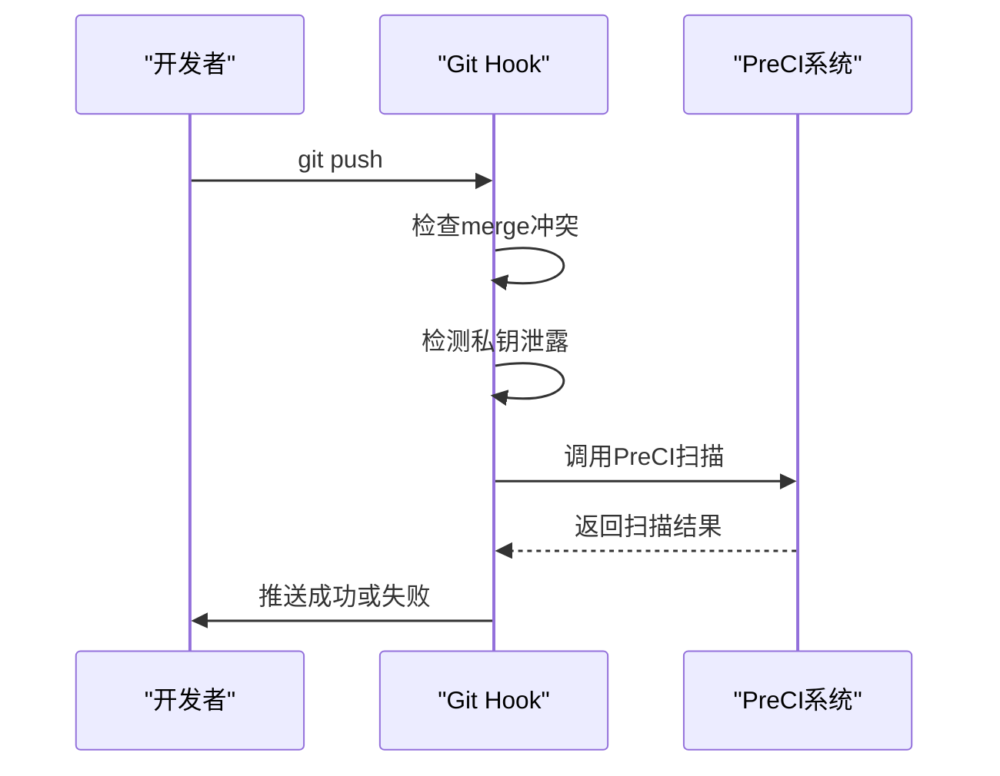
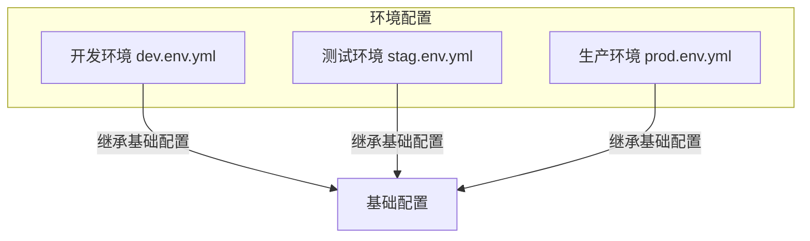
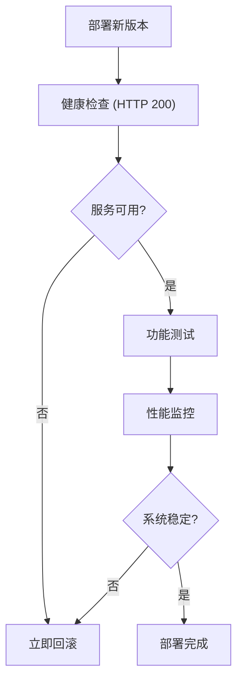

# CI/CD流程

<cite>
**本文档引用的文件**
- [.pre-commit-config.yaml](file://.pre-commit-config.yaml)
- [scripts/pre-commit/pre-push.py](file://scripts/pre-commit/pre-push.py)
- [scripts/pre-commit/preci.py](file://scripts/pre-commit/preci.py)
- [scripts/pre-commit/preci.sh](file://scripts/pre-commit/preci.sh)
- [scripts/pre-commit/check_commit_message.py](file://scripts/pre-commit/check_commit_message.py)
- [bklog/app.yml](file://bklog/app.yml)
- [bklog/dev.env.yml](file://bklog/dev.env.yml)
- [bklog/stag.env.yml](file://bklog/stag.env.yml)
- [bklog/prod.env.yml](file://bklog/prod.env.yml)
</cite>

## 目录
1. [简介](#简介)
2. [持续集成流程](#持续集成流程)
3. [持续部署策略](#持续部署策略)
4. [构建脚本与自定义选项](#构建脚本与自定义选项)
5. [容器化部署配置](#容器化部署配置)
6. [回滚机制与部署验证](#回滚机制与部署验证)
7. [本地模拟CI/CD流程](#本地模拟cicd流程)

## 简介

蓝鲸智云日志平台（BK LOG）是一套基于全文检索引擎的SaaS日志管理系统，通过专属Agent集中采集和管理日志。本CI/CD文档详细说明了代码提交后的自动化流程，包括代码检查、测试、部署等关键环节，确保代码质量和系统稳定性。

**本文档引用的文件**
- [bklog/app.yml](file://bklog/app.yml#L1-L19)

## 持续集成流程

本项目的持续集成流程在代码提交和推送时自动触发，包含多个阶段的质量检查和自动化测试。

### 代码检查阶段

代码检查在提交消息（commit message）和代码推送（push）时自动执行，确保代码质量和规范性。

#### 提交消息规范检查

每次提交代码时，系统会检查提交消息是否符合预定义的规范格式。提交消息必须以特定前缀开头，如`feat`、`fix`、`docs`等，以确保变更类型清晰可追溯。



**Diagram sources**
- [scripts/pre-commit/check_commit_message.py](file://scripts/pre-commit/check_commit_message.py#L19-L29)

**Section sources**
- [scripts/pre-commit/check_commit_message.py](file://scripts/pre-commit/check_commit_message.py#L1-L62)

#### 预推送检查

在代码推送（git push）时，系统会执行更全面的检查，包括代码冲突、私钥泄露等安全问题，并调用PreCI流水线进行深度分析。



**Diagram sources**
- [.pre-commit-config.yaml](file://.pre-commit-config.yaml#L3-L65)
- [scripts/pre-commit/pre-push.py](file://scripts/pre-commit/pre-push.py#L45-L155)

**Section sources**
- [.pre-commit-config.yaml](file://.pre-commit-config.yaml#L1-L66)
- [scripts/pre-commit/pre-push.py](file://scripts/pre-commit/pre-push.py#L1-L183)

### 单元测试与集成测试

系统通过PreCI框架自动执行单元测试和集成测试，确保代码功能的正确性。测试流程包括：

1. 创建临时项目环境
2. 复制差异文件进行隔离测试
3. 执行完整的测试套件
4. 返回测试结果

测试失败将阻止代码推送，确保只有通过测试的代码才能进入代码库。

### 代码覆盖率分析

代码覆盖率分析作为CI流程的重要组成部分，确保新代码有足够的测试覆盖。系统会生成覆盖率报告，开发者需要确保关键路径的覆盖率达标。

## 持续部署策略

本项目采用多环境部署策略，包括开发、测试和生产环境，确保代码变更的安全性和可控性。

### 环境配置管理

系统通过YAML配置文件管理不同环境的设置，包括开发、测试和生产环境。



**Diagram sources**
- [bklog/dev.env.yml](file://bklog/dev.env.yml#L1-L87)
- [bklog/stag.env.yml](file://bklog/stag.env.yml#L1-L87)
- [bklog/prod.env.yml](file://bklog/prod.env.yml#L1-L86)

**Section sources**
- [bklog/dev.env.yml](file://bklog/dev.env.yml#L1-L87)
- [bklog/stag.env.yml](file://bklog/stag.env.yml#L1-L87)
- [bklog/prod.env.yml](file://bklog/prod.env.yml#L1-L86)

### 部署流程

部署流程遵循严格的环境升级路径：开发环境 → 测试环境 → 生产环境。


每个环境的部署都包含自动化验证步骤，确保部署成功。

## 构建脚本与自定义选项

### Makefile使用说明

虽然项目中未直接提供Makefile，但构建流程通过PreCI系统和YAML配置文件实现。构建脚本的主要功能包括：

- 项目初始化
- 依赖安装
- 环境配置
- 构建打包

### 自定义构建选项

通过`app.yml`文件可以自定义应用的基本配置，如应用名称、版本、内存限制等。

```yaml
app_code: bk_log_search
app_name: 日志平台
app_name_en: BK LOG
is_use_celery: True
version: 4.9.0
container:
  memory: 4096
```

**Section sources**
- [bklog/app.yml](file://bklog/app.yml#L1-L19)

## 容器化部署配置

### Docker配置

虽然项目中未直接提供Dockerfile，但通过`app.yml`和环境配置文件实现了容器化部署的关键参数配置。

### 最佳实践

1. **资源限制**：为容器设置合理的内存限制（4096MB）
2. **环境隔离**：使用不同的YAML文件管理各环境配置
3. **共享文件系统**：启用共享文件系统支持
4. **健康检查**：配置适当的健康检查机制

## 回滚机制与部署验证

### 回滚机制

系统支持快速回滚到之前的稳定版本，回滚流程包括：

1. 确认需要回滚的版本
2. 停止当前版本服务
3. 部署指定历史版本
4. 验证回滚结果

### 部署验证

部署后的验证是确保系统稳定的关键步骤，包括：

- **服务可用性检查**：验证API端点是否正常响应
- **功能验证**：测试核心功能是否正常工作
- **性能监控**：监控系统资源使用情况
- **日志检查**：分析系统日志是否有异常



## 本地模拟CI/CD流程

开发者可以在本地模拟完整的CI/CD流程，确保代码变更符合所有质量标准。

### 本地检查工具

1. **提交消息检查**：运行`python scripts/pre-commit/check_commit_message.py`验证提交消息格式
2. **代码规范检查**：使用ruff等工具检查代码风格
3. **安全检查**：检测代码中是否包含敏感信息

### 本地测试环境

通过以下步骤在本地模拟CI/CD流程：

1. 安装PreCI工具
2. 配置本地环境变量
3. 运行`preci scan --pre-commit`执行本地扫描
4. 查看扫描结果并修复问题

```bash
# 安装依赖
pip install pre-commit ruff

# 安装git hooks
pre-commit install

# 手动运行所有检查
pre-commit run --all-files
```

**Section sources**
- [.pre-commit-config.yaml](file://.pre-commit-config.yaml#L1-L66)
- [scripts/pre-commit/preci.sh](file://scripts/pre-commit/preci.sh#L1-L21)