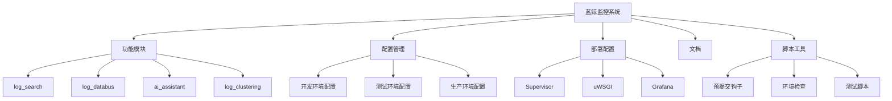
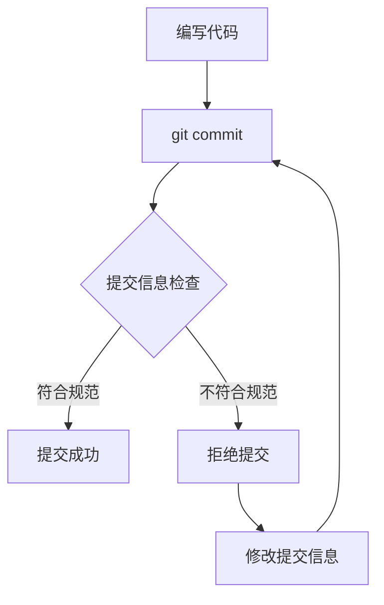
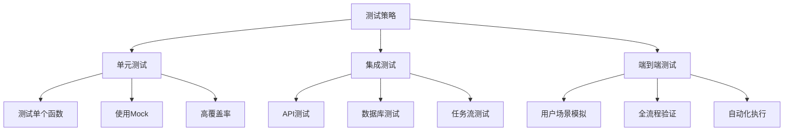
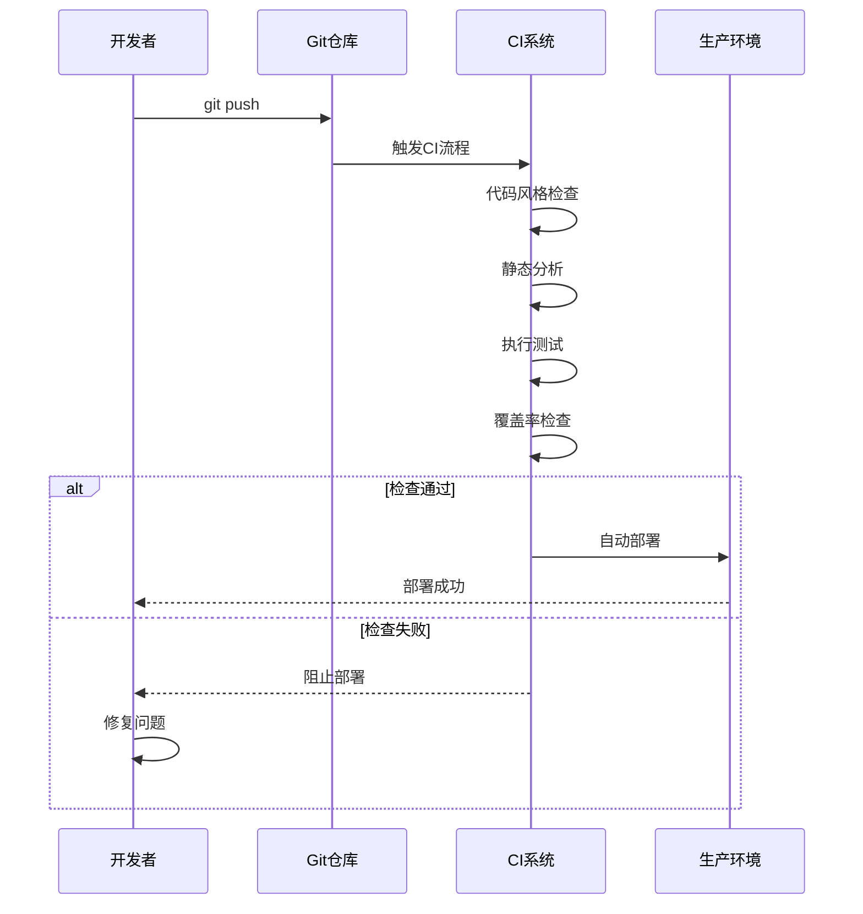

# 开发指南

<cite>
**本文档中引用的文件**  
- [README.md](file://README.md)
- [pyproject.toml](file://pyproject.toml)
- [.pre-commit-config.yaml](file://.pre-commit-config.yaml)
- [bklog/requirements.txt](file://bklog/requirements.txt)
- [bklog/scripts/check_commit_message.py](file://bklog/scripts/check_commit_message.py)
- [scripts/pre-commit/check_commit_message.py](file://scripts/pre-commit/check_commit_message.py)
- [bklog/CONTRIBUTING.md](file://bklog/CONTRIBUTING.md)
- [docs/overview/architecture.md](file://docs/overview/architecture.md)
- [docs/overview/code_framework.md](file://docs/overview/code_framework.md)
- [config/prod.py](file://bklog/config/prod.py)
- [config/dev.py](file://bklog/config/dev.py)
- [config/stag.py](file://bklog/config/stag.py)
- [Dockerfile.monitor.dev](file://Dockerfile.monitor.dev)
- [support-files/supervisord.conf](file://bklog/support-files/supervisord.conf)
- [support-files/uwsgi.ini](file://bklog/support-files/uwsgi.ini)
- [scripts/unit_test.sh](file://bklog/scripts/unit_test.sh)
- [scripts/test_env.sh](file://bklog/scripts/test_env.sh)
- [Makefile](file://bklog/Makefile)
</cite>

## 目录
1. [简介](#简介)
2. [项目结构](#项目结构)
3. [开发环境设置](#开发环境设置)
4. [编码规范](#编码规范)
5. [测试策略](#测试策略)
6. [CI/CD流程](#cicd流程)
7. [调试技巧与工具](#调试技巧与工具)
8. [贡献者指南](#贡献者指南)
9. [附录](#附录)

## 简介
本开发指南旨在为蓝鲸智云监控平台（BK-Monitor）的贡献者提供全面的开发环境配置、编码规范、测试策略和贡献流程说明。该平台是一个企业级监控解决方案，具备强大的数据采集、处理和分析能力，支持多种监控场景。

本文档将详细介绍如何设置开发环境、遵循代码规范、编写测试用例、理解CI/CD流程，并为新贡献者提供入门指导。

**Section sources**
- [README.md](file://README.md#L1-L52)

## 项目结构
蓝鲸监控系统采用模块化设计，主要功能被划分为多个独立的应用模块，位于`bklog/apps/`目录下。每个模块负责特定的监控功能，如日志搜索、数据总线、AI辅助等。

核心目录结构如下：
- `bklog/`: 主应用目录，包含所有功能模块
- `bklog/apps/`: 功能应用模块，如`log_search`、`log_databus`、`ai_assistant`等
- `bklog/config/`: 不同环境的配置文件（开发、测试、生产）
- `bklog/support-files/`: 部署相关配置，如Supervisor、uWSGI
- `docs/`: 项目文档，包括架构设计、代码框架等
- `scripts/`: 各种脚本，包括预提交钩子、环境检查等
- `tests/`: 测试相关脚本和工具

这种结构遵循Django应用的最佳实践，实现了功能解耦和高内聚。



**Diagram sources**
- [README.md](file://README.md#L1-L52)
- [docs/overview/code_framework.md](file://docs/overview/code_framework.md)

**Section sources**
- [docs/overview/code_framework.md](file://docs/overview/code_framework.md)

## 开发环境设置
### 依赖安装
开发环境依赖Python 3.10及以上版本。项目使用`pyproject.toml`管理Python依赖，主要依赖包括：
- Django 4.2.22：Web框架
- djangorestframework：REST API支持
- celery：异步任务处理
- redis：缓存和消息队列
- elasticsearch：日志存储和检索
- kubernetes：容器编排支持

使用以下命令安装依赖：
```bash
pip install -r bklog/requirements.txt
```

### 数据库配置
系统支持多种数据库，主要配置文件位于`bklog/config/`目录下：
- `dev.py`：开发环境配置
- `stag.py`：测试环境配置  
- `prod.py`：生产环境配置

数据库连接信息通过环境变量配置，确保不同环境的隔离性。

### 测试环境准备
项目提供了Docker开发环境配置文件`Dockerfile.monitor.dev`，可通过Docker快速搭建完整的测试环境。此外，`scripts/test_env.sh`脚本可用于自动化测试环境的准备和验证。

### 本地开发服务器
使用Django内置的开发服务器启动应用：
```bash
python manage.py runserver
```

对于生产环境，使用uWSGI和Nginx部署，相关配置位于`support-files/uwsgi.ini`。

**Section sources**
- [bklog/requirements.txt](file://bklog/requirements.txt#L1-L143)
- [config/prod.py](file://bklog/config/prod.py)
- [config/dev.py](file://bklog/config/dev.py)
- [config/stag.py](file://bklog/config/stag.py)
- [Dockerfile.monitor.dev](file://Dockerfile.monitor.dev)
- [support-files/supervisord.conf](file://bklog/support-files/supervisord.conf)
- [support-files/uwsgi.ini](file://bklog/support-files/uwsgi.ini)

## 编码规范
### Python编码规范
项目采用现代化的Python代码风格，主要规范如下：
- 代码格式化：使用Black进行代码格式化，行长度限制为120字符
- 导入排序：使用isort进行导入语句排序
- 静态检查：使用ruff进行代码质量检查
- 类型提示：鼓励使用typing模块进行类型注解

这些规范在`pyproject.toml`中明确定义，确保代码风格的一致性。

### Git提交信息格式
项目采用严格的提交信息规范，通过预提交钩子自动校验。提交信息必须包含以下前缀之一：

| 提交类型 | 说明 |
|---------|------|
| feat | 新功能 |
| fix | Bug修复 |
| docs | 文档更新 |
| style | 代码格式调整 |
| refactor | 代码重构 |
| perf | 性能优化 |
| test | 测试相关 |
| chore | 构建过程或辅助工具变更 |
| merge | 分支合并 |

提交信息格式为：`<类型>(<范围>)!: <描述>`，例如：`feat(user): add login functionality`。



**Diagram sources**
- [scripts/pre-commit/check_commit_message.py](file://scripts/pre-commit/check_commit_message.py#L1-L62)

**Section sources**
- [pyproject.toml](file://pyproject.toml#L1-L64)
- [scripts/pre-commit/check_commit_message.py](file://scripts/pre-commit/check_commit_message.py#L1-L62)

## 测试策略
### 单元测试
单元测试是确保代码质量的基础。项目使用Django测试框架，测试用例位于各应用的`tests.py`文件中。编写单元测试时应遵循以下原则：
- 测试单个函数或方法的行为
- 使用mock隔离外部依赖
- 覆盖正常路径和异常路径
- 保持测试的独立性和可重复性

### 集成测试
集成测试验证多个组件之间的交互。项目在`bklog/tests/`目录下组织集成测试，重点关注：
- API端点的正确性
- 数据库操作的完整性
- 异步任务的执行流程
- 第三方服务的集成

### 端到端测试
端到端测试模拟真实用户场景，验证整个系统的功能。使用`scripts/unit_test.sh`脚本可以运行完整的测试套件，包括：
- 前端界面交互
- 后端API调用
- 数据库状态变更
- 日志输出验证

测试覆盖率通过`.coveragerc`配置文件管理，目标是保持高覆盖率。



**Diagram sources**
- [scripts/unit_test.sh](file://bklog/scripts/unit_test.sh)
- [scripts/test_env.sh](file://bklog/scripts/test_env.sh)

**Section sources**
- [scripts/unit_test.sh](file://bklog/scripts/unit_test.sh)
- [scripts/test_env.sh](file://bklog/scripts/test_env.sh)

## CI/CD流程
### 自动化测试
代码提交后，CI系统会自动执行以下流程：
1. 代码风格检查（Black、isort、ruff）
2. 静态代码分析
3. 单元测试执行
4. 集成测试执行
5. 覆盖率检查
6. 安全扫描

这些步骤确保每次提交都符合质量标准。

### 自动化部署
通过`Makefile`定义的部署流程实现自动化部署：
```bash
make deploy-prod  # 部署到生产环境
make deploy-stag  # 部署到测试环境
```

部署流程包括：
- 代码打包
- 依赖安装
- 配置文件生成
- 服务重启

### 预提交钩子
项目配置了丰富的预提交钩子，位于`.pre-commit-config.yaml`，包括：
- 检查合并冲突
- 检测私钥泄露
- 代码格式化（ruff）
- 提交信息校验
- 敏感IP检查

这些钩子在本地开发阶段就捕获常见问题，提高代码质量。



**Diagram sources**
- [.pre-commit-config.yaml](file://.pre-commit-config.yaml#L1-L66)
- [Makefile](file://bklog/Makefile)

**Section sources**
- [.pre-commit-config.yaml](file://.pre-commit-config.yaml#L1-L66)
- [Makefile](file://bklog/Makefile)

## 调试技巧与工具
### 调试工具
项目提供了多种调试工具：
- **pyinstrument**：性能分析工具，位于`middleware/pyinstrument.py`
- **Django Debug Toolbar**：开发环境调试工具
- **日志系统**：详细的日志记录，便于问题追踪
- **Redis监控**：实时查看缓存状态

### 常见问题排查
#### 数据库问题
- 检查数据库连接配置
- 验证迁移文件是否应用
- 查看数据库日志

#### 缓存问题
- 清除Redis缓存
- 检查缓存键的生成逻辑
- 验证缓存过期策略

#### 异步任务问题
- 检查Celery worker状态
- 查看任务队列
- 验证任务重试机制

### 性能优化
- 使用数据库索引优化查询
- 合理使用缓存
- 异步处理耗时操作
- 减少数据库查询次数

**Section sources**
- [bklog/middleware/pyinstrument.py](file://bklog/middleware/pyinstrument.py)
- [bklog/utils/cache.py](file://bklog/utils/cache.py)
- [bklog/handler/monitor.py](file://bklog/handler/monitor.py)

## 贡献者指南
### 入门任务
新贡献者可以从以下任务开始：
- 修复文档中的拼写错误
- 编写缺失的单元测试
- 修复标记为"good first issue"的问题
- 优化代码注释和文档字符串

### 代码审查流程
1. Fork仓库并创建特性分支
2. 实现功能或修复问题
3. 运行本地测试确保通过
4. 提交符合规范的commit信息
5. 创建Pull Request
6. 等待代码审查反馈
7. 根据反馈修改代码
8. 合并到主分支

代码审查重点关注：
- 代码质量
- 测试覆盖率
- 文档完整性
- 性能影响
- 安全性

**Section sources**
- [bklog/CONTRIBUTING.md](file://bklog/CONTRIBUTING.md)
- [README.md](file://README.md#L43-L47)

## 附录
### 环境变量配置
关键环境变量包括：
- `BKAPP_DEVELOP_MODE`: 开发模式开关
- `BKAPP_MYSQL_HOST`: MySQL主机地址
- `BKAPP_REDIS_HOST`: Redis主机地址
- `BKAPP_ES_HOST`: Elasticsearch主机地址

### 常用命令
```bash
# 运行测试
python manage.py test

# 应用数据库迁移
python manage.py migrate

# 收集静态文件
python manage.py collectstatic

# 创建超级用户
python manage.py createsuperuser
```

**Section sources**
- [bklog/config/env.py](file://bklog/config/env.py)
- [bklog/manage.py](file://bklog/manage.py)