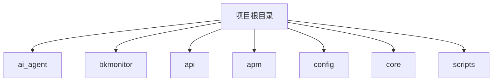
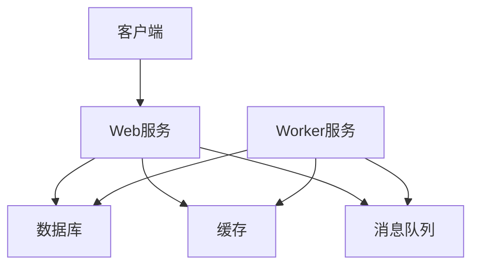
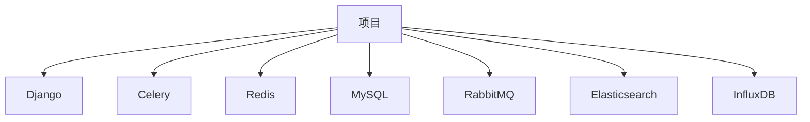

# 开发环境搭建

<cite>
**本文档引用的文件**   
- [Dockerfile](file://bkmonitor/.devcontainer/Dockerfile)
- [devcontainer.json](file://bkmonitor/.devcontainer/devcontainer.json)
- [create_venv.sh](file://bkmonitor/.devcontainer/create_venv.sh)
- [pyproject.toml](file://pyproject.toml)
- [runtime.env](file://bkmonitor/bin/runtime.env)
- [settings.py](file://bkmonitor/settings.py)
- [worker.py](file://bkmonitor/config/role/worker.py)
- [web.py](file://bkmonitor/config/role/web.py)
- [dev.py](file://bkmonitor/config/dev.py)
- [Dockerfile](file://bkmonitor/Dockerfile)
- [manage.py](file://bkmonitor/manage.py)
</cite>

## 目录
1. [简介](#简介)
2. [项目结构](#项目结构)
3. [核心组件](#核心组件)
4. [架构概述](#架构概述)
5. [详细组件分析](#详细组件分析)
6. [依赖分析](#依赖分析)
7. [性能考虑](#性能考虑)
8. [故障排除指南](#故障排除指南)
9. [结论](#结论)

## 简介
本文档旨在为开发者提供一个全面的本地开发环境搭建指南，涵盖使用Docker容器开发环境的配置方法、虚拟环境创建步骤、依赖包安装流程、外部依赖服务（如数据库、缓存、消息队列）的配置、环境变量设置指导和配置文件修改建议。此外，还包括常见环境问题的排查方法和解决方案，确保新开发者能够快速启动开发环境。

## 项目结构
本项目采用模块化设计，主要分为以下几个部分：
- `ai_agent`：AI代理相关功能
- `bkmonitor`：监控平台核心功能
- `api`：API接口定义
- `apm`：应用性能管理
- `config`：配置文件
- `core`：核心工具和资源
- `scripts`：脚本工具



**Diagram sources**
- [Dockerfile](file://bkmonitor/.devcontainer/Dockerfile)
- [devcontainer.json](file://bkmonitor/.devcontainer/devcontainer.json)

**Section sources**
- [Dockerfile](file://bkmonitor/.devcontainer/Dockerfile)
- [devcontainer.json](file://bkmonitor/.devcontainer/devcontainer.json)

## 核心组件
### Docker容器开发环境
项目提供了Docker容器开发环境，通过`.devcontainer`目录下的配置文件实现。主要文件包括：
- `Dockerfile`：定义了容器的基础镜像、依赖安装和配置
- `devcontainer.json`：定义了容器的详细配置，如工作区目录、端口转发等
- `create_venv.sh`：用于创建虚拟环境和安装依赖的脚本

#### Dockerfile
```dockerfile
FROM python:3.11-bullseye

ARG APT_MIRROR="https://mirrors.tencent.com"
ARG PIP_MIRROR="https://mirrors.tencent.com/pypi/simple"

# 替换镜像源
RUN sed -i "s@http://deb.debian.org/debian@${APT_MIRROR}/debian@g" /etc/apt/sources.list \
    && sed -i "s@http://security.debian.org/debian-security@${APT_MIRROR}/debian-security@g" /etc/apt/sources.list

# 设置默认shell为bash
ENV SHELL /bin/bash

# 安装工具包及npm
RUN apt-get update && apt-get install -y curl wget git vim supervisor && git config --global core.trustctime false

# 替换pip源
RUN mkdir -p ~/.pip && echo "[global]\nindex-url = $PIP_MIRROR/\n" > ~/.pip/pip.conf && pip install --upgrade pip
ENV PIP_ROOT_USER_ACTION=ignore

# 设置Python环境
ENV VIRTUAL_ENV=/app/code/bkmonitor/venv
ENV PATH="/app/code/bkmonitor/venv/bin:${PATH}"

# 挂载项目到容器
VOLUME /app/code

# 设置默认工作目录
WORKDIR /app/code

# 设置git安全目录
RUN git config --global --add safe.directory /app/code

# 暴露应用运行的端口
EXPOSE 8000

# 设置容器启动时的默认命令
CMD ["sleep", "infinity"]
```

#### devcontainer.json
```json
{
    "name": "Monitor Web App",
    "workspaceFolder": "/app/code/bkmonitor",
    "build": {
        "dockerfile": "Dockerfile",
        "context": ".."
    },
    "mounts": [
        {
            "source": "${localWorkspaceFolder}/..",
            "target": "/app/code",
            "type": "bind"
        }
    ],
    "forwardPorts": [
        8000
    ],
    "postCreateCommand": "bash /app/code/bkmonitor/.devcontainer/create_venv.sh",
    "customizations": {
        "vscode": {
            "terminal.integrated.inheritEnv": true,
            "extensions": [
                "ms-python.python",
                "ms-python.debugpy",
                "ms-python.vscode-pylance",
                "donjayamanne.git-extension-pack",
                "ms-python.black-formatter",
                "ms-azuretools.vscode-docker"
            ],
            "settings": {
                "python.analysis.autoFormatStrings": true,
                "python.defaultInterpreterPath": "/app/code/venv/bin/python",
                "python.languageServer": "Pylance",
                "python.analysis.importFormat": "absolute",
                "python.analysis.autoImportCompletions": true,
                "files.autoSave": "afterDelay",
                "files.autoSaveDelay": 1000,
                "[python]": {
                    "diffEditor.ignoreTrimWhitespace": false,
                    "editor.formatOnType": true,
                    "editor.wordBasedSuggestions": "off",
                    "editor.formatOnSave": true,
                    "editor.formatOnPaste": true,
                    "editor.formatOnSaveMode": "file"
                }
            }
        }
    },
    "remoteUser": "root"
}
```

#### create_venv.sh
```bash
#!/bin/bash

# 安装virtualenv
pip install virtualenv

# 切换到项目目录
cd /app/code/bkmonitor

# 创建虚拟环境
if [ ! -d "venv" ]; then
  virtualenv venv
fi

# 设置环境变量
source /app/code/bkmonitor/venv/bin/activate

python -m ensurepip --default-pip

# 安装依赖
pip install -r requirements_dev.txt
```

**Section sources**
- [Dockerfile](file://bkmonitor/.devcontainer/Dockerfile)
- [devcontainer.json](file://bkmonitor/.devcontainer/devcontainer.json)
- [create_venv.sh](file://bkmonitor/.devcontainer/create_venv.sh)

## 架构概述
项目采用微服务架构，主要包括以下几个服务：
- **Web服务**：处理HTTP请求，提供API接口
- **Worker服务**：处理后台任务，如定时任务、消息队列任务
- **数据库**：存储业务数据
- **缓存**：提高数据访问速度
- **消息队列**：异步处理任务



**Diagram sources**
- [settings.py](file://bkmonitor/settings.py)
- [worker.py](file://bkmonitor/config/role/worker.py)
- [web.py](file://bkmonitor/config/role/web.py)

## 详细组件分析
### 虚拟环境和依赖管理
项目使用`pyproject.toml`文件进行依赖管理，而不是传统的`requirements.txt`文件。`pyproject.toml`文件中定义了项目的基本信息、依赖包和开发工具配置。

#### pyproject.toml
```toml
[project]
name = "bkmonitor"
version = "3.11.0"
description = "bkmonitor"
readme = "README.md"
requires-python = "==3.11.*"
dependencies = [
    "aidev-agent==1.0.0b28",
    "apigw-manager==4.0.4",
    "arrow==0.6.0",
    "babel==2.14.0",
    "betterproto==2.0.0b7",
    "bk-audit==1.0.7",
    "bk-crypto-python-sdk==2.0.1",
    "bk-iam==2.0.3",
    "bk-notice-sdk==1.3.2",
    "bkstorages==1.1.1",
    "blueapps==4.16rc1",
    "celery==5.4.0",
    "celery-redbeat==2.2.0",
    "confluent-kafka==2.4.0",
    "dill==0.3.7",
    "django==3.2.25",
    "django-celery-beat==2.7.0",
    "django-celery-results==2.5.1",
    "django-cors-headers==4.1.0",
    "django-db-connection-pool==1.2.5",
    "django-elasticsearch-dsl==7.4",
    "django-filter==23.5",
    "django-jinja==2.10.2",
    "django-mysql==4.10.0",
    "django-prometheus==2.3.1",
    "django-redis==5.4.0",
    "django-versionlog==1.8.0",
    "djangorestframework==3.15.1",
    "dnspython==2.6.1",
    "drf-yasg==1.21.5",
    "elasticsearch==7.17.12",
    "elasticsearch-curator==7.0.1",
    "elasticsearch-dsl==7.4.1",
    "elasticsearch5==5.5.6",
    "elasticsearch6==6.8.2",
    "furl==2.1.3",
    "gevent==25.5.1",
    "google-auth==2.37.0",
    "graphviz==0.19.2",
    "gunicorn==23.0.0",
    "humanize==4.6.0",
    "influxdb==5.3.2",
    "ipython==9.4.0",
    "jinja2==3.1.6",
    "jmespath==1.0.1",
    "kafka-python==1.4.6",
    "kubernetes==18.20.0",
    "langfuse==2.60.5",
    "luqum==0.13.0",
    "mockredis>=0.1.3.dev0",
    "netifaces==0.11.0",
    "networkx==2.6.3",
    "opentelemetry-api==1.11.1",
    "opentelemetry-exporter-otlp==1.11.1",
    "opentelemetry-instrumentation-celery==0.30b1",
    "opentelemetry-instrumentation-dbapi==0.30b1",
    "opentelemetry-instrumentation-django==0.30b1",
    "opentelemetry-instrumentation-elasticsearch==0.30b1",
    "opentelemetry-instrumentation-kafka-python==0.30b1",
    "opentelemetry-instrumentation-logging==0.30b1",
    "opentelemetry-instrumentation-redis==0.30b1",
    "opentelemetry-instrumentation-requests==0.30b1",
    "opentelemetry-sdk==1.11.1",
    "pika==1.3.2",
    "pillow==11.3.0",
    "ply==3.11",
    "prometheus-client==0.17.1",
    "protobuf==3.19.5",
    "psutil==6.1.1",
    "pycryptodome==3.23.0",
    "pyinstrument==4.6.2",
    "pymysql==1.1.1",
    "pypinyin==0.53.0",
    "pyppeteer==1.0.2",
    "pyroscope-io==0.8.8",
    "python-consul==1.1.0",
    "python-dotenv==0.21.1",
    "python-magic==0.4.27",
    "pyyaml==6.0.1",
    "redis==4.6.0",
    "requests==2.32.4",
    "requests-toolbelt==1.0.0",
    "schema==0.7.7",
    "selenium<4.2",
    "six==1.17.0",
    "sqlparse==0.5.3",
    "supervisor==4.2.5",
    "typing-extensions==4.12.2",
    "ujson==5.7.0",
    "whitenoise==6.5.0",
    "xxhash==3.5.0",
]

[tool.uv]
default-groups = ["aidev"]

[dependency-groups]
aidev = [
    "attrdictionary==1.0.0",
    "langchain<0.4.0",
    "langchain-community",
    "langchain-core",
    "langchain-experimental",
    "langchain-openai",
    "langchain-text-splitters",
    "pyro4==4.82",
    "retry==0.9.2",
    "stackprinter==0.212",
    "tiktoken==0.9.0",
]
test = [
    "coverage==7.6.12",
    "elasticmock==1.8.1",
    "fakeredis==2.27.0",
    "mock==5.1.0",
    "pytest==8.3.4",
    "pytest-cov==6.0.0",
    "pytest-django==4.8.0",
    "pytest-dotenv==0.5.2",
    "pytest-env==1.1.5",
    "pytest-mock==3.14.0",
]
dev = [
    "pre-commit==4.1.0",
    "ruff==0.11.6",
]
stubs = [
    "celery-types>=0.23.0",
    "django-stubs==4.2.7",
]

[tool.coverage.run]
omit = [
    "*/test*",
    "*/migrations*",
    "*/__init__.py"
]
[tool.coverage.report]
exclude_lines = [
    "pragma: no cover",
    "raise NotImplementedError"
]
skip_empty = true

[tool.pytest.ini_options]
console_output_style = "count"
testpaths = [
    "alarm_backends/tests",
    "bkmonitor/data_source/tests",
    "metadata/tests",
]
python_files = ["test_*.py", "tests.py"]
log_level = "ERROR"
filterwarnings = [
    "error",
    "ignore::DeprecationWarning",
    "ignore::django.utils.deprecation.RemovedInDjango41Warning",
    "ignore::ImportWarning",
    "ignore::ResourceWarning"
]
DJANGO_SETTINGS_MODULE = "settings"
env = [
    "D:DJANGO_CONF_MODULE=conf.worker.development.community",
    "D:BKAPP_DEPLOY_PLATFORM=community",
    "USE_DYNAMIC_SETTINGS=0",
    "D:django_find_project=false",
    "D:BK_MONITOR_APP_CODE=bk_monitorv3",
    "D:BK_MONITOR_APP_SECRET=secret"
]

[tool.ruff]
src = [".", "packages"]
line-length = 120
target-version = "py310"
exclude = [
    ".git",
    "venv",
    ".venv",
    "node_modules",
    ".pytype",
    ".ruff_cache",
    "__pypackages__"
]

[tool.ruff.lint]
select = ["E4", "E7", "E9", "F", "UP"]
extend-ignore = ["E402"]
fixable = ["ALL"]
extend-safe-fixes = ["UP"]

[tool.ruff.format]
docstring-code-format = true

[tool.ruff.lint.extend-per-file-ignores]
"config/**" = ["F405"]
```

**Section sources**
- [pyproject.toml](file://pyproject.toml)

### 外部依赖服务配置
项目依赖多个外部服务，包括数据库、缓存、消息队列等。这些服务的配置主要在`config`目录下的配置文件中定义。

#### 数据库配置
数据库配置在`config/dev.py`文件中定义，开发环境使用MySQL数据库。

```python
# 本地开发数据库设置
DATABASES = {
    "default": {
        "ENGINE": "django.db.backends.mysql",
        "NAME": APP_CODE,  # noqa
        "USER": "root",
        "PASSWORD": "",
        "HOST": "localhost",
        "PORT": "3306",
    },
    "monitor_api": {
        "ENGINE": "django.db.backends.mysql",
        "NAME": APP_CODE,  # noqa
        "USER": "root",
        "PASSWORD": "",
        "HOST": "localhost",
        "PORT": "3306",
    },
}
```

#### 缓存配置
缓存配置在`config/role/worker.py`和`config/role/web.py`文件中定义，使用Redis作为缓存后端。

```python
# Redis
CACHE_BACKEND_TYPE, REDIS_HOST, REDIS_PORT, REDIS_PASSWD, REDIS_MASTER_NAME, REDIS_SENTINEL_PASS = get_redis_settings()
(
    CACHE_REDIS_HOST,
    CACHE_REDIS_PORT,
    CACHE_REDIS_PASSWD,
    CACHE_REDIS_MASTER_NAME,
    CACHE_REDIS_SENTINEL_PASS,
) = get_cache_redis_settings(CACHE_BACKEND_TYPE)
CACHE_REDIS_HOST, CACHE_REDIS_PORT, CACHE_REDIS_PASSWD, CACHE_REDIS_MASTER_NAME, CACHE_REDIS_SENTINEL_PASS = (
    CACHE_REDIS_HOST or REDIS_HOST,
    CACHE_REDIS_PORT or REDIS_PORT,
    CACHE_REDIS_PASSWD if CACHE_REDIS_PASSWD is None else REDIS_PASSWD,
    CACHE_REDIS_MASTER_NAME or REDIS_MASTER_NAME,
    CACHE_REDIS_SENTINEL_PASS if CACHE_REDIS_SENTINEL_PASS is None else REDIS_SENTINEL_PASS,
)

# redis中的db分配[7，8，9，10]，共4个db
# 7.[不重要，可清理] 日志相关数据使用log配置
# 8.[一般，可清理]   配置相关缓存使用cache配置，例如：cmdb的数据、策略、屏蔽等配置数据
# 9.[重要，不可清理] 各个services之间交互的队列，使用queue配置
# 9.[重要，不可清理] celery的broker，使用celery配置
# 10.[重要，不可清理] service自身的数据，使用service配置
REDIS_LOG_CONF = {"host": REDIS_HOST, "port": REDIS_PORT, "db": 7, "password": REDIS_PASSWD}
REDIS_CACHE_CONF = {
    "host": CACHE_REDIS_HOST,
    "port": CACHE_REDIS_PORT,
    "db": 8,
    "password": CACHE_REDIS_PASSWD,
    "master_name": CACHE_REDIS_MASTER_NAME,
    "sentinel_password": CACHE_REDIS_SENTINEL_PASS,
}
REDIS_CELERY_CONF = REDIS_QUEUE_CONF = {"host": REDIS_HOST, "port": REDIS_PORT, "db": 9, "password": REDIS_PASSWD}
REDIS_SERVICE_CONF = {"host": REDIS_HOST, "port": REDIS_PORT, "db": 10, "password": REDIS_PASSWD, "socket_timeout": 10}
```

#### 消息队列配置
消息队列配置在`config/role/worker.py`文件中定义，使用RabbitMQ作为消息队列。

```python
RABBITMQ_HOST, RABBITMQ_PORT, RABBITMQ_VHOST, RABBITMQ_USER, RABBITMQ_PASS, _ = get_rabbitmq_settings(
    app_code=APP_CODE, backend=True
)
```

**Section sources**
- [dev.py](file://bkmonitor/config/dev.py)
- [worker.py](file://bkmonitor/config/role/worker.py)
- [web.py](file://bkmonitor/config/role/web.py)

### 环境变量设置
项目通过环境变量来配置一些动态参数，这些参数在`bin/runtime.env`文件中定义。

#### runtime.env
```bash
#!/bin/bash

export API_CACHE_BASE_INTERVAL="5"
```

**Section sources**
- [runtime.env](file://bkmonitor/bin/runtime.env)

### 配置文件修改建议
项目的主要配置文件位于`config`目录下，包括`dev.py`、`prod.py`、`stag.py`等。开发者可以根据需要修改这些文件中的配置。

#### settings.py
`settings.py`文件是项目的主配置文件，包含了项目的全局配置。

```python
"""
Tencent is pleased to support the open source community by making 蓝鲸智云 - 监控平台 (BlueKing - Monitor) available.
Copyright (C) 2017-2021 THL A29 Limited, a Tencent company. All rights reserved.
Licensed under the MIT License (the "License"); you may not use this file except in compliance with the License.
You may obtain a copy of the License at http://opensource.org/licenses/MIT
Unless required by applicable law or agreed to in writing, software distributed under the License is distributed on
an "AS IS" BASIS, WITHOUT WARRANTIES OR CONDITIONS OF ANY KIND, either express or implied. See the License for the
specific language governing permissions and limitations under the License.
"""

import logging
import os
import sys
from pathlib import Path

import monkey
from config.tools.environment import ENVIRONMENT, ROLE

try:
    import MySQLdb  # noqa
except ImportError:
    import pymysql

    pymysql.install_as_MySQLdb()

BASE_DIR = str(Path(__file__).resolve().parent)
# settings加载顺序 config.default -> blueapps.patch -> config.{env} -> config.role.{role}

patch_module = ["json", "shutil", "furl", "re"]
patch_target = {_module: None for _module in patch_module}

# patch backend celery beat only
if "redbeat.RedBeatScheduler" in sys.argv:
    patch_target.update({"redbeat.schedulers": None})
monkey.patch_all(patch_target)

# append packages to sys.path
sys.path.append(os.path.join(os.getcwd(), "packages"))
# append ai agent sdk to sys.path
sys.path.append(os.path.join(os.getcwd(), "ai_agent", "sdk"))

DJANGO_CONF_MODULE = "config.{env}".format(
    env={"development": "dev", "testing": "stag", "production": "prod"}.get(ENVIRONMENT)
)

# 加载角色配置
try:
    _module = __import__(f"config.role.{ROLE}", globals(), locals(), ["*"])
except ImportError as e:
    logging.exception(e)
    raise ImportError("Could not import config '{}' (Is it on sys.path?): {}".format(f"config.role.{ROLE}", e))

for _setting in dir(_module):
    if _setting == _setting.upper():
        locals()[_setting] = getattr(_module, _setting)

# create settings by env
SETTING_ENV_PREFIX = "BKAPP_SETTINGS_"
for key, value in list(os.environ.items()):
    upper_key = key.upper()
    if upper_key.startswith(SETTING_ENV_PREFIX):
        settings_key = upper_key.replace(SETTING_ENV_PREFIX, "")
        locals()[settings_key] = value
        print(f'[Django Settings] Set config from env: {settings_key} = "{value}"')


# 多人开发时，无法共享的本地配置可以放到新建的 local_settings.py 文件中
# 并且把 local_settings.py 加入版本管理忽略文件中
if RUN_MODE == "DEVELOP":  # noqa
    try:
        from local_settings import *  # noqa
    except ImportError:
        pass
```

**Section sources**
- [settings.py](file://bkmonitor/settings.py)

## 依赖分析
项目依赖多个外部库和工具，主要依赖包括：
- **Django**：Web框架
- **Celery**：异步任务队列
- **Redis**：缓存和消息队列
- **MySQL**：数据库
- **RabbitMQ**：消息队列
- **Elasticsearch**：全文搜索和分析
- **InfluxDB**：时间序列数据库



**Diagram sources**
- [pyproject.toml](file://pyproject.toml)

## 性能考虑
为了提高性能，项目采取了以下措施：
- 使用Redis作为缓存，减少数据库查询次数
- 使用Celery处理异步任务，避免阻塞主线程
- 使用Elasticsearch进行全文搜索和分析，提高搜索效率
- 使用InfluxDB存储时间序列数据，提高数据写入和查询性能

## 故障排除指南
### 常见问题及解决方案
1. **Docker容器无法启动**
   - 检查Docker服务是否正常运行
   - 检查Dockerfile中的命令是否正确
   - 检查网络连接是否正常

2. **依赖安装失败**
   - 检查网络连接是否正常
   - 检查pip源是否可用
   - 检查依赖包版本是否兼容

3. **数据库连接失败**
   - 检查数据库服务是否正常运行
   - 检查数据库配置是否正确
   - 检查数据库用户权限

4. **缓存服务无法连接**
   - 检查Redis服务是否正常运行
   - 检查Redis配置是否正确
   - 检查Redis密码是否正确

5. **消息队列服务无法连接**
   - 检查RabbitMQ服务是否正常运行
   - 检查RabbitMQ配置是否正确
   - 检查RabbitMQ用户权限

**Section sources**
- [Dockerfile](file://bkmonitor/.devcontainer/Dockerfile)
- [devcontainer.json](file://bkmonitor/.devcontainer/devcontainer.json)
- [create_venv.sh](file://bkmonitor/.devcontainer/create_venv.sh)
- [pyproject.toml](file://pyproject.toml)
- [runtime.env](file://bkmonitor/bin/runtime.env)
- [settings.py](file://bkmonitor/settings.py)
- [worker.py](file://bkmonitor/config/role/worker.py)
- [web.py](file://bkmonitor/config/role/web.py)
- [dev.py](file://bkmonitor/config/dev.py)

## 结论
本文档详细介绍了如何搭建本地开发环境，包括使用Docker容器开发环境的配置方法、虚拟环境创建步骤、依赖包安装流程、外部依赖服务的配置、环境变量设置指导和配置文件修改建议。通过遵循本文档的指导，新开发者可以快速启动开发环境，提高开发效率。