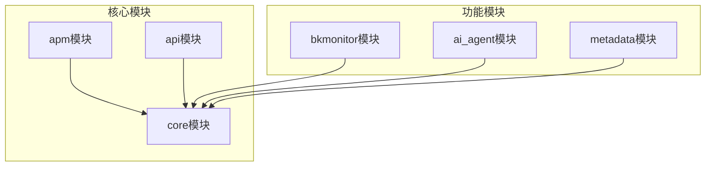
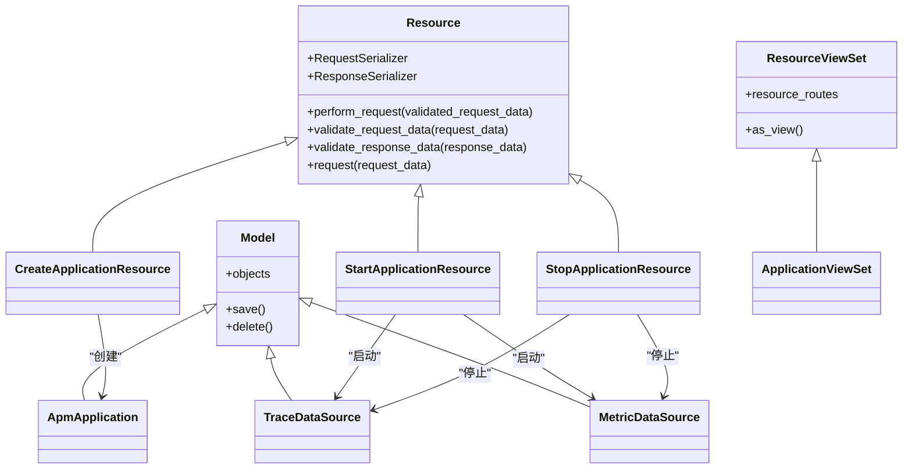
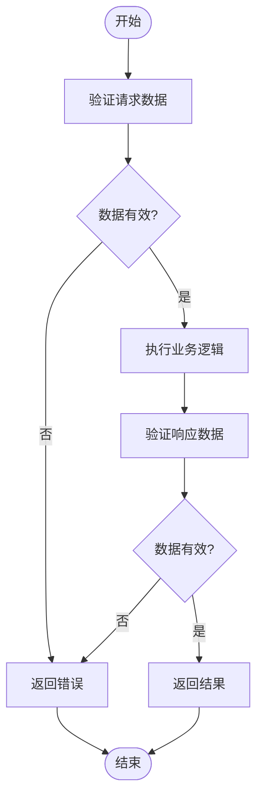
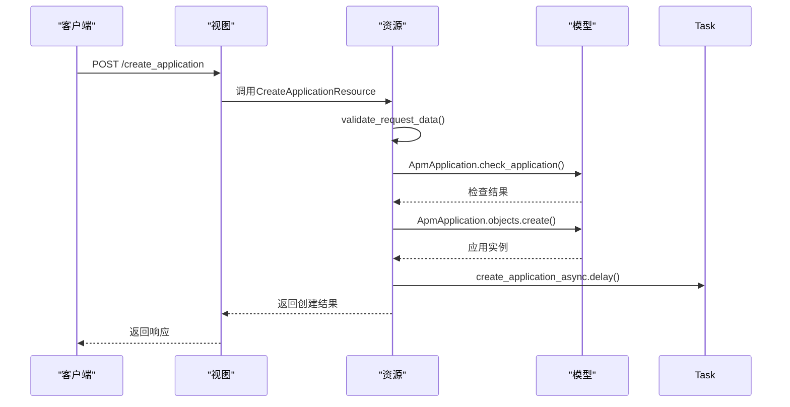
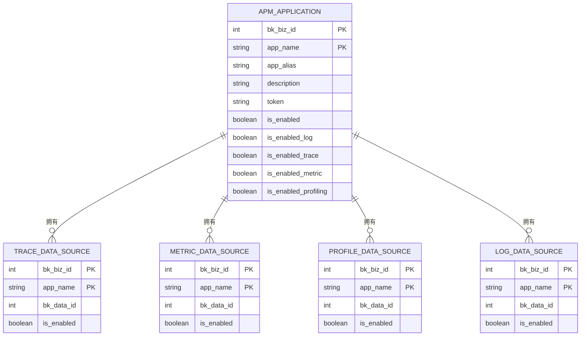
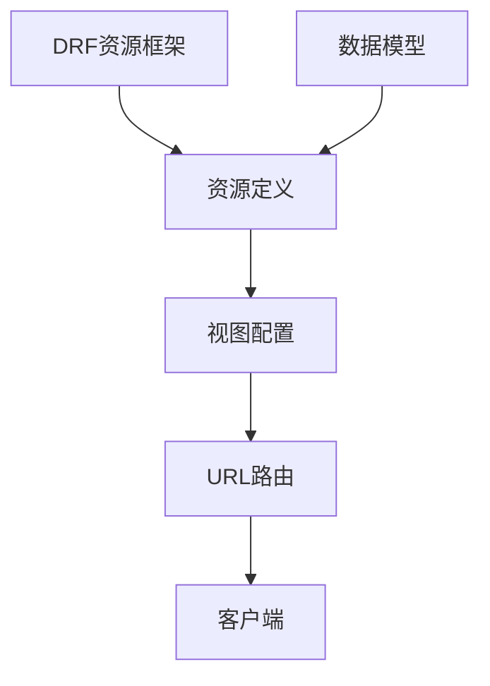

# 模块化开发

<cite>
**本文档引用的文件**   
- [resources.py](file://bkmonitor\apm\resources.py)
- [serializers.py](file://bkmonitor\apm\serializers.py)
- [application.py](file://bkmonitor\apm\models\application.py)
- [__init__.py](file://bkmonitor\apm\models\__init__.py)
- [urls.py](file://bkmonitor\apm\urls.py)
- [views.py](file://bkmonitor\apm\views.py)
- [base.py](file://bkmonitor\core\drf_resource\base.py)
</cite>

## 目录
1. [引言](#引言)
2. [项目结构](#项目结构)
3. [核心组件](#核心组件)
4. [架构概述](#架构概述)
5. [详细组件分析](#详细组件分析)
6. [依赖分析](#依赖分析)
7. [性能考虑](#性能考虑)
8. [故障排除指南](#故障排除指南)
9. [结论](#结论)

## 引言
本文档旨在为开发者提供在现有架构下添加新功能模块的全面指导。文档详细说明了应用注册、URL路由配置、资源定义等标准流程，解释了DRF资源架构的使用方法以及如何定义新的API端点。通过遵循项目的设计模式和架构约束，开发者可以有效地扩展系统功能。文档还包含了创建新功能模块的完整示例，帮助开发者快速上手。

## 项目结构
本项目采用模块化设计，各功能模块独立组织，便于维护和扩展。核心模块包括`ai_agent`、`bkmonitor`、`api`、`apm`等，每个模块都有清晰的职责划分。`apm`模块专注于应用性能监控，包含核心逻辑、数据模型、资源定义和视图配置。`core`模块提供了DRF资源框架，是整个系统API的基础。

**图示来源**
- [apm\resources.py](file://bkmonitor\apm\resources.py)
- [core\drf_resource\base.py](file://bkmonitor\core\drf_resource\base.py)

## 核心组件
核心组件主要包括DRF资源框架、数据模型和资源定义。DRF资源框架提供了统一的API开发模式，通过`Resource`类实现业务逻辑的封装。数据模型定义了应用、数据源等核心实体，资源定义则将业务逻辑暴露为API端点。

**组件来源**
- [base.py](file://bkmonitor\core\drf_resource\base.py#L1-L311)
- [application.py](file://bkmonitor\apm\models\application.py#L1-L341)
- [resources.py](file://bkmonitor\apm\resources.py#L1-L799)

## 架构概述
系统采用基于DRF资源的架构模式，实现了清晰的分层设计。该架构将业务逻辑与API接口分离，提高了代码的可维护性和可测试性。资源（Resource）作为核心组件，封装了具体的业务逻辑，视图集（ViewSet）负责路由和请求处理，数据模型（Model）则管理持久化数据。

**图示来源**
- [base.py](file://bkmonitor\core\drf_resource\base.py#L1-L311)
- [resources.py](file://bkmonitor\apm\resources.py#L1-L799)
- [application.py](file://bkmonitor\apm\models\application.py#L1-L341)

## 详细组件分析
### DRF资源架构分析
DRF资源架构是本系统API开发的核心。它通过`Resource`基类提供了一套标准化的开发模式，将请求处理流程分解为数据验证、业务逻辑执行和响应数据验证三个阶段。

#### 资源执行流程

**图示来源**
- [base.py](file://bkmonitor\core\drf_resource\base.py#L1-L311)

### 应用管理功能分析
应用管理功能是APM模块的核心，包括应用的创建、启动、停止和配置等操作。这些功能通过一系列资源类实现，每个资源类对应一个具体的业务操作。

#### 应用创建流程

**图示来源**
- [resources.py](file://bkmonitor\apm\resources.py#L1-L799)
- [application.py](file://bkmonitor\apm\models\application.py#L1-L341)

### 数据模型分析
数据模型定义了系统的核心实体及其关系。`ApmApplication`模型是应用性能监控的中心，与其他数据源模型建立关联。

#### 模型关系图

**图示来源**
- [application.py](file://bkmonitor\apm\models\application.py#L1-L341)
- [datasource.py](file://bkmonitor\apm\models\datasource.py)

## 依赖分析
系统各组件之间存在明确的依赖关系。DRF资源框架是基础依赖，所有API功能都基于此框架构建。数据模型层为资源层提供数据支持，资源层又为视图层提供业务逻辑。

**图示来源**
- [base.py](file://bkmonitor\core\drf_resource\base.py#L1-L311)
- [resources.py](file://bkmonitor\apm\resources.py#L1-L799)
- [views.py](file://bkmonitor\apm\views.py#L1-L141)
- [urls.py](file://bkmonitor\apm\urls.py#L1-L21)

## 性能考虑
在设计和实现新功能模块时，需要考虑以下性能因素：
1. **数据库查询优化**：避免N+1查询问题，合理使用select_related和prefetch_related
2. **缓存策略**：对频繁访问但不经常变化的数据使用缓存
3. **异步处理**：对于耗时操作，使用Celery进行异步处理
4. **批量操作**：对于大量数据的操作，使用bulk_create、bulk_update等批量方法
5. **资源限制**：合理设置分页大小，避免一次性返回过多数据

## 故障排除指南
### 常见问题及解决方案
1. **资源找不到**：检查资源类是否在视图集中正确注册
2. **序列化器错误**：确保请求数据符合序列化器定义的格式
3. **权限问题**：检查是否有适当的权限验证配置
4. **数据库连接失败**：检查数据库配置和连接状态
5. **异步任务失败**：检查Celery任务队列和worker状态

### 调试技巧
1. 使用DRF的调试工具查看API请求和响应
2. 在资源的perform_request方法中添加日志输出
3. 使用Django的调试工具检查数据库查询
4. 通过Celery的监控工具查看异步任务状态

## 结论
本文档详细介绍了在现有架构下添加新功能模块的方法。通过遵循DRF资源架构的设计模式，开发者可以高效地创建新的API端点和功能模块。关键是要理解资源、序列化器、视图和路由之间的关系，并遵循项目的命名规范和代码结构。通过合理利用已有的设计模式和工具，可以确保新功能的代码质量和系统稳定性。