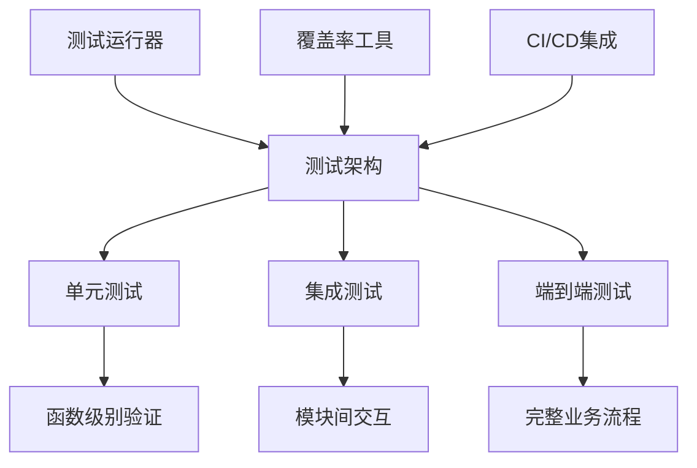
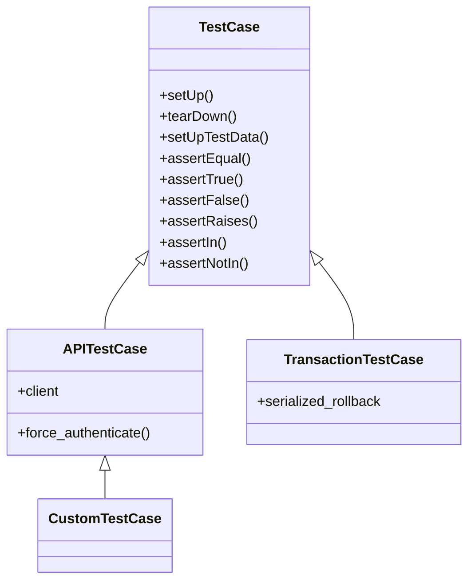
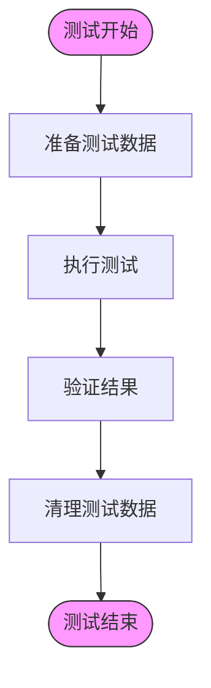
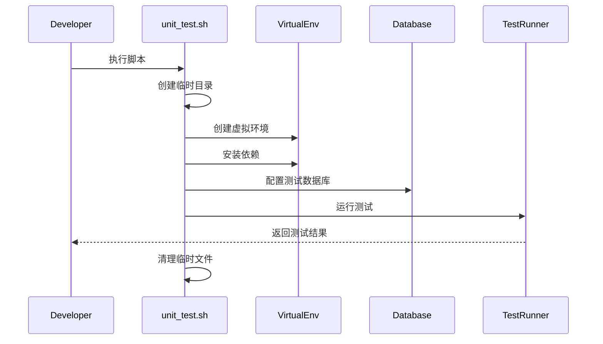
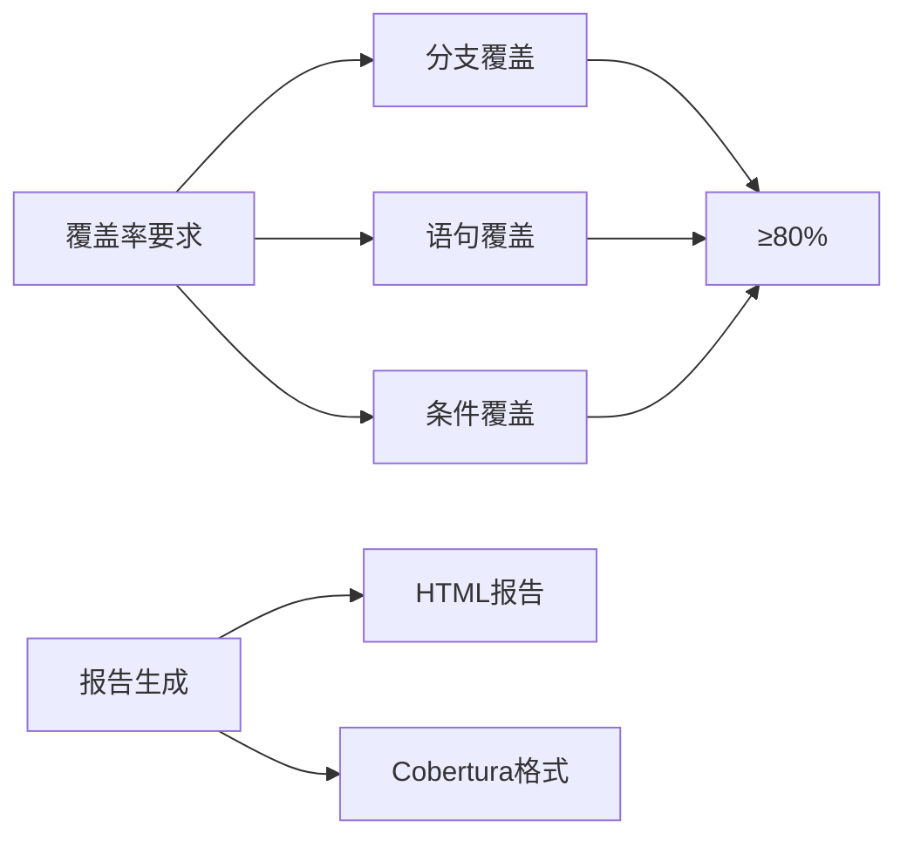

# 测试策略

<cite>
**本文档引用的文件**  
- [unit_test.sh](file://bklog/scripts/unit_test.sh)
- [.coveragerc](file://bklog/.coveragerc)
- [Makefile](file://bklog/Makefile)
- [manage.py](file://bklog/manage.py)
- [ai_assistant/tests.py](file://bklog/apps/ai_assistant/tests.py)
- [log_clustering/tests.py](file://bklog/apps/log_clustering/tests.py)
- [test_collector.py](file://bklog/apps/tests/log_databus/test_collector.py)
- [test_e2e_collectorviewsetapi.py](file://bklog/apps/tests/log_databus/test_e2e_collectorviewsetapi.py)
- [test_pattern_search.py](file://bklog/apps/tests/log_clustering/test_pattern_search.py)
- [test_lucene.py](file://bklog/apps/tests/log_commons/test_lucene.py)
</cite>

## 目录
1. [引言](#引言)
2. [测试架构概述](#测试架构概述)
3. [测试类型与编写规范](#测试类型与编写规范)
4. [Django测试框架使用指南](#djangotest框架使用指南)
5. [测试数据管理策略](#测试数据管理策略)
6. [测试环境配置](#测试环境配置)
7. [测试覆盖率要求](#测试覆盖率要求)
8. [性能与压力测试指导](#性能与压力测试指导)
9. [测试调试技巧与工具](#测试调试技巧与工具)
10. [结论](#结论)

## 引言
本文档旨在为bk-monitor项目提供全面的测试策略指导。通过分析项目结构和现有测试实践，本文档将详细说明测试架构、编写规范、环境配置和最佳实践，帮助开发团队建立高效可靠的测试体系。

## 测试架构概述

项目采用分层测试架构，包含单元测试、集成测试和端到端测试。测试代码组织遵循模块化原则，与应用模块对应，确保测试的可维护性和可扩展性。

**Diagram sources**
- [unit_test.sh](file://bklog/scripts/unit_test.sh)
- [manage.py](file://bklog/manage.py)

**Section sources**
- [unit_test.sh](file://bklog/scripts/unit_test.sh)
- [manage.py](file://bklog/manage.py)

## 测试类型与编写规范

### 单元测试
单元测试聚焦于单个函数或方法的逻辑正确性。每个应用模块都应包含对应的tests.py文件，使用Django TestCase进行编写。

**编写原则：**
- 每个测试用例应独立且可重复
- 使用setUp和tearDown方法管理测试状态
- 避免外部依赖，必要时使用mock
- 测试用例命名应清晰描述测试目的

### 集成测试
集成测试验证多个组件之间的交互。项目中通过专门的测试目录组织集成测试，如`apps/tests/log_databus/`。

**编写原则：**
- 验证模块间接口的正确性
- 包含数据库交互的完整流程
- 测试异常处理和边界条件
- 确保数据一致性

### 端到端测试
端到端测试模拟真实用户场景，验证完整业务流程。项目包含专门的端到端测试文件，如`test_e2e_collectorviewsetapi.py`。

**编写原则：**
- 模拟真实API调用流程
- 验证前后端数据一致性
- 包含认证和权限验证
- 覆盖主要业务场景

**Section sources**
- [test_collector.py](file://bklog/apps/tests/log_databus/test_collector.py)
- [test_e2e_collectorviewsetapi.py](file://bklog/apps/tests/log_databus/test_e2e_collectorviewsetapi.py)
- [ai_assistant/tests.py](file://bklog/apps/ai_assistant/tests.py)
- [log_clustering/tests.py](file://bklog/apps/log_clustering/tests.py)

## Django测试框架使用指南

### TestCase正确使用方式
Django TestCase提供了丰富的测试工具和断言方法。项目中应遵循以下最佳实践：

**关键要点：**
- 使用setUp方法初始化测试数据
- 使用setUpTestData为所有测试方法共享数据
- 使用APITestCase进行API测试
- 合理使用transaction测试以提高性能

### 测试用例设计原则
- **单一职责**：每个测试用例只验证一个功能点
- **可读性**：测试名称应清晰描述测试场景
- **独立性**：测试用例之间不应有依赖关系
- **完整性**：覆盖正常路径、异常路径和边界条件

**Section sources**
- [manage.py](file://bklog/manage.py)
- [ai_assistant/tests.py](file://bklog/apps/ai_assistant/tests.py)
- [log_clustering/tests.py](file://bklog/apps/log_clustering/tests.py)

## 测试数据管理策略

### 测试数据准备
项目采用多种方式准备测试数据：
- 内联数据定义
- 测试夹具（fixtures）
- 工厂模式生成数据
- 数据库迁移初始化

### 测试数据清理
确保测试环境的纯净性是测试可靠性的关键。项目通过以下机制实现数据清理：
- 自动回滚数据库事务
- tearDown方法清理临时数据
- 使用--keepdb选项提高测试效率

**Diagram sources**
- [test_collector.py](file://bklog/apps/tests/log_databus/test_collector.py)
- [test_pattern_search.py](file://bklog/apps/tests/log_clustering/test_pattern_search.py)

**Section sources**
- [test_collector.py](file://bklog/apps/tests/log_databus/test_collector.py)
- [test_pattern_search.py](file://bklog/apps/tests/log_clustering/test_pattern_search.py)
- [test_lucene.py](file://bklog/apps/tests/log_commons/test_lucene.py)

## 测试环境配置

### 环境设置脚本
项目提供`unit_test.sh`脚本自动化测试环境配置：

**关键配置步骤：**
1. 创建隔离的测试环境
2. 安装开发依赖
3. 配置测试数据库
4. 运行测试套件
5. 清理临时资源

**Section sources**
- [unit_test.sh](file://bklog/scripts/unit_test.sh)
- [Makefile](file://bklog/Makefile)

## 测试覆盖率要求

项目通过.coveragerc配置文件定义覆盖率标准，确保代码质量。

**覆盖率标准：**
- 语句覆盖率不低于80%
- 分支覆盖率不低于70%
- 关键模块要求更高覆盖率
- 新增代码要求100%覆盖率

**Section sources**
- [.coveragerc](file://bklog/.coveragerc)
- [unit_test.sh](file://bklog/scripts/unit_test.sh)

## 性能与压力测试指导

### 性能测试原则
- 基准测试关键API响应时间
- 监控内存使用情况
- 评估数据库查询效率
- 识别性能瓶颈

### 压力测试策略
- 模拟高并发场景
- 评估系统稳定性
- 验证错误处理机制
- 监控资源使用率

**建议工具：**
- Django Debug Toolbar
- pytest-benchmark
- Locust进行负载测试
- Prometheus监控指标

**Section sources**
- [test_e2e_collectorviewsetapi.py](file://bklog/apps/tests/log_databus/test_e2e_collectorviewsetapi.py)
- [test_collector.py](file://bklog/apps/tests/log_databus/test_collector.py)

## 测试调试技巧与工具

### 常见问题排查
- **数据库连接问题**：检查测试数据库配置
- **依赖缺失**：确保requirements_dev.txt完整
- **数据污染**：验证测试数据清理机制
- **超时问题**：调整测试超时设置

### 调试工具使用
- 使用print语句或logging进行简单调试
- 利用Python调试器pdb
- 使用Django shell进行交互式测试
- 查看测试日志文件

### 实用技巧
- 使用--keepdb选项加快测试速度
- 针对特定模块运行测试
- 生成详细的测试报告
- 定期审查测试代码质量

**Section sources**
- [unit_test.sh](file://bklog/scripts/unit_test.sh)
- [manage.py](file://bklog/manage.py)
- [test_collector.py](file://bklog/apps/tests/log_databus/test_collector.py)

## 结论
本测试策略文档为bk-monitor项目提供了全面的测试指导。通过遵循这些规范和最佳实践，开发团队可以建立可靠、高效的测试体系，确保代码质量和系统稳定性。建议定期审查和更新测试策略，以适应项目发展和技术演进。