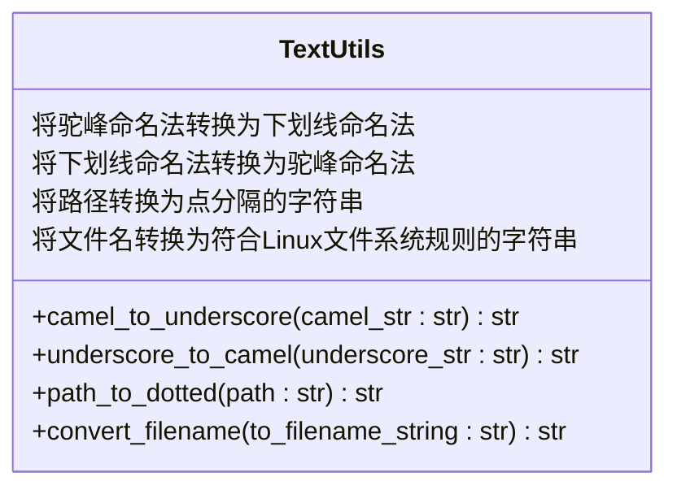
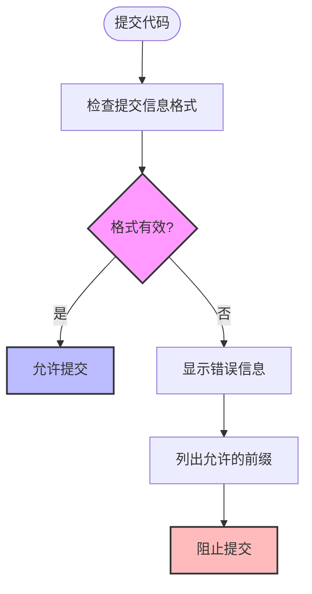
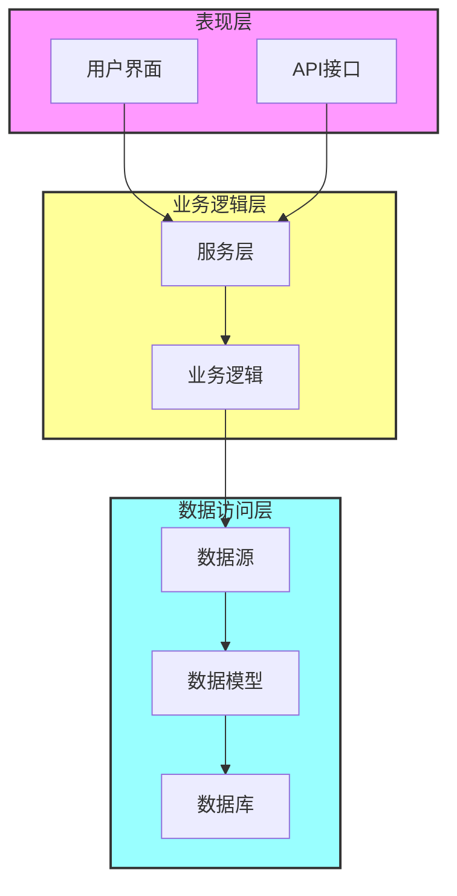

# 编码规范

<cite>
**本文档引用的文件**  
- [pyproject.toml](file://pyproject.toml)
- [scripts/pre-commit/check_commit_message.py](file://scripts/pre-commit/check_commit_message.py)
- [scripts/pre-commit/preci.py](file://scripts/pre-commit/preci.py)
- [scripts/pre-commit/preci.sh](file://scripts/pre-commit/preci.sh)
- [bkmonitor/utils/text.py](file://bkmonitor/bkmonitor/utils/text.py)
- [blueking/component/exceptions.py](file://bkmonitor/blueking/component/exceptions.py)
- [query_api/exceptions.py](file://bkmonitor/query_api/exceptions.py)
- [packages/monitor_web/statistics/v2/README.md](file://bkmonitor/packages/monitor_web/statistics/v2/README.md)
</cite>

## 目录
1. [简介](#简介)
2. [Python代码风格与命名约定](#python代码风格与命名约定)
3. [代码格式化工具配置](#代码格式化工具配置)
4. [pre-commit钩子使用规范](#pre-commit钩子使用规范)
5. [代码组织结构最佳实践](#代码组织结构最佳实践)
6. [模块划分与导入顺序](#模块划分与导入顺序)
7. [异常处理规范](#异常处理规范)
8. [注释要求](#注释要求)
9. [正确与错误编码方式对比示例](#正确与错误编码方式对比示例)

## 简介
本文档旨在为蓝鲸监控平台（BlueKing - Monitor）项目制定详细的编码规范，涵盖Python代码风格、命名约定、注释要求等方面。文档详细说明了项目使用的代码格式化工具及其配置，pre-commit钩子的使用方法和检查规则，以及代码组织结构的最佳实践。通过遵循这些规范，开发人员可以确保代码的一致性、可读性和可维护性。

## Python代码风格与命名约定

### 命名约定
项目遵循Python社区广泛接受的命名约定，并通过工具进行强制执行。

#### 变量和函数命名
使用小写字母和下划线分隔的命名方式（snake_case）：
```python
user_name = "zhangsan"
def calculate_average_value():
    pass
```

#### 类命名
使用驼峰命名法（PascalCase）：
```python
class DataProcessor:
    pass
```

#### 常量命名
使用大写字母和下划线分隔的命名方式：
```python
MAX_RETRY_COUNT = 3
DEFAULT_TIMEOUT = 30
```

#### 私有成员
使用单下划线前缀表示私有成员：
```python
class MyClass:
    def __init__(self):
        self._internal_value = 0
    
    def _private_method(self):
        pass
```

### 驼峰命名法与下划线命名法转换
项目提供了工具函数来在驼峰命名法和下划线命名法之间进行转换。这些函数位于`bkmonitor/utils/text.py`中。



**Diagram sources**
- [bkmonitor/utils/text.py](file://bkmonitor/bkmonitor/utils/text.py#L0-L74)

**Section sources**
- [bkmonitor/utils/text.py](file://bkmonitor/bkmonitor/utils/text.py#L0-L74)

## 代码格式化工具配置

### 格式化工具概览
项目使用多种代码格式化和linting工具来确保代码质量：

- **Black**: 代码格式化工具，确保代码风格一致
- **isort**: 自动排序和格式化import语句
- **flake8**: 代码linting工具，检查代码风格和潜在错误
- **ruff**: 快速的Python linter和代码格式化工具

### pyproject.toml配置
项目的代码格式化规则在根目录的`pyproject.toml`文件中定义。

```toml
[tool.black]
line-length = 120
include = '\.pyi?$'
skip-string-normalization = true
exclude = '''
/(
    \.git
  | \.hg
  | \.mypy_cache
  | \.tox
  | \.venv
  | _build
  | buck-out
  | build
  | dist
  | iam
)/
'''

[tool.isort]
profile = "black"
src_paths = ["bkmonitor", "bklog", "bkmonitor/packages"]
known_third_party = ['Crypto', 'PIL', 'apscheduler', 'arrow', 'babel', 'beanstalkc', 'celery',
    'chain_relative_strategy', 'consul', 'coreapi', 'coreschema', 'croniter', 'django',
    'django_apscheduler', 'django_filters', 'dns', 'elasticsearch5', 'fakeredis', 'furl',
    'gitlab', 'graph_exporter', 'humanize', 'influxdb', 'jinja2', 'kafka', 'kazoo', 'kombu',
    'mako', 'mistune', 'mock', 'mockredis', 'netifaces', 'prometheus_client', 'psutil',
    'pygments', 'pymysql', 'pytest', 'pytz', 'redis', 'requests', 'response_tracker',
    'rest_framework', 'rest_framework_bulk', 'rest_framework_nested', 'schematics',
    'six', 'sqlparse', 'supervisor', 'version_log', 'weixin', 'whitenoise', 'yaml', 'blueapps', 'iam']

[tool.flake8]
ignore = "C901,E203,W503,F405,E402"
max-line-length = 120
max-complexity = 25
format = "pylint"
exclude = "*config*,*migrations*,*.pyc,.git,__pycache__.tox,docs,old,build,dist,*.egg-info,.cache,.eggs"

[tool.ruff]
src = ["bkmonitor", "bklog", "bkmonitor/packages"]
line-length = 120
target-version = "py310"
exclude = [
    ".git",
    "venv",
    ".venv",
    "node_modules",
    ".pytype",
    ".ruff_cache",
    "__pypackages__"
]

[tool.ruff.lint]
select = ["E4", "E7", "E9", "F", "UP"]
extend-ignore = ["E402"]
fixable = ["ALL"]
extend-safe-fixes = ["UP"]

[tool.ruff.format]
docstring-code-format = true

[tool.ruff.lint.extend-per-file-ignores]
"bkmonitor/config/**" = ["F405"]
```

### 配置说明
- **行长度**: 所有工具都设置为120个字符，比传统的80字符更宽松，适应现代显示器
- **Black兼容性**: isort使用Black配置文件，确保格式化结果与Black兼容
- **源路径**: 指定了项目的主要源代码路径，便于工具定位代码
- **第三方包**: 明确列出了已知的第三方包，帮助isort正确排序import语句
- **忽略规则**: 针对特定情况设置了忽略规则，如F405（可能的未定义名称）在配置文件中被忽略

**Section sources**
- [pyproject.toml](file://pyproject.toml#L0-L63)

## pre-commit钩子使用规范

### pre-commit钩子概述
项目使用pre-commit钩子来在代码提交前自动执行各种检查，确保代码质量和提交信息的规范性。

### 提交信息格式规范
提交信息必须遵循特定的格式规范，由`scripts/pre-commit/check_commit_message.py`脚本进行验证。



**Diagram sources**
- [scripts/pre-commit/check_commit_message.py](file://scripts/pre-commit/check_commit_message.py#L0-L61)

**Section sources**
- [scripts/pre-commit/check_commit_message.py](file://scripts/pre-commit/check_commit_message.py#L0-L61)

### 允许的提交信息前缀
提交信息必须以以下前缀之一开头：

- **feat**: 新功能。与语义化版本中的MINOR版本对应
- **fix**: 修复bug。与语义化版本中的PATCH版本对应
- **docs**: 仅文档更改
- **style**: 不影响代码含义的更改（如格式化、空格等）
- **refactor**: 既不修复bug也不添加新功能的代码重构
- **perf**: 提高性能的代码更改
- **test**: 添加缺失的测试或修正现有测试
- **chore**: 构建过程或辅助工具和库的更改（如文档生成）
- **merge**: 合并分支并解决冲突

### 提交信息格式示例
正确的提交信息格式如下：
```
feat(user_interface): 添加用户配置文件页面

- 实现用户基本信息展示
- 添加头像上传功能
- 支持个人信息编辑

关联工单：BK-12345
```

### 其他pre-commit检查
除了提交信息检查外，项目还包含其他pre-commit检查：

- **preci.py**: Python脚本，用于在非Windows平台上执行pre-commit检查
- **preci.sh**: Shell脚本，用于调用PreCI工具进行代码扫描

```python
# scripts/pre-commit/preci.py
def main():
    if sys.platform in ["win32", "cygwin"]:
        return 0
    else:
        cmd = ("scripts/pre-commit/preci.sh", *sys.argv[1:])
    return subprocess.call(cmd)
```

```bash
# scripts/pre-commit/preci.sh
#!/bin/bash
# add path env
export PATH=~$PATH:~/PreCI

# shellcheck disable=SC2006
preci info > /dev/null 2>&1
if [ $? -ne "0" ]; then
  echo "system have not preci，skip preci"
else
  preci scan --pre-commit
fi
```

**Section sources**
- [scripts/pre-commit/preci.py](file://scripts/pre-commit/preci.py#L0-L25)
- [scripts/pre-commit/preci.sh](file://scripts/pre-commit/preci.sh#L0-L20)

## 代码组织结构最佳实践

### 模块划分原则
项目遵循清晰的模块划分原则，每个模块负责特定的功能领域：

- **ai_agent**: AI代理相关功能
- **bkmonitor**: 主监控功能
- **api**: 各种API接口
- **apm**: 应用性能监控
- **bin**: 可执行脚本
- **config**: 配置文件
- **constants**: 常量定义
- **core**: 核心功能组件
- **scripts**: 各种脚本工具

### 功能分层
项目采用分层架构，确保关注点分离：



**Diagram sources**
- 项目整体结构

### 代码复用与抽象
对于重复使用的代码，应进行合理抽象和复用：

```python
# packages/monitor_web/statistics/v2/README.md
class GrafanaCollector(BaseCollector):
    """
    仪表盘
    """

    @cached_property
    def organizations(self):  # 后面所有的指标只需要共用organizations即可
        organizatios = api.grafana.get_all_organization()["data"]
        new_organizatios = []
        for org in organizatios:
            org_name = org["name"]
            if not org_name.isdigit():
                continue
            if int(org_name) not in self.biz_info:
                continue
            new_organizatios.append(org)
        return new_organizatios
```

使用`@cached_property`装饰器可以缓存属性值，避免重复计算，提高性能。

**Section sources**
- [packages/monitor_web/statistics/v2/README.md](file://bkmonitor/packages/monitor_web/statistics/v2/README.md#L43-L66)

## 模块划分与导入顺序

### 模块划分
项目采用功能导向的模块划分方式，每个模块包含相关的功能组件：

- **utils**: 工具函数
- **models**: 数据模型
- **views**: 视图函数
- **services**: 业务服务
- **resources**: 资源定义
- **serializers**: 序列化器

### 导入顺序最佳实践
遵循PEP 8的导入顺序规范：

1. 标准库导入
2. 相关第三方库导入
3. 本地应用/库导入

```python
# 标准库导入
import os
import sys
from datetime import datetime

# 第三方库导入
import requests
from django.db import models

# 本地应用导入
from bkmonitor.utils.common_utils import file_read
from bkmonitor.models import Strategy
```

对于复杂的导入，可以使用条件导入或延迟导入来优化性能：

```python
# 条件导入示例
if sys.platform == "win32":
    import winreg
else:
    import fcntl

# 延迟导入示例
def process_data():
    from heavy_module import HeavyClass
    # HeavyClass only imported when needed
    processor = HeavyClass()
    return processor.process()
```

**Section sources**
- [packages/monitor_web/models/data_explorer.py](file://bkmonitor/packages/monitor_web/models/data_explorer.py#L67-L84)

## 异常处理规范

### 异常层次结构
项目定义了清晰的异常层次结构，便于异常的分类和处理。

```mermaid
classDiagram
class Exception {
+__init__(self, message)
+message : str
}
class ComponentBaseException(Exception) {
+__init__(self, message)
}
class ComponentAPIException(ComponentBaseException) {
+__init__(self, api_obj, error_message, resp)
+api_obj : object
+error_message : str
+resp : Response
}
class QueryExceptions(Exception) {
+__init__(self, message, code)
+error_code : str
}
class QueryTimeOut(QueryExceptions) {
+__init__(self, message)
}
class QueryForbidden(QueryExceptions) {
+__init__(self, message)
}
class SQLSyntaxError(QueryExceptions) {
+__init__(self, message)
}
Exception <|-- ComponentBaseException
ComponentBaseException <|-- ComponentAPIException
Exception <|-- QueryExceptions
QueryExceptions <|-- QueryTimeOut
QueryExceptions <|-- QueryForbidden
QueryExceptions <|-- SQLSyntaxError
class Exception {
基础异常类
}
class ComponentBaseException {
组件基础异常
}
class ComponentAPIException {
组件API异常
包含API对象、错误消息和响应
}
class QueryExceptions {
查询相关异常
包含错误代码
}
class QueryTimeOut {
查询超时异常
}
class QueryForbidden {
无权限查询异常
}
class SQLSyntaxError {
SQL语法错误异常
}
```

**Diagram sources**
- [blueking/component/exceptions.py](file://bkmonitor/blueking/component/exceptions.py#L0-L17)
- [query_api/exceptions.py](file://bkmonitor/query_api/exceptions.py#L35-L64)

**Section sources**
- [blueking/component/exceptions.py](file://bkmonitor/blueking/component/exceptions.py#L0-L17)
- [query_api/exceptions.py](file://bkmonitor/query_api/exceptions.py#L35-L64)

### 异常处理最佳实践
遵循以下异常处理原则：

1. **具体异常捕获**: 尽量捕获具体的异常类型，而不是通用的Exception
2. **异常信息记录**: 在捕获异常时记录足够的上下文信息
3. **资源清理**: 使用try-finally或with语句确保资源正确释放
4. **异常转换**: 将底层异常转换为更高级别的业务异常

```python
# 正确的异常处理示例
def fetch_user_data(user_id):
    try:
        response = requests.get(f"https://api.example.com/users/{user_id}", timeout=10)
        response.raise_for_status()
        return response.json()
    except requests.Timeout:
        logger.error(f"请求超时，用户ID: {user_id}")
        raise UserFetchTimeoutError(f"获取用户数据超时: {user_id}")
    except requests.HTTPError as e:
        logger.error(f"HTTP错误，用户ID: {user_id}, 状态码: {e.response.status_code}")
        if e.response.status_code == 404:
            raise UserNotFoundError(f"用户不存在: {user_id}")
        else:
            raise UserFetchError(f"获取用户数据失败: {user_id}")
    except requests.RequestException as e:
        logger.error(f"请求异常，用户ID: {user_id}, 错误: {str(e)}")
        raise UserFetchError(f"获取用户数据失败: {user_id}")
```

### 自定义异常
对于业务特定的错误情况，应定义自定义异常类：

```python
class UserNotFoundError(Exception):
    """用户未找到异常"""
    pass

class UserFetchTimeoutError(Exception):
    """用户数据获取超时异常"""
    pass

class UserFetchError(Exception):
    """用户数据获取失败异常"""
    pass
```

## 注释要求

### 函数和方法注释
所有公共函数和方法都应包含详细的文档字符串，说明其功能、参数和返回值。

```python
def camel_to_underscore(camel_str):
    """
    将驼峰命名法转换为下划线命名法。
    
    参数:
    camel_str -- 驼峰命名法字符串
    
    返回:
    转换后的下划线命名法字符串
    """
    # 确保输入是字符串
    assert isinstance(camel_str, six.string_types)
    # ... 实现代码
```

### 类注释
类定义应包含描述类职责和用法的文档字符串。

```python
class DataProcessor:
    """
    数据处理器类，负责数据的清洗、转换和分析。
    
    该类提供了一系列方法来处理不同类型的数据源，
    并将处理结果存储到指定的目标位置。
    """
    def __init__(self):
        self.data = []
```

### 复杂逻辑注释
对于复杂的算法或业务逻辑，应在关键步骤添加注释说明。

```python
# 计算柱状图的interval，确保柱子数量固定
# 最低聚合为一分钟
c = (end_time - start_time) / 60
if c < size:
    return 60

return int((end_time - start_time) // size)
```

### TODO和FIXME注释
使用标准的TODO和FIXME标记来标识待办事项和需要修复的问题。

```python
# TODO: 优化此算法的时间复杂度
# FIXME: 处理空输入的边界情况
```

## 正确与错误编码方式对比示例

### 命名约定对比

**错误示例**:
```python
# 错误：使用驼峰命名法的变量名
userName = "zhangsan"

# 错误：类名使用下划线命名法
class data_processor:
    pass

# 错误：常量名使用小写
maxretrycount = 3
```

**正确示例**:
```python
# 正确：使用下划线命名法的变量名
user_name = "zhangsan"

# 正确：类名使用驼峰命名法
class DataProcessor:
    pass

# 正确：常量名使用大写和下划线
MAX_RETRY_COUNT = 3
```

### 代码格式对比

**错误示例**:
```python
# 错误：行过长，超过120字符
very_long_variable_name_that_exceeds_the_line_length_limit = "this is a very long string that makes the line too long and violates the formatting rules"

# 错误：import语句顺序混乱
from django.db import models
import os
from bkmonitor.utils.common_utils import file_read
import sys
```

**正确示例**:
```python
# 正确：长字符串适当换行
very_long_variable_name_that_exceeds_the_line_length_limit = (
    "this is a very long string that is properly formatted "
    "to stay within the line length limit"
)

# 正确：import语句按规范排序
import os
import sys
from django.db import models
from bkmonitor.utils.common_utils import file_read
```

### 异常处理对比

**错误示例**:
```python
# 错误：捕获过于宽泛的异常
try:
    risky_operation()
except Exception as e:
    print("发生错误")
    # 没有记录具体错误信息
    # 没有适当的错误处理

# 错误：忽略异常
try:
    risky_operation()
except Exception:
    pass  # 完全忽略异常
```

**正确示例**:
```python
# 正确：捕获具体异常并妥善处理
try:
    response = requests.get(url, timeout=10)
    response.raise_for_status()
except requests.Timeout:
    logger.error(f"请求超时: {url}")
    raise ServiceTimeoutError(f"服务响应超时: {url}")
except requests.HTTPError as e:
    logger.error(f"HTTP错误: {url}, 状态码: {e.response.status_code}")
    raise ServiceError(f"服务返回错误状态: {url}")
except requests.RequestException as e:
    logger.error(f"请求异常: {url}, 错误: {str(e)}")
    raise ServiceError(f"服务请求失败: {url}")
```

### 函数注释对比

**错误示例**:
```python
# 错误：缺少文档字符串
def process_data(data):
    # 处理数据
    result = []
    for item in data:
        if item > 0:
            result.append(item * 2)
    return result
```

**正确示例**:
```python
def process_data(data):
    """
    处理数据列表，将正数翻倍并返回结果。
    
    该函数遍历输入的数据列表，筛选出正数并将其值翻倍，
    然后返回处理后的结果列表。
    
    参数:
    data -- 输入的数据列表，应包含数字
    
    返回:
    处理后的结果列表，包含原列表中正数的两倍值
    
    示例:
    >>> process_data([1, -2, 3, 0, 4])
    [2, 6, 8]
    """
    result = []
    for item in data:
        if item > 0:
            result.append(item * 2)
    return result
```