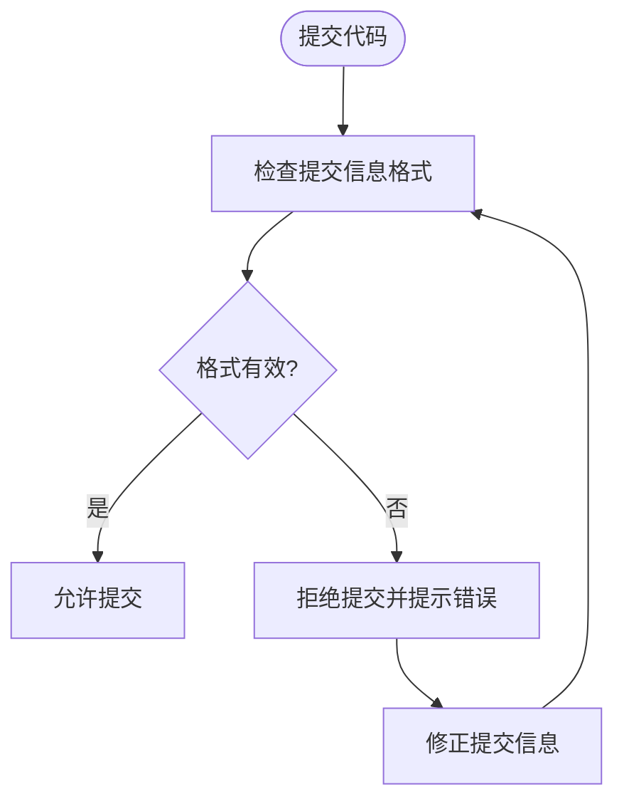
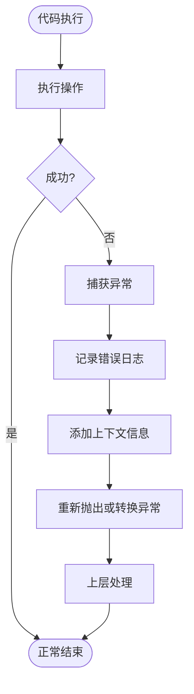

# 编码规范

<cite>
**本文档引用的文件**  
- [pyproject.toml](file://pyproject.toml)
- [.pre-commit-config.yaml](file://.pre-commit-config.yaml)
- [scripts/pre-commit/check_commit_message.py](file://scripts/pre-commit/check_commit_message.py)
- [bklog/apps/log_search/models.py](file://bklog/apps/log_search/models.py)
- [bklog/apps/log_search/serializers.py](file://bklog/apps/log_search/serializers.py)
- [bklog/apps/log_search/urls.py](file://bklog/apps/log_search/urls.py)
</cite>

## 目录
1. [Python代码风格规范](#python代码风格规范)
2. [Django最佳实践](#django最佳实践)
3. [Git提交信息格式要求](#git提交信息格式要求)
4. [pre-commit钩子使用方法](#pre-commit钩子使用方法)
5. [项目特有命名约定](#项目特有命名约定)
6. [日志记录规范](#日志记录规范)
7. [异常处理模式](#异常处理模式)
8. [代码组织结构最佳实践](#代码组织结构最佳实践)
9. [代码审查常见改进建议](#代码审查常见改进建议)

## Python代码风格规范

本项目遵循PEP 8代码风格规范，并通过自动化工具进行强制检查。代码格式化和检查规则在`pyproject.toml`文件中定义。

项目使用Black作为代码格式化工具，配置行长度为120个字符。isort用于管理import语句的排序和分组，采用black配置文件。ruff作为代码检查工具，替代了flake8，提供更快的检查速度和修复功能。

代码行长度限制为120个字符，复杂度阈值设置为25。代码检查会忽略特定的警告，如C901（复杂函数）、E203（空格问题）、W503（行继续前的二元操作符）等。

**Section sources**
- [pyproject.toml](file://pyproject.toml#L1-L64)

## Django最佳实践

项目遵循Django框架的最佳实践，采用模块化应用设计。每个应用（app）包含models.py、views.py、serializers.py、urls.py等标准文件，确保代码组织清晰。

模型设计遵循单一职责原则，使用SoftDeleteModel实现软删除功能。通过JsonField和MultiStrSplitByCommaField等自定义字段类型支持复杂数据结构。模型方法和属性使用@property装饰器提供计算属性。

视图层采用Django REST framework的ViewSet模式，通过routers.DefaultRouter自动注册URL路由。序列化器（Serializer）用于数据验证和序列化，继承serializers.Serializer或serializers.ModelSerializer。

**Section sources**
- [bklog/apps/log_search/models.py](file://bklog/apps/log_search/models.py#L106-L800)
- [bklog/apps/log_search/serializers.py](file://bklog/apps/log_search/serializers.py#L70-L800)
- [bklog/apps/log_search/urls.py](file://bklog/apps/log_search/urls.py#L41-L64)

## Git提交信息格式要求

Git提交信息必须遵循约定式提交（Conventional Commits）规范，确保提交历史清晰可读。提交信息格式为：`<type>(<scope>)!: <subject>`，其中`<scope>`和`!`为可选。

允许的提交类型包括：
- feat：新增功能，对应语义化版本的MINOR版本
- fix：修复bug，对应语义化版本的PATCH版本
- docs：仅文档更改
- style：不影响代码含义的更改（如格式化、分号等）
- refactor：既不修复bug也不添加功能的代码更改
- perf：提高性能的代码更改
- test：添加或修正测试
- chore：构建过程或辅助工具的更改
- merge：合并分支和解决冲突

提交信息检查由pre-commit钩子中的`check_commit_message.py`脚本执行，确保所有提交都符合规范。

**Diagram sources**
- [scripts/pre-commit/check_commit_message.py](file://scripts/pre-commit/check_commit_message.py#L19-L28)

**Section sources**
- [scripts/pre-commit/check_commit_message.py](file://scripts/pre-commit/check_commit_message.py#L1-L62)

## pre-commit钩子使用方法

pre-commit钩子在代码提交前自动执行一系列检查，确保代码质量和规范性。配置文件`.pre-commit-config.yaml`定义了所有钩子。

主要检查包括：
1. 检查合并冲突标记（check-merge-conflict）
2. 检测私钥（detect-private-key）
3. ruff代码检查和格式化
4. 提交信息格式验证
5. 敏感IP信息检查

ruff钩子会自动修复发现的代码风格问题，提高开发效率。敏感信息检查会扫描代码中可能泄露的IP地址，避免安全风险。

钩子在pre-commit阶段执行，开发者无需手动调用。如果检查失败，提交将被阻止，直到问题解决。

**Section sources**
- [.pre-commit-config.yaml](file://.pre-commit-config.yaml#L1-L66)

## 项目特有命名约定

项目遵循清晰、一致的命名约定，提高代码可读性。

类名采用PascalCase命名法，如`LogIndexSet`、`ProjectInfo`。模型类名应准确描述其代表的实体。管理类和处理类使用`Manager`和`Handler`后缀，如`SearchHandler`。

函数和方法名采用snake_case命名法，动词开头，如`get_indexes`、`sync_fields_snapshot`。布尔返回值的函数使用`is_`、`has_`、`can_`等前缀，如`is_active`。

变量名应具有描述性，避免使用单字母变量（循环变量除外）。常量全部大写，用下划线分隔，如`DEFAULT_TIME_FIELD`、`INDEX_SET_NO_DATA_CHECK_INTERVAL`。

URL路由命名采用小写字母和连字符，如`search/index_set`、`result_table`。

**Section sources**
- [bklog/apps/log_search/models.py](file://bklog/apps/log_search/models.py#L106-L800)
- [bklog/apps/log_search/urls.py](file://bklog/apps/log_search/urls.py#L49-L64)

## 日志记录规范

项目使用Python标准库的logging模块进行日志记录。日志配置在`config/log.py`中定义，包含不同环境的日志级别和输出格式。

日志记录应包含足够的上下文信息，如请求ID、用户信息、操作类型等。错误日志必须包含异常的完整堆栈跟踪，便于问题排查。

日志级别使用规范：
- DEBUG：调试信息，仅在开发环境启用
- INFO：重要事件，如服务启动、配置加载
- WARNING：潜在问题，不影响系统运行
- ERROR：运行时错误，需要关注
- CRITICAL：严重错误，可能导致系统不可用

避免在日志中记录敏感信息，如密码、密钥、个人身份信息等。

**Section sources**
- [bklog/apps/log_search/models.py](file://bklog/apps/log_search/models.py#L22-L28)
- [bklog/apps/log_search/serializers.py](file://bklog/apps/log_search/serializers.py#L22-L28)

## 异常处理模式

项目定义了统一的异常处理模式，确保错误处理的一致性。自定义异常继承自`apps.exceptions`模块中的基类异常。

异常类名以`Error`或`Exception`结尾，如`BizNotExistError`、`IndexSetNameDuplicateException`。异常消息应清晰描述问题原因和可能的解决方案。

异常处理遵循"快速失败"原则，尽早检测并抛出异常。在适当层级捕获异常，添加上下文信息后重新抛出，或转换为用户友好的错误消息。

使用`try-except`块时，应捕获具体异常类型而非通用异常。在`finally`块中执行必要的清理工作，确保资源正确释放。

**Diagram sources**
- [bklog/apps/log_search/models.py](file://bklog/apps/log_search/models.py#L76-L82)
- [bklog/apps/log_search/serializers.py](file://bklog/apps/log_search/serializers.py#L30-L31)

**Section sources**
- [bklog/apps/log_search/models.py](file://bklog/apps/log_search/models.py#L76-L82)
- [bklog/apps/log_search/serializers.py](file://bklog/apps/log_search/serializers.py#L30-L31)

## 代码组织结构最佳实践

项目采用清晰的代码组织结构，按功能模块划分应用。每个应用包含models.py、views.py、handlers.py等文件，职责分明。

models.py：定义数据模型和数据库表结构，包含业务逻辑相关的模型方法。

views.py：处理HTTP请求和响应，调用服务层逻辑，返回JSON数据。使用Django REST framework的APIView或ViewSet。

handlers.py：包含业务逻辑处理，如搜索处理、聚合分析等。将复杂业务逻辑从视图层分离，提高代码复用性。

serializers.py：定义数据序列化和反序列化规则，包含数据验证逻辑。

urls.py：定义URL路由，将URL模式映射到视图。

这种分层结构确保了关注点分离，便于维护和测试。

**Section sources**
- [bklog/apps/log_search/models.py](file://bklog/apps/log_search/models.py#L106-L800)
- [bklog/apps/log_search/views.py](file://bklog/apps/log_search/views.py)
- [bklog/apps/log_search/handlers/__init__.py](file://bklog/apps/log_search/handlers/__init__.py)
- [bklog/apps/log_search/serializers.py](file://bklog/apps/log_search/serializers.py#L1-L800)
- [bklog/apps/log_search/urls.py](file://bklog/apps/log_search/urls.py#L1-L65)

## 代码审查常见改进建议

代码审查时常见的改进建议包括：

1. **代码可读性**：确保变量名、函数名具有描述性，避免缩写和模糊命名。
2. **错误处理**：检查是否处理了所有可能的异常情况，异常消息是否清晰。
3. **性能优化**：避免N+1查询问题，合理使用数据库索引和缓存。
4. **安全性**：检查是否存在SQL注入、XSS等安全漏洞，敏感信息是否妥善处理。
5. **测试覆盖**：确保新增功能有足够的单元测试和集成测试覆盖。
6. **文档注释**：检查函数和类是否有适当的docstring，复杂逻辑是否有内联注释。
7. **代码复用**：检查是否存在重复代码，是否可以提取公共方法或组件。
8. **边界条件**：检查代码是否正确处理空值、边界值和异常输入。

审查者应提供建设性反馈，解释问题原因和改进建议，促进团队知识共享。

**Section sources**
- [bklog/apps/log_search/models.py](file://bklog/apps/log_search/models.py#L106-L800)
- [bklog/apps/log_search/serializers.py](file://bklog/apps/log_search/serializers.py#L1-L800)
- [bklog/apps/log_search/urls.py](file://bklog/apps/log_search/urls.py#L1-L65)