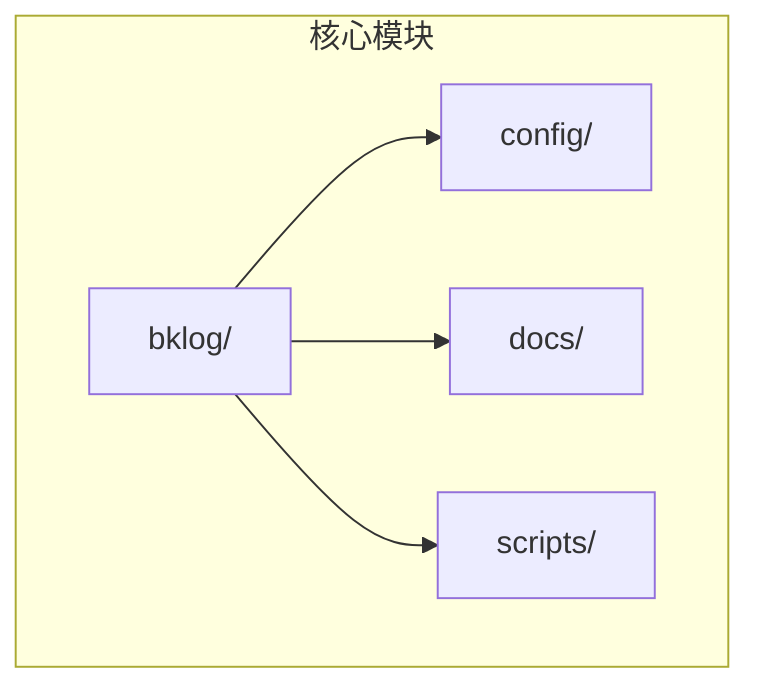
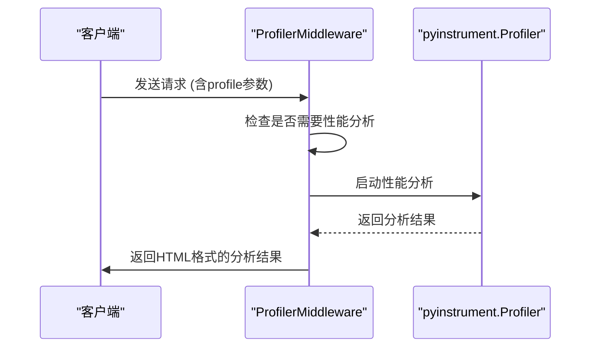
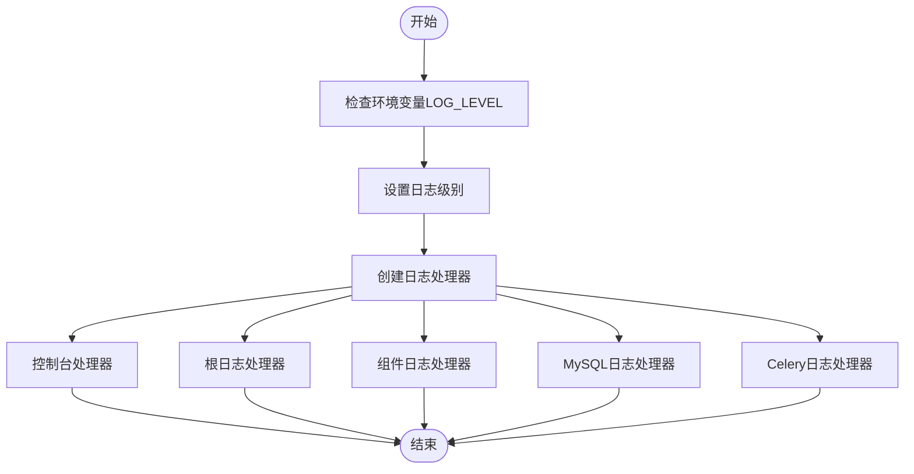
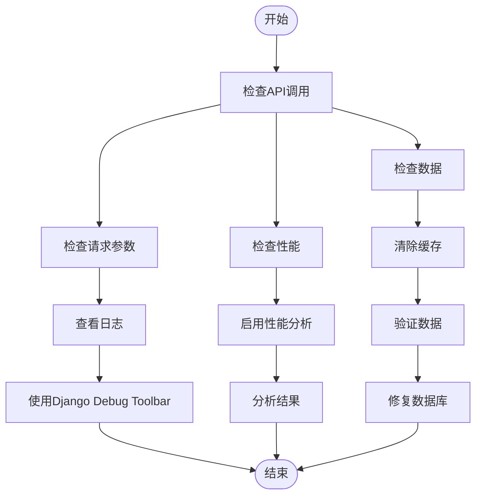
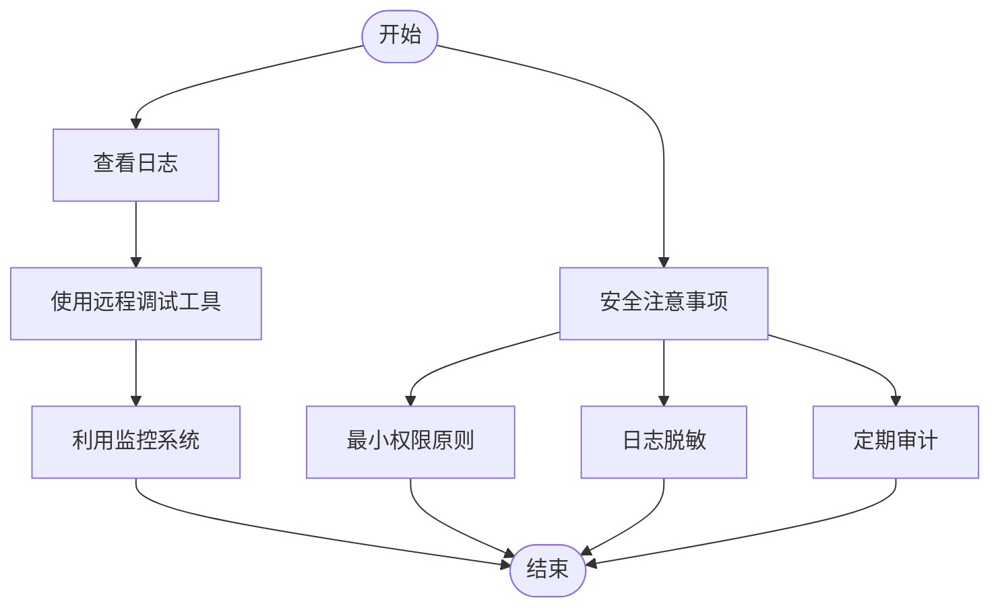

# 调试指南

<cite>
**本文档引用的文件**
- [pyinstrument.py](file://bklog/apps/middleware/pyinstrument.py)
- [log.py](file://bklog/config/log.py)
- [dev.py](file://bklog/config/dev.py)
- [stag.py](file://bklog/config/stag.py)
- [prod.py](file://bklog/config/prod.py)
- [settings.py](file://bklog/settings.py)
- [exceptions.py](file://bklog/apps/exceptions.py)
- [generic.py](file://bklog/apps/generic.py)
</cite>

## 目录
1. [简介](#简介)
2. [项目结构](#项目结构)
3. [核心调试工具](#核心调试工具)
4. [日志记录配置](#日志记录配置)
5. [常见问题排查](#常见问题排查)
6. [生产环境调试](#生产环境调试)
7. [结论](#结论)

## 简介
本文档旨在为开发者提供一个全面的调试指南，帮助高效定位和解决在蓝鲸日志平台项目中遇到的问题。文档详细介绍了项目特有的调试工具和中间件，如pyinstrument性能分析中间件的使用方法。同时，文档化了日志记录配置和日志级别设置，说明如何获取不同详细程度的调试信息。此外，还提供了常见问题的排查流程图，包括API调用失败、性能瓶颈、数据不一致等场景，并说明了如何使用Django Debug Toolbar和其他调试工具。最后，文档包含了生产环境问题的远程调试方法和安全注意事项。

## 项目结构
蓝鲸日志平台项目采用模块化设计，主要分为以下几个部分：
- `bklog/`：核心日志处理模块，包含日志搜索、日志审计、日志脱敏等功能。
- `config/`：配置文件目录，包含开发、预发布和正式环境的配置文件。
- `docs/`：文档目录，包含项目概述、设计文档和贡献指南。
- `scripts/`：脚本目录，包含各种自动化脚本。

**图示来源**
- [pyinstrument.py](file://bklog/apps/middleware/pyinstrument.py)
- [log.py](file://bklog/config/log.py)

**章节来源**
- [pyinstrument.py](file://bklog/apps/middleware/pyinstrument.py)
- [log.py](file://bklog/config/log.py)

## 核心调试工具

### pyinstrument性能分析中间件
pyinstrument是一个Python性能分析工具，可以用来分析Django应用的性能瓶颈。在本项目中，通过`ProfilerMiddleware`中间件实现了pyinstrument的集成。

#### 使用方法
1. **启用中间件**：确保`ProfilerMiddleware`已添加到Django的中间件列表中。
2. **触发性能分析**：在请求URL中添加`profile`参数，例如`/api/v1/search/?profile=1`。
3. **查看结果**：如果请求用户是超级用户，性能分析结果将以HTML格式直接返回；否则，结果将保存到指定目录。

#### 配置选项
- `PYINSTRUMENT_URL_ARGUMENT`：指定URL中用于触发性能分析的参数名称，默认为`profile`。
- `PYINSTRUMENT_PROFILE_DIR`：指定性能分析结果的保存目录。
- `PYINSTRUMENT_SHOW_CALLBACK`：指定一个回调函数，用于决定是否显示性能分析结果。

**图示来源**
- [pyinstrument.py](file://bklog/apps/middleware/pyinstrument.py)

**章节来源**
- [pyinstrument.py](file://bklog/apps/middleware/pyinstrument.py)

## 日志记录配置

### 日志级别设置
项目的日志级别可以通过环境变量`LOG_LEVEL`进行设置。不同环境下的默认日志级别如下：
- 开发环境（dev）：`INFO`
- 预发布环境（stag）：`INFO`
- 正式环境（prod）：`ERROR`

#### 配置文件
- `dev.py`：开发环境配置文件，日志级别默认为`INFO`。
- `stag.py`：预发布环境配置文件，日志级别默认为`INFO`。
- `prod.py`：正式环境配置文件，日志级别默认为`ERROR`。

### 日志处理器
项目使用了多种日志处理器，包括：
- `console`：将日志输出到控制台。
- `root`：将日志写入`django.log`文件。
- `component`：将组件调用日志写入`component.log`文件。
- `mysql`：将数据库查询日志写入`mysql.log`文件。
- `celery`：将Celery任务日志写入`celery.log`文件。

**图示来源**
- [log.py](file://bklog/config/log.py)
- [dev.py](file://bklog/config/dev.py)
- [stag.py](file://bklog/config/stag.py)
- [prod.py](file://bklog/config/prod.py)

**章节来源**
- [log.py](file://bklog/config/log.py)
- [dev.py](file://bklog/config/dev.py)
- [stag.py](file://bklog/config/stag.py)
- [prod.py](file://bklog/config/prod.py)

## 常见问题排查

### API调用失败
当API调用失败时，可以按照以下步骤进行排查：
1. **检查请求参数**：确保请求参数正确无误。
2. **查看日志**：检查`django.log`和`component.log`文件，查找相关错误信息。
3. **使用Django Debug Toolbar**：在开发环境中，启用Django Debug Toolbar，查看详细的请求和响应信息。

### 性能瓶颈
遇到性能瓶颈时，可以使用pyinstrument进行性能分析：
1. **启用性能分析**：在请求URL中添加`profile`参数。
2. **分析结果**：查看返回的HTML格式的性能分析结果，找出耗时较长的函数调用。

### 数据不一致
数据不一致问题通常由缓存或数据库同步问题引起：
1. **检查缓存**：清除相关缓存，重新获取数据。
2. **检查数据库**：确认数据库中的数据是否正确，必要时手动修复。

**图示来源**
- [pyinstrument.py](file://bklog/apps/middleware/pyinstrument.py)
- [log.py](file://bklog/config/log.py)

**章节来源**
- [pyinstrument.py](file://bklog/apps/middleware/pyinstrument.py)
- [log.py](file://bklog/config/log.py)

## 生产环境调试

### 远程调试方法
在生产环境中，由于安全考虑，通常不允许直接访问服务器。可以采用以下方法进行远程调试：
1. **日志分析**：通过查看日志文件，定位问题。
2. **远程调试工具**：使用支持远程调试的工具，如`rpyc`或`pdb`。
3. **监控系统**：利用监控系统（如Prometheus）收集系统指标，分析性能问题。

### 安全注意事项
- **最小权限原则**：确保调试工具和脚本具有最小必要的权限。
- **日志脱敏**：避免在日志中记录敏感信息，如密码、密钥等。
- **定期审计**：定期审计调试工具和脚本的使用情况，确保没有滥用。

**图示来源**
- [pyinstrument.py](file://bklog/apps/middleware/pyinstrument.py)
- [log.py](file://bklog/config/log.py)

**章节来源**
- [pyinstrument.py](file://bklog/apps/middleware/pyinstrument.py)
- [log.py](file://bklog/config/log.py)

## 结论
本文档详细介绍了蓝鲸日志平台项目的调试方法和工具，包括pyinstrument性能分析中间件的使用、日志记录配置、常见问题排查流程以及生产环境的远程调试方法和安全注意事项。通过遵循这些指南，开发者可以更高效地定位和解决项目中的问题，提高开发效率和系统稳定性。