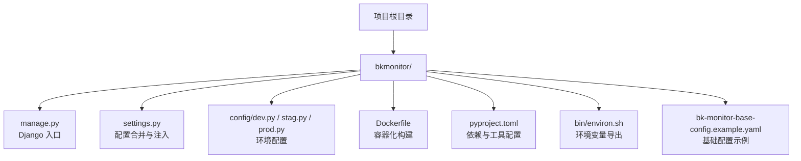
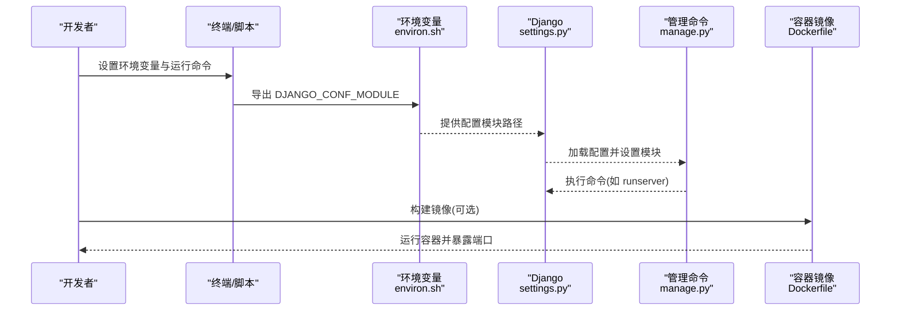
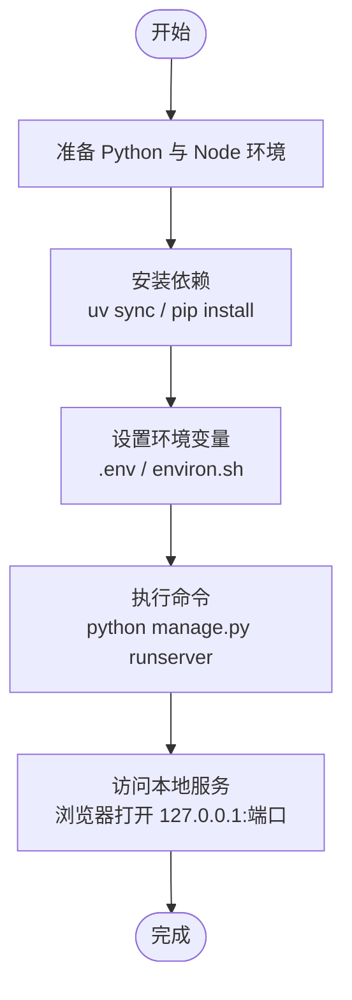
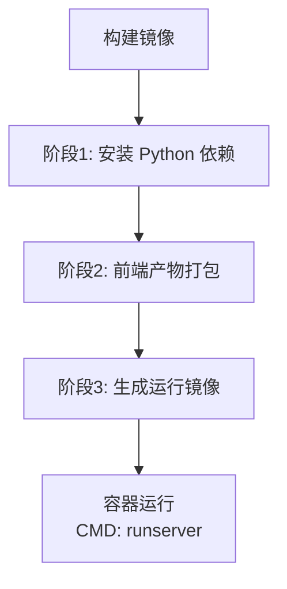
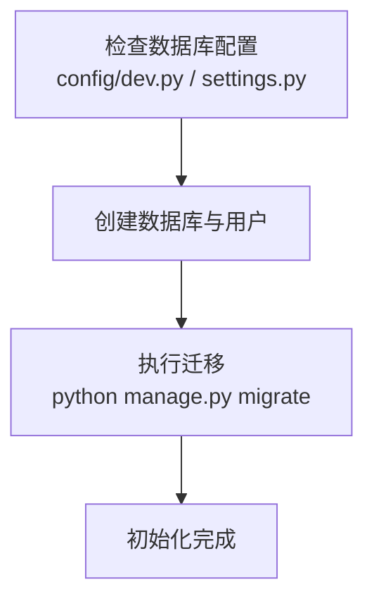
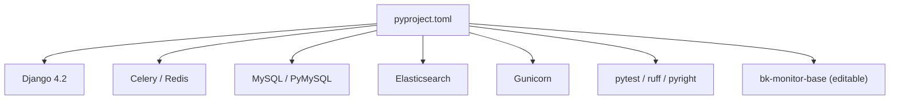

# 快速开始

<cite>
**本文引用的文件**
- [README.md](file://README.md)
- [bkmonitor/Dockerfile](file://bkmonitor/Dockerfile)
- [bkmonitor/manage.py](file://bkmonitor/manage.py)
- [bkmonitor/settings.py](file://bkmonitor/settings.py)
- [bkmonitor/config/dev.py](file://bkmonitor/config/dev.py)
- [bkmonitor/config/stag.py](file://bkmonitor/config/stag.py)
- [bkmonitor/config/prod.py](file://bkmonitor/config/prod.py)
- [bkmonitor/pyproject.toml](file://bkmonitor/pyproject.toml)
- [bkmonitor/bin/environ.sh](file://bkmonitor/bin/environ.sh)
- [bkmonitor/bk-monitor-base-config.example.yaml](file://bkmonitor/bk-monitor-base-config.example.yaml)
</cite>

## 目录
1. [简介](#简介)
2. [项目结构](#项目结构)
3. [核心组件](#核心组件)
4. [架构总览](#架构总览)
5. [详细组件分析](#详细组件分析)
6. [依赖分析](#依赖分析)
7. [性能考虑](#性能考虑)
8. [故障排查指南](#故障排查指南)
9. [结论](#结论)
10. [附录](#附录)

## 简介
本指南面向首次接触蓝鲸智云监控平台的用户，提供从环境准备、依赖安装、配置设置到首次运行的完整流程。内容覆盖本地开发环境搭建、Docker 容器化部署、数据库初始化、服务启动与验证等关键步骤，并给出常见问题的解决方案与验证方法，帮助你在最短时间内成功运行项目并理解基本功能。

## 项目结构
蓝鲸智云监控平台采用多模块分层组织，核心入口位于 bkmonitor 目录，包含 Django 应用、配置、脚本与容器化构建文件。关键目录与文件职责概览：
- 管理与入口
  - manage.py：Django 管理命令入口，负责环境变量加载、软链处理与命令执行。
  - settings.py：统一加载配置模块与角色配置，合并基础配置，注入数据库与应用列表。
- 配置层
  - config/default.py（未列出）、config/dev.py、config/stag.py、config/prod.py：按环境加载默认配置并覆盖运行模式。
- 构建与运行
  - Dockerfile：定义镜像构建阶段、前端打包、Python 依赖安装与运行入口。
  - pyproject.toml：项目元信息、依赖声明、测试与格式化工具配置。
  - bin/environ.sh：导出运行所需的 Django 配置模块变量。
- 基础配置示例
  - bk-monitor-base-config.example.yaml：蓝鲸基础配置示例，包含数据库、域名与存储等键位。

**图表来源**
- [bkmonitor/manage.py:1-49](file://bkmonitor/manage.py#L1-L49)
- [bkmonitor/settings.py:1-110](file://bkmonitor/settings.py#L1-L110)
- [bkmonitor/config/dev.py:1-67](file://bkmonitor/config/dev.py#L1-L67)
- [bkmonitor/config/stag.py:1-15](file://bkmonitor/config/stag.py#L1-L15)
- [bkmonitor/config/prod.py:1-15](file://bkmonitor/config/prod.py#L1-L15)
- [bkmonitor/Dockerfile:1-86](file://bkmonitor/Dockerfile#L1-L86)
- [bkmonitor/pyproject.toml:1-221](file://bkmonitor/pyproject.toml#L1-L221)
- [bkmonitor/bin/environ.sh:1-13](file://bkmonitor/bin/environ.sh#L1-L13)
- [bkmonitor/bk-monitor-base-config.example.yaml:1-50](file://bkmonitor/bk-monitor-base-config.example.yaml#L1-L50)

**章节来源**
- [README.md:1-52](file://README.md#L1-L52)
- [bkmonitor/manage.py:1-49](file://bkmonitor/manage.py#L1-L49)
- [bkmonitor/settings.py:1-110](file://bkmonitor/settings.py#L1-L110)
- [bkmonitor/config/dev.py:1-67](file://bkmonitor/config/dev.py#L1-L67)
- [bkmonitor/config/stag.py:1-15](file://bkmonitor/config/stag.py#L1-L15)
- [bkmonitor/config/prod.py:1-15](file://bkmonitor/config/prod.py#L1-L15)
- [bkmonitor/Dockerfile:1-86](file://bkmonitor/Dockerfile#L1-L86)
- [bkmonitor/pyproject.toml:1-221](file://bkmonitor/pyproject.toml#L1-L221)
- [bkmonitor/bin/environ.sh:1-13](file://bkmonitor/bin/environ.sh#L1-L13)
- [bkmonitor/bk-monitor-base-config.example.yaml:1-50](file://bkmonitor/bk-monitor-base-config.example.yaml#L1-L50)

## 核心组件
- 管理入口与命令执行
  - 通过 manage.py 统一加载 .env 环境变量，自动处理 ai_agent 符号链接，设置 Django 配置模块并执行命令行参数。
- 配置加载与合并
  - settings.py 按运行环境动态选择配置模块，合并基础配置，注入数据库与应用列表，并支持从环境变量覆盖配置。
- 环境变量与角色配置
  - environ.sh 导出 DJANGO_CONF_MODULE，配合 config/ 下的环境配置文件实现不同运行模式。
- 容器化与依赖
  - Dockerfile 将 Python 与前端产物整合为运行镜像；pyproject.toml 声明 Python 依赖与开发工具链。

**章节来源**
- [bkmonitor/manage.py:18-49](file://bkmonitor/manage.py#L18-L49)
- [bkmonitor/settings.py:41-63](file://bkmonitor/settings.py#L41-L63)
- [bkmonitor/bin/environ.sh:4-12](file://bkmonitor/bin/environ.sh#L4-L12)
- [bkmonitor/Dockerfile:66-86](file://bkmonitor/Dockerfile#L66-L86)
- [bkmonitor/pyproject.toml:1-99](file://bkmonitor/pyproject.toml#L1-L99)

## 架构总览
下图展示从本地开发到容器化运行的关键流程与组件交互：

**图表来源**
- [bkmonitor/bin/environ.sh:4-12](file://bkmonitor/bin/environ.sh#L4-L12)
- [bkmonitor/settings.py:41-63](file://bkmonitor/settings.py#L41-L63)
- [bkmonitor/manage.py:44-48](file://bkmonitor/manage.py#L44-L48)
- [bkmonitor/Dockerfile:83-86](file://bkmonitor/Dockerfile#L83-L86)

## 详细组件分析

### 本地开发环境搭建
- 环境准备
  - Python 版本要求与依赖管理：pyproject.toml 指定 Python 版本与依赖清单，推荐使用 uv 进行锁定同步与虚拟环境管理。
  - 前端构建：Dockerfile 中包含前端打包阶段，若需本地调试前端，可在本地安装 Node.js 并执行构建脚本。
- 环境变量与配置
  - 使用 .env 文件或 shell 导出环境变量，environ.sh 可辅助设置 DJANGO_CONF_MODULE。
  - settings.py 支持从环境变量覆盖配置，便于本地调试。
- 启动服务
  - 通过 manage.py 执行 Django 命令，例如 runserver，默认监听 8000 端口（以实际配置为准）。

**图表来源**
- [bkmonitor/pyproject.toml:101-106](file://bkmonitor/pyproject.toml#L101-L106)
- [bkmonitor/bin/environ.sh:4-12](file://bkmonitor/bin/environ.sh#L4-L12)
- [bkmonitor/manage.py:44-48](file://bkmonitor/manage.py#L44-L48)

**章节来源**
- [bkmonitor/pyproject.toml:1-99](file://bkmonitor/pyproject.toml#L1-L99)
- [bkmonitor/bin/environ.sh:1-13](file://bkmonitor/bin/environ.sh#L1-L13)
- [bkmonitor/manage.py:18-49](file://bkmonitor/manage.py#L18-L49)

### Docker 容器化部署
- 构建镜像
  - Dockerfile 定义多阶段构建：Python 依赖安装、前端产物打包、最终运行镜像生成。
  - 最终镜像以 tini 作为 PID 1，CMD 默认启动 Django 开发服务器。
- 运行容器
  - 建议映射端口到宿主机，挂载必要配置与日志目录，结合环境变量完成运行时配置覆盖。

**图表来源**
- [bkmonitor/Dockerfile:24-67](file://bkmonitor/Dockerfile#L24-L67)

**章节来源**
- [bkmonitor/Dockerfile:1-86](file://bkmonitor/Dockerfile#L1-L86)

### 数据库初始化
- 配置要点
  - 本地开发数据库配置位于 config/dev.py，包含 default 与 monitor_api 两个数据库连接示例。
  - settings.py 会在加载基础配置后，为旧版后端与旧版 saas 补齐数据库连接。
- 初始化步骤
  - 创建数据库（名称与字符集见配置），执行 Django 迁移以生成表结构。
  - 若使用基础配置模块，可参考 bk-monitor-base-config.example.yaml 的数据库键位进行补充。

**图表来源**
- [bkmonitor/config/dev.py:46-66](file://bkmonitor/config/dev.py#L46-L66)
- [bkmonitor/settings.py:103-108](file://bkmonitor/settings.py#L103-L108)
- [bkmonitor/bk-monitor-base-config.example.yaml:9-30](file://bkmonitor/bk-monitor-base-config.example.yaml#L9-L30)

**章节来源**
- [bkmonitor/config/dev.py:46-66](file://bkmonitor/config/dev.py#L46-L66)
- [bkmonitor/settings.py:94-108](file://bkmonitor/settings.py#L94-L108)
- [bkmonitor/bk-monitor-base-config.example.yaml:9-30](file://bkmonitor/bk-monitor-base-config.example.yaml#L9-L30)

### 首次运行与验证
- 启动方式
  - 本地：python manage.py runserver。
  - 容器：构建镜像后运行容器，访问容器暴露的端口。
- 验证方法
  - 浏览器访问本地地址，确认页面可正常加载。
  - 查看日志输出，确认无致命错误。
  - 如需 API 访问，可使用 Django 提供的管理命令查看可用接口。

**章节来源**
- [bkmonitor/manage.py:44-48](file://bkmonitor/manage.py#L44-L48)
- [bkmonitor/Dockerfile:83-86](file://bkmonitor/Dockerfile#L83-L86)

## 依赖分析
- Python 依赖
  - Django 4.2、Celery、Redis、MySQL、Elasticsearch、Gunicorn 等核心组件在 pyproject.toml 中集中声明。
- 工具链
  - pytest、ruff、pyright 等用于测试、格式化与类型检查。
- 基础模块
  - 通过 editable 模式引入 bk-monitor-base，确保与基础配置一致。

**图表来源**
- [bkmonitor/pyproject.toml:1-99](file://bkmonitor/pyproject.toml#L1-L99)
- [bkmonitor/pyproject.toml:104-106](file://bkmonitor/pyproject.toml#L104-L106)

**章节来源**
- [bkmonitor/pyproject.toml:1-221](file://bkmonitor/pyproject.toml#L1-L221)

## 性能考虑
- 前端构建优化
  - Dockerfile 中已包含前端产物打包，建议在本地开发时仅关注后端逻辑，避免频繁重新打包。
- 数据库连接池
  - 项目内置数据库连接池组件，建议在生产环境合理配置连接数与超时时间。
- 日志与监控
  - 可启用 Prometheus 客户端与 OpenTelemetry 相关组件，便于运行时性能观测。

[本节为通用建议，无需具体文件分析]

## 故障排查指南
- 环境变量未生效
  - 确认 .env 文件已正确加载，或 shell 已导出 DJANGO_CONF_MODULE。
  - 参考：environ.sh 与 manage.py 的环境变量处理逻辑。
- ai_agent 符号链接失败
  - Windows 需要管理员权限创建 Junction；POSIX 需确保目标路径存在。
  - 参考：manage.py 中的符号链接创建逻辑。
- 数据库连接异常
  - 检查 config/dev.py 中的数据库连接参数与实际数据库状态。
  - 参考：settings.py 对旧版数据库连接的补全逻辑。
- 容器启动后无法访问
  - 确认容器端口映射与防火墙设置，检查 CMD 默认启动的服务端口。
  - 参考：Dockerfile 中的 ENTRYPOINT 与 CMD。

**章节来源**
- [bkmonitor/bin/environ.sh:4-12](file://bkmonitor/bin/environ.sh#L4-L12)
- [bkmonitor/manage.py:18-37](file://bkmonitor/manage.py#L18-L37)
- [bkmonitor/config/dev.py:46-66](file://bkmonitor/config/dev.py#L46-L66)
- [bkmonitor/settings.py:103-108](file://bkmonitor/settings.py#L103-L108)
- [bkmonitor/Dockerfile:83-86](file://bkmonitor/Dockerfile#L83-L86)

## 结论
通过本指南，你可以完成蓝鲸智云监控平台的本地开发与容器化部署，掌握数据库初始化、服务启动与验证的基本流程。遇到问题时，可依据“故障排查指南”逐项定位。建议在正式环境中进一步完善配置与安全策略，并结合监控与日志体系持续优化运行质量。

[本节为总结性内容，无需具体文件分析]

## 附录
- 相关文档与支持
  - 项目 README 提供总体介绍与外部文档链接。
- 基础配置参考
  - 可参考 bk-monitor-base-config.example.yaml 的键位说明，补充蓝鲸基础配置。

**章节来源**
- [README.md:1-52](file://README.md#L1-L52)
- [bkmonitor/bk-monitor-base-config.example.yaml:1-50](file://bkmonitor/bk-monitor-base-config.example.yaml#L1-L50)