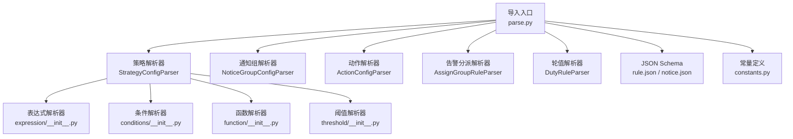
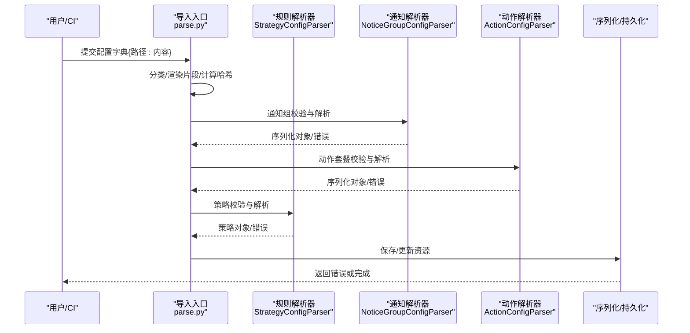
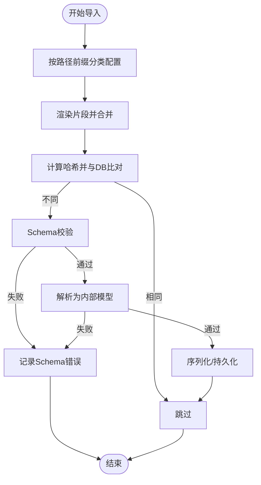
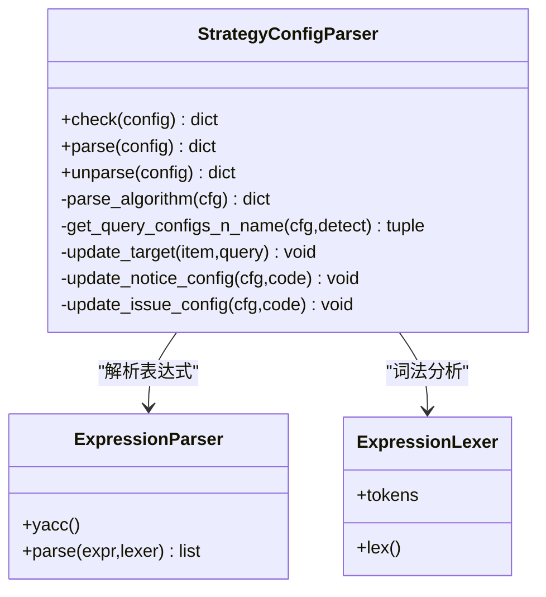
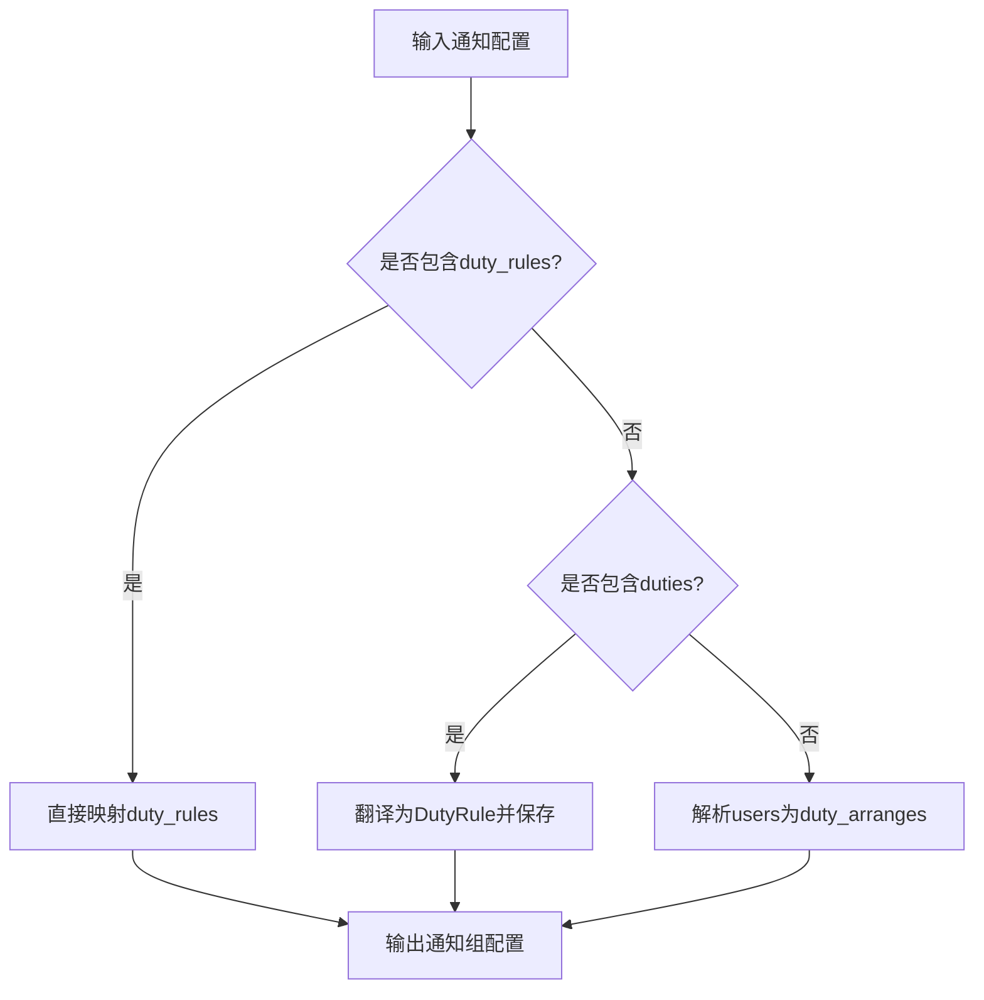
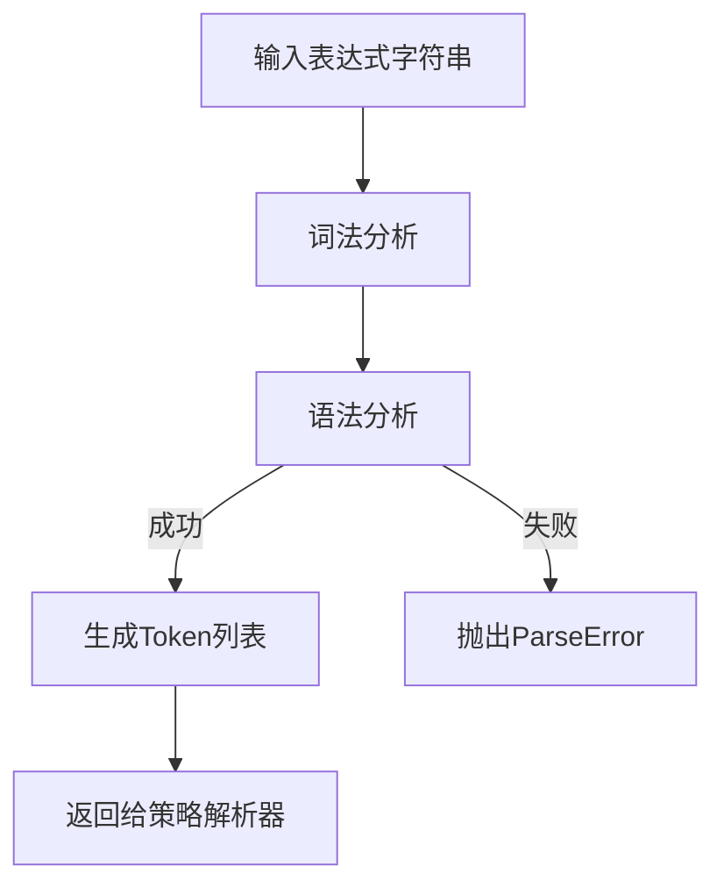
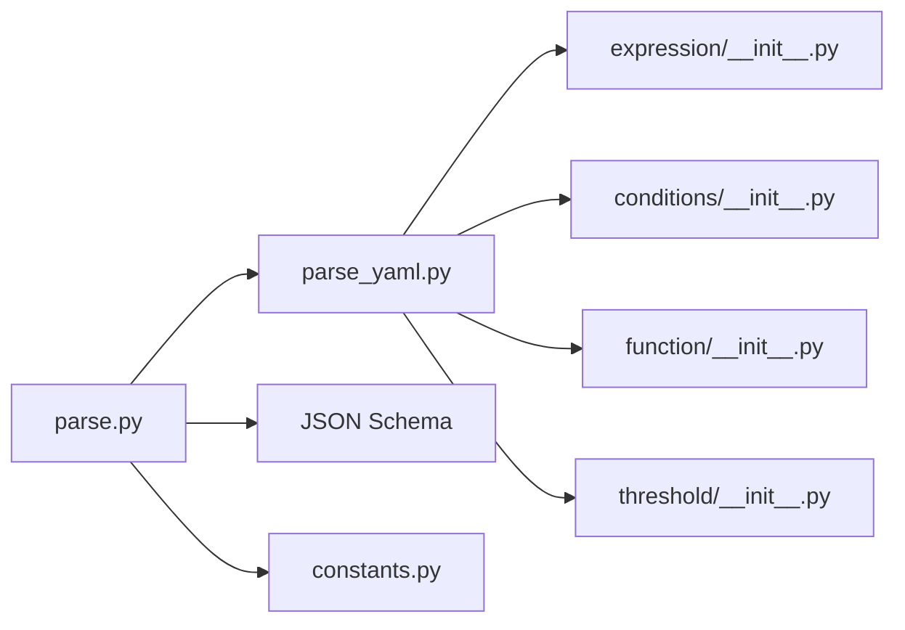

# AS-Code配置开发

<cite>
**本文档引用的文件**
- [parse.py](file://bkmonitor/bkmonitor/as_code/parse.py)
- [parse_yaml.py](file://bkmonitor/bkmonitor/as_code/parse_yaml.py)
- [constants.py](file://bkmonitor/bkmonitor/as_code/constants.py)
- [rule.json](file://bkmonitor/bkmonitor/as_code/json_schema/rule.json)
- [notice.json](file://bkmonitor/bkmonitor/as_code/json_schema/notice.json)
- [expression/__init__.py](file://bkmonitor/bkmonitor/as_code/ply/expression/__init__.py)
- [conditions/__init__.py](file://bkmonitor/bkmonitor/as_code/ply/conditions/__init__.py)
- [function/__init__.py](file://bkmonitor/bkmonitor/as_code/ply/function/__init__.py)
- [threshold/__init__.py](file://bkmonitor/bkmonitor/as_code/ply/threshold/__init__.py)
- [error.py](file://bkmonitor/bkmonitor/as_code/ply/error.py)
</cite>

## 目录
1. [简介](#简介)
2. [项目结构](#项目结构)
3. [核心组件](#核心组件)
4. [架构总览](#架构总览)
5. [详细组件分析](#详细组件分析)
6. [依赖分析](#依赖分析)
7. [性能考虑](#性能考虑)
8. [故障排查指南](#故障排查指南)
9. [结论](#结论)
10. [附录](#附录)

## 简介
本指南面向使用 AS-Code（代码即配置）进行监控告警配置开发的工程师，系统阐述设计理念、语法解析器实现、配置验证机制与完整开发流程。通过统一的 YAML/JSON 配置与严格的 JSON Schema 校验，结合 PLY 语法解析器，实现策略配置、通知配置、告警规则的代码化与自动化导入。

## 项目结构
AS-Code 模块位于 `bkmonitor/bkmonitor/as_code/`，主要由以下部分组成：
- 解析与导入入口：负责按路径分类配置、渲染片段、校验、转换并持久化
- 解析器集合：针对不同配置类型的专用解析器（策略、通知组、动作套餐、告警分派、轮值）
- JSON Schema：定义各配置类型的结构约束与默认值
- PLY 语法解析器：表达式、阈值、条件、函数等语法树构建与错误处理
- 常量：版本号上限/下限定义

图表来源
- [parse.py:524-738](file://bkmonitor/bkmonitor/as_code/parse.py#L524-L738)
- [parse_yaml.py:118-864](file://bkmonitor/bkmonitor/as_code/parse_yaml.py#L118-L864)
- [expression/__init__.py:11-59](file://bkmonitor/bkmonitor/as_code/ply/expression/__init__.py#L11-L59)

章节来源
- [parse.py:524-738](file://bkmonitor/bkmonitor/as_code/parse.py#L524-L738)
- [parse_yaml.py:118-864](file://bkmonitor/bkmonitor/as_code/parse_yaml.py#L118-L864)
- [constants.py:4-16](file://bkmonitor/bkmonitor/as_code/constants.py#L4-L16)

## 核心组件
- 导入与转换引擎
  - 按路径前缀将配置归类到规则、通知、动作、仪表盘、告警分派、轮值等域
  - 渲染片段、计算哈希、对比差异、Schema 校验、序列化转换、持久化
- 配置解析器
  - 策略解析器：解析查询、算法、触发、无数据检测、目标、通知、动作、升级等
  - 通知组解析器：解析告警/动作通知方式、轮值规则、用户/用户组
  - 动作解析器：解析动作套餐类型、超时、模板详情
  - 告警分派解析器：解析分派规则、通知升级
  - 轮值解析器：解析轮值安排、交接、生效时间
- 验证与版本
  - JSON Schema 校验与默认值填充
  - 版本上限/下限常量控制兼容性
- 语法解析器（PLY）
  - 表达式、条件、函数、阈值的词法与语法解析，异常统一抛出

章节来源
- [parse.py:57-132](file://bkmonitor/bkmonitor/as_code/parse.py#L57-L132)
- [parse.py:135-203](file://bkmonitor/bkmonitor/as_code/parse.py#L135-L203)
- [parse.py:206-308](file://bkmonitor/bkmonitor/as_code/parse.py#L206-L308)
- [parse.py:378-511](file://bkmonitor/bkmonitor/as_code/parse.py#L378-L511)
- [parse_yaml.py:876-1141](file://bkmonitor/bkmonitor/as_code/parse_yaml.py#L876-L1141)
- [parse_yaml.py:1143-1194](file://bkmonitor/bkmonitor/as_code/parse_yaml.py#L1143-L1194)
- [parse_yaml.py:1196-1295](file://bkmonitor/bkmonitor/as_code/parse_yaml.py#L1196-L1295)
- [parse_yaml.py:1297-1387](file://bkmonitor/bkmonitor/as_code/parse_yaml.py#L1297-L1387)
- [constants.py:4-16](file://bkmonitor/bkmonitor/as_code/constants.py#L4-L16)

## 架构总览
AS-Code 的整体流程如下：读取配置文件（YAML/JSON），按路径前缀分类；渲染片段；逐类进行 Schema 校验与解析；生成内部模型；序列化后持久化；最后可选同步 Grafana 仪表盘。

图表来源
- [parse.py:524-738](file://bkmonitor/bkmonitor/as_code/parse.py#L524-L738)
- [parse_yaml.py:876-1141](file://bkmonitor/bkmonitor/as_code/parse_yaml.py#L876-L1141)
- [parse_yaml.py:1143-1194](file://bkmonitor/bkmonitor/as_code/parse_yaml.py#L1143-L1194)
- [parse_yaml.py:1196-1295](file://bkmonitor/bkmonitor/as_code/parse_yaml.py#L1196-L1295)

## 详细组件分析

### 1) 导入与转换引擎
- 路径分类与片段渲染
  - 规则：rule/snippets/* 与 rule/*
  - 通知：notice/snippets/* 与 notice/*
  - 动作：action/snippets* 与 action/*
  - 告警分派：assign_group/*
  - 轮值：duty/snippets/* 与 duty/*
  - 仪表盘：grafana/*
  - 片段通过 nested_update 合并到主配置
- 差异比对与覆盖策略
  - 使用 xxhash 计算配置哈希，与数据库记录比较，仅变更项更新
  - 支持按名称覆盖（当允许覆盖时）
- 错误收集与返回
  - Schema 错误、解析错误、序列化错误统一收集，按路径返回

图表来源
- [parse.py:524-738](file://bkmonitor/bkmonitor/as_code/parse.py#L524-L738)

章节来源
- [parse.py:524-738](file://bkmonitor/bkmonitor/as_code/parse.py#L524-L738)

### 2) 策略配置解析器（StrategyConfigParser）
- 查询配置解析
  - 表达式解析：使用 PLY 表达式解析器，支持多指标别名替换
  - 指标解析：根据数据源/类型解析指标 ID，补充时间字段与场景
  - 函数与条件：解析函数链与 where 条件
- 检测配置解析
  - 触发/恢复窗口、算法（阈值/其他算法）、连接符（and/or）
  - 无数据检测：启用、持续周期、维度、级别
- 目标解析
  - 支持主机、CMDB 拓扑、服务模板、集模板、动态分组
- 通知与动作
  - 通知组映射、信号集合、风暴抑制、升级配置、通知模板
  - 动作套餐映射、收敛配置、阶段信号
- 反解析（导出）
  - 将内部模型还原为 YAML 结构，保留必要字段与默认值简化

图表来源
- [parse_yaml.py:118-864](file://bkmonitor/bkmonitor/as_code/parse_yaml.py#L118-L864)
- [expression/__init__.py:11-59](file://bkmonitor/bkmonitor/as_code/ply/expression/__init__.py#L11-L59)

章节来源
- [parse_yaml.py:118-864](file://bkmonitor/bkmonitor/as_code/parse_yaml.py#L118-L864)
- [expression/__init__.py:11-59](file://bkmonitor/bkmonitor/as_code/ply/expression/__init__.py#L11-L59)

### 3) 通知配置解析器（NoticeGroupConfigParser）
- 通知方式
  - 告警/动作按时间段配置通知方式（邮件/企业微信等）
  - 兼容历史结构，自动转换通知方式
- 轮值规则
  - 支持新结构 duty_rules 或旧结构 duties
  - 自动翻译为 DutyRule 并持久化
- 用户/用户组
  - 支持 group# 前缀标识用户组

图表来源
- [parse_yaml.py:876-1141](file://bkmonitor/bkmonitor/as_code/parse_yaml.py#L876-L1141)

章节来源
- [parse_yaml.py:876-1141](file://bkmonitor/bkmonitor/as_code/parse_yaml.py#L876-L1141)

### 4) 动作配置解析器（ActionConfigParser）
- 类型映射：根据插件键映射到插件 ID
- 执行配置：超时、模板详情、模板 ID
- 反解析：将插件 ID 映射回插件键

章节来源
- [parse_yaml.py:1143-1194](file://bkmonitor/bkmonitor/as_code/parse_yaml.py#L1143-L1194)

### 5) 告警分派解析器（AssignGroupRuleParser）
- 规则解析：用户组映射、动作映射、通知升级配置
- 反解析：将 ID 映射回名称，整理通知升级与动作字段

章节来源
- [parse_yaml.py:1196-1295](file://bkmonitor/bkmonitor/as_code/parse_yaml.py#L1196-L1295)

### 6) 轮值解析器（DutyRuleParser）
- 新结构解析：arranges -> duty_arranges
- 反解析：将内部结构还原为 YAML 的 arrange 形态

章节来源
- [parse_yaml.py:1297-1387](file://bkmonitor/bkmonitor/as_code/parse_yaml.py#L1297-L1387)

### 7) 语法解析器（PLY）
- 表达式解析器
  - 词法：浮点数、括号、运算符、标识符
  - 语法：二元运算、括号、原子元素
  - 错误：统一抛出 ParseError
- 条件、函数、阈值解析器
  - 与表达式解析器类似，分别处理 where 条件、函数链、阈值表达式

图表来源
- [expression/__init__.py:11-59](file://bkmonitor/bkmonitor/as_code/ply/expression/__init__.py#L11-L59)
- [error.py](file://bkmonitor/bkmonitor/as_code/ply/error.py)

章节来源
- [expression/__init__.py:11-59](file://bkmonitor/bkmonitor/as_code/ply/expression/__init__.py#L11-L59)
- [conditions/__init__.py](file://bkmonitor/bkmonitor/as_code/ply/conditions/__init__.py)
- [function/__init__.py](file://bkmonitor/bkmonitor/as_code/ply/function/__init__.py)
- [threshold/__init__.py](file://bkmonitor/bkmonitor/as_code/ply/threshold/__init__.py)

## 依赖分析
- 组件耦合
  - 导入入口依赖各类解析器与 JSON Schema
  - 策略解析器依赖 PLY 表达式/条件/函数/阈值解析器
  - 解析器之间通过 ID/名称映射进行解耦
- 外部依赖
  - 数据源接口：CMDB、Grafana 等
  - 序列化器：DRF Serializer 用于校验与保存
  - 持久化：ORM 模型（策略、通知组、动作、轮值、分派）

图表来源
- [parse.py:524-738](file://bkmonitor/bkmonitor/as_code/parse.py#L524-L738)
- [parse_yaml.py:118-864](file://bkmonitor/bkmonitor/as_code/parse_yaml.py#L118-L864)
- [expression/__init__.py:11-59](file://bkmonitor/bkmonitor/as_code/ply/expression/__init__.py#L11-L59)

章节来源
- [parse.py:524-738](file://bkmonitor/bkmonitor/as_code/parse.py#L524-L738)
- [parse_yaml.py:118-864](file://bkmonitor/bkmonitor/as_code/parse_yaml.py#L118-L864)

## 性能考虑
- 哈希比对与增量更新
  - 通过 xxhash 快速识别配置变更，避免全量写入
- 查询优化
  - 预构建 CMDB 拓扑/模板/动态分组映射，减少运行时查询
- 解析缓存
  - PLY 解析器可复用，减少重复编译开销
- 批量保存
  - 成功记录批量持久化，减少事务开销

## 故障排查指南
- 常见错误类型
  - Schema 错误：JSON Schema 校验失败
  - 解析错误：表达式/条件/函数/阈值语法错误
  - 序列化错误：DRF 序列化器校验失败
  - 引用错误：通知组/动作套餐/轮值名称不存在
- 定位步骤
  - 查看返回的错误字典，按路径定位问题配置
  - 检查片段引用是否存在
  - 检查数据源/类型与指标匹配
  - 检查表达式语法与函数链
- 调试建议
  - 逐步缩小配置范围，先验证最小可用配置
  - 使用反解析功能导出 YAML，核对字段一致性
  - 对照 JSON Schema 中的默认值与枚举

章节来源
- [parse.py:514-522](file://bkmonitor/bkmonitor/as_code/parse.py#L514-L522)
- [parse_yaml.py:876-1141](file://bkmonitor/bkmonitor/as_code/parse_yaml.py#L876-L1141)

## 结论
AS-Code 通过“统一配置 + 严格校验 + 语法解析 + 增量导入”的设计，实现了监控告警配置的代码化与自动化。借助 JSON Schema 与 PLY 解析器，开发者可以以更少的错误成本编写高质量配置；通过哈希比对与映射优化，保障了大规模导入的性能与稳定性。

## 附录

### A. 语法规则与表达式计算
- 表达式
  - 支持四则运算、取模、幂、括号
  - 支持浮点数与标识符
- 条件
  - 通过条件解析器生成内部条件结构
- 函数
  - 函数链解析，支持聚合、过滤、转换等
- 阈值
  - 阈值表达式解析，支持多阈值组合

章节来源
- [expression/__init__.py:11-59](file://bkmonitor/bkmonitor/as_code/ply/expression/__init__.py#L11-L59)
- [conditions/__init__.py](file://bkmonitor/bkmonitor/as_code/ply/conditions/__init__.py)
- [function/__init__.py](file://bkmonitor/bkmonitor/as_code/ply/function/__init__.py)
- [threshold/__init__.py](file://bkmonitor/bkmonitor/as_code/ply/threshold/__init__.py)

### B. 配置验证机制
- JSON Schema
  - 规则：字段类型、默认值、枚举、正则、嵌套对象
  - 通知：通知方式、时间段、轮值结构
- 版本控制
  - 最小/最大版本常量，确保兼容性

章节来源
- [rule.json:1-656](file://bkmonitor/bkmonitor/as_code/json_schema/rule.json#L1-L656)
- [notice.json:1-306](file://bkmonitor/bkmonitor/as_code/json_schema/notice.json#L1-L306)
- [constants.py:4-16](file://bkmonitor/bkmonitor/as_code/constants.py#L4-L16)

### C. 开发示例与最佳实践
- 配置模板
  - 规则模板：包含查询、检测、通知、动作、升级等字段
  - 通知模板：包含告警/动作时间段通知方式与轮值
  - 动作模板：套餐类型、超时、模板详情
- 片段复用
  - 将通用通知方式、动作模板抽取为片段，在主配置中引用
- 语法高亮与错误提示
  - 使用 JSON Schema 文件进行 VSCode/LSP 高亮与提示
- 调试工具
  - 使用反解析导出 YAML，核对字段一致性
  - 逐步缩小配置范围定位问题

章节来源
- [parse_yaml.py:876-1141](file://bkmonitor/bkmonitor/as_code/parse_yaml.py#L876-L1141)
- [parse_yaml.py:1143-1194](file://bkmonitor/bkmonitor/as_code/parse_yaml.py#L1143-L1194)
- [parse_yaml.py:1196-1295](file://bkmonitor/bkmonitor/as_code/parse_yaml.py#L1196-L1295)