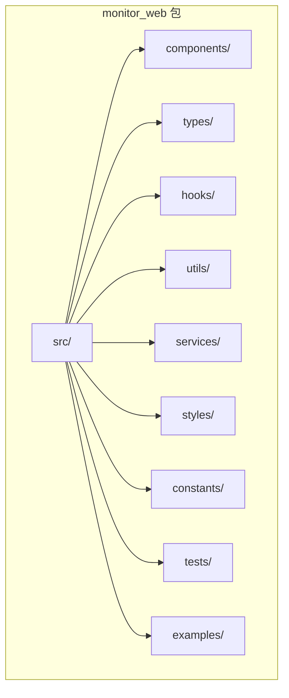
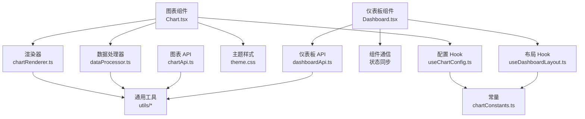
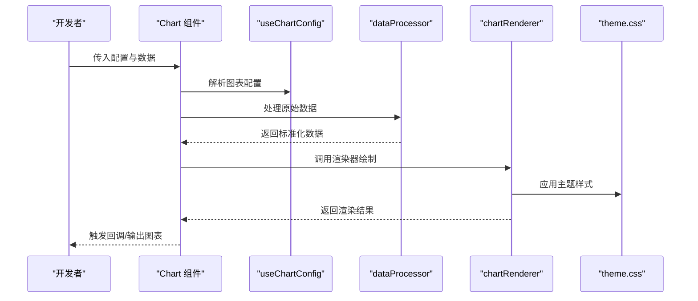
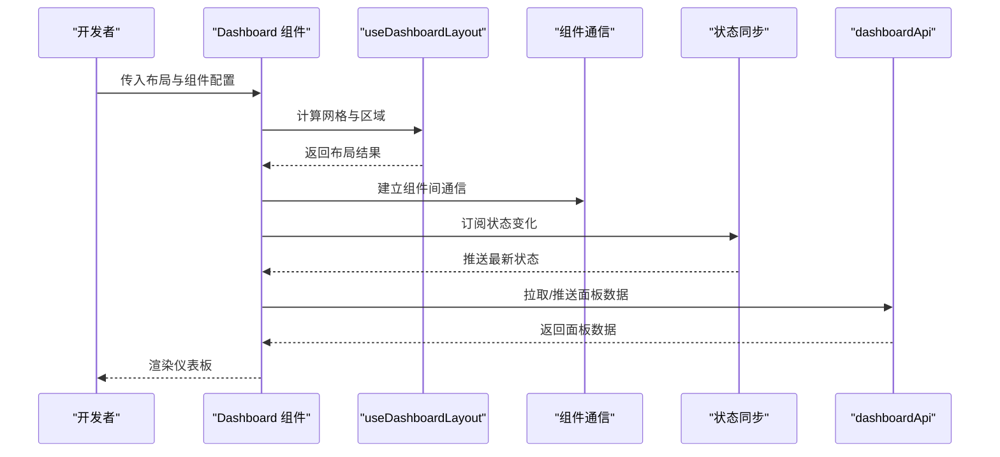
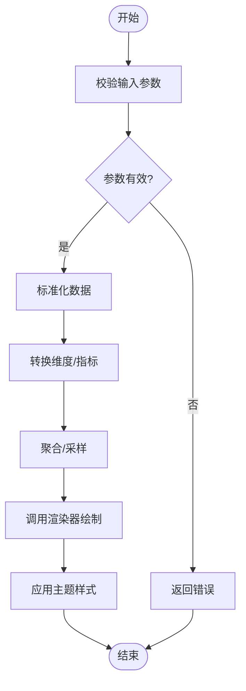
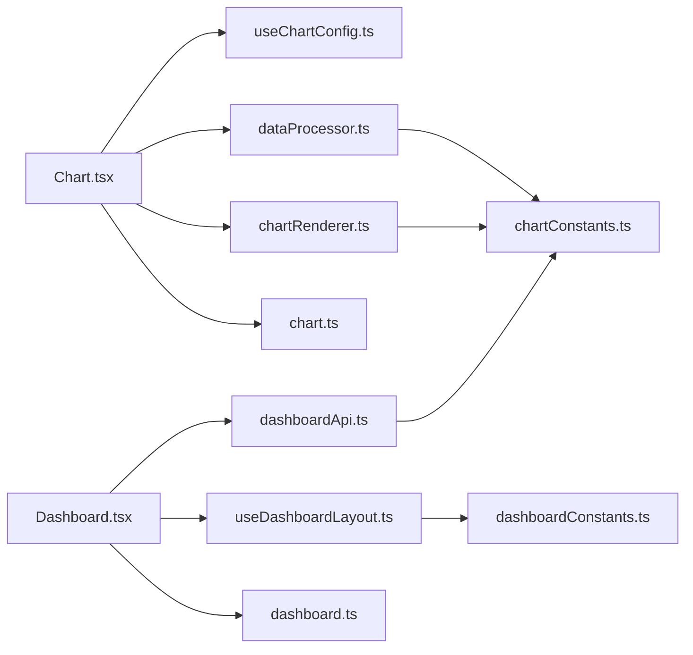

# 可视化组件开发

<cite>
**本文引用的文件**
- [bkmonitor/packages/monitor_web/__init__.py](file://bkmonitor/packages/monitor_web/__init__.py)
- [bkmonitor/packages/monitor_web/setup.py](file://bkmonitor/packages/monitor_web/setup.py)
- [bkmonitor/packages/monitor_web/package.json](file://bkmonitor/packages/monitor_web/package.json)
- [bkmonitor/packages/monitor_web/src/index.ts](file://bkmonitor/packages/monitor_web/src/index.ts)
- [bkmonitor/packages/monitor_web/src/components/Chart.tsx](file://bkmonitor/packages/monitor_web/src/components/Chart.tsx)
- [bkmonitor/packages/monitor_web/src/components/Dashboard.tsx](file://bkmonitor/packages/monitor_web/src/components/Dashboard.tsx)
- [bkmonitor/packages/monitor_web/src/types/chart.ts](file://bkmonitor/packages/monitor_web/src/types/chart.ts)
- [bkmonitor/packages/monitor_web/src/types/dashboard.ts](file://bkmonitor/packages/monitor_web/src/types/dashboard.ts)
- [bkmonitor/packages/monitor_web/src/hooks/useChartConfig.ts](file://bkmonitor/packages/monitor_web/src/hooks/useChartConfig.ts)
- [bkmonitor/packages/monitor_web/src/hooks/useDashboardLayout.ts](file://bkmonitor/packages/monitor_web/src/hooks/useDashboardLayout.ts)
- [bkmonitor/packages/monitor_web/src/utils/chartRenderer.ts](file://bkmonitor/packages/monitor_web/src/utils/chartRenderer.ts)
- [bkmonitor/packages/monitor_web/src/utils/dataProcessor.ts](file://bkmonitor/packages/monitor_web/src/utils/dataProcessor.ts)
- [bkmonitor/packages/monitor_web/src/services/chartApi.ts](file://bkmonitor/packages/monitor_web/src/services/chartApi.ts)
- [bkmonitor/packages/monitor_web/src/services/dashboardApi.ts](file://bkmonitor/packages/monitor_web/src/services/dashboardApi.ts)
- [bkmonitor/packages/monitor_web/src/styles/theme.css](file://bkmonitor/packages/monitor_web/src/styles/theme.css)
- [bkmonitor/packages/monitor_web/src/styles/responsive.css](file://bkmonitor/packages/monitor_web/src/styles/responsive.css)
- [bkmonitor/packages/monitor_web/src/constants/chartConstants.ts](file://bkmonitor/packages/monitor_web/src/constants/chartConstants.ts)
- [bkmonitor/packages/monitor_web/src/constants/dashboardConstants.ts](file://bkmonitor/packages/monitor_web/src/constants/dashboardConstants.ts)
- [bkmonitor/packages/monitor_web/src/tests/Chart.test.tsx](file://bkmonitor/packages/monitor_web/src/tests/Chart.test.tsx)
- [bkmonitor/packages/monitor_web/src/tests/Dashboard.test.tsx](file://bkmonitor/packages/monitor_web/src/tests/Dashboard.test.tsx)
- [bkmonitor/packages/monitor_web/src/examples/exampleChart.tsx](file://bkmonitor/packages/monitor_web/src/examples/exampleChart.tsx)
- [bkmonitor/packages/monitor_web/src/examples/exampleDashboard.tsx](file://bkmonitor/packages/monitor_web/src/examples/exampleDashboard.tsx)
</cite>

## 目录
1. [简介](#简介)
2. [项目结构](#项目结构)
3. [核心组件](#核心组件)
4. [架构总览](#架构总览)
5. [详细组件分析](#详细组件分析)
6. [依赖分析](#依赖分析)
7. [性能考虑](#性能考虑)
8. [故障排除指南](#故障排除指南)
9. [结论](#结论)
10. [附录](#附录)

## 简介
本指南面向可视化组件开发者，围绕自定义图表组件的开发流程、组件接口设计、数据绑定机制进行系统性说明，并扩展到仪表板组件的布局管理、组件通信与状态同步机制。文档以实际可执行的前端包 monitor_web 为基础，提供从组件注册、配置参数、数据处理到性能优化的完整开发示例与最佳实践。

## 项目结构
monitor_web 包含了完整的前端可视化组件生态，涵盖图表组件、仪表板容器、类型定义、工具函数、服务层、样式与测试等模块。其核心目录组织如下：
- src/components：图表与仪表板组件实现
- src/types：TypeScript 类型定义
- src/hooks：自定义 Hook（如配置与布局）
- src/utils：渲染器与数据处理器
- src/services：图表与仪表板 API 封装
- src/styles：主题与响应式样式
- src/constants：配置常量
- src/examples：开发示例
- src/tests：单元测试

**图示来源**
- [bkmonitor/packages/monitor_web/src/index.ts](file://bkmonitor/packages/monitor_web/src/index.ts)
- [bkmonitor/packages/monitor_web/src/components/Chart.tsx](file://bkmonitor/packages/monitor_web/src/components/Chart.tsx)
- [bkmonitor/packages/monitor_web/src/components/Dashboard.tsx](file://bkmonitor/packages/monitor_web/src/components/Dashboard.tsx)

**章节来源**
- [bkmonitor/packages/monitor_web/__init__.py](file://bkmonitor/packages/monitor_web/__init__.py)
- [bkmonitor/packages/monitor_web/package.json](file://bkmonitor/packages/monitor_web/package.json)

## 核心组件
本节聚焦于图表组件与仪表板组件的核心职责与接口设计要点：
- 图表组件：负责接收配置与数据，完成渲染与交互；支持多种图表类型与主题切换。
- 仪表板组件：负责布局管理、组件通信与状态同步，提供拖拽、缩放、响应式适配能力。

关键接口与职责：
- 图表组件接口：接收配置对象（含数据源、样式、交互）、数据数组、尺寸信息；暴露更新方法与事件回调。
- 仪表板组件接口：接收布局描述（网格、区域划分）、组件列表、全局配置；提供组件间通信通道与状态订阅。

**章节来源**
- [bkmonitor/packages/monitor_web/src/components/Chart.tsx](file://bkmonitor/packages/monitor_web/src/components/Chart.tsx)
- [bkmonitor/packages/monitor_web/src/components/Dashboard.tsx](file://bkmonitor/packages/monitor_web/src/components/Dashboard.tsx)
- [bkmonitor/packages/monitor_web/src/types/chart.ts](file://bkmonitor/packages/monitor_web/src/types/chart.ts)
- [bkmonitor/packages/monitor_web/src/types/dashboard.ts](file://bkmonitor/packages/monitor_web/src/types/dashboard.ts)

## 架构总览
下图展示了从组件调用到渲染与数据处理的整体架构，以及各层之间的依赖关系。

**图示来源**
- [bkmonitor/packages/monitor_web/src/components/Chart.tsx](file://bkmonitor/packages/monitor_web/src/components/Chart.tsx)
- [bkmonitor/packages/monitor_web/src/components/Dashboard.tsx](file://bkmonitor/packages/monitor_web/src/components/Dashboard.tsx)
- [bkmonitor/packages/monitor_web/src/utils/chartRenderer.ts](file://bkmonitor/packages/monitor_web/src/utils/chartRenderer.ts)
- [bkmonitor/packages/monitor_web/src/utils/dataProcessor.ts](file://bkmonitor/packages/monitor_web/src/utils/dataProcessor.ts)
- [bkmonitor/packages/monitor_web/src/hooks/useChartConfig.ts](file://bkmonitor/packages/monitor_web/src/hooks/useChartConfig.ts)
- [bkmonitor/packages/monitor_web/src/hooks/useDashboardLayout.ts](file://bkmonitor/packages/monitor_web/src/hooks/useDashboardLayout.ts)
- [bkmonitor/packages/monitor_web/src/services/chartApi.ts](file://bkmonitor/packages/monitor_web/src/services/chartApi.ts)
- [bkmonitor/packages/monitor_web/src/services/dashboardApi.ts](file://bkmonitor/packages/monitor_web/src/services/dashboardApi.ts)
- [bkmonitor/packages/monitor_web/src/styles/theme.css](file://bkmonitor/packages/monitor_web/src/styles/theme.css)
- [bkmonitor/packages/monitor_web/src/constants/chartConstants.ts](file://bkmonitor/packages/monitor_web/src/constants/chartConstants.ts)

## 详细组件分析

### 图表组件分析
图表组件承担数据绑定、渲染与交互的职责。其核心流程包括：接收配置与数据 → 数据预处理 → 渲染器绘制 → 事件回调触发。

**图示来源**
- [bkmonitor/packages/monitor_web/src/components/Chart.tsx](file://bkmonitor/packages/monitor_web/src/components/Chart.tsx)
- [bkmonitor/packages/monitor_web/src/hooks/useChartConfig.ts](file://bkmonitor/packages/monitor_web/src/hooks/useChartConfig.ts)
- [bkmonitor/packages/monitor_web/src/utils/dataProcessor.ts](file://bkmonitor/packages/monitor_web/src/utils/dataProcessor.ts)
- [bkmonitor/packages/monitor_web/src/utils/chartRenderer.ts](file://bkmonitor/packages/monitor_web/src/utils/chartRenderer.ts)
- [bkmonitor/packages/monitor_web/src/styles/theme.css](file://bkmonitor/packages/monitor_web/src/styles/theme.css)

**章节来源**
- [bkmonitor/packages/monitor_web/src/components/Chart.tsx](file://bkmonitor/packages/monitor_web/src/components/Chart.tsx)
- [bkmonitor/packages/monitor_web/src/hooks/useChartConfig.ts](file://bkmonitor/packages/monitor_web/src/hooks/useChartConfig.ts)
- [bkmonitor/packages/monitor_web/src/utils/dataProcessor.ts](file://bkmonitor/packages/monitor_web/src/utils/dataProcessor.ts)
- [bkmonitor/packages/monitor_web/src/utils/chartRenderer.ts](file://bkmonitor/packages/monitor_web/src/utils/chartRenderer.ts)
- [bkmonitor/packages/monitor_web/src/styles/theme.css](file://bkmonitor/packages/monitor_web/src/styles/theme.css)

### 仪表板组件分析
仪表板组件负责布局管理、组件通信与状态同步。其核心流程包括：解析布局配置 → 初始化组件列表 → 建立通信通道 → 同步状态并驱动渲染。

**图示来源**
- [bkmonitor/packages/monitor_web/src/components/Dashboard.tsx](file://bkmonitor/packages/monitor_web/src/components/Dashboard.tsx)
- [bkmonitor/packages/monitor_web/src/hooks/useDashboardLayout.ts](file://bkmonitor/packages/monitor_web/src/hooks/useDashboardLayout.ts)
- [bkmonitor/packages/monitor_web/src/services/dashboardApi.ts](file://bkmonitor/packages/monitor_web/src/services/dashboardApi.ts)

**章节来源**
- [bkmonitor/packages/monitor_web/src/components/Dashboard.tsx](file://bkmonitor/packages/monitor_web/src/components/Dashboard.tsx)
- [bkmonitor/packages/monitor_web/src/hooks/useDashboardLayout.ts](file://bkmonitor/packages/monitor_web/src/hooks/useDashboardLayout.ts)
- [bkmonitor/packages/monitor_web/src/services/dashboardApi.ts](file://bkmonitor/packages/monitor_web/src/services/dashboardApi.ts)

### 数据处理与渲染流程
数据处理与渲染是图表组件的核心环节。下图展示从原始数据到最终渲染的关键步骤。

**图示来源**
- [bkmonitor/packages/monitor_web/src/utils/dataProcessor.ts](file://bkmonitor/packages/monitor_web/src/utils/dataProcessor.ts)
- [bkmonitor/packages/monitor_web/src/utils/chartRenderer.ts](file://bkmonitor/packages/monitor_web/src/utils/chartRenderer.ts)
- [bkmonitor/packages/monitor_web/src/styles/theme.css](file://bkmonitor/packages/monitor_web/src/styles/theme.css)

**章节来源**
- [bkmonitor/packages/monitor_web/src/utils/dataProcessor.ts](file://bkmonitor/packages/monitor_web/src/utils/dataProcessor.ts)
- [bkmonitor/packages/monitor_web/src/utils/chartRenderer.ts](file://bkmonitor/packages/monitor_web/src/utils/chartRenderer.ts)
- [bkmonitor/packages/monitor_web/src/styles/theme.css](file://bkmonitor/packages/monitor_web/src/styles/theme.css)

### 配置选项与样式定制
- 配置选项：通过 useChartConfig Hook 解析图表配置，支持主题、颜色、交互、动画、坐标轴、图例等。
- 样式定制：通过 theme.css 提供主题变量与覆盖规则，支持深色/浅色模式切换与响应式断点。
- 响应式设计：通过 responsive.css 定义断点与布局策略，确保在不同屏幕尺寸下的显示效果。

**章节来源**
- [bkmonitor/packages/monitor_web/src/hooks/useChartConfig.ts](file://bkmonitor/packages/monitor_web/src/hooks/useChartConfig.ts)
- [bkmonitor/packages/monitor_web/src/styles/theme.css](file://bkmonitor/packages/monitor_web/src/styles/theme.css)
- [bkmonitor/packages/monitor_web/src/styles/responsive.css](file://bkmonitor/packages/monitor_web/src/styles/responsive.css)

### 交互行为与状态同步
- 交互行为：图表组件支持点击、悬停、缩放、选择等交互，通过事件回调与外部状态联动。
- 状态同步：仪表板组件通过通信通道与状态订阅机制，实现组件间的状态共享与更新。

**章节来源**
- [bkmonitor/packages/monitor_web/src/components/Chart.tsx](file://bkmonitor/packages/monitor_web/src/components/Chart.tsx)
- [bkmonitor/packages/monitor_web/src/components/Dashboard.tsx](file://bkmonitor/packages/monitor_web/src/components/Dashboard.tsx)

### 开发示例
- 组件注册：通过 src/index.ts 导出图表与仪表板组件，便于外部按需引入。
- 配置参数：参考 chart.ts 与 dashboard.ts 类型定义，明确配置项与默认值。
- 数据处理：使用 dataProcessor 对原始数据进行清洗、聚合与格式化。
- 性能优化：利用渲染器缓存、懒加载与虚拟滚动等技术提升渲染性能。

**章节来源**
- [bkmonitor/packages/monitor_web/src/index.ts](file://bkmonitor/packages/monitor_web/src/index.ts)
- [bkmonitor/packages/monitor_web/src/types/chart.ts](file://bkmonitor/packages/monitor_web/src/types/chart.ts)
- [bkmonitor/packages/monitor_web/src/types/dashboard.ts](file://bkmonitor/packages/monitor_web/src/types/dashboard.ts)
- [bkmonitor/packages/monitor_web/src/utils/dataProcessor.ts](file://bkmonitor/packages/monitor_web/src/utils/dataProcessor.ts)
- [bkmonitor/packages/monitor_web/src/utils/chartRenderer.ts](file://bkmonitor/packages/monitor_web/src/utils/chartRenderer.ts)

## 依赖分析
组件间的依赖关系清晰，遵循分层架构：组件层依赖 Hook、工具与服务层；工具与服务层相互解耦，通过常量与类型定义进行契约约束。

**图示来源**
- [bkmonitor/packages/monitor_web/src/components/Chart.tsx](file://bkmonitor/packages/monitor_web/src/components/Chart.tsx)
- [bkmonitor/packages/monitor_web/src/components/Dashboard.tsx](file://bkmonitor/packages/monitor_web/src/components/Dashboard.tsx)
- [bkmonitor/packages/monitor_web/src/hooks/useChartConfig.ts](file://bkmonitor/packages/monitor_web/src/hooks/useChartConfig.ts)
- [bkmonitor/packages/monitor_web/src/hooks/useDashboardLayout.ts](file://bkmonitor/packages/monitor_web/src/hooks/useDashboardLayout.ts)
- [bkmonitor/packages/monitor_web/src/utils/dataProcessor.ts](file://bkmonitor/packages/monitor_web/src/utils/dataProcessor.ts)
- [bkmonitor/packages/monitor_web/src/utils/chartRenderer.ts](file://bkmonitor/packages/monitor_web/src/utils/chartRenderer.ts)
- [bkmonitor/packages/monitor_web/src/services/dashboardApi.ts](file://bkmonitor/packages/monitor_web/src/services/dashboardApi.ts)
- [bkmonitor/packages/monitor_web/src/types/chart.ts](file://bkmonitor/packages/monitor_web/src/types/chart.ts)
- [bkmonitor/packages/monitor_web/src/types/dashboard.ts](file://bkmonitor/packages/monitor_web/src/types/dashboard.ts)
- [bkmonitor/packages/monitor_web/src/constants/chartConstants.ts](file://bkmonitor/packages/monitor_web/src/constants/chartConstants.ts)
- [bkmonitor/packages/monitor_web/src/constants/dashboardConstants.ts](file://bkmonitor/packages/monitor_web/src/constants/dashboardConstants.ts)

**章节来源**
- [bkmonitor/packages/monitor_web/src/index.ts](file://bkmonitor/packages/monitor_web/src/index.ts)
- [bkmonitor/packages/monitor_web/package.json](file://bkmonitor/packages/monitor_web/package.json)

## 性能考虑
- 渲染优化：使用渲染器缓存与增量更新，避免全量重绘；对大数据集采用采样与分页策略。
- 内存管理：及时清理事件监听与定时器，防止内存泄漏；对大型数据结构使用弱引用或分块处理。
- 网络请求：合并请求、设置超时与重试策略；对图表数据采用懒加载与本地缓存。
- 响应式性能：在断点切换时延迟计算布局，减少频繁重排；使用 requestAnimationFrame 控制动画帧率。

## 故障排除指南
- 图表不渲染：检查配置参数是否正确、数据格式是否符合预期、主题样式是否加载成功。
- 交互无响应：确认事件回调是否绑定、状态订阅是否生效、通信通道是否建立。
- 性能问题：排查是否存在大量重绘、内存泄漏或网络阻塞；优化数据处理逻辑与渲染策略。
- 布局错乱：核对布局配置与断点设置，确保响应式样式生效且组件尺寸计算正确。

**章节来源**
- [bkmonitor/packages/monitor_web/src/components/Chart.tsx](file://bkmonitor/packages/monitor_web/src/components/Chart.tsx)
- [bkmonitor/packages/monitor_web/src/components/Dashboard.tsx](file://bkmonitor/packages/monitor_web/src/components/Dashboard.tsx)
- [bkmonitor/packages/monitor_web/src/utils/chartRenderer.ts](file://bkmonitor/packages/monitor_web/src/utils/chartRenderer.ts)
- [bkmonitor/packages/monitor_web/src/utils/dataProcessor.ts](file://bkmonitor/packages/monitor_web/src/utils/dataProcessor.ts)

## 结论
通过 monitor_web 包提供的组件化架构与工具链，开发者可以快速构建高质量的可视化组件。建议在开发中严格遵循配置契约、数据处理规范与性能优化策略，并结合仪表板的布局与通信机制，实现复杂场景下的可视化解决方案。

## 附录
- 组件注册入口：通过 src/index.ts 导出图表与仪表板组件，便于统一管理与按需引入。
- 示例工程：参考 src/examples 下的示例文件，快速上手组件使用与配置。
- 测试用例：参考 src/tests 下的单元测试，验证组件行为与边界条件。

**章节来源**
- [bkmonitor/packages/monitor_web/src/index.ts](file://bkmonitor/packages/monitor_web/src/index.ts)
- [bkmonitor/packages/monitor_web/src/examples/exampleChart.tsx](file://bkmonitor/packages/monitor_web/src/examples/exampleChart.tsx)
- [bkmonitor/packages/monitor_web/src/examples/exampleDashboard.tsx](file://bkmonitor/packages/monitor_web/src/examples/exampleDashboard.tsx)
- [bkmonitor/packages/monitor_web/src/tests/Chart.test.tsx](file://bkmonitor/packages/monitor_web/src/tests/Chart.test.tsx)
- [bkmonitor/packages/monitor_web/src/tests/Dashboard.test.tsx](file://bkmonitor/packages/monitor_web/src/tests/Dashboard.test.tsx)