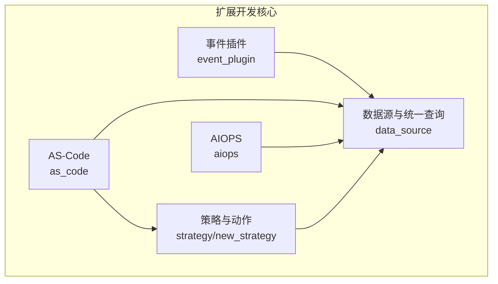
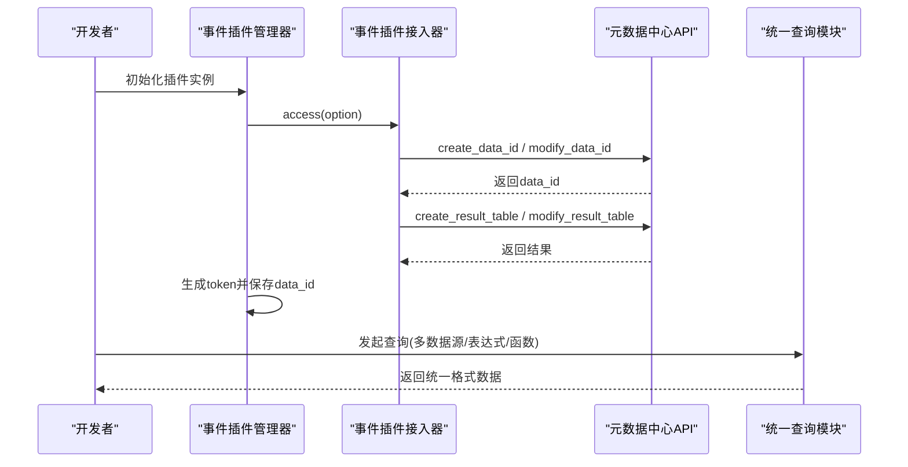
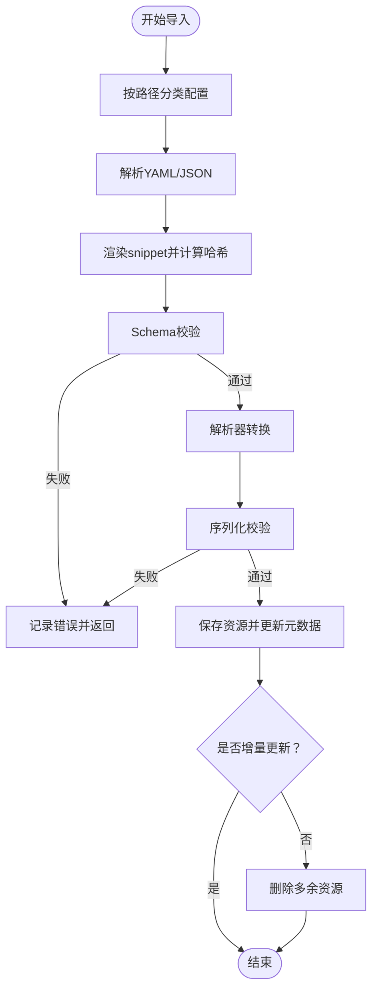
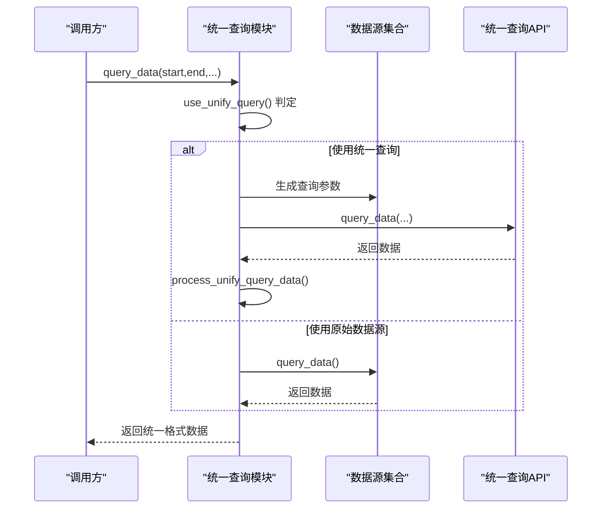
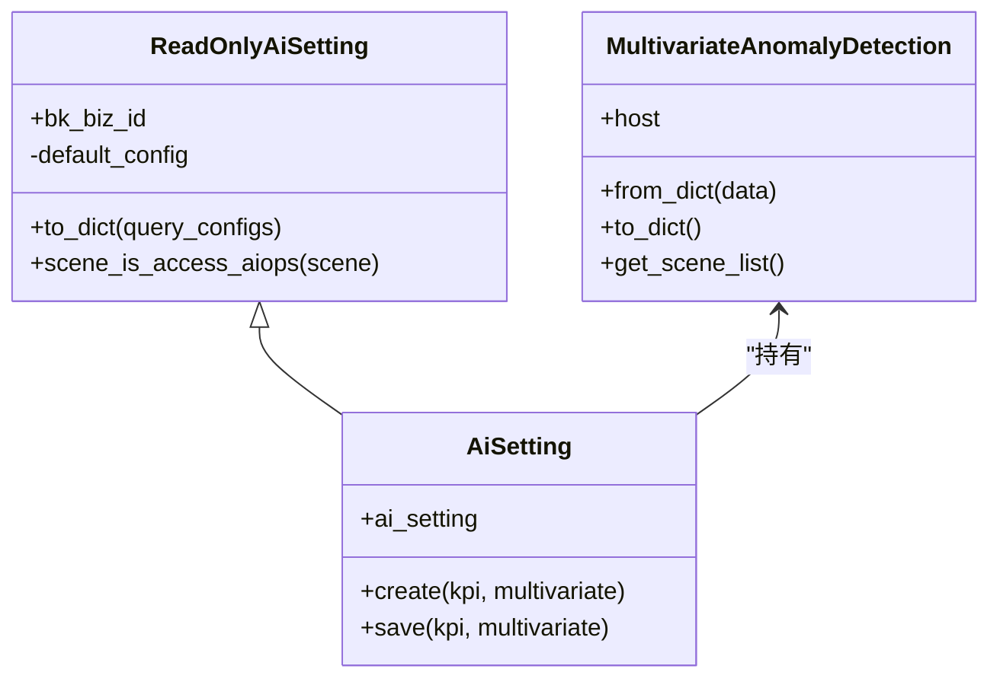
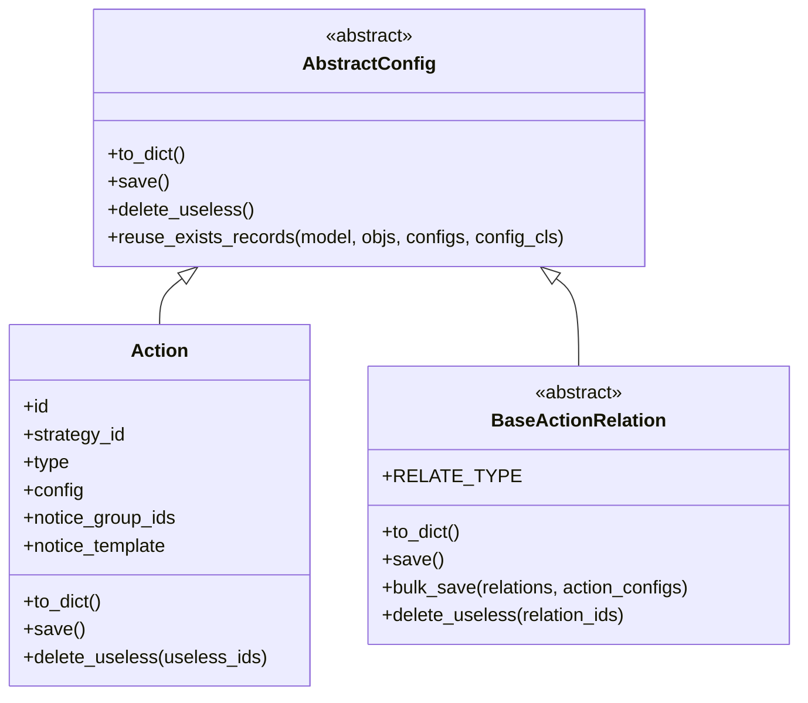
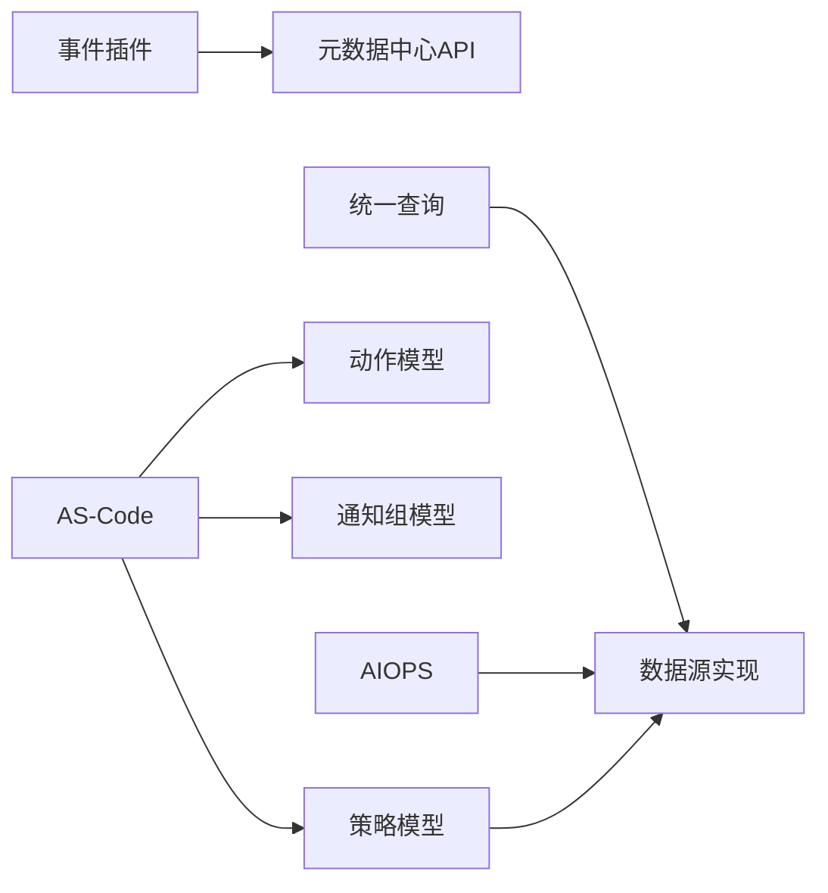

# 扩展开发指南

<cite>
**本文引用的文件**
- [bkmonitor\bkmonitor\event_plugin\__init__.py](file://bkmonitor\bkmonitor\event_plugin\__init__.py)
- [bkmonitor\bkmonitor\event_plugin\accessor.py](file://bkmonitor\bkmonitor\event_plugin\accessor.py)
- [bkmonitor\bkmonitor\event_plugin\constant.py](file://bkmonitor\bkmonitor\event_plugin\constant.py)
- [bkmonitor\bkmonitor\event_plugin\serializers.py](file://bkmonitor\bkmonitor\event_plugin\serializers.py)
- [bkmonitor\bkmonitor\event_plugin\manager\base.py](file://bkmonitor\bkmonitor\event_plugin\manager\base.py)
- [bkmonitor\bkmonitor\as_code\parse.py](file://bkmonitor\bkmonitor\as_code\parse.py)
- [bkmonitor\bkmonitor\data_source\unify_query\query.py](file://bkmonitor\bkmonitor\data_source\unify_query\query.py)
- [bkmonitor\bkmonitor\aiops\utils.py](file://bkmonitor\bkmonitor\aiops\utils.py)
- [bkmonitor\bkmonitor\strategy\new_strategy.py](file://bkmonitor\bkmonitor\strategy\new_strategy.py)
- [bkmonitor\bkmonitor\models\__init__.py](file://bkmonitor\bkmonitor\models\__init__.py)
- [bkmonitor\bkmonitor\data_source\__init__.py](file://bkmonitor\bkmonitor\data_source\__init__.py)
</cite>

## 目录
1. [简介](#简介)
2. [项目结构](#项目结构)
3. [核心组件](#核心组件)
4. [架构总览](#架构总览)
5. [详细组件分析](#详细组件分析)
6. [依赖分析](#依赖分析)
7. [性能考虑](#性能考虑)
8. [故障排查指南](#故障排查指南)
9. [结论](#结论)
10. [附录](#附录)

## 简介
本指南面向扩展开发者，系统化阐述如何在监控平台中进行扩展开发，包括但不限于：
- 插件开发规范与事件插件系统
- 自定义数据源实现与统一查询模块
- AS-Code 配置导入与治理
- AIOPS 集成与第三方服务对接
- 扩展点识别、接口设计、兼容性与性能优化最佳实践
- 完整开发示例与调试技巧

## 项目结构
围绕扩展开发的关键目录与模块如下：
- 事件插件体系：事件插件注册、序列化、接入器与管理器
- AS-Code 配置：规则、通知、动作、仪表盘等配置导入与校验
- 数据源与统一查询：多数据源抽象、统一查询封装与性能观测
- AIOPS 集成：异常检测、维度下钻、指标推荐等能力的配置与开关
- 策略与动作：策略模型、动作与通知关系的持久化与转换



**图表来源**
- [bkmonitor\bkmonitor\event_plugin\__init__.py:20-59](file://bkmonitor\bkmonitor\event_plugin\__init__.py#L20-L59)
- [bkmonitor\bkmonitor\as_code\parse.py:524-738](file://bkmonitor\bkmonitor\as_code\parse.py#L524-L738)
- [bkmonitor\bkmonitor\data_source\unify_query\query.py:48-332](file://bkmonitor\bkmonitor\data_source\unify_query\query.py#L48-L332)
- [bkmonitor\bkmonitor\aiops\utils.py:117-251](file://bkmonitor\bkmonitor\aiops\utils.py#L117-L251)
- [bkmonitor\bkmonitor\strategy\new_strategy.py:114-270](file://bkmonitor\bkmonitor\strategy\new_strategy.py#L114-L270)

**章节来源**
- [bkmonitor\bkmonitor\event_plugin\__init__.py:20-59](file://bkmonitor\bkmonitor\event_plugin\__init__.py#L20-L59)
- [bkmonitor\bkmonitor\as_code\parse.py:524-738](file://bkmonitor\bkmonitor\as_code\parse.py#L524-L738)
- [bkmonitor\bkmonitor\data_source\unify_query\query.py:48-332](file://bkmonitor\bkmonitor\data_source\unify_query\query.py#L48-L332)
- [bkmonitor\bkmonitor\aiops\utils.py:117-251](file://bkmonitor\bkmonitor\aiops\utils.py#L117-L251)
- [bkmonitor\bkmonitor\strategy\new_strategy.py:114-270](file://bkmonitor\bkmonitor\strategy\new_strategy.py#L114-L270)

## 核心组件
- 事件插件系统：提供插件类型注册、序列化、接入元数据与启停控制
- AS-Code 导入：将 YAML/JSON 配置转换为策略、通知、动作、值班与仪表盘等资源
- 统一查询模块：封装多数据源查询、表达式与函数、可观测指标上报
- AIOPS 配置：单/多指标异常检测、维度下钻、指标推荐的配置与可用性判断
- 策略与动作：策略模型、动作与通知关系的持久化与转换

**章节来源**
- [bkmonitor\bkmonitor\event_plugin\serializers.py:67-241](file://bkmonitor\bkmonitor\event_plugin\serializers.py#L67-L241)
- [bkmonitor\bkmonitor\as_code\parse.py:524-738](file://bkmonitor\bkmonitor\as_code\parse.py#L524-L738)
- [bkmonitor\bkmonitor\data_source\unify_query\query.py:48-332](file://bkmonitor\bkmonitor\data_source\unify_query\query.py#L48-L332)
- [bkmonitor\bkmonitor\aiops\utils.py:117-251](file://bkmonitor\bkmonitor\aiops\utils.py#L117-L251)
- [bkmonitor\bkmonitor\strategy\new_strategy.py:114-270](file://bkmonitor\bkmonitor\strategy\new_strategy.py#L114-L270)

## 架构总览
事件插件接入元数据链路与统一查询模块的关系如下：



**图表来源**
- [bkmonitor\bkmonitor\event_plugin\manager\base.py:65-87](file://bkmonitor\bkmonitor\event_plugin\manager\base.py#L65-L87)
- [bkmonitor\bkmonitor\event_plugin\accessor.py:24-127](file://bkmonitor\bkmonitor\event_plugin\accessor.py#L24-L127)
- [bkmonitor\bkmonitor\data_source\unify_query\query.py:387-425](file://bkmonitor\bkmonitor\data_source\unify_query\query.py#L387-L425)

## 详细组件分析

### 事件插件系统
事件插件系统由“注册-序列化-接入-管理”四部分组成，支持 HTTP-Pull 与 HTTP-Push 两种采集类型。

- 注册与路由
  - 通过注册表将插件类型映射到管理器类，便于按类型选择具体实现
  - 提供序列化器工厂，按类型返回对应序列化器

- 序列化与配置
  - 插件基础序列化器负责参数渲染、字段清洗规则翻译与接入配置渲染
  - 支持告警规则、清洗规则、参数Schema等结构化配置

- 接入器
  - 幂等接入元数据：创建/更新 data_id 与结果表（RT）
  - 自动生成 data_name 与 data_id，支持启停切换

- 管理器
  - 将实例配置转换为数据源选项
  - 调用接入器完成接入，必要时生成 token 并保存

```mermaid
classDiagram
class BaseEventPluginManager {
+plugin_inst
+accessor
+get_serializer_class()
+get_datasource_option()
+access()
+switch(is_enabled)
}
class EventPluginInstAccessor {
+plugin_inst
+access(option)
+switch_dataid(is_enabled)
+create_or_update_dataid(option)
+create_or_update_rt(data_id)
+data_name
+get_data_id()
}
class EventPluginSerializer {
+to_internal_value(data)
+create(validated_data)
+update(instance, validated_data)
+render_ingest_config(data)
+translate_normalization_config(data)
}
BaseEventPluginManager --> EventPluginInstAccessor : "使用"
EventPluginInstAccessor --> "元数据中心API" : "调用"
BaseEventPluginManager --> EventPluginSerializer : "序列化"
```

**图表来源**
- [bkmonitor\bkmonitor\event_plugin\manager\base.py:25-87](file://bkmonitor\bkmonitor\event_plugin\manager\base.py#L25-L87)
- [bkmonitor\bkmonitor\event_plugin\accessor.py:20-127](file://bkmonitor\bkmonitor\event_plugin\accessor.py#L20-L127)
- [bkmonitor\bkmonitor\event_plugin\serializers.py:67-241](file://bkmonitor\bkmonitor\event_plugin\serializers.py#L67-L241)

**章节来源**
- [bkmonitor\bkmonitor\event_plugin\__init__.py:20-59](file://bkmonitor\bkmonitor\event_plugin\__init__.py#L20-L59)
- [bkmonitor\bkmonitor\event_plugin\serializers.py:67-241](file://bkmonitor\bkmonitor\event_plugin\serializers.py#L67-L241)
- [bkmonitor\bkmonitor\event_plugin\accessor.py:20-127](file://bkmonitor\bkmonitor\event_plugin\accessor.py#L20-L127)
- [bkmonitor\bkmonitor\event_plugin\manager\base.py:25-87](file://bkmonitor\bkmonitor\event_plugin\manager\base.py#L25-L87)
- [bkmonitor\bkmonitor\event_plugin\constant.py:14-91](file://bkmonitor\bkmonitor\event_plugin\constant.py#L14-L91)

### AS-Code 配置导入
AS-Code 将 YAML/JSON 配置转换为策略、通知、动作、值班与仪表盘等资源，支持片段合并、哈希校验与增量更新。

- 配置分类与加载
  - 规则、通知、动作、值班、仪表盘等按路径前缀分类
  - 支持 snippet 片段合并与哈希计算

- 校验与转换
  - Schema 校验、解析器转换、序列化校验
  - 计算哈希并与数据库记录对比，仅变更项写入

- 写入与清理
  - 保存资源并更新路径、哈希、片段
  - 非增量模式下清理多余资源



**图表来源**
- [bkmonitor\bkmonitor\as_code\parse.py:524-738](file://bkmonitor\bkmonitor\as_code\parse.py#L524-L738)

**章节来源**
- [bkmonitor\bkmonitor\as_code\parse.py:57-133](file://bkmonitor\bkmonitor\as_code\parse.py#L57-L133)
- [bkmonitor\bkmonitor\as_code\parse.py:135-204](file://bkmonitor\bkmonitor\as_code\parse.py#L135-L204)
- [bkmonitor\bkmonitor\as_code\parse.py:206-308](file://bkmonitor\bkmonitor\as_code\parse.py#L206-L308)
- [bkmonitor\bkmonitor\as_code\parse.py:311-376](file://bkmonitor\bkmonitor\as_code\parse.py#L311-L376)
- [bkmonitor\bkmonitor\as_code\parse.py:378-451](file://bkmonitor\bkmonitor\as_code\parse.py#L378-L451)
- [bkmonitor\bkmonitor\as_code\parse.py:454-512](file://bkmonitor\bkmonitor\as_code\parse.py#L454-L512)
- [bkmonitor\bkmonitor\as_code\parse.py:524-738](file://bkmonitor\bkmonitor\as_code\parse.py#L524-L738)

### 自定义数据源与统一查询
统一查询模块封装多数据源查询、表达式与函数、可观测指标上报与性能统计。

- 数据源抽象
  - DataSource 与 TimeSeriesDataSource 抽象，支持多数据源组合查询
  - 支持表达式函数、维度提取、时间对齐与采样

- 查询路径选择
  - 根据数据源类型、表达式、函数、灰度开关等决定使用统一查询还是原始数据源
  - 对日志与事件数据提供专门处理流程

- 性能观测
  - 通过 OpenTelemetry 与 Prometheus 指标上报查询耗时与计数
  - 标签包含数据源标签、数据类型、角色与结果表等



**图表来源**
- [bkmonitor\bkmonitor\data_source\unify_query\query.py:584-627](file://bkmonitor\bkmonitor\data_source\unify_query\query.py#L584-L627)
- [bkmonitor\bkmonitor\data_source\unify_query\query.py:387-425](file://bkmonitor\bkmonitor\data_source\unify_query\query.py#L387-L425)
- [bkmonitor\bkmonitor\data_source\unify_query\query.py:496-533](file://bkmonitor\bkmonitor\data_source\unify_query\query.py#L496-L533)

**章节来源**
- [bkmonitor\bkmonitor\data_source\unify_query\query.py:48-332](file://bkmonitor\bkmonitor\data_source\unify_query\query.py#L48-L332)
- [bkmonitor\bkmonitor\data_source\unify_query\query.py:387-425](file://bkmonitor\bkmonitor\data_source\unify_query\query.py#L387-L425)
- [bkmonitor\bkmonitor\data_source\unify_query\query.py:496-533](file://bkmonitor\bkmonitor\data_source\unify_query\query.py#L496-L533)
- [bkmonitor\bkmonitor\data_source\unify_query\query.py:559-627](file://bkmonitor\bkmonitor\data_source\unify_query\query.py#L559-L627)
- [bkmonitor\bkmonitor\data_source\unify_query\query.py:628-729](file://bkmonitor\bkmonitor\data_source\unify_query\query.py#L628-L729)
- [bkmonitor\bkmonitor\data_source\unify_query\query.py:731-779](file://bkmonitor\bkmonitor\data_source\unify_query\query.py#L731-L779)
- [bkmonitor\bkmonitor\data_source\unify_query\query.py:781-800](file://bkmonitor\bkmonitor\data_source\unify_query\query.py#L781-L800)

### AIOPS 集成与第三方服务对接
AIOPS 提供单/多指标异常检测、维度下钻、指标推荐等能力，支持配置读取与可用性判断。

- 配置模型
  - KpiAnomalyConfig、MultivariateAnomalyDetection、DimensionDrill、MetricRecommend 等配置类
  - ReadOnlyAiSetting 与 AiSetting 提供只读与可写配置访问

- 可用性判断
  - 根据数据源类型、数据类型与灰度状态判断场景是否可用
  - 提供错误消息与不支持原因

- 第三方服务对接
  - 通过配置项与接入状态标志位对接外部智能检测服务
  - 支持 SDK 开关与计划 ID 等参数



**图表来源**
- [bkmonitor\bkmonitor\aiops\utils.py:117-251](file://bkmonitor\bkmonitor\aiops\utils.py#L117-L251)

**章节来源**
- [bkmonitor\bkmonitor\aiops\utils.py:37-98](file://bkmonitor\bkmonitor\aiops\utils.py#L37-L98)
- [bkmonitor\bkmonitor\aiops\utils.py:117-251](file://bkmonitor\bkmonitor\aiops\utils.py#L117-L251)

### 策略与动作扩展
策略与动作模块提供策略模型、动作与通知关系的持久化与转换，支持多种数据源与序列化器。

- 指标 ID 生成与解析
  - 根据数据源与数据类型生成/解析指标 ID
  - 支持多种数据源标签与场景

- 抽象配置与保存
  - 抽象配置类提供 to_dict/save/delete_useless 等通用能力
  - 动作与通知关系类支持批量保存与更新



**图表来源**
- [bkmonitor\bkmonitor\strategy\new_strategy.py:286-339](file://bkmonitor\bkmonitor\strategy\new_strategy.py#L286-L339)
- [bkmonitor\bkmonitor\strategy\new_strategy.py:340-475](file://bkmonitor\bkmonitor\strategy\new_strategy.py#L340-L475)
- [bkmonitor\bkmonitor\strategy\new_strategy.py:477-716](file://bkmonitor\bkmonitor\strategy\new_strategy.py#L477-L716)

**章节来源**
- [bkmonitor\bkmonitor\strategy\new_strategy.py:114-270](file://bkmonitor\bkmonitor\strategy\new_strategy.py#L114-L270)
- [bkmonitor\bkmonitor\strategy\new_strategy.py:286-339](file://bkmonitor\bkmonitor\strategy\new_strategy.py#L286-L339)
- [bkmonitor\bkmonitor\strategy\new_strategy.py:340-475](file://bkmonitor\bkmonitor\strategy\new_strategy.py#L340-L475)
- [bkmonitor\bkmonitor\strategy\new_strategy.py:477-716](file://bkmonitor\bkmonitor\strategy\new_strategy.py#L477-L716)

## 依赖分析
- 事件插件依赖元数据中心 API 完成 data_id 与 RT 的创建/更新
- AS-Code 导入依赖策略、动作、通知、值班等模型与序列化器
- 统一查询模块依赖多数据源实现与外部查询 API
- AIOPS 配置依赖数据源标签与接入状态枚举
- 策略与动作模块依赖数据源加载与序列化器



**图表来源**
- [bkmonitor\bkmonitor\event_plugin\accessor.py:32-104](file://bkmonitor\bkmonitor\event_plugin\accessor.py#L32-L104)
- [bkmonitor\bkmonitor\as_code\parse.py:40-49](file://bkmonitor\bkmonitor\as_code\parse.py#L40-L49)
- [bkmonitor\bkmonitor\data_source\unify_query\query.py:25-42](file://bkmonitor\bkmonitor\data_source\unify_query\query.py#L25-L42)
- [bkmonitor\bkmonitor\aiops\utils.py:18-28](file://bkmonitor\bkmonitor\aiops\utils.py#L18-L28)
- [bkmonitor\bkmonitor\strategy\new_strategy.py:43-59](file://bkmonitor\bkmonitor\strategy\new_strategy.py#L43-L59)

**章节来源**
- [bkmonitor\bkmonitor\models\__init__.py:11-36](file://bkmonitor\bkmonitor\models\__init__.py#L11-L36)
- [bkmonitor\bkmonitor\data_source\__init__.py:11-15](file://bkmonitor\bkmonitor\data_source\__init__.py#L11-L15)

## 性能考虑
- 统一查询模块
  - 使用时间对齐与步长对齐减少冗余数据
  - 通过灰度开关与表达式/函数使用判断选择最优查询路径
  - 采用线程池并发查询日志多数据源场景
- 指标观测
  - 通过 Prometheus 指标上报查询耗时与计数，标签包含数据源与结果表
- 缓存与幂等
  - 事件插件接入器幂等创建/更新 data_id 与 RT，避免重复开销

**章节来源**
- [bkmonitor\bkmonitor\data_source\unify_query\query.py:128-133](file://bkmonitor\bkmonitor\data_source\unify_query\query.py#L128-L133)
- [bkmonitor\bkmonitor\data_source\unify_query\query.py:377-386](file://bkmonitor\bkmonitor\data_source\unify_query\query.py#L377-L386)
- [bkmonitor\bkmonitor\data_source\unify_query\query.py:553-557](file://bkmonitor\bkmonitor\data_source\unify_query\query.py#L553-L557)
- [bkmonitor\bkmonitor\data_source\unify_query\query.py:590-601](file://bkmonitor\bkmonitor\data_source\unify_query\query.py#L590-L601)
- [bkmonitor\bkmonitor\event_plugin\accessor.py:24-31](file://bkmonitor\bkmonitor\event_plugin\accessor.py#L24-L31)

## 故障排查指南
- 事件插件接入失败
  - 检查 data_name 与 data_id 是否存在，确认元数据中心 API 返回
  - 核对 normalization_config 与 ingest_config 是否正确渲染
- AS-Code 导入错误
  - 查看错误记录字典，定位 schema/解析/校验阶段的异常
  - 确认 snippet 合并与哈希是否一致
- 统一查询异常
  - 检查 use_unify_query 判定条件与灰度开关
  - 关注指标观测标签，定位具体数据源与结果表
- AIOPS 不可用
  - 校验数据源标签与数据类型是否满足场景要求
  - 检查接入状态与 SDK 开关

**章节来源**
- [bkmonitor\bkmonitor\event_plugin\accessor.py:117-127](file://bkmonitor\bkmonitor\event_plugin\accessor.py#L117-L127)
- [bkmonitor\bkmonitor\as_code\parse.py:514-522](file://bkmonitor\bkmonitor\as_code\parse.py#L514-L522)
- [bkmonitor\bkmonitor\aiops\utils.py:186-194](file://bkmonitor\bkmonitor\aiops\utils.py#L186-L194)

## 结论
通过事件插件系统、AS-Code 配置、统一查询模块与 AIOPS 能力的协同，监控平台提供了完善的扩展开发框架。遵循本文档的扩展点识别、接口设计、兼容性与性能优化建议，可高效构建自定义数据源、通知渠道与可视化组件，并实现与第三方服务的稳定对接。

## 附录
- 开发示例
  - 事件插件：实现管理器子类，注册序列化器，使用接入器完成 data_id 与 RT 创建
  - AS-Code：编写 YAML/JSON 配置，利用导入流程自动转换并保存资源
  - 数据源：实现 DataSource/TimeSeriesDataSource 抽象，接入统一查询模块
  - AIOPS：配置异常检测场景与接入状态，结合灰度开关启用能力
- 调试技巧
  - 使用指标观测与日志定位查询瓶颈
  - 在 AS-Code 中启用非增量模式快速验证资源创建
  - 在事件插件中打印 data_name 与 data_id，核对元数据中心返回