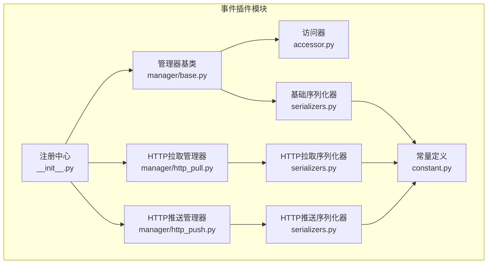
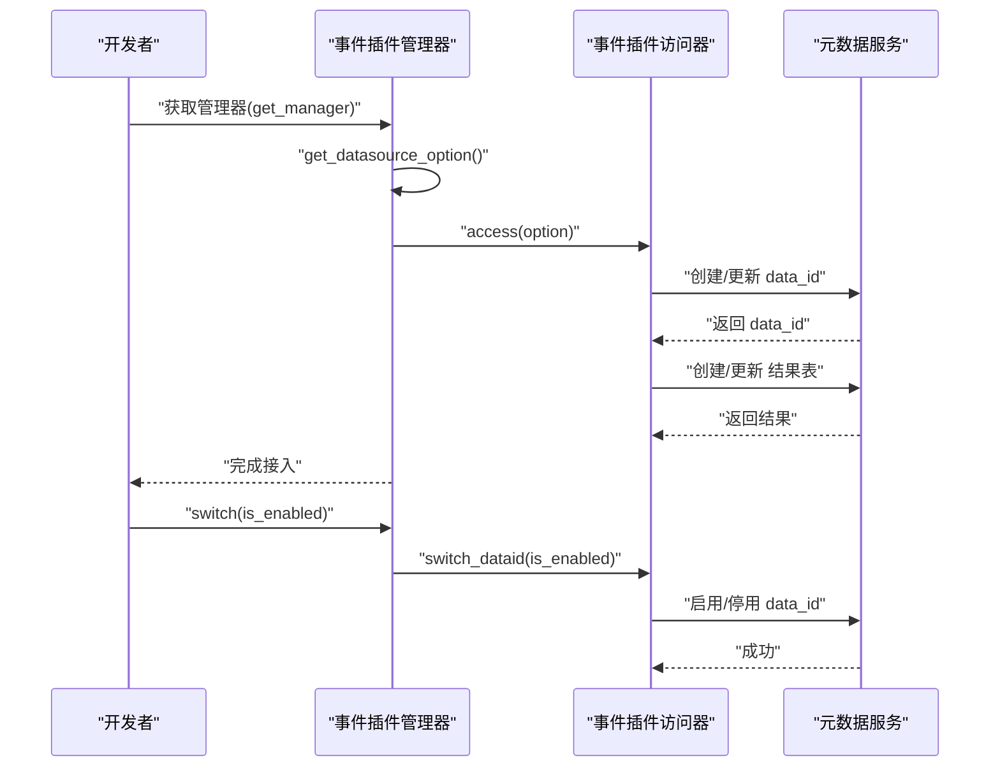
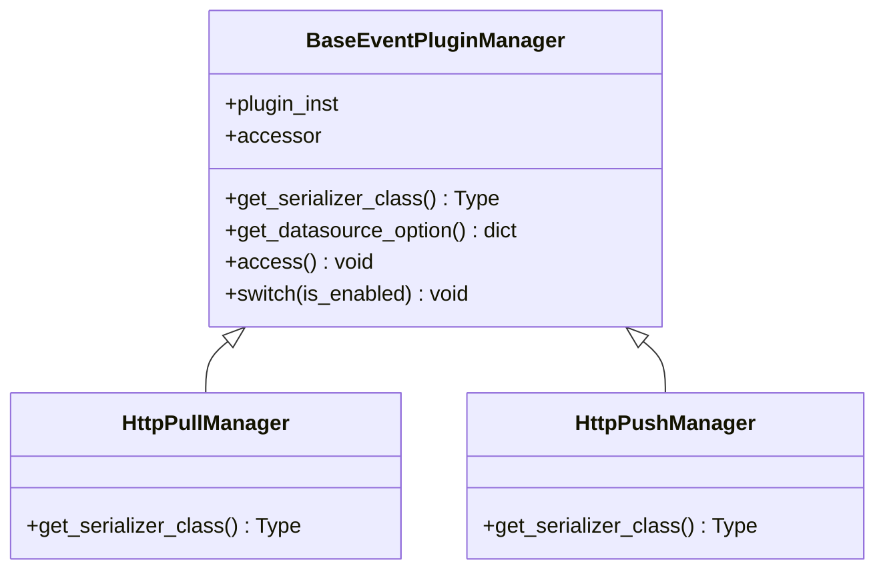
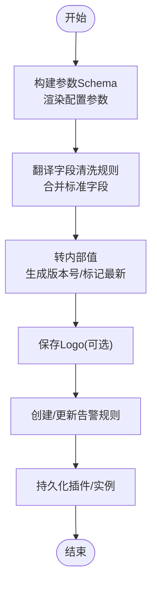
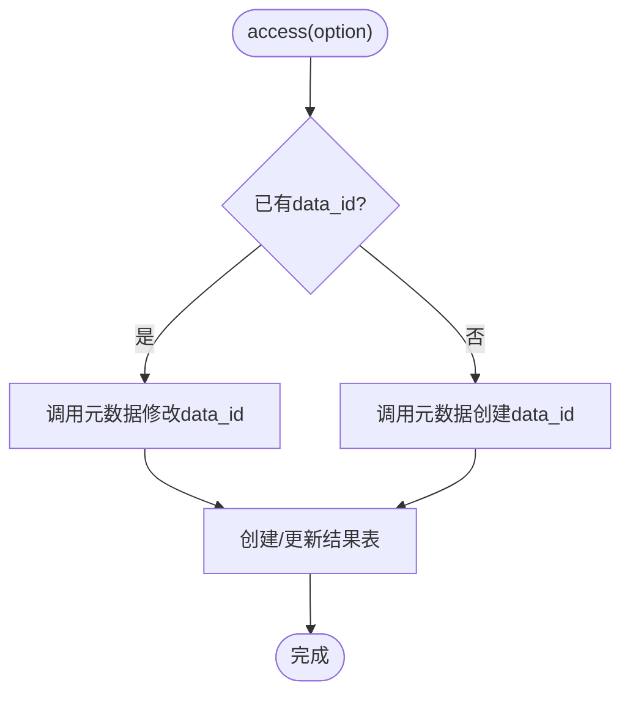
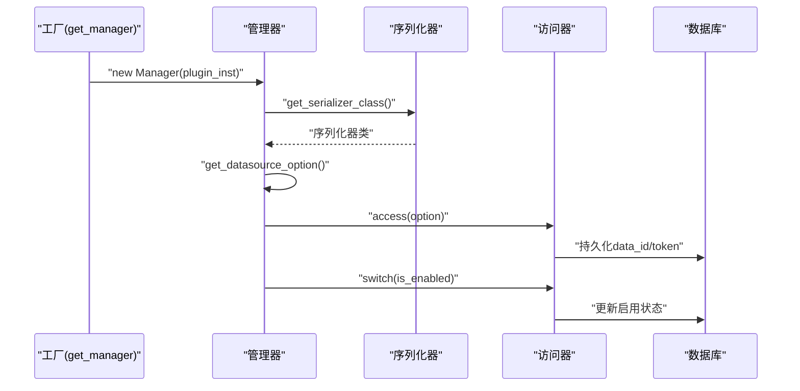
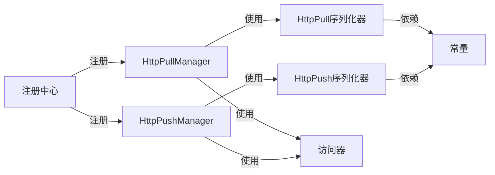

# 插件系统开发

<cite>
**本文引用的文件**
- [bkmonitor/bkmonitor/event_plugin/__init__.py](file://bkmonitor/bkmonitor/event_plugin/__init__.py)
- [bkmonitor/bkmonitor/event_plugin/accessor.py](file://bkmonitor/bkmonitor/event_plugin/accessor.py)
- [bkmonitor/bkmonitor/event_plugin/constant.py](file://bkmonitor/bkmonitor/event_plugin/constant.py)
- [bkmonitor/bkmonitor/event_plugin/serializers.py](file://bkmonitor/bkmonitor/event_plugin/serializers.py)
- [bkmonitor/bkmonitor/event_plugin/manager/base.py](file://bkmonitor/bkmonitor/event_plugin/manager/base.py)
- [bkmonitor/bkmonitor/event_plugin/manager/http_pull.py](file://bkmonitor/bkmonitor/event_plugin/manager/http_pull.py)
- [bkmonitor/bkmonitor/event_plugin/manager/http_push.py](file://bkmonitor/bkmonitor/event_plugin/manager/http_push.py)
- [bkmonitor/constants/event.py](file://bkmonitor/constants/event.py)
- [bkmonitor/bkmonitor/models/fta/constant.py](file://bkmonitor/bkmonitor/models/fta/constant.py)
</cite>

## 目录
1. [简介](#简介)
2. [项目结构](#项目结构)
3. [核心组件](#核心组件)
4. [架构总览](#架构总览)
5. [组件详细分析](#组件详细分析)
6. [依赖关系分析](#依赖关系分析)
7. [性能考量](#性能考量)
8. [故障排查指南](#故障排查指南)
9. [结论](#结论)
10. [附录](#附录)

## 简介
本指南面向插件系统开发者，聚焦“事件插件”的架构设计、插件注册机制、生命周期管理与接口规范。文档覆盖两类典型插件形态：HTTP 拉取插件与 HTTP 推送插件，并给出配置参数、序列化规范、错误处理与调试方法，以及性能优化建议。读者可据此快速完成事件插件的开发、部署与运维。

## 项目结构
事件插件系统围绕“管理器 + 序列化 + 访问器 + 常量 + 注册中心”组织，形成清晰的职责分离与扩展点：

- 管理器层：负责插件实例的接入、启停、数据源选项转换与生命周期管理
- 序列化层：负责插件与实例的配置校验、渲染与持久化
- 访问器层：负责对接元数据（数据链路）能力，生成/更新 data_id 与结果表
- 常量层：统一事件字段、插件类型、采集类型等规范
- 注册中心：基于插件类型动态选择管理器与序列化器

图表来源
- [bkmonitor/bkmonitor/event_plugin/__init__.py:20-59](file://bkmonitor/bkmonitor/event_plugin/__init__.py#L20-L59)
- [bkmonitor/bkmonitor/event_plugin/manager/base.py:25-87](file://bkmonitor/bkmonitor/event_plugin/manager/base.py#L25-L87)
- [bkmonitor/bkmonitor/event_plugin/manager/http_pull.py:17-21](file://bkmonitor/bkmonitor/event_plugin/manager/http_pull.py#L17-L21)
- [bkmonitor/bkmonitor/event_plugin/manager/http_push.py:17-21](file://bkmonitor/bkmonitor/event_plugin/manager/http_push.py#L17-L21)
- [bkmonitor/bkmonitor/event_plugin/serializers.py:67-241](file://bkmonitor/bkmonitor/event_plugin/serializers.py#L67-L241)
- [bkmonitor/bkmonitor/event_plugin/serializers.py:257-345](file://bkmonitor/bkmonitor/event_plugin/serializers.py#L257-L345)
- [bkmonitor/bkmonitor/event_plugin/accessor.py:20-127](file://bkmonitor/bkmonitor/event_plugin/accessor.py#L20-L127)
- [bkmonitor/bkmonitor/event_plugin/constant.py:14-91](file://bkmonitor/bkmonitor/event_plugin/constant.py#L14-L91)

章节来源
- [bkmonitor/bkmonitor/event_plugin/__init__.py:20-59](file://bkmonitor/bkmonitor/event_plugin/__init__.py#L20-L59)
- [bkmonitor/bkmonitor/event_plugin/manager/base.py:25-87](file://bkmonitor/bkmonitor/event_plugin/manager/base.py#L25-L87)
- [bkmonitor/bkmonitor/event_plugin/serializers.py:67-241](file://bkmonitor/bkmonitor/event_plugin/serializers.py#L67-L241)
- [bkmonitor/bkmonitor/event_plugin/accessor.py:20-127](file://bkmonitor/bkmonitor/event_plugin/accessor.py#L20-L127)
- [bkmonitor/bkmonitor/event_plugin/constant.py:14-91](file://bkmonitor/bkmonitor/event_plugin/constant.py#L14-L91)

## 核心组件
- 注册中心与工厂
  - 提供插件类型到管理器类的映射注册与获取
  - 提供插件类型到序列化器类的映射注册与获取
- 管理器基类
  - 统一序列化器选择、数据源选项转换、接入元数据、启停开关
- 访问器
  - 对接元数据能力，创建/更新 data_id 与结果表，幂等处理
- 序列化器
  - 定义插件与实例的配置参数、清洗规则、接入配置、告警规则等
- 常量
  - 事件标准字段、插件类型、采集类型等

章节来源
- [bkmonitor/bkmonitor/event_plugin/__init__.py:20-59](file://bkmonitor/bkmonitor/event_plugin/__init__.py#L20-L59)
- [bkmonitor/bkmonitor/event_plugin/manager/base.py:25-87](file://bkmonitor/bkmonitor/event_plugin/manager/base.py#L25-L87)
- [bkmonitor/bkmonitor/event_plugin/accessor.py:20-127](file://bkmonitor/bkmonitor/event_plugin/accessor.py#L20-L127)
- [bkmonitor/bkmonitor/event_plugin/serializers.py:67-241](file://bkmonitor/bkmonitor/event_plugin/serializers.py#L67-L241)
- [bkmonitor/bkmonitor/event_plugin/constant.py:14-91](file://bkmonitor/bkmonitor/event_plugin/constant.py#L14-L91)

## 架构总览
事件插件的运行时流程如下：插件实例经由管理器转换为数据源选项，再由访问器接入元数据，最终生成 data_id 与结果表；启停操作通过访问器调用元数据接口实现。

图表来源
- [bkmonitor/bkmonitor/event_plugin/__init__.py:27-42](file://bkmonitor/bkmonitor/event_plugin/__init__.py#L27-L42)
- [bkmonitor/bkmonitor/event_plugin/manager/base.py:38-87](file://bkmonitor/bkmonitor/event_plugin/manager/base.py#L38-L87)
- [bkmonitor/bkmonitor/event_plugin/accessor.py:24-104](file://bkmonitor/bkmonitor/event_plugin/accessor.py#L24-L104)

章节来源
- [bkmonitor/bkmonitor/event_plugin/__init__.py:27-42](file://bkmonitor/bkmonitor/event_plugin/__init__.py#L27-L42)
- [bkmonitor/bkmonitor/event_plugin/manager/base.py:38-87](file://bkmonitor/bkmonitor/event_plugin/manager/base.py#L38-L87)
- [bkmonitor/bkmonitor/event_plugin/accessor.py:24-104](file://bkmonitor/bkmonitor/event_plugin/accessor.py#L24-L104)

## 组件详细分析

### 管理器基类与派生类
- 基类职责
  - 统一序列化器选择与数据源选项转换
  - 接入元数据、生成/更新 data_id 与 token
  - 启停 data_id 的开关
- 派生类
  - HTTP 拉取管理器：绑定 HTTP 拉取序列化器
  - HTTP 推送管理器：绑定 HTTP 推送序列化器

图表来源
- [bkmonitor/bkmonitor/event_plugin/manager/base.py:25-87](file://bkmonitor/bkmonitor/event_plugin/manager/base.py#L25-L87)
- [bkmonitor/bkmonitor/event_plugin/manager/http_pull.py:17-21](file://bkmonitor/bkmonitor/event_plugin/manager/http_pull.py#L17-L21)
- [bkmonitor/bkmonitor/event_plugin/manager/http_push.py:17-21](file://bkmonitor/bkmonitor/event_plugin/manager/http_push.py#L17-L21)

章节来源
- [bkmonitor/bkmonitor/event_plugin/manager/base.py:25-87](file://bkmonitor/bkmonitor/event_plugin/manager/base.py#L25-L87)
- [bkmonitor/bkmonitor/event_plugin/manager/http_pull.py:17-21](file://bkmonitor/bkmonitor/event_plugin/manager/http_pull.py#L17-L21)
- [bkmonitor/bkmonitor/event_plugin/manager/http_push.py:17-21](file://bkmonitor/bkmonitor/event_plugin/manager/http_push.py#L17-L21)

### 序列化器与配置规范
- 基础序列化器
  - 插件 ID、版本、配置参数、接入配置、字段清洗规则、告警规则、业务 ID、清洗配置
  - 支持参数渲染与字段清洗规则翻译
- HTTP 推送序列化器
  - 接入配置包含源数据格式、是否拆分事件、事件路径、采集类型、是否外网、告警来源
- HTTP 拉取序列化器
  - 接入配置包含 URL、方法、周期、重叠时间、超时、时间格式、分页配置、回调配置
- 实例序列化器
  - 与基础序列化器类似，但针对实例对象，字段更精简

图表来源
- [bkmonitor/bkmonitor/event_plugin/serializers.py:77-134](file://bkmonitor/bkmonitor/event_plugin/serializers.py#L77-L134)
- [bkmonitor/bkmonitor/event_plugin/serializers.py:140-199](file://bkmonitor/bkmonitor/event_plugin/serializers.py#L140-L199)
- [bkmonitor/bkmonitor/event_plugin/serializers.py:257-345](file://bkmonitor/bkmonitor/event_plugin/serializers.py#L257-L345)

章节来源
- [bkmonitor/bkmonitor/event_plugin/serializers.py:67-241](file://bkmonitor/bkmonitor/event_plugin/serializers.py#L67-L241)
- [bkmonitor/bkmonitor/event_plugin/serializers.py:257-345](file://bkmonitor/bkmonitor/event_plugin/serializers.py#L257-L345)

### 访问器与元数据接入
- 功能
  - 幂等接入：创建或更新 data_id 与结果表
  - 启停开关：调用元数据接口启用/停用 data_id
  - 数据命名：根据业务 ID 与插件 ID 生成全局唯一数据名
- 关键流程
  - 若存在 data_id 则更新，否则创建
  - 根据标准化字段与用户配置生成结果表字段列表与时间字段选项

图表来源
- [bkmonitor/bkmonitor/event_plugin/accessor.py:24-104](file://bkmonitor/bkmonitor/event_plugin/accessor.py#L24-L104)

章节来源
- [bkmonitor/bkmonitor/event_plugin/accessor.py:24-104](file://bkmonitor/bkmonitor/event_plugin/accessor.py#L24-L104)

### 插件注册机制与生命周期
- 注册机制
  - 基于插件类型注册管理器与序列化器
  - 提供工厂函数按插件实例或类型获取管理器
- 生命周期
  - 初始化：传入插件实例
  - 数据源选项转换：序列化器输出数据源配置
  - 接入：访问器接入元数据，生成 data_id 与结果表
  - 启停：通过访问器调用元数据启停 data_id
  - 更新：序列化器持久化变更，必要时重建告警规则与 logo

图表来源
- [bkmonitor/bkmonitor/event_plugin/__init__.py:27-42](file://bkmonitor/bkmonitor/event_plugin/__init__.py#L27-L42)
- [bkmonitor/bkmonitor/event_plugin/manager/base.py:34-87](file://bkmonitor/bkmonitor/event_plugin/manager/base.py#L34-L87)
- [bkmonitor/bkmonitor/event_plugin/accessor.py:32-86](file://bkmonitor/bkmonitor/event_plugin/accessor.py#L32-L86)

章节来源
- [bkmonitor/bkmonitor/event_plugin/__init__.py:27-42](file://bkmonitor/bkmonitor/event_plugin/__init__.py#L27-L42)
- [bkmonitor/bkmonitor/event_plugin/manager/base.py:34-87](file://bkmonitor/bkmonitor/event_plugin/manager/base.py#L34-L87)
- [bkmonitor/bkmonitor/event_plugin/accessor.py:32-86](file://bkmonitor/bkmonitor/event_plugin/accessor.py#L32-L86)

### HTTP 拉取插件实现要点
- 配置要点
  - URL、请求方法、周期、重叠时间、超时、时间格式
  - 分页配置：分页方式与分页参数
  - 回调配置：与 HTTP 推送一致
- 参数传递
  - 通过实例序列化器的接入配置传递
- 错误处理
  - 超时与重试策略需在上游调度层实现
  - 返回数据不符合预期时，应进行严格校验与日志记录

章节来源
- [bkmonitor/bkmonitor/event_plugin/serializers.py:301-323](file://bkmonitor/bkmonitor/event_plugin/serializers.py#L301-L323)
- [bkmonitor/bkmonitor/event_plugin/manager/http_pull.py:17-21](file://bkmonitor/bkmonitor/event_plugin/manager/http_pull.py#L17-L21)

### HTTP 推送插件实现要点
- 配置要点
  - 源数据格式（JSON/YAML/XML/TEXT）
  - 是否拆分事件、事件所在路径
  - 采集类型、是否外网、告警来源
- 参数传递
  - 通过实例序列化器的接入配置传递
- 错误处理
  - 解析失败或格式不符时，应拒绝并记录错误
  - 多事件拆分时需保证每条事件符合清洗规则

章节来源
- [bkmonitor/bkmonitor/event_plugin/serializers.py:246-255](file://bkmonitor/bkmonitor/event_plugin/serializers.py#L246-L255)
- [bkmonitor/bkmonitor/event_plugin/manager/http_push.py:17-21](file://bkmonitor/bkmonitor/event_plugin/manager/http_push.py#L17-L21)

### 接口规范与数据模型
- 事件标准字段
  - 包含事件标识、描述、指标、分类、目标、严重度、业务 ID、标签、去重维度、受理人、事件时间、异常时间、状态等
- 插件类型
  - HTTP 推送、HTTP 拉取、Email 拉取、Kafka 推送、Collector
- 采集类型
  - 推送采集类型：bk_collector、bk_ingestor

章节来源
- [bkmonitor/bkmonitor/event_plugin/constant.py:14-91](file://bkmonitor/bkmonitor/event_plugin/constant.py#L14-L91)
- [bkmonitor/bkmonitor/models/fta/constant.py:14-30](file://bkmonitor/bkmonitor/models/fta/constant.py#L14-L30)
- [bkmonitor/constants/event.py:12-21](file://bkmonitor/constants/event.py#L12-L21)

## 依赖关系分析
- 组件耦合
  - 管理器依赖访问器与序列化器
  - 访问器依赖元数据接口与模型
  - 注册中心依赖插件类型常量与管理器类
- 扩展点
  - 新增插件类型：注册管理器与序列化器映射
  - 新增清洗规则：扩展序列化器与清洗逻辑
  - 新增采集类型：扩展常量与接入流程

图表来源
- [bkmonitor/bkmonitor/event_plugin/__init__.py:52-59](file://bkmonitor/bkmonitor/event_plugin/__init__.py#L52-L59)
- [bkmonitor/bkmonitor/event_plugin/manager/http_pull.py:17-21](file://bkmonitor/bkmonitor/event_plugin/manager/http_pull.py#L17-L21)
- [bkmonitor/bkmonitor/event_plugin/manager/http_push.py:17-21](file://bkmonitor/bkmonitor/event_plugin/manager/http_push.py#L17-L21)
- [bkmonitor/bkmonitor/event_plugin/serializers.py:257-345](file://bkmonitor/bkmonitor/event_plugin/serializers.py#L257-L345)
- [bkmonitor/bkmonitor/event_plugin/constant.py:14-91](file://bkmonitor/bkmonitor/event_plugin/constant.py#L14-L91)

章节来源
- [bkmonitor/bkmonitor/event_plugin/__init__.py:52-59](file://bkmonitor/bkmonitor/event_plugin/__init__.py#L52-L59)
- [bkmonitor/bkmonitor/event_plugin/manager/http_pull.py:17-21](file://bkmonitor/bkmonitor/event_plugin/manager/http_pull.py#L17-L21)
- [bkmonitor/bkmonitor/event_plugin/manager/http_push.py:17-21](file://bkmonitor/bkmonitor/event_plugin/manager/http_push.py#L17-L21)
- [bkmonitor/bkmonitor/event_plugin/serializers.py:257-345](file://bkmonitor/bkmonitor/event_plugin/serializers.py#L257-L345)
- [bkmonitor/bkmonitor/event_plugin/constant.py:14-91](file://bkmonitor/bkmonitor/event_plugin/constant.py#L14-L91)

## 性能考量
- 序列化与渲染
  - 参数渲染与字段翻译在序列化阶段完成，避免运行时重复计算
- 接入幂等
  - 访问器幂等处理，减少重复创建 data_id 与结果表带来的开销
- 启停控制
  - 通过元数据启停 data_id，避免无效流量进入数据链路
- 分页与批量
  - HTTP 拉取插件支持分页与批量拉取，合理设置单次拉取数量与总上限，降低压力峰值
- 超时与重试
  - 设置合理的请求超时与重试间隔，避免阻塞调度线程

## 故障排查指南
- 常见问题
  - 插件类型不受支持：检查注册中心是否正确注册对应类型
  - data_id 无法创建/更新：检查元数据接口权限与参数合法性
  - 结果表字段缺失：核对标准化字段与用户自定义清洗配置
  - 启停失败：确认当前用户具备元数据操作权限
- 调试建议
  - 开启序列化器的参数渲染与字段翻译日志
  - 在访问器接入前后打印 data_id 与结果表状态
  - 使用最小化配置复现问题，逐步增加复杂度定位根因

章节来源
- [bkmonitor/bkmonitor/event_plugin/__init__.py:35-42](file://bkmonitor/bkmonitor/event_plugin/__init__.py#L35-L42)
- [bkmonitor/bkmonitor/event_plugin/accessor.py:32-104](file://bkmonitor/bkmonitor/event_plugin/accessor.py#L32-L104)
- [bkmonitor/bkmonitor/event_plugin/serializers.py:77-134](file://bkmonitor/bkmonitor/event_plugin/serializers.py#L77-L134)

## 结论
事件插件系统以“注册中心 + 管理器 + 序列化器 + 访问器 + 常量”为核心，提供了清晰的扩展点与稳定的生命周期管理。HTTP 拉取与推送插件通过统一的序列化配置与接入流程，实现了灵活的参数传递与强大的清洗能力。遵循本文的接口规范与最佳实践，可高效完成插件开发、部署与运维。

## 附录

### 插件开发示例（步骤指引）
- 定义插件类型与序列化器
  - 在注册中心注册管理器与序列化器映射
  - 编写实例序列化器，定义接入配置、清洗规则与告警规则
- 实现管理器
  - 继承基类，指定序列化器类
  - 复用接入与启停流程
- 实现访问器
  - 调用元数据接口创建/更新 data_id 与结果表
  - 幂等处理与错误捕获
- 配置与参数
  - 使用配置参数渲染接入配置
  - 清洗规则与字段映射需与标准化字段保持一致
- 调试与验证
  - 通过最小化配置验证接入流程
  - 观察 data_id 与结果表状态变化
  - 记录序列化与接入日志

章节来源
- [bkmonitor/bkmonitor/event_plugin/__init__.py:52-59](file://bkmonitor/bkmonitor/event_plugin/__init__.py#L52-L59)
- [bkmonitor/bkmonitor/event_plugin/manager/base.py:34-87](file://bkmonitor/bkmonitor/event_plugin/manager/base.py#L34-L87)
- [bkmonitor/bkmonitor/event_plugin/serializers.py:257-345](file://bkmonitor/bkmonitor/event_plugin/serializers.py#L257-L345)
- [bkmonitor/bkmonitor/event_plugin/accessor.py:24-104](file://bkmonitor/bkmonitor/event_plugin/accessor.py#L24-L104)