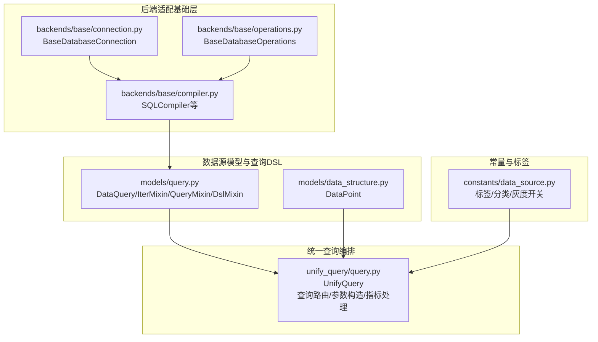
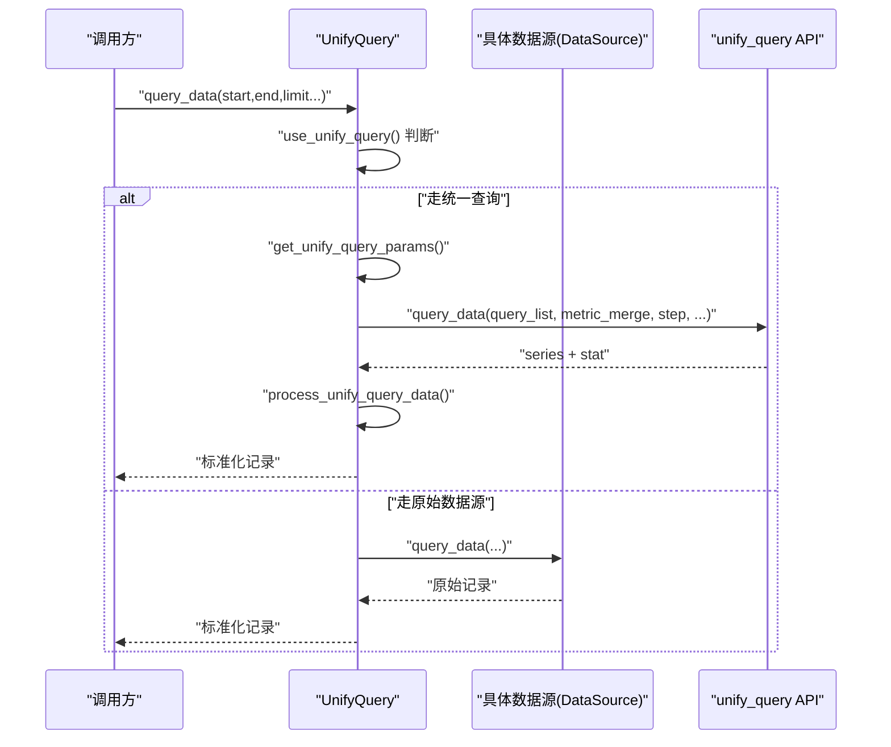
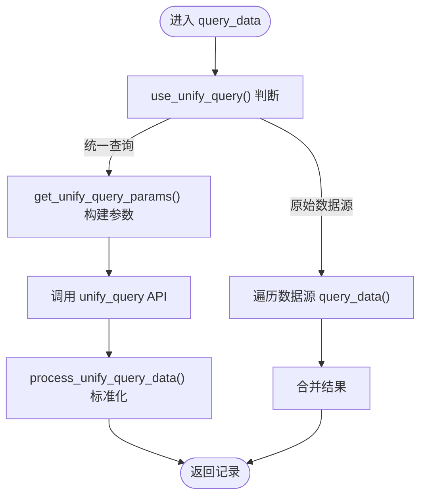
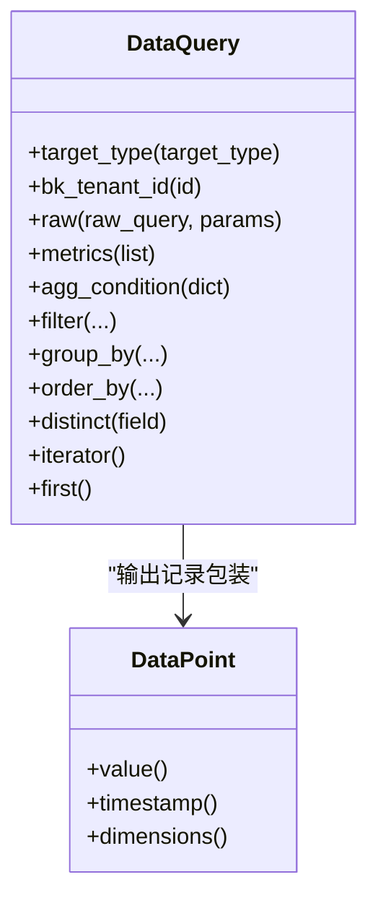
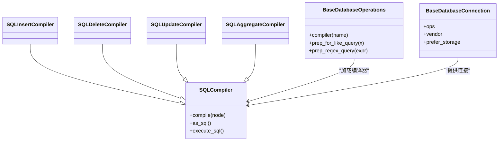
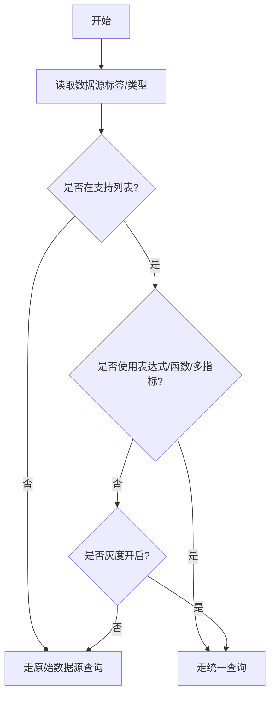
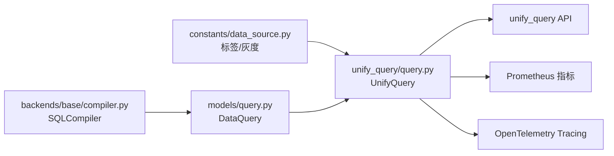

# 数据源扩展开发

<cite>
**本文引用的文件**
- [bkmonitor/bkmonitor/data_source/__init__.py](file://bkmonitor/bkmonitor/data_source/__init__.py)
- [bkmonitor/bkmonitor/data_source/models/query.py](file://bkmonitor/bkmonitor/data_source/models/query.py)
- [bkmonitor/bkmonitor/data_source/unify_query/query.py](file://bkmonitor/bkmonitor/data_source/unify_query/query.py)
- [bkmonitor/constants/data_source.py](file://bkmonitor/constants/data_source.py)
- [bkmonitor/bkmonitor/data_source/backends/base/connection.py](file://bkmonitor/bkmonitor/data_source/backends/base/connection.py)
- [bkmonitor/bkmonitor/data_source/backends/base/compiler.py](file://bkmonitor/bkmonitor/data_source/backends/base/compiler.py)
- [bkmonitor/bkmonitor/data_source/backends/base/operations.py](file://bkmonitor/bkmonitor/data_source/backends/base/operations.py)
- [bkmonitor/bkmonitor/data_source/models/data_structure.py](file://bkmonitor/bkmonitor/data_source/models/data_structure.py)
</cite>

## 目录
1. [简介](#简介)
2. [项目结构](#项目结构)
3. [核心组件](#核心组件)
4. [架构总览](#架构总览)
5. [详细组件分析](#详细组件分析)
6. [依赖分析](#依赖分析)
7. [性能考虑](#性能考虑)
8. [故障排查指南](#故障排查指南)
9. [结论](#结论)
10. [附录](#附录)

## 简介
本指南面向希望在监控平台中开发“自定义数据源”的工程师，系统性讲解从需求到落地的完整流程，包括：
- 自定义数据源的开发流程与适配器实现
- 查询接口设计与统一查询模块的协作
- 数据源配置管理、连接池管理、数据转换与缓存机制
- 数据源插件注册方式、配置参数定义、认证机制与错误处理策略
- 提供可复用的开发示例，涵盖数据获取、格式化、性能优化与监控指标采集

## 项目结构
数据源相关能力主要分布在以下模块：
- 数据源模型与查询DSL：bkmonitor/bkmonitor/data_source/models
- 统一查询编排：bkmonitor/bkmonitor/data_source/unify_query
- 后端适配基础层：bkmonitor/bkmonitor/data_source/backends/base
- 常量与标签定义：bkmonitor/constants/data_source.py
- 导出入口：bkmonitor/bkmonitor/data_source/__init__.py

**图表来源**
- [bkmonitor/bkmonitor/data_source/models/query.py:1-243](file://bkmonitor/bkmonitor/data_source/models/query.py#L1-L243)
- [bkmonitor/bkmonitor/data_source/unify_query/query.py:1-800](file://bkmonitor/bkmonitor/data_source/unify_query/query.py#L1-L800)
- [bkmonitor/bkmonitor/data_source/backends/base/compiler.py:1-86](file://bkmonitor/bkmonitor/data_source/backends/base/compiler.py#L1-L86)
- [bkmonitor/bkmonitor/data_source/backends/base/connection.py:1-16](file://bkmonitor/bkmonitor/data_source/backends/base/connection.py#L1-L16)
- [bkmonitor/bkmonitor/data_source/backends/base/operations.py:1-50](file://bkmonitor/bkmonitor/data_source/backends/base/operations.py#L1-L50)
- [bkmonitor/bkmonitor/data_source/models/data_structure.py:1-24](file://bkmonitor/bkmonitor/data_source/models/data_structure.py#L1-L24)
- [bkmonitor/constants/data_source.py:1-247](file://bkmonitor/constants/data_source.py#L1-L247)

**章节来源**
- [bkmonitor/bkmonitor/data_source/__init__.py:1-15](file://bkmonitor/bkmonitor/data_source/__init__.py#L1-L15)
- [bkmonitor/constants/data_source.py:1-247](file://bkmonitor/constants/data_source.py#L1-L247)

## 核心组件
- DataQuery：封装查询DSL（过滤、分组、排序、时间字段、原生SQL等），提供迭代与切片访问，支持时序点对象DataPoint。
- UnifyQuery：统一查询编排器，负责判断走统一查询还是原始数据源查询、参数构造、时间对齐、指标/维度处理、日志处理、可观测指标上报与错误处理。
- 后端适配基础层：SQLCompiler/SQLInsertCompiler/SQLDeleteCompiler/SQLUpdateCompiler/SQLAggregateCompiler等编译器，BaseDatabaseConnection与BaseDatabaseOperations提供后端差异抽象。
- 标签与分类：定义数据源标签、数据类型标签、统一查询灰度开关与支持列表。

**章节来源**
- [bkmonitor/bkmonitor/data_source/models/query.py:1-243](file://bkmonitor/bkmonitor/data_source/models/query.py#L1-L243)
- [bkmonitor/bkmonitor/data_source/unify_query/query.py:1-800](file://bkmonitor/bkmonitor/data_source/unify_query/query.py#L1-L800)
- [bkmonitor/bkmonitor/data_source/backends/base/compiler.py:1-86](file://bkmonitor/bkmonitor/data_source/backends/base/compiler.py#L1-L86)
- [bkmonitor/bkmonitor/data_source/backends/base/connection.py:1-16](file://bkmonitor/bkmonitor/data_source/backends/base/connection.py#L1-L16)
- [bkmonitor/bkmonitor/data_source/backends/base/operations.py:1-50](file://bkmonitor/bkmonitor/data_source/backends/base/operations.py#L1-L50)
- [bkmonitor/constants/data_source.py:1-247](file://bkmonitor/constants/data_source.py#L1-L247)

## 架构总览
统一查询模块在满足条件时，将多个数据源的查询请求转化为统一的查询语句，经由统一查询API返回标准化结果；否则回退到各数据源的原生查询接口。

**图表来源**
- [bkmonitor/bkmonitor/data_source/unify_query/query.py:387-425](file://bkmonitor/bkmonitor/data_source/unify_query/query.py#L387-L425)
- [bkmonitor/bkmonitor/data_source/unify_query/query.py:496-533](file://bkmonitor/bkmonitor/data_source/unify_query/query.py#L496-L533)

## 详细组件分析

### 组件A：统一查询编排器 UnifyQuery
- 功能职责
  - 统一查询参数构造：合并多个数据源配置、计算步长、时间对齐、空间标识与租户ID。
  - 查询路由：根据数据源标签、数据类型、表达式、函数、灰度开关等决定走统一查询或原始数据源。
  - 数据处理：将统一查询返回的series转换为标准记录，处理维度、时间戳、结果字段映射；对日志类数据进行_meta抽取与清洗。
  - 指标与统计：采集查询耗时与计数指标，上报OpenTelemetry Span与Prometheus指标。
  - 错误处理：捕获异常并统一上报状态，随后抛出上层处理。
- 关键流程
  - 参数构造：get_unify_query_params
  - 统一查询：_query_unify_query
  - 原始数据源：_query_data_using_datasource
  - 日志查询：_query_log_using_unify_query/_query_log_using_datasource
  - 指标处理：process_unify_query_data/process_unify_query_log

**图表来源**
- [bkmonitor/bkmonitor/data_source/unify_query/query.py:333-386](file://bkmonitor/bkmonitor/data_source/unify_query/query.py#L333-L386)
- [bkmonitor/bkmonitor/data_source/unify_query/query.py:387-425](file://bkmonitor/bkmonitor/data_source/unify_query/query.py#L387-L425)
- [bkmonitor/bkmonitor/data_source/unify_query/query.py:496-533](file://bkmonitor/bkmonitor/data_source/unify_query/query.py#L496-L533)

**章节来源**
- [bkmonitor/bkmonitor/data_source/unify_query/query.py:48-800](file://bkmonitor/bkmonitor/data_source/unify_query/query.py#L48-L800)

### 组件B：查询DSL与数据点 DataQuery 与 DataPoint
- DataQuery
  - 支持链式构建：table/from_/values/select/time_field/filter/group_by/order_by/distinct。
  - 迭代与切片：__iter__/__getitem__/limit/offset/first等。
  - 原生SQL：raw方法执行RawQuery。
  - 指标拼装：metrics方法将方法+字段转为select片段并支持别名。
- DataPoint
  - 作为时序点的包装器，提供value/timestamp/dimensions等抽象接口，便于后续格式化与序列化。

**图表来源**
- [bkmonitor/bkmonitor/data_source/models/query.py:195-243](file://bkmonitor/bkmonitor/data_source/models/query.py#L195-L243)
- [bkmonitor/bkmonitor/data_source/models/data_structure.py:12-24](file://bkmonitor/bkmonitor/data_source/models/data_structure.py#L12-L24)

**章节来源**
- [bkmonitor/bkmonitor/data_source/models/query.py:1-243](file://bkmonitor/bkmonitor/data_source/models/query.py#L1-L243)
- [bkmonitor/bkmonitor/data_source/models/data_structure.py:1-24](file://bkmonitor/bkmonitor/data_source/models/data_structure.py#L1-L24)

### 组件C：后端适配基础层
- SQLCompiler
  - 编译节点为SQL，按vendor选择特定实现，执行SQL并返回结果集。
- BaseDatabaseConnection/BaseDatabaseOperations
  - 抽象不同数据库后端的差异，Operations负责编译器加载与LIKE/REGEX等工具方法。

**图表来源**
- [bkmonitor/bkmonitor/data_source/backends/base/compiler.py:16-86](file://bkmonitor/bkmonitor/data_source/backends/base/compiler.py#L16-L86)
- [bkmonitor/bkmonitor/data_source/backends/base/connection.py:12-16](file://bkmonitor/bkmonitor/data_source/backends/base/connection.py#L12-L16)
- [bkmonitor/bkmonitor/data_source/backends/base/operations.py:16-50](file://bkmonitor/bkmonitor/data_source/backends/base/operations.py#L16-L50)

**章节来源**
- [bkmonitor/bkmonitor/data_source/backends/base/compiler.py:1-86](file://bkmonitor/bkmonitor/data_source/backends/base/compiler.py#L1-L86)
- [bkmonitor/bkmonitor/data_source/backends/base/connection.py:1-16](file://bkmonitor/bkmonitor/data_source/backends/base/connection.py#L1-L16)
- [bkmonitor/bkmonitor/data_source/backends/base/operations.py:1-50](file://bkmonitor/bkmonitor/data_source/backends/base/operations.py#L1-L50)

### 组件D：标签与统一查询灰度
- 标签定义：数据源标签（如自定义、监控采集、APM、Prometheus等）、数据类型标签（时序、事件、日志等）。
- 统一查询支持与灰度：明确哪些数据源组合走统一查询，哪些走灰度，以及灰度开关逻辑。

**图表来源**
- [bkmonitor/constants/data_source.py:227-241](file://bkmonitor/constants/data_source.py#L227-L241)
- [bkmonitor/bkmonitor/data_source/unify_query/query.py:281-332](file://bkmonitor/bkmonitor/data_source/unify_query/query.py#L281-L332)

**章节来源**
- [bkmonitor/constants/data_source.py:1-247](file://bkmonitor/constants/data_source.py#L1-L247)
- [bkmonitor/bkmonitor/data_source/unify_query/query.py:281-332](file://bkmonitor/bkmonitor/data_source/unify_query/query.py#L281-L332)

## 依赖分析
- 统一查询模块依赖数据源标签与分类，以决定查询路径。
- 统一查询模块依赖Prometheus指标与OpenTelemetry追踪，用于性能观测与问题定位。
- 查询DSL与后端编译器解耦，通过SQLCompiler抽象实现跨数据库兼容。

**图表来源**
- [bkmonitor/constants/data_source.py:1-247](file://bkmonitor/constants/data_source.py#L1-L247)
- [bkmonitor/bkmonitor/data_source/unify_query/query.py:1-800](file://bkmonitor/bkmonitor/data_source/unify_query/query.py#L1-L800)
- [bkmonitor/bkmonitor/data_source/models/query.py:1-243](file://bkmonitor/bkmonitor/data_source/models/query.py#L1-L243)
- [bkmonitor/bkmonitor/data_source/backends/base/compiler.py:1-86](file://bkmonitor/bkmonitor/data_source/backends/base/compiler.py#L1-L86)

**章节来源**
- [bkmonitor/bkmonitor/data_source/unify_query/query.py:1-800](file://bkmonitor/bkmonitor/data_source/unify_query/query.py#L1-L800)
- [bkmonitor/bkmonitor/data_source/models/query.py:1-243](file://bkmonitor/bkmonitor/data_source/models/query.py#L1-L243)
- [bkmonitor/bkmonitor/data_source/backends/base/compiler.py:1-86](file://bkmonitor/bkmonitor/data_source/backends/base/compiler.py#L1-L86)

## 性能考虑
- 时间对齐与步长：统一查询会根据数据源步长对齐起止时间，减少抖动与重复计算。
- 并发查询：日志多数据源场景下使用线程池并发拉取，汇总总量与数据。
- 指标观测：统一查询模块在查询前后打点，上报查询耗时与次数，并标注数据源标签、类型与空间信息，便于定位热点与异常。
- 降采样与限制：支持down_sample_range与limit/slimit/offset等参数，避免大查询导致资源压力。

**章节来源**
- [bkmonitor/bkmonitor/data_source/unify_query/query.py:351-386](file://bkmonitor/bkmonitor/data_source/unify_query/query.py#L351-L386)
- [bkmonitor/bkmonitor/data_source/unify_query/query.py:552-557](file://bkmonitor/bkmonitor/data_source/unify_query/query.py#L552-L557)
- [bkmonitor/bkmonitor/data_source/unify_query/query.py:590-626](file://bkmonitor/bkmonitor/data_source/unify_query/query.py#L590-L626)

## 故障排查指南
- 统一查询异常：统一查询模块捕获异常并上报状态，随后抛出给上层，便于集中处理与重试。
- 指标核对：检查DATASOURCE_QUERY_TIME与DATASOURCE_QUERY_COUNT指标，确认数据源标签、类型与空间是否正确。
- 日志与Span：查看OpenTelemetry Span属性中的查询语句与API名称，辅助定位问题。
- 回退策略：若统一查询不可用或灰度关闭，自动回退到原始数据源查询。

**章节来源**
- [bkmonitor/bkmonitor/data_source/unify_query/query.py:602-626](file://bkmonitor/bkmonitor/data_source/unify_query/query.py#L602-L626)
- [bkmonitor/bkmonitor/data_source/unify_query/query.py:711-721](file://bkmonitor/bkmonitor/data_source/unify_query/query.py#L711-L721)
- [bkmonitor/bkmonitor/data_source/unify_query/query.py:770-777](file://bkmonitor/bkmonitor/data_source/unify_query/query.py#L770-L777)

## 结论
通过统一查询编排器与后端适配基础层，平台实现了对多数据源的统一接入与标准化输出。开发者只需遵循标签与分类约定、实现数据源适配器与必要的查询接口，即可快速完成自定义数据源的扩展，并获得统一的性能观测与错误处理能力。

## 附录

### 开发流程与最佳实践
- 定义数据源标签与类型：参考标签与分类常量，确保数据源与数据类型匹配。
- 实现数据源适配器：提供query_data/query_log/query_dimensions等接口，必要时支持query_data_with_stat。
- 配置参数定义：在数据源配置中声明连接参数、认证信息、默认步长、维度字段等。
- 认证机制：在连接层或适配器层实现认证与令牌刷新，确保安全访问。
- 数据转换与缓存：在适配器内进行字段映射与格式化；对热点查询结果进行缓存，降低后端压力。
- 注册与灰度：将新数据源加入支持列表或灰度列表，结合开关进行灰度发布。
- 监控与告警：确保查询指标上报，完善Span与日志，建立告警阈值与重试策略。

### 关键接口与职责
- DataQuery：构建查询DSL，支持原生SQL与指标拼装。
- UnifyQuery：统一查询编排，参数构造与结果标准化。
- SQLCompiler：SQL编译与执行，跨数据库兼容。
- BaseDatabaseConnection/BaseDatabaseOperations：后端差异抽象与工具方法。

**章节来源**
- [bkmonitor/bkmonitor/data_source/models/query.py:1-243](file://bkmonitor/bkmonitor/data_source/models/query.py#L1-L243)
- [bkmonitor/bkmonitor/data_source/unify_query/query.py:1-800](file://bkmonitor/bkmonitor/data_source/unify_query/query.py#L1-L800)
- [bkmonitor/bkmonitor/data_source/backends/base/compiler.py:1-86](file://bkmonitor/bkmonitor/data_source/backends/base/compiler.py#L1-L86)
- [bkmonitor/bkmonitor/data_source/backends/base/connection.py:1-16](file://bkmonitor/bkmonitor/data_source/backends/base/connection.py#L1-L16)
- [bkmonitor/bkmonitor/data_source/backends/base/operations.py:1-50](file://bkmonitor/bkmonitor/data_source/backends/base/operations.py#L1-L50)
- [bkmonitor/constants/data_source.py:1-247](file://bkmonitor/constants/data_source.py#L1-L247)