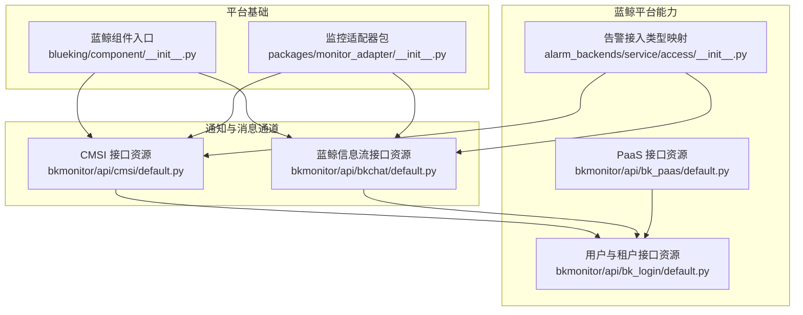
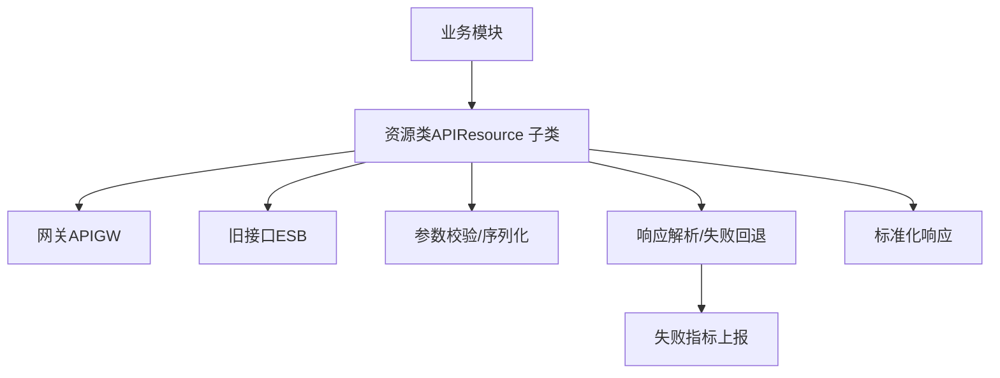
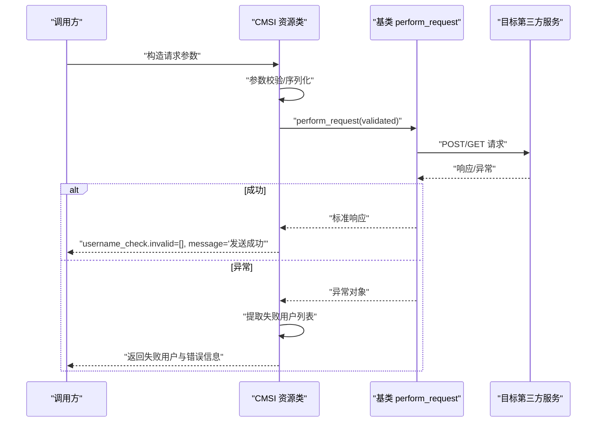
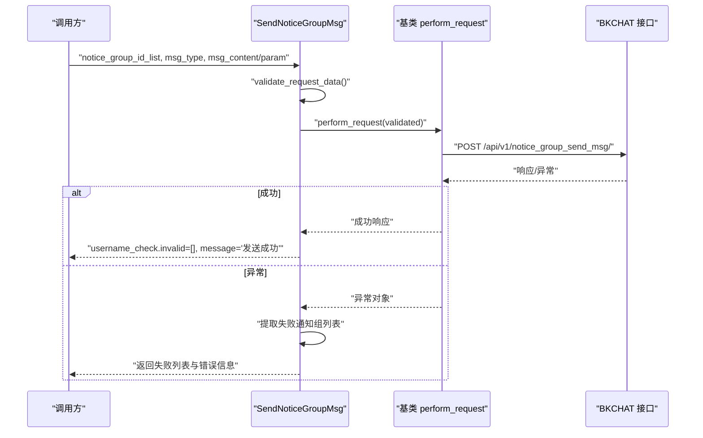
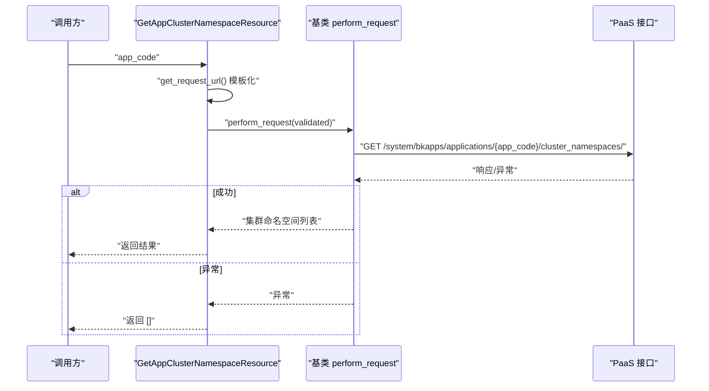
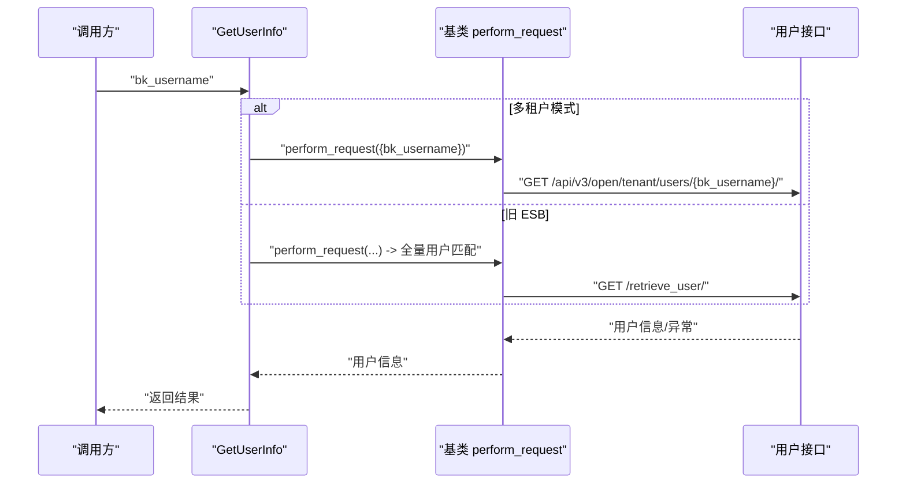
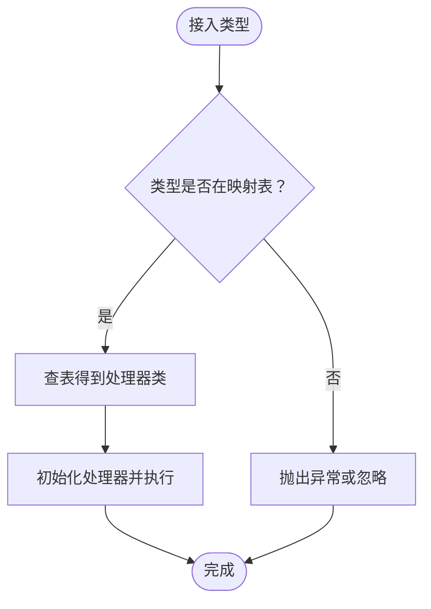

# 第三方服务集成

<cite>
**本文引用的文件**
- [bkchat/default.py](file://bkmonitor/api/bkchat/default.py)
- [cmsi/default.py](file://bkmonitor/api/cmsi/default.py)
- [bk_paas/default.py](file://bkmonitor/api/bk_paas/default.py)
- [bk_login/default.py](file://bkmonitor/api/bk_login/default.py)
- [alarm_backends/service/access/__init__.py](file://bkmonitor/alarm_backends/service/access/__init__.py)
- [blueking/component/__init__.py](file://bkmonitor/blueking/component/__init__.py)
- [packages/monitor_adapter/__init__.py](file://bkmonitor/packages/monitor_adapter/__init__.py)
</cite>

## 目录
1. [简介](#简介)
2. [项目结构](#项目结构)
3. [核心组件](#核心组件)
4. [架构总览](#架构总览)
5. [详细组件分析](#详细组件分析)
6. [依赖分析](#依赖分析)
7. [性能考虑](#性能考虑)
8. [故障排查指南](#故障排查指南)
9. [结论](#结论)
10. [附录](#附录)

## 简介
本文件面向需要在蓝鲸生态中对接第三方服务（如蓝鲸信息流、企业微信、钉钉、Slack 等）的开发者，提供从架构设计、API 封装、认证机制、请求处理与响应解析，到服务发现、负载均衡、熔断降级与故障转移的完整实践指南。文档结合仓库中的现有实现，给出可复用的 SDK 使用方式、配置管理要点、错误处理策略与性能监控建议，并提供端到端的集成开发示例路径。

## 项目结构
围绕第三方服务集成的相关模块主要分布在以下位置：
- 通知与消息通道：bkmonitor/api/cmsi、bkmonitor/api/bkchat
- 蓝鲸 PaaS 与登录：bkmonitor/api/bk_paas、bkmonitor/api/bk_login
- 告警接入与类型映射：bkmonitor/alarm_backends/service/access
- 蓝鲸组件入口：bkmonitor/blueking/component
- 适配器包：bkmonitor/packages/monitor_adapter



**图示来源**
- [cmsi/default.py:1-579](file://bkmonitor/api/cmsi/default.py#L1-579)
- [bkchat/default.py:1-95](file://bkmonitor/api/bkchat/default.py#L1-95)
- [bk_paas/default.py:1-49](file://bkmonitor/api/bk_paas/default.py#L1-49)
- [bk_login/default.py:1-334](file://bkmonitor/api/bk_login/default.py#L1-334)
- [alarm_backends/service/access/__init__.py:1-35](file://bkmonitor/alarm_backends/service/access/__init__.py#L1-35)
- [blueking/component/__init__.py:1-2](file://bkmonitor/blueking/component/__init__.py#L1-2)
- [packages/monitor_adapter/__init__.py:1-11](file://bkmonitor/packages/monitor_adapter/__init__.py#L1-11)

**章节来源**
- [cmsi/default.py:1-579](file://bkmonitor/api/cmsi/default.py#L1-579)
- [bkchat/default.py:1-95](file://bkmonitor/api/bkchat/default.py#L1-95)
- [bk_paas/default.py:1-49](file://bkmonitor/api/bk_paas/default.py#L1-49)
- [bk_login/default.py:1-334](file://bkmonitor/api/bk_login/default.py#L1-334)
- [alarm_backends/service/access/__init__.py:1-35](file://bkmonitor/alarm_backends/service/access/__init__.py#L1-35)
- [blueking/component/__init__.py:1-2](file://bkmonitor/blueking/component/__init__.py#L1-2)
- [packages/monitor_adapter/__init__.py:1-11](file://bkmonitor/packages/monitor_adapter/__init__.py#L1-11)

## 核心组件
- CMSI 通用消息通道：统一抽象多种通知渠道（邮件、短信、语音、企业微信机器人、RTX 等），支持网关与旧 ESB 两种后端切换，具备参数校验、失败回退与统一响应格式。
- 蓝鲸信息流（BKCHAT）：提供通知组查询与消息发送能力，支持参数校验与失败回退，返回标准化的失败用户列表。
- 蓝鲸 PaaS：提供应用集群命名空间查询等能力，支持模板化 URL 与网关基地址。
- 蓝鲸登录（BK-USER）：提供租户、用户、部门、显示信息等查询能力，支持多租户模式下的参数转换与批量拉取。
- 告警接入类型映射：将“数据/实时数据/告警/事件/工单”等接入类型映射到具体处理器，便于扩展第三方服务的告警投递。

**章节来源**
- [cmsi/default.py:1-579](file://bkmonitor/api/cmsi/default.py#L1-579)
- [bkchat/default.py:1-95](file://bkmonitor/api/bkchat/default.py#L1-95)
- [bk_paas/default.py:1-49](file://bkmonitor/api/bk_paas/default.py#L1-49)
- [bk_login/default.py:1-334](file://bkmonitor/api/bk_login/default.py#L1-334)
- [alarm_backends/service/access/__init__.py:1-35](file://bkmonitor/alarm_backends/service/access/__init__.py#L1-35)

## 架构总览
下图展示了第三方服务集成的整体架构：上层业务通过统一的资源类发起调用，底层根据配置选择网关或旧接口；在出现异常时，统一进行失败回退与指标上报；最终返回标准化的响应结构。



**图示来源**
- [cmsi/default.py:32-168](file://bkmonitor/api/cmsi/default.py#L32-168)
- [bkchat/default.py:23-95](file://bkmonitor/api/bkchat/default.py#L23-95)

## 详细组件分析

### 组件一：CMSI 通用消息通道
- 设计要点
  - 基类抽象：统一 base_url、module_name、网关/ESB 切换逻辑。
  - 渠道适配：针对不同通知类型（邮件、短信、语音、企业微信机器人、RTX 等）提供专用资源类，统一处理参数转换与请求。
  - 多租户兼容：在多租户模式下自动切换到网关接口，否则走旧 ESB。
  - 失败回退：捕获统一异常，提取失败用户列表并返回标准化结构。
- 关键流程（发送消息）


**图示来源**
- [cmsi/default.py:101-168](file://bkmonitor/api/cmsi/default.py#L101-168)

- 典型场景
  - 邮件发送：区分内外部用户，内部用户走旧接口，外部用户走网关接口，合并失败列表。
  - 企业微信机器人：按类型注入 JSON 内容，兼容不同字段命名。
  - RTX 发送：支持用户 ID 与蓝鲸用户名混合接收者列表。
- 参数与响应
  - 请求参数：包含发送者、接收者、标题、内容、消息类型、是否 Base64 等。
  - 响应结构：统一返回 username_check.invalid 与 message 字段，便于前端展示与二次处理。

**章节来源**
- [cmsi/default.py:1-579](file://bkmonitor/api/cmsi/default.py#L1-579)

### 组件二：蓝鲸信息流（BKCHAT）消息通道
- 设计要点
  - 资源类：继承统一资源基类，定义 action 与 method，支持 GET/POST。
  - 参数校验：必填项校验，至少提供文本内容或结构化参数。
  - 失败回退：捕获统一异常，提取失败通知组列表，返回标准化结构。
- 关键流程（发送通知组消息）


**图示来源**
- [bkchat/default.py:58-95](file://bkmonitor/api/bkchat/default.py#L58-95)

**章节来源**
- [bkchat/default.py:1-95](file://bkmonitor/api/bkchat/default.py#L1-95)

### 组件三：蓝鲸 PaaS 应用集群命名空间查询
- 设计要点
  - 模板化 URL：支持将 app_code 注入到路径中。
  - 容错处理：请求失败时返回空列表，避免影响主流程。
- 关键流程（获取集群命名空间）


**图示来源**
- [bk_paas/default.py:33-49](file://bkmonitor/api/bk_paas/default.py#L33-49)

**章节来源**
- [bk_paas/default.py:1-49](file://bkmonitor/api/bk_paas/default.py#L1-49)

### 组件四：蓝鲸登录（BK-USER）用户与租户查询
- 设计要点
  - 多租户模式：在启用多租户时走网关接口，否则走旧 ESB。
  - 批量拉取：部门列表等接口采用批量请求与聚合策略。
  - 参数转换：在网关模式下对参数进行格式转换，保证兼容性。
- 关键流程（获取用户信息）


**图示来源**
- [bk_login/default.py:260-290](file://bkmonitor/api/bk_login/default.py#L260-290)

**章节来源**
- [bk_login/default.py:1-334](file://bkmonitor/api/bk_login/default.py#L1-334)

### 组件五：告警接入类型映射
- 设计要点
  - 类型枚举：定义 Data、RealTimeData、Alert、Event、Incident 等接入类型。
  - 映射表：将接入类型映射到具体处理器类，便于扩展第三方服务的告警投递。
- 关键流程（接入类型到处理器）


**图示来源**
- [alarm_backends/service/access/__init__.py:20-35](file://bkmonitor/alarm_backends/service/access/__init__.py#L20-35)

**章节来源**
- [alarm_backends/service/access/__init__.py:1-35](file://bkmonitor/alarm_backends/service/access/__init__.py#L1-35)

## 依赖分析
- 组件耦合
  - CMSI/BKCHAT 资源类均继承统一的 APIResource，共享参数校验、URL 构造、异常处理与指标上报能力。
  - 多租户模式通过配置开关统一控制网关/ESB 切换，降低跨模块差异。
- 外部依赖
  - 蓝鲸组件网关与旧 ESB 的双栈兼容，确保平滑迁移。
  - 第三方服务（企业微信、钉钉、Slack 等）通过 CMSI 或 BKCHAT 的适配器实现统一接入。

```mermaid
graph LR
APIGW["API Gateway"] <- --> CMSI["CMSI 资源类"]
ESB["ESB"] <- --> CMSI
APIGW <- --> BKCHAT["BKCHAT 资源类"]
ESB <- --> BKCHAT
CMSI --> EXT["企业微信/钉钉/Slack 等"]
BKCHAT --> EXT
```

**图示来源**
- [cmsi/default.py:32-77](file://bkmonitor/api/cmsi/default.py#L32-77)
- [bkchat/default.py:23-25](file://bkmonitor/api/bkchat/default.py#L23-25)

**章节来源**
- [cmsi/default.py:1-579](file://bkmonitor/api/cmsi/default.py#L1-579)
- [bkchat/default.py:1-95](file://bkmonitor/api/bkchat/default.py#L1-95)

## 性能考虑
- 批量请求与分页
  - 对于用户/部门等大规模数据，采用批量请求与聚合策略，减少往返次数与压力。
- 缓存与去重
  - 用户信息与部门信息设置缓存类型，降低重复查询成本。
- 熔断与降级
  - 在第三方服务不可用时，快速失败并记录指标，避免雪崩效应。
- 连接池与超时
  - 建议统一配置连接池大小与超时时间，结合重试策略提升稳定性。

[本节为通用性能建议，不直接分析具体文件]

## 故障排查指南
- 常见问题定位
  - 参数校验失败：检查请求序列化器字段是否满足必填与格式要求。
  - 网关/ESB 切换异常：确认多租户模式配置与目标接口是否匹配。
  - 失败用户列表为空：确认第三方服务返回结构与解析逻辑。
- 错误处理策略
  - 统一捕获异常并返回标准化结构，便于前端展示与二次处理。
  - 记录失败指标，辅助定位与统计。

**章节来源**
- [cmsi/default.py:140-168](file://bkmonitor/api/cmsi/default.py#L140-168)
- [bkchat/default.py:70-95](file://bkmonitor/api/bkchat/default.py#L70-95)

## 结论
通过统一的资源类抽象与多租户模式下的网关/ESB 双栈兼容，蓝鲸监控系统实现了对多种第三方服务的稳定集成。结合参数校验、失败回退与指标上报，能够有效保障集成质量与可观测性。建议在实际项目中遵循本文档的配置与流程规范，确保扩展性与可维护性。

[本节为总结性内容，不直接分析具体文件]

## 附录

### A. 集成开发示例（步骤清单）
- 步骤一：确定目标第三方服务与可用通道
  - 企业微信/钉钉/Slack：优先通过 CMSI 适配器或 BKCHAT 通道接入。
- 步骤二：配置环境变量与网关开关
  - 设置多租户模式、网关基地址、旧 ESB 地址等。
- 步骤三：选择合适的资源类并构造请求
  - 参考 CMSI 的 SendMail/SendSms/SendWecomRobot 等资源类，或 BKCHAT 的 SendNoticeGroupMsg。
- 步骤四：参数校验与序列化
  - 严格遵循各资源类的 RequestSerializer 字段定义。
- 步骤五：异常处理与失败回退
  - 捕获统一异常，提取失败用户/通知组列表，返回标准化结构。
- 步骤六：性能监控与指标上报
  - 记录失败指标，结合日志与告警进行监控。

**章节来源**
- [cmsi/default.py:1-579](file://bkmonitor/api/cmsi/default.py#L1-579)
- [bkchat/default.py:1-95](file://bkmonitor/api/bkchat/default.py#L1-95)

### B. 配置管理要点
- 多租户模式
  - 启用后自动切换到网关接口，注意参数格式转换。
- 第三方服务开关
  - 通过配置项控制特定通道（如企业微信机器人、蓝鲸信息流）是否启用。
- 超时与重试
  - 统一设置超时与重试策略，避免阻塞主流程。

**章节来源**
- [cmsi/default.py:39-77](file://bkmonitor/api/cmsi/default.py#L39-77)
- [bk_login/default.py:23-41](file://bkmonitor/api/bk_login/default.py#L23-41)

### C. 服务发现、负载均衡、熔断降级与故障转移
- 服务发现
  - 通过配置集中管理第三方服务地址，必要时引入服务注册中心。
- 负载均衡
  - 对于高可用的第三方服务，建议在网关层或反向代理层配置负载均衡。
- 熔断降级
  - 当第三方服务不可用时，快速失败并记录指标，避免级联故障。
- 故障转移
  - 在多通道可用时，优先尝试主通道，失败后自动切换备用通道。

[本节为通用策略说明，不直接分析具体文件]