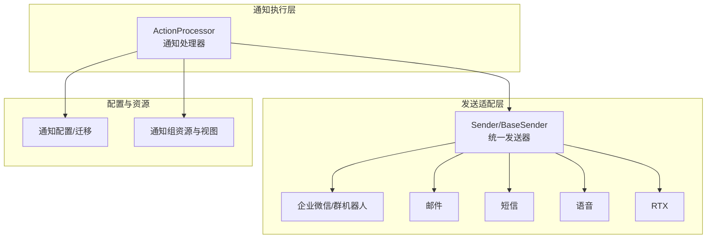
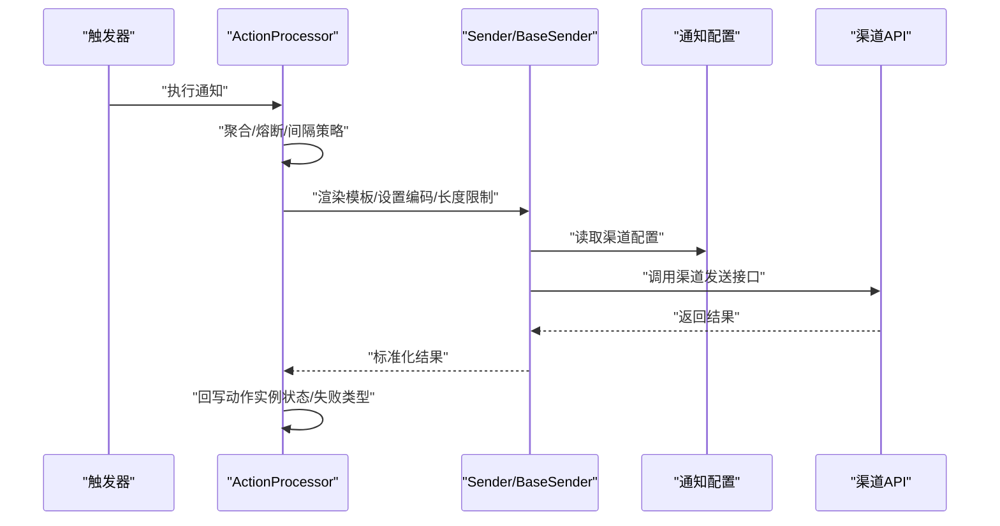
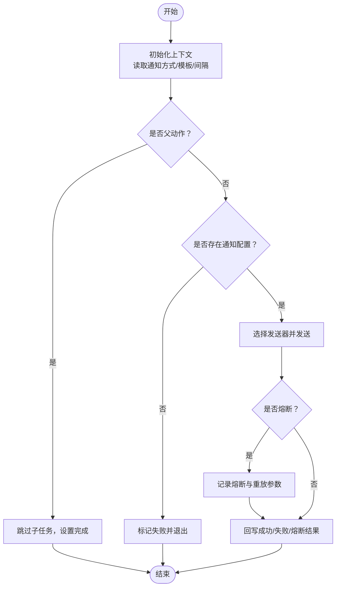
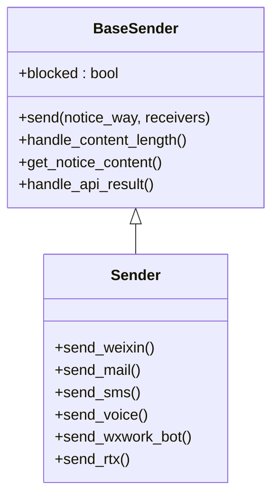
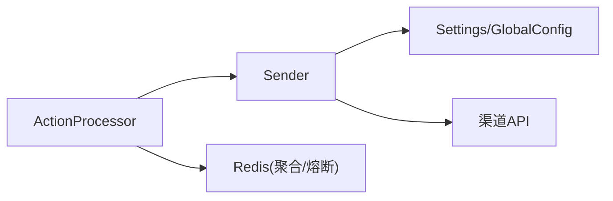

# 通知渠道扩展开发

<cite>
**本文引用的文件**
- [bkmonitor\alarm_backends\service\fta_action\notice\processor.py](file://bkmonitor/alarm_backends/service/fta_action/notice/processor.py)
- [bkmonitor\bkmonitor\utils\send.py](file://bkmonitor/bkmonitor/utils/send.py)
- [bkmonitor\constants\action.py](file://bkmonitor/constants/action.py)
- [bkmonitor\alarm_backends\management\commands\notice_preview.py](file://bkmonitor/alarm_backends/management/commands/notice_preview.py)
- [bkmonitor\bkmonitor\migrations\0004_noticegroup_webhook_url.py](file://bkmonitor/bkmonitor/migrations/0004_noticegroup_webhook_url.py)
- [bkmonitor\bkmonitor\migrations\0015_noticegroup_wechat_work_group.py](file://bkmonitor/bkmonitor/migrations/0015_noticegroup_wechat_work_group.py)
- [bkmonitor\packages\monitor_web\notice_group\constant.py](file://bkmonitor/packages/monitor_web/notice_group/constant.py)
- [bkmonitor\packages\monitor_web\notice_group\views.py](file://bkmonitor/packages/monitor_web/notice_group/views.py)
- [bkmonitor\packages\monitor_web\notice_group\urls.py](file://bkmonitor/packages/monitor_web/notice_group/urls.py)
- [bkmonitor\packages\monitor_web\notice_group\resources\backend.py](file://bkmonitor/packages/monitor_web/notice_group/resources/backend.py)
- [bkmonitor\packages\monitor_web\notice_group\resources\front.py](file://bkmonitor/packages/monitor_web/notice_group/resources/front.py)
- [bkmonitor\kernel_api\views\v4\notice_group.py](file://bkmonitor/kernel_api/views/v4/notice_group.py)
- [bkmonitor\bkmonitor\management\commands\clean_notice_user.py](file://bkmonitor/bkmonitor/management/commands/clean_notice_user.py)
- [bkmonitor\bkmonitor\management\commands\migrate_user_group_noticeway.py](file://bkmonitor/bkmonitor/management/commands/migrate_user_group_noticeway.py)
- [bkmonitor\core\errors\notice_group.py](file://bkmonitor/core/errors/notice_group.py)
- [bkmonitor\bkmonitor\aiops\incident\notice.py](file://bkmonitor/bkmonitor/aiops/incident/notice.py)
- [bkmonitor\bkmonitor\as_code\tests\test_notice.py](file://bkmonitor/bkmonitor/as_code/tests/test_notice.py)
</cite>

## 目录
1. [简介](#简介)
2. [项目结构](#项目结构)
3. [核心组件](#核心组件)
4. [架构总览](#架构总览)
5. [详细组件分析](#详细组件分析)
6. [依赖分析](#依赖分析)
7. [性能考虑](#性能考虑)
8. [故障排查指南](#故障排查指南)
9. [结论](#结论)
10. [附录](#附录)

## 简介
本指南面向“通知渠道扩展开发”，围绕通知插件的开发规范、通知配置管理、消息格式定义、通知渠道注册机制、消息模板设计、发送策略与重试机制展开，并给出企业微信、钉钉、Slack 等第三方通知渠道的集成方法与自定义通知渠道的开发流程。文档同时提供完整通知插件开发示例（接口实现、配置参数、错误处理与性能优化），帮助开发者快速落地并稳定运行通知能力。

## 项目结构
通知相关能力主要分布在以下模块：
- 通知执行与聚合：alarm_backends/service/fta_action/notice/processor.py
- 通知发送器与渠道适配：bkmonitor/bkmonitor/utils/send.py
- 通知常量与枚举：bkmonitor/constants/action.py
- 通知配置与迁移：bkmonitor/bkmonitor/migrations/*noticegroup*.py
- 通知组资源与视图：packages/monitor_web/notice_group/*
- 通知预览与命令：alarm_backends/management/commands/notice_preview.py
- 通知相关命令与错误：bkmonitor/bkmonitor/management/commands/*notice*.py、core/errors/notice_group.py
- AI 套餐通知与测试：bkmonitor/bkmonitor/aiops/incident/notice.py、bkmonitor/bkmonitor/as_code/tests/test_notice.py

图表来源
- [bkmonitor\alarm_backends\service\fta_action\notice\processor.py:133-278](file://bkmonitor/alarm_backends/service/fta_action/notice/processor.py#L133-L278)
- [bkmonitor\bkmonitor\utils\send.py:386-800](file://bkmonitor/bkmonitor/utils/send.py#L386-L800)
- [bkmonitor\packages\monitor_web\notice_group\urls.py](file://bkmonitor/packages/monitor_web/notice_group/urls.py)
- [bkmonitor\packages\monitor_web\notice_group\views.py](file://bkmonitor/packages/monitor_web/notice_group/views.py)

章节来源
- [bkmonitor\alarm_backends\service\fta_action\notice\processor.py:1-402](file://bkmonitor/alarm_backends/service/fta_action/notice/processor.py#L1-L402)
- [bkmonitor\bkmonitor\utils\send.py:1-1066](file://bkmonitor/bkmonitor/utils/send.py#L1-L1066)

## 核心组件
- 通知处理器 ActionProcessor：负责通知执行、聚合、熔断、重试与结果回写。
- 统一发送器 Sender/BaseSender：封装各渠道发送逻辑，统一消息模板渲染、长度限制、编码处理与结果归并。
- 通知常量 NoticeWay/NoticeType：定义通知方式与类型，驱动模板路径与发送策略。
- 通知组资源与视图：提供通知组的增删改查、权限校验与前端交互。
- 通知配置迁移：维护通知组与第三方渠道配置的演进。

章节来源
- [bkmonitor\alarm_backends\service\fta_action\notice\processor.py:42-132](file://bkmonitor/alarm_backends/service/fta_action/notice/processor.py#L42-L132)
- [bkmonitor\bkmonitor\utils\send.py:54-384](file://bkmonitor/bkmonitor/utils/send.py#L54-L384)
- [bkmonitor\constants\action.py](file://bkmonitor/constants/action.py)

## 架构总览
通知从“策略触发”到“渠道发送”的关键流程如下：

图表来源
- [bkmonitor\alarm_backends\service\fta_action\notice\processor.py:133-278](file://bkmonitor/alarm_backends/service/fta_action/notice/processor.py#L133-L278)
- [bkmonitor\bkmonitor\utils\send.py:336-384](file://bkmonitor/bkmonitor/utils/send.py#L336-L384)

## 详细组件分析

### 通知处理器 ActionProcessor
职责与流程要点：
- 初始化与上下文：读取通知方式、模板详情、通知间隔与模式。
- 动作聚合：针对非语音通知，通过 Redis 键聚合同一通知方式下的多个动作，避免重复发送。
- 执行入口：根据动作状态决定是否执行，异常时记录失败类型并可重试。
- 通知发送：按渠道选择发送器，支持熔断与阻断重放。
- 结果回写：区分成功/失败/熔断三类，更新动作实例状态与输出。

图表来源
- [bkmonitor\alarm_backends\service\fta_action\notice\processor.py:133-278](file://bkmonitor/alarm_backends/service/fta_action/notice/processor.py#L133-L278)
- [bkmonitor\alarm_backends\service\fta_action\notice\processor.py:279-354](file://bkmonitor/alarm_backends/service/fta_action/notice/processor.py#L279-L354)

章节来源
- [bkmonitor\alarm_backends\service\fta_action\notice\processor.py:42-132](file://bkmonitor/alarm_backends/service/fta_action/notice/processor.py#L42-L132)
- [bkmonitor\alarm_backends\service\fta_action\notice\processor.py:133-278](file://bkmonitor/alarm_backends/service/fta_action/notice/processor.py#L133-L278)
- [bkmonitor\alarm_backends\service\fta_action\notice\processor.py:279-354](file://bkmonitor/alarm_backends/service/fta_action/notice/processor.py#L279-L354)

### 统一发送器 Sender/BaseSender
职责与要点：
- 模板渲染：根据通知类型与语言选择模板路径，支持多语言模板回退。
- 内容长度与编码：按渠道限制裁剪内容，自动设置编码与消息类型。
- 渠道适配：动态路由到具体渠道发送方法（如企业微信、邮件、短信、语音、RTX）。
- 熔断与重放：通过 BlockedError 抛出熔断信号，携带重放参数供后续重放。
- 结果归并：将渠道返回结果标准化为统一格式，便于上层处理。

图表来源
- [bkmonitor\bkmonitor\utils\send.py:54-384](file://bkmonitor/bkmonitor/utils/send.py#L54-L384)
- [bkmonitor\bkmonitor\utils\send.py:386-1066](file://bkmonitor/bkmonitor/utils/send.py#L386-L1066)

章节来源
- [bkmonitor\bkmonitor\utils\send.py:54-384](file://bkmonitor/bkmonitor/utils/send.py#L54-L384)
- [bkmonitor\bkmonitor\utils\send.py:386-1066](file://bkmonitor/bkmonitor/utils/send.py#L386-L1066)

### 通知配置与模板
- 通知方式与类型：通过 NoticeWay/NoticeType 控制模板路径与发送行为。
- 模板路径：标题与内容模板分别按信号与通知方式组织，支持 markdown/text 两类。
- 企业微信卡片布局：在灰度业务与特定模板存在时启用 layouts 模式，自动格式化并截断。
- 语言模板：按业务语言选择模板文件，不存在时回退默认模板。

章节来源
- [bkmonitor\alarm_backends\service\fta_action\notice\processor.py:224-225](file://bkmonitor/alarm_backends/service/fta_action/notice/processor.py#L224-L225)
- [bkmonitor\bkmonitor\utils\send.py:171-232](file://bkmonitor/bkmonitor/utils/send.py#L171-L232)
- [bkmonitor\constants\action.py](file://bkmonitor/constants/action.py)

### 通知渠道注册与扩展
- 渠道注册：统一通过 Sender 的方法名映射（如 send_wxwork_bot、send_mail 等）实现。
- 自定义渠道：新增渠道只需在 Sender 中实现对应方法，并在 NOTICE_SENDER 映射中注册（若需要）。
- 渠道配置：通过 settings 中的渠道开关与白名单控制启用范围（如企业微信机器人白名单）。

章节来源
- [bkmonitor\bkmonitor\utils\send.py:356-384](file://bkmonitor/bkmonitor/utils/send.py#L356-L384)
- [bkmonitor\bkmonitor\utils\send.py:784-800](file://bkmonitor/bkmonitor/utils/send.py#L784-L800)

### 发送策略与重试机制
- 间隔通知：支持固定间隔与递增间隔两种模式，按执行次数计算下次发送间隔。
- 语音告警收敛：同一维度与接收人两分钟内仅允许一次语音告警，避免骚扰。
- 熔断与阻断重放：当触发熔断时，记录重放参数，后续可通过 replay_blocked_notice 重放。
- 结果分类：成功/失败/熔断三类分别更新动作实例状态与输出。

章节来源
- [bkmonitor\alarm_backends\service\fta_action\notice\processor.py:186-195](file://bkmonitor/alarm_backends/service/fta_action/notice/processor.py#L186-L195)
- [bkmonitor\alarm_backends\service\fta_action\notice\processor.py:361-401](file://bkmonitor/alarm_backends/service/fta_action/notice/processor.py#L361-L401)
- [bkmonitor\alarm_backends\service\fta_action\notice\processor.py:355-359](file://bkmonitor/alarm_backends/service/fta_action/notice/processor.py#L355-L359)
- [bkmonitor\alarm_backends\service\fta_action\notice\processor.py:279-354](file://bkmonitor/alarm_backends/service/fta_action/notice/processor.py#L279-L354)

### 第三方渠道集成方法

#### 企业微信（含机器人与卡片布局）
- 机器人与应用：根据配置优先使用企业微信机器人，否则回退到微信应用发送。
- 群机器人：支持文本、markdown、图片等消息类型，支持提及用户与卡片布局。
- 卡片布局：在灰度业务与模板存在时启用，自动格式化并截断超长内容。
- RTX 切换：在允许的情况下可切换至企业微信机器人发送。

章节来源
- [bkmonitor\bkmonitor\utils\send.py:387-458](file://bkmonitor/bkmonitor/utils/send.py#L387-L458)
- [bkmonitor\bkmonitor\utils\send.py:608-754](file://bkmonitor/bkmonitor/utils/send.py#L608-L754)
- [bkmonitor\bkmonitor\utils\send.py:756-800](file://bkmonitor/bkmonitor/utils/send.py#L756-L800)

#### 钉钉
- 集成思路：在 Sender 中新增 send_dingtalk 方法，遵循统一签名/鉴权与返回格式。
- 配置要点：接入地址、密钥、加解密与回调校验。
- 注意事项：与企业微信类似，注意消息长度限制与提及用户的处理。

（本节为概念性说明，未直接分析具体文件）

#### Slack
- 集成思路：在 Sender 中新增 send_slack 方法，使用 Webhook 或 OAuth 方案。
- 配置要点：Webhook URL、频道/用户映射、权限范围。
- 注意事项：Markdown 渲染与附件上传，长度限制与重试策略。

（本节为概念性说明，未直接分析具体文件）

### 自定义通知渠道开发流程
- 新增渠道方法：在 Sender 中实现 send_<channel>()，处理鉴权、请求与返回。
- 注册与路由：确保方法名与 notice_way 一致，以便统一调度。
- 模板与长度：按渠道限制设置编码与长度裁剪策略。
- 熔断与重放：在发送前检查熔断状态，必要时抛出 BlockedError 并记录重放参数。
- 测试与验证：编写单元测试覆盖成功/失败/熔断场景。

章节来源
- [bkmonitor\bkmonitor\utils\send.py:356-384](file://bkmonitor/bkmonitor/utils/send.py#L356-L384)
- [bkmonitor\bkmonitor\utils\send.py:45-86](file://bkmonitor/bkmonitor/utils/send.py#L45-L86)

## 依赖分析
- 组件耦合：
  - ActionProcessor 依赖 Sender 与模板系统，耦合度适中，便于扩展新渠道。
  - Sender 依赖配置中心与渠道 API，通过统一方法名降低渠道差异。
- 外部依赖：
  - 渠道 API（企业微信、CMSI 等）与 Redis（聚合与熔断键空间）。
- 循环依赖：
  - 未见循环依赖迹象，模块边界清晰。

图表来源
- [bkmonitor\alarm_backends\service\fta_action\notice\processor.py:226-246](file://bkmonitor/alarm_backends/service/fta_action/notice/processor.py#L226-L246)
- [bkmonitor\bkmonitor\utils\send.py:336-384](file://bkmonitor/bkmonitor/utils/send.py#L336-L384)

章节来源
- [bkmonitor\alarm_backends\service\fta_action\notice\processor.py:1-402](file://bkmonitor/alarm_backends/service/fta_action/notice/processor.py#L1-L402)
- [bkmonitor\bkmonitor\utils\send.py:1-1066](file://bkmonitor/bkmonitor/utils/send.py#L1-L1066)

## 性能考虑
- 模板渲染与长度裁剪：在渲染后统一进行长度限制，避免超限导致的渠道失败与重试风暴。
- 聚合与收敛：通过 Redis 聚合同一通知方式的动作，减少重复发送；语音告警收敛避免高频打扰。
- 熔断保护：当渠道不可用或阈值触发时，快速熔断并记录重放参数，降低系统压力。
- 指标监控：对发送成功率与失败次数进行指标统计，辅助容量规划与问题定位。

（本节提供通用建议，未直接分析具体文件）

## 故障排查指南
- 熔断与阻断重放：
  - 触发 BlockedError 时，检查熔断原因与重放参数，使用 replay_blocked_notice 进行重放。
- 通知配置为空：
  - 若通知配置缺失，动作会被标记为失败，需检查通知组与模板配置。
- 语音告警收敛：
  - 若同一维度与接收人短时间内重复触发，会被收敛，需调整维度或等待冷却。
- 渠道返回异常：
  - 统一通过 handle_api_result 归并结果，查看失败详情与消息 ID，定位具体用户与渠道错误。

章节来源
- [bkmonitor\alarm_backends\service\fta_action\notice\processor.py:165-184](file://bkmonitor/alarm_backends/service/fta_action/notice/processor.py#L165-L184)
- [bkmonitor\alarm_backends\service\fta_action\notice\processor.py:247-271](file://bkmonitor/alarm_backends/service/fta_action/notice/processor.py#L247-L271)
- [bkmonitor\alarm_backends\service\fta_action\notice\processor.py:355-359](file://bkmonitor/alarm_backends/service/fta_action/notice/processor.py#L355-L359)
- [bkmonitor\bkmonitor\utils\send.py:246-269](file://bkmonitor/bkmonitor/utils/send.py#L246-L269)

## 结论
通过统一的发送器与严格的配置管理，系统实现了对多种通知渠道的灵活扩展。开发者只需在 Sender 中新增渠道方法并遵循模板与长度限制策略，即可快速接入企业微信、钉钉、Slack 等第三方渠道。配合聚合、收敛与熔断机制，可在保证稳定性的同时提升发送效率与用户体验。

## 附录

### 通知配置管理与迁移
- 通知组迁移：维护通知组与 webhook、企业微信群等配置的演进。
- 通知组资源：提供前后端资源与视图，支持通知组的增删改查与权限控制。

章节来源
- [bkmonitor\bkmonitor\migrations\0004_noticegroup_webhook_url.py](file://bkmonitor/bkmonitor/migrations/0004_noticegroup_webhook_url.py)
- [bkmonitor\bkmonitor\migrations\0015_noticegroup_wechat_work_group.py](file://bkmonitor/bkmonitor/migrations/0015_noticegroup_wechat_work_group.py)
- [bkmonitor\packages\monitor_web\notice_group\constant.py](file://bkmonitor/packages/monitor_web/notice_group/constant.py)
- [bkmonitor\packages\monitor_web\notice_group\views.py](file://bkmonitor/packages/monitor_web/notice_group/views.py)
- [bkmonitor\packages\monitor_web\notice_group\urls.py](file://bkmonitor/packages/monitor_web/notice_group/urls.py)
- [bkmonitor\packages\monitor_web\notice_group\resources\backend.py](file://bkmonitor/packages/monitor_web/notice_group/resources/backend.py)
- [bkmonitor\packages\monitor_web\notice_group\resources\front.py](file://bkmonitor/packages/monitor_web/notice_group/resources/front.py)
- [bkmonitor\kernel_api\views\v4\notice_group.py](file://bkmonitor/kernel_api/views/v4/notice_group.py)

### 通知预览与命令
- 通知预览：提供命令行工具预览通知模板渲染效果。
- 用户清理与迁移：提供清理无效用户与迁移通知方式的命令。

章节来源
- [bkmonitor\alarm_backends\management\commands\notice_preview.py](file://bkmonitor/alarm_backends/management/commands/notice_preview.py)
- [bkmonitor\bkmonitor\management\commands\clean_notice_user.py](file://bkmonitor/bkmonitor/management/commands/clean_notice_user.py)
- [bkmonitor\bkmonitor\management\commands\migrate_user_group_noticeway.py](file://bkmonitor/bkmonitor/management/commands/migrate_user_group_noticeway.py)

### AI 套餐与测试参考
- AI 套餐通知：参考 incident/notice.py 的通知流程与模板使用。
- 测试用例：as_code/tests/test_notice.py 提供通知相关测试示例。

章节来源
- [bkmonitor\bkmonitor\aiops\incident\notice.py](file://bkmonitor/bkmonitor/aiops/incident/notice.py)
- [bkmonitor\bkmonitor\as_code\tests\test_notice.py](file://bkmonitor/bkmonitor/as_code/tests/test_notice.py)