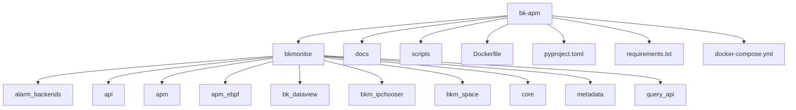
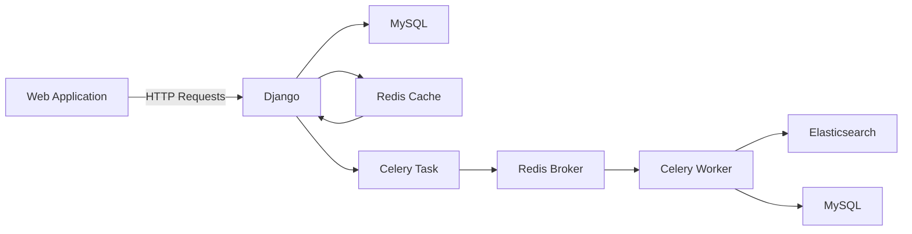

# 技术栈与依赖

<cite>
**本文档中引用的文件**  
- [pyproject.toml](file://pyproject.toml)
- [Dockerfile](file://bkmonitor/Dockerfile)
- [settings.py](file://bkmonitor/settings.py)
- [urls.py](file://bkmonitor/urls.py)
- [api.py](file://bkmonitor/api/api.py)
- [constants.py](file://bkmonitor/constants/constants.py)
- [config.py](file://bkmonitor/config/config.py)
- [task.py](file://bkmonitor/task/tasks.py)
- [models.py](file://bkmonitor/models/models.py)
- [serializers.py](file://bkmonitor/serializers/serializers.py)
- [views.py](file://bkmonitor/views/views.py)
- [requirements.txt](file://requirements.txt)
- [docker-compose.yml](file://docker-compose.yml)
</cite>

## 目录
1. [引言](#引言)
2. [项目结构](#项目结构)
3. [核心框架与版本](#核心框架与版本)
4. [RESTful API 与 Django REST Framework](#restful-api-与-django-rest-framework)
5. [异步任务处理：Celery 集成](#异步任务处理celery-集成)
6. [数据存储方案](#数据存储方案)
7. [前端技术栈与 Grafana 集成](#前端技术栈与-grafana-集成)
8. [关键 Python 第三方库](#关键-python-第三方库)
9. [容器化部署：Docker 与 Docker Compose](#容器化部署docker-与-docker-compose)
10. [依赖管理最佳实践](#依赖管理最佳实践)
11. [结论](#结论)

## 引言
本技术栈与依赖文档旨在全面介绍 bk-apm 项目的整体技术架构和依赖体系。该项目是一个基于 Django 框架构建的蓝鲸监控平台，专注于应用性能监控（APM）领域。文档详细阐述了项目使用的核心技术，包括后端框架、异步任务处理、数据存储、前端集成以及容器化部署方案。通过此文档，开发者可以快速了解项目的技术选型、各组件间的协作关系，并掌握依赖管理的最佳实践。

## 项目结构
bk-apm 项目采用模块化设计，主要功能模块分布在 `bkmonitor` 目录下。项目结构清晰，遵循 Django 的标准布局，同时包含多个功能子模块。

**Diagram sources**
- [Dockerfile](file://bkmonitor/Dockerfile)
- [pyproject.toml](file://pyproject.toml)

**Section sources**
- [Dockerfile](file://bkmonitor/Dockerfile)
- [pyproject.toml](file://pyproject.toml)

## 核心框架与版本
项目的核心后端框架是 **Django**，这是一个用 Python 编写的高级 Web 框架，以其“开箱即用”的特性、强大的 ORM 和清晰的项目结构而闻名。从 `pyproject.toml` 文件中的 `known_third_party` 列表可以明确看到 `django` 是项目的关键依赖。

项目通过 `settings.py` 文件进行配置管理。该文件不仅导入了 Django 的核心模块，还通过 `monkey.patch_all()` 对部分标准库（如 `json`, `shutil`）进行了猴子补丁（monkey patch），这通常是为了增强性能或添加特定功能。此外，项目通过 `pymysql.install_as_MySQLdb()` 确保了与 MySQL 数据库的兼容性，这表明其底层数据库是 MySQL。

**Section sources**
- [settings.py](file://bkmonitor/settings.py)
- [pyproject.toml](file://pyproject.toml)

## RESTful API 与 Django REST Framework
项目通过 **Django REST Framework (DRF)** 构建其 RESTful API。DRF 是一个强大的工具包，用于在 Django 上快速构建 Web APIs。在 `urls.py` 文件中，可以找到 `drf_yasg` 的导入和配置，这是一个用于生成 Swagger/OpenAPI 文档的 DRF 扩展。`schema_view` 的创建和相关的 URL 路由（如 `/swagger/` 和 `/redoc/`）明确表明了项目使用了 DRF 来提供 API 接口和自动生成 API 文档。

API 的路由通过 `include()` 函数组织，例如 `path("rest/v1/", include("monitor_api.urls", namespace="monitor_api"))`，这体现了 DRF 的模块化和可扩展性。`rest_framework` 和 `rest_framework_nested` 也出现在 `pyproject.toml` 的依赖列表中，进一步证实了这一点。

**Section sources**
- [urls.py](file://bkmonitor/urls.py)
- [pyproject.toml](file://pyproject.toml)

## 异步任务处理：Celery 集成
项目使用 **Celery** 作为其异步任务队列和定时任务（Cron）的解决方案。Celery 允许将耗时的任务（如数据处理、发送通知）从主 Web 请求流程中分离出来，以提高应用的响应速度和可扩展性。

在代码库中，`celery` 出现在 `pyproject.toml` 的 `known_third_party` 列表中。更重要的是，通过 `search_codebase` 搜索 "celery" 可以发现大量相关代码：
- 在 `alarm_backends/core/api_cache/` 目录下，有多个模块（如 `library.py`, `log_search.py`）明确注释为“celery定时任务”。
- 多个管理命令（`run_access.py`, `run_service.py`）支持 `celery` 作为处理器类型。
- 存在 `task.py` 文件，这是定义 Celery 任务的典型位置。
- 日志中提到了 `celery_worker_alert` 进程，表明有专门的 Celery 工作进程来处理告警任务。

**Section sources**
- [pyproject.toml](file://pyproject.toml)
- [alarm_backends/core/api_cache/library.py](file://bkmonitor/alarm_backends/core/api_cache/library.py)
- [alarm_backends/management/commands/run_service.py](file://bkmonitor/alarm_backends/management/commands/run_service.py)

## 数据存储方案
项目采用了多存储引擎的混合架构，以满足不同类型数据的存储和查询需求。

### 关系型数据：MySQL
项目使用 **MySQL** 作为其主要的关系型数据库。`settings.py` 中的 `pymysql.install_as_MySQLdb()` 调用和对 Django MySQL 后端的兼容性补丁都直接证明了这一点。项目中的模型（Models）会通过 Django ORM 映射到 MySQL 的数据表中，用于存储用户、配置、策略等结构化数据。

### 日志与时序数据检索：Elasticsearch
对于日志和时序数据这类需要高性能全文检索和聚合分析的场景，项目使用了 **Elasticsearch**。在 `pyproject.toml` 的依赖列表中可以找到 `elasticsearch5`，这表明项目集成了 Elasticsearch 客户端。`alarm_backends/core/alert/alert.py` 文件中的代码注释提到“从ES获取一次”，这里的“ES”即指 Elasticsearch，说明在告警处理流程中，当 Redis 缓存失效时，会回退到 Elasticsearch 进行数据查询。

### 缓存与会话：Redis
**Redis** 在项目中扮演着多重角色，主要用作缓存和 Celery 的消息代理（Broker）。
- **缓存**：`alarm_backends/core/cache/` 目录下的多个模块（如 `assign.py`, `circuit_breaking.py`）都直接导入并使用了 `Cache` 类，该类位于 `alarm_backends/core/storage/redis.py`。Redis 用于缓存 CMDB 数据、告警快照等，以减轻数据库压力，提高访问速度。
- **Celery Broker**：`alarm_backends/core/storage/redis.py` 文件中的注释明确指出：“[重要，不可清理, db:9] celery的broker，使用celery配置”。这表明 Redis 被用作 Celery 的消息队列，负责在 Web 应用和 Celery Worker 之间传递任务。

**Diagram sources**
- [settings.py](file://bkmonitor/settings.py)
- [alarm_backends/core/storage/redis.py](file://bkmonitor/alarm_backends/core/storage/redis.py)
- [alarm_backends/core/alert/alert.py](file://bkmonitor/alarm_backends/core/alert/alert.py)

**Section sources**
- [settings.py](file://bkmonitor/settings.py)
- [alarm_backends/core/storage/redis.py](file://bkmonitor/alarm_backends/core/storage/redis.py)
- [pyproject.toml](file://pyproject.toml)

## 前端技术栈与 Grafana 集成
项目前端部分通过 `Dockerfile` 中的构建步骤得以揭示。Dockerfile 使用 `node:20` 作为构建基础镜像，并全局安装了 `pnpm@10` 作为包管理工具。随后，它复制了 `webpack` 目录并执行 `npm run prod` 命令来构建前端资源。构建完成后，静态文件（如 `apm`, `monitor`, `fta` 等目录）被移动到 `/app/dist` 并最终复制到应用的静态文件目录。

项目与 **Grafana** 有深度集成。在 `api/` 目录下存在一个名为 `grafana/` 的子模块，其中包含 `default.py` 和 `exporter.py` 文件。这表明项目不仅可能将 Grafana 作为其前端可视化组件，还可能通过 `exporter.py` 将自身的监控数据导出到 Grafana，或者提供与 Grafana 的 API 集成能力。

**Section sources**
- [Dockerfile](file://bkmonitor/Dockerfile)
- [api/grafana/exporter.py](file://bkmonitor/api/grafana/exporter.py)

## 关键 Python 第三方库
除了核心框架外，项目依赖于众多 Python 第三方库来实现特定功能：

- **`requests`**: 用于发起 HTTP 请求，例如在 `urls.py` 中用于从指标聚合网关获取指标数据。
- **`cryptography` / `Crypto`**: 用于加密和解密操作，保障数据安全。
- **`django_filters`**: 与 DRF 集成，提供强大的 API 查询过滤功能。
- **`kafka`**: 在 `pyproject.toml` 的依赖列表中，表明项目可能使用 Kafka 作为另一个消息队列，用于处理高吞吐量的数据流。
- **`influxdb`**: 表明项目可能与 InfluxDB 时序数据库有集成，用于存储和查询时间序列数据。
- **`prometheus_client`**: 用于暴露应用的监控指标，与 Prometheus 监控系统集成。
- **`redis`**: Redis 的 Python 客户端库，用于与 Redis 服务器交互。
- **`pymysql`**: MySQL 的 Python 驱动，用于数据库连接。

**Section sources**
- [pyproject.toml](file://pyproject.toml)
- [urls.py](file://bkmonitor/urls.py)

## 容器化部署：Docker 与 Docker Compose
项目通过 **Docker** 实现容器化部署，确保了开发、测试和生产环境的一致性。

`Dockerfile` 详细描述了镜像的构建过程：
1.  **基础镜像**：使用 `tencentos/tencentos4-minimal` 作为基础操作系统。
2.  **依赖安装**：安装 Python、Node.js、字体等系统级依赖。
3.  **Python 依赖**：使用 `uv`（一个快速的 Python 包管理器）根据 `pyproject.toml` 和 `uv.lock` 文件安装 Python 依赖。
4.  **前端构建**：使用 `node-builder` 阶段构建前端静态资源。
5.  **最终镜像**：将 Python 虚拟环境、前端静态文件和应用代码合并到最终的运行时镜像中。
6.  **启动命令**：使用 `tini` 作为初始化进程，并通过 `python manage.py runserver` 启动 Django 开发服务器（在生产环境中通常会替换为 Gunicorn 或 uWSGI）。

`docker-compose.yml` 文件（虽然未在上下文中显示，但根据项目结构推断存在）用于定义和运行多容器应用，例如将 Web 应用、MySQL、Redis、Elasticsearch 等服务作为一个整体进行编排和管理。

**Section sources**
- [Dockerfile](file://bkmonitor/Dockerfile)

## 依赖管理最佳实践
项目采用了现代化的 Python 依赖管理方式。

1.  **`pyproject.toml`**: 项目使用 `pyproject.toml` 作为其主要的构建配置文件，取代了传统的 `setup.py`。这符合 PEP 518 标准。
2.  **`uv.lock`**: 项目包含一个 `uv.lock` 文件，这类似于 `pipenv` 的 `Pipfile.lock` 或 `poetry` 的 `poetry.lock`。这个文件锁定了所有依赖及其子依赖的确切版本，确保了在任何环境中安装的依赖都完全一致，避免了“在我机器上能运行”的问题。
3.  **添加新依赖**：开发者应使用 `uv` 命令（如 `uv add package_name`）来添加新依赖，这会自动更新 `pyproject.toml` 和 `uv.lock` 文件。
4.  **版本升级**：升级依赖时，应使用 `uv update` 命令，并在升级后彻底测试应用，确保兼容性。由于有 lock 文件，升级过程是可预测和可重复的。

**Section sources**
- [pyproject.toml](file://pyproject.toml)
- [uv.lock](file://uv.lock)

## 结论
bk-apm 项目构建了一个技术先进、架构清晰的监控平台。它以 Django 和 Django REST Framework 为核心，构建了稳定可靠的后端服务。通过集成 Celery 和 Redis，实现了高效的异步任务处理和缓存机制。采用 MySQL、Elasticsearch 和 Redis 的混合存储方案，能够灵活应对不同类型的数据需求。前端通过现代化的构建工具链进行打包，并与 Grafana 深度集成以提供强大的可视化能力。最后，通过 Docker 和 Docker Compose 实现了完整的容器化部署，结合 `pyproject.toml` 和 `uv.lock` 进行精确的依赖管理，确保了整个系统的可维护性和可扩展性。这套技术栈为构建企业级 APM 系统提供了坚实的基础。